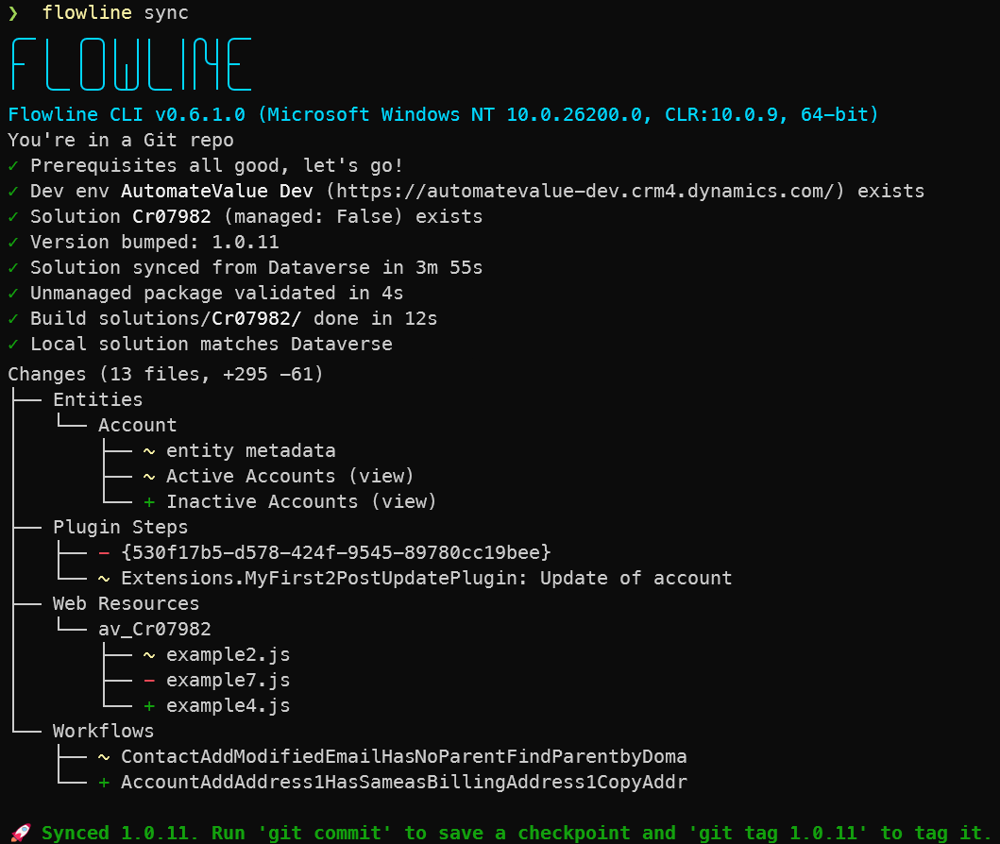

# Flowline

<table>
<tr>
<td>

**Flowline** is a Dataverse ALM CLI — structured workflow, Git-tracked solutions,
and a fast push to DEV without the enterprise overhead.

[](https://github.com/RemyDuijkeren/Flowline/wiki)
[](https://github.com/RemyDuijkeren/Flowline/workflows/CI/badge.svg)
[](https://www.nuget.org/packages/Flowline)
[](https://www.nuget.org/packages/Flowline)

</td>
<td width="120" align="right" valign="top">


</td>
</tr>
</table>

---

**PAC CLI gives you the primitives — Flowline gives you the workflow.**

Attribute-driven plugin registration that covers Custom APIs, a full Git-based ALM loop from dev to prod, and automatic web resource dependency registration — in one tool. Where PAC CLI already handles it, Flowline wraps — it doesn't re-implement. Unlike Power Platform Pipelines, Flowline requires neither Managed Environments nor managed solutions.

Familiar with [spkl](https://github.com/scottdurow/SparkleXrm/wiki/spkl)? Flowline is its actively maintained successor (last meaningful commit 2021).

What sets Flowline apart:

- **Attribute-driven plugin registration** — decorate your `IPlugin` classes with `[Step]`, `[Filter]`, `[CustomApi]`; Flowline reads the assembly and handles every Dataverse registration. No Plugin Registration Tool, no `spkl.json`, no boilerplate.
- **Web resource dependencies auto-wired** — RESX files linked to parent JS by base name; `// flowline:depends` for JS-to-JS; registered on every `push`. No Maker Portal visits, no manual dependency trees.
- **Source is the truth — always** — steps, step images, and web resources missing from source are deleted from Dataverse on every `push`. No stale registrations, no ghost records, no manual cleanup.
- **AI-native schema context** — `sync` writes `DATAVERSE_CONTEXT.md` with your full schema (entities, attributes, option sets, forms, views, plugin steps); Claude Code, Copilot, and Codex load it automatically via `AGENTS.md`. Your AI assistant knows your field names without live queries.
- **Human-readable sync summary** — `sync` translates the XML diff into plain language: what changed, what was added, what was removed — attribute-level detail included. You know exactly what happened before you commit.
- **Scaffolded WebResources project** — `clone` creates a TypeScript + Rollup project wired to `push` from day one. No boilerplate, no manual configuration. Swap in any bundler you prefer.
- **Dry-run before you touch anything** — `--dry-run` shows exactly what would change before a single Dataverse record is touched. Run it as a CI safety gate or any time you want confidence. No other Dataverse ALM tool offers this.
- **Zero-friction auth** — reuses the PAC CLI profiles you already have. Switch environments by switching profiles. Works in CI with service principals out of the box.
- **One-command environment provisioning** — `provision` copies PROD to a fresh DEV or TEST environment. No admin center clicks, no configuration drift.



> Pipelines are buried steel — permits, compressors, years to commission. A flowline goes where the pipeline can't.

---

## Install

```bash
dotnet tool install --global Flowline
```

Prerequisites: [.NET SDK](https://dot.net) (8 or later), [Git](https://git-scm.com), and PAC CLI:

```bash
dotnet tool install --global Microsoft.PowerApps.CLI.Tool
```

If .NET 10 is installed, Flowline uses dnx — no separate PAC CLI install needed.

Authenticate before using Flowline:

```bash
pac auth create --environment https://your-org.crm4.dynamics.com
```

---

## Quick start

```bash
# Bootstrap an existing solution into the repo
flowline clone ContosoSales --prod https://contoso.crm4.dynamics.com

# Daily dev loop
flowline push
flowline sync
git commit -m "feat: add validation"

# Promote
flowline deploy test
flowline deploy prod
```

For full setup, auth, and project workflow: **[Getting Started](https://github.com/RemyDuijkeren/Flowline/wiki/01-Getting-Started)**

---

## Commands

| Command | What it does |
|---|---|
| [`clone <solution>`](https://github.com/RemyDuijkeren/Flowline/wiki/03-Command-Reference#clone) | Bootstrap an existing solution from Dataverse into the repo |
| [`push [solution]`](https://github.com/RemyDuijkeren/Flowline/wiki/03-Command-Reference#push) | Build and sync code assets to DEV; or push standalone with `--pluginFile` / `--webresources` |
| [`sync [solution]`](https://github.com/RemyDuijkeren/Flowline/wiki/03-Command-Reference#sync) | Pull the current solution state from DEV into source control |
| [`deploy <target>`](https://github.com/RemyDuijkeren/Flowline/wiki/03-Command-Reference#deploy) | Pack from the repo and import into `test`, `uat`, `prod`, or a URL |
| [`provision [dev\|test]`](https://github.com/RemyDuijkeren/Flowline/wiki/03-Command-Reference#provision) | Provision a DEV or TEST environment by copying from production |
| [`generate [solution]`](https://github.com/RemyDuijkeren/Flowline/wiki/05-Generate-Early-Bound-Types) | Generate early-bound C# types into `Plugins/Models/` (configurable with `--output`) |
| [`status`](https://github.com/RemyDuijkeren/Flowline/wiki/03-Command-Reference#status) | Show environment info, Flowline version, and PAC CLI status |

**Plugin attributes NuGet:** [Flowline.Attributes](src/Flowline.Attributes/README.md) — add to your plugin project to use `[Step]`, `[Filter]`, `[CustomApi]`, and friends — full reference: [Plugin Registration](https://github.com/RemyDuijkeren/Flowline/wiki/04-Plugin-Registration)

See the [Wiki for the full documentation.](https://github.com/RemyDuijkeren/Flowline/wiki)

Coming from another tool? [Migration from spkl](https://github.com/RemyDuijkeren/Flowline/wiki/10-Migration-from-spkl) · [Migration from Daxif](https://github.com/RemyDuijkeren/Flowline/wiki/11-Migration-from-Daxif) · [Migration from PACX](https://github.com/RemyDuijkeren/Flowline/wiki/12-Migration-from-PACX)
