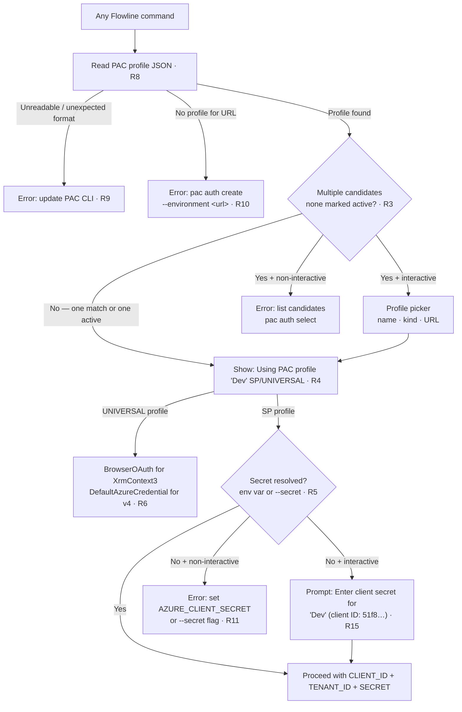

# Auth Strategy

## Summary

Establish PAC-as-oracle as the single, explicit auth contract across all Flowline commands. Simplify `generate` by removing four xrm-specific auth params and deriving all generator credentials from the PAC profile automatically. Add resilience so Flowline degrades gracefully if PAC changes its internal profile format. Remove ROPC.

---

## Problem Frame

Flowline connects to Dataverse in two ways: its own `ServiceClient` (used by `sync`, `deploy`, `environment`, and others), and generator subprocesses (`generate` command). Both currently read PAC auth profiles to drive auth, but the generator path requires the user to configure auth a second time via `--xrm-client-id`, `--xrm-client-secret`, `--username`, or `--password`. The PAC profile already contains the information needed — the extra params are redundant in the common case.

**PAC auth profiles** come in two kinds. A **UNIVERSAL profile** is created via browser/user login (`pac auth create` with no `--applicationId`). It stores the user's identity and an MSAL token cache entry, and can connect to any Dataverse environment the user has been granted access to. Multiple UNIVERSAL profiles can exist — one per named environment (`Prod`, `Dev`, etc.) — each pointing to a different URL but using the same underlying user account. A **ServicePrincipal profile** is created with an application ID and tenant, used for headless/CI scenarios. PAC marks one or more profiles as "active" (`*` in `pac auth list`); active is a hint that a profile is the current default, consistent with what `pac push` uses when no environment is specified explicitly.

**ROPC** (Resource Owner Password Credentials) is the OAuth flow behind `--username` / `--password`. Instead of opening a browser, it sends the user's actual username and password directly to the token endpoint. This flow does not support multi-factor authentication (MFA): if MFA is enforced on the tenant (which Microsoft now enables by default), ROPC fails with `AADSTS50076`. It is also actively discouraged by Microsoft.

Flowline reads PAC's internal profile JSON directly from disk. This is not a documented, stable public API — it is PAC CLI's implementation detail. If PAC changes its storage format (path, field names, encryption), Flowline's Dataverse connection fails across all commands, not just `generate`. This risk is low (Microsoft rarely breaks this in practice), but it deserves an explicit mitigation and graceful error handling.

XrmContext3 uses ADAL v4 internally (an older Microsoft auth library). Flowline uses MSAL (the current library, also used by PAC CLI). ADAL and MSAL token caches are incompatible — MSAL tokens cannot be injected into an ADAL session. Flowline cannot hand a cached PAC token to XrmContext3; the exe must acquire its own token via its own auth flow.

XrmContext v4 uses `DefaultAzureCredential` from Azure.Identity. Its token acquisition is internal to the subprocess; Flowline drives it by setting environment variables before launch.

---

## Key Decisions

**PAC-as-oracle for all commands.** PAC profile is the single credential source for every Flowline command that connects to Dataverse. Flowline reads the profile for the target environment URL and derives credentials from it. Users set up auth once via `pac auth create`.

**Prefer the PAC-active profile when multiple profiles match.** When multiple profiles share the same environment URL, Flowline should prefer the profile PAC has marked as active (`*`) to stay consistent with how `pac push` behaves. If multiple profiles are both active for the same URL (an unusual but valid state), the first one wins. If no URL-specific profile matches, fall back to the first UNIVERSAL profile.

**Keep direct file reads for PAC profiles; add graceful error handling.** `pac auth list` does not support JSON output and takes 4–6 seconds per invocation — far too slow for a call that would precede every Dataverse operation. Direct JSON file reads are milliseconds and already work. The resilience requirement is met by detecting an unexpected file format and failing with a clear error naming the PAC CLI version, rather than by switching data sources.

**Drop ROPC.** It fails on MFA-enabled tenants (AADSTS50076) and Microsoft recommends against it. The `--username` and `--password` params are removed without a terminal-prompt replacement; browser OAuth is the interactive path.

**XrmContext3 always uses BrowserOAuth for UNIVERSAL profiles.** MSAL→ADAL token injection is impossible. The only working interactive path for UNIVERSAL users is ADAL's own browser OAuth via `/method:OAuth` with the PAC CLI App ID. ADAL caches the token after the first login; subsequent runs reuse it without opening a browser.

**XrmContext3 with SP profile: verify ClientSecret method.** Passing PAC profile `ApplicationId` + `AZURE_CLIENT_SECRET` directly as XrmContext3 CLI args (`/method:ClientSecret`) is different from token cache injection (which is confirmed impossible). This explicit-credential path needs a test run to confirm. See Outstanding Questions.

**XrmContext v4 auth is unchanged.** SP profile → inject `AZURE_CLIENT_ID` + `AZURE_TENANT_ID` from profile + `AZURE_CLIENT_SECRET` from env. UNIVERSAL profile → no injection; `DefaultAzureCredential` inherits the parent environment and finds credentials via its own chain (Windows: `SharedTokenCacheCredential` finds PAC's MSAL cache; Linux/Mac: falls through to `AzureCliCredential` or `InteractiveBrowserCredential`).

**Simplified override: two params replace four.** `--client-id` + `--secret` allow explicit SP credential override on `generate` when no PAC profile is available. They replace `--xrm-client-id`, `--xrm-client-secret`, `--username`, and `--password`.

---

## Actors

- A1. Developer — interactive, local machine (Windows, Linux, or Mac), uses personal credentials or SP.
- A2. CI pipeline — non-interactive, always SP, runs `pac auth create` as a pipeline step before Flowline commands.

---

## Requirements

**Core: credential resolution (all commands)**

- R1. All Flowline commands that connect to Dataverse use PAC profile as the single credential source.
- R2. Flowline resolves auth from the PAC profile matching the target environment URL; when multiple profiles match, prefer the one PAC has marked as active. If no URL-specific profile matches, fall back to the active UNIVERSAL profile. Active detection: compare each candidate against `Current["UNIVERSAL"]` (or `Current["ServicePrincipal"]`) in `authprofiles_v2.json` — the `Current` dictionary already maps Kind → active profile. `PacAuthProfiles.Current` is already deserialized by Flowline; `FindBestProfile` needs to be updated to use it.
- R3. When profile selection is ambiguous — multiple candidates match and none is marked active — Flowline must not silently pick one. In interactive mode: present a profile picker (name, kind, URL) and let the user choose. In non-interactive mode: fail with the list of candidates and instruct the user to set one active via `pac auth select`.
- R4. Always show which profile was selected before proceeding — a single status line so the user can catch the wrong choice without digging into verbose output. Show name if set, `(unnamed)` if not: e.g. `Using PAC profile 'Dev' (UNIVERSAL)` or `Using PAC profile (unnamed, UNIVERSAL) — https://automatevalue-dev.crm4.dynamics.com/`. Applies in both interactive and non-interactive mode.
- R5. For SP profiles: `ApplicationId` and `TenantId` are read from the profile; the client secret is never stored in PAC profiles or `.flowline` — always resolved from process env or runtime input (see R15).
- R6. For UNIVERSAL profiles: Flowline uses the PAC CLI App ID for XrmContext3 BrowserOAuth, and inherits the parent environment for XrmContext v4 `DefaultAzureCredential`.
- R7. In verbose mode, Flowline logs which PAC profile was matched, which auth method was derived, and for which command.
- R7a. If the selected profile's `ExpiresOn` is in the past, emit a warning before proceeding: `PAC profile 'Dev' token may be expired — run pac auth create --environment <url> to refresh.` Do not skip the profile; PAC may still be able to refresh the token silently. The warning surfaces a likely cause if the connection subsequently fails.

**Core: PAC profile resilience (all commands)**

- R8. Flowline reads PAC profiles from the JSON file on disk (existing approach — fast, correct).
- R9. If the profile file is missing, unreadable, or its format is unexpected, Flowline fails with a clear error message that names the PAC CLI version in use and directs the user to update PAC CLI or report a bug.
- R10. If no PAC profile is found for the target environment URL, fail immediately with a clear error that includes the exact `pac auth create` command with `--environment <url>` and a `--name` suggestion derived from the URL host segment (e.g. `automatevalue-dev.crm4.dynamics.com` → `"AutomateValue-Dev"`) — for all commands. XrmContext v4 and XrmContext3 generators have their own built-in browser auth that operates independently of PAC profile lookup (via `DefaultAzureCredential` and ADAL OAuth respectively), so no separate Flowline-level browser fallback is needed for `generate`.
- R11. SP profile present but no secret resolved (no env var, no `--secret` flag, no interactive prompt answered): fail with a clear message before attempting any generator or Dataverse connection.

**`generate`: CLI surface**

- R12. Remove `--xrm-client-id`, `--xrm-client-secret`, `--username`, and `--password` from `generate`.
- R13. Add `--client-id` and `--secret` to `generate` for XrmContext3 and XrmContext v4 only. These flags override only the credentials forwarded to the generator subprocess — the PAC profile is still read and used for environment URL resolution and solution validation. The PAC generator ignores these flags entirely (it uses PAC CLI's own auth). Two usages:
  - `--secret` alone: PAC profile supplies `ClientId`/`TenantId`; `--secret` replaces `AZURE_CLIENT_SECRET` as the secret for the generator call. Error if the matched profile is UNIVERSAL (non-SP), since there is no `ClientId` to pair with.
  - `--client-id` + `--secret` together: override the generator subprocess credentials entirely — `ClientId`/`TenantId` from `--client-id` instead of the PAC profile, `--secret` as the secret. PAC profile is still read for environment and solution validation.
  - `--client-id` without `--secret`: error immediately — these two flags only make sense together.
- R14. The recommended path for SP auth is `pac auth create --applicationId <id> --tenant <tenant>` plus `AZURE_CLIENT_SECRET` in the process environment. `--secret` is a convenience alternative when setting the env var is impractical, but env var is preferred: CLI args appear in shell history and process lists, whereas env vars can be masked in CI/CD pipeline logs.
- R15. When a client secret is needed but neither `AZURE_CLIENT_SECRET` nor `--secret` is provided, and Flowline is in interactive mode: prompt the user for the secret using a masked input (Spectre.Console `TextPrompt.Secret()`). The prompt must display the PAC profile name (if set) and the client ID so the user knows which service principal's secret to enter — e.g. `Enter client secret for 'Dev' (client ID: 51f81489-…):`. The prompted secret is held in memory for that invocation only — never written to disk, `.flowline`, or any log. In non-interactive mode (CI), skip the prompt and fail immediately with an error naming both resolution paths (`AZURE_CLIENT_SECRET` env var or `--secret` flag).

**`generate`: ROPC removal**

- R16. Remove ROPC auth entirely. `--username` / `--password` are removed without a terminal-prompt replacement; browser OAuth is the interactive path.

**`generate`: XrmContext3**

- R17. UNIVERSAL profile: auto-use BrowserOAuth with PAC CLI App ID as the OAuth client — the user still authenticates with their own personal Azure AD credentials in the browser. PAC's App ID (`51f81489-12ee-4a9e-aaae-a2591f45987d`) is used because it is already registered with Dataverse permissions; no custom app registration is required.
- R18. SP profile: attempt ClientSecret method using `ApplicationId` from profile + secret (from `AZURE_CLIENT_SECRET` env var, `--secret` flag, or interactive prompt per R15) — see Q1 in Outstanding Questions.
- R19. Non-interactive mode with no SP credentials available: fail with an error recommending upgrade to XrmContext v4.

**`generate`: XrmContext v4**

- R20. SP profile: inject `AZURE_CLIENT_ID` + `AZURE_TENANT_ID` from profile into subprocess env; secret injected from `AZURE_CLIENT_SECRET` env var, or from `--secret` flag if env var is absent.
- R21. UNIVERSAL profile: no env injection; `DefaultAzureCredential` resolves credentials from its own chain (existing behaviour, unchanged).

**Documentation**

Auth is consistently the hardest part of getting started with any CLI tool. The Wiki Authentication page must be comprehensive enough that users can self-serve without needing to ask for help.

- R22. Rewrite the Wiki `Authentication.md` page alongside the code changes (the existing page is thin and outdated). The page must cover all of the following in detail:
  - How PAC profiles work (UNIVERSAL vs ServicePrincipal, what `pac auth create` does, what gets stored in the profile)
  - Step-by-step setup for each auth scenario: interactive developer (UNIVERSAL), service principal for CI, and manual SP override via `--client-id`/`--secret`
  - Which generators support which auth paths (PAC generator vs XrmContext generators)
  - Why `AZURE_CLIENT_SECRET` must be an env var and never stored in config
  - Platform notes: what works on Windows vs Linux/Mac and why (SharedTokenCacheCredential, ADAL browser limitation)
  - How multiple PAC profiles are resolved (URL match → active preference → UNIVERSAL fallback → ambiguous picker)
  - Troubleshooting section: common errors and their fix commands (`No PAC auth profile found`, `AZURE_CLIENT_SECRET is required`, `--secret requires a service principal profile`, ambiguous profile list)
- R23. CLI error messages must include enough context that a user can resolve the issue without reading the Wiki — error text should name the exact command to run and, where relevant, link or reference the Wiki Authentication page. When directing users to create a PAC profile, include a `--name` suggestion derived from the project or environment so the profile is identifiable in `pac auth list`, e.g.:
  ```
  No PAC auth profile found for https://automatevalue-dev.crm4.dynamics.com/
  Run: pac auth create --environment https://automatevalue-dev.crm4.dynamics.com/ --name "AutomateValue-Dev"
  ```

---

## Key Flows



> **`flowline generate` — XrmContext/XrmContext3 credential override (R13):** the flow above always runs in full, including the PAC profile read (needed for environment URL resolution and solution validation). `--client-id` and `--secret` only affect what credentials are forwarded to the generator subprocess — they do not skip profile lookup. `--secret` alone overrides the secret while keeping `ClientId`/`TenantId` from the PAC SP profile. `--client-id` + `--secret` together override the generator subprocess credentials entirely while the PAC profile is still used for environment and solution validation.

- F1. Developer, UNIVERSAL, XrmContext v4 (Windows) — profile JSON read → UNIVERSAL selected → status shown → no env injection → subprocess inherits env → `DefaultAzureCredential` → `SharedTokenCacheCredential` finds PAC MSAL cache → zero-config.
- F2. Developer, UNIVERSAL, XrmContext v4 (Linux/Mac) — same as F1 until `SharedTokenCacheCredential` (Windows-only) is skipped; `AzureCliCredential` or `InteractiveBrowserCredential` handles it.
- F3. Developer, UNIVERSAL, XrmContext3 — BrowserOAuth using PAC's Azure AD app registration as the OAuth client (`AppId: 51f81489-…`); user logs in with their own personal credentials in the browser. ADAL caches the token after first login; subsequent runs reuse the cache silently. The PAC App ID is used because it is already registered with the right Dataverse permissions — no custom app registration needed.
- F4. Developer/CI, SP profile, secret in env — `AZURE_CLIENT_SECRET` in env → SP credentials injected for generators and ServiceClient.
- F5. Developer, SP profile, no secret, interactive — prompt shown with profile name and client ID; developer pastes secret → continues.
- F6. CI, SP profile, no secret — fails before any Dataverse call with exact env var and flag names.
- F7. Developer, multiple profiles for URL, none active, interactive — profile picker shown; user selects; selected profile displayed.
- F8. Any command, no PAC profile found — error with `pac auth create --environment <url>` command.
- F9. PAC profile file unreadable or schema changed — error naming PAC CLI version with update guidance.

---

## Acceptance Examples

- AE1. SP profile, `AZURE_CLIENT_SECRET` env var set → XrmContext3: ClientSecret method; XrmContext v4: `AZURE_CLIENT_ID` + `AZURE_TENANT_ID` + secret injected. **Covers R5, R18, R20.**
- AE2. SP profile, no `AZURE_CLIENT_SECRET` env var, `--secret` flag set → same as AE1 but secret from `--secret`. **Covers R13, R18, R20.**
- AE3. SP profile, no secret anywhere, interactive mode → masked prompt showing profile name + client ID; user enters secret → continues. **Covers R15.**
- AE4. SP profile, no secret, non-interactive mode → error: `AZURE_CLIENT_SECRET env var or --secret flag required`. **Covers R11, R15.**
- AE5. UNIVERSAL profile, Windows → XrmContext3: browser opens once, subsequent runs silent; XrmContext v4: `DefaultAzureCredential` uses PAC MSAL cache. **Covers R6, R17, R21.**
- AE6. UNIVERSAL profile, Linux/Mac → XrmContext v4: `AzureCliCredential` or `InteractiveBrowserCredential`. **Covers R6, R21.**
- AE7. No PAC profile found for target URL → error includes full `pac auth create` command with `--environment` and `--name` suggestion, e.g. `Run: pac auth create --environment https://automatevalue-dev.crm4.dynamics.com/ --name "AutomateValue-Dev"`. **Covers R10, R23.**
- AE8. Multiple profiles for URL, none active, interactive mode → profile picker shown; user selects. **Covers R3.**
- AE9. Multiple profiles for URL, none active, non-interactive mode → error with candidate list and `pac auth select` guidance. **Covers R3.**
- AE10. `--client-id` + `--secret` provided on `generate` with XrmContext/XrmContext3 → PAC profile still read for environment and solution validation; generator subprocess receives `--client-id`/`--secret` credentials instead of profile-derived ones. **Covers R13.**
- AE11. `--secret` alone with UNIVERSAL (non-SP) profile → error: `--secret requires a service principal profile or --client-id`. **Covers R13.**
- AE12. PAC profile file has unexpected format or missing fields → error naming PAC CLI version with update guidance. **Covers R9.**

---

## Scope Boundaries

Deferred for later:
- `AZURE_*` env vars as standalone SP auth without any PAC profile (CI-without-PAC-setup path).
- Azure CLI (`az login`) as an independent Flowline auth source.
- Saving auth overrides to `.flowline` config.
- DefaultAzureCredential as the Dataverse ServiceClient token provider (would enable Linux/Mac UNIVERSAL support without `az login`, but larger change; not needed until Linux/Mac is a real target).

Outside scope:
- Replacing PAC CLI as a dependency — PAC is required for pack/unpack/push/pull.
- Flowline is read-only on PAC profiles. Profile management — create, rename, select, delete — stays entirely with PAC CLI. Flowline's role is to advise: when no profile is found, the error includes the exact `pac auth create` command with `--environment` and a suggested `--name` derived from the URL host. When a selected profile has no name (`Name: ""`), Flowline shows it as `(unnamed)` in the status line — visible but not acted on.
- XrmContext3 deep auth investment — it is phasing out in favour of XrmContext v4.

---

## Dependencies / Assumptions

- PAC CLI installed and `pac auth create` run on all machines, including CI pipelines.
- `AZURE_CLIENT_SECRET` never stored in PAC profiles or `.flowline` — always injected from process env.
- XrmContext v4 auth is subprocess-internal; Flowline can only influence it via env vars, not API injection.
- MSAL (PAC CLI / Flowline .NET) and ADAL (XrmContext3) token caches are incompatible — token injection from PAC to XrmContext3 is not possible. Source: `docs/solutions/architecture-patterns/xrmcontext-v4-auth-integration.md` and prior investigation.

---

## Outstanding Questions

**Deferred to planning:**

- Q1. Does passing PAC profile `ApplicationId` + `AZURE_CLIENT_SECRET` directly to XrmContext3 via `/method:ClientSecret /mfaAppId:{id} /mfaClientSecret:{secret}` actually work? The confirmed failure was MSAL→ADAL token cache injection — a different code path. This explicit-credential path (no cache involved) was not separately verified. **Test during implementation.** If it works: R18 holds. If it fails: R17 (BrowserOAuth) is the interactive fallback; R19 (error) is non-interactive.
- Q2. Minimum supported PAC CLI version: verify which version introduced the current profile JSON schema; document it so R9's version-in-error-message is actionable.
- Q3. ~~PAC profile JSON schema: verify whether the active (`*`) marker maps to a field in the on-disk profile JSON, and whether `OperatingSystem` vs `User` type affects profile selection.~~ **Resolved.** Both questions answered by reading `authprofiles_v2.json` directly:
  - **Active marker**: stored as `Current[Kind]` in the JSON (e.g. `Current.UNIVERSAL` = the active UNIVERSAL profile object). `PacAuthProfiles.Current` is already deserialized. `FindBestProfile` needs updating to compare candidates against `Current["UNIVERSAL"]`.
  - **`ProfileType` field** (`4` = "OperatingSystem", `0` = "User"): present in the JSON but not meaningful for auth. Both are `Kind: UNIVERSAL` and work identically. The OperatingSystem profile (`ProfileType: 4`) is typically the unnamed legacy profile created during initial PAC setup — it is often expired. Flowline should ignore `ProfileType` for profile selection; active detection via `Current` is sufficient.
- Q4. ADAL browser token lifetime for XrmContext3 — whether a second `generate` run within the same interactive session reuses the ADAL-cached token without opening a browser (likely yes; confirm during implementation).
