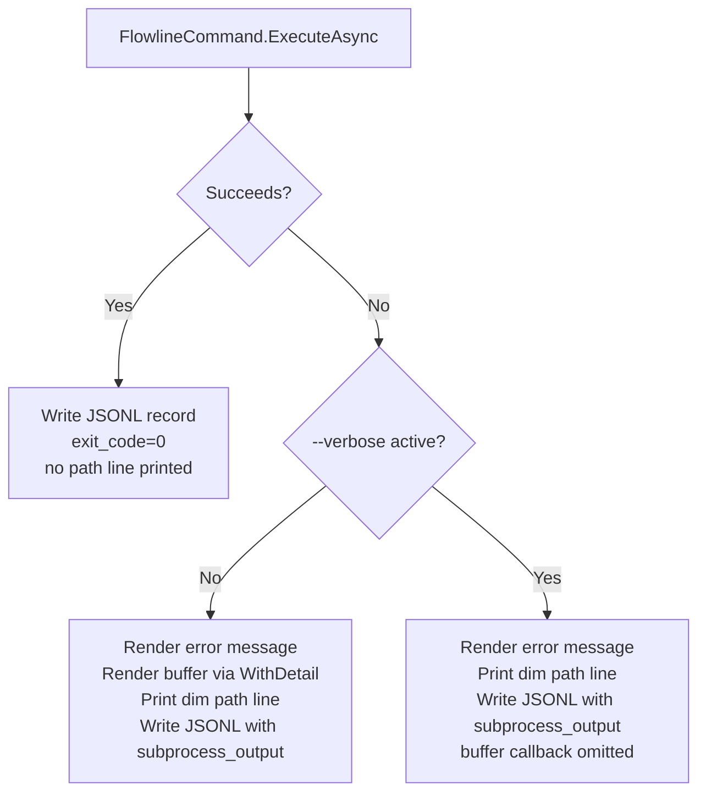

# Wave 1 CLI Observability

## Summary

Adds three complementary observability features: an always-on per-invocation JSONL run log (I1), a subprocess stderr buffer surfaced on failure (I2), and the Microsoft.Extensions.Logging infrastructure wired to a rolling debug file (I3). Together they ensure every failed command leaves a durable record and visible diagnostic context, without requiring the developer to have run `--verbose` in advance.

---

## Problem Frame

Flowline runs on developer machines and build servers. When a command fails, the only current diagnostic path is to re-run with `--verbose` and copy the terminal output. This fails when the failure cannot be reproduced on demand, when the build server's output has scrolled away, or when the developer didn't know they needed verbose. The result is bug reports with no diagnostic context.

---

## Key Decisions

- **Always-on logging, not gated on failure or `--verbose`.** Bugs surface on runs where no `--verbose` was active; the log is most valuable precisely in those cases.
- **Subprocess buffer suppressed when `--verbose` was active.** The output was already printed live — re-printing it adds noise without value.
- **ILogger infrastructure only in Wave 1; `LogDebug` call sites in Wave 2+.** The infrastructure ships first. Diagnostic content arrives incrementally as services are instrumented. The debug file exists from day one but is near-empty until Wave 2.
- **Debug file always at Debug level, not gated on `--verbose`.** Bugs surface on non-verbose runs; a Warning-only file would miss most useful detail. Level-gating on `--verbose` would reintroduce the same "re-run to get detail" problem I3 is solving.
- **ILogger output is file-only; nothing from ILogger goes to the terminal.** Flowline.Core already signals steps through Spectre.Console. ILogger is the forensic layer for internal bug investigation — a second output channel would add noise without user value.
- **File sink uses Serilog (`Serilog` + `Serilog.Extensions.Logging` + `Serilog.Sinks.File`).** A hand-rolled provider would be ~70 lines but logging failures are silent by design (R16) — a subtle bug would produce no file without any indication. Serilog's years of production use and large user base transfer that reliability for free at the cost of 3 lightweight packages with no transitive dependency sprawl.
- **Wave 1 adds a small set of domain-milestone `LogInformation` lines on the three core services.** Not entry/exit, but outcome lines: step registration counts, web resource discovery totals, diff summaries (~5–8 call sites). These verify `ILogger<T>` injection end-to-end and give the debug file immediate diagnostic value. `LogDebug` (per-item traces) and `LogWarning` (anomalies) call sites are Wave 2+.

---

## Requirements

**Run Log (I1)**

- R1. Every `FlowlineCommand.ExecuteAsync` invocation appends one JSONL record to `%LOCALAPPDATA%/Flowline/runs/<yyyy-MM-dd>.jsonl`, on success and failure alike. `--help` and `--version` are excluded — Spectre.Console.Cli handles them before `ExecuteAsync` runs.
- R2. Each record contains: UTC timestamp, command name, args (redacted), exit code, duration in milliseconds, Flowline version, cached tool versions (dotnet, pac, git from `ToolCheckResult`), path to the day's ILogger log file (`log_file`), and — on failure — exception type and message.
- R3. The storage root uses the same resolution chain as `ValidationCacheStore`: `%LOCALAPPDATA%` → `XDG_CACHE_HOME` → `~/.cache` → system temp.
- R4. Files older than 30 days are deleted at startup. The directory is created on first use.
- R5. Args are redacted using the existing `RedactSensitiveArgs` pattern before any write.
- R6. On command failure, the global exception handler appends a dim `Run log: <path>` line after the error output.

**Subprocess Capture (I2)**

- R7. `WithToolExecutionLog` maintains a rolling 50-line buffer of subprocess output (stderr primary; stdout where the subprocess routes errors there).
- R8. On non-zero subprocess exit, the buffer is attached to the `FlowlineException` via `WithDetail` and rendered in the terminal using the existing dim verbose style, between the Flowline error message and the run-log path line.
- R9. When `--verbose` was active during the run, the `WithDetail` buffer callback is omitted — the output was already printed live.
- R10. On failure, the buffer contents are also written into the JSONL record under a `subprocess_output` field.

**ILogger Infrastructure (I3)**

- R11. `Microsoft.Extensions.Logging` is registered in DI at startup.
- R12. A rolling file sink writes to `%LOCALAPPDATA%/Flowline/logs/<yyyy-MM-dd>.log` at Debug level, always-on, not gated on `--verbose`. The file uses the same directory resolution chain as R3. No ILogger output goes to the terminal.
- R13. `ILogger<T>` is constructor-injected into `PluginService`, `WebResourceService`, and `SolutionDiffService` at minimum.
- R14. Wave 1 adds `LogInformation` outcome lines at key decision points in `PluginService`, `WebResourceService`, and `SolutionDiffService` (~5–8 call sites total): step registration counts, web resource discovery totals, and diff summaries. These verify the infrastructure end-to-end. `LogDebug` call sites (per-item traces) and `LogWarning` call sites (anomalies) are Wave 2+.

**Operational Resilience**

- R16. Log and debug file write failures are silent and fire-and-forget. They must not surface exceptions or affect command outcome.
- R17. Log directory creation failures are silent and do not prevent the command from running.

---

## Key Flows

- F1. **Successful run.** ExecuteAsync completes. JSONL record written (exit_code=0, no exception fields, no subprocess_output). No path line printed.
  - **Covered by:** R1, R2, R11, R12

- F2. **Failed run, non-verbose.** ExecuteAsync throws. Buffer attached via `WithDetail`. Terminal shows: error message → subprocess buffer (dim) → `Run log: <path>` (dim). JSONL record written with exception and subprocess_output.
  - **Covered by:** R1, R2, R5, R6, R7, R8, R10

- F3. **Failed run, verbose.** Same as F2 but the `WithDetail` buffer callback is omitted — output already printed live. Terminal shows: verbose output during run → error message → `Run log: <path>` (dim). JSONL record still includes subprocess_output.
  - **Covered by:** R1, R6, R7, R9, R10

---

## Acceptance Examples

- AE1. **Non-verbose failure — buffer visible.**
  - **Covers:** R8, R9
  - **Given:** `flowline deploy` runs without `--verbose`; PAC CLI returns exit 1 with 3 lines of stderr.
  - **When:** the command fails.
  - **Then:** terminal shows the Flowline error message, followed by the 3 PAC CLI lines in dim verbose style, followed by a dim `Run log: <path>` line.

- AE2. **Verbose failure — buffer suppressed.**
  - **Covers:** R9
  - **Given:** `flowline deploy --verbose` runs; PAC CLI returns exit 1, stderr already printed live.
  - **When:** the command fails.
  - **Then:** terminal shows the Flowline error message followed by a dim `Run log: <path>` line. PAC CLI output does not appear a second time.

- AE3. **Successful run — no path line.**
  - **Covers:** R1, R6
  - **Given:** `flowline sync` completes successfully.
  - **When:** the command exits with code 0.
  - **Then:** no path line is printed; the JSONL record is written silently.

- AE4. **Log write failure — command unaffected.**
  - **Covers:** R16, R17
  - **Given:** `%LOCALAPPDATA%/Flowline/runs/` is not writable.
  - **When:** any command runs.
  - **Then:** the command exits with its own exit code. No exception is thrown from the log write; no error is printed about the log.

---

## Scope Boundaries

**Deferred for later:**
- `LogDebug` and `LogWarning` call sites in `PluginService`, `WebResourceService`, `SolutionDiffService` — Wave 2 (`LogInformation` milestones are in Wave 1)
- Correlation ID via `FLOWLINE_TRACE_ID` (I6) — Wave 2
- `DiagnosticContext` stage chain (I4) — Wave 2
- Crash-initiated support bundle (I5) — Wave 3
- `--help` / `--version` log entries
- Debug log namespace filtering to suppress MEL framework noise

**Outside Wave 1:**
- Remote telemetry to App Insights (I7) — Wave 4
- Log encryption or signing for air-gapped environments
- `flowline doctor` or `flowline bug-report` commands

---

## Dependencies / Assumptions

- `Microsoft.Extensions.Logging.Console` v10.0.9 is already in `Directory.Packages.props`; MEL setup adds no new package. A file sink provider is needed — see Outstanding Questions.
- The path resolution chain in `src/Flowline.Core/Stores/ValidationCacheStore.cs:53-70` is the established cross-platform storage pattern. Reuse it for all `%LOCALAPPDATA%/Flowline/` paths in I1 and I3.
- `RedactSensitiveArgs` in `src/Flowline/Utils/CommandExtensions.cs` covers `--client-secret` and `/mfaClientSecret:`. The I1 redaction scope is assumed equivalent; any extension is a planning-time decision.
- `FlowlineException.WithDetail` (`src/Flowline/Exceptions/FlowlineException.cs:17-21`) accepts a callback with no API changes needed for I2.
- `RuntimeOptions.IsVerbose` is set before `ExecuteAsync` runs and is available when `WithDetail` callbacks are registered and when the global handler fires.

---

## Outstanding Questions

**Deferred to planning:**
- **Redaction scope extension.** Decide whether `RedactSensitiveArgs` needs extending to cover URL-embedded tokens or connection string fragments when writing I1 records.
- **30-day retention cleanup trigger.** Decide whether to clean old files at startup (R4 baseline), on-write, or lazily.
- **MEL framework noise.** At Debug level, MEL may emit internal lines at startup. Decide whether to set a minimum log level per namespace to suppress non-Flowline entries.

---

## Sources

- `src/Flowline/Program.cs:55-71` — global exception handler; attachment point for I1 path line (R6) and I2 buffer rendering
- `src/Flowline/Utils/CommandExtensions.cs:18-54` — `WithToolExecutionLog`; attachment point for I2 rolling buffer (R7–R10)
- `src/Flowline/Exceptions/FlowlineException.cs:17-21` — `WithDetail` signature; I2 attaches here without API changes
- `src/Flowline/Commands/FlowlineCommand.cs:43-55` — `ExecuteAsync` entry point; I1 writes the JSONL record here (R1)
- `src/Flowline.Core/Stores/ValidationCacheStore.cs:53-70` — path resolution pattern; reused for I1 and I3 storage paths (R3, R12)
- `src/Flowline/Utils/ConsoleHelper.cs:30-41` — `IsInteractive()` checks CI env vars; relevant as the `--verbose` gate proxy in R9
- `Directory.Packages.props` — `Microsoft.Extensions.Logging.Console` v10.0.9 already present
