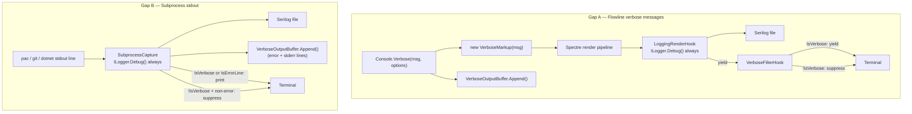

# Verbose Log Routing — Wave 3: Always-Capture

## Summary

Extend Flowline's observability so verbose-level output always reaches the log file, regardless of whether `--verbose` is set. Two gaps are closed: Flowline's own verbose messages (Gap A) via a `VerboseMarkup` type and a `VerboseFilterHook`; and subprocess stdout from external tools (Gap B) via a `SubprocessCapture` class that replaces `CommandExtensions.WithToolExecutionLog`. Terminal display of verbose content remains gated by `--verbose`; file capture is unconditional.

---

## Problem Frame

Wave 2 (`LoggingRenderHook`) established the file-logging backbone: every message that reaches the terminal via `AnsiConsole.MarkupLine` is intercepted by a render hook and written to the Serilog file at the appropriate level. Wave 2 explicitly non-goaled logging suppressed verbose messages — if it didn't reach the terminal, it wasn't observed.

Two structural gaps remain.

**Gap A — Flowline's own verbose messages.** `Console.Verbose(msg, options)` when `!IsVerbose` appends to `VerboseOutputBuffer` only; `LoggingRenderHook` never fires because `MarkupLine` is never called. `Console.Verbose(msg, bool)` when false does nothing at all — no buffer, no file. The log file has no record of verbose context on a successful run.

**Gap B — Subprocess stdout.** `WithToolExecutionLog(options)` when `!IsVerbose` drops non-error stdout silently; error lines go to the buffer, not to `ILogger`. `WithToolExecutionLog(bool)` when false drops stdout entirely with no buffer. The log file contains no subprocess output from pac, git, dotnet, or xrmcontext unless the operator ran with `--verbose`. A failing deploy with no `--verbose` leaves the log file with the exception and nothing else.

Both gaps share a root cause: the `--verbose` flag is a capture filter (it decides whether content is generated) rather than a display filter (it decides whether the terminal shows content). Closing both gaps moves the flag to the display layer and leaves capture unconditional.

Wave 3 is a deliberate reversal of the Wave 2 non-goal: suppressed verbose messages are now a first-class logging target.

---

## Key Decisions

**VerboseMarkup type over string-prefix suppression.** `[dim]` is used by both `Console.Verbose()` and `Console.Skip()`. A `VerboseFilterHook` cannot distinguish them by string content; suppressing all `[dim]` would silence Skip messages on non-verbose runs. A `VerboseMarkup` type implementing `IRenderable` via composition (wrapping an inner `Markup` for rendering) solves this structurally — the filter checks `renderable is VerboseMarkup`, never matches `Skip()`'s plain `Markup`. (`Markup` is sealed in Spectre.Console 0.57.0; inheritance is not possible.)

**Two-hook pipeline over a modified `LoggingRenderHook`.** `LoggingRenderHook` has one job — intercept Spectre renderables and write to `ILogger`. Adding terminal-suppression logic to it merges two concerns. A separate `VerboseFilterHook` registered **before** `LoggingRenderHook` keeps each hook single-responsibility and independently testable. Spectre.Console's pipeline is LIFO (last-attached hook is innermost and processes renderables first): registering `VerboseFilterHook` first makes it the outer hook — it receives what `LoggingRenderHook` yields and suppresses `VerboseMarkup` from the terminal. `LoggingRenderHook`, attached last, is the inner hook — it always sees the original `VerboseMarkup` before any suppression.

**`SubprocessCapture` as DI injectable over static extension.** `CommandExtensions` is a static class; static methods cannot hold `ILogger`. Threading `ILogger` as a parameter to each `WithToolExecutionLog` call is a sign the design is strained. A DI-injectable `SubprocessCapture` class with `ILogger` in the constructor ends the problem class-wide — every current and future subprocess call gains file capture without a per-callsite parameter.

**Parameter threading for static utilities.** `GitUtils`, `PacUtils`, `DotNetUtils`, and `SolutionChangeSummary` stay static. Commands receive `SubprocessCapture` via DI constructor injection and pass it to static utility methods as a method parameter. Making all utilities injectable services is deferred — the parameter pattern closes Gap B without that refactor.

**Dual-population preserves the inline error dump.** On failure, `FlushBufferedVerboseOutput` prints `VerboseOutputBuffer.Lines` to the terminal (Program.cs) — this is the primary on-screen recovery aid. With Gap A closed, the buffer is no longer needed for file routing, but it is still the data source for inline display. `Console.Verbose()` continues calling `VerboseOutput.Append()` alongside emitting `VerboseMarkup`.

---

## Requirements

### Gap A — Flowline verbose messages

R1. A `VerboseMarkup` type in `src/Flowline.Core/` implements `IRenderable` via composition — it wraps an inner `Markup` for rendering and carries no additional fields. It is a pure marker type that `VerboseFilterHook` identifies by explicit type check (`renderable is VerboseMarkup`). (`Markup` is sealed in Spectre.Console 0.57.0; inheritance is not possible.)

R2. `Console.Verbose(string, FlowlineRuntimeOptions)` emits `VerboseMarkup` unconditionally — regardless of `IsVerbose` — so `LoggingRenderHook` always writes the message to the Serilog file. The implementation calls `console.Write(new VerboseMarkup(...))` and `console.WriteLine()`, replacing the existing `console.MarkupLine(string)` call; `MarkupLine` constructs a plain `Markup` internally and cannot produce a `VerboseMarkup` that the hook pipeline can identify.

R3. `Console.Verbose(string, FlowlineRuntimeOptions)` continues calling `VerboseOutput.Append()` alongside the VerboseMarkup emission, so the inline error dump remains populated.

R4. The `Console.Verbose(string, bool)` overload is removed; its 12 call sites migrate to the options overload.

R5. A `VerboseFilterHook : IRenderHook` in `src/Flowline.Core/` is registered in the Spectre pipeline **before** `LoggingRenderHook`. Because Spectre.Console's pipeline is LIFO, `LoggingRenderHook` (attached second) is the inner hook — it always sees the original `VerboseMarkup` and writes to `ILogger`. `VerboseFilterHook` (attached first) is the outer hook — it receives the yielded renderable from `LoggingRenderHook` and suppresses `VerboseMarkup` from reaching the terminal when `!IsVerbose`, yielding it unchanged when `IsVerbose`.

R6. `LoggingRenderHook` is updated to add an explicit `is VerboseMarkup` branch alongside the existing `is Markup or Tree or Panel or Table` check; subtype matching via inheritance does not apply because `Markup` is sealed in Spectre.Console 0.57.0.

### Gap B — Subprocess stdout

R7. A `SubprocessCapture` class in `src/Flowline/` is registered in DI; it holds `ILogger` and `FlowlineRuntimeOptions` via constructor injection.

R8. For every subprocess stdout line, `SubprocessCapture` calls `ILogger.Debug()` unconditionally before any terminal-display or buffering decision.

R9. Error-matching stdout lines (containing `"Error: "`, `"The reason given was: "`, `": error"`, or `": warning"`) are printed to the terminal at the appropriate level (red/yellow) regardless of `IsVerbose`; they are covered by R8's unconditional `ILogger.Debug()` write and require no additional `ILogger` call.

R10. Non-error stdout lines are printed to the terminal at dim level when `IsVerbose`, and suppressed from the terminal when `!IsVerbose`; they are always written to `ILogger`.

R11. Stderr is written to `ILogger` unconditionally, appended to `VerboseOutputBuffer`, and printed to the terminal in red regardless of `IsVerbose`.

R12. `SubprocessCapture` accepts an optional `StatusContext` for PAC async operation progress updates (the `"Processing asynchronous operation..."` pattern).

R13. `SubprocessCapture` accepts an optional `Func<string, string>` line transform applied to non-error stdout before terminal display.

R14. `CommandExtensions.WithToolExecutionLog` (both overloads) is removed after all call sites migrate.

### Migration

R15. All 39 `WithToolExecutionLog` call sites across `GitUtils`, `PacUtils`, `DotNetUtils`, `SolutionChangeSummary`, `CloneCommand`, `SyncCommand`, `DeployCommand`, `ProvisionCommand`, `PacGenerator`, `XrmContextGenerator`, and `XrmContextRunner` migrate to `SubprocessCapture`. Before R14 removes both overloads, classify each bool-overload call site by intent: callers passing `verbose=false` explicitly migrate with `IsVerbose`-gated terminal display (no behavior change); callers using the `verbose=true` default (e.g., `SyncCommand.cs:204, 210, 226`) migrate with the understanding that terminal display becomes `IsVerbose`-gated — a deliberate behavior change, accepted by design.

R16. Commands (`CloneCommand`, `SyncCommand`, `DeployCommand`, `ProvisionCommand`) receive `SubprocessCapture` via DI constructor injection.

R17. Static utilities (`GitUtils`, `PacUtils`, `DotNetUtils`, `SolutionChangeSummary`) receive `SubprocessCapture` as a method parameter on every method that invokes a subprocess.

R18. Generator services (`PacGenerator`, `XrmContextGenerator`) and `XrmContextRunner` receive `SubprocessCapture` via DI constructor injection.

---

## Key Flows

F1. **Verbose message, `--verbose` off (Gap A)**
  - **Steps:** Command calls `Console.Verbose(msg, options)`. `Console.Verbose` calls `console.Write(new VerboseMarkup(...))` and `VerboseOutput.Append(msg)`. The renderable enters the pipeline; `LoggingRenderHook` (inner hook, last-attached) intercepts it first, writes to `ILogger.Debug`, and yields it. `VerboseFilterHook` (outer hook, first-attached) receives the yielded renderable, checks `!IsVerbose`, and suppresses it from terminal output. Terminal shows nothing. File contains the message.
  - **Covers:** R2, R3, R5, R6

F2. **Subprocess stdout, `--verbose` off (Gap B)**
  - **Steps:** `SubprocessCapture` receives a stdout line from pac/git/dotnet. Calls `ILogger.Debug()`. If line matches error pattern: prints to terminal at error level and appends to `VerboseOutputBuffer`. If non-error: suppresses from terminal, does not append to buffer. File contains all lines.
  - **Covers:** R8, R9, R10

F3. **Error path — inline dump (buffer)**
  - **Steps:** Command throws `FlowlineException`. `FlushBufferedVerboseOutput` runs. Prints `VerboseOutputBuffer.Lines` to terminal (dim) when `!IsVerbose`. Logs `VerboseOutput.Lines` to `ILogger.Debug`. Prints log file path.
  - **Covers:** R3, R11 (buffer remains populated by both Gap A and Gap B)

---

## Acceptance Examples

AE1. **Covers R2, R5.** Given a successful deploy run without `--verbose`. When the log file is opened. Then it contains every line emitted via `Console.Verbose()` during the run at `Debug` level.

AE2. **Covers R5.** Given a successful deploy run without `--verbose`. When the terminal output is observed. Then no `[dim]` verbose lines appear; `↷ ` Skip messages do appear.

AE3. **Covers R5.** Given a run with `--verbose`. When the terminal output is observed. Then verbose lines appear at dim. When the log file is opened. Then the same lines appear at `Debug` level (no duplication concern — same physical entry).

AE4. **Covers R8, R10.** Given a `pac solution import` run without `--verbose`. When the import completes. Then the log file contains every stdout line from pac. The terminal shows nothing from pac stdout unless a line matches the error pattern.

AE5. **Covers R9.** Given a subprocess emits `"Error: The resource was not found."` on stdout. When `!IsVerbose`. Then the line is printed to the terminal in red and written to `ILogger`. The terminal is not otherwise silent.

AE6. **Covers R3, R11 (F3).** Given a command throws with `!IsVerbose`. When the error handler runs. Then the terminal shows the verbose lines buffered during the run (inline dump), followed by the log file path.

---

## Scope Boundaries

- Serilog configuration unchanged — file sink, `MinimumLevel.Debug`, enrichers stay as Wave 1 left them.
- `LoggingRenderHook` level-detection logic unchanged (prefix-based string matching, Wave 2 contract).
- Buffer size unchanged (50 lines max, rolling).
- Buffer success-path flush not added — with the file always complete, flushing the buffer on success would print verbose lines to terminal after a successful run, which is unexpected.
- `FlushBufferedVerboseOutput`'s `logger?.Debug("Context: {Line}", line)` loop removed — file capture is already complete at the point of failure; the loop produces duplicate log entries under Wave 3.
- `PacUtils`, `GitUtils`, `DotNetUtils` remain static classes; injectable-service migration is a separate decision.
- No `--quiet` flag introduced — that is a separate UX direction (ideation idea 6).
- No changes to non-verbose extension methods (`Ok`, `Info`, `Skip`, `Warning`, `Error`).

---

## Sources / Research

- `docs/ideation/2026-06-30-verbose-log-routing-ideation.html` — full ideation with all rejected alternatives, two-gap framing, coverage table
- `docs/brainstorms/2026-06-28-console-to-ilogger-tee-requirements.md` — Wave 2 requirements; this doc reverses Wave 2's explicit non-goal on suppressed verbose
- `docs/brainstorms/2026-06-25-cli-observability-wave1-requirements.md` — Wave 1 context (Serilog setup, `VerboseOutputBuffer` introduction)
- `src/Flowline.Core/LoggingRenderHook.cs` — hook registration point; `is Markup` check that catches `VerboseMarkup` by subtype
- `src/Flowline.Core/FlowlineConsoleExtensions.cs` — both `Verbose()` overloads; `Skip()` showing the `[dim]` overlap requiring VerboseMarkup
- `src/Flowline/Utils/CommandExtensions.cs` — both `WithToolExecutionLog` overloads; error detection logic that SubprocessCapture must preserve
- `src/Flowline/Program.cs` — hook registration order, `FlushBufferedVerboseOutput`, success path showing no buffer flush
- `src/Flowline/Utils/PacUtils.cs` — streaming vs buffered subprocess call patterns
