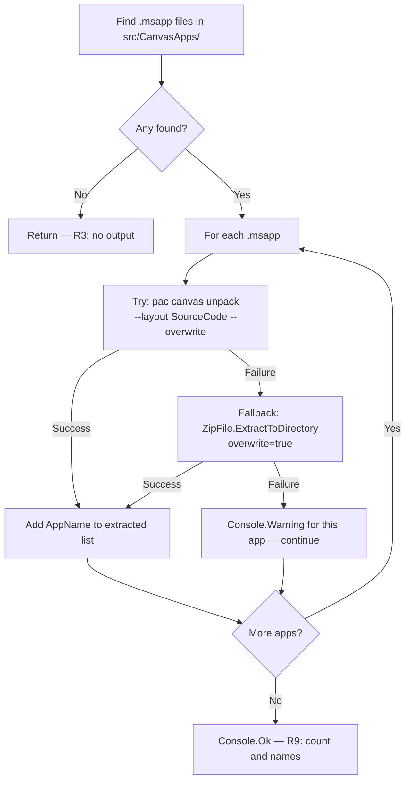

# feat: Canvas app extraction after clone and sync

## Summary

Adds a `CanvasAppsExtractor` utility that runs after `pac solution clone` and `pac solution sync`, scanning `src/CanvasApps/` for `.msapp` files and extracting each to a parallel `CanvasApps/<AppName>/` folder using `pac canvas unpack --layout SourceCode` with a zip-extraction fallback. Per-app failures warn and continue; the existing clone and sync flows are unchanged.

---

## Problem Frame

Canvas apps land in `src/CanvasApps/` as binary `.msapp` files — no line-level diff, no PR review visibility. See origin document for full context. (see origin: `docs/brainstorms/2026-05-26-canvas-app-extraction-requirements.md`)

---

## Requirements

- R1. `flowline clone` triggers canvas app extraction after the solution is downloaded.
- R2. `flowline sync` triggers canvas app extraction after the solution is synced.
- R3. No `.msapp` files → extraction skipped without output.
- R4. Each canvas app extracted to `solutions/<SolutionName>/CanvasApps/<AppName>/`.
- R5. Extracted YAML committed to git (not gitignored).
- R6. `.msapp` binary in `src/CanvasApps/` not modified or removed.
- R7. Per-app extraction failure → warning + continue; overall command succeeds.
- R8. Re-extraction overwrites previously extracted YAML.
- R9. Reports extracted app count and names after clone/sync.

**Origin acceptance examples:** AE1 (covers R3), AE2 (covers R7), AE3 (covers R8)

---

## Scope Boundaries

- Round-trip (`pac canvas pack`) — deferred until Preview status stabilises (carried from origin)
- PP Git Integration — not targeted (carried from origin)
- `--processCanvasApps` on `pac solution` — deprecated, not used (carried from origin)
- Opt-in flag — not in scope; extraction is automatic (carried from origin)

---

## Context & Research

### Relevant Code and Patterns

- `src/Flowline/Commands/CloneCommand.cs` — post-clone step sequence; `SeedWebResourceDistFromSrc` is the pattern for a file-processing step after PAC operations; add extraction before `PacUtils.PackSolutionAsync`
- `src/Flowline/Commands/SyncCommand.cs` — post-sync step sequence; add extraction after `pac solution sync` completes, before `PacUtils.PackSolutionAsync`
- `src/Flowline/Utils/PacUtils.cs` — CliWrap invocation pattern (`GetBestPacCommandAsync`, `PackSolutionAsync`); use `WithValidation(CommandResultValidation.None)` + check `result.IsSuccess`
- `src/Flowline/Commands/FlowlineCommand.cs` — folder constants `AllSolutionsFolderName`, `WebResourcesName`, `PluginsName`
- `src/Flowline.Core/FlowlineConsoleExtensions.cs` — `Ok()`, `Skip()`, `Warning()`, `Verbose()` output patterns
- `src/Flowline/Utils/CommandExtensions.cs` — `WithToolExecutionLog()` for verbose CliWrap output
- `tests/Flowline.Tests/PacUtilsTests.cs` — injectable delegate seam (`CheckCommandExistsFunc`) for testing PAC calls without a real CLI; replicate this pattern for the extractor

### Institutional Learnings

- No existing learning for `.msapp` / canvas extraction — novel area; worth a `docs/solutions/` entry post-implementation
- Extraction is non-destructive and non-blocking; follows the "warn, don't throw" pattern established for drift checks in `SyncCommand`

---

## Key Technical Decisions

- **New `CanvasAppsExtractor` utility class** over extending `PacUtils`: follows the `DriftChecker` pattern of dedicated utility classes; keeps PAC detection/invocation helpers separate from domain extraction logic.
- **AppName derived from filename** (strip `.msapp` extension): simplest, predictable, survives PAC output format changes.
- **Try `pac canvas unpack` first, zip second**: PAC handles both legacy PASopa-format and modern zip-native apps; zip fallback covers modern apps when the PAC command is unavailable or fails.
- **`System.IO.Compression.ZipFile` for zip fallback**: in the .NET SDK, no new package dependency.
- **Per-app failure → warning + continue**: matches R7; consistent with the non-blocking drift warning pattern in `SyncCommand`.
- **Extraction runs before pack validation in both commands**: ensures fresh `.msapp` content is unpacked at the same point in the flow; pack validation reads only from `src/` and is unaffected.

---

## Open Questions

### Resolved During Planning

- **AppName convention**: strip `.msapp` extension from the filename — natural source, matches how `WebResourcesName` and `PluginsName` derive from the project folder name
- **Extraction placement in SyncCommand**: after `pac solution sync` completes, before `PacUtils.PackSolutionAsync` — ensures YAML reflects current Dataverse state when the user commits the sync checkpoint

### Deferred to Implementation

- **Scan depth**: whether PAC places `.msapp` files directly in `src/CanvasApps/` (flat) or one level deeper per app — verify against a real solution; use recursive scan to handle either layout
- **Testable seam for PAC calls**: implement an injectable delegate (following `PacUtils.CheckCommandExistsFunc` pattern) to unit-test the PAC invocation path without a real CLI

---

## High-Level Technical Design

> *This illustrates the intended approach and is directional guidance for review, not implementation specification. The implementing agent should treat it as context, not code to reproduce.*

---

## Implementation Units

### U1. CanvasAppsExtractor utility

**Goal:** Core extraction logic — discover `.msapp` files, try PAC unpack, fall back to zip, return names of successfully extracted apps.

**Requirements:** R3, R4, R6, R7, R8, R9

**Dependencies:** None

**Files:**
- Create: `src/Flowline/Utils/CanvasAppsExtractor.cs`
- Test: `tests/Flowline.Tests/CanvasAppsExtractorTests.cs`

**Approach:**
- Static class; primary method signature: `ExtractCanvasAppsAsync(string slnFolder, bool verbose, CancellationToken ct)` → `Task<IReadOnlyList<string>>` (names of successfully extracted apps)
- Discovery: scan `src/CanvasApps/` recursively for `.msapp` files (handles flat and nested PAC output layouts)
- Per-app: `AppName` = filename without `.msapp` extension; output dir = `CanvasApps/<AppName>/` relative to `slnFolder`; `--overwrite` / overwrite=true ensures re-extraction reflects current state (R8)
- PAC path: call `PacUtils.GetBestPacCommandAsync()` for CLI detection; invoke `pac canvas unpack` with `--layout SourceCode` and `--overwrite`; use `WithValidation(CommandResultValidation.None)` + check `IsSuccess`
- Zip fallback: `ZipFile.ExtractToDirectory` with overwrite; triggers when PAC returns non-zero or throws
- Both paths fail: emit `AnsiConsole.Warning(...)` for that app; exclude from result list; continue (R7)
- `src/CanvasApps/` absent or no `.msapp` files: return empty list, no console output (R3)

**Patterns to follow:**
- `src/Flowline/Utils/PacUtils.cs` — CliWrap invocation via `GetBestPacCommandAsync` + `WithValidation(CommandResultValidation.None)`
- `src/Flowline/Utils/DriftChecker.cs` — standalone utility with no command dependency; returns result; caller handles any spinner
- `tests/Flowline.Tests/PacUtilsTests.cs` — injectable delegate seam for PAC calls in tests

**Test scenarios:**
- Happy path: `src/CanvasApps/` does not exist → returns empty list, no console output (covers AE1)
- Happy path: `src/CanvasApps/` exists but contains no `.msapp` files → returns empty list, no output (covers AE1)
- Happy path: one `.msapp`, PAC succeeds → returns `["AppName"]`; output dir created with YAML content
- Happy path: two `.msapp` files, both PAC succeed → returns both names
- Edge case: `AppName` stripped correctly — `MyApp.msapp` → `"MyApp"`
- Edge case: `CanvasApps/MyApp/` already contains YAML from a prior sync → contents replaced after re-extraction (covers AE3)
- Error path: PAC fails for one app, zip succeeds → app in returned list; no warning
- Error path: PAC fails AND zip fails for one of two apps; other PAC succeeds → warning for failing app; returned list contains only the successful app; no exception thrown (covers AE2)
- Error path: all apps fail both PAC and zip → returns empty list; warning per app; no exception

**Verification:**
- All `CanvasAppsExtractorTests` pass
- For successful apps: `CanvasApps/<AppName>/` directory exists and contains unpacked content
- For failed apps: no output directory; warning line in console output

---

### U2. Extraction step in CloneCommand

**Goal:** Invoke `CanvasAppsExtractor.ExtractCanvasAppsAsync` after clone; report extracted apps via `Console.Ok`.

**Requirements:** R1, R9

**Dependencies:** U1

**Files:**
- Modify: `src/Flowline/Commands/CloneCommand.cs`

**Approach:**
- Add the extraction call after `SeedWebResourceDistFromSrc` and before `PacUtils.PackSolutionAsync`
- Non-empty result → `Console.Ok(...)` naming count and app names (R9)
- Empty result → no output (R3: no canvas apps = silent skip, consistent with `SeedWebResourceDistFromSrc`'s `Console.Skip` pattern)
- Extraction failures are handled inside the extractor (U1); `CloneCommand` does not add its own catch

**Patterns to follow:**
- Post-clone step structure in `CloneCommand.ExecuteFlowlineAsync`: guard check → execute → `Console.Ok` or `Console.Skip`
- `SeedWebResourceDistFromSrc` placement and output style

**Test scenarios:**
- Test expectation: none — `CloneCommand` integration requires a live PAC + Dataverse environment; correctness proven by U1 unit tests and a smoke test on a real solution

**Verification:**
- Build passes without errors
- `flowline clone` against a solution with canvas apps: `CanvasApps/` folder populated before pack validation runs
- `flowline clone` against a solution without canvas apps: no `CanvasApps/` folder; no extraction output in console

---

### U3. Extraction step in SyncCommand

**Goal:** Invoke `CanvasAppsExtractor.ExtractCanvasAppsAsync` after sync; report extracted apps.

**Requirements:** R2, R9

**Dependencies:** U1

**Files:**
- Modify: `src/Flowline/Commands/SyncCommand.cs`

**Approach:**
- Add extraction call immediately after `Console.Ok($"Solution synced from Dataverse in ...")`, before `PacUtils.PackSolutionAsync`
- Same output handling as U2

**Patterns to follow:**
- Post-sync step sequence in `SyncCommand.ExecuteFlowlineAsync`; follow the spinner + `Console.Ok` rhythm of the pack and build steps

**Test scenarios:**
- Test expectation: none — same rationale as U2

**Verification:**
- Build passes
- `flowline sync` updates `CanvasApps/` YAML when canvas apps change in Dataverse
- `git diff` after sync shows YAML-level changes for modified canvas apps (primary success criterion)

---

### U4. Update folder-structure.md

**Goal:** Add `CanvasApps/<AppName>/` to the documented solution folder spec.

**Requirements:** Supports R4, R5 (documents the established layout)

**Dependencies:** None — can land in parallel with U1–U3

**Files:**
- Modify: `docs/folder-structure.md`

**Approach:**
- Add `CanvasApps/` entry in the folder hierarchy overview alongside `Plugins/` and `WebResources/`
- Add a matching component description: extracted canvas app YAML sources; one subfolder per app; generated by Flowline; committed to git for diff visibility; the `.msapp` in `src/` remains the build artifact

**Test scenarios:**
- Test expectation: none — documentation change

**Verification:**
- `docs/folder-structure.md` shows `CanvasApps/<AppName>/` in the hierarchy tree with a brief description consistent with the existing component descriptions

---

## System-Wide Impact

- **Interaction graph:** `CloneCommand.ExecuteFlowlineAsync` and `SyncCommand.ExecuteFlowlineAsync` each gain one new sequential step after the main PAC operation; no middleware, callbacks, or observers affected
- **Error propagation:** per-app failures are warned and swallowed inside `CanvasAppsExtractor`; they do not affect command exit codes; clone and sync exit codes unchanged
- **State lifecycle risks:** re-extraction overwrites `CanvasApps/<AppName>/`; intentional (R8); users who manually edit extracted YAML accept overwrite on next sync (read-only by design)
- **API surface parity:** no changes to command flags, config schema, or any public interface
- **Integration coverage:** `flowline sync` followed by `git diff` must show YAML-level changes for modified canvas apps — the primary success criterion; verify manually on a real solution
- **Unchanged invariants:** `src/CanvasApps/` is not touched (R6); `pac solution pack` reads only from `src/` — the new `CanvasApps/` folder is invisible to pack operations and does not affect solution packaging

---

## Risks & Dependencies

| Risk | Mitigation |
|------|------------|
| `pac canvas unpack` is (Preview) and could be removed by Microsoft | Zip fallback activates on any PAC failure including command-not-found; modern `.msapp` files are zip-native |
| Real PAC output structure for `src/CanvasApps/` is unknown until verified | Recursive `.msapp` scan handles both flat and nested layouts; verify during implementation with a real solution before finalising |
| Users may edit extracted YAML expecting round-trip, but overwrite on next sync | Read-only scope is explicit in the docs update (U4) and scope boundaries; round-trip is a tracked future item |

---

## Sources & References

- **Origin document:** [docs/brainstorms/2026-05-26-canvas-app-extraction-requirements.md](docs/brainstorms/2026-05-26-canvas-app-extraction-requirements.md)
- `pac canvas` command reference: https://learn.microsoft.com/en-us/power-platform/developer/cli/reference/canvas
- GitHub discussion (PAC canvas unpack deprecation): https://github.com/microsoft/PowerApps-Tooling/discussions/758
- GitHub issue (--processCanvasApps deprecation in build tools): https://github.com/microsoft/powerplatform-build-tools/issues/1246
