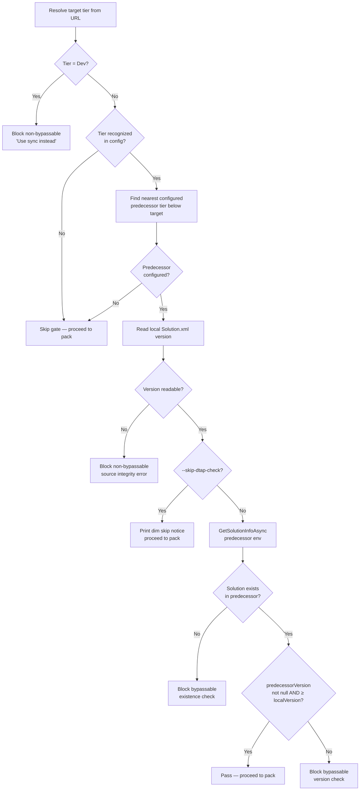

# feat: DTAP gate in DeployCommand

## Summary

Extends `DeployCommand.ExecuteFlowlineAsync` with a pre-pack DTAP gate: non-bypassable Dev-target block, followed by nearest-configured-predecessor discovery via URL matching, then existence and version checks against that predecessor. Two `internal static` pure helpers are extracted for testability — tier/predecessor resolution and local Solution.xml version reading. `--skip-dtap-check` is added to `DeployCommand.Settings`, bypassing only the existence and version checks, not the Dev block.

---

## Problem Frame

`DeployCommand` currently deploys to any configured target unconditionally. Nothing prevents deploying directly to Prod without the solution ever reaching UAT or Test — and nothing blocks deploying to Dev when `sync` is the correct workflow. (See origin document for full context.)

---

## Requirements

- R1. Before running gate checks, resolve the target tier by matching the target URL against all configured URLs (ProdUrl, UatUrl, TestUrl, DevUrl) — applies to both named aliases and raw URLs.
- R2. If the resolved tier is Dev, block immediately with a non-bypassable error.
- R3. If the target URL does not match any configured URL, skip all gate checks and deploy normally.
- R4. Find the predecessor env: highest configured tier strictly below the target. If none configured below the target, skip all gate checks.
- R5. If the solution does not exist in the predecessor env, block (bypassable with `--skip-dtap-check`).
- R6. If the predecessor's solution version is null or less than the local version, block (bypassable with `--skip-dtap-check`).
- R7. If the local solution version cannot be read, block with a non-bypassable error.
- R8. If the local version is readable and predecessorVersion >= localVersion, version check passes.
- R9. `--skip-dtap-check` is a `DeployCommand`-specific flag that skips R5 and R6 checks.
- R10. When `--skip-dtap-check` is set and a check would have blocked, print a dim skip notice.
- R11. `--skip-dtap-check` does not bypass R2 (Dev block) or R7 (version unreadable).
- R12. Gate checks run after the managed/unmanaged type guard (already implemented), before the drift check and pack step.

**Origin acceptance examples:** AE1–AE12 (see `docs/brainstorms/2026-06-07-dtap-gate-requirements.md`)

---

## Scope Boundaries

- Dev deployments are blocked entirely — non-bypassable, not gated.
- No non-bypassable DTAP block for the existence or version checks — both bypassable with `--skip-dtap-check`.
- No reason string required for `--skip-dtap-check`.
- No audit trail — skip notices appear in terminal only, not persisted.
- No changes to `ProvisionCommand`, `SyncCommand`, or any other command.
- The managed/unmanaged type guard (already shipped on `feat/deploy-managed-unmanaged-guard`) is not changed.

---

## Context & Research

### Relevant Code and Patterns

- `src/Flowline/Commands/DeployCommand.cs` — insertion point after type guard (line ~84), before drift check. Settings class uses `[CommandOption("--managed")]` pattern to follow for `--skip-dtap-check`.
- `src/Flowline/Commands/ProvisionCommand.cs:169` — `FindProblematicSolutions` as the direct pattern for `internal static` pure helper extraction.
- `src/Flowline/Validation/FlowlineValidator.cs:107` — `GetSolutionInfoAsync(environmentUrl, solutionName, includeManaged, settings, ct)` returns `SolutionInfo?` with cached `VersionNumber` (string?) and `IsManaged`.
- `src/Flowline/Utils/PacUtils.cs:448` — `SolutionInfo` class: `VersionNumber` is `string?` in format "1.2.0.0" (4-part Dataverse standard).
- `src/Flowline/Config/ProjectConfig.cs` — all four URL properties (ProdUrl, UatUrl, TestUrl, DevUrl) are nullable strings.
- `tests/Flowline.Tests/ProvisionCommandTests.cs` — xUnit + FluentAssertions test structure to mirror for pure helper tests.

### Institutional Learnings

- `docs/solutions/best-practices/provision-safety-guard-unmanaged-solutions-2026-05-18.md` — guard pattern: fetch env state, compare, block with enumerated reasons. Non-bypassable and bypassable checks are distinct code paths.
- `docs/solutions/logic-errors/pac-sync-version-order-2026-05-21.md` — version reads must happen before any sync/pack step to avoid stale data. (Reinforces pre-pack placement, R12.)

---

## Key Technical Decisions

- **`--skip-dtap-check` in `DeployCommand.Settings`, not `FlowlineSettings`**: DTAP gate is deploy-only. `FlowlineSettings.Force` is shared because drift-check bypass is used in multiple commands; `--skip-dtap-check` has no cross-command scope.
- **Two extracted pure static helpers**: Tier/predecessor resolution and local version reading are extracted as `internal static` methods for unit testability without PAC CLI. Mirrors `FindProblematicSolutions` in `ProvisionCommand`.
- **`System.Version` for comparison**: Dataverse version strings are always 4-part ("1.2.0.0"). `System.Version.Parse` produces a comparable value for `>=` checks.
- **Null predecessor version → block (bypassable)**: If PAC CLI returns null for `SolutionInfo.VersionNumber`, we treat it as "predecessor has no confirmed version" — same as "too old." Bypassable with `--skip-dtap-check`. Safer than silently passing.
- **Predecessor search: highest tier below target**: DTAP order is Dev(0) < Test(1) < UAT(2) < Prod(3). Iterate from UAT down (for Prod) or Test down (for UAT), stopping at the first configured URL. Avoids requiring a complete DTAP chain.
- **Local version read order**: Local version is read after tier/predecessor resolution confirms the gate will run — avoids XML parsing for raw URL deploys that skip the gate entirely.

---

## Open Questions

### Resolved During Planning

- **Where does local version live?** `src/Other/Solution.xml` relative to the package folder (`PackageFolder(slnFolder)`). Standard PAC CLI unpack convention. Implementer must verify against a real cloned solution.
- **Version comparison for null predecessor version**: User confirmed → block as if too old (bypassable). See Key Technical Decisions.
- **`--skip-dtap-check` scope**: Deploy-specific. Confirmed `DeployCommand.Settings`.

### Deferred to Implementation

- **Exact XML element for version**: Verify the XPath or element name in `Solution.xml` (likely `<ImportExportXml><SolutionManifest><Version>`). Confirm with an actual unpacked solution.
- **URL normalization edge cases**: Trailing slashes, case differences between stored config URLs and user-supplied URLs. Implement with `OrdinalIgnoreCase` and normalize trailing slashes consistently.
- **Predecessor null version error message wording**: Confirm tone with `/tone` after implementation.
- **Skip notice format when both existence and version would have blocked**: One combined line or two separate? Defer to implementation judgment.

---

## High-Level Technical Design

> *This illustrates the intended approach and is directional guidance for review, not implementation specification. The implementing agent should treat it as context, not code to reproduce.*

---

## Implementation Units

### U1. Add `--skip-dtap-check` flag to `DeployCommand.Settings`

**Goal:** Surface the flag in CLI help and make it available to gate logic.

**Requirements:** R9, R10, R11

**Dependencies:** None

**Files:**
- Modify: `src/Flowline/Commands/DeployCommand.cs`

**Approach:**
- Add `SkipDtapCheck` bool property to `Settings` inner class.
- Follow the `[CommandOption("--skip-dtap-check")]` + `[Description(...)]` + `[DefaultValue(false)]` pattern from `--managed`.
- Description tone: short, no hedging — e.g., "Skip DTAP promotion checks".

**Patterns to follow:**
- `DeployCommand.Settings.Managed` property (same attribute structure).

**Test scenarios:**
- Test expectation: none — pure CLI flag registration, no behavioral change in this unit. Behavioral coverage is in U3 integration scenarios.

**Verification:**
- `flowline deploy --help` lists `--skip-dtap-check` with the correct description.

---

### U2. Pure helpers: tier/predecessor resolution and local version reading

**Goal:** Provide testable, PAC-CLI-free logic for determining which predecessor URL to check and for reading the local solution version from the unpacked XML source.

**Requirements:** R1, R2, R3, R4, R7, R8

**Dependencies:** None

**Files:**
- Modify: `src/Flowline/Commands/DeployCommand.cs` (add `internal static` methods)
- Test: `tests/Flowline.Tests/DeployCommandDtapGateTests.cs` (new file)

**Approach:**

Two `internal static` methods:

1. **Tier/predecessor resolver** — takes config URLs and a target URL, returns a result discriminating three cases: (a) Dev tier (non-bypassable block), (b) no gate applicable (null predecessor URL), (c) gate applicable with the predecessor URL to check. URL matching is case-insensitive with normalized trailing slashes.

2. **Local version reader** — takes the package folder path, locates `Solution.xml` in the PAC-standard path, parses and returns the version string. Throws a typed exception if the file is missing or the version element is absent or empty (implementer determines exception type — `FlowlineException` or similar per project conventions).

**Patterns to follow:**
- `ProvisionCommand.FindProblematicSolutions` — pure static, `internal`, accepts primitives, returns structured result. No I/O calls, no spinner wrappers.
- xUnit + FluentAssertions test structure in `tests/Flowline.Tests/ProvisionCommandTests.cs`.

**Test scenarios:**

*Tier resolution — happy paths:*
- Covers AE1. Target = ProdUrl, UatUrl configured → predecessor = UatUrl.
- Covers AE2. Target = ProdUrl, TestUrl configured (no UatUrl) → predecessor = TestUrl.
- Covers AE3. Target = ProdUrl, DevUrl configured (no UatUrl, no TestUrl) → predecessor = DevUrl.
- Target = UatUrl, TestUrl configured → predecessor = TestUrl.
- Target = UatUrl, DevUrl configured (no TestUrl) → predecessor = DevUrl.
- Target = TestUrl, DevUrl configured → predecessor = DevUrl.

*Tier resolution — Dev block:*
- Covers AE4. Target = DevUrl → result is Dev-block (non-bypassable).

*Tier resolution — skip gate:*
- Covers AE5. Target is a raw URL not matching any configured URL → result is skip gate (null predecessor).
- Target = TestUrl, no DevUrl configured → result is skip gate (no predecessor below Test).
- Target = UatUrl, no TestUrl and no DevUrl → result is skip gate.

*Tier resolution — raw URL matching config:*
- Covers AE6. Target = ProdUrl value (raw URL form) → resolves as Prod tier → predecessor = UatUrl (if configured).
- URL matching is case-insensitive: `PRODURL` matches `produrl`.
- URL matching normalizes trailing slashes: `https://org.crm.dynamics.com` matches `https://org.crm.dynamics.com/`.

*Local version reading — happy path:*
- Valid `Solution.xml` with `<Version>1.2.0.0</Version>` → returns `"1.2.0.0"`.

*Local version reading — error paths:*
- `Solution.xml` not found → throws (implementer chooses specific type).
- `<Version>` element is empty string → throws.
- `<Version>` element absent → throws.

**Verification:**
- All unit tests in `DeployCommandDtapGateTests.cs` pass.
- No PAC CLI calls in test execution (pure logic only).

---

### U3. DTAP gate wired into `DeployCommand.ExecuteFlowlineAsync`

**Goal:** Run the full gate sequence pre-pack, using U2's helpers and `FlowlineValidator.GetSolutionInfoAsync` for the predecessor env check.

**Requirements:** R1–R12 (all)

**Dependencies:** U1, U2

**Files:**
- Modify: `src/Flowline/Commands/DeployCommand.cs`

**Approach:**

After the existing managed/unmanaged type guard block, before `var slnFolder = Path.Combine(...)`:

1. Call tier/predecessor resolver (U2) with `Config` and `targetUrl`.
2. If Dev-block result → `Console.Error(...)` with non-bypassable message, `return ExitCode.ValidationFailed`.
3. If skip result → fall through (no gate).
4. If check result (predecessor URL provided):
   a. Read local version via U2's reader; if throws → `Console.Error(...)` with non-bypassable message, `return ExitCode.ValidationFailed`.
   b. If `settings.SkipDtapCheck` → `Console.Skip(...)` dim notice, fall through.
   c. Call `FlowlineValidator.Default.GetSolutionInfoAsync(predecessorUrl, sln.Name, includeManaged: true, settings, cancellationToken)` wrapped in a spinner.
   d. If null (solution not in predecessor) → `Console.Error(...)`, `return ExitCode.ValidationFailed`.
   e. If `VersionNumber` null or parsed predecessor version < local version → `Console.Error(...)`, `return ExitCode.ValidationFailed`.
   f. Else → fall through (pass).

**Patterns to follow:**
- Managed/unmanaged type guard in `DeployCommand.ExecuteFlowlineAsync` (just implemented) — same spinner + `Console.Error` + `return` pattern.
- `Console.Skip(...)` dim output for bypass notices — matches how `ProvisionCommand` signals skipped steps.

**Test scenarios (manual verification — PAC CLI dependency):**

- Covers AE4. `flowline deploy dev` → blocked before spinner, message references `sync`.
- Covers AE7. `flowline deploy prod` when solution absent in predecessor → blocked with clear predecessor env name and solution name.
- Covers AE8. `flowline deploy prod` when predecessor version is v1.1, local is v1.2 → blocked with both version numbers in message.
- Covers AE9. Predecessor has v1.2, deploying v1.2 → gate passes, pack spinner appears.
- Covers AE10. Predecessor has v1.3, deploying v1.2 → gate passes, pack spinner appears.
- Covers AE11. Same as AE7 scenario but with `--skip-dtap-check` → dim skip notice printed, pack proceeds.
- Covers AE12. `Solution.xml` missing or version element absent → non-bypassable error, even with `--skip-dtap-check`.
- Covers AE5. Deploy to raw URL not in config → gate skipped entirely, deploy proceeds normally.
- Covers AE6. Deploy to raw URL that matches ProdUrl in config → gate runs as if `flowline deploy prod`.
- R6 (null predecessor version). Solution exists in predecessor, `VersionNumber` is null → blocked (bypassable with `--skip-dtap-check`).

**Verification:**
- Running against a target where the solution is absent in the predecessor env aborts before any pack spinner appears.
- Running against a target where predecessor version is current passes cleanly.
- Running `flowline deploy dev` aborts immediately with a message referencing `sync`.
- `--skip-dtap-check` suppresses existence and version blocks but not the Dev or version-unreadable blocks.

---

## System-Wide Impact

- **Interaction graph:** Affects only `DeployCommand.ExecuteFlowlineAsync`. No callbacks, middleware, or observers. `FlowlineValidator.GetSolutionInfoAsync` is called for the predecessor env — one additional cached API call per deploy invocation.
- **Error propagation:** PAC CLI auth failures in `GetSolutionInfoAsync` bubble as exceptions (existing behavior). Version XML parse failures surface as non-bypassable user-visible errors via `Console.Error`.
- **State lifecycle risks:** None — the gate is read-only. No writes to config, cache, or target environment.
- **API surface parity:** No other command deploys solutions — `DeployCommand` is the only surface.
- **Unchanged invariants:** The managed/unmanaged type guard (U1 of the prior PR) runs before this gate. Drift check and pack run after. Raw URL deploys to unrecognized environments are explicitly unchanged (R3, AE5).

---

## Risks & Dependencies

| Risk | Mitigation |
|------|------------|
| `Solution.xml` path varies across PAC CLI versions or solution types | Implementer must verify path against a real cloned solution. If the path differs from `src/Other/Solution.xml`, adjust the helper and update tests. |
| Predecessor env auth failure returns null from `GetSolutionInfoAsync` | Null = solution not in predecessor → blocked as an existence failure. This is the conservative direction (bypassable with `--skip-dtap-check`). |
| URL normalization mismatch (trailing slashes, casing) | Enforce normalization in the tier resolver — both stored config URLs and supplied target URL are normalized before comparison. Tests cover this edge case explicitly. |

---

## Documentation / Operational Notes

- Update `E:\Code\RemyDuijkeren\Flowline.wiki\Command-Reference.md` — document `--skip-dtap-check` under the `deploy` command entry.

---

## Sources & References

- **Origin document:** [docs/brainstorms/2026-06-07-dtap-gate-requirements.md](docs/brainstorms/2026-06-07-dtap-gate-requirements.md)
- [docs/ideation/2026-06-07-deploy-command-ideation.md](docs/ideation/2026-06-07-deploy-command-ideation.md) — idea #5
- `src/Flowline/Commands/DeployCommand.cs` — insertion target
- `src/Flowline/Commands/ProvisionCommand.cs:169` — `FindProblematicSolutions` pattern reference
- `src/Flowline/Validation/FlowlineValidator.cs:107` — `GetSolutionInfoAsync`
- `src/Flowline/Config/ProjectConfig.cs` — ProdUrl, UatUrl, TestUrl, DevUrl
- `tests/Flowline.Tests/ProvisionCommandTests.cs` — test structure reference
