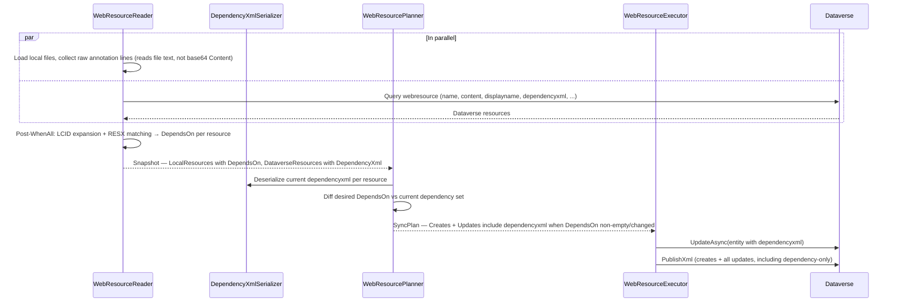
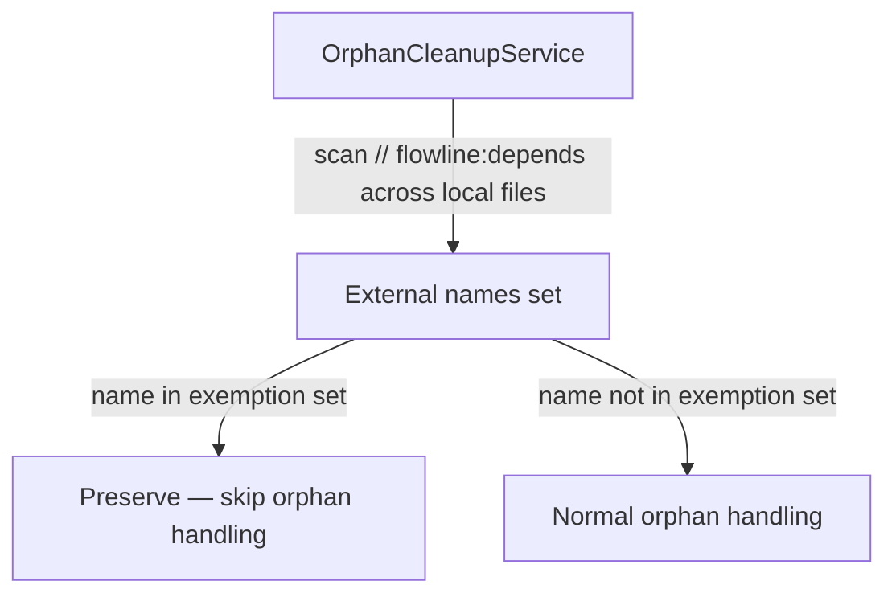

# feat: Add web resource dependency registration

## Summary

`flowline push` will automatically register Dataverse web resource dependency relationships after every sync: RESX files linked to their parent JS by base-name matching, JS-to-JS libraries via `// flowline:depends` annotations. Dependency changes are diffed against the current `dependencyxml` field, written back, and published. Deploy-time orphan cleanup exempts annotation-referenced external files from deletion.

---

## Problem Frame

`flowline push` syncs web resource content but does not manage dependency relationships. RESX files upload without linking to their parent JS resource, so `getResourceString` returns `null` at runtime. Shared JS libraries upload without dependency registration. Developers must manually create dependencies in the maker portal after every push, defeating the automation the tool provides.

---

## Requirements

**Detection**

- R1. A RESX file is automatically registered as a dependency of a JS file when their base names match (base name = filename stripped of `.\d{4}.resx`, e.g. `MyForm.1033.resx` → `MyForm`).
- R2. If zero JS files match a RESX base name, emit a warning and skip auto-registration for that RESX.
- R3. If multiple JS files match a RESX base name, emit a warning and skip auto-registration (use annotation to override).
- R4. A JS file declares dependencies via `// flowline:depends <logical-name>` comments; all such lines at the top of the file are collected.
- R5. Annotations accept any valid CRM logical name (own solution, shared namespace, or a different solution).
- R6. A `// flowline:depends` annotation referencing a `.resx` name without an LCID suffix expands to all matching LCID variants present in the combined local + Dataverse resource set.
- R7. HTML → JS/CSS dependency annotation is not supported in this release.

**Sync behavior**

- R8. After all web resources are content-synced, compute desired dependency sets from RESX matching and annotations.
- R9. Read current `dependencyxml` from Dataverse before writing (read-modify-write; never overwrite without reading first).
- R10. Add missing dependencies and remove stale ones based on the diff.
- R11. Write the updated `dependencyxml` via `UpdateRequest` only when the diff shows a change.
- R12. Resources with dependency changes — including dependency-only changes where content is unchanged — are included in the publish step.
- R13. Dependency registration does not guarantee load order; web resources load asynchronously regardless.

**Orphan cleanup**

- R14. During `deploy`, external web resources referenced in any `// flowline:depends` annotation across all local files are exempt from orphan deletion and removal.

---

## Key Technical Decisions

- **`dependencyxml` format verified empirically before implementation**: The field is marked "for internal use only" in the Dataverse SDK; the brainstorm flags its format as community knowledge requiring empirical verification. U1 exports a solution with manually-configured dependencies and reads the field via SDK query. U2, U3, and U4 are blocked until the format is confirmed.

- **Annotation parsing in `WebResourceReader` in two phases**: Raw `// flowline:depends` lines are collected during local file load, reading file text from disk (not from `Content`, which is base64-encoded). LCID expansion (R6) and RESX matching (R1–R3) run in a post-`WhenAll` enrichment step that has access to both local and Dataverse resources. No user-visible scan phase — all dependency data is computed inside `LoadSnapshotAsync` before the snapshot is returned.

- **`DependencyXmlSerializer` as an isolated helper**: XML parse/serialize logic lives in a standalone class, keeping the Planner and Reader free of XML manipulation. The confirmed format from U1 drives the implementation.

- **Dependency-only changes reuse the existing `Updates` mechanism**: A resource with unchanged content but changed dependencies still emits an `Update` plan action with `dependencyxml` set on the entity. No new `WebResourceAction` enum value is needed; the Executor already calls `UpdateAsync(entity)` and publishes all updates.

- **RESX base-name matching is global across the resource set**: Matching ignores directory structure; only the filename base name is compared (e.g. `strings/MyForm.1033.resx` matches `scripts/MyForm.js`).

- **OrphanCleanupService uses `WebResourceAnnotationParser` with a path parameter**: Push and deploy are separate process invocations with no shared in-memory state. During deploy, `OrphanCleanupService` receives the webresource-root path, uses `WebResourceAnnotationParser` to scan local JS files for `// flowline:depends` annotations, then resolves exemption logical names to orphan GUIDs via a Dataverse name query.

---

## High-Level Technical Design

### Push: dependency sync flow

### Deploy: orphan cleanup exemption

---

## Scope Boundaries

### Deferred to Follow-Up Work

- HTML → JS/CSS dependency annotation: the browser handles loading in the iframe regardless; dependency registration only prevents accidental deletion in managed contexts. Low practical value; can be added later.
- Warning when `dependencyxml` approaches the 5000-character Memo field limit.

### Outside This Product's Identity

- Column dependencies (stored in form XML; Flowline does not manage forms).
- CSS → anything dependencies (no parseable annotation syntax for CSS).
- Transitive dependency walking (A → B → C is not walked; only direct declared dependencies).
- Auto-detecting dependencies from HTML `src`/`href` attributes.

---

## Risks & Dependencies

- **`dependencyxml` format is undocumented**: U1 must confirm it before U2/U3/U4 can be finalized. If the format deviates significantly from the brainstorm's expected structure, the serializer and planner designs may need adjustment.
- **LCID pattern assumption**: The RESX detector assumes a four-digit locale suffix (`.\d{4}.resx`). Atypical LCID variants would not be matched; document in the solution doc produced by U1.
- **Wiki update required**: The `// flowline:depends` annotation is new user-facing syntax; `WebResources-Project.md` in the wiki must be updated alongside this work (see Documentation Notes).

---

## Implementation Units

### U1. Spike: confirm `dependencyxml` field format

**Goal:** Establish the exact XML format of `dependencyxml` before any serialization work begins.

**Requirements:** Prerequisite for R9, R10, R11.

**Dependencies:** None.

**Files:**
- `docs/solutions/` — new solution doc recording the confirmed format and SDK query

**Approach:** Connect to a Dataverse environment, manually configure at least one web resource dependency via the maker portal, then query the `webresource` entity and read `dependencyxml`. Verify the field's format against the brainstorm's expected structure. Document the confirmed XML (single dep, multiple deps, empty field), the LCID pattern assumption, and any deviations.

**Execution note:** Start here. U2, U3, and U4 are blocked until the format is confirmed.

**Patterns to follow:** Existing solution docs in `docs/solutions/` for frontmatter and structure.

**Test scenarios:**
- Test expectation: none — this unit produces documentation, not production code.

**Verification:** A solution doc in `docs/solutions/` records the confirmed XML format with a real sample value, notes any deviations from the brainstorm's expected format, and explicitly confirms or refines the LCID pattern assumption.

---

### U2. Extend models and add `DependencyXmlSerializer`

**Goal:** Add `DependsOn` to `LocalWebResource`, `DependencyXml` to `DataverseWebResource`, and a serializer that translates between the confirmed XML format and a set of logical names.

**Requirements:** R9, R10 (foundational).

**Dependencies:** U1 (confirmed XML format).

**Files:**
- `src/Flowline.Core/Models/WebResourceModels.cs`
- `src/Flowline.Core/Services/DependencyXmlSerializer.cs` (new)
- `tests/Flowline.Core.Tests/DependencyXmlSerializerTests.cs` (new)

**Approach:** `LocalWebResource` record gains `IReadOnlyList<string> DependsOn` (empty list = no dependencies). `DataverseWebResource` record gains `string? DependencyXml`. `DependencyXmlSerializer` exposes deserialize (`string? → IReadOnlySet<string>`) and serialize (`IReadOnlySet<string> → string?`) — null returned for empty set. Both methods implement the exact format from U1.

**Patterns to follow:** Existing immutable record shapes in `WebResourceModels.cs`.

**Test scenarios:**
- Deserialize null → empty set.
- Deserialize empty string → empty set.
- Deserialize single-dependency XML → set with that one name.
- Deserialize multi-dependency XML → set with all names.
- Serialize empty set → null.
- Serialize one logical name → valid XML matching confirmed format.
- Serialize multiple logical names → valid XML, all names present.
- Round-trip: `serialize(deserialize(x))` produces XML equivalent to input.

**Verification:** `DependencyXmlSerializerTests` pass. `WebResourceModels.cs` compiles with updated records.

---

### U3. Extend `WebResourceReader` for annotation parsing and RESX matching

**Goal:** Populate `DependsOn` on local resources and `DependencyXml` on Dataverse resources during snapshot load.

**Requirements:** R1, R2, R3, R4, R5, R6.

**Dependencies:** U2.

**Files:**
- `src/Flowline.Core/Services/WebResourceAnnotationParser.cs` (new)
- `src/Flowline.Core/Services/WebResourceReader.cs`
- `tests/Flowline.Core.Tests/WebResourceAnnotationParserTests.cs` (new)
- `tests/Flowline.Core.Tests/WebResourceServiceTests.cs`

**Approach:**

**Phase 1 — local file load (runs in parallel with Dataverse query):** `WebResourceAnnotationParser` reads raw file bytes from disk for each JS file (not from `Content`, which is base64-encoded) and collects raw `// flowline:depends <logical-name>` lines, stopping at the first non-comment, non-blank line. LCID expansion and RESX matching do not run here — only raw annotation lines are stored.

**Phase 2 — post-`WhenAll` enrichment (both local and Dataverse resources available):** For annotations referencing a `.resx` name without an LCID suffix (e.g. `Labels.resx`), expand by finding all entries in the combined local + Dataverse resource set whose name matches the base name + LCID pattern, and substitute the expanded set into `DependsOn`. Then perform RESX matching: group RESX files by base name (`.\d{4}.resx` stripped), find matching JS resources by base name (`.js` stripped). Zero matches → `output.Warning(...)`, skip. Multiple matches → `output.Warning(...)`, skip. Exactly one match → add each RESX logical name to that JS resource's `DependsOn`. Both phases run inside `LoadSnapshotAsync`.

ColumnSet: add `"dependencyxml"` to the query in `GetWebResourcesForSolutionAsync`. Populate `DataverseWebResource.DependencyXml` in `ToDataverseWebResource`.

**Patterns to follow:** Existing local file loading loop in `GetLocalWebResources`; `output.Warning()` for non-fatal issues; `RetrieveAllAsync` for Dataverse queries.

**Test scenarios:**
- JS file with one `// flowline:depends` line → `DependsOn` contains that logical name.
- JS file with two depends lines → `DependsOn` contains both.
- JS file with no depends lines → `DependsOn` is empty.
- Annotation referencing `.resx` without LCID with two matching LCID variants in resource set → `DependsOn` contains both expanded names.
- RESX with exactly one matching JS by base name → that JS resource's `DependsOn` includes the RESX logical name.
- RESX with zero matching JS → warning emitted, RESX not added to any resource's `DependsOn`.
- RESX with two matching JS files → warning emitted, RESX not added to any resource's `DependsOn`.
- `DataverseWebResource.DependencyXml` populated from queried field value.
- `DataverseWebResource.DependencyXml` is null when the field is empty in Dataverse.

**Verification:** New annotation and RESX matching scenarios pass. Existing `WebResourceServiceTests` pass unmodified.

---

### U4. Extend `WebResourcePlanner` for dependency diffing

**Goal:** Include dependency changes in the sync plan — dependency-only changes produce an `Update` with `dependencyxml` set on the entity.

**Requirements:** R8, R10, R11, R12.

**Dependencies:** U2, U3.

**Files:**
- `src/Flowline.Core/Services/WebResourcePlanner.cs`
- `tests/Flowline.Core.Tests/WebResourceServiceTests.cs`

**Approach:** In the "Exist in both" branch, after the content/displayname check, also compare the desired dependency set (serialize `local.DependsOn` → set) against the current set (deserialize `remote.DependencyXml`). If they differ, set `entity["dependencyxml"]` on the update entity to the serialized desired set. Extend the skip condition: a resource is skipped only when content, displayname, and dependencies are all unchanged.

In the Creates branch, when `local.DependsOn` is non-empty, also set `entity["dependencyxml"]` to the serialized desired set on the create entity. `ToEntity()` gains an optional serialized dependency XML parameter, or the Planner sets the field on the returned entity immediately after calling `ToEntity()`.

**Patterns to follow:** Existing `remote.Entity["content"] = ...` mutation pattern; `DependencyXmlSerializer` for both directions.

**Test scenarios:**
- Content changed, dependencies identical → `Updates` entry without `dependencyxml` field set.
- Dependency changed, content identical → `Updates` entry with `dependencyxml` set.
- Both content and dependency changed → `Updates` entry with both fields set.
- Content, displayname, and dependencies all identical → `Skips` entry, no update.
- Resource gaining a new dependency → `dependencyxml` in update reflects the added name.
- Resource losing a dependency → `dependencyxml` in update omits the removed name.
- Resource going from dependencies to none → `dependencyxml` set to null/empty.
- Resource with empty `DependsOn` and null current `dependencyxml` → skipped (no spurious update).
- New resource with non-empty `DependsOn` → Creates entry has `dependencyxml` field set.
- New resource with empty `DependsOn` → Creates entry does not have `dependencyxml` field set.

**Verification:** All new planner scenarios pass. Existing planner tests pass unaffected.

---

### U5. Extend `OrphanCleanupService` for annotation-based exemption

**Goal:** Exempt externally-referenced web resources from orphan deletion during `deploy`.

**Requirements:** R14.

**Dependencies:** U3 (for `WebResourceAnnotationParser`).

**Files:**
- `src/Flowline.Core/Services/OrphanCleanupService.cs` (add webresource-root path parameter)
- `tests/Flowline.Core.Tests/WebResourceServiceTests.cs` or a dedicated orphan cleanup test file

**Approach:** Add the webresource-root path as a parameter to `OrphanCleanupService` (constructor or `RunPreImportAsync`). Use `WebResourceAnnotationParser` to scan local JS files for `// flowline:depends` annotations, then build a set of external logical names (names referenced in annotations that are not present in the local resource set).

`OrphanCleanupService` classifies orphans by GUID, not logical name. To match: query the `name` attribute for each orphan web resource GUID from Dataverse during classification (the service already has `IOrganizationServiceAsync2`). If the queried logical name is in the exemption set, classify the orphan as Preserve and skip delete/remove handling.

**Patterns to follow:** Existing orphan classification logic; `// flowline:depends` scanning mirrors U3.

**Test scenarios:**
- External resource referenced in a `// flowline:depends` annotation → not in orphan delete/remove list.
- External resource not referenced in any annotation → normal orphan handling (delete or remove per ownership).
- All local files have no annotations → no exemptions; orphan handling fully unchanged.
- Same external resource referenced in multiple local files → deduplicated to one exemption entry.

**Verification:** New exemption scenarios pass. All existing orphan cleanup test scenarios pass unaffected.

---

## Documentation Notes

- `WebResources-Project.md` (wiki) — document the `// flowline:depends` annotation syntax, RESX auto-detection behavior, and the warning conditions (zero/multiple JS matches). Update alongside implementation.

---

## Open Questions

- **`dependencyxml` XML format** — unconfirmed; resolved in U1. If the format differs significantly from the brainstorm's expected structure, the `DependencyXmlSerializer` design (U2) and the ColumnSet addition (U3) may need adjustment before proceeding.
