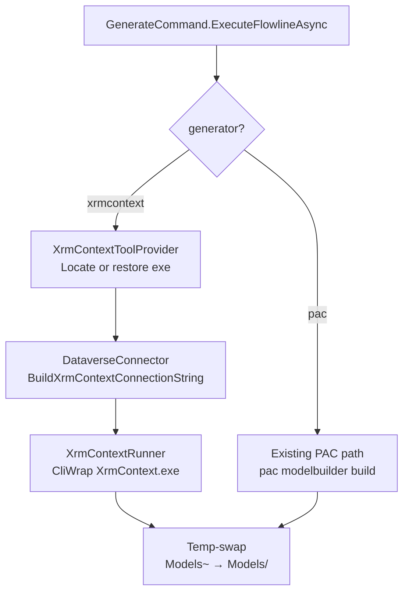
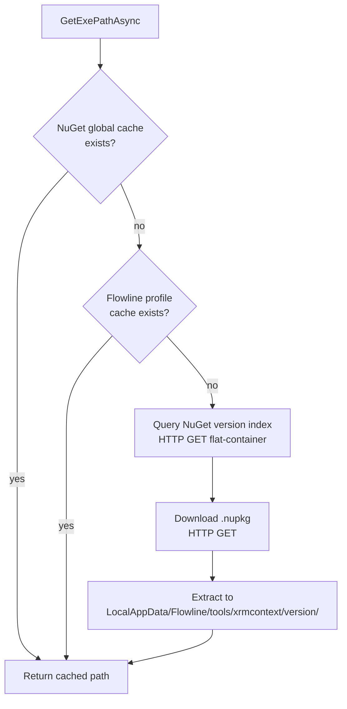

# feat: Add XrmContext generator support to flowline generate

## Summary

Add `--generator {pac|xrmcontext-fs}` to `flowline generate`. PAC remains the default. When `xrmcontext-fs` is selected, Flowline auto-restores `Delegate.XrmContext` from NuGet, builds a connection string from the active PAC profile, and invokes XrmContext as an external process using the same temp-swap output pattern as the PAC path.

**Note:** The flag value for this generator is `xrmcontext-fs` (F# exe bridge). The value `xrmcontext` is reserved for the DataverseProxyGenerator rewrite — see `docs/brainstorms/2026-06-18-generate-xrmcontext-rewrite-requirements.md`.

---

## Problem Frame

`flowline generate` hardcodes `pac modelbuilder build`, which produces verbose early-bound C# that mirrors the Dataverse SDK type system (OptionSetValue wrappers, Money types, INotifyPropertyChanged boilerplate). XrmContext generates the same coverage with cleaner idioms — option sets become enums directly, Money becomes decimal, files are compact. For developers already invested in XrmContext's style, swapping to PAC-generated code is friction without benefit.

*(see origin: `docs/brainstorms/2026-06-17-generate-xrmcontext-support-requirements.md`)*

---

## Alternatives Considered

### Alternative A (current plan): Wrap old `Delegate.XrmContext`

Wrap the existing stable release (`Delegate.XrmContext` NuGet, F# exe, .NET Framework 4.6.2, last released September 2022). Extract and cache the exe; reconstruct a connection string from the PAC profile; invoke via CliWrap.

**Pros:** Released, pinnable, known behavior.  
**Cons:** Windows-only, .NET Framework only, no Custom API generation, no nullable types, maintenance stalled since 2022. Requires a Flowline-native generator long-term (deferred in Scope Boundaries).

---

### Alternative B: Wrap xrmcontext rewrite (`DataverseProxyGenerator`)

The `rewrite` branch at [delegateas/XrmContext](https://github.com/delegateas/XrmContext/tree/rewrite) is a complete C# .NET 8 rewrite, installable as `dotnet tool install xrmcontext`. Flowline would be a thin orchestrator: translate `.flowline` config → `appsettings.json` entries and shell out to `dotnet xrmcontext`.

**What the rewrite covers (vs old version):**
- Custom API generation (`GenerateCustomApis: true`) — closes the biggest gap in Alt A
- Nullable types (`--nullable`)
- Cross-platform (.NET 8 tool, not .NET Framework exe)
- PAC CLI-compatible auth (same `method:OAuth` + AppId flow Flowline already uses)
- Scriban templates (user-overridable generation)
- `GetColumnName`, `ContainsAttributes`, `RemoveAttributes` helpers on all entities
- `[OptionSetMetadata]`, `[RelationshipMetadata]` attributes with localizations
- Intersection interfaces, alternate key helpers

**Flowline's role under Alt B:**
- Config discovery from `.flowline` (users don't manage a separate `appsettings.json`)
- `flowline generate` drives `dotnet xrmcontext` as a dotnet tool (no exe extraction, no connection string reconstruction — auth is handled by the tool itself via PAC)
- Validation that the tool is installed (`dotnet tool restore`)
- Output path aligned to Flowline folder structure convention

**Pros:** No Windows-only constraint, Custom APIs covered, active development, eliminates the need for a Flowline-native generator (closes the deferred item from Scope Boundaries).  
**Cons:** Not yet released to NuGet — but one `v*` tag push away (as of 2026-06-18: CI fully wired, zero TODOs, last commit June 5). Downstream risk: if maintainers delay the tag, Flowline is blocked. Different config surface — `appsettings.json` rather than CLI flags, so Flowline must manage config file creation/merging.

**Release readiness (checked 2026-06-18):** Deploy pipeline wired (`.github/workflows/deploy.yml` triggers on `v*` tag → build → test → pack → NuGet push). NuGet API key configured. README fully documents the dotnet tool interface. No TODO/FIXME in source. Tests exist (xUnit + Verify.NET). PackageId: `XrmContext`. Only missing: a maintainer pushing the tag.

**Recommendation:** Alt B is the default choice. Monitor the repo for a `v*` tag; as soon as it ships, implement Alt B and skip Alt A entirely. The orchestration layer is simpler (dotnet tool vs exe extraction + connection string surgery) and the generation surface is complete without a follow-on native generator. If the tag does not land before Flowline needs to ship the generator feature, fall back to Alt A as a bridge.

---

## Requirements

**Generator selection**

- R1. `flowline generate` accepts `--generator {pac|xrmcontext-fs}`; default `pac` when flag and config are both absent.
- R2. Generator choice persists to `.flowline` under `generate.generator` per solution on every run — including when defaulting to `pac`. First `flowline generate` in a project writes `generator: pac` without requiring an explicit flag.
- R3. CLI `--generator` overrides the saved config value for that run and updates `.flowline` with the new value.

**XrmContext availability**

- R4. When XrmContext is selected and the binary is not cached locally, Flowline restores it before generation without user action.
- R5. The binary is cached in a stable path so subsequent runs skip the download.

**XrmContext generation behavior**

- R6. Flowline derives a connection string from the active PAC profile for the target environment — no separate XrmContext auth config required.
- R7. Flowline passes the solution name via `/solutions:` so XrmContext performs its own entity discovery; any `extraTables` from config are appended via `/entities:` (both arguments additive, comma-separated).
- R8. Namespace derivation follows the same chain as the PAC path: config value → `Plugins.csproj` fallback → `<SolutionName>.Models`.
- R9. Output writes to `Plugins/Models~` and is renamed to `Plugins/Models/` on success.
- R10. Custom API generation is skipped entirely when XrmContext is active; no PAC fallback.

---

## Key Technical Decisions

**Connection string reconstructed from PAC profile, not ServiceClient.** `ServiceClient` does not expose a connection string. `DataverseConnector` already reads PAC profiles via `FindBestProfile(environmentUrl)`. A new method `BuildXrmContextConnectionString` on `DataverseConnector` reconstructs the string from profile data: service principal profiles yield a clean `AuthType=ClientSecret` string; user/UNIVERSAL profiles are handled on a best-effort basis (see Open Questions). *(see origin R6)*

**NuGet global package cache checked first; HttpClient download as fallback.** XrmContext is a .NET Framework exe inside `Delegate.XrmContext.nupkg`, not a dotnet tool. The NuGet global cache at `~/.nuget/packages/delegate.xrmcontext/` may already hold the package (from prior Daxif/NUKE use). If absent, Flowline downloads via the NuGet HTTP flat-container API and extracts to `LocalApplicationData/Flowline/tools/xrmcontext/{version}/`. Using `ZipArchive` (BCL) avoids additional dependencies. *(see origin Key Decisions: Auto-restore from NuGet, cache in user profile)*

**Version resolved to latest at restore time; no pinning.** The NuGet version index endpoint returns available versions; Flowline picks the highest stable. No `generate.xrmcontextVersion` config field. *(see origin Key Decisions: version resolved to latest)*

**`GeneratorType` enum, not string, for type safety in config and code.** Stored as lowercase string in JSON (`"pac"`, `"xrmcontext-fs"`) via `JsonStringEnumConverter` with lowercase naming policy. Typed enum prevents accidental string comparisons in the branch logic. The member `GeneratorType.XrmContext` serializes as `"xrmcontext-fs"`; `"xrmcontext"` is reserved for `GeneratorType.XrmContextRewrite` added by the rewrite plan.

**Save behavior: always write the resolved generator.** Unlike `--namespace` (which saves only when explicitly passed), the generator is always saved — whether the user passed `--generator` or accepted the default. This ensures `.flowline` reflects the active generator on every run without requiring an explicit flag on first use. `--generator` changes the saved value going forward. *(see origin R2, R3)*

**`if/else` branch in `GenerateCommand`, no generator interface.** XrmContext logic lives in a dedicated `XrmContextRunner` class injected via DI. The branch in `GenerateCommand.ExecuteFlowlineAsync` is a simple `if (generator == XrmContext)` block. No `ICodeGenerator` abstraction until a third generator materializes. *(see origin Key Decisions: No generator abstraction yet)*

**Custom API discovery is skipped when XrmContext is active.** The discovery call is wrapped in `if (generator == Pac)` — a trivial conditional that skips it entirely for XrmContext, matching R10. No results to discard; no fallback discovery runs. *(see origin R10)*

---

## High-Level Technical Design

The XrmContext path inserts three new service calls between namespace derivation and the existing temp-swap logic:

`XrmContextToolProvider` — cache lookup then download:

---

## Scope Boundaries

**Deferred for later**
- Flowline-native generator (XrmContext philosophy, .NET 10) — superseded by Alternative B if xrmcontext rewrite ships to NuGet
- Migration to Alt B (xrmcontext rewrite dotnet tool) — implement when rewrite is released
- DLAB EBG V2

**Out of scope**
- Formal `ICodeGenerator` abstraction — extract when a third generator lands
- XrmContext configuration options beyond namespace, entity filter, and output path

---

## Risks & Dependencies

- **XrmContext maintenance (Alt A only)**: `Delegate.XrmContext` last released September 2022, .NET Framework 4.6.2 only. Accepted as bridge risk; Alt B (rewrite) is actively maintained and eliminates this concern when it ships.
- **Alt B tag dependency**: Alt B requires the maintainers to push a `v*` NuGet release tag. As of 2026-06-18 this is imminent (CI wired, no blockers) but not guaranteed on any timeline. Mitigation: implement Alt A first; migrate to Alt B when tag drops.
- **User/UNIVERSAL auth**: connection string reconstruction for interactive OAuth accounts is unverified. Failure mode: `FlowlineException(ExitCode.NotAuthenticated)` with a clear message directing users to service principal auth. Investigate during U3 implementation.
- **Transitive .nupkg dependencies**: `Delegate.XrmContext` declares `FSharp.Core` and `Microsoft.CrmSdk.XrmTooling.CoreAssembly` as NuGet dependencies. When downloading the `.nupkg` directly, only files packaged inside it are extracted — dependent DLLs may or may not be bundled. Verify the package's `tools/` contents during U2 implementation; if transitive DLLs are missing, recursively download and extract each dependency's `.nupkg` to the same cache directory (same NuGet flat-container API, same `ZipArchive` approach). Do not use `dotnet restore` as a fallback — `Delegate.XrmContext` targets `net462` and `dotnet restore` from a .NET 10 SDK will not produce usable output.
- **Windows-only**: XrmContext v3.0.1 is a .NET Framework exe and will not run on Linux or macOS. `XrmContextToolProvider.GetExePathAsync` must check `RuntimeInformation.IsOSPlatform(OSPlatform.Windows)` at entry and throw `FlowlineException(ExitCode.BuildFailed, "XrmContext generator requires Windows. Use --generator pac on Linux/macOS.")` if the check fails — fail fast before any download or invocation attempt. A future Flowline-native generator removes this constraint.

---

## Open Questions

**Deferred to implementation**
- **UNIVERSAL profile connection string**: Does XrmContext support `AuthType=OAuth` with PAC's MSAL token cache path and app ID (`1950a258-227b-4e31-a9cf-717495945fc2`)? If yes, construct the OAuth string silently. If no, throw `FlowlineException(NotAuthenticated)` explaining the limitation. Resolve by testing during U3.
- **XrmContext exe path inside `.nupkg`**: Exact entry path (e.g., `tools/net462/XrmContext.exe` vs `tools/XrmContext.exe`) needs verification by inspecting the actual package. Resolve at the start of U2 implementation.

---

## Sources & Research

- `src/Flowline/Commands/GenerateCommand.cs` — PAC invocation pattern, temp-swap, save behavior, standalone vs project mode (lines 193–267)
- `src/Flowline/Config/ProjectConfig.cs` — `GenerateConfig` class, `JsonIgnore(WhenWritingNull)` pattern (lines 276–283)
- `src/Flowline.Core/Services/DataverseConnector.cs` — `FindBestProfile`, `GetPacCliDataDirectory`, MSAL token cache path (lines 165–192)
- `src/Flowline/Utils/PacUtils.cs` — external tool discovery pattern, CliWrap invocation shape (lines 106–173)
- `src/Flowline/Utils/NamespaceDeriver.cs` — namespace derivation chain (lines 14–44)
- `src/Flowline/Program.cs` — DI registration pattern, command registration (lines 25–122)
- XrmContext wiki: CLI arguments confirmed — `/connectionString:`, `/solutions:`, `/entities:`, `/namespace:`, `/out:` (comma-separated, additive)
- NuGet flat-container API: `https://api.nuget.org/v3-flatcontainer/delegate.xrmcontext/index.json` (version list), `.../delegate.xrmcontext.{version}.nupkg` (download)
- `docs/solutions/logic-errors/sync-overwrites-uncommitted-src-without-warning-2026-05-15.md` — CliWrap patterns: no try/catch, split on `\r\n`, always pass workingDirectory

---

## Implementation Units

### U1. GeneratorType enum, `--generator` flag, and `GenerateConfig.Generator`

**Goal:** Introduce `GeneratorType`, wire the `--generator` CLI flag into `GenerateCommand.Settings`, and add the `Generator` field to `GenerateConfig` with JSON round-trip support.

**Requirements:** R1, R2, R3

**Dependencies:** none

**Files:**
- `src/Flowline/Config/ProjectConfig.cs` — add `GeneratorType` enum and `GenerateConfig.Generator`
- `src/Flowline/Commands/GenerateCommand.cs` — add `--generator` option to `Settings`
- `tests/Flowline.Tests/ProjectConfigTests.cs` — extend with generator serialization cases

**Approach:**
- Define `GeneratorType { Pac, XrmContext }` adjacent to `GenerateConfig` in `ProjectConfig.cs`.
- Add `[JsonIgnore(Condition = WhenWritingNull)] public GeneratorType? Generator { get; set; }` to `GenerateConfig`. Null means "not set"; absent from JSON when null.
- Apply `[JsonConverter(typeof(JsonStringEnumConverter))]` directly on `GeneratorType` (or the `Generator` property) — do NOT add `JsonStringEnumConverter` to the global serializer options, as that would silently change serialization of any existing enum properties in `ProjectConfig`.
- Add `[CommandOption("--generator")] public GeneratorType? Generator { get; set; }` to `GenerateCommand.Settings`. No `[DefaultValue]` — null means "not passed" so it can be distinguished from an explicit `pac`.

**Patterns to follow:** `GenerateConfig.Namespace` and `GenerateConfig.ExtraTables` for nullable field + `JsonIgnore` pattern. `[CommandOption]` usage in any existing `Settings` class.

**Test scenarios:**
- `GenerateConfig { Generator = GeneratorType.XrmContext }` serializes to `"generator": "xrmcontext-fs"` and round-trips cleanly.
- `GenerateConfig { Generator = null }` omits `generator` field from JSON.
- `GenerateConfig` with `"generator": "pac"` deserializes to `GeneratorType.Pac`.
- `GenerateCommand.Settings` with `--generator xrmcontext-fs` parses to `GeneratorType.XrmContext`.
- `GenerateCommand.Settings` with no `--generator` flag leaves `Settings.Generator` null.

**Verification:** `ProjectConfigTests` pass. `GenerateCommand.Settings` resolves `--generator xrmcontext-fs` to `GeneratorType.XrmContext` in a unit test.

---

### U2. XrmContextToolProvider — binary acquisition and cache

**Goal:** Locate the XrmContext exe from the NuGet global package cache or Flowline's own profile cache, downloading and extracting it if neither holds it.

**Requirements:** R4, R5

**Dependencies:** none

**Files:**
- `src/Flowline.Core/Services/XrmContextToolProvider.cs` — new
- `tests/Flowline.Tests/XrmContextToolProviderTests.cs` — new

**Approach:**
- `GetExePathAsync(CancellationToken)` returns an absolute path to `XrmContext.exe`.
- **Step 0 — OS guard:** check `RuntimeInformation.IsOSPlatform(OSPlatform.Windows)`. If false, throw `FlowlineException(ExitCode.BuildFailed, "XrmContext generator requires Windows. Use --generator pac on Linux/macOS.")`. No download or cache lookup should occur on non-Windows platforms.
- **Step 1 — NuGet global cache probe:** Check `~/.nuget/packages/delegate.xrmcontext/` for any version directory. If found, verify exe exists inside (path within package confirmed during implementation — likely `tools/net462/XrmContext.exe`). Return on hit.
- **Step 2 — Flowline profile cache probe:** Check `LocalApplicationData/Flowline/tools/xrmcontext/{version}/XrmContext.exe`. Return on hit.
- **Step 3 — Download:** Query `https://api.nuget.org/v3-flatcontainer/delegate.xrmcontext/index.json` via `HttpClient` to get the latest stable version (filter out pre-release versions — entries containing `-` in the version string). Download the `.nupkg`. Use `ZipArchive` to extract entries whose path starts with `tools/` to `LocalApplicationData/Flowline/tools/xrmcontext/{version}/`. Return the exe path.
- Throw `FlowlineException(ExitCode.BuildFailed, ...)` with actionable message if download fails or exe not found after extraction.
- Use `Environment.GetFolderPath(SpecialFolder.LocalApplicationData)` for profile path — matches `DataverseConnector.GetPacCliDataDirectory()` pattern.
- Inject `HttpClient` via DI (registered as singleton in `Program.cs`).

**Patterns to follow:** `DataverseConnector.GetPacCliDataDirectory()` for profile path construction. `FlowlineException(ExitCode, message)` for errors.

**Test scenarios:**
- Throws `FlowlineException(BuildFailed)` on non-Windows OS before any cache/download logic runs.
- Returns path when exe found in NuGet global cache (mock filesystem).
- Returns path when found in Flowline profile cache (mock filesystem), skipping download.
- Downloads, extracts, and returns path when neither cache has the binary (mock `HttpClient`).
- Throws `FlowlineException(BuildFailed)` when NuGet API returns non-success status.
- Throws `FlowlineException(BuildFailed)` when exe entry not found in downloaded `.nupkg`.

**Verification:** Runs against a real NuGet download in a manual integration pass; unit tests pass with mocked `HttpClient`.

---

### U3. Connection string from PAC profile

**Goal:** Extend `DataverseConnector` with a method that reconstructs an XrmContext-compatible connection string from the active PAC profile for a given environment URL.

**Requirements:** R6

**Dependencies:** none

**Files:**
- `src/Flowline.Core/Services/DataverseConnector.cs` — add `BuildXrmContextConnectionString`
- `tests/Flowline.Tests/DataverseConnectorTests.cs` — extend

**Approach:**
- `BuildXrmContextConnectionString(string environmentUrl)` calls existing `FindBestProfile(environmentUrl)`.
- Throws `FlowlineException(ExitCode.NotAuthenticated, "No PAC profile found for {url}. Run 'pac auth create' first.")` if no profile.
- For `ServicePrincipal` profile: return `AuthType=ClientSecret;Url={url};AppId={appId};ClientSecret={secret};`
- For `UNIVERSAL` profile: attempt `AuthType=OAuth;Url={url};AppId=1950a258-227b-4e31-a9cf-717495945fc2;RedirectUri=http://localhost;TokenCacheStorePath={tokenCachePath};` — if XrmContext rejects this silently during testing, throw `FlowlineException(NotAuthenticated, "XrmContext requires a service principal PAC profile. Run 'pac auth create --applicationId ... --clientSecret ...' to set one up.")`.
- Normalize environment URL (trim trailing slash) before lookup — match `DataverseConnector.ConnectViaPacAsync` behavior.
- **Known limitation**: the connection string (including `ClientSecret`) is passed as a CLI argument to XrmContext and is transiently visible in process listings. No mitigation is available — XrmContext only accepts `/connectionString:` as a CLI argument. This is documented here so the implementer does not attempt workarounds that don't exist.

**Patterns to follow:** `DataverseConnector.FindBestProfile()` and `GetPacCliDataDirectory()`. `FlowlineException(ExitCode.NotAuthenticated, ...)` with corrective action in the message (per `docs/solutions/architecture-patterns/ai-agent-consumable-cli-contract-2026-06-07.md`).

**Test scenarios:**
- Service principal profile → returns correctly formatted `ClientSecret` connection string.
- UNIVERSAL profile → returns connection string or throws `NotAuthenticated` with actionable message (behavior confirmed during implementation).
- No profile found → throws `FlowlineException(NotAuthenticated)`.
- Environment URL with trailing slash normalized before lookup.

**Verification:** Manual test against a service principal PAC profile confirms XrmContext accepts the resulting connection string.

---

### U4. XrmContextRunner — invoke XrmContext via CliWrap

**Goal:** Wrap XrmContext invocation in the same CliWrap + verbose-logging + temp-swap pattern used by the PAC path.

**Requirements:** R7, R8, R9, R10

**Dependencies:** U2, U3

**Files:**
- `src/Flowline.Core/Services/XrmContextRunner.cs` — new
- `tests/Flowline.Tests/XrmContextRunnerTests.cs` — new

**Approach:**
- `RunAsync(string exePath, string solutionName, string[]? extraTables, string modelNamespace, string connectionString, string tempOutputPath, CancellationToken)`.
- Build CliWrap command:
  - `/solutions:{solutionName}`
  - `/entities:{string.Join(",", extraTables)}` — only when `extraTables` is non-null and non-empty
  - `/namespace:{modelNamespace}`
  - `/connectionString:{connectionString}`
  - `/out:{tempOutputPath}`
- No PAC-style prefixArgs (XrmContext is a direct exe, not a dotnet tool).
- Apply `WithToolExecutionLog(verbose, ctx)` — same extension already used in `GenerateCommand`.
- Do not catch CliWrap exceptions — let non-zero exit bubble per project convention.
- Temp-swap (`tempOutputPath~` → final path) is the caller's responsibility (handled in U5's `GenerateCommand` branch, matching where PAC's swap lives).

**Patterns to follow:** PAC invocation in `GenerateCommand.cs` lines 199–234. `WithToolExecutionLog` extension.

**Test scenarios:**
- Correct argument list: `/solutions:`, `/namespace:`, `/connectionString:`, `/out:` always present.
- `/entities:` included with comma-separated values when `extraTables` has entries.
- `/entities:` absent when `extraTables` is null.
- `/entities:` absent when `extraTables` is empty array.
- No `--generatesdkmessages` or `--messagenamesfilter` arguments present (R10).

**Verification:** Unit tests pass. Integration: run against a real Dataverse environment and confirm output files appear in the temp folder.

---

### U5. Wire generator branch in GenerateCommand

**Goal:** Route `GenerateCommand` through either the PAC path (unchanged) or the XrmContext path based on the resolved generator, and persist the generator choice to config following the same save rules as namespace.

**Requirements:** R1, R2, R3, R7, R8, R9, R10

**Dependencies:** U1, U4 (which depends on U2, U3)

**Files:**
- `src/Flowline/Commands/GenerateCommand.cs` — add generator resolution + XrmContext branch
- `src/Flowline/Program.cs` — register `XrmContextToolProvider` and `XrmContextRunner` in DI
- `tests/Flowline.Tests/GenerateCommandTests.cs` — extend from U1 with routing tests
- `../Flowline.wiki/Command-Reference.md` — document `--generator xrmcontext-fs` as Windows-only under the `generate` command flags

**Approach:**
- **Generator resolution** (after namespace derivation, before dirty-tree guard): `var generator = settings.Generator ?? projectSln?.Generate?.Generator ?? GeneratorType.Pac;`
- **Custom API discovery**: skip entirely when `generator == XrmContext` (R10). Move the discovery call inside an `if (generator == Pac)` block.
- **XrmContext branch**: call `XrmContextToolProvider.GetExePathAsync()` → `DataverseConnector.BuildXrmContextConnectionString(environmentUrl)` → `XrmContextRunner.RunAsync(...)`. Wrap in the same Spectre spinner pattern used by the PAC path. Apply existing temp-swap and dirty-tree swap to the XrmContext output folder.
- **PAC branch**: existing code, untouched.
- **Save behavior**: always save the resolved generator to config — no conditional. In the save block, set `config.Generate.Generator = generator` unconditionally. Whether the user passed `--generator` or accepted the default `pac`, the effective generator is written every run. This is intentionally simpler than the `namespaceWasDerived` pattern — generator always has a meaningful value to save.

**Patterns to follow:** Existing `if (customApiNames.Count > 0)` branching in PAC invocation. `namespaceWasDerived` save-condition pattern. DI registration in `Program.cs` alongside `DataverseConnector`.

**Test scenarios:**
- `--generator xrmcontext-fs` with no config → XrmContext path runs; generator saved to config.
- `--generator pac` with no config → PAC path runs; `pac` saved to config.
- No flag, config has `generator: xrmcontext-fs` → XrmContext path runs; config unchanged.
- No flag, no config → PAC path runs; `generator: pac` saved to config.
- `--generator pac` with config `generator: xrmcontext-fs` → PAC runs; config updated to `generator: pac`.
- Custom API discovery skipped when XrmContext is active.
- Custom API discovery runs when PAC is active.
- Temp-swap applies to XrmContext output folder on success.

**Verification:** `flowline generate --generator xrmcontext-fs` against a real Dataverse environment produces `Plugins/Models/` with XrmContext-style generated classes. PAC path behaviour unchanged.
