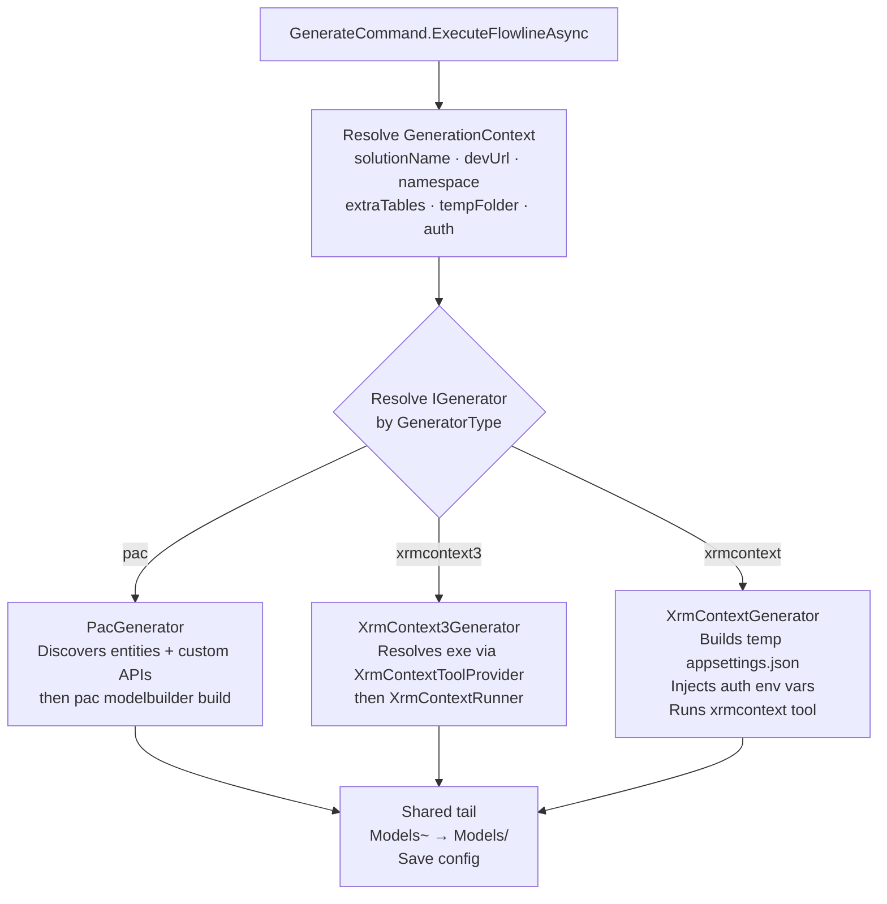
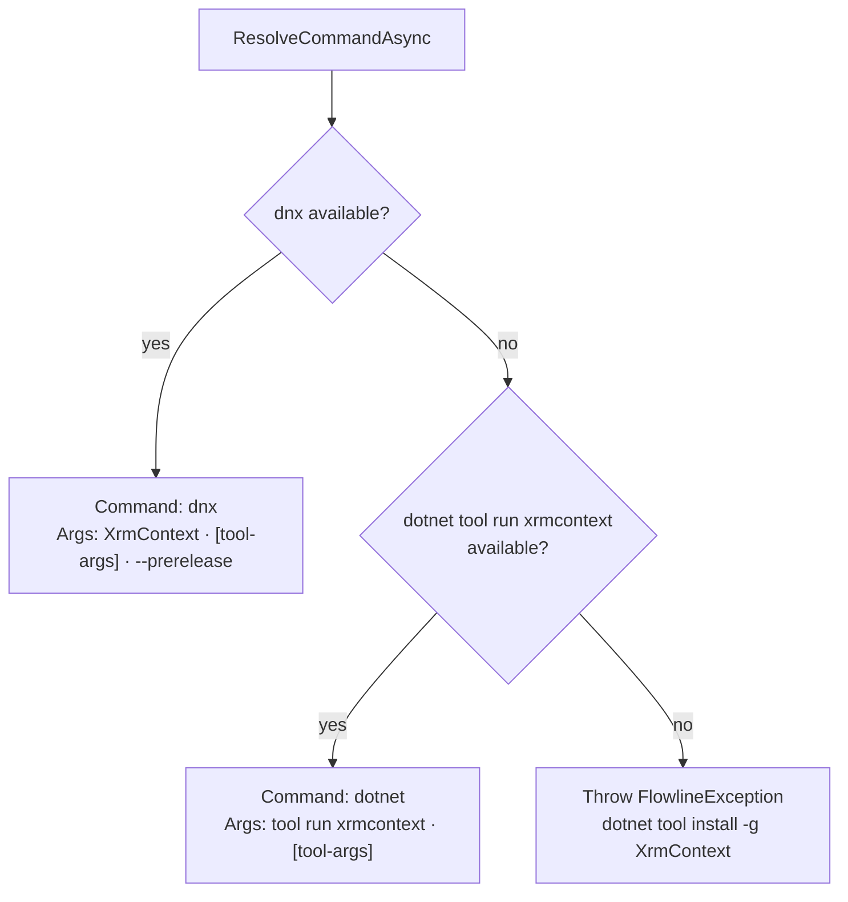

# feat: Add `--generator xrmcontext` (XrmContext v4) via `IGenerator` abstraction

## Summary

Add `--generator xrmcontext` to `flowline generate`, backed by the XrmContext v4 dotnet tool (NuGet: `XrmContext`, beta). Alongside the new generator, refactor `GenerateCommand` to replace the growing if-statement with an `IGenerator` abstraction — the third generator triggers the investment. PAC and xrmcontext3 are extracted into their own generator classes. The v4 generator resolves the best invocation command (dnx first, dotnet tool run second), writes a temp `appsettings.json` from `.flowline` config, injects auth env vars from the active PAC profile, and invokes the tool with its working directory set to the temp config folder.

*(see origin: `docs/brainstorms/2026-06-18-generate-xrmcontext-rewrite-requirements.md`)*

---

## Problem Frame

`GenerateCommand.ExecuteFlowlineAsync` contains a growing `if/else` branch per generator — two today, three with this change. The prior plan explicitly deferred an `IGenerator` abstraction until a third generator materialized. That point is now. The refactor keeps each generator's logic self-contained and eliminates the escalating complexity in the command class.

On the feature side: the XrmContext v4 rewrite (C# .NET 8, cross-platform, Custom APIs native) is available on NuGet as `XrmContext` (v4.0.0-beta.25, March 2026). It uses a completely different orchestration model from v3 — temp `appsettings.json` + working directory rather than exe extraction + connection string.

---

## Requirements Trace

| Req | Description |
|-----|-------------|
| R1 | `--generator xrmcontext` selects XrmContext v4 |
| R2 | `--generator xrmcontext3` continues to select the F# exe bridge |
| R3 | Generator persists to `.flowline` on every run |
| R4 | Resolve best invocation: `dnx XrmContext --prerelease` (priority 1) or `dotnet tool run xrmcontext` (priority 2) |
| R5 | Fail with `FlowlineException(BuildFailed)` and install instructions when neither available |
| R6 | Temp `appsettings.json` generated from `.flowline` config, deleted on completion |
| R7 | Auth via `DefaultAzureCredential`; service principal profiles get `AZURE_CLIENT_ID` / `AZURE_TENANT_ID` injected from PAC profile; `AZURE_CLIENT_SECRET` passed through from process env |
| R8 | `XrmContext:Solutions`, `XrmContext:Entities`, `XrmContext:NamespaceSetting` derived from `.flowline` config; `XrmContext:OutputDirectory` must equal `context.TempOutputPath` (the `Models~` temp path) — `GenerateCommand.cs:337` checks this path and moves it to the final models folder on success |
| R9 | `XrmContext:GenerateCustomApis: true` always set |
| R10 | Custom API discovery via Dataverse queries is automatically disabled for the `xrmcontext` v4 generator — v4 generates Custom APIs directly from solution metadata; no separate discovery needed |
| R11 | Working directory of the tool process set to the temp config folder (tool reads `appsettings.json` from cwd) |
| R12 | CliWrap + `WithToolExecutionLog` + verbose logging, same as PAC and xrmcontext3 paths |
| R13 | Non-zero exit bubbles as `FlowlineException` — no silent catch |

---

## Key Technical Decisions

**`IGenerator` abstraction, not a switch.** Each generator implements `IGenerator { GeneratorType Type; Task RunAsync(GenerationContext, CancellationToken); }`. `GenerateCommand` resolves the matching generator and calls `RunAsync`. No switch, no growing if-chain. The three generators are registered in DI and resolved by type.

**`GenerationContext` carries resolved inputs.** A record with the common inputs all generators need: `Service`, `RemoteSolution`, `SolutionName`, `DevUrl`, `ModelNamespace`, `ExtraTables`, `TempOutputPath`, `Verbose`, `OutputLabel`, and `XrmContextAuth?`. The last field is xrmcontext3-specific (null for PAC and v4) — simpler than a second auth hierarchy for a single case.

**Auth for xrmcontext3 resolved in `GenerateCommand`, not in the generator.** The CLI auth flags (`--xrm-client-id`, `--username`, etc.) are a command-layer concern. `GenerateCommand` builds `XrmContextAuth` and puts it in `GenerationContext` before calling any generator. The `XrmContext3Generator` reads `context.XrmContextAuth`.

**`XrmContextGenerator` owns the temp appsettings lifecycle.** The generator creates the temp dir, writes `appsettings.json`, sets working directory and env vars, runs the tool, then deletes the temp dir (try/finally). `Models~` cleanup on failure stays in `GenerateCommand` (same as today).

**dnx invocation shape: suffix, not prefix.** `--prerelease` is a dnx option that must come AFTER XrmContext's own args: `dnx XrmContext [xrmcontext-args] --prerelease`. In CliWrap: args = `["XrmContext", ...xrmcontextArgs, "--prerelease"]`. Contrast with PAC where `--yes` is a prefix arg.

**`XrmContext:GenerateCustomApis: true` hardcoded in generated appsettings.json.** No opt-out flag until a use case emerges (R9). Custom API discovery from Dataverse is skipped entirely for the v4 generator (R10).

**`GeneratorType.XrmContext` serializes as `"XrmContext"` (PascalCase).** The enum uses `JsonStringEnumConverter` without a naming policy — same as `"XrmContext3"` and `"Pac"`. The CLI flag value `xrmcontext` (lowercase) is matched case-insensitively by Spectre Console.

*(see origin: Key Technical Decisions)*

---

## High-Level Technical Design

Generator routing in `GenerateCommand.ExecuteFlowlineAsync`:



Tool command resolution in `XrmContextGenerator`:



---

## Scope Boundaries

**In scope**
- `IGenerator` interface + `GenerationContext` record
- `PacGenerator` — extract PAC path from `GenerateCommand`
- `XrmContext3Generator` — extract xrmcontext3 path from `GenerateCommand`
- `XrmContextGenerator` — new v4 generator (tool resolution, appsettings builder, CliWrap runner)
- `GeneratorType.XrmContext` enum member
- `GenerateCommand` refactor — remove generator branches, wire IGenerator collection
- `Program.cs` DI registration for all three generators

**Deferred to follow-up work**
- NullableTypes opt-in (`NullableTypes: false`) — expose when requested
- Intersection interfaces, alternate key helpers — v4 supports them; out of scope now
- Stable NuGet release of v4 — plan implements against beta; update docs when stable ships

**Out of scope**
- `XrmContextToolProvider` / `XrmContextRunner` changes — xrmcontext3 services unchanged
- Custom API opt-out flag for v4
- Generator interface used for anything other than routing `GenerateCommand`

---

## Assumptions

- **`AZURE_CLIENT_SECRET` from process env.** PAC auth profiles do not store client secrets. For service principal profiles, `AZURE_CLIENT_SECRET` must already be present in the process environment (typical in CI/CD setups). Flowline injects `AZURE_CLIENT_ID` and `AZURE_TENANT_ID` from the PAC profile, then `DefaultAzureCredential` picks up the secret from env. If absent, `DefaultAzureCredential` falls through its chain (Azure CLI, interactive browser). Validate behavior against a real service principal environment during U5 implementation.
- **`DATAVERSE_URL` in appsettings.json.** `DataverseConnection.AddDataverse()` reads `DATAVERSE_URL` from `IConfiguration`, which includes both `appsettings.json` and environment variables. The plan places it as a top-level key in `appsettings.json` (avoids extra env var injection). If verification shows `DataverseConnection` requires it as an env var specifically, move it there.

---

## Risks & Dependencies

- **Beta dependency**: `XrmContext` v4.0.0-beta.25 — breaking changes possible before stable. Low risk: Flowline is pre-v1.0. Track for stable release; no blockers for implementation.
- **User/UNIVERSAL profile auth**: `DefaultAzureCredential` behavior against a real user-profile environment is unvalidated. `SharedTokenCacheCredential` may overlap with PAC's MSAL cache (transparent auth) or may fall through to interactive browser. Validate during U5 implementation.
- **Tenant ID source**: `PacProfile.TenantId` may be null for some profiles. If null, omit `AZURE_TENANT_ID` injection — `DefaultAzureCredential` can resolve tenant from the resource URL.

---

## Open Questions

**Deferred to implementation**
- **User/UNIVERSAL profile auth chain**: Does `SharedTokenCacheCredential` read the PAC MSAL cache transparently? If not, direct users to `az login`. Validate during U5.
- **`DATAVERSE_URL` placement**: appsettings.json top-level key vs env var — confirm during U5 by running the tool and observing configuration loading.
- **SP profile without `AZURE_CLIENT_SECRET`**: Does XrmContext v4 accept a pre-acquired token (via `WithClientAssertion` cache-only pattern, `DataverseConnector.cs:87`)? If yes, add the fallback path to the U5 implementation. If no, fail fast with a clear error — do not fall through `DefaultAzureCredential` to a different identity. Validate against a real SP environment during U5.

---

## Implementation Units

### U1. `IGenerator` interface and `GenerationContext` record

**Goal:** Define the abstraction that decouples generator logic from `GenerateCommand`.

**Requirements:** (foundation for R1–R3, R10–R13)

**Dependencies:** none

**Files:**
- `src/Flowline/Generators/IGenerator.cs` — new
- `src/Flowline/Generators/GenerationContext.cs` — new

**Approach:**
- `IGenerator` has one property `GeneratorType Type` and one method `Task RunAsync(GenerationContext context, CancellationToken cancellationToken = default)`.
- `GenerationContext` is a record:
  - `IOrganizationServiceAsync2 Service`
  - `SolutionInfo RemoteSolution`
  - `string SolutionName`
  - `string DevUrl`
  - `string ModelNamespace`
  - `string[] ExtraTables`
  - `string TempOutputPath`
  - `XrmContextAuth? XrmContextAuth` — null for PAC and v4; set by `GenerateCommand` for xrmcontext3
  - `bool Verbose`
  - `string OutputLabel` — display label used by generators for spinner and console messages
- Both files in namespace `Flowline.Generators`.
- Field-to-config mapping for `XrmContextGenerator`: `TempOutputPath` → `XrmContext:OutputDirectory` in appsettings.json; `DevUrl` → `DATAVERSE_URL` (top-level key).

**Patterns to follow:** `XrmContextAuth` DU in `src/Flowline/Services/XrmContextRunner.cs` for reference on colocating related types.

**Test scenarios:**
- Test expectation: none — these are pure interface/record definitions with no behavior of their own.

**Verification:** Project compiles. Existing tests pass.

---

### U2. `GeneratorType.XrmContext` enum member

**Goal:** Make the v4 generator selectable via `--generator xrmcontext` and persistable to `.flowline`.

**Requirements:** R1, R3

**Dependencies:** none

**Files:**
- `src/Flowline/Config/ProjectConfig.cs` — add `XrmContext` to `GeneratorType` enum
- `src/Flowline/Commands/GenerateCommand.cs` — update `--generator` description to `(pac|xrmcontext3|xrmcontext)`
- `tests/Flowline.Tests/ProjectConfigTests.cs` — extend with `XrmContext` serialization cases

**Approach:**
- Add `XrmContext` as the third member of `GeneratorType` (after `XrmContext3`).
- No naming policy on the converter → serializes as `"XrmContext"` (PascalCase). The CLI flag `xrmcontext` (lowercase) is matched case-insensitively by Spectre Console.
- Update the `[Description]` on `--generator` from `(pac|xrmcontext3)` to `(pac|xrmcontext3|xrmcontext)`.

**Patterns to follow:** Existing `GeneratorType.XrmContext3` as the immediate precedent.

**Test scenarios:**
- `GeneratorType.XrmContext` serializes to `"XrmContext"` in JSON.
- `{"Generator":"XrmContext"}` deserializes to `GeneratorType.XrmContext`.
- Existing `"XrmContext3"` and `"Pac"` round-trips are unaffected.

**Verification:** `ProjectConfigTests` pass, including the two new cases and all pre-existing cases.

---

### U3. `PacGenerator` — extract PAC path

**Goal:** Move the PAC generation block out of `GenerateCommand` into a self-contained `IGenerator` implementation.

**Requirements:** Existing PAC behavior preserved (no requirements change)

**Dependencies:** U1

**Files:**
- `src/Flowline/Generators/PacGenerator.cs` — new
- `tests/Flowline.Tests/Generators/PacGeneratorTests.cs` — new

**Approach:**
- `PacGenerator(IAnsiConsole, FlowlineRuntimeOptions)` implements `IGenerator` with `Type = GeneratorType.Pac`.
- `RunAsync` contains the PAC block verbatim from `GenerateCommand` (entity discovery, custom API discovery, `pac modelbuilder build` via CliWrap).
- On `!result.IsSuccess`, throw `FlowlineException(ExitCode.BuildFailed, "pac modelbuilder build failed — check the output above.")` instead of returning `int`. `GenerateCommand` holds the try/catch that cleans up `TempOutputPath`.
- `generationDuration` — `RunAsync` returns `void`; `GenerateCommand` wraps the call in a `Stopwatch` for elapsed time.
- `PacUtils.GetBestPacCommandAsync()` called inside `RunAsync` (same as today).
- Entity and custom API discovery use `context.Service` and `context.RemoteSolution.Id`.

**Patterns to follow:** Existing PAC block in `GenerateCommand` lines 254–334. `WithToolExecutionLog` + `FlowlineSpinner` pattern.

**Test scenarios:**
- Happy path: `RunAsync` completes when `pac modelbuilder build` exits 0.
- `RunAsync` throws `FlowlineException(BuildFailed)` when pac exits non-zero.
- Entity filter: `solutionEntities + extraTables` deduplicated and passed as `-enf`.
- Custom API args (`--generatesdkmessages`, `--messagenamesfilter`) included when `customApiNames.Count > 0`.
- Custom API args absent when no custom APIs discovered.
- `--suppressINotifyPattern`, `-sgca`, `--emitfieldsclasses` always present.

**Verification:** `PacGeneratorTests` pass. `flowline generate` (no `--generator`) produces the same output as before the refactor. **Regression-validation required:** run against a real PAC environment before merge — U3 moves currently-working code.

---

### U4. `XrmContext3Generator` — extract xrmcontext3 path

**Goal:** Move the xrmcontext3 generation block into a self-contained `IGenerator` implementation.

**Requirements:** Existing xrmcontext3 behavior preserved

**Dependencies:** U1

**Files:**
- `src/Flowline/Generators/XrmContext3Generator.cs` — new
- `tests/Flowline.Tests/Generators/XrmContext3GeneratorTests.cs` — new

**Approach:**
- `XrmContext3Generator(IAnsiConsole, FlowlineRuntimeOptions, XrmContextToolProvider, XrmContextRunner)` implements `IGenerator` with `Type = GeneratorType.XrmContext3`.
- `RunAsync` reads `context.XrmContextAuth` — throws `FlowlineException(ExitCode.ConfigInvalid, "XrmContext3 generator requires auth credentials — pass --xrm-client-id/--xrm-client-secret or --username/--password.")` if null.
- Calls `xrmContextToolProvider.GetExePathAsync()` then `xrmContextRunner.RunAsync(...)` with the same parameters as today.
- `GenerateCommand` remains responsible for building `XrmContextAuth` from settings and passing it in context (auth resolution stays at the CLI tier, not in the generator).

**Patterns to follow:** Existing xrmcontext3 block in `GenerateCommand` lines 199–253.

**Test scenarios:**
- `RunAsync` calls `xrmContextToolProvider.GetExePathAsync()` and `xrmContextRunner.RunAsync()` with correct params.
- Throws when `context.XrmContextAuth` is null.
- `XrmContextAuth.ClientSecret` path forwarded correctly to runner.
- `XrmContextAuth.ConnectionString` path forwarded correctly.
- `XrmContextAuth.BrowserOAuth` path forwarded correctly.

**Verification:** `XrmContext3GeneratorTests` pass. `flowline generate --generator xrmcontext3` behaves identically to before the refactor. **Regression-validation required:** run against a real xrmcontext3 environment before merge — U4 moves currently-working code.

---

### U5. `XrmContextGenerator` — XrmContext v4 generator

**Goal:** Implement the new v4 generator: tool resolution, temp appsettings.json, auth env var injection, CliWrap invocation.

**Requirements:** R4, R5, R6, R7, R8, R9, R10, R11, R12, R13

**Dependencies:** U1, U2

**Files:**
- `src/Flowline/Generators/XrmContextGenerator.cs` — new
- `tests/Flowline.Tests/Generators/XrmContextGeneratorTests.cs` — new

**Approach:**

`XrmContextGenerator(IAnsiConsole, FlowlineRuntimeOptions, DataverseConnector)` implements `IGenerator` with `Type = GeneratorType.XrmContext`. `DataverseConnector` is called inside `RunAsync` via `FindBestProfile(devUrl)` to resolve the PAC profile for auth env var injection.

**Tool resolution** (`ResolveCommandAsync`, internal static or private):
1. Check `dnx --help` (or `dnx --version`) — if succeeds, return `(Command: "dnx", PrefixArgs: ["XrmContext"], SuffixArgs: ["--prerelease"])`.
2. Check `dotnet tool run xrmcontext --help` — if succeeds, return `(Command: "dotnet", PrefixArgs: ["tool", "run", "xrmcontext"], SuffixArgs: [])`.
3. Throw `FlowlineException(ExitCode.BuildFailed, "XrmContext not found. Install it with: dotnet tool install -g XrmContext")`.

**Arg construction (dnx path):**
```csharp
// dnx path: dnx XrmContext [tool-args] --prerelease
// --prerelease goes LAST — opposite of PAC's prefix-arg shape (PacUtils.cs:138 uses --yes as prefix)
var args = new[] { "XrmContext" }.Concat(toolArgs).Append("--prerelease");
```

**Temp appsettings.json** (built inline in `RunAsync`):
```json
{
  "DATAVERSE_URL": "<devUrl>",
  "XrmContext": {
    "OutputDirectory": "<tempOutputPath>",
    "NamespaceSetting": "<modelNamespace>",
    "ServiceContextName": "XrmContext",
    "Solutions": ["<solutionName>"],
    "Entities": [...extraTables],
    "GenerateCustomApis": true
  }
}
```
- Written to `Path.Combine(Path.GetTempPath(), $"flowline-xrmcontext-{Guid.NewGuid()}")` + `appsettings.json`.
- Temp dir created and deleted in try/finally inside `RunAsync`.
- `XrmContext:Entities` omitted (not an empty array) when `extraTables` is empty — avoids overriding the tool's own defaults.

**Auth env vars** (injected via `WithEnvironmentVariables`):
- For all profiles: `DATAVERSE_URL = devUrl` (also in appsettings.json as belt-and-suspenders).
- If `profile?.IsServicePrincipal == true`:
  - `AZURE_CLIENT_ID = profile.ApplicationId` (if non-null)
  - `AZURE_TENANT_ID = profile.TenantId` (if non-null)
  - `AZURE_CLIENT_SECRET` — read from current process env via `Environment.GetEnvironmentVariable("AZURE_CLIENT_SECRET")`; inject if present (pass-through).
  - If `AZURE_CLIENT_SECRET` is absent: attempt a token from the PAC MSAL cache using the same `WithClientAssertion("cache-only")` pattern as `DataverseConnector.cs:87`. If XrmContext v4 does not accept a pre-acquired token, fail with `FlowlineException(ConfigInvalid)` instructing the user to set `AZURE_CLIENT_SECRET` — do NOT fall through `DefaultAzureCredential` to a different identity. Validate this path during U5 implementation (see Open Questions).
- Profile resolved via `DataverseConnector.FindBestProfile(devUrl)` called in `RunAsync`.
- If no profile found, proceed without injection — `DefaultAzureCredential` attempts its full chain.

**CliWrap invocation:**
- Args: `[...prefixArgs, "--output", tempOutputPath, "--solutions", solutionName, "--namespace", modelNamespace, ...extraEntityArgs, ...suffixArgs]`
- `--entities` arg added (comma-separated) only when `extraTables` is non-empty.
- Working directory: `WithWorkingDirectory(tempAppsettingsDir)`.
- `WithToolExecutionLog(verbose, ctx, toolDisplayName: "xrmcontext")`.
- No `CreateDirectory(tempOutputPath)` — XrmContext v4 creates its output directory itself (verify during implementation; add if needed).
- Let CliWrap exceptions bubble — no try/catch per project convention.

**Patterns to follow:** `XrmContextRunner.BuildArgs()` for arg building shape. `PacUtils.CheckCommandExistsAsync` (via `CheckCommandExistsFunc` hook) for availability checks. `WithToolExecutionLog` usage throughout the codebase.

**Test scenarios:**
- Resolves dnx path when dnx is available; args include `"XrmContext"` as first arg and `"--prerelease"` as last arg.
- Resolves dotnet-tool-run path when dnx unavailable.
- Throws `FlowlineException(BuildFailed)` when neither command available.
- Generated appsettings.json: `XrmContext:Solutions` = `[solutionName]`, `XrmContext:NamespaceSetting` = namespace, `XrmContext:OutputDirectory` = tempOutputPath.
- `XrmContext:Entities` included when extraTables non-empty; absent when empty.
- `XrmContext:GenerateCustomApis: true` always present.
- `DATAVERSE_URL` in appsettings.json equals devUrl.
- `AZURE_CLIENT_ID` injected when service principal profile present.
- `AZURE_TENANT_ID` injected when service principal profile has TenantId.
- `AZURE_CLIENT_SECRET` injected when present in process environment.
- Working directory set to temp appsettings dir (not tempOutputPath).
- Temp appsettings dir deleted after successful run.
- Temp appsettings dir deleted after exception in CliWrap.
- `--prerelease` is the last arg in the dnx command args list.

**Verification:** Integration: `flowline generate --generator xrmcontext` against a real Dataverse env produces `Plugins/Models/` with XrmContext v4-style classes.

---

### U6. Refactor `GenerateCommand` + DI registration

**Goal:** Replace the generator if-else with `IGenerator` collection resolution; remove extracted blocks; register all generators in DI.

**Requirements:** R1–R3 (routing); preserves all requirements via generators

**Dependencies:** U1, U2, U3, U4, U5

**Files:**
- `src/Flowline/Commands/GenerateCommand.cs` — remove generator branches, add IGenerator resolution
- `src/Flowline/Program.cs` — register `PacGenerator`, `XrmContext3Generator`, `XrmContextGenerator`
- `tests/Flowline.Tests/GenerateCommandTests.cs` — extend `GeneratorResolutionTests` with XrmContext case

**Approach:**

Constructor changes:
- Remove `XrmContextToolProvider` and `XrmContextRunner` direct parameters (these move into generator classes).
- Add `IEnumerable<IGenerator> generators` parameter — DI injects all registered generators.

`ExecuteFlowlineAsync` changes:
- Keep auth resolution for xrmcontext3 (builds `XrmContextAuth` from settings → put in `GenerationContext`). This stays in the command tier; it reads CLI flags.
- Build `GenerationContext` record once, before calling any generator.
- Resolve: `var generator = generators.Single(g => g.Type == resolvedGeneratorType);`
- Remove all three generator branches; replace with:
  ```csharp
  try {
      await generator.RunAsync(context, cancellationToken);
  }
  catch {
      if (Directory.Exists(tempFolder))
          Directory.Delete(tempFolder, recursive: true);
      throw;
  }
  ```
- Remove `generationDuration` special case (or capture via `Stopwatch` wrapped around `RunAsync`).
- Shared tail (empty check, Models~ swap, save, Done message) unchanged.

`Program.cs` DI registration — register each generator against the `IGenerator` interface (not as a concrete type) so `IEnumerable<IGenerator>` resolves correctly:
```csharp
services.AddSingleton<IGenerator, PacGenerator>();
services.AddSingleton<IGenerator, XrmContext3Generator>();
services.AddSingleton<IGenerator, XrmContextGenerator>();
```
- `DataverseConnector` must also be registered (for `XrmContextGenerator`'s constructor) — verify it is already registered as a singleton, or add it.

`GenerateCommandTests.cs`:
- Add `Resolve_SettingsXrmContext_NoConfig_ReturnsXrmContext` and `Resolve_SettingsNull_ConfigXrmContext_ReturnsXrmContext` cases to `GeneratorResolutionTests`.
- `XrmContextAuthResolutionTests` unchanged — auth resolution stays in GenerateCommand.

**Patterns to follow:** DI registration pattern in `Program.cs` for existing services. `IEnumerable<T>` resolution used elsewhere in the codebase (if present); otherwise `generators.Single(g => g.Type == ...)` is self-explanatory.

**Test scenarios:**
- `--generator xrmcontext` resolves to `GeneratorType.XrmContext`.
- `--generator xrmcontext3` still resolves to `GeneratorType.XrmContext3`.
- No `--generator` flag defaults to `GeneratorType.Pac`.
- Config `generator: XrmContext` with no flag resolves to `GeneratorType.XrmContext`.
- Generator saved to `.flowline` on run (all three types).

**Verification:** `dotnet test` passes. `flowline generate`, `flowline generate --generator xrmcontext3`, and `flowline generate --generator xrmcontext` all route to the correct generator.

---

## Sources & Research

- `src/Flowline/Commands/GenerateCommand.cs` — generator branches being extracted (lines 173–334), shared tail (335–368), auth resolution (208–233)
- `src/Flowline/Config/ProjectConfig.cs:276–281` — `GeneratorType` enum, `JsonStringEnumConverter` without naming policy
- `src/Flowline/Utils/PacUtils.cs:106–173` — `GetBestPacCommandAsync` dnx resolution pattern; `CheckCommandExistsAsync` hook for testability
- `src/Flowline/Services/XrmContextRunner.cs` — `XrmContextAuth` discriminated union, `BuildArgs` pattern
- `src/Flowline.Core/Services/DataverseConnector.cs:210–215` — `FindBestProfile` for SP profile lookup
- `docs/plans/2026-06-17-001-feat-generate-xrmcontext-generator-plan.md` — xrmcontext3 plan; explicit deferral note for `ICodeGenerator` abstraction (KTD: `if/else` branch)
- XrmContext v4 source (`rewrite` branch): `SimpleXrmContextConfigBuilder.cs` — config shape; `CommandLineParser.cs` — CLI args
- `dnx XrmContext --prerelease --help` *(verified 2026-06-18)*: `--prerelease` is a dnx option (NuGet resolver); invocation shape `dnx <packageId> [commandArguments...] [dnx-options]`
