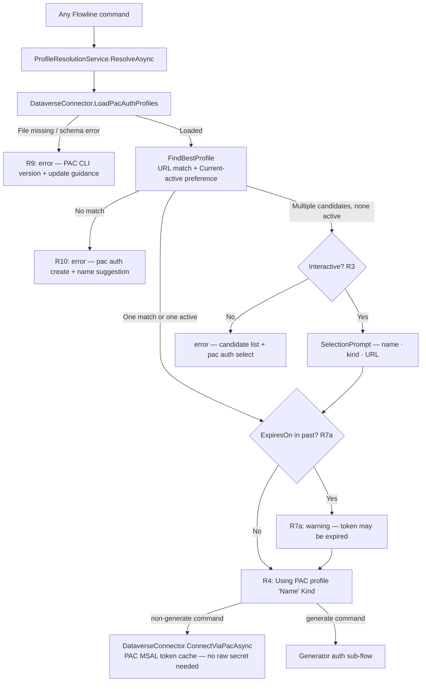
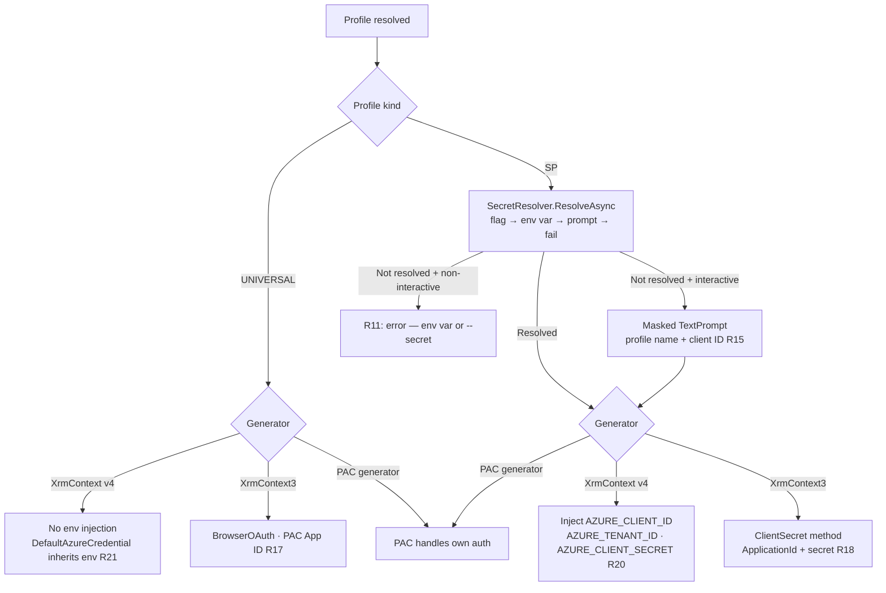

# feat: PAC-as-oracle auth contract and generate simplification

## Summary

Establish PAC-as-oracle as the single auth contract across all Flowline commands. Improve profile resolution with active-profile preference and a CLI picker for ambiguous cases. Remove four `generate` auth params and replace with two lightweight overrides. Retire ROPC. Wire XrmContext3 and XrmContext v4 to derive credentials from the PAC profile automatically.

---

## Problem Frame

Flowline connects to Dataverse two ways: its own `ServiceClient` (sync, deploy, environment, and others) and generator subprocesses (`generate`). Both already read PAC auth profiles, but the generator path requires the user to configure auth a second time via `--xrm-client-id`, `--xrm-client-secret`, `--username`, or `--password`. The PAC profile already contains the needed information.

ROPC (the OAuth flow behind `--username`/`--password`) fails on MFA-enabled tenants (`AADSTS50076`) and is actively discouraged by Microsoft. Profile resolution does not yet prefer the PAC-active profile when multiple candidates match, and has no ambiguity handling for the interactive case. PAC profile file reads are fast and correct but lack resilience error messages that help users self-serve.

(see origin: `docs/brainstorms/2026-06-19-auth-strategy-requirements.md`)

---

## Requirements

**Credential resolution — all commands**

- R1. All Flowline commands that connect to Dataverse use the PAC profile as the single credential source.
- R2. Profile resolution prefers the profile PAC has marked active (`Current[Kind]` in `authprofiles_v2.json`) when multiple profiles match the target environment URL. Multiple active candidates → first wins. No URL-specific match → fall back to the active UNIVERSAL profile.
- R3. When multiple candidates match and none is active: present a profile picker (name, kind, URL) in interactive mode; in non-interactive mode fail with the candidate list and `pac auth select` guidance.
- R4. Always emit a status line after profile selection: `Using PAC profile '<Name>' (Kind)` or `Using PAC profile (unnamed, Kind) — <URL>` when no name is set.
- R5. For SP profiles: `ApplicationId` and `TenantId` are read from the profile; the client secret is always resolved from process env or runtime input, never from PAC profiles or `.flowline`.
- R6. For UNIVERSAL profiles: use PAC CLI App ID for XrmContext3 BrowserOAuth; inherit the parent env for XrmContext v4 `DefaultAzureCredential`.
- R7. In verbose mode, log the matched profile, derived auth method, and command name.
- R7a. If the selected profile's `ExpiresOn` is in the past, emit a warning before proceeding: `PAC profile '<Name>' token may be expired — run pac auth create --environment <url> to refresh.`

**PAC profile resilience — all commands**

- R8. Read PAC profiles from the JSON file on disk (existing approach — fast, correct).
- R9. If the profile file is missing, unreadable, or its format is unexpected, fail with a clear error naming the PAC CLI version in use and directing the user to update PAC CLI or report a bug.
- R10. If no PAC profile matches the target environment URL, fail with an error that includes the exact `pac auth create --environment <url> --name "<suggestion>"` command, where the name suggestion is derived from the URL host segment (e.g. `automatevalue-dev.crm4.dynamics.com` → `AutomateValue-Dev`).
- R11. For `generate` with XrmContext/XrmContext3 and an SP profile: if no client secret is resolved before subprocess invocation, fail with a clear error naming both resolution paths (`AZURE_CLIENT_SECRET` env var and `--secret` flag).

**`generate`: CLI surface**

- R12. Remove `--xrm-client-id`, `--xrm-client-secret`, `--username`, and `--password` from `generate`.
- R13. Add `--client-id` and `--secret` to `generate` for XrmContext3 and XrmContext v4 only. `--secret` alone requires SP profile (error if UNIVERSAL). `--client-id` + `--secret` together override subprocess credentials while PAC profile still provides env URL and tenant. `--client-id` without `--secret` → immediate error.
- R14. Recommended SP auth path: `pac auth create --applicationId <id> --tenant <tenant>` plus `AZURE_CLIENT_SECRET` in the process environment. `--secret` is a convenience alternative when setting an env var is impractical.
- R15. When a client secret is needed and none is resolved from `--secret` or `AZURE_CLIENT_SECRET`, and Flowline is in interactive mode: prompt with `TextPrompt.Secret()` displaying the profile name and client ID. In non-interactive mode fail immediately naming both resolution paths. The prompted secret is held in memory only — never written to disk.

**`generate`: ROPC removal**

- R16. Remove ROPC auth entirely. `--username` / `--password` removed without a prompt replacement; BrowserOAuth is the interactive path.

**`generate`: XrmContext3**

- R17. UNIVERSAL profile: auto-use BrowserOAuth with PAC CLI App ID (`51f81489-12ee-4a9e-aaae-a2591f45987d`). ADAL caches the token after first browser login; subsequent runs reuse it silently.
- R18. SP profile: use ClientSecret method with `ApplicationId` from profile plus the resolved client secret (see Q1).
- R19. Non-interactive mode with no SP credentials available: fail with an error recommending upgrade to XrmContext v4.

**`generate`: XrmContext v4**

- R20. SP profile: inject `AZURE_CLIENT_ID` and `AZURE_TENANT_ID` from profile into subprocess env; inject secret from `--secret` flag if `AZURE_CLIENT_SECRET` env var is absent.
- R21. UNIVERSAL profile: no env injection; `DefaultAzureCredential` resolves credentials from its own chain.

**Documentation**

- R22. Rewrite `Authentication.md` in the wiki alongside code changes, covering: PAC profile types, step-by-step setup for each auth scenario, generator auth path matrix, why `AZURE_CLIENT_SECRET` must be an env var, platform notes (Windows vs Linux/Mac), profile resolution order, and troubleshooting for common errors.
- R23. CLI error messages must include enough context for self-service: exact command to run, suggested profile name from URL, and a reference to the wiki auth page where relevant.

---

## Actors

- A1. Developer — interactive, local machine (Windows, Linux, or Mac), uses personal credentials or SP.
- A2. CI pipeline — non-interactive, always SP, runs `pac auth create` as a pipeline step before Flowline commands.

---

## Key Technical Decisions

- **`ProfileResolutionResult` return type.** `DataverseConnector.FindBestProfile()` returns a discriminated result (`ProfileFound`, `ProfileAmbiguous`, `ProfileNotFound`) instead of `PacProfile?`. This keeps `Flowline.Core` free of Spectre.Console while letting the CLI layer own picker UI, status display, and expiry warnings. A new `ProfileResolutionService` in the CLI project bridges the Core result to the UI layer and is called by all command handlers.

- **R11 scoped to generator subprocess paths.** `DataverseConnector.ConnectServicePrincipalAsync()` uses PAC's MSAL token cache via `WithClientAssertion`; it does not need the raw client secret. R11 applies to generator subprocess invocations only — where XrmContext3 and v4 need a raw secret that the PAC cache cannot supply.

- **Active profile preference via `Current[Kind]`.** `PacAuthProfiles.Current` is already deserialized. `FindBestProfile` compares each URL-matching candidate against `Current[profile.Kind]` — the first candidate whose identity matches the `Current` entry for its kind is preferred. When `Current` has no entry for a given Kind, fall back to the first URL-matching candidate (existing behavior).

- **ProfileType field ignored.** PAC profiles include a `ProfileType` value (e.g. 4 = OperatingSystem, 0 = User). Both are auth-equivalent. Profile selection uses URL match and `Current[Kind]` only — `ProfileType` is not considered.

- **Secret resolution order.** `--secret` CLI flag → `AZURE_CLIENT_SECRET` env var → interactive `TextPrompt.Secret()` → fail. `AZURE_CLIENT_SECRET` is recommended by documentation (R14) for security reasons (masked in CI logs); `--secret` takes code precedence as an explicit CLI override.

- **XrmContext3 UNIVERSAL always uses BrowserOAuth.** MSAL→ADAL token injection is confirmed impossible (incompatible caches). ADAL's browser OAuth with PAC's App ID is the only working interactive path. ADAL caches the token after first login; reuse is expected on subsequent runs. Using the PAC CLI App ID (`51f81489-12ee-4a9e-aaae-a2591f45987d`) is intentional: it is a Microsoft-registered multi-tenant app with Dataverse permissions pre-consented; browser OAuth needs no client secret, so there is no credential risk. Acceptable risk: Microsoft could change this App ID. Mitigation: XrmContext3 is a bridge generator being phased out — a Flowline-specific app registration is not warranted. Implement as a named constant in U5 with a comment citing the source.

- **XrmContext3 SP uses ClientSecret method (pending Q1).** Passing PAC profile `ApplicationId` and the resolved secret to XrmContext3 via `/method:ClientSecret` avoids any cache interaction. If Q1 is confirmed broken during implementation, fall back to BrowserOAuth for interactive mode (R17) and fail in non-interactive mode (R19).

- **`--client-id`/`--secret` are transient.** These flags are not saved to `.flowline`. `GenerateConfig.XrmClientId` and `GenerateConfig.XrmUsername` are removed. Existing `.flowline` files with removed fields are unaffected: JSON deserialization ignores unknown properties on read; write omits them.

- **PAC CLI version in R9 error messages.** Run `pac --version` lazily inside the R9 error path only — not on the happy path. Its output is included in the error message to help users correlate with known schema-change versions.

---

## High-Level Technical Design

### Auth flow — all commands



### Generator auth sub-flow (`generate` command)



---

## Scope Boundaries

### Deferred for later
- `AZURE_*` env vars as standalone SP auth without any PAC profile (CI-without-PAC-setup path).
- Azure CLI (`az login`) as an independent Flowline auth source.
- Saving auth overrides to `.flowline` config.
- `DefaultAzureCredential` as the Dataverse `ServiceClient` token provider (would enable Linux/Mac UNIVERSAL support for sync/deploy without `az login`, but larger change; not needed until Linux/Mac is a real target).

### Outside scope
- Replacing PAC CLI as a dependency — PAC is required for pack/unpack/push/pull.
- Profile management (create, rename, select, delete) — stays with PAC CLI. Flowline advises only.
- XrmContext3 deep auth investment — phasing out in favour of XrmContext v4.

---

## Open Questions

- Q1. Does XrmContext3 `/method:ClientSecret /mfaAppId:{id} /mfaClientSecret:{secret}` work? The confirmed failure was MSAL→ADAL token cache injection; this explicit-credential path (no cache involved) was not separately verified. **Test during implementation.** If it works, R18 holds. If it fails: R17 (BrowserOAuth) is the interactive fallback; R19 governs non-interactive.
- Q2. Minimum supported PAC CLI version for the current `authprofiles_v2.json` schema. Document it so R9's version-in-error-message is actionable. **Verify during implementation** by checking the `authprofiles_v2.json` schema version field or PAC CLI release notes.
- ~~Q3. Does the `ProfileType` field affect which profile is selected?~~ **Resolved.** ProfileType (e.g. 4 = OperatingSystem, 0 = User) is not meaningful for auth — active detection uses `Current[Kind]` only. ProfileType is ignored during profile selection.
- Q4. ADAL browser token lifetime for XrmContext3 — whether a second `generate` run reuses the ADAL-cached token without opening a browser (expected yes). **Confirm during implementation.**

---

## Risks & Dependencies

- **PAC profile JSON schema stability.** `authprofiles_v2.json` is an undocumented internal format. Schema changes break all Dataverse connections across all commands. Mitigation: R9 defensive parsing with a clear error naming the PAC CLI version.
- **XrmContext3 ClientSecret method (Q1).** If this path does not work, XrmContext3 SP auth in non-interactive mode has no fallback (R19 is the only non-interactive path). Affects CI pipelines still using XrmContext3. XrmContext v4 is the recommended upgrade path.
- **ADAL deprecation.** XrmContext3 uses ADAL v4 (deprecated). No action in this plan — XrmContext3 is a bridge generator.
- **`ExpiresOn` field.** Already typed as `DateTime?` in `PacProfile` (`DataverseConnector.cs:276–277`); System.Text.Json handles ISO 8601 natively. Null (absent or unparseable) = expiry unknown → skip the R7a warning rather than blocking.

---

## Implementation Units

### U1. Profile resolution — active preference and ambiguity detection

**Goal:** Update Core profile resolution to prefer PAC-active profiles and return a typed result distinguishing Found, Ambiguous, and NotFound.

**Requirements:** R2, R3, R8

**Dependencies:** none

**Files:**
- `src/Flowline.Core/Services/DataverseConnector.cs`
- `src/Flowline.Core/Services/ProfileResolutionResult.cs` (new)
- `tests/Flowline.Core.Tests/Services/DataverseConnectorTests.cs`

**Approach:** Introduce `ProfileResolutionResult` as an abstract record with three subtypes: `ProfileFound(PacProfile Profile)`, `ProfileAmbiguous(IReadOnlyList<PacProfile> Candidates)`, `ProfileNotFound(string EnvironmentUrl)`. Change `FindBestProfile(string url)` return type from `PacProfile?` to `ProfileResolutionResult`. Compare each URL-matching candidate against `PacAuthProfiles.Current[profile.Kind]` — the first match is the active profile. When multiple URL matches exist and none is active, return `ProfileAmbiguous`. When no URL match exists, check `Current["UNIVERSAL"]` and return `ProfileFound(universalProfile)` if found; otherwise return `ProfileNotFound(url)`.

**Patterns to follow:** `PacAuthProfiles.Current` (already deserialized, `DataverseConnector.cs` L304–311); `FlowlineException` for hard failures.

**Test scenarios:**
- Single profile matches URL → `ProfileFound(that profile)`
- Multiple profiles match URL, one matches `Current[Kind]` → `ProfileFound(active)`, others discarded
- Multiple profiles match URL, none matches `Current[Kind]` → `ProfileAmbiguous(all candidates)`
- Multiple profiles match URL, multiple match `Current[Kind]` → `ProfileFound(first active match)`
- No URL match, UNIVERSAL in `Current["UNIVERSAL"]` → `ProfileFound(UNIVERSAL)`
- No URL match, no UNIVERSAL → `ProfileNotFound(url)`
- `Profiles` is empty → `ProfileNotFound(url)`

**Verification:** All callers of `FindBestProfile` pass type-check after return-type change; unit tests pass.

---

### U2. Profile resolution CLI wrapper — picker, status line, expiry warning

**Goal:** Bridge `ProfileResolutionResult` from Core to the Spectre UI layer; emit status line and expiry warning for all commands.

**Requirements:** R3, R4, R7, R7a

**Dependencies:** U1

**Files:**
- `src/Flowline/Services/ProfileResolutionService.cs` (new)
- `src/Flowline/Commands/FlowlineCommand.cs` — `ConnectToDataverseAsync` (L119) is the single shared call site; `DeployCommand`, `PushCommand`, and `GenerateCommand` all flow through it and need no individual changes
- `tests/Flowline.Tests/Services/ProfileResolutionServiceTests.cs` (new)

**Approach:** `ProfileResolutionService.ResolveAsync(string environmentUrl)` calls `DataverseConnector.FindBestProfile(url)` and dispatches on the result:
- `ProfileFound` → check `ExpiresOn` (already `DateTime?`; null = expiry unknown, skip warning); emit warning if past; emit status line; return profile.
- `ProfileAmbiguous` + interactive → show `SelectionPrompt<PacProfile>` with display strings `'<Name>' (Kind) — <URL>` or `(unnamed, Kind) — <URL>`; emit status line for chosen profile; return it.
- `ProfileAmbiguous` + non-interactive → throw `FlowlineException` with candidate list and `pac auth select` instruction.
- `ProfileNotFound` → throw `FlowlineException` (see U7 for message format).

Caller: `FlowlineCommand.ConnectToDataverseAsync` passes the returned profile to `DataverseConnector.ConnectViaPacAsync(profile, url)`. `ConnectViaPacAsync` already accepts `PacProfile` as its first arg (`DataverseConnector.cs:23`) — no new overload needed.

Status line: `Using PAC profile '<Name>' (Kind)` when `Name` is set; `Using PAC profile (unnamed, Kind) — <URL>` when empty. Verbose mode logs profile file path, matched profile name/kind/URL, and command name. Auth method (ClientSecret, BrowserOAuth, env injection) is logged by U5/U6, not here.

**Patterns to follow:** `ConsoleHelper.IsInteractive()` (`src/Flowline/Utils/ConsoleHelper.cs` L30–41); Spectre.Console `SelectionPrompt<T>`.

**Test scenarios:**
- `ProfileFound` → status line emitted, no picker, profile returned
- `ProfileFound`, `ExpiresOn` past → expiry warning emitted before status line
- `ProfileFound`, `ExpiresOn` future → no warning
- `ProfileFound`, `ExpiresOn` unparseable → no warning, no error
- `ProfileFound`, `Name` empty → status line uses `(unnamed, Kind) — URL` format
- `ProfileAmbiguous`, interactive → picker shown with all candidates; selection emitted as status line (Covers AE8)
- `ProfileAmbiguous`, non-interactive → `FlowlineException` with candidate list and `pac auth select` (Covers AE9)
- `ProfileNotFound` → `FlowlineException` with `pac auth create` command (Covers AE7)
- URL host `automatevalue-dev.crm4.dynamics.com` → name suggestion `AutomateValue-Dev`

**Verification:** Status line appears before any Dataverse operation for all commands; picker is never triggered in non-interactive mode.

---

### U3. Remove old `generate` params; add `--client-id` / `--secret`; clean up `GenerateConfig`

**Goal:** Remove the four old CLI params and two `GenerateConfig` fields; introduce `--client-id` and `--secret`; remove ROPC code.

**Requirements:** R12, R13, R16

**Dependencies:** none (prerequisite for U4, U5, U6)

**Files:**
- `src/Flowline/Commands/GenerateCommand.cs`
- `src/Flowline/Config/ProjectConfig.cs`
- `tests/Flowline.Tests/Commands/GenerateCommandTests.cs`

**Approach:** Delete `[CommandOption("--username")]`, `[CommandOption("--password")]`, `[CommandOption("--xrm-client-id")]`, `[CommandOption("--xrm-client-secret")]` and their backing fields. Add `[CommandOption("--client-id <ID>")]` and `[CommandOption("--secret <SECRET>")]`. Remove `XrmClientId` and `XrmUsername` properties from `GenerateConfig`; remove the code that saves them to `.flowline`. Add an early validation at `ExecuteAsync` entry: if `--client-id` is set but `--secret` is not → throw `FlowlineException` immediately (R13). Remove all ROPC connection-string-building code from `GenerateCommand` (R16).

**Patterns to follow:** Existing `[CommandOption]` declaration style; existing `GenerateConfig` field pattern; `FlowlineException` for param validation.

**Test scenarios:**
- `--client-id` without `--secret` → immediate `FlowlineException` before any profile read
- `--client-id` and `--secret` both provided → accepted, passed downstream
- `--secret` alone → accepted, validated later in U4 against profile kind
- `--xrm-client-id`, `--xrm-client-secret`, `--username`, `--password` → parse error (unrecognized option)
- `GenerateConfig` serialized to JSON → no `xrmClientId` or `xrmUsername` fields
- Existing `.flowline` with `xrmClientId` field → deserializes without error (unknown field ignored)

**Verification:** `dotnet build` passes; `flowline generate --help` shows new params only; removed params cause parse error.

---

### U4. Secret resolution flow

**Goal:** Implement the secret resolution chain (flag → env var → prompt → fail) for generator subprocess invocations.

**Requirements:** R5, R11, R13, R14, R15

**Dependencies:** U3 (needs `--secret` flag to exist), U1 (needs resolved `PacProfile` to determine kind)

**Files:**
- `src/Flowline/Services/SecretResolver.cs` (new)
- `src/Flowline/Commands/GenerateCommand.cs`
- `tests/Flowline.Tests/Services/SecretResolverTests.cs` (new)

**Approach:** `SecretResolver.ResolveAsync(PacProfile profile, string? secretFlag)` implements the chain:
1. If `secretFlag` is non-null → return it.
2. Else if `AZURE_CLIENT_SECRET` env var is set → return it.
3. Else if interactive → show `TextPrompt<string>.Secret('*')` with prompt `Enter client secret for '<Name>' (client ID: <ApplicationId>):` → return prompted value.
4. Else → throw `FlowlineException` naming both resolution paths.

Before calling `ResolveAsync`: if `secretFlag` is set, `profile.IsUniversal`, and no `--client-id` override is present → throw `FlowlineException` (`--secret requires a service principal profile or --client-id`). The resolved secret is held in memory only; never logged even in verbose mode.

**Patterns to follow:** `ConsoleHelper.IsInteractive()`; `TextPrompt<string>` with `.Secret('*')` — existing usage pattern at `GenerateCommand.cs` L230 (reference only; that code is removed in U3).

**Test scenarios:**
- SP profile, `--secret` flag set → returns flag value
- SP profile, no flag, `AZURE_CLIENT_SECRET` set → returns env var value
- SP profile, both flag and env var → returns flag value (flag wins)
- SP profile, no flag, no env var, interactive → masked prompt shown with profile name + client ID (Covers AE3)
- SP profile, no flag, no env var, non-interactive → `FlowlineException` naming both paths (Covers AE4)
- UNIVERSAL profile, `--secret` flag, no `--client-id` → `FlowlineException` (`--secret requires a service principal profile`) (Covers AE11)
- UNIVERSAL profile, `--secret` + `--client-id` → accepted (override path)
- Resolved secret never appears in verbose log output

**Verification:** All four resolution paths work; error messages are self-service; secret is not leaked to logs.

---

### U5. XrmContext3 auth derivation from PAC profile

**Goal:** Wire XrmContext3 to derive its auth args from the resolved PAC profile.

**Requirements:** R17, R18, R19

**Dependencies:** U1 (profile), U4 (secret)

**Files:**
- `src/Flowline/Commands/GenerateCommand.cs`
- `src/Flowline/Services/XrmContextRunner.cs`
- `tests/Flowline.Tests/Services/XrmContextRunnerTests.cs`

**Approach:** Remove the existing manual auth arg assembly in `GenerateCommand` that built `XrmContextAuth` from CLI flags. Replace with profile-derived logic: UNIVERSAL → `XrmContextAuth.BrowserOAuth("51f81489-12ee-4a9e-aaae-a2591f45987d")`; SP → `XrmContextAuth.ClientSecret(profile.ApplicationId, resolvedSecret)`. When `--client-id` override is present, use its value as the client ID instead of `profile.ApplicationId`.

Non-interactive guard: if the derived auth is `BrowserOAuth` and `ConsoleHelper.IsInteractive()` is false → throw `FlowlineException` recommending upgrade to XrmContext v4 (R19). This guard fires before `XrmContextRunner.RunAsync()`.

**Patterns to follow:** `XrmContextAuth.BrowserOAuth()` and `XrmContextAuth.ClientSecret()` factory methods (`src/Flowline/Services/XrmContextRunner.cs` L48–97).

**Test scenarios:**
- UNIVERSAL profile, interactive → `XrmContextAuth.BrowserOAuth("51f81489-…")` (Covers AE5, F3)
- UNIVERSAL profile, non-interactive → `FlowlineException` recommending XrmContext v4 (R19)
- SP profile + resolved secret → `XrmContextAuth.ClientSecret(profile.ApplicationId, secret)` (Covers AE1, AE2, F4)
- SP profile + `--client-id` + resolved secret → `XrmContextAuth.ClientSecret(clientIdFlag, secret)` (Covers AE10)
- PAC generator → no XrmContext3 auth args applied; PAC handles its own auth

**Verification:** XrmContext3 generate with UNIVERSAL profile opens browser once; subsequent runs reuse ADAL cache silently. SP path passes ClientSecret args to subprocess in verbose log.

---

### U6. XrmContext v4 auth derivation from PAC profile

**Goal:** Wire XrmContext v4 to inject SP credentials from the PAC profile; confirm UNIVERSAL no-injection path.

**Requirements:** R20, R21

**Dependencies:** U1 (profile), U4 (secret)

**Files:**
- `src/Flowline/Generators/XrmContextGenerator.cs`
- `tests/Flowline.Tests/Generators/XrmContextGeneratorTests.cs`

**Approach:** `XrmContextGenerator` receives the resolved `PacProfile` and optional resolved secret. For SP profile: inject `AZURE_CLIENT_ID={profile.ApplicationId}`, `AZURE_TENANT_ID={profile.TenantId}`, `AZURE_CLIENT_SECRET={resolvedSecret}` into the subprocess environment. When `--client-id` override is present, use it for `AZURE_CLIENT_ID` instead of `profile.ApplicationId`; `AZURE_TENANT_ID` still comes from the PAC profile. When `resolvedSecret` is provided via `--secret` and `AZURE_CLIENT_SECRET` is already set in the parent env, the `--secret` value takes precedence for the subprocess env only — the parent env is not mutated.

For UNIVERSAL profile: inject nothing; `DefaultAzureCredential` inherits the parent environment.

**Patterns to follow:** Existing env var injection in `XrmContextGenerator.cs` L109–127 (`AZURE_CLIENT_ID`, `AZURE_TENANT_ID` already injected).

**Test scenarios:**
- SP profile, `AZURE_CLIENT_SECRET` env var set → subprocess env contains all three Azure vars from profile + env (Covers AE1, F4)
- SP profile, `--secret` flag, no env var → subprocess env contains `AZURE_CLIENT_SECRET` from flag (Covers AE2)
- SP profile, `--client-id` + `--secret` → subprocess uses override client ID + flag secret; tenant from profile (Covers AE10)
- `--secret` flag set, `AZURE_CLIENT_SECRET` also in parent env → flag wins for subprocess; parent env unchanged
- UNIVERSAL profile, Windows → subprocess env unchanged; `DefaultAzureCredential` resolves via `SharedTokenCacheCredential` (Covers AE5, F1)
- UNIVERSAL profile, Linux/Mac → subprocess env unchanged; falls through to `AzureCliCredential` or `InteractiveBrowserCredential` (Covers AE6, F2)

**Verification:** XrmContext v4 generate succeeds with SP profile and `AZURE_CLIENT_SECRET` in env; UNIVERSAL profile succeeds on Windows with PAC MSAL cache present.

---

### U7. PAC resilience and actionable error messages

**Goal:** Add defensive error handling for profile file failures and ensure all error messages are actionable per R23.

**Requirements:** R9, R10, R23

**Dependencies:** none (touches `LoadPacAuthProfiles`, a different method from U1's `FindBestProfile`; both edit `DataverseConnector.cs` so implement sequentially to avoid merge conflicts)

**Files:**
- `src/Flowline.Core/Services/DataverseConnector.cs`
- `tests/Flowline.Core.Tests/Services/DataverseConnectorTests.cs`

**Approach:** Replace the existing catch-and-Verbose block in `LoadPacAuthProfiles` (L249–258) that silently swallows parse errors and returns null. Replace with targeted catches that throw `FlowlineException`. Defensive cases:
- File missing → run `pac --version` lazily → throw `FlowlineException`:
  `PAC auth profile file not found. PAC CLI version: <version>. Update PAC CLI or file a bug.`
- File unreadable (I/O error) → same pattern.
- JSON parse error or required field absent → same pattern, including the raw exception message.

For `ProfileNotFound` error (called from `ProfileResolutionService`): build the `--name` suggestion from the URL host segment — take the first dot-delimited segment, split on `-`, title-case each part, rejoin with `-`. Final message format:
```
No PAC auth profile found for <url>
Run: pac auth create --environment <url> --name "<Suggestion>"
See: <wiki auth page url>
```

In verbose mode: log the profile file path checked, number of profiles loaded, and each candidate URL tested.

**Patterns to follow:** `FlowlineException`; `Process.Start` or existing PAC subprocess invocation pattern for `pac --version`.

**Test scenarios:**
- Profile file path does not exist → `FlowlineException` with `pac --version` output in message (Covers AE12 partial)
- Profile file exists but JSON malformed → `FlowlineException` with raw exception message + PAC version (Covers AE12)
- Profile file exists but `Kind` field absent → `FlowlineException` with PAC version
- `pac --version` invoked only in error path, not on happy path
- Name suggestion: `automatevalue-dev.crm4.dynamics.com` → `AutomateValue-Dev` (Covers AE7)
- Name suggestion: `myorg.crm.dynamics.com` → `Myorg`
- Name suggestion: URL with path component → only host segment used

**Verification:** All file error paths produce actionable messages; name suggestion matches expected capitalisation; `pac --version` does not run on happy path.

---

### U8. Wiki `Authentication.md` rewrite

**Goal:** Rewrite `Authentication.md` to be comprehensive enough for users to self-serve on all auth scenarios.

**Requirements:** R22, R23

**Dependencies:** none (written alongside code changes)

**Files:**
- `Flowline.wiki/02-Authentication.md`

**Approach:** Rewrite the page to cover:
1. PAC profile types — UNIVERSAL vs ServicePrincipal, what `pac auth create` does, what gets stored.
2. Step-by-step setup for each auth scenario: interactive developer (UNIVERSAL), SP for CI, manual SP override via `--client-id`/`--secret`.
3. Generator auth path matrix: which generators (PAC, XrmContext v4, XrmContext3) support which auth paths, with platform notes.
4. Why `AZURE_CLIENT_SECRET` must be an env var and never stored in config.
5. Platform notes: what works on Windows vs Linux/Mac and why (`SharedTokenCacheCredential`, ADAL browser limitation).
6. Profile resolution order: URL match → active preference → UNIVERSAL fallback → ambiguous picker → error.
7. Troubleshooting: `No PAC auth profile found`, `AZURE_CLIENT_SECRET is required`, `--secret requires a service principal profile`, ambiguous profile list with `pac auth select`.

Error messages from U7 reference the wiki page URL (R23).

**Test expectation:** none — documentation.

**Verification:** Wiki page covers all items in R22; U7 error messages contain a reference to the wiki auth page.

---

## Sources & Research

- `src/Flowline.Core/Services/DataverseConnector.cs` — `FindBestProfile` (L210–215), `LoadPacAuthProfiles` (L239–259), `PacProfile` (L262–302), `PacAuthProfiles` (L304–311), `ConnectServicePrincipalAsync` (L67–112)
- `src/Flowline/Commands/GenerateCommand.cs` — existing auth param declarations (L46–60), auth resolution logic (L209–243), config persistence (L286–300)
- `src/Flowline/Services/XrmContextRunner.cs` — `ConnectionString`/`ClientSecret`/`BrowserOAuth` arg building (L48–97)
- `src/Flowline/Generators/XrmContextGenerator.cs` — SP env var injection (L109–127)
- `src/Flowline/Utils/ConsoleHelper.cs` — `IsInteractive()` (L30–41)
- `src/Flowline/Config/ProjectConfig.cs` — `GenerateConfig` model (current fields)
- `docs/solutions/architecture-patterns/xrmcontext-v4-auth-integration.md` — XrmContext v4 auth pattern and env var injection approach
- `docs/brainstorms/2026-06-19-auth-strategy-requirements.md` — origin: flows F1–F9, AEs AE1–AE12, key decisions
