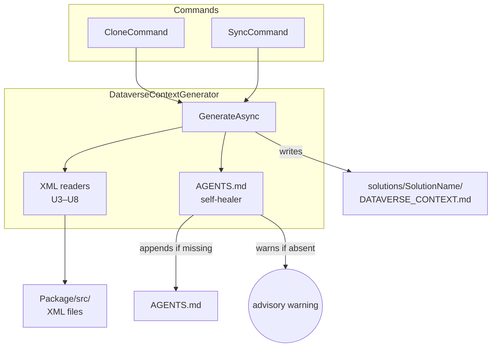
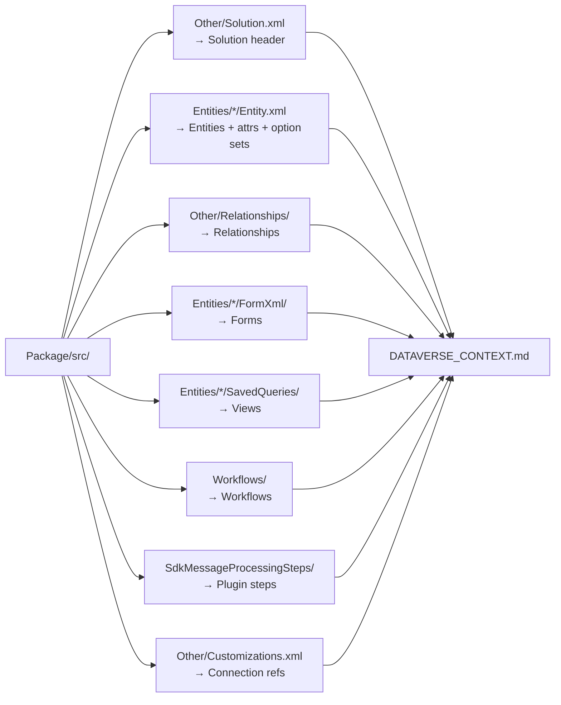

# feat: Add DataverseContextGenerator for AI context

## Summary

After `flowline clone` or `flowline sync` unpacks solution XML, a new `DataverseContextGenerator` reads `Package/src/` to produce `solutions/<SolutionName>/DATAVERSE_CONTEXT.md` — a curated markdown snapshot of the solution's schema optimised for AI token efficiency. The generator also self-heals AGENTS.md by appending the `@` import and markdown link when they are missing. Claude Code, Codex, and GitHub Copilot all read AGENTS.md — one file covers the full agent surface.

---

## Problem Frame

AI agents assisting with Dataverse development need entity structure, option set values, relationships, and automation inventory. Today developers paste field names manually or let agents make repeated discovery queries. The PAC-unpacked solution XML in `Package/src/` already contains this information after `flowline sync` — but raw XML is too verbose and scattered for efficient AI consumption. A single curated markdown file, always current after sync and auto-loaded via AGENTS.md, bridges the gap.

---

## Requirements

**Architecture**
- R1. Generation runs as a post-unpack step in both `flowline clone` and `flowline sync`
- R2. Dedicated `DataverseContextGenerator` class — one implementation, two callers, independently testable
- R3. Generator receives: `Package/src/` path, solution name, repo root path — no live Dataverse connection required

**Output**
- R4. Output path: `solutions/<SolutionName>/DATAVERSE_CONTEXT.md`
- R6. Always regenerated on every successful sync — no opt-in required

**AGENTS.md integration**
- R7. `ScaffoldAgentsFileAsync` template updated to append "Dataverse schema context" section with markdown link and `@` import at the end of the generated AGENTS.md
- R8. Multi-solution repos: one `@` import line and one markdown link per solution appear in AGENTS.md

**Self-healing reference check**
- R9. After writing, check whether AGENTS.md exists; if absent, emit a warning advising `flowline clone` and skip all AGENTS.md mutation; if present, check for `@solutions/<SolutionName>/DATAVERSE_CONTEXT.md` import line and append to end if missing
- R10. If AGENTS.md present, check for a markdown link in a "Dataverse schema context" section; append section and link if missing
- R11. Self-healing is idempotent — existing references are never duplicated

**Content**
- R12. Solution header: display name, unique name, version, publisher prefix from `Other/Solution.xml`
- R13–R17. Entities: header (logical name, display name, EntitySetName, ownership, IsActivity), attributes table (logical name, display name, type, required level, description, custom flag), inline option sets for picklist/boolean, ValidFor flags when not all three are true
- R18–R20. Relationships from `Other/Relationships/{EntityName}.xml`: 1:N/N:1 (schema name, related entity, lookup field) and N:N (schema name, related entity, intersect entity)
- R21–R23. Forms: condensed field list by tab → section from `FormXml/main/`, `FormXml/quick/`, `FormXml/card/`; hidden controls excluded
- R24–R26. Views: name, column list, primary filter summary from `SavedQueries/*.xml`; no verbatim FetchXML
- R27–R28. Workflows: display name, activation state, trigger entity from `Workflows/`
- R29–R30. Plugin steps: message, entity, stage, mode, class name from `SdkMessageProcessingSteps/`
- R31–R32. Connection references: display name, connector ID from `Other/Customizations.xml`
- R33. Sections with no content are omitted entirely
- R34. Display names from `languagecode="1033"`; fall back to logical name
- R35. No GUIDs in output

---

## Key Technical Decisions

- **Do not implement `IGenerator`:** That interface requires `GenerationContext` which carries a live `IOrganizationServiceAsync2`. `DataverseContextGenerator` receives only local paths — separate class, distinct method signature: `GenerateAsync(packageSrcPath, solutionName, repoRootPath, verbose, ct)`. (see origin: R3)

- **Project placement: `src/Flowline/` not `Flowline.Core`:** The generator emits warnings via `IAnsiConsole` (R9). `Flowline.Core` carries no Spectre.Console dependency. Mirrors `SolutionChangeSummary` which also lives in `src/Flowline/Utils/`.

- **AGENTS.md mutation is append-only:** The generator never overwrites AGENTS.md. Checks via `string.Contains()` and appends to end only when missing. Compatible with the skip-if-exists scaffold policy — developer customisation above the appended section is preserved. (see origin: R9–R11)

- **AGENTS.md absent → warn, skip:** If AGENTS.md does not exist during sync, emit a warning advising `flowline clone`. Sync does not scaffold project files — that belongs to clone. `flowline clone` is idempotent and safe to re-run on an existing project. (see origin: R9)

- **`ScaffoldAgentsFileAsync` stays in `CloneCommand`:** The missing-AGENTS.md case is handled by warn-and-skip, not scaffolding from the generator. No extraction needed. R7 only updates the existing template string to include the context section at the end.

- **XML parsing: `XDocument` with BOM stripping:** PAC XML files include a UTF-8 BOM (``). `XDocument.Parse()` throws `XmlException` on it. Always `.TrimStart('')` before parsing. PAC element and attribute names are lowercase — PascalCase queries silently return zero matches. (see origin: `docs/solutions/design-patterns/pac-solution-xml-diff-pattern.md`)

- **Pure XML reader methods — testable without file I/O:** Each content section backed by a static method taking XML string → structured data. Tests pass inline XML strings; no temp directories needed for unit tests. (see origin: R2, AE10)

- **Exception handling: only catch what you can handle.** `XmlException` in a per-file reader method is catchable — skip or warn for that section and continue. File I/O failures, missing directories, and other unexpected exceptions propagate to the caller and fail the command. `OperationCanceledException` always propagates. Do not wrap `GenerateAsync` in a blanket catch-and-warn at the call site.

---

## High-Level Technical Design

### Component overview



### Content assembly data flow



---

## Implementation Units

### U1. Update ScaffoldAgentsFileAsync template

**Goal:** New projects cloned after this feature get the "Dataverse schema context" section and `@` import pre-populated at the end of the generated AGENTS.md.

**Requirements:** R7, R8

**Dependencies:** None

**Files:**
- `src/Flowline/Commands/CloneCommand.cs` — modify `ScaffoldAgentsFileAsync` template string

**Approach:** The template is a C# raw string literal in `ScaffoldAgentsFileAsync`. Append the following block at the end of the template, after all existing content:

```
## Dataverse schema context
- [{solutionName}](solutions/{solutionName}/DATAVERSE_CONTEXT.md)

@solutions/{solutionName}/DATAVERSE_CONTEXT.md
```

The `@` import is valid even before `DATAVERSE_CONTEXT.md` exists. For multi-solution repos, the template seeds the first solution — subsequent solutions are added by the self-healer in U2 (R8, AE7).

**Patterns to follow:** Existing raw string template in `ScaffoldAgentsFileAsync` (CloneCommand, lines 98–167); `{solutionName}` interpolation already in use.

**Test scenarios:**
- Happy: `ScaffoldAgentsFileAsync("MySolution", ...)` produces AGENTS.md whose final section is `## Dataverse schema context` with a link to `solutions/MySolution/DATAVERSE_CONTEXT.md` and `@solutions/MySolution/DATAVERSE_CONTEXT.md`
- Skip-if-exists: AGENTS.md already exists → file is not modified; template change has no effect
- Covers AE7 (two-solution case; second solution's entry is added by the self-healer in U2)

**Verification:** `flowline clone` on a fresh project produces an AGENTS.md ending with the expected context section.

---

### U2. DataverseContextGenerator — class scaffold, file-write, AGENTS.md self-healing

**Goal:** Establish the generator class with its public API, file-write orchestration, and AGENTS.md append/warn logic. XML content sections are plugged in by U3–U8.

**Requirements:** R2, R3, R4, R6, R9, R10, R11

**Dependencies:** None (U3–U8 extend the content assembly incrementally)

**Files:**
- `src/Flowline/Services/DataverseContextGenerator.cs` — new class
- `tests/Flowline.Tests/Services/DataverseContextGeneratorTests.cs` — new test file

**Approach:**

Public API:
```
DataverseContextGenerator(IAnsiConsole console)
Task GenerateAsync(string packageSrcPath, string solutionName, string repoRootPath,
                   bool verbose = false, CancellationToken ct = default)
```

Steps in `GenerateAsync`:
1. Compute `contextFilePath = Path.Combine(repoRootPath, "solutions", solutionName, "DATAVERSE_CONTEXT.md")`
2. Assemble markdown by calling XML reader methods (U3–U8)
3. Ensure output directory exists; write with `File.WriteAllTextAsync(..., Encoding.UTF8, ct)`
4. AGENTS.md self-heal:
   - Resolve `agentsPath = Path.Combine(repoRootPath, "AGENTS.md")`
   - If absent: emit advisory warning, return
   - Read content; check for `@solutions/{solutionName}/DATAVERSE_CONTEXT.md` — append to end if missing
   - Check for `solutions/{solutionName}/DATAVERSE_CONTEXT.md` link — if missing, append "Dataverse schema context" section and link to end

**Patterns to follow:** `SolutionChangeSummary` path conventions for resolving solution-relative paths.

**Test scenarios:**
- Happy: `GenerateAsync` with valid `packageSrcPath` writes file at correct path `solutions/MySolution/DATAVERSE_CONTEXT.md`
- AGENTS.md absent: advisory warning emitted, no AGENTS.md created or modified (Covers AE9)
- AGENTS.md present, missing `@` import: import line appended to end
- AGENTS.md present, `@` import present: file unchanged (idempotent, Covers AE8 second-run case)
- AGENTS.md present, missing "Dataverse schema context" section: section and link appended (Covers AE8)
- AGENTS.md present, section and link present: no change (idempotent)
- Multi-solution: run for solution A then B — both entries present, A's entries undisturbed (Covers AE11)
- Multi-solution idempotent: run for A twice — no duplicate entries (Covers AE11)
- Testability: instantiate with local paths, no `IOrganizationServiceAsync2`, no command dependencies (Covers AE10)

**Verification:** Generator instantiates and produces expected file at correct path in a unit test; AGENTS.md string content matches expected output after each mutation scenario.

---

### U3. Solution header XML reader

**Goal:** Parse `Other/Solution.xml` and emit the opening section of `DATAVERSE_CONTEXT.md` with solution display name, unique name, version, and publisher prefix.

**Requirements:** R12, R33, R34

**Dependencies:** U2

**Files:**
- `src/Flowline/Services/DataverseContextGenerator.cs` — `ReadSolutionHeader(string xml)` static method
- `tests/Flowline.Tests/Services/DataverseContextGeneratorTests.cs` — solution header cases

**Approach:** Parse `{packageSrcPath}/Other/Solution.xml` → `XDocument.Parse(content.TrimStart(''))` → extract `SolutionManifest/UniqueName`, display name from `<LocalizedNames><LocalizedName languagecode="1033"/>`, `Version`, `Publisher/CustomizationPrefix`. Fall back to `UniqueName` if no 1033 label (R34).

**Patterns to follow:** `ComponentClassifier.cs` lines 39–69 for `Solution.xml` element navigation.

**Test scenarios:**
- Happy: Solution.xml with all fields → section renders display name, unique name, version, publisher prefix
- Missing 1033 label → unique name used as display name (R34)
- `Other/Solution.xml` absent → section omitted, no exception (R33)

**Verification:** Given inline Solution.xml string, `ReadSolutionHeader` returns expected markdown block.

---

### U4. Entity, attribute, and inline option set reader

**Goal:** For each entity in `Entities/*/Entity.xml`, produce an entity section with header, attributes table, inline option set values, and ValidFor flags.

**Requirements:** R13, R14, R15, R16, R17, R33, R34, R35

**Dependencies:** U2

**Files:**
- `src/Flowline/Services/DataverseContextGenerator.cs` — `ReadEntity(string xml)` static method
- `tests/Flowline.Tests/Services/DataverseContextGeneratorTests.cs` — entity + attribute + option set cases

**Approach:**
- Enumerate `{packageSrcPath}/Entities/*/Entity.xml`
- Per entity XML: extract logical name, 1033 display name, `EntitySetName`, ownership type, `IsActivity`
- Per `<attribute>` element (lowercase): `LogicalName`, 1033 display name, `Type`, `RequiredLevel`, `Description`, `IsCustomField`
- For picklist/boolean types: read `<optionset><options><option value="...">` child elements — emit value→label mapping inline with the attribute
- For attributes where `ValidForCreate="0"` or `ValidForUpdate="0"`: note the restriction
- Strip any GUID patterns from description text (R35)
- All element and attribute names lowercase in PAC output

**Patterns to follow:**
- `SolutionChangeSummary.cs` entity folder walk for path enumeration
- BOM stripping and lowercase element access pattern from institutional learnings

**Test scenarios:**
- Covers AE3: Entity.xml with `av_linkedin` (nvarchar, required: recommended, description "LinkedIn Profile URL") → row in attributes table with description and custom flag
- Covers AE4: Boolean attribute `donotbulkemail` with options `value="0"` / `value="1"` → inline values rendered beneath attribute row
- Covers AE6: GUID in attribute description → GUID absent from output
- Missing 1033 display name → logical name used (R34)
- Calculated attribute with `ValidForUpdate="0"` → restriction noted
- Entity with no attributes → entity section present, attributes table omitted (R33 within-section rule)
- Empty `Entities/` folder → no entity sections, no error

**Verification:** Given inline Entity.xml fixture strings, `ReadEntity` returns entity section markdown matching expected format.

---

### U5. Relationship XML reader

**Goal:** For each entity that has a relationship file, produce a relationships subsection listing 1:N, N:1, and N:N entries.

**Requirements:** R18, R19, R20, R33

**Dependencies:** U2 (relationships are appended to each entity's section)

**Files:**
- `src/Flowline/Services/DataverseContextGenerator.cs` — `ReadRelationships(string xml)` static method
- `tests/Flowline.Tests/Services/DataverseContextGeneratorTests.cs` — relationship cases

**Approach:**
- Per entity: look for `{packageSrcPath}/Other/Relationships/{entityLogicalName}.xml`
- If absent: skip relationships for that entity (R18, R33)
- Parse `<EntityRelationships><EntityRelationship>` elements; discriminate on `RelationshipType`
  - 1:N / N:1: `SchemaName`, `ReferencedEntity`, `ReferencingEntity`, `ReferencingAttribute`
  - N:N: `SchemaName`, `Entity1LogicalName`, `Entity2LogicalName`, `IntersectEntityName`
- No GUIDs in output

**Patterns to follow:** Same BOM stripping and lowercase element access as U4.

**Test scenarios:**
- 1:N: relationship file with one 1:N entry → schema name, related entity, lookup field rendered
- N:N: entry → schema name, both entities, intersect entity rendered
- No relationship file for entity → relationships subsection omitted (R18, R33)
- Relationship file exists but contains no relationships → subsection omitted

**Verification:** Given inline relationship XML strings, `ReadRelationships` returns correct markdown per relationship type.

---

### U6. Form XML reader

**Goal:** For each entity, list forms found across `FormXml/main/`, `FormXml/quick/`, and `FormXml/card/` as a condensed field list organised by tab → section.

**Requirements:** R21, R22, R23, R33, R35

**Dependencies:** U2

**Files:**
- `src/Flowline/Services/DataverseContextGenerator.cs` — `ReadForm(string xml)` static method
- `tests/Flowline.Tests/Services/DataverseContextGeneratorTests.cs` — form cases

**Approach:**
- Per entity: enumerate `Entities/{entity}/FormXml/{main,quick,card}/*.xml`
- Per form: extract form name from `<LocalizedNames>` (1033 entry) or `<form Name="...">`
- Walk `<tabs><tab><sections><section><rows><row><cell datafieldname="...">` — group `datafieldname` values by tab label → section label
- Exclude cells where `invisible="true"` or `datafieldname` matches a GUID pattern (R23, AE6)
- Output: form name + condensed tab/section/field tree (not raw FormXML)

**Patterns to follow:** `SolutionChangeSummary.cs` walks `Entities/*/FormXml/{main,quick,card}/` for path pattern.

**Test scenarios:**
- Covers AE6: Form XML referencing `{6bf2efbd-4215-ed11-b83d-000d3aab2cf1}` → GUID absent from output
- Happy: Form with 2 tabs, 3 sections, 5 fields → condensed tree rendered
- Hidden control (`invisible="true"`) → excluded from field list
- Entity with no `FormXml/` subfolder → forms section omitted (R33)

**Verification:** Given inline FormXml fixture, output is a condensed field list with no GUIDs and no hidden controls.

---

### U7. View (SavedQuery) XML reader

**Goal:** For each entity, list saved query views with name, column list, and primary filter summary.

**Requirements:** R24, R25, R26, R33, R35

**Dependencies:** U2

**Files:**
- `src/Flowline/Services/DataverseContextGenerator.cs` — `ReadView(string xml)` static method
- `tests/Flowline.Tests/Services/DataverseContextGeneratorTests.cs` — view cases

**Approach:**
- Per entity: enumerate `Entities/{entity}/SavedQueries/*.xml`
- Per view: extract name from `<LocalizedNames>` (1033) or `<savedquery name="...">`
- Column list: `<layoutxml><grid><row><cell name="...">` — `name` attribute is the logical field name
- Filter summary: from FetchXML `<fetch><entity><filter><condition attribute="..." operator="...">` — extract condition attributes and operators; do not reproduce FetchXML verbatim (R26)
- Linked entities: note `<link-entity name="...">` entries

**Patterns to follow:** `SolutionChangeSummary.cs` `SavedQueries` path walking.

**Test scenarios:**
- Happy: View with 3 columns and 2 conditions → name + column list + "filtered by: field1 eq, field2 ne" style summary
- FetchXML not reproduced verbatim (R26) → raw FetchXML absent from output
- Linked entity → linked entity name noted
- Entity with no `SavedQueries/` folder → views section omitted (R33)

**Verification:** Given inline SavedQuery XML fixture, view output contains name, columns, and filter summary without verbatim FetchXML.

---

### U8. Workflow, plugin step, and connection reference readers

**Goal:** Produce the remaining three content sections from `Workflows/`, `SdkMessageProcessingSteps/`, and `Other/Customizations.xml`.

**Requirements:** R27, R28, R29, R30, R31, R32, R33, R35

**Dependencies:** U2

**Files:**
- `src/Flowline/Services/DataverseContextGenerator.cs` — three static reader methods
- `tests/Flowline.Tests/Services/DataverseContextGeneratorTests.cs` — cases for each

**Approach:**

*Workflows* (`Workflows/*.xml`): display name (1033 label or `Name` attribute), activation state (`StateCode`), trigger entity (`PrimaryEntity` or equivalent attribute).

*Plugin steps* (`SdkMessageProcessingSteps/*.xml`): message (`SdkMessage`), primary entity (`PrimaryObjectTypeCode`), execution stage (`Stage` values: 10=pre-validation, 20=pre-operation, 40=post-operation), mode (`Mode`: 0=sync, 1=async), class name (assembly-qualified value before the first comma).

*Connection references* (`Other/Customizations.xml`): locate connection reference elements, extract display name and connector ID. Exact element name must be confirmed against real PAC output before implementation.

All sections omitted entirely if no files/entries exist (R33). No GUIDs in any output (R35).

**Patterns to follow:** `SolutionChangeSummary.cs` for `Workflows/` and `SdkMessageProcessingSteps/` folder walk and XDocument parsing.

**Test scenarios:**
- Covers AE5: Empty `Workflows/` folder → Workflows section absent entirely from output
- Happy workflow: XML with display name, active state, trigger entity → row rendered
- Happy plugin step: assembly-qualified class `My.Plugins.AccountHandler, My.Assembly, Version=1.0` → `AccountHandler` in output, no assembly detail, no version GUID
- Plugin step stage values 10/20/40 → rendered as pre-validation/pre-operation/post-operation labels
- Plugin step mode 0/1 → rendered as sync/async labels
- Happy connection reference: display name and connector ID → both rendered
- No plugin step files → Plugin steps section omitted (R33)

**Verification:** Given inline XML fixtures for each component type, corresponding section renders correct human-readable entries with no GUIDs.

---

### U9. CloneCommand and SyncCommand integration

**Goal:** Wire `DataverseContextGenerator.GenerateAsync` into both commands at the correct post-unpack hook points.

**Requirements:** R1

**Dependencies:** U2, U3, U4, U5, U6, U7, U8

**Files:**
- `src/Flowline/Commands/CloneCommand.cs` — add generator call after `ScaffoldAgentsFileAsync`
- `src/Flowline/Commands/SyncCommand.cs` — add generator call after `WriteChangesFileAsync`

**Approach:**

*CloneCommand:* After `ScaffoldAgentsFileAsync` completes (~line 83), instantiate `DataverseContextGenerator(console)` and call `GenerateAsync`. AGENTS.md is present at this point, so the self-healer will append entries correctly.

*SyncCommand:* After `summary.WriteChangesFileAsync(...)` (~line 149), before the final success message, call `GenerateAsync`. AGENTS.md may or may not exist — the generator handles both cases.

`packageSrcPath` is `Path.Combine(PackageFolder(slnFolder), "src")`, consistent with the existing `PackageFolder` helper. Instantiation can be direct (`new DataverseContextGenerator(console)`) — no DI registration needed.

**Test scenarios:**
- Covers AE1: `flowline clone MySolution` → `solutions/MySolution/DATAVERSE_CONTEXT.md` exists after clone completes
- Covers AE1b: `flowline sync MySolution` → `solutions/MySolution/DATAVERSE_CONTEXT.md` is regenerated after sync completes
- Integration: clone followed by sync → content file updated; AGENTS.md entries not duplicated

**Verification:** After `flowline clone` on a test project, context file exists at the expected path. After `flowline sync`, file is updated to reflect current XML.

---

## Scope Boundaries

### Deferred to follow-up work

- Standalone invocation (`flowline generate ai-context` or similar)
- Opt-out config flag (`aiContext: false`)
- Token cap enforcement for large solutions
- Prioritising form/view-referenced attributes over unreferenced ones for large-solution chunking
- Additional component types (custom APIs, environment variables, app modules) — each requires a verified real PAC unpack XML sample before adding

### Deferred for later (from origin)

- Security model (roles + privileges)
- `extraTables` entities outside the solution scope
- Multi-language label support (v1 uses English / LCID 1033 only)

### Outside this product's identity

- Canvas app source (YAML/binary format, not schema-relevant)
- Ribbon customizations (too granular for AI context)
- Verbatim FetchXML reproduction in views

---

## Risks & Dependencies

- **XML schema variance:** Plan is grounded on confirmed PAC unpack structure from institutional learnings. Connection reference element name in `Other/Customizations.xml` is unconfirmed — verify against real PAC output before implementing U8. If the element name differs, the reader is straightforward to fix in-place.
- **Form/view XML depth:** FormXml tab/section/field trees can be deeply nested. If full tab/section grouping proves expensive to implement correctly, fall back to a flat field list with a note — the condensed output is the goal, not structural fidelity.
- **AGENTS.md idempotency via `string.Contains`:** If the check string has whitespace or newline variance between runs, duplicates may appear. Normalise whitespace in the contains-check string and verify with the multi-run test scenario in U2.
- **Large solutions:** `DATAVERSE_CONTEXT.md` size is proportional to solution complexity — no cap in v1. Acceptable per scope boundary decision; per-section chunking is the deferred follow-up if needed.

---

## Open Questions

- *Deferred to implementation:* Exact XML element name for connection references in `Other/Customizations.xml` — confirm against a real PAC unpack output sample before coding U8.
