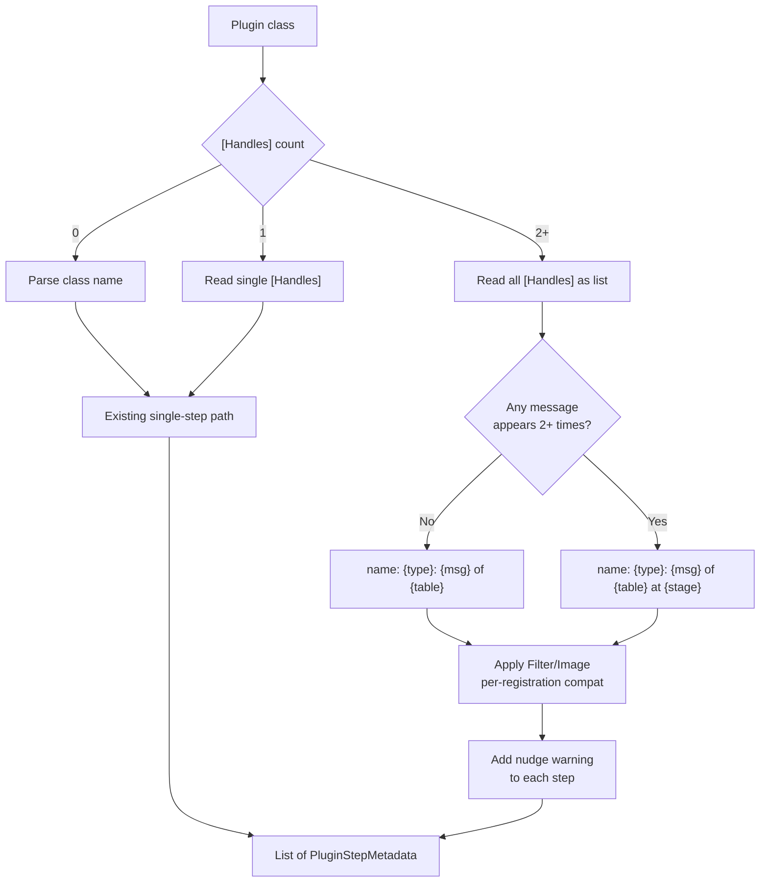
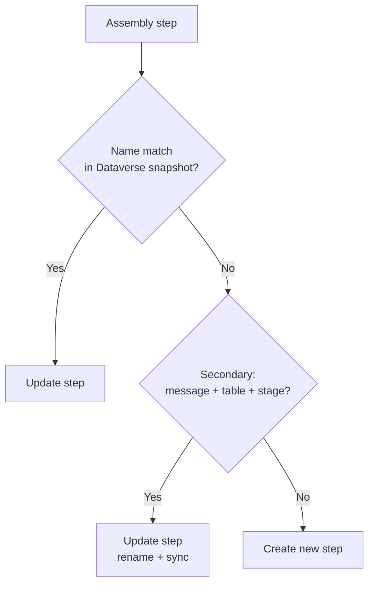

# feat: Multi-`[Handles]` step registration

## Summary

Allow stacking multiple `[Handles]` attributes on one plugin class to register multiple Dataverse
steps. Targets brownfield migration from spkl/Daxif; emits a per-step nudge warning to split into
named subclasses when migration is complete.

---

## Problem Frame

spkl and Daxif let one class cover multiple plugin step registrations. Flowline currently requires
one class per step, which forces subclass boilerplate during migration. Multi-`[Handles]` removes
that constraint as a stepping-stone, letting teams migrate without restructuring while preserving
the path toward the preferred convention.

---

## Requirements

### Attribute and reader

- R1. `HandlesAttribute` allows multiple instances on the same class (`AllowMultiple = true`).
- R2. The reader produces one `PluginStepMetadata` per `[Handles]` instance; single- and
  zero-`[Handles]` behavior is unchanged.
- R3. Step name excludes stage when all messages in the class are distinct; includes stage when
  any message appears more than once.
- R4. `[Filter]` (filtering columns) is applied only to steps where the message is `Update` or
  `UpdateMultiple`; silently skipped for other messages.
- R5. `[PreImage]` is applied only to steps where pre-images are supported (not `Create`);
  silently skipped for Create.
- R6. `[PostImage]` is applied only to steps where post-images are supported (not `Delete` at
  PostOperation); silently skipped otherwise.
- R7. If a `[Filter]`, `[PreImage]`, or `[PostImage]` attribute is present but no registration in
  the class is compatible with it, the reader produces an error.
- R8. When >1 `[Handles]` is present, each produced step carries the nudge warning:
  `"{ClassName}: multiple [Handles] detected — prefer splitting into named subclasses for long-term maintainability."`

### Planner

- R9. When `PlanPluginSteps` fails to find a step by name in the Dataverse snapshot, it attempts
  a secondary match by `(plugintypeid + message + entity + stage)` within the same plugin type's
  steps.
- R10. A secondary match results in an update (rename + sync properties) rather than delete + create.

### Documentation

- R11. `src/Flowline.Attributes/README.md` `[Handles]` section: stacked syntax, migration use
  case, nudge warning behavior, step-recreation risk when splitting into subclasses.
- R12. `Flowline.wiki/04-Plugin-Registration.md` `[Handles]` section: same additions as R11.
- R13. `Flowline.wiki/11-Migration-from-spkl.md`: new "One class, multiple step registrations"
  subsection with spkl before/after and the splitting warning.
- R14. `Flowline.wiki/12-Migration-from-Daxif.md`: same subsection for Daxif.

---

## Key Technical Decisions

- **`TryBuildStep` → `TryBuildSteps`**: change the method to return `IEnumerable<PluginStepMetadata>`
  instead of a single step. Single-`[Handles]` and convention paths return a one-element list. The
  call site at `PluginAssemblyReader.cs:158` already wraps the single result in `[step]`; it will
  pass the full list from `TryBuildSteps` directly. `PluginTypeMetadata.Steps` is already
  `List<PluginStepMetadata>` — no model change needed.

- **Stage-qualified names applied to all steps when any message repeats**: if the class has
  `Update PreOp + Update PostOp + Create PostOp`, all three steps get stage-qualified names.
  This avoids inconsistent naming within a class (some steps with stage, some without) at the
  cost of slightly longer names when only one step actually needed disambiguation.

- **Stage display name in step name**: use the stage enum display name (`PreOperation`,
  `PostOperation`, `PreValidation`) — matches Dataverse UI and is consistent with convention-based
  class names that already embed these terms.

- **Filter/image incompatibility check is class-level**: after generating all steps, if `[Filter]`
  is present but `FilteringColumns` is null on every step, raise an error. Same check for
  `[PreImage]` and `[PostImage]`. Silent per-step skip is correct when at least one compatible
  step was produced (R4–R7).

- **Warning per step** (user decision): each `PluginStepMetadata` in a multi-`[Handles]` class
  carries the nudge warning in its `Warnings` list. A class with 2 steps produces 2 warning
  entries — one alongside each step's warnings.

- **Fallback match scope**: the secondary lookup in `PlanPluginSteps` considers only steps
  belonging to the current plugin type in the snapshot, not all types. Prevents false matches
  when the same (message + table + stage) tuple exists for a different class.

---

## High-Level Technical Design

### Reader expansion flow

### Planner fallback match

---

## Scope Boundaries

**In scope:** `AllowMultiple = true` on `HandlesAttribute`; multi-step expansion in reader with
conditional naming and per-registration filter/image compatibility; nudge warning per step;
planner fallback match; Attributes README and four wiki page updates.

**Deferred to Follow-Up Work:**
- Warning suppression mechanism (origin explicitly defers this)

**Outside scope:**
- Per-`[Handles]` overrides for table, `Order`, `Config`, `RunAs`, `SecondaryTable` (these are
  properties of `[Step]`, which covers the whole class)
- `[Step]` inheritance from base classes
- PACX migration guide (PACX has no per-class multi-step registration concept)

---

## Implementation Units

### U1. `AllowMultiple = true` on `HandlesAttribute`

**Goal:** Allow the compiler to accept multiple `[Handles]` attributes on one class.

**Requirements:** R1.

**Dependencies:** None.

**Files:**
- `src/Flowline.Attributes/HandlesAttribute.cs`

**Approach:** Change `[AttributeUsage(AttributeTargets.Class)]` to
`[AttributeUsage(AttributeTargets.Class, AllowMultiple = true)]`. No other changes.

**Patterns to follow:** `PreImageAttribute` and `PostImageAttribute` already use
`AllowMultiple = true` — same pattern.

**Test scenarios:** Test expectation: none — pure attribute metadata change; the compiler enforces
it and functional coverage lives in U2.

**Verification:** A test fixture class with two `[Handles]` attributes compiles without error.

---

### U2. Multi-step expansion in `PluginAssemblyReader`

**Goal:** Produce one `PluginStepMetadata` per `[Handles]` instance with conditional
stage-qualified naming, per-registration filter/image compatibility, and nudge warnings.

**Requirements:** R2, R3, R4, R5, R6, R7, R8.

**Dependencies:** U1.

**Files:**
- `src/Flowline.Core/Services/PluginAssemblyReader.cs`
- `tests/Flowline.Core.Tests/PluginAssemblyReaderTests.cs`

**Approach:**
- Rename `TryBuildStep` to `TryBuildSteps`, return `IEnumerable<PluginStepMetadata>`.
- Collect all `[Handles]` instances from the type. Zero → existing class-name parse path
  (one-element list). One → existing single-handle logic (one-element list). Two or more →
  multi-handles expansion path.
- Before naming any step, check whether any message string appears more than once in the collected
  handles. If yes, all steps get stage-qualified names; otherwise all use the existing format.
- For each handle, produce one `PluginStepMetadata`. Apply `FilteringColumns` only when the
  handle's message is `Update` or `UpdateMultiple`. Apply `PreImage` only when the message is not
  `Create`. Apply `PostImage` only when the message is not `Delete` at `PostOperation`.
- After all steps are produced: if `[Filter]` is present but `FilteringColumns` is null on every
  step, add an error. Same class-level check for `[PreImage]` and `[PostImage]` (R7).
- Add the nudge warning to every produced step's `Warnings` list when handle count > 1 (R8).
- Update call site at `PluginAssemblyReader.cs:158`: `[step]` → the list from `TryBuildSteps`.

**Patterns to follow:**
- Existing `TryBuildStep` logic for message parsing, stage mapping, step name construction,
  and the R7 redundant-`[Handles]` warning (that warning remains unchanged).
- `docs/solutions/design-patterns/attribute-per-dataverse-registration-2026-05-29.md` — the
  multi-handles nudge warning is additive and distinct from the existing R7 redundant-`[Handles]`
  warning.

**Test scenarios:**

*Happy path:*
- Two distinct messages (Create PostOp + Update PostOp): two steps produced; neither step name
  includes stage.
- Same message at two stages (Update PreOp + Update PostOp): two steps produced; both names
  include stage (`... at PreOperation`, `... at PostOperation`).
- Three handles (Create PostOp + Update PreOp + Update PostOp): three steps; all three names
  include stage because Update appears twice.

*Unchanged paths:*
- Single `[Handles]`: one step, same name format and behavior as before.
- No `[Handles]`, convention class name: one step, unchanged.

*Filter/image compatibility:*
- `[Filter]` with Create PostOp + Update PostOp: filtering columns on Update step, null on Create.
- `[PreImage]` with Create PostOp + Update PostOp: image on Update step, absent on Create.
- `[PostImage]` with Update PostOp + Delete PostOp: image on Update step, absent on Delete.
- `[Filter]` with Create only (no Update or UpdateMultiple): reader produces an error.
- `[PreImage]` with Create only: reader produces an error.
- `[PostImage]` with Delete PostOp only: reader produces an error.

*Warning:*
- Two `[Handles]`: nudge warning present in both steps' `Warnings` lists.
- One `[Handles]`: no nudge warning.
- Zero `[Handles]` (convention path): no nudge warning.
- R7 redundant-`[Handles]` warning still fires for a single `[Handles]` that duplicates the class
  name — unaffected by this change.

**Verification:** Reader unit tests cover all scenarios above. Existing single-`[Handles]` and
convention-path tests continue to pass without modification.

---

### U3. Planner fallback match in `PlanPluginSteps`

**Goal:** When a step is not found by name, attempt a secondary identity match to produce an
update rather than delete + create.

**Requirements:** R9, R10.

**Dependencies:** U2 (the same-message step rename only occurs after U2 ships; U3 is independently
landable but end-to-end testable only after U2).

**Files:**
- `src/Flowline.Core/Services/PluginPlanner.cs`
- `tests/Flowline.Core.Tests/PluginPlannerTests.cs`

**Approach:**
- In the assembly-step loop at `PluginPlanner.cs:158`, after `dvSteps.TryGetValue(asmStep.Name, ...)`
  fails, search the current plugin type's snapshot steps for one where message, entity (table),
  and stage match the assembly step.
- If a secondary match is found, update the step (rename + sync all change-detected properties
  from the existing block at lines 188–197) rather than creating a new one.
- If no secondary match, proceed to create as today.

**Patterns to follow:** The existing change-detection block (lines 188–197) already covers the
properties to sync on update; the secondary-match update path reuses the same logic.

**Test scenarios:**
- Step found by name: primary match used; secondary lookup not reached.
- Step not found by name; matches by (message + table + stage): step updated in place (renamed +
  properties synced); no delete action, no create action.
- Step not found by name; not found by secondary match: create new step.
- Two snapshot steps for the same plugin type, one matching by name: name match takes precedence;
  identity lookup not consulted.
- Secondary match found: resulting plan action is update, not delete+create pair.

**Verification:** Planner tests demonstrate that a step whose name changed from the no-stage to
the stage-qualified format is updated in place rather than removed and recreated.

---

### U4. Documentation updates

**Goal:** Document stacked `[Handles]` syntax, migration use case, warning behavior, and the
step-recreation risk when splitting into subclasses.

**Requirements:** R11, R12, R13, R14.

**Dependencies:** U1, U2.

**Files:**
- `src/Flowline.Attributes/README.md`
- `Flowline.wiki/04-Plugin-Registration.md` (sibling repo `Flowline.wiki`)
- `Flowline.wiki/11-Migration-from-spkl.md` (sibling repo)
- `Flowline.wiki/12-Migration-from-Daxif.md` (sibling repo)

**Approach:**

*Attributes README and Plugin-Registration wiki (R11, R12 — same content, two files):*
- Extend the `[Handles]` section to show stacked syntax with a Create + Update PostOp example.
- State when to use it: migration from spkl/Daxif where one class covered multiple registrations.
- Note that Flowline emits a per-step warning nudging toward named subclasses.
- Warn explicitly: splitting a multi-`[Handles]` class later changes step names in Dataverse and
  causes delete + create on the next push. Plan the split for a maintenance window.

*spkl migration guide (R13):*
- Add "One class, multiple step registrations" subsection.
- Show a spkl class with two `[CrmPluginRegistration]` attributes (Create + Update PostOp).
- Show the equivalent Flowline code using stacked `[Handles]`.
- Note the Flowline nudge warning and that named subclasses remain the long-term goal.
- Include the splitting warning (same text as R11).

*Daxif migration guide (R14):*
- Add the equivalent subsection for Daxif's fluent multi-step registration.
- Same structure as R13.

**Test scenarios:** Test expectation: none — documentation; accuracy confirmed by review against
shipped behavior.

**Verification:** Each updated file shows stacked `[Handles]` syntax with the splitting warning.
spkl and Daxif subsections include before/after examples.

---

## Sources & Research

- `src/Flowline.Attributes/HandlesAttribute.cs` — current single-instance definition;
  `[AttributeUsage(AttributeTargets.Class)]` with no `AllowMultiple`
- `src/Flowline.Core/Services/PluginAssemblyReader.cs:298–392` — `TryBuildStep`: handles parsing,
  class-name fallback, step name construction
- `src/Flowline.Core/Services/PluginAssemblyReader.cs:158` — call site; wraps single result
  in `[step]` before passing to `PluginTypeMetadata`
- `src/Flowline.Core/Models/PluginTypeMetadata.cs` — `Steps` is already `List<PluginStepMetadata>`;
  no model change needed
- `src/Flowline.Core/Models/PluginStepMetadata.cs` — `Warnings: List<string>` available for
  the per-step nudge warning
- `src/Flowline.Core/Services/PluginPlanner.cs:146–256` — `PlanPluginSteps`; name lookup at
  line 155; change-detection properties at lines 188–197
- `tests/Flowline.Core.Tests/PluginAssemblyReaderTests.cs:590–647` — existing `[Handles]`
  test fixtures
- `docs/solutions/design-patterns/attribute-per-dataverse-registration-2026-05-29.md` — R7
  warning design rationale; `[Handles]` as convention-override escape hatch
