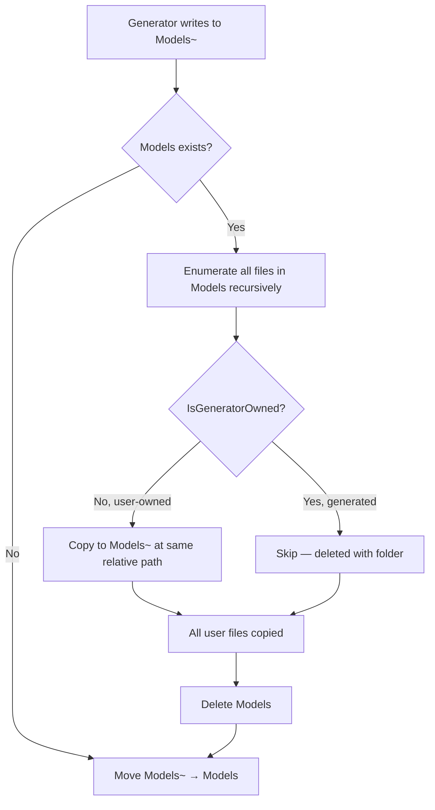

# fix: Scope generate deletion to owned files only

## Summary

`flowline generate` uses a temp-swap pattern that atomically replaces the entire output folder, silently destroying any user-placed files. This plan fixes it by copying user-owned files (those without the `<auto-generated>` marker) into the temp folder before the swap, so they survive the generate run. Stale generated files are still cleaned up. No state file, no config change, no generator modification.

---

## Problem Frame

`GenerateCommand.cs:295–297` deletes `Models` entirely before renaming `Models~` into its place. There is no check for user-owned content. Any file placed in the output folder — a hand-written partial class, a `.csproj`, a `README` — is silently lost. The uncommitted-changes warning at line 187 only fires for git-tracked files; a brand-new file gets no warning.

The natural first-run mistake is targeting the project root. When that happens the `.csproj` is gone permanently.

---

## Requirements

From origin (`docs/brainstorms/2026-06-23-generate-safe-deletion-requirements.md`):

1. Delete only files Flowline generated (carry the auto-generated marker).
2. Stale generated files for removed entities are still deleted.
3. Applies to all generators: PAC, XrmContext, XrmContext3.
4. Non-text (binary) files are treated as user-owned and left untouched.
5. If generation fails, pre-existing user files remain intact.
6. No manifest, lock file, or sidecar introduced.

---

## Key Technical Decisions

**1. Pre-copy-then-swap (not in-place deletion)**

Before `Directory.Delete(modelsFolder)`, copy every user-owned file from `modelsFolder` into `tempFolder` at its relative path. Then execute the existing delete+move unchanged. This keeps the full atomicity guarantee: if the copy step fails, `modelsFolder` is untouched. Alternatively, deleting owned files in-place before merging would leave the folder in a partial state on copy failure — rejected.

**2. Detection: text-scan first 15 lines for `<auto-generated>`**

Read the file as text, check the first 15 lines for the literal string `<auto-generated>`. Both PAC and XrmContext3 emit this within lines 1–9 (verified against real output). For `DATAVERSE_CONTEXT.md`, check for `_Generated by Flowline. Do not hand-edit_`. If the file cannot be read as text (throws on encoding), it is binary and treated as user-owned. 15-line budget is conservative — actual headers appear within 10 lines — and guards against edge-case files with preamble content.

**3. Helper placement: private static in `GenerateCommand`**

One method, called in one place. Keeping it inline avoids premature extraction. Extract to a utility class only if another command needs the same check.

---

## High-Level Technical Design

The merge step inserts between the empty-output guard and the delete+move:



Result after swap:

```
Models/
├── Account.cs          ← updated generator output
├── Contact.cs          ← updated generator output
├── OldEntity.cs        ← gone (was generated, stale, not in new output)
└── MyPartial.cs        ← survived (user-owned, copied into Models~ before swap)
```

`IsGeneratorOwned` logic (directional — not implementation specification):

```
open file as text (UTF-8, strict)
  → throws on encoding → false (binary, user-owned)
read up to 15 lines
  → any line contains "<auto-generated>" → true
  → exhausted 15 lines without match    → false (user-owned)
```

---

## Implementation Units

### U1. `IsGeneratorOwned` detection helper

**Goal:** Determine whether a `.cs` file was produced by a generator (and is therefore safe to replace or discard).

**Requirements:** R1, R4 (owned-only deletion; binary treated as user-owned).

**Dependencies:** None.

**Files:**
- `src/Flowline/Commands/GenerateCommand.cs` — add `private static bool IsGeneratorOwned(string filePath)` method

**Approach:**
- Open the file for reading with a UTF-8 decoder that throws on invalid byte sequences. A `DecoderFallbackException` or similar encoding error is the binary signal — return `false` immediately.
- Read lines one by one, up to 15. On each line: check for `<auto-generated>` (C# generator marker). Return `true` on first match.
- Return `false` if 15 lines are exhausted without a match.
- Keep the method self-contained. It reads only the file; callers decide what to do with the result.

**Patterns to follow:** `WebResourceAnnotationParser.cs` — uses `File.ReadLines(filePath)` to iterate lines without loading the whole file.

**Test scenarios:**
- PAC entity file (has `#pragma warning` then `// <auto-generated>` block) → `true`
- XrmContext3 entity file (starts with `//------` then `// <auto-generated>`) → `true`
- Hand-written `.cs` class with standard namespace header but no `<auto-generated>` → `false`
- `.csproj` XML file → `false`
- Any `.md` file → `false` (no C# marker possible)
- Binary `.dll` file → `false` (throws on text read, caught and returns false)
- File with `<auto-generated>` appearing only at line 16 or beyond → `false` (outside scan window)

**Verification:** All test scenarios pass. The method has no side effects and no dependency on global state.

---

### U2. Ownership-aware merge step

**Goal:** Replace the wholesale `Directory.Delete(modelsFolder)` call with a merge that first copies user-owned files from `modelsFolder` into `tempFolder`, then performs the existing delete+move.

**Requirements:** R1, R2, R3, R5 (owned-only deletion; stale cleanup; all generators; atomicity on failure).

**Dependencies:** U1.

**Files:**
- `src/Flowline/Commands/GenerateCommand.cs` — modify the swap block at lines 295–297

**Approach:**

Insert a preservation step between the empty-output guard (line 291) and the `Directory.Delete` (line 295):

1. If `modelsFolder` exists, enumerate all files recursively.
2. For each file: call `IsGeneratorOwned`. If `false` (user-owned), compute the relative path from `modelsFolder`, ensure the corresponding parent directory exists in `tempFolder`, and copy the file there.
3. Proceed with `Directory.Delete(modelsFolder, recursive: true)` as before.
4. Proceed with `Directory.Move(tempFolder, modelsFolder)` as before.

The error recovery path (`catch` block at lines 278–287) requires **no change** — it already deletes `tempFolder` and re-throws, and `modelsFolder` has not been touched at the point the copy step could fail.

**Patterns to follow:** `Directory.EnumerateFiles(folder, "*", SearchOption.AllDirectories)` is already used at line 291 — use the same call pattern for the preservation scan.

**Test scenarios:**
- `Models/` contains a `.csproj` → `.csproj` is present in `Models/` after generate
- `Models/` contains a hand-written partial `Contact.Partial.cs` with no `<auto-generated>` header → file survives
- `Models/` contains `OldEntity.cs` (generated, not in new generator output) → file is gone after generate
- `Models/` contains `Account.cs` (generated) → file is replaced by new generator output
- `Models/Entities/` subdirectory contains a user file → file survives with the same relative path
- `Models/` contains a `.dll` binary → binary survives (user-owned)
- `Models/` does not exist (first-run case) → copy step skipped, move executes normally, no error
- `Models/` contains only user files and no generated files → all user files survive; new generated output is added alongside
- User file copy fails mid-way (simulate `IOException` during copy) → `modelsFolder` is untouched at point of failure; error propagates naturally

**Verification:** After a generate run with a seeded `Models/` folder, user files are present and stale generated files are absent. The existing 11 tests in `GenerateCommandTests.cs` continue to pass.

---

### U3. Test coverage for file preservation

**Goal:** Make the new preservation behavior explicitly tested rather than relying on integration observation.

**Requirements:** R1, R2, R4, R5.

**Dependencies:** U1, U2.

**Files:**
- `tests/Flowline.Tests/GenerateCommandTests.cs` — add a new `GenerateFileSafetyTests` class alongside the existing three classes

**Approach:**
- Unit tests for `IsGeneratorOwned`: test with real or representative file content strings to avoid file I/O. Use `Path.GetTempFileName()` + `File.WriteAllText` for file-based inputs, or refactor `IsGeneratorOwned` to accept a line enumerable (implementation choice at build time).
- Behavioral tests for the merge step: construct a temporary `modelsFolder` containing a mix of owned and user-owned files, run the merge logic, assert post-state. These tests should not invoke the full `GenerateCommand` pipeline — test the merge step in isolation if the code permits, or test `IsGeneratorOwned` directly with known inputs.
- Keep fixtures minimal: the smallest files that exercise each marker variant are sufficient.

**Patterns to follow:** Existing `GenerateCommandTests.cs` classes — use `[TestClass]` + `[TestMethod]` (MSTest) and `Assert.IsTrue` / `Assert.IsFalse` / `Assert.IsTrue(File.Exists(...))`.

**Test scenarios:**
- `IsGeneratorOwned` returns `true` for PAC-style header (with `#pragma` preamble)
- `IsGeneratorOwned` returns `true` for XrmContext-style header (no `#pragma`)
- `IsGeneratorOwned` returns `false` for plain `.cs` file
- `IsGeneratorOwned` returns `false` for `.csproj`
- `IsGeneratorOwned` returns `false` for `.md` file
- `IsGeneratorOwned` returns `false` for binary content
- After merge: user `.csproj` in `Models/` survives
- After merge: stale generated `.cs` (owned, not in new output) is absent
- After merge: updated generated `.cs` (owned, in new output) reflects new content
- After merge: first-run scenario (no pre-existing `Models/`) completes without error

**Verification:** All new test methods pass. Coverage of `IsGeneratorOwned` logic paths is complete (true/false/binary).

---

## Scope Boundaries

**In scope:** `GenerateCommand.cs` swap block and a self-contained detection helper for C# files.

**Deferred to Follow-Up Work:**
- Warning UX when user files are detected in the output folder (could surface "Preserving 2 user files" during generate — separate issue)
- CONCEPTS.md entry for "generator-owned file" — the glossary doesn't cover this concept yet; add after the feature ships
- `IsGeneratorOwned` extraction to a utility class — only if a second command needs it

**Out of scope:**
- Generator output format (PAC/XrmContext emit their own headers; Flowline does not control them)
- Non-`Models` folders (`.flowline`, `Package/src`, `WebResources`)
- The uncommitted-changes git warning (separate behavior, not changed here)
- `DATAVERSE_CONTEXT.md` — Flowline's AI context file lives outside the Models swap path; ownership detection for it is a separate concern

---

## Risks & Dependencies

| Risk | Likelihood | Mitigation |
|------|-----------|------------|
| Generator emits a file without `<auto-generated>` header | Low — verified against real PAC and XrmContext3 output | If discovered, extend detection to cover the new format; no architectural change needed |
| Binary detection via text-read fails for a text file with unusual encoding | Low — UTF-8 covers all generator output | On read error, default to user-owned (conservative); log at `--verbose` if needed |
| Copy step adds latency on large output folders | Negligible for typical entity counts (<500 files, most are generator-owned and skipped) | No mitigation needed |

---

## Sources & Research

- Origin: `docs/brainstorms/2026-06-23-generate-safe-deletion-requirements.md`
- Header format verified against: real PAC output at `solutions/Cr07982/Plugins/Models/`; real XrmContext3 output at `SpotlerAutomate.Dataverse/src/Entities/`
- Existing swap logic: `src/Flowline/Commands/GenerateCommand.cs:219–297`
- Existing tests: `tests/Flowline.Tests/GenerateCommandTests.cs` (11 tests; none cover file preservation)
- File-reading pattern: `src/Flowline/Services/WebResourceAnnotationParser.cs` (`File.ReadLines`)
- External research: not needed — approach is well-grounded in local patterns and verified header format
