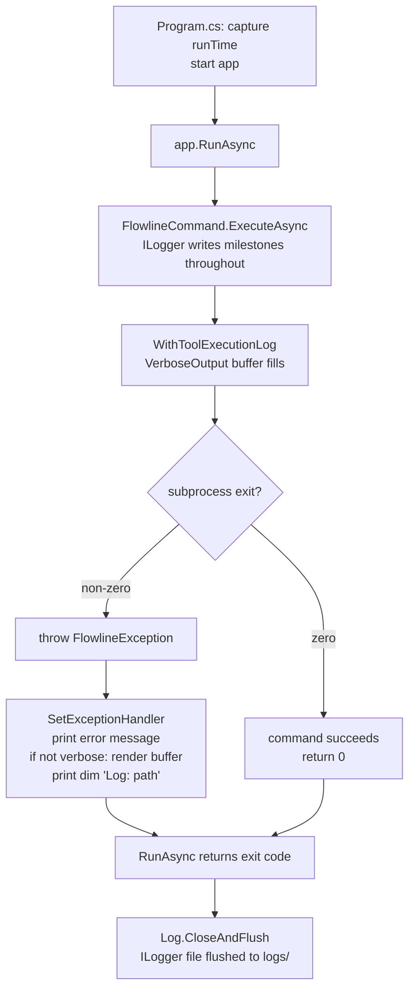

# feat: Add Wave 1 CLI observability (subprocess buffer, ILogger)

## Summary

Adds two observability features that together ensure every failed Flowline invocation leaves a durable, inspectable trace — without requiring `--verbose` in advance:

- **I2 — Verbose output buffer**: rolling 50-line buffer of all verbose output (subprocess and Flowline's own) via a new `FlowlineConsoleExtensions.Verbose` overload; surfaced in the terminal on non-verbose failures.
- **I3 — ILogger infrastructure**: MEL + Serilog file sink writing to `%LOCALAPPDATA%/Flowline/logs/<yyyy-MM-ddTHHmmss>Z.log` (one file per invocation) at Debug level, with `LogInformation` milestones in `PluginService`, `WebResourceService`, and commands via the base `FlowlineCommand` logger. On failure the dim `Log: <path>` line points users at the ILogger file directly.

> **I1 (JSONL run log) was dropped.** Originally planned as an always-on per-invocation JSONL index. Removed because the ILogger file already captures the full narrative, exception, and stack trace — making the JSONL a redundant second artifact. Use case is "user sends logs for issue triage"; one file is simpler than two.

---

## Problem Frame

When a Flowline command fails on a CI server or a developer machine that wasn't running `--verbose`, there is currently no diagnostic path beyond re-running with `--verbose` and hoping the failure reproduces. The result is bug reports with no context. (see origin: docs/brainstorms/2026-06-25-cli-observability-wave1-requirements.md)

---

## Requirements

**Subprocess Capture (I2)**

- R7. `WithToolExecutionLog` maintains a rolling 50-line buffer of subprocess output (stderr primary; stdout lines matching error patterns also captured).
- R8. On non-zero subprocess exit, the buffer is rendered in the terminal between the Flowline error message and the dim `Log:` path line, using dim verbose style.
- R9. When `--verbose` was active, the terminal rendering is omitted — output was already printed live.

**ILogger Infrastructure (I3)**

- R11. `Microsoft.Extensions.Logging` is registered in DI at startup.
- R12. A Serilog file sink writes to `<root>/logs/<yyyy-MM-ddTHHmmss>Z.log` (one file per invocation) at Debug level, always-on. No ILogger output goes to the terminal. On failure, the exception handler prints a dim `Log: <path>` line pointing at this file.
- R13. `ILogger<T>` is constructor-injected into `PluginService` and `WebResourceService`. `ILoggerFactory` is constructor-injected into `FlowlineCommand<TSettings>` (base class), exposing a lazy `protected ILogger Logger` property to all commands.
- R14. Wave 1 adds `LogInformation` outcome lines at key decision points in those services (~5–8 call sites): step registration counts, web resource discovery totals. Verifies end-to-end injection.

**Operational Resilience**

- R16. Log and debug file write failures are silent and fire-and-forget. Must not surface exceptions or affect command outcome.
- R17. Log directory creation failures are silent and do not prevent the command from running.

---

## Key Technical Decisions

- **Serilog as the file sink provider.** A hand-rolled `ILoggerProvider` would be ~70 lines, but logging failures are silent by design — a subtle bug produces no file and no indication. Serilog's production track record transfers that reliability for three lightweight packages (`Serilog`, `Serilog.Extensions.Logging`, `Serilog.Sinks.File`).

- **MEL namespace-level minimum levels.** At `Debug`, MEL and `Microsoft.PowerPlatform.Dataverse.Client` emit internal startup noise. Configure Serilog with `MinimumLevel.Override("Microsoft", Warning)` and `MinimumLevel.Override("System", Warning)`, defaulting to `Debug` for everything else (Flowline namespaces). Resolves the "MEL framework noise" open question from the origin doc.

- **`SolutionDiffService` created as a new DI service in `src/Flowline/Services/`.** The brainstorm names `SolutionDiffService` as the third injection target, but that class doesn't exist — `SolutionChangeSummary` in `src/Flowline/Utils/` is a static utility called directly in `SyncCommand`. Plan: create `SolutionDiffService` in `src/Flowline/Services/` (CLI project, not Core — placing it in Core would create a circular project reference since `SolutionChangeSummary` lives in the CLI project). `SyncCommand` switches to constructor-injected `SolutionDiffService`.

- **Verbose output buffered via existing `FlowlineConsoleExtensions.Verbose` overload.** `FlowlineConsoleExtensions` already has `Verbose(this IAnsiConsole, string, bool isVerbose)`. A new overload `Verbose(this IAnsiConsole, string, FlowlineRuntimeOptions)` buffers into `FlowlineRuntimeOptions.VerboseOutput` when `!IsVerbose`, or writes to the console immediately when `IsVerbose`. This captures both subprocess output and Flowline's own verbose lines in the same rolling 50-line buffer — no per-call buffer management. `WithToolExecutionLog` gains a `FlowlineRuntimeOptions` overload that uses this internally; commands pass `RuntimeOptions` instead of a `SubprocessBuffer`. `FlowlineException` needs no changes. The global exception handler reads `runtimeOptions.VerboseOutput.Lines` on failure.

- **`FlowlineStoragePaths` static helper for log paths.** Mirrors `ValidationCacheStore.GetDefaultCachePath()` root resolution but returns the subdirectory path for `logs/`. Lives in `src/Flowline/Utils/`, used by the Serilog registration and the exception handler path line.

- **`Microsoft.Extensions.Logging.Abstractions` in `Flowline.Core.csproj`.** `PluginService` and `WebResourceService` live in `Flowline.Core`. They need `ILogger<T>` at compile time, which comes from the abstractions package. The full MEL stack (console, DI) stays in `Flowline` (the CLI entry project).

---

## High-Level Technical Design

Failure flow:

---

## Scope Boundaries

**Deferred for later (Wave 2+):**
- `LogDebug` and `LogWarning` call sites — Wave 2
- Correlation ID via `FLOWLINE_TRACE_ID` — Wave 2
- `DiagnosticContext` stage chain — Wave 2
- Crash-initiated support bundle — Wave 3

**Outside Wave 1:**
- Remote telemetry to App Insights
- Log encryption or signing
- `flowline doctor` / `flowline bug-report` commands
- Debug log namespace filtering beyond the Serilog override already planned

---

## Acceptance Examples

- AE1. **Non-verbose failure — buffer visible.** Given `flowline deploy` without `--verbose`; PAC CLI exits 1 with 3 stderr lines. Then terminal shows: Flowline error message → 3 PAC lines (dim) → dim `Log: <path>` line pointing at the ILogger file.

- AE2. **Verbose failure — buffer suppressed.** Given `flowline deploy --verbose`; PAC CLI exits 1, stderr printed live. Then terminal shows: Flowline error message → dim `Log: <path>` line. PAC output does not appear twice.

- AE3. **Successful run — no path line.** Given `flowline sync` succeeds. Then no path line is printed; ILogger file written silently.

---

## Implementation Units

### U1. Package setup and Serilog file-sink registration

**Goal:** Add Serilog packages, wire MEL + file sink in DI, add `FlowlineStoragePaths` helper for log directory resolution.

**Requirements:** R11, R12, R16, R17

**Dependencies:** none

**Files:**
- `Directory.Packages.props` — add `Serilog`, `Serilog.Extensions.Logging`, `Serilog.Sinks.File`, `Microsoft.Extensions.Logging.Abstractions`
- `src/Flowline/Flowline.csproj` — add Serilog package references
- `src/Flowline.Core/Flowline.Core.csproj` — add `Microsoft.Extensions.Logging.Abstractions` reference
- `src/Flowline/Utils/FlowlineStoragePaths.cs` — new file
- `src/Flowline/Program.cs` — register `services.AddLogging(...)` with Serilog file sink

**Approach:**
- `FlowlineStoragePaths` mirrors `ValidationCacheStore.GetDefaultCachePath()` root resolution: `%LOCALAPPDATA%` → `XDG_CACHE_HOME` → `~/.cache` → `Path.GetTempPath()`. Exposes `GetStorageRoot()` and `GetLogsPath(DateTimeOffset runTime)`.
- Serilog configured with `WriteTo.File(path, rollingInterval: RollingInterval.Infinite)` pointing to `FlowlineStoragePaths.GetLogsPath(runTime)` where `runTime` is captured at startup. One log file per invocation, named `<yyyy-MM-ddTHHmmss>Z.log`. Using `RollingInterval.Infinite` — the path already embeds a unique timestamp so Serilog's rolling is not needed. Minimum level: `Debug`; overrides: `Warning` for `Microsoft.*` and `System.*`.
- `services.AddLogging(b => b.ClearProviders().AddSerilog(...))` replaces any default console-to-logger wiring. No `AddConsole` — all terminal output stays through Spectre.Console.
- Serilog logger is created before `services.Build()` and disposed after `app.RunAsync` returns.

**Patterns to follow:** `ValidationCacheStore.GetDefaultCachePath()` in `src/Flowline/Validation/ValidationCacheStore.cs:53-70` for root resolution. DI registration in `src/Flowline/Program.cs:28-43`.

**Test scenarios:**
- `FlowlineStoragePaths.GetStorageRoot()` returns a path under `%LOCALAPPDATA%` on Windows when that env var is set.
- `FlowlineStoragePaths.GetStorageRoot()` falls back to `~/.cache` when `%LOCALAPPDATA%` is empty and `XDG_CACHE_HOME` is unset.
- `GetLogsPath(runTime)` returns a path ending with `logs/<yyyy-MM-ddTHHmmss>Z.log`.
- Test expectation for the Serilog wiring itself: integration — the debug log file is created and non-empty after a command runs (verified in U5 integration test).

**Verification:** `dotnet build` passes. `Directory.Packages.props` has the four new package entries. `FlowlineStoragePaths` compiles and has unit tests passing.

---

### U2. ILogger injection and SolutionDiffService

**Goal:** Add `ILogger<T>` to `PluginService`, `WebResourceService`, and a new `SolutionDiffService`. Add ~5–8 `LogInformation` call sites for domain milestones. Wire `SyncCommand` to use `SolutionDiffService`.

**Requirements:** R13, R14

**Dependencies:** U1 (MEL abstractions must be referenced in `Flowline.Core.csproj`)

**Files:**
- `src/Flowline.Core/Services/PluginService.cs` — add `ILogger<PluginService>` parameter + call sites
- `src/Flowline.Core/Services/WebResourceService.cs` — add `ILogger<WebResourceService>` parameter + call sites
- `src/Flowline/Commands/SyncCommand.cs` — replaced static `SolutionChangeSummary.ComputeAsync` calls with direct calls + `Logger.LogInformation`
- `src/Flowline/Infrastructure/FlowlineRuntimeOptions.cs` — add `string? CommandName` property
- `src/Flowline/Commands/FlowlineCommand.cs` — store `CommandContext.Name` in `RuntimeOptions.CommandName` at the top of `ExecuteAsync`

**Approach:**
- `FlowlineRuntimeOptions`: add `public string? CommandName { get; set; }` and `string? ArgsRedacted { get; set; }` properties. `FlowlineCommand.ExecuteAsync` sets these at the top of each invocation for use in ILogger milestone lines.
- `PluginService` constructor: add `ILogger<PluginService> logger` (after existing parameters). `LogInformation` sites: (a) step registration count at end of `SyncSolutionAsync` plan phase ("Registration plan ready: {PluginTypeCount} types, {StepCount} steps"), (b) assembly sync outcome ("Assembly '{Name}' synced").
- `WebResourceService` constructor: add `ILogger<WebResourceService> logger`. `LogInformation` sites: (a) snapshot totals after load ("Snapshot: {DataverseCount} Dataverse, {LocalCount} local resources"), (b) plan totals ("Plan: {Creates} creates, {Updates} updates, {Deletes} deletes").
- `SolutionDiffService` is a thin wrapper: constructor takes `ILogger<SolutionDiffService> logger`. Method `ComputeAsync(srcFolder, workingDirectory, verbose, ct)` delegates to `SolutionChangeSummary.ComputeAsync` and logs: "Diff computed: {TotalFiles} files, +{LinesAdded} -{LinesRemoved} lines". Returns `SolutionChangeSummary`.
- `SyncCommand` adds `SolutionDiffService solutionDiffService` to primary constructor; both `SolutionChangeSummary.ComputeAsync` call sites (lines 56 and 147) replaced with `solutionDiffService.ComputeAsync(...)`.

**Patterns to follow:** Existing constructor injection in `PluginService` and `WebResourceService`. `services.AddSingleton<PluginService>()` pattern in `Program.cs:40-41`.

**Test scenarios:**
- `SolutionDiffService.ComputeAsync` calls `ComputeAsync` on the underlying static utility and returns the result.
- `SolutionDiffService` logs one `LogInformation` line with file count and line totals after a successful compute.
- `SolutionDiffService` does not throw when `SolutionChangeSummary.ComputeAsync` returns an empty result (zero files).
- `PluginService` logs step registration count after plan phase completes.
- `WebResourceService` logs snapshot totals after load.
- Existing `PluginServiceTests` and `WebResourceServiceTests` still pass after adding the logger parameter (pass `NullLogger<T>.Instance` in test setup).

**Verification:** `dotnet build` passes. `SolutionDiffService` is registered in DI and received by `SyncCommand`. Existing service tests pass with null logger.

---

### U3. Verbose output buffer via FlowlineConsoleExtensions overload

**Goal:** Add a rolling 50-line verbose output buffer to `FlowlineRuntimeOptions`. Add a `Verbose` overload to the existing `FlowlineConsoleExtensions` that buffers when non-verbose. Update `WithToolExecutionLog` with a `FlowlineRuntimeOptions` overload so all subprocess output flows through the same buffer automatically. Remove old `SubprocessBuffer` artifacts.

**Requirements:** R7, R8, R9, R10

**Dependencies:** none (independent of U1/U2)

**Files:**
- `src/Flowline.Core/FlowlineRuntimeOptions.cs` — add `VerboseOutput` rolling 50-line buffer
- `src/Flowline.Core/FlowlineConsoleExtensions.cs` — add `Verbose(this IAnsiConsole, string, FlowlineRuntimeOptions)` overload
- `src/Flowline/Utils/CommandExtensions.cs` — add `WithToolExecutionLog` overload taking `FlowlineRuntimeOptions`; remove `SubprocessBuffer` parameter
- `src/Flowline.Core/FlowlineException.cs` — remove `SubprocessOutput` property and `WithSubprocessBuffer` method (if added in a prior pass)
- `src/Flowline/Utils/SubprocessBuffer.cs` — delete (if created in a prior pass)
- `tests/Flowline.Tests/Utils/SubprocessBufferTests.cs` — delete (if created in a prior pass)

**Approach:**
- `FlowlineRuntimeOptions.VerboseOutput`: a simple rolling 50-line queue as a nested value type or small internal class. `Append(string markup)` drops oldest when at cap. `Lines` returns `IReadOnlyList<string>`. `Clear()` allows flush-and-reset.
- New `Verbose` overload in `FlowlineConsoleExtensions`:
  - `if (options.IsVerbose)`: call `console.MarkupLine($"[dim]{Markup.Escape(message)}[/]")`.
  - `else`: call `options.VerboseOutput.Append(message)`.
  - Existing `Verbose(this IAnsiConsole, string, bool)` overload stays unchanged — backward compat.
- `WithToolExecutionLog` gains a new overload taking `FlowlineRuntimeOptions options` instead of `bool verbose` + `SubprocessBuffer? buffer`. Internally:
  - Verbose path (`options.IsVerbose`): prints "Executing: ..." line, pipes stdout/stderr to console AND `options.VerboseOutput.Append(...)`.
  - Non-verbose path: suppresses real-time output; pipes stderr and stdout error-lines to `options.VerboseOutput.Append(...)` only.
  - Remove the old `SubprocessBuffer? buffer` parameter from the existing overload.
- `FlowlineException` needs no changes — no `SubprocessOutput` property, no `WithSubprocessBuffer`. Exception handler reads `runtimeOptions.VerboseOutput.Lines` directly on failure.

**Patterns to follow:** Existing `Verbose(this IAnsiConsole, string, bool)` in `src/Flowline.Core/FlowlineConsoleExtensions.cs`. `WithToolExecutionLog` branching logic in `src/Flowline/Utils/CommandExtensions.cs`.

**Test scenarios:**
- `VerboseOutput.Append` holds at most 50 lines; adding a 51st drops the first.
- `VerboseOutput` with fewer than 50 lines returns all lines.
- `Verbose(console, msg, options)` with `IsVerbose = true` writes to console and does NOT append to buffer.
- `Verbose(console, msg, options)` with `IsVerbose = false` appends to buffer and does NOT write to console.
- `WithToolExecutionLog(RuntimeOptions, ctx)` non-verbose: subprocess stderr appended to `VerboseOutput`, not printed live.
- `WithToolExecutionLog(RuntimeOptions, ctx)` verbose: subprocess stderr printed live and appended to `VerboseOutput`.

**Verification:** `dotnet build` passes. Unit tests pass.

---

### ~~U4. RunLogService and JSONL writer~~ — Removed

Originally planned; dropped after implementation. See Summary note above.

---

### U5. Wire verbose buffer in Program.cs and command call sites

**Goal:** Integrate `VerboseOutput` buffer into the CLI lifecycle: exception handler buffer flush, dim `Log:` path line, and update command call sites to pass `RuntimeOptions` to `WithToolExecutionLog`.

**Requirements:** R8, R9, R12 (integration)

**Dependencies:** U3 (VerboseOutput buffer)

**Files:**
- `src/Flowline/Program.cs` — buffer flush in exception handler, dim `Log: <path>` line pointing at ILogger file
- `src/Flowline/Commands/SyncCommand.cs` — switch to `WithToolExecutionLog(RuntimeOptions, ctx)`, remove explicit `SubprocessBuffer` management
- `src/Flowline/Commands/DeployCommand.cs` — same as SyncCommand
- `src/Flowline/Commands/PushCommand.cs` — same if applicable

**Approach:**
- In `Program.cs` `SetExceptionHandler`:
  - For `FlowlineException`: print error, render `fe.Detail` if set, print HelpLink if set, flush `runtimeOptions.VerboseOutput.Lines` to console in `[dim]` if non-empty and non-verbose, print dim `Log: <FlowlineStoragePaths.GetLogsPath(runTime)>` line.
  - For unhandled exceptions: same `Log:` line.
  - `Log:` line NOT printed on success.
- In affected commands: replace `WithToolExecutionLog(settings.Verbose, ctx, buffer: buffer)` with `WithToolExecutionLog(RuntimeOptions, ctx)`.

**Patterns to follow:** Existing `SetExceptionHandler` in `src/Flowline/Program.cs`. Subprocess call pattern in `SyncCommand`.

**Test scenarios:**
- Covers AE1: on a non-verbose failure with buffered verbose output, the exception handler renders the buffer lines in dim style before the `Log:` line.
- Covers AE2: on a verbose failure, the buffer lines are NOT rendered (verbose mode outputs in real-time); the `Log:` line still appears.
- `Log:` line is NOT printed on successful runs.

**Verification:** `dotnet run -- <any command>` creates `<root>/logs/<timestamp>.log` with ILogger content. On failure the terminal shows the dim `Log:` path line.

---

## Risks and Dependencies

- **Serilog dispose order.** Serilog's `Log.CloseAndFlush()` must be called after `app.RunAsync` returns — not before. Correct sequence: `RunAsync` → `CloseAndFlush`.
- **DataverseClient MEL noise.** `Microsoft.PowerPlatform.Dataverse.Client` emits at Information/Debug via MEL. The `Warning` override for `Microsoft.*` suppresses this. If specific Dataverse client logs are needed in future, a tighter override (e.g. `Microsoft.PowerPlatform.*`) can be added in Wave 2.

---

## Sources and Research

- `src/Flowline/Program.cs` — `SetExceptionHandler`; I2 buffer rendering and dim `Log:` path line attach here
- `src/Flowline/Utils/CommandExtensions.cs` — `WithToolExecutionLog`; I2 buffer fills here
- `src/Flowline.Core/FlowlineException.cs` — `WithDetail` API
- `src/Flowline/Commands/FlowlineCommand.cs` — `ExecuteAsync` entry point; sets `CommandName` and `ArgsRedacted` on `RuntimeOptions`
- `src/Flowline/Validation/ValidationCacheStore.cs:53-70` — path resolution pattern reused by `FlowlineStoragePaths`
- `src/Flowline/Commands/SyncCommand.cs` — PAC sync subprocess pattern; I2 buffer model
- `Directory.Packages.props` — `Microsoft.Extensions.Logging.Console` already present; Serilog packages added in U1
