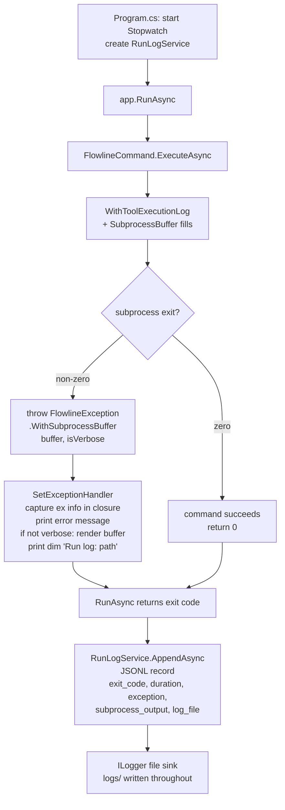

# feat: Add Wave 1 CLI observability (run log, subprocess buffer, ILogger)

## Summary

Adds three observability features that together ensure every failed Flowline invocation leaves a durable, inspectable trace — without requiring `--verbose` in advance:

- **I1 — Run log**: always-on JSONL record per invocation, written to `%LOCALAPPDATA%/Flowline/runs/<date>.jsonl` on both success and failure.
- **I2 — Subprocess buffer**: rolling 50-line stderr capture surfaced in the terminal on non-verbose failures.
- **I3 — ILogger infrastructure**: MEL + Serilog file sink writing to `%LOCALAPPDATA%/Flowline/logs/<date>.log` at Debug level, with `LogInformation` milestones in `PluginService`, `WebResourceService`, and a new `SolutionDiffService` to prove end-to-end injection.

---

## Problem Frame

When a Flowline command fails on a CI server or a developer machine that wasn't running `--verbose`, there is currently no diagnostic path beyond re-running with `--verbose` and hoping the failure reproduces. The result is bug reports with no context. (see origin: docs/brainstorms/2026-06-25-cli-observability-wave1-requirements.md)

---

## Requirements

**Run Log (I1)**

- R1. Every `FlowlineCommand.ExecuteAsync` invocation appends one JSONL record to `<root>/runs/<yyyy-MM-dd>.jsonl` on success and failure alike. `--help` and `--version` are excluded.
- R2. Each record contains: UTC timestamp, command name, args (redacted), exit code, duration in ms, Flowline version, cached tool versions (dotnet, pac, git), path to today's ILogger log file (`log_file`), and — on failure — exception type, message, and subprocess output.
- R3. Storage root follows the same resolution chain as `ValidationCacheStore.GetDefaultCachePath()`: `%LOCALAPPDATA%` → `XDG_CACHE_HOME` → `~/.cache` → system temp.
- R4. Files older than 30 days are deleted at startup. Directory created on first use.
- R5. Args are redacted via the existing `RedactSensitiveArgs` before any write.
- R6. On command failure, the exception handler appends a dim `Run log: <path>` line after the error output.

**Subprocess Capture (I2)**

- R7. `WithToolExecutionLog` maintains a rolling 50-line buffer of subprocess output (stderr primary; stdout lines matching error patterns also captured).
- R8. On non-zero subprocess exit, the buffer is attached to the thrown `FlowlineException` and rendered in the terminal between the Flowline error message and the run-log path line, using dim verbose style.
- R9. When `--verbose` was active, the terminal rendering is omitted — output was already printed live. Buffer contents are still included in the JSONL record.
- R10. Buffer contents are written to the JSONL record under `subprocess_output`.

**ILogger Infrastructure (I3)**

- R11. `Microsoft.Extensions.Logging` is registered in DI at startup.
- R12. A Serilog file sink writes to `<root>/logs/<yyyy-MM-dd>.log` at Debug level, always-on. No ILogger output goes to the terminal.
- R13. `ILogger<T>` is constructor-injected into `PluginService`, `WebResourceService`, and `SolutionDiffService`.
- R14. Wave 1 adds `LogInformation` outcome lines at key decision points in those three services (~5–8 call sites): step registration counts, web resource discovery totals, diff summaries. Verifies end-to-end injection.

**Operational Resilience**

- R16. Log and debug file write failures are silent and fire-and-forget. Must not surface exceptions or affect command outcome.
- R17. Log directory creation failures are silent and do not prevent the command from running.

---

## Key Technical Decisions

- **Serilog as the file sink provider.** A hand-rolled `ILoggerProvider` would be ~70 lines, but logging failures are silent by design — a subtle bug produces no file and no indication. Serilog's production track record transfers that reliability for three lightweight packages (`Serilog`, `Serilog.Extensions.Logging`, `Serilog.Sinks.File`).

- **MEL namespace-level minimum levels.** At `Debug`, MEL and `Microsoft.PowerPlatform.Dataverse.Client` emit internal startup noise. Configure Serilog with `MinimumLevel.Override("Microsoft", Warning)` and `MinimumLevel.Override("System", Warning)`, defaulting to `Debug` for everything else (Flowline namespaces). Resolves the "MEL framework noise" open question from the origin doc.

- **`SolutionDiffService` created as a new DI service in `src/Flowline/Services/`.** The brainstorm names `SolutionDiffService` as the third injection target, but that class doesn't exist — `SolutionChangeSummary` in `src/Flowline/Utils/` is a static utility called directly in `SyncCommand`. Plan: create `SolutionDiffService` in `src/Flowline/Services/` (CLI project, not Core — placing it in Core would create a circular project reference since `SolutionChangeSummary` lives in the CLI project). `SyncCommand` switches to constructor-injected `SolutionDiffService`.

- **`SubprocessBuffer` as an explicit object passed to `WithToolExecutionLog`.** The buffer is held by the caller (a command), which controls when and whether to attach it to the thrown exception. `FlowlineException` gets a `string[]? SubprocessOutput` field and a `WithSubprocessBuffer(lines, isVerbose)` method: always sets `SubprocessOutput`, conditionally sets `Detail` for terminal rendering (omitted when verbose per R9).

- **JSONL write integration in `Program.cs`, wrapping `app.RunAsync`.** A closure captures `(exceptionType, exceptionMessage, subprocessOutput)` from the `SetExceptionHandler` callback. A `Stopwatch` wraps `RunAsync`. After `RunAsync` returns, `RunLogService.AppendAsync` writes the record — this single write point handles both success and failure paths. `--help`/`-h`/`--version` are excluded by checking `args` before starting the timer.

- **30-day retention cleanup at startup.** Called fire-and-forget before `app.RunAsync`. Simple and reliable; on-write cleanup would add latency to every invocation.

- **Redaction scope unchanged.** `RedactSensitiveArgs` covers `--client-secret` and `/mfaClientSecret:`. No URL-embedded tokens or connection string fragments are in active use; scope extension deferred to the issue that introduces them.

- **`FlowlineStoragePaths` static helper for all log paths.** Mirrors `ValidationCacheStore.GetDefaultCachePath()` root resolution but returns subdirectory paths for `runs/` and `logs/`. Lives in `src/Flowline/Utils/`, shared by `RunLogService` (I1) and the Serilog registration (I3).

- **`Microsoft.Extensions.Logging.Abstractions` in `Flowline.Core.csproj`.** `PluginService` and `WebResourceService` live in `Flowline.Core`. They need `ILogger<T>` at compile time, which comes from the abstractions package. The full MEL stack (console, DI) stays in `Flowline` (the CLI entry project).

---

## High-Level Technical Design

Failure flow with all three features active:

---

## Scope Boundaries

**Deferred for later (Wave 2+):**
- `LogDebug` and `LogWarning` call sites — Wave 2
- Correlation ID via `FLOWLINE_TRACE_ID` — Wave 2
- `DiagnosticContext` stage chain — Wave 2
- Crash-initiated support bundle — Wave 3

**Outside Wave 1:**
- Remote telemetry to App Insights
- Log encryption or signing
- `flowline doctor` / `flowline bug-report` commands
- `--help` / `--version` JSONL entries
- Debug log namespace filtering beyond the Serilog override already planned

---

## Acceptance Examples

- AE1. **Non-verbose failure — buffer visible.** Given `flowline deploy` without `--verbose`; PAC CLI exits 1 with 3 stderr lines. Then terminal shows: Flowline error message → 3 PAC lines (dim) → dim `Run log: <path>` line. JSONL record written with `subprocess_output`.

- AE2. **Verbose failure — buffer suppressed.** Given `flowline deploy --verbose`; PAC CLI exits 1, stderr printed live. Then terminal shows: Flowline error message → dim `Run log: <path>` line. PAC output does not appear twice. JSONL record still has `subprocess_output`.

- AE3. **Successful run — no path line.** Given `flowline sync` succeeds. Then no path line is printed; JSONL record written silently. `exit_code: 0`, no exception fields.

- AE4. **Log write failure — command unaffected.** Given `<root>/runs/` is not writable. Then the command exits with its own code. No exception thrown from the log write; no error printed about the log.

---

## Implementation Units

### U1. Package setup and Serilog file-sink registration

**Goal:** Add Serilog packages, wire MEL + file sink in DI, add `FlowlineStoragePaths` helper for log directory resolution.

**Requirements:** R11, R12, R16, R17

**Dependencies:** none

**Files:**
- `Directory.Packages.props` — add `Serilog`, `Serilog.Extensions.Logging`, `Serilog.Sinks.File`, `Microsoft.Extensions.Logging.Abstractions`
- `src/Flowline/Flowline.csproj` — add Serilog package references
- `src/Flowline.Core/Flowline.Core.csproj` — add `Microsoft.Extensions.Logging.Abstractions` reference
- `src/Flowline/Utils/FlowlineStoragePaths.cs` — new file
- `src/Flowline/Program.cs` — register `services.AddLogging(...)` with Serilog file sink

**Approach:**
- `FlowlineStoragePaths` mirrors `ValidationCacheStore.GetDefaultCachePath()` root resolution: `%LOCALAPPDATA%` → `XDG_CACHE_HOME` → `~/.cache` → `Path.GetTempPath()`. Exposes `GetStorageRoot()`, `GetRunsPath(DateOnly date)`, and `GetLogsPath(DateOnly date)`.
- Serilog configured with `WriteTo.File(path, rollingInterval: RollingInterval.Infinite)` pointing to `FlowlineStoragePaths.GetLogsPath(today)`. Using `RollingInterval.Infinite` because the path already embeds today's date — `RollingInterval.Day` would append a second date suffix, producing a double-dated filename that wouldn't match the `log_file` field. Minimum level: `Debug`; overrides: `Warning` for `Microsoft.*` and `System.*`.
- `services.AddLogging(b => b.ClearProviders().AddSerilog(...))` replaces any default console-to-logger wiring. No `AddConsole` — all terminal output stays through Spectre.Console.
- Serilog logger is created before `services.Build()` and disposed after `app.RunAsync` returns.

**Patterns to follow:** `ValidationCacheStore.GetDefaultCachePath()` in `src/Flowline/Validation/ValidationCacheStore.cs:53-70` for root resolution. DI registration in `src/Flowline/Program.cs:28-43`.

**Test scenarios:**
- `FlowlineStoragePaths.GetStorageRoot()` returns a path under `%LOCALAPPDATA%` on Windows when that env var is set.
- `FlowlineStoragePaths.GetStorageRoot()` falls back to `~/.cache` when `%LOCALAPPDATA%` is empty and `XDG_CACHE_HOME` is unset.
- `GetRunsPath(today)` returns a path ending with `runs/<yyyy-MM-dd>.jsonl`.
- `GetLogsPath(today)` returns a path ending with `logs/<yyyy-MM-dd>.log`.
- Test expectation for the Serilog wiring itself: integration — the debug log file is created and non-empty after a command runs (verified in U5 integration test).

**Verification:** `dotnet build` passes. `Directory.Packages.props` has the four new package entries. `FlowlineStoragePaths` compiles and has unit tests passing.

---

### U2. ILogger injection and SolutionDiffService

**Goal:** Add `ILogger<T>` to `PluginService`, `WebResourceService`, and a new `SolutionDiffService`. Add ~5–8 `LogInformation` call sites for domain milestones. Wire `SyncCommand` to use `SolutionDiffService`.

**Requirements:** R13, R14

**Dependencies:** U1 (MEL abstractions must be referenced in `Flowline.Core.csproj`)

**Files:**
- `src/Flowline.Core/Services/PluginService.cs` — add `ILogger<PluginService>` parameter + call sites
- `src/Flowline.Core/Services/WebResourceService.cs` — add `ILogger<WebResourceService>` parameter + call sites
- `src/Flowline/Services/SolutionDiffService.cs` — new file (in CLI project; see Risks)
- `src/Flowline/Commands/SyncCommand.cs` — add `SolutionDiffService` constructor parameter; replace static `SolutionChangeSummary.ComputeAsync` calls
- `src/Flowline/Program.cs` — register `SolutionDiffService` as singleton
- `src/Flowline/Infrastructure/FlowlineRuntimeOptions.cs` — add `string? CommandName` property
- `src/Flowline/Commands/FlowlineCommand.cs` — store `CommandContext.Name` in `RuntimeOptions.CommandName` at the top of `ExecuteAsync`

**Approach:**
- `FlowlineRuntimeOptions`: add `public string? CommandName { get; set; }` property. `FlowlineCommand.ExecuteAsync` sets `RuntimeOptions.CommandName = context.Name` at the top of each invocation. This gives the Program.cs JSONL write site a resolved command name without parsing `args[]` (which is fragile under aliases and flag ordering).
- `PluginService` constructor: add `ILogger<PluginService> logger` (after existing parameters). `LogInformation` sites: (a) step registration count at end of `SyncSolutionAsync` plan phase ("Registration plan ready: {PluginTypeCount} types, {StepCount} steps"), (b) assembly sync outcome ("Assembly '{Name}' synced").
- `WebResourceService` constructor: add `ILogger<WebResourceService> logger`. `LogInformation` sites: (a) snapshot totals after load ("Snapshot: {DataverseCount} Dataverse, {LocalCount} local resources"), (b) plan totals ("Plan: {Creates} creates, {Updates} updates, {Deletes} deletes").
- `SolutionDiffService` is a thin wrapper: constructor takes `ILogger<SolutionDiffService> logger`. Method `ComputeAsync(srcFolder, workingDirectory, verbose, ct)` delegates to `SolutionChangeSummary.ComputeAsync` and logs: "Diff computed: {TotalFiles} files, +{LinesAdded} -{LinesRemoved} lines". Returns `SolutionChangeSummary`.
- `SyncCommand` adds `SolutionDiffService solutionDiffService` to primary constructor; both `SolutionChangeSummary.ComputeAsync` call sites (lines 56 and 147) replaced with `solutionDiffService.ComputeAsync(...)`.

**Patterns to follow:** Existing constructor injection in `PluginService` and `WebResourceService`. `services.AddSingleton<PluginService>()` pattern in `Program.cs:40-41`.

**Test scenarios:**
- `SolutionDiffService.ComputeAsync` calls `ComputeAsync` on the underlying static utility and returns the result.
- `SolutionDiffService` logs one `LogInformation` line with file count and line totals after a successful compute.
- `SolutionDiffService` does not throw when `SolutionChangeSummary.ComputeAsync` returns an empty result (zero files).
- `PluginService` logs step registration count after plan phase completes.
- `WebResourceService` logs snapshot totals after load.
- Existing `PluginServiceTests` and `WebResourceServiceTests` still pass after adding the logger parameter (pass `NullLogger<T>.Instance` in test setup).

**Verification:** `dotnet build` passes. `SolutionDiffService` is registered in DI and received by `SyncCommand`. Existing service tests pass with null logger.

---

### U3. SubprocessBuffer for I2 capture

**Goal:** Add `SubprocessBuffer` and `WithSubprocessBuffer` to `FlowlineException`, modify `WithToolExecutionLog` to fill the buffer from stderr/stdout-error-lines.

**Requirements:** R7, R8, R9, R10

**Dependencies:** none (independent of U1/U2)

**Files:**
- `src/Flowline/Utils/SubprocessBuffer.cs` — new file
- `src/Flowline/Utils/CommandExtensions.cs` — add `buffer` parameter to `WithToolExecutionLog`
- `src/Flowline.Core/FlowlineException.cs` — add `SubprocessOutput` property and `WithSubprocessBuffer` method

**Approach:**
- `SubprocessBuffer`: internal rolling queue, max 50 lines. `Append(string line)` drops oldest when at cap. `Lines` exposes `IReadOnlyList<string>`. No public `AsDetail()` — rendering is handled by `FlowlineException.WithSubprocessBuffer`.
- `WithToolExecutionLog` gets an optional `SubprocessBuffer? buffer = null` parameter. When provided:
  - Non-verbose path: stderr delegate calls `buffer.Append(s)` INSTEAD OF writing to AnsiConsole. Stdout lines where `DisplayErrorMessage` returns `true` are buffered the same way, suppressing the immediate red output. This ensures failure output appears exactly once — as dim text via `WithDetail` when the exception is rendered — rather than twice (red during execution, then dim on failure).
  - Verbose path: stderr delegate calls `buffer.Append(s)` AND writes to AnsiConsole as before (both). Buffer fills regardless of verbosity per R10, but verbose mode doesn't suppress real-time output.
  - When `buffer == null`: existing behavior unchanged in both verbose and non-verbose paths.
- `FlowlineException` additions:
  - `public string[]? SubprocessOutput { get; private set; }`
  - `WithSubprocessBuffer(SubprocessBuffer buffer, bool isVerbose)`: sets `SubprocessOutput = buffer.Lines.ToArray()`; if `!isVerbose`, sets `Detail` to render lines in `[dim]` Spectre markup. Returns `this`.
- Call sites in commands that throw `FlowlineException` on subprocess failure adopt the pattern: create `SubprocessBuffer buffer = new()`, pass to `WithToolExecutionLog`, attach via `.WithSubprocessBuffer(buffer, RuntimeOptions.IsVerbose)` before throwing.

**Patterns to follow:** `WithToolExecutionLog` in `src/Flowline/Utils/CommandExtensions.cs:18-54`. `WithDetail` usage in `src/Flowline.Core/FlowlineException.cs:17-21`.

**Test scenarios:**
- `SubprocessBuffer` holds at most 50 lines; adding a 51st drops the first.
- `SubprocessBuffer` with fewer than 50 lines returns all lines.
- `WithSubprocessBuffer(buffer, isVerbose: false)` sets both `SubprocessOutput` and `Detail`.
- `WithSubprocessBuffer(buffer, isVerbose: true)` sets `SubprocessOutput` but leaves `Detail` null.
- `WithToolExecutionLog` with `buffer` provided and non-verbose: stderr line is appended to buffer and NOT printed to AnsiConsole in real-time (real-time output is suppressed when a buffer is present in non-verbose mode; output appears only once, as dim text via `WithDetail` on failure).
- `WithToolExecutionLog` with `buffer` provided and verbose: stderr line is appended to buffer AND printed to AnsiConsole in red (verbose mode keeps real-time output; buffer still fills for JSONL per R10).
- `WithToolExecutionLog` with `buffer == null`: existing behavior unchanged (non-verbose still prints stderr in red in real-time).

  *Note: The real-time suppression only applies in non-verbose mode with an active buffer. AE1's dim WithDetail rendering is the sole appearance of PAC output in non-verbose failures. Verification of the full terminal sequence is an integration concern handled in U5 test scenarios.*

**Verification:** `dotnet build` passes. `SubprocessBuffer` unit tests pass. `FlowlineException` tests verify `SubprocessOutput` and `Detail` set correctly per verbosity.

---

### U4. RunLogService and JSONL writer

**Goal:** Create `RunLogService` with fire-and-forget `AppendAsync`, `RunLogRecord`, and 30-day retention cleanup.

**Requirements:** R1, R2, R3, R4, R5, R16, R17

**Dependencies:** U1 (`FlowlineStoragePaths` must exist for path resolution)

**Files:**
- `src/Flowline/Services/RunLogRecord.cs` — new file
- `src/Flowline/Services/RunLogService.cs` — new file
- `tests/Flowline.Tests/Services/RunLogServiceTests.cs` — new test file

**Approach:**
- `RunLogRecord` is a record with all R2 fields: `DateTimeOffset Timestamp`, `string CommandName`, `string ArgsRedacted`, `int ExitCode`, `long DurationMs`, `string FlowlineVersion`, `Dictionary<string, string?> ToolVersions`, `string LogFilePath`, `string? ExceptionType`, `string? ExceptionMessage`, `string[]? SubprocessOutput`. `ArgsRedacted` is typed `string` (not `string[]`) because `RedactSensitiveArgs` matches two-token patterns (e.g. `--client-secret <value>`) against a joined string — splitting back after redaction would break multi-word quoted values.
- `RunLogService` is a plain non-static class registered as a DI singleton (`services.AddSingleton<RunLogService>()`). No constructor parameters — it calls `FlowlineStoragePaths` (a static helper) directly; no injection needed for a stateless utility.
  - `AppendAsync(RunLogRecord record)` wraps all I/O in `try { } catch { }` per R16/R17. Creates directory if needed; serializes record as single-line JSON; appends with a newline.
  - `CleanOldLogsAsync(DateOnly today)` deletes `.jsonl` files in `runs/` and `.log` files in `logs/` older than 30 days. Wrapped in `try { } catch { }`.
- Args redaction in the write path: accept `string[] args` and apply `RedactSensitiveArgs` from `CommandExtensions` before storing in the record. Since `RedactSensitiveArgs` is a static private method today, it needs to be made `internal static` so `RunLogService` can call it, OR `RunLogService` can call `string.Join(" ", args)` and apply the same regex. Plan: extract to `internal static` in `CommandExtensions`.
- Tool versions: read from `new ValidationCacheStore().Load().ToolChecks` — extract `Version` for keys "dotnet", "pac", "git". The parameterless `ValidationCacheStore()` constructor resolves the default cache path automatically.

**Patterns to follow:** `ValidationCacheStore.GetDefaultCachePath()` and `ValidationCacheStore.Save()` for pattern (directory creation + file write wrapped in try/catch). `FlowlineStoragePaths` from U1.

**Test scenarios:**
- `AppendAsync` creates the runs directory if it doesn't exist.
- `AppendAsync` writes a valid JSON line to the file; a second call appends a second line (file has 2 lines).
- `AppendAsync` does not throw when the directory is not writable (R16 — wrap with read-only dir).
- `RunLogRecord` serializes `null` fields as JSON null and `string[]` fields as JSON arrays.
- `CleanOldLogsAsync` deletes files in `runs/` and `logs/` with a date in their name older than 30 days and keeps recent ones.
- `CleanOldLogsAsync` does not throw when the directory doesn't exist.
- `ArgsRedacted` field for args containing `--client-secret <secret>` serializes as `"--client-secret ***"` (secret value replaced, not the flag name).

**Verification:** Unit tests pass. `dotnet build` passes. Manual run: `%LOCALAPPDATA%/Flowline/runs/<today>.jsonl` is created after any command run (verified in U5).

---

### U5. Wire run log and subprocess buffer in Program.cs and command call sites

**Goal:** Integrate `RunLogService` and `SubprocessBuffer` into the CLI lifecycle: timing, exception handler path line, JSONL write, and subprocess failure attachment across affected commands.

**Requirements:** R1, R2, R4, R5, R6, R8, R9, R10 (integration)

**Dependencies:** U3 (SubprocessBuffer), U4 (RunLogService)

**Files:**
- `src/Flowline/Program.cs` — timing wrapper, closure capture, JSONL write, path line in exception handler, startup cleanup
- `src/Flowline/Commands/SyncCommand.cs` — add SubprocessBuffer to PAC sync call
- `src/Flowline/Commands/DeployCommand.cs` — add SubprocessBuffer to PAC import call (if applicable)
- `src/Flowline/Commands/PushCommand.cs` — add SubprocessBuffer (if applicable)
- `tests/Flowline.Tests/FlowlineCommandTests.cs` — extend with run-log integration scenarios

**Approach:**
- In `Program.cs`:
  1. Before `app.Configure(...)`: resolve `RunLogService`, resolve `FlowlineVersion` from `Assembly.GetExecutingAssembly()`. Command name is read from `FlowlineRuntimeOptions.CommandName` (set by `FlowlineCommand.ExecuteAsync` via U2 changes) — not parsed from `args[]`.
  2. `--help`/`-h`/`--version` check: if `args` contains any of `["--help", "-h", "--version"]` (case-insensitive), skip run log entirely and fall through to `app.RunAsync`.
  3. Start `Stopwatch` before `app.RunAsync`.
  4. In `SetExceptionHandler` closure: capture `ex.GetType().FullName`, `ex.Message`, and `(ex as FlowlineException)?.SubprocessOutput` into local closure variables. Print the dim `Run log: <path>` line after the error/detail output.
  5. After `await app.RunAsync(...)`: call `await runLogService.AppendAsync(new RunLogRecord { ... })` — uses captured exception info if any, otherwise success fields.
  6. `runLogService.CleanOldLogsAsync(DateOnly.FromDateTime(DateTime.UtcNow))` is fire-and-forgotten before `app.RunAsync`.
- In affected commands (`SyncCommand`, `DeployCommand`, `PushCommand` — wherever `throw new FlowlineException(...)` follows a CliWrap `ExecuteAsync` with `CommandResultValidation.None`):
  - Create `var buffer = new SubprocessBuffer()` before the subprocess call.
  - Pass `buffer` to `WithToolExecutionLog(RuntimeOptions.IsVerbose, ctx, buffer: buffer)`.
  - On non-zero exit, append `.WithSubprocessBuffer(buffer, RuntimeOptions.IsVerbose)` to the thrown exception.

**Patterns to follow:** Existing `SetExceptionHandler` shape in `src/Flowline/Program.cs:55-71`. `SyncCommand` subprocess pattern at lines 86-103.

**Test scenarios:**
- Covers AE3: after a successful `RunAsync`, the JSONL file exists and contains a record with `exit_code: 0` and no exception fields.
- Covers AE4: `RunLogService.AppendAsync` does not throw when the log directory is not writable; the command's own exit code is unaffected.
- Covers AE1: on a non-verbose failure where a `SubprocessBuffer` is attached, the exception handler renders the buffer lines in dim style before the `Run log:` line.
- Covers AE2: on a verbose failure, the buffer lines are NOT rendered by the exception handler; the `Run log:` line still appears.
- `Run log:` line is NOT printed on successful runs.
- `--help` in `args` skips JSONL write entirely.
- JSONL record for a failure contains `exception_type`, `exception_message`, and `subprocess_output` fields.
- `log_file` field in the JSONL record is a path ending with `logs/<today>.log`.

**Verification:** `dotnet run -- sync --help` exits without creating a JSONL file. `dotnet run -- <any command>` creates `<root>/runs/<today>.jsonl` with one record. On a forced subprocess failure, the JSONL record has `subprocess_output` populated.

---

## Risks and Dependencies

- **`RedactSensitiveArgs` visibility.** Currently `private static` in `CommandExtensions`. Must be made `internal static` for `RunLogService` to use it. Low risk — internal to the same project.
- **Serilog dispose order.** Serilog's `Log.CloseAndFlush()` must be called after `RunLogService.AppendAsync` — not before it. The JSONL write may itself emit ILogger calls; closing the sink first would silently drop them. Correct sequence: `RunAsync` → `AppendAsync` → `CloseAndFlush`.
- **DataverseClient MEL noise.** `Microsoft.PowerPlatform.Dataverse.Client` emits at Information/Debug via MEL. The `Warning` override for `Microsoft.*` suppresses this. If specific Dataverse client logs are needed in future, a tighter override (e.g. `Microsoft.PowerPlatform.*`) can be added in Wave 2.
- **`SolutionDiffService` project placement.** `SolutionChangeSummary` is in `src/Flowline/Utils/` (the CLI project). `SolutionDiffService` cannot live in `Flowline.Core` without creating a circular project reference. Resolved in U2: `SolutionDiffService` lives in `src/Flowline/Services/` alongside `RunLogService`. It still satisfies R13 — ILogger is injected into it, and it's registered in DI in `Program.cs`.

---

## Sources and Research

- `src/Flowline/Program.cs:55-71` — `SetExceptionHandler`; I1 path line (R6) and I2 buffer rendering attach here
- `src/Flowline/Utils/CommandExtensions.cs:18-54` — `WithToolExecutionLog`; I2 buffer fills here
- `src/Flowline.Core/FlowlineException.cs:1-28` — `WithDetail` API; `SubprocessOutput` and `WithSubprocessBuffer` extend here
- `src/Flowline/Commands/FlowlineCommand.cs:43-55` — `ExecuteAsync` entry point; run log timing wraps around `app.RunAsync` in Program.cs, not here
- `src/Flowline/Validation/ValidationCacheStore.cs:53-70` — path resolution pattern reused by `FlowlineStoragePaths`
- `src/Flowline/Validation/ValidationCache.cs` — `ToolCheckResult` with `Version` field; `ToolChecks` dict keyed by "dotnet"/"pac"/"git"
- `src/Flowline/Commands/SyncCommand.cs:86-103` — PAC sync subprocess pattern; I2 buffer attachment model
- `src/Flowline/Utils/SolutionChangeSummary.cs` — static utility; `SolutionDiffService` wraps `ComputeAsync`
- `Directory.Packages.props` — `Microsoft.Extensions.Logging.Console` v10.0.9 already present; Serilog packages not yet listed
