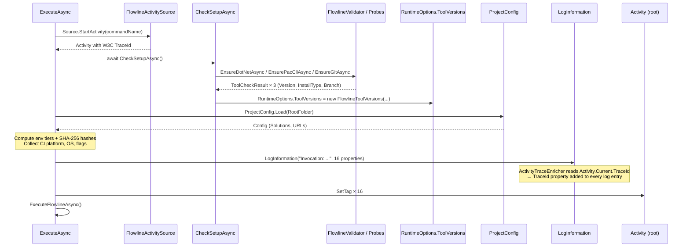

# feat: Invocation Context Logging and ActivitySource Tracing (Wave 2)

**Date:** 2026-06-29
**Depth:** Standard

---

## Summary

Every Flowline command invocation will produce a structured invocation header in the log file — 16 properties covering tool versions, runtime, CI context, invocation flags, and project scope. The same properties are set as tags on a root `Activity` started via a new `FlowlineActivitySource`, making them available to App Insights (Wave 4 / I7) without any Wave 4 structural changes. A minimal `ActivityListener` wired in `Program.cs` makes `Activity.Current` non-null and the W3C `TraceId` available immediately. The Serilog file sink gains a custom `ILogEventEnricher` that reads `Activity.Current?.TraceId` at log-write time, so every log entry in the file is stamped with the invocation trace ID.

Wave 1 ILogger call sites in `PluginService` and `WebResourceService` are audited; all four existing calls carry structured typed properties not captured by `LoggingRenderHook` as typed values, so all are retained.

---

## Problem Frame

When a Flowline command fails, the log file captures what happened but not the environment it happened in — no tool versions, no CI flag, no solution context. Reproducing the failure requires asking the user to re-run with `--verbose` and report their setup manually. (see origin: `docs/brainstorms/2026-06-29-wave-2-invocation-context-requirements.md`)

**Baseline gap found during planning:** `CheckSetupAsync` discards all `ToolCheckResult` return values. Tool versions are cached in `FlowlineValidator` but never surfaced beyond the setup check. `FlowlineRuntimeOptions` has no version properties. This plan addresses both the requirement and the gap.

---

## Requirements Trace

| Requirement | Unit |
|---|---|
| 16 invocation properties logged as structured `LogInformation` after setup + config load | U5 |
| Same properties as Activity tags on root Activity | U5 |
| `GITHUB_ACTIONS` added to CI detection; `ci.platform` discriminated | U1 |
| Git branch captured alongside git version | U2 |
| Tool versions available at invocation-header time | U3 |
| ActivitySource live with W3C TraceId in Wave 2 | U4 |
| Serilog entries stamped with TraceId | U4 |
| Commands without a project emit empty project fields, no errors | U5 |
| Wave 1 ILogger calls audited; redundant ones removed | U6 |

---

## Key Technical Decisions

**Tool version storage:** Add a `FlowlineToolVersions` record to `src/Flowline.Core/FlowlineRuntimeOptions.cs` as a nullable property `ToolVersions`. `CheckSetupAsync` is modified to capture each `ToolCheckResult` return and populate `RuntimeOptions.ToolVersions`. This extends the existing RuntimeOptions pattern (already carries `IsVerbose`, `Force`, `CommandName`) and makes versions available to any code that receives `RuntimeOptions`.

**Git branch:** `ToolCheckResult` gains a nullable `Branch` property. `EnsureGitAsync` (via the probe) runs `git rev-parse --abbrev-ref HEAD` after the version check and stores the result. Detached HEAD emits `"(detached)"` — handled by normalising the `HEAD` literal that git emits. Empty/error → `null`, omitted from the log entry.

**ActivitySource + listener strategy (user confirmed):** Greenfield `FlowlineActivitySource` static class owns a `static readonly ActivitySource Source`. A minimal `ActivityListener` (SampleUsingParentId and Sample both returning `AllData`) is registered in `Program.cs` before `app.RunAsync` — no export, no OTel TracerProvider. `ActivityIdFormat.W3C` is set at startup. Wave 4 (I7) adds the `TracerProvider` with Azure Monitor exporter on top; no structural changes needed here.

**Serilog TraceId enrichment:** Custom `ILogEventEnricher` reads `Activity.Current?.TraceId.ToString()` at the moment each log event is written (not at logger-creation time). Registered via `loggerConfig.Enrich.With(new ActivityTraceEnricher())`. A logger-creation-time capture would record a stale or null ID before any activity is started.

**ILogger cleanup outcome:** All four existing `LogInformation` calls in `PluginService` (lines 128, 142–144) and `WebResourceService` (lines 33–34, 40–41) carry structured typed parameters (counts as integers) that `LoggingRenderHook` does not capture as typed Serilog properties — it captures only the rendered text. All four are retained. `SolutionDiffService` requires the same audit during implementation.

**Environment hash:** SHA-256 of each configured URL, lower-hex, first 8 characters. Computed per URL field (ProdUrl, UatUrl, TestUrl, DevUrl). Null/empty URLs are skipped — their tier is not included in `env.configured`.

---

## High-Level Technical Design



---

## Scope Boundaries

**In scope:** All 16 invocation properties, CI detection expansion (`GITHUB_ACTIONS` + platform discriminator), git branch, `FlowlineToolVersions` on `RuntimeOptions`, `FlowlineActivitySource` + minimal listener + W3C format, `ActivityTraceEnricher` in Serilog, env tier + URL hash, Wave 1 ILogger audit.

**Deferred to Follow-Up Work:**
- OTel `TracerProvider` + Azure Monitor exporter (Wave 4 / I7)
- Hashed machine/user identity (Wave 4 — telemetry initializer is the correct registration point)
- Stage-level child activities (Wave 2 establishes the root; per-stage spans are a future enhancement)
- `TRACEPARENT` env var reading (happens automatically once the `ActivityListener` is registered and `Activity.SetParentId` conventions are followed by CI; no code change needed here)

**Out of scope:** IP/country, PAC auth profile name, full environment URLs, hardware metrics, locale, timezone. (see origin for rationale)

---

## Implementation Units

### U1. Expand CI Detection

**Goal:** Add `GITHUB_ACTIONS` to the CI env var gate in `ConsoleHelper.IsInteractive` and introduce `DetectCIPlatform()` returning a discriminated string.

**Requirements:** CI flag + platform in invocation header (feeds U5).

**Dependencies:** None.

**Files:**
- `src/Flowline/Utils/ConsoleHelper.cs` — modify

**Approach:** Add `Environment.GetEnvironmentVariable("GITHUB_ACTIONS") != null` to the existing `IsInteractive` guard block. Add a static internal method `DetectCIPlatform()` checked only when `IsInteractive` already returns `false`: returns `"github"` for `GITHUB_ACTIONS`, `"azuredevops"` for `TF_BUILD`, `"jenkins"` for `JENKINS_URL`, `"unknown"` for generic `CI`. Method is internal so U5 can call it from `FlowlineCommand`.

**Patterns to follow:** Existing env-var checks in `ConsoleHelper.IsInteractive` (lines 30–41).

**Test scenarios:**
- `IsInteractive` returns `false` when `GITHUB_ACTIONS` is set to any non-null value
- `DetectCIPlatform` returns `"github"` when `GITHUB_ACTIONS` is set
- `DetectCIPlatform` returns `"azuredevops"` when `TF_BUILD` is set, `GITHUB_ACTIONS` absent
- `DetectCIPlatform` returns `"jenkins"` when `JENKINS_URL` is set, others absent
- `DetectCIPlatform` returns `"unknown"` when only `CI` is set
- `DetectCIPlatform` returns `null` (or skipped) when no CI env vars are set — caller (U5) gates on `ci=true` first

**Verification:** `IsInteractive` returns `false` on a process with `GITHUB_ACTIONS=true` in the environment.

---

### U2. Add Branch to Git Tool Check

**Goal:** Capture the current git branch alongside the git version, stored in `ToolCheckResult.Branch`.

**Requirements:** `git.branch` in the invocation header (feeds U3, U5).

**Dependencies:** None.

**Files:**
- `src/Flowline/Validation/ValidationCache.cs` — add `Branch` property to `ToolCheckResult`
- `src/Flowline/Validation/FlowlineValidator.cs` — extend `EnsureGitAsync` (or the factory lambda) to populate `Branch`
- `src/Flowline/Validation/FlowlineProbes.cs` (or equivalent) — add `CheckGitBranchAsync` probe running `git rev-parse --abbrev-ref HEAD`

**Approach:** Add `public string? Branch { get; set; }` to `ToolCheckResult`. In the factory lambda inside `EnsureGitAsync`, after populating `Version`, run `git rev-parse --abbrev-ref HEAD`. If git returns `"HEAD"` (detached HEAD), normalise to `"(detached)"`. If the call fails or the repo has no commits, set `Branch = null` (omitted in log). The branch is cached alongside the version under the same `ToolTtl`.

**Patterns to follow:** `CheckGitAsync` probe pattern; `ToolCheckResult` construction in `EnsureGitAsync`.

**Test scenarios:**
- `Branch` is `"main"` when on the main branch
- `Branch` is `"feature/my-branch"` for a feature branch
- `Branch` is `"(detached)"` when git reports `HEAD` (detached HEAD state)
- `Branch` is `null` when the command fails (not in a git repo, no commits)
- Existing `Version` field is unaffected

**Verification:** `EnsureGitAsync` result has a non-null `Branch` in a normal repo.

---

### U3. Surface Tool Versions on RuntimeOptions

**Goal:** Make tool versions available at invocation-header time via `RuntimeOptions.ToolVersions`, populated by `CheckSetupAsync`.

**Requirements:** `dotnet.version`, `pac.version`, `pac.installType`, `git.version`, `git.branch`, `flowline.version` in the invocation header (feeds U5).

**Dependencies:** U2 (Branch on ToolCheckResult).

**Files:**
- `src/Flowline.Core/FlowlineRuntimeOptions.cs` — add `FlowlineToolVersions` record and `ToolVersions` property
- `src/Flowline/Commands/FlowlineCommand.cs` — modify `CheckSetupAsync` to capture results

**Approach:** Define:
```
record FlowlineToolVersions(
    string FlowlineVersion,
    string DotNetVersion,
    string PacVersion,
    string? PacInstallType,
    string GitVersion,
    string? GitBranch
)
```
Add `public FlowlineToolVersions? ToolVersions { get; set; }` to `FlowlineRuntimeOptions`.

Modify `CheckSetupAsync` in `FlowlineCommand` to capture the return values of `EnsureDotNetAsync`, `EnsurePacCliAsync`, and `EnsureGitAsync` instead of discarding them, then construct and assign `RuntimeOptions.ToolVersions`. Flowline version is read from `AssemblyFileVersionAttribute` on the executing assembly.

**Patterns to follow:** Existing `RuntimeOptions` population in `InitializeRuntimeOptions`; `AssemblyFileVersionAttribute` usage in `FlowlineValidator`.

**Test scenarios:**
- `RuntimeOptions.ToolVersions` is non-null after `CheckSetupAsync` completes
- `ToolVersions.FlowlineVersion` matches the assembly file version
- `ToolVersions.PacInstallType` reflects the actual PAC install type (winget/scoop/dotnet-tool)
- `ToolVersions.GitBranch` is `null` when on a detached HEAD and is passed through correctly from U2

**Verification:** After `CheckSetupAsync`, `RuntimeOptions.ToolVersions` carries all six fields.

---

### U4. ActivitySource, Minimal Listener, and Serilog TraceId Enrichment

**Goal:** Create `FlowlineActivitySource`, register a minimal `ActivityListener` so activities are non-null, set W3C format, and add a Serilog enricher that stamps every log entry with the current `TraceId`.

**Requirements:** W3C TraceId available via `Activity.Current`; TraceId in Serilog log entries; `TRACEPARENT` env var chaining supported.

**Dependencies:** None (can be implemented before U5).

**Files:**
- `src/Flowline/Diagnostics/FlowlineActivitySource.cs` — new
- `src/Flowline/Logging/ActivityTraceEnricher.cs` — new
- `src/Flowline/Program.cs` — register listener + enricher

**Approach:**

`FlowlineActivitySource`: static class with `public static readonly ActivitySource Source = new("Flowline.CLI", flVersion)`. Version read from `AssemblyFileVersionAttribute`.

`ActivityTraceEnricher`: implements `ILogEventEnricher`. `Enrich` reads `Activity.Current?.TraceId.ToString()` and adds it as a `LogEventProperty("TraceId", ...)` on the log event. Null check: if no current activity, enricher is a no-op.

`Program.cs` additions (before `app.RunAsync`):
- `Activity.DefaultIdFormat = ActivityIdFormat.W3C`
- `Activity.ForceDefaultIdFormat = true`
- Register `ActivityListener` with `ShouldListenTo = s => s.Name == "Flowline.CLI"`, `Sample = (ref ...) => ActivitySamplingResult.AllData`, `SampleUsingParentId = (ref ...) => ActivitySamplingResult.AllData`
- Add `loggerConfig.Enrich.With(new ActivityTraceEnricher())` to the Serilog configuration

**Patterns to follow:** Existing `ILogEventEnricher` pattern (if any); Serilog enricher registration in `Program.cs`.

**Test scenarios:**
- `FlowlineActivitySource.Source.StartActivity("test")` returns a non-null `Activity` after the listener is registered
- The returned `Activity` has a non-empty `TraceId` in W3C format (32 hex chars)
- `ActivityTraceEnricher.Enrich` adds `TraceId` property when `Activity.Current` is non-null
- `ActivityTraceEnricher.Enrich` is a no-op (no exception, no property) when `Activity.Current` is null

**Verification:** Start an activity, then log something; the log file entry contains a `TraceId` field.

---

### U5. Invocation Header — Log Entry and Activity Tags

**Goal:** After `CheckSetupAsync` and `ProjectConfig.Load` in `ExecuteAsync`, start the root Activity, compute all 16 properties, emit one structured `LogInformation` entry, and set all 16 as Activity tags.

**Requirements:** All 16 invocation properties in the log file and on the root Activity; commands without a project emit empty project fields without errors; property format is structured (not interpolated strings).

**Dependencies:** U1, U2, U3, U4.

**Files:**
- `src/Flowline/Commands/FlowlineCommand.cs` — modify `ExecuteAsync`
- `src/Flowline.Core/Config/ProjectConfig.cs` — add `GetConfiguredEnvironments()` and URL hash helpers (or add as a private helper in `FlowlineCommand`)

**Approach:**

Insertion point in `ExecuteAsync` — after the `ProjectConfig.Load` line (current line 30), before `ExecuteFlowlineAsync`:

1. `using var activity = FlowlineActivitySource.Source.StartActivity(context.Name)` — starts root Activity. The `using` ensures it is disposed (duration recorded) when `ExecuteAsync` returns.
2. Compute properties:
   - Versions and CI from `RuntimeOptions.ToolVersions` (U3) and `ConsoleHelper.DetectCIPlatform()` (U1)
   - OS from `RuntimeInformation.OSDescription` and `OSArchitecture`
   - Verbose/Force from `RuntimeOptions`
   - Project root from `RootFolder`
   - Solution names: `string.Join(",", Config.Solutions.Select(s => s.Name))` — empty string when no solutions
   - Configured env tiers: iterate `ProdUrl`, `UatUrl`, `TestUrl`, `DevUrl` — include tier name if URL is non-null/non-empty
   - URL hashes: SHA-256 of each configured URL, lower-hex, first 8 chars — `Convert.ToHexString(SHA256.HashData(Encoding.UTF8.GetBytes(url)))[..8].ToLower()`
3. `logger.LogInformation("Invocation: ...")` with all properties as named parameters — Serilog serialises them as structured key/value pairs.
4. Set `activity?.SetTag("flowline.version", ...)` × 16.

**Patterns to follow:** Existing structured `LogInformation` calls in `ExecuteAsync`; `SHA256.HashData` (System.Security.Cryptography, .NET 5+).

**Test scenarios:**
- Log entry appears after setup check and config load and before command body
- Log entry contains all 16 properties when `.flowline` exists and PAC/Git are installed
- `project.solutions` is empty string when `Config.Solutions` is empty
- `env.configured` and `env.hashes` are empty/omitted when all URL fields are null
- `env.configured` includes only the tiers whose URL fields are non-null (e.g. `prod,uat` if only those two are set)
- `git.branch` is omitted from the log entry when `ToolVersions.GitBranch` is null
- No exception thrown when command has `RequiresProject = false` and `Config` is `new ProjectConfig()`
- Activity has all 16 tags set; `activity.TraceId` is non-empty W3C format
- Two sequential command runs in the same process have different TraceIds

**Verification:** Open a log file from a successful command run and confirm the structured invocation header block with all expected properties is present.

---

### U6. Wave 1 ILogger Cleanup Audit

**Goal:** Audit existing explicit `LogInformation` calls in Wave 1 services and remove any that are purely redundant with `LoggingRenderHook` output.

**Requirements:** Keep only calls for internal events with no corresponding terminal write, or calls that add structured typed properties not captured as typed values by the hook.

**Dependencies:** None (independent, but best done last to have a complete picture of what the hook captures).

**Files:**
- `src/Flowline.Core/Services/PluginService.cs` — audit, likely retain
- `src/Flowline.Core/Services/WebResourceService.cs` — audit, likely retain
- `src/Flowline.Core/Services/SolutionDiffService.cs` — audit

**Approach:**

Based on research, the four existing calls are:
- `PluginService` line 128: `"Assembly synced: {Name}"` — assess whether a corresponding `console.Ok/Info` call fires with the same text; if yes and no typed params beyond `{Name}`, candidate for removal
- `PluginService` lines 142–144: `"Registration plan ready: {PluginTypeCount} plugin types, {StepCount} steps"` — integer counts not captured as typed values by hook; **retain**
- `WebResourceService` lines 33–34: `"Snapshot: {DataverseCount} Dataverse, {LocalCount} local resources"` — integer counts; **retain**
- `WebResourceService` lines 40–41: `"Plan: {Creates} creates, {Updates} updates, {Deletes} deletes"` — integer counts; **retain**

During implementation, verify whether `"Assembly synced: {Name}"` (PluginService line 128) has a companion console write with the same content. If yes and the string parameter adds no query value, remove it. If not, retain.

`SolutionDiffService`: apply same two-question test for any calls found.

**Test expectation:** No new tests required for this unit — it is an audit with conservative removal. After any removals, confirm the log file still contains the expected output for the affected operations (the hook captures the terminal text).

**Verification:** Build compiles; existing log output for plugin and web resource operations is unchanged.

---

## Open Questions

None blocking. The following are deferred to implementation:

- Whether `PluginService` line 128 (`"Assembly synced: {Name}"`) has a companion terminal write — determines if it is removed in U6.
- Whether `SolutionDiffService` has any explicit `LogInformation` calls (research found the file may not yet exist as a distinct service).
- Exact Serilog output template change needed to surface `TraceId` in the file sink — implementation discovery.

---

## Sources & Research

- Grounding dossier: `C:\Users\REMYVA~1\AppData\Local\Temp\claude\E--Code-RemyDuijkeren-Flowline\948e4e84-1563-4749-9df7-aaa78d78aa89\scratchpad\ce-brainstorm-wave2\grounding.md`
- External research: not run — local patterns (Serilog enrichers, ActivitySource) are well-established in .NET and sufficient for the plan.
- Key baseline finding: `CheckSetupAsync` discards all `ToolCheckResult` returns; versions are not on `RuntimeOptions` (verified against `FlowlineRuntimeOptions.cs` and `FlowlineCommand.cs`).
