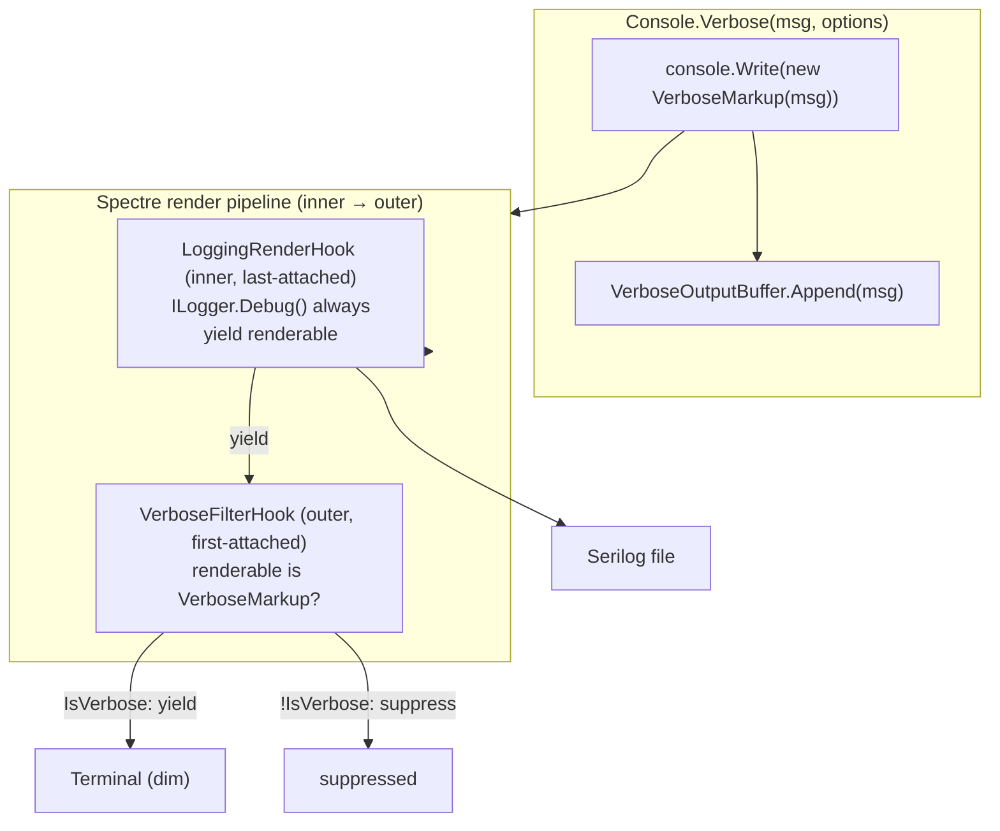
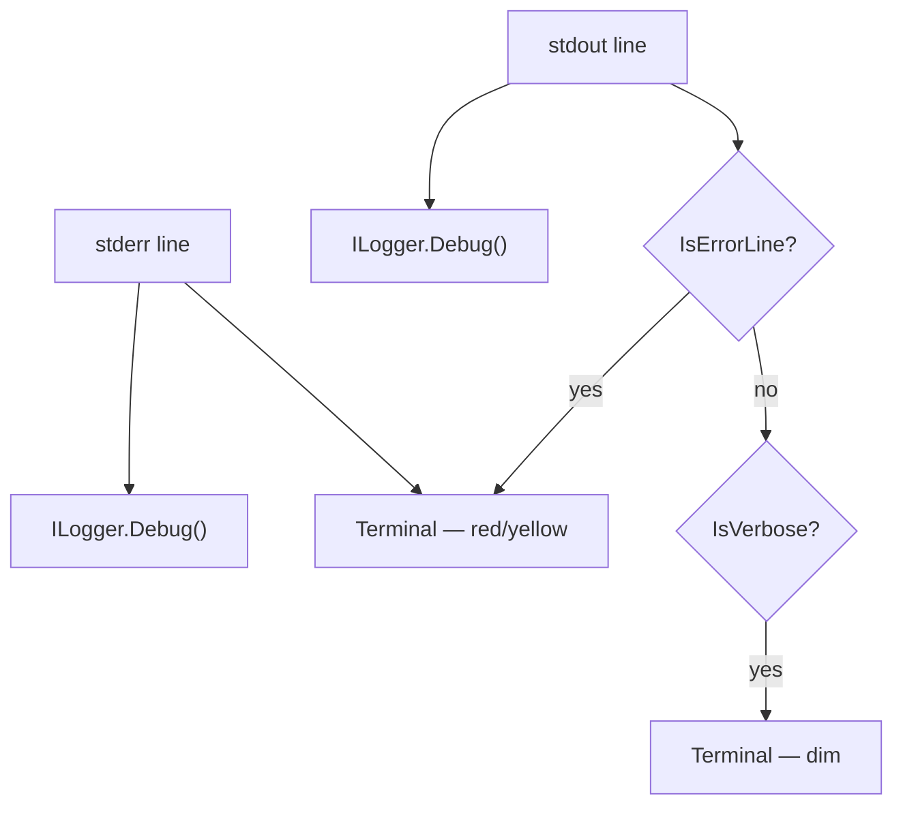

# feat: Verbose log routing Wave 3 — always-capture for verbose messages and subprocess stdout

## Summary

Close the two observability gaps Wave 2 explicitly non-goaled: Flowline's own verbose messages and subprocess stdout will now reach the Serilog log file unconditionally, regardless of whether `--verbose` is set. Terminal display remains gated by `--verbose`; file capture becomes unconditional.

---

## Problem Frame

Wave 2 (`LoggingRenderHook`) established file-logging for every message that reaches the terminal via `AnsiConsole.MarkupLine`. Verbose messages and subprocess output deliberately bypassed this — they were either suppressed before `MarkupLine` was called (Gap A) or piped through a `PipeTarget` that never touched the render pipeline (Gap B).

Two structural gaps remain after Wave 2:

**Gap A — Flowline's own verbose messages.** `Console.Verbose(msg, options)` when `!IsVerbose` appends to `VerboseOutputBuffer` only; `MarkupLine` is never called so `LoggingRenderHook` never fires. `Console.Verbose(msg, bool)` when `false` does nothing at all. The log file has no record of verbose context on a successful run.

**Gap B — Subprocess stdout.** `WithToolExecutionLog(options)` when `!IsVerbose` drops non-error stdout silently; error lines go to the buffer but not to `ILogger`. `WithToolExecutionLog(bool)` when `false` drops stdout entirely. A failing deploy without `--verbose` leaves the log file with the exception and nothing else.

Both gaps share a root cause: `--verbose` acts as a capture filter (decides whether content is generated) rather than a display filter (decides whether the terminal shows content). Wave 3 moves the flag to the display layer.

---

## Requirements

### Gap A — Flowline verbose messages

- R1. A `VerboseMarkup` type implements `IRenderable` via composition — it wraps an inner `Markup` for rendering and carries no additional fields. It is the sole type that `VerboseFilterHook` identifies by explicit type check. (`Markup` is sealed in Spectre.Console 0.57.0; subtype inheritance is not an option.)
- R2. `Console.Verbose(string, FlowlineRuntimeOptions)` calls `console.Write(new VerboseMarkup(message))` and `console.WriteLine()`, replacing the existing `MarkupLine` call. Emission is unconditional — regardless of `IsVerbose`.
- R3. `Console.Verbose` continues calling `VerboseOutput.Append(message)` alongside the `VerboseMarkup` emission so the inline error dump remains populated.
- R4. The `Console.Verbose(string, bool)` overload is removed; its 21 call sites migrate to the options overload — 5 in the Flowline project (`DataverseContextGenerator`, `ProfileResolutionService`, `SolutionChangeSummary`, `PacGenerator` ×2) and 16 in Flowline.Core services (`DataverseConnector` ×4, `PluginAssemblyReader` ×4, `WebResourceExecutor` ×5, `WebResourceService` ×2, `OrphanCleanupService` ×1).
- R5. A `VerboseFilterHook : IRenderHook` is registered in the Spectre pipeline **before** `LoggingRenderHook`. `Pipeline.Attach()` prepends hooks — last-attached lands at index 0 (innermost, processes renderables first). `LoggingRenderHook` (attached second) is innermost — it processes every renderable first, writes to `ILogger`, and yields. `VerboseFilterHook` (attached first) is outermost — it receives what the inner hook yielded and suppresses `VerboseMarkup` from the terminal when `!IsVerbose`, passes it unchanged when `IsVerbose`.
- R6. `LoggingRenderHook` is updated to add an explicit `is VerboseMarkup` branch alongside the existing `is Markup or Tree or Panel or Table` check.

### Gap B — Subprocess stdout

- R7. A `SubprocessCapture` class is registered in DI; it holds `ILogger<SubprocessCapture>` and `FlowlineRuntimeOptions` via constructor injection.
- R8. For every subprocess stdout line, `SubprocessCapture` calls `ILogger.Debug()` unconditionally before any terminal-display or buffering decision.
- R9. Error-matching stdout lines (containing `"Error: "`, `"The reason given was: "`, `": error"`, or `": warning"`) are printed to the terminal at the appropriate level (red/yellow) regardless of `IsVerbose`. They are covered by R8's Debug write and require no additional `ILogger` call.
- R10. Non-error stdout lines are printed to the terminal at dim level when `IsVerbose`, suppressed when `!IsVerbose`. Always written to `ILogger` via R8.
- R11. Stderr is written to `ILogger` unconditionally and printed to the terminal in red regardless of `IsVerbose`. It is NOT appended to `VerboseOutputBuffer` — since stderr is always immediately visible, buffering it would cause double-print in `FlushBufferedVerboseOutput` on error.
- R12. `SubprocessCapture` accepts an optional `StatusContext?` for PAC async operation progress updates (the `"Processing asynchronous operation..."` pattern).
- R13. `SubprocessCapture` accepts an optional `Func<string, string>?` line transform applied to non-error stdout before terminal display.
- R14. `CommandExtensions.WithToolExecutionLog` (both overloads) and the zero-call-site `CommandExtensions.WithExecutionLog` are removed after all call sites migrate.

### Migration

- R15. All 34 live `WithToolExecutionLog` call sites migrate to `SubprocessCapture`. The 3 calls at `SyncCommand.cs:204, 210, 226` are inside `GitCommitChanges` — a dead method with no callers (confirmed by ideation doc `2026-05-15-sync-command-improvements-ideation.md:18`); delete `GitCommitChanges` rather than migrate those 3 sites. (Total grep hits: 39 — minus 2 method definitions in `CommandExtensions`, minus 3 dead in `GitCommitChanges` = 34 live.)
- R16. Commands (`CloneCommand`, `SyncCommand`, `DeployCommand`, `ProvisionCommand`) and generator services (`PacGenerator`, `XrmContextGenerator`, `XrmContextRunner`) receive `SubprocessCapture` via DI constructor injection.
- R17. Static utilities (`GitUtils`, `PacUtils`, `DotNetUtils`, `SolutionChangeSummary`) receive `SubprocessCapture` as a method parameter on every method that invokes a subprocess.
- R18. `FlushBufferedVerboseOutput` in `Program.cs`: the `logger?.Debug("Context: {Line}", line)` loop over `VerboseOutput.Lines` is removed — file capture is already complete at the point of failure. The terminal-print loop stays.

---

## Key Technical Decisions

**VerboseMarkup as IRenderable composition, not Markup subtype.** `Markup` is sealed in Spectre.Console 0.57.0. `VerboseMarkup` wraps `new Markup($"[dim]{Markup.Escape(message)}[/]")` and delegates `Render()` to it — identical terminal output, distinct type identity. The type check `renderable is VerboseMarkup` is unambiguous; `is Markup` does not match it.

**Hook registration order: VerboseFilterHook first, LoggingRenderHook second.** `Pipeline.Attach()` prepends hooks — last-attached sits at index 0 (innermost, processed first). Attaching `VerboseFilterHook` first makes it outermost (index 1); attaching `LoggingRenderHook` second makes it innermost (index 0). `LoggingRenderHook`'s `yield return renderable` fires before its try/catch logging block — so the renderable passes to `VerboseFilterHook` before logging executes. When `VerboseFilterHook` iterates `LoggingRenderHook`'s output to decide whether to suppress, each `MoveNext()` on the inner iterator causes `LoggingRenderHook`'s post-yield logging to run — even for suppressed renderables. This guarantees file capture regardless of terminal suppression. Verify `Pipeline.Attach()` prepend semantics against Spectre.Console 0.57.0 source before U4 implementation.

**SubprocessCapture as DI injectable, not static extension.** `CommandExtensions` is static and cannot hold `ILogger`. Each call site would need to thread `ILogger` as a parameter. A constructor-injected class closes the problem class-wide, gives `SubprocessCapture` a stable home for the error-detection logic (`IsErrorLine`, `DisplayErrorMessage`), and makes it independently testable.

**Static utilities stay static; SubprocessCapture passed as method parameter.** Making `GitUtils`, `PacUtils`, `DotNetUtils`, and `SolutionChangeSummary` into injectable services is a separate architectural decision. Adding one `SubprocessCapture` parameter to each subprocess-invoking method closes Gap B without that refactor.

**Console.Verbose always buffers.** The bool overload previously did nothing when `isVerbose=false` — no buffer, no log. After migration to the options overload, all 21 previously-silent call sites gain buffer population and log file capture. This is a net improvement, not a regression.

**Migration correctness via compilation.** R14 removes both `WithToolExecutionLog` overloads. Any call site not yet migrated to `SubprocessCapture` becomes a compile error. No call-site-by-call-site migration tests needed; the build is the verification.

---

## High-Level Technical Design

### Gap A — Hook pipeline (LIFO order)



### Gap B — SubprocessCapture routing



---

## Implementation Units

### Phase 1 — Gap A: VerboseMarkup type and hook pipeline

### U1. VerboseMarkup type

**Goal:** New marker type implementing `IRenderable` via composition; foundational for all Gap A work.

**Requirements:** R1

**Dependencies:** none

**Files:**
- `src/Flowline.Core/VerboseMarkup.cs` — create
- `tests/Flowline.Core.Tests/VerboseMarkupTests.cs` — create

**Approach:** `VerboseMarkup` holds a private `Markup _markup = new Markup($"[dim]{Markup.Escape(message)}[/]")` and implements `IRenderable.Render()` by delegating to `_markup.Render()`. No other fields or methods. The constructor takes `string message`.

**Patterns to follow:** Spectre.Console composition pattern — see how `Panel` wraps inner content. Keep the type minimal: one constructor, one backing field, one interface method.

**Test scenarios:**
1. `new VerboseMarkup("hello")` renders segments identical to `new Markup("[dim]hello[/]")`.
2. `renderable is VerboseMarkup` returns true for a `VerboseMarkup` instance.
3. `renderable is Markup` returns false for a `VerboseMarkup` instance — confirms composition, not inheritance.
4. Message containing `[bold]` markup characters is escaped — `new VerboseMarkup("[bold]")` renders as the literal string `[bold]`, not as a markup tag.
5. `Render()` with `int.MaxValue` width does not throw — consistent with `LoggingRenderHook`'s extraction pattern.

**Verification:** All five tests pass; `VerboseMarkup` is referenced from `FlowlineConsoleExtensions` without compile errors.

---

### U2. Console.Verbose API update and bool overload removal — Flowline project

**Goal:** `Console.Verbose` options overload emits `VerboseMarkup` unconditionally; the bool overload removed; 5 Flowline-project bool-overload call sites migrated.

**Requirements:** R2, R3, R4

**Dependencies:** U1

**Files:**
- `src/Flowline.Core/FlowlineConsoleExtensions.cs` — modify (both Verbose overloads — body and removal)
- `src/Flowline/Generators/DataverseContextGenerator.cs` — modify (line 31 — bool overload migration)
- `src/Flowline/Services/ProfileResolutionService.cs` — modify (line 33 — bool overload migration)
- `src/Flowline/Utils/SolutionChangeSummary.cs` — modify (line 226 — bool overload migration)
- `src/Flowline/Generators/PacGenerator.cs` — modify (lines 39, 41 — bool overload migration; `isVerbose: true` hardcoded → pass `FlowlineRuntimeOptions`)

**Note:** `SyncCommand`, `CloneCommand`, `PushCommand`, `GenerateCommand` already use the options overload — their call sites are unchanged by R2; no file modifications needed. `GitUtils` has zero `Console.Verbose` calls.

**Approach:** Replace the options overload body:
- Remove the `if (options.IsVerbose)` branch entirely.
- Call `console.Write(new VerboseMarkup(message))` then `console.WriteLine()` unconditionally.
- Call `options.VerboseOutput.Append(message)` unconditionally (moved out of the `else`).
- The `[dim]` markup previously in the `MarkupLine` call moves into `VerboseMarkup`'s constructor (U1) — do not re-apply it here. The extension method passes the raw message string to `VerboseMarkup` and is markup-agnostic.

Remove the bool overload entirely. Migrate the 5 Flowline-project bool-overload call sites to the options overload. All 4 callers already have `FlowlineRuntimeOptions` accessible (constructor field or method parameter); `PacGenerator` already injects `FlowlineRuntimeOptions` and passes it here.

**Note:** Remaining 16 Flowline.Core bool-overload call sites are covered by U2a.

**Patterns to follow:** Existing options overload in `src/Flowline.Core/FlowlineConsoleExtensions.cs:21-33`. `Markup.Escape(message)` is applied inside `VerboseMarkup`'s constructor — no need to escape at the call site.

**Test scenarios:**
1. `console.Verbose("msg", options)` with `IsVerbose=true` — `VerboseMarkup` emitted to console pipeline.
2. `console.Verbose("msg", options)` with `IsVerbose=false` — `VerboseMarkup` still emitted; terminal suppression is `VerboseFilterHook`'s responsibility (tested in U4).
3. `VerboseOutputBuffer.Lines` contains `"msg"` after call, regardless of `IsVerbose`.
4. Message is not double-escaped — options overload does not apply `Markup.Escape` at the call site (VerboseMarkup does it internally).

**Verification:** Build succeeds with no references to the removed bool overload in Flowline project files. Flowline.Core bool-overload callers not yet migrated (U2a) produce compile errors — expected until U2a completes.

---

### U2a. Console.Verbose bool overload migration — Flowline.Core services

**Goal:** 16 bool-overload `Console.Verbose` call sites across 5 Flowline.Core services migrated to the options overload; `PluginAssemblyReader` and `WebResourceExecutor` constructors updated.

**Requirements:** R4

**Dependencies:** U2 (removes the bool overload; these callers must migrate before U9 removes it)

**Files:**
- `src/Flowline.Core/Services/DataverseConnector.cs` — modify (lines 36, 106, 152, 289 — pass `opt` instead of `opt.IsVerbose`)
- `src/Flowline.Core/Services/WebResourceService.cs` — modify (lines 94, 153 — pass `opt` instead of `opt.IsVerbose`; also update constructor call to `WebResourceExecutor` below)
- `src/Flowline.Core/Services/OrphanCleanupService.cs` — modify (line 406 — pass `opt` instead of `opt.IsVerbose`)
- `src/Flowline.Core/Services/PluginAssemblyReader.cs` — modify (lines 150, 159, 169, 176 — call sites; constructor signature change: `bool isVerbose` → `FlowlineRuntimeOptions options`)
- `src/Flowline.Core/Services/WebResourceExecutor.cs` — modify (lines 34, 51, 64, 79, 92 — call sites; constructor signature change: `bool isVerbose` → `FlowlineRuntimeOptions options`)
- `src/Flowline.Core/Services/PluginService.cs` — modify (line 19 — `new PluginAssemblyReader(output, opt.IsVerbose)` → `new PluginAssemblyReader(output, opt)`)
- `src/Flowline.Core/Services/WebResourceService.cs` — modify (line 12 — `new WebResourceExecutor(output, opt.IsVerbose)` → `new WebResourceExecutor(output, opt)`)

**Approach:**
- `DataverseConnector`, `WebResourceService` (lines 94/153), `OrphanCleanupService`: replace the bool argument `opt.IsVerbose` with `opt` at each call site — one-line change per site.
- `PluginAssemblyReader` and `WebResourceExecutor`: change the constructor primary parameter from `bool isVerbose` to `FlowlineRuntimeOptions options`. Replace internal `isVerbose` field references with `options.IsVerbose` in any non-Verbose usage; remove the field entirely since after R2 the Verbose call is unconditional and needs no gate.
- Update `PluginService.cs:19` and `WebResourceService.cs:12` to pass `opt` instead of `opt.IsVerbose`.

**Test scenarios:**
- Test expectation: none — migration correctness verified by compilation.

**Verification:** Build succeeds. No remaining references to the bool `Console.Verbose` overload in the codebase.

---

### U3. LoggingRenderHook VerboseMarkup branch

**Goal:** `LoggingRenderHook` logs `VerboseMarkup` renderables at `Debug` level.

**Requirements:** R6

**Dependencies:** U1

**Files:**
- `src/Flowline.Core/LoggingRenderHook.cs` — modify (type check pattern, line 17)
- `tests/Flowline.Core.Tests/LoggingRenderHookTests.cs` — modify (add VerboseMarkup test cases)

**Approach:** Extend the type-check pattern from `is Markup or Tree or Panel or Table` to `is Markup or VerboseMarkup or Tree or Panel or Table`. `VerboseMarkup.Render(options, int.MaxValue)` delegates to the inner Markup, returning plain-text segments with markup tags stripped — same extraction behavior as Markup. `DetectLevel` receives the plain text of the verbose message (no level prefix) and returns `LogLevel.Debug`.

**Patterns to follow:** Existing `LoggingRenderHook.Process()` — preserve the yield-before-try pattern and `int.MaxValue` extraction width (see `docs/solutions/architecture-patterns/spectre-console-ilogger-render-hook.md` for rationale on both constraints).

**Test scenarios:**
1. `console.Write(new VerboseMarkup("checking version"))` → `CaptureLogger.Entries` contains one entry at `Debug` with text `"checking version"`.
2. VerboseMarkup with markup-escaped content → logged text is the unescaped plain string, not `[dim]...[/]` markup tags.
3. Non-VerboseMarkup, non-Markup renderables (`Text`) still do not produce log entries.
4. Existing `Markup` logging behavior unchanged — `console.MarkupLine("[green]✓[/] Done")` still logs at `Information`.

**Verification:** Existing `LoggingRenderHookTests` pass; new VerboseMarkup test cases pass.

---

### U4. VerboseFilterHook and hook registration order

**Goal:** New hook suppresses `VerboseMarkup` from terminal when `!IsVerbose`; hook registration order updated to LIFO-correct sequence.

**Requirements:** R5

**Dependencies:** U1, U3

**Files:**
- `src/Flowline.Core/VerboseFilterHook.cs` — create
- `src/Flowline/Program.cs` — modify (hook registration, lines 179-182)
- `tests/Flowline.Core.Tests/VerboseFilterHookTests.cs` — create

**Approach:** `VerboseFilterHook` holds `FlowlineRuntimeOptions` via constructor. `Process()`: iterate renderables; for each `VerboseMarkup` when `!options.IsVerbose`, `continue` (skip yield); otherwise `yield return renderable`. Non-VerboseMarkup renderables always yield.

Hook registration in `Program.cs` after the change:
```
Pipeline.Attach(new VerboseFilterHook(runtimeOptions));         // first-attached = outermost
Pipeline.Attach(new LoggingRenderHook(logger));                 // last-attached = innermost
```

**This 2-line block is a full replacement for the existing single `Attach(LoggingRenderHook)` call at lines 179-182.** Do not add `Attach(VFH)` after the existing `Attach(LRH)` line — that would make VFH innermost and LRH outer (inverted). The existing `Attach(LRH)` becomes the second line in the new block; adding `Attach(VFH)` before it is what places it in the outermost position.

`VerboseFilterHook` does not need `ILoggerFactory` — it has no logging responsibility. It receives `runtimeOptions` directly (already in scope at the registration point).

**VerboseFilterHook.Process() must use a `foreach/continue` pattern** — not a `return renderables.Where(...)` expression:
```
foreach (var r in renderables)
{
    if (r is VerboseMarkup && !_options.IsVerbose) continue;
    yield return r;
}
```
The foreach advances the inner (LRH) iterator on each iteration, including for suppressed items — this is what causes LRH's post-yield logging to run even when VFH suppresses the renderable from the terminal. A LINQ `Where` predicate also advances the inner iterator (it calls `MoveNext()` looking for the next match) so it would technically work too, but the explicit `foreach` matches LRH's own style and makes the suppression behaviour obvious to future readers.

**Note:** Unlike `LoggingRenderHook`, `VerboseFilterHook` has no try/catch because it performs no I/O and has no renderable-extraction logic that can throw.

**Patterns to follow:** `LoggingRenderHook.Process()` iterator structure. `FlowlineRuntimeOptions` is a singleton already in scope at hook registration time.

**Test scenarios:**
1. `IsVerbose=false`, `VerboseMarkup` input → hook yields nothing; TestConsole output is empty for that renderable.
2. `IsVerbose=true`, `VerboseMarkup` input → hook yields the VerboseMarkup unchanged; TestConsole output contains the dim text.
3. `IsVerbose=false`, non-VerboseMarkup (`Markup("text")`) → hook yields it unchanged.
4. Mixed renderables in one `Process()` call: VerboseMarkup suppressed, other renderables yielded — order of yielded renderables preserved.
5. Integration: With both hooks attached in LIFO order, a `VerboseMarkup` written via `console.Write()` appears in `CaptureLogger.Entries` at Debug AND is absent from `TestConsole.Output` when `IsVerbose=false`.

**Verification:** New VerboseFilterHookTests pass; integration scenario (test 5) verifies LIFO behavior end-to-end.

---

### Phase 2 — Gap B: SubprocessCapture

### U5. SubprocessCapture class

**Goal:** DI-injectable class encapsulating all subprocess stdout/stderr handling, replacing `CommandExtensions.WithToolExecutionLog`.

**Requirements:** R7, R8, R9, R10, R11, R12, R13

**Dependencies:** none (independent of Phase 1)

**Files:**
- `src/Flowline/SubprocessCapture.cs` — create
- `tests/Flowline.Tests/SubprocessCaptureTests.cs` — create (no existing test file for CommandExtensions)

**Approach:** `SubprocessCapture(ILogger<SubprocessCapture> logger, FlowlineRuntimeOptions options)` constructor. Expose one primary method: `Command Apply(Command cmd, StatusContext? ctx = null, Func<string, string>? lineTransform = null)` returning the command with stdout and stderr pipes configured.

Stdout `PipeTarget.ToDelegate`:
- Call `_logger.Debug("{Line}", line)` unconditionally.
- Run `IsErrorLine(line)` (port from `CommandExtensions` — checks for `"Error: "`, `"The reason given was: "`, `": error"`, `": warning"`).
- If error line: print to terminal at appropriate level (red/yellow) via injected `IAnsiConsole` or `AnsiConsole`.
- If non-error: apply `lineTransform` if provided; print to terminal at dim when `options.IsVerbose`.
- If `ctx != null` and line starts with `"Processing asynchronous operation..."`: update status (port `SetStatusWithExecutionTime` logic).

Stderr `PipeTarget.ToDelegate`:
- Call `_logger.Debug("{Line}", line)` unconditionally.
- Print to terminal in red unconditionally (do NOT append to `VerboseOutput` — always-visible stderr must not double-print in `FlushBufferedVerboseOutput`).

`IsErrorLine` — private static method (pure string predicate, no side effects); same logic as `CommandExtensions.cs:128-150`.
`DisplayErrorMessage` — private **instance** method using `_console.MarkupLine()`. Must not use static `AnsiConsole` — that defeats the injected `IAnsiConsole` testability. Same branching logic as `CommandExtensions.cs:131-143`.
`SetStatusWithExecutionTime` — private static method; port from `CommandExtensions.cs:112-123`. Updates `ctx.Status()` when a PAC async operation line matches `"Processing asynchronous operation..."` and includes an elapsed-time suffix.

**Note:** `IAnsiConsole` is registered as a singleton in DI (`services.AddSingleton<IAnsiConsole>(AnsiConsole.Console)` in `Program.cs`). Inject it into `SubprocessCapture` for testability — avoids the static `AnsiConsole` calls that made `CommandExtensions` untestable.

**Patterns to follow:** `CommandExtensions.WithToolExecutionLog` (options overload, lines 60-103) for logic. `LoggingRenderHook` constructor pattern for logger injection. `IsErrorLine` / `DisplayErrorMessage` logic at `src/Flowline/Utils/CommandExtensions.cs:128-150`.

**Test scenarios:**
1. Stdout line → `ILogger.Debug` called with the line text.
2. Non-error stdout + `IsVerbose=false` → no terminal output, `ILogger.Debug` still called.
3. Non-error stdout + `IsVerbose=true` → terminal output at dim, `ILogger.Debug` called.
4. Error-matching stdout (`"Error: something failed"`) + `IsVerbose=false` → terminal output in red, `ILogger.Debug` called.
5. Warning-matching stdout (`"MyPlugin: warning CS8..."`) + `IsVerbose=false` → terminal output in yellow, `ILogger.Debug` called.
6. Stderr line → `ILogger.Debug` called, terminal output in red; `VerboseOutputBuffer.Lines` does NOT contain the line (no double-print on error).
7. `lineTransform` applied to non-error stdout before terminal display — logged raw, displayed transformed.
8. PAC progress line (`"Processing asynchronous operation..."`) with non-null `ctx` → status is updated.
9. PAC progress line with null `ctx` → no exception; line handled as normal non-error stdout.

**Verification:** All nine test scenarios pass. `SubprocessCapture.Apply()` returns a configured `Command` that can be chained with `.ExecuteAsync(token)`.

---

### U6. DI registration and FlushBufferedVerboseOutput cleanup

**Goal:** `SubprocessCapture` registered in DI; redundant logger loop removed from error handler.

**Requirements:** R7, R18

**Dependencies:** U4 (hook registration already updated), U5

**Files:**
- `src/Flowline/Program.cs` — modify (DI registration, FlushBufferedVerboseOutput)

**Approach:** Add `services.AddSingleton<SubprocessCapture>()` to the DI registration block (near lines 50-65).

In `FlushBufferedVerboseOutput`: remove the `foreach (var line in flowlineRuntimeOptions.VerboseOutput.Lines) logger?.Debug(...)` loop (lines 197-198). The `ex.Data.Keys` loop that logs exception context data remains untouched — those are not verbose output lines.

**Patterns to follow:** Existing `services.AddSingleton` registrations in `Program.cs`. The `FlushBufferedVerboseOutput` terminal-print loop (`AnsiConsole.MarkupLine(...)`) stays — it is the inline recovery aid, not file routing.

**Test scenarios:**
- Test expectation: none for FlushBufferedVerboseOutput — the change is a deletion; regression verified by integration tests at the command level.
- `SubprocessCapture` resolves from DI container — compilation confirms registration.

**Verification:** Build succeeds. The deleted logger loop is no longer present in the function body.

---

### Phase 3 — Migration

### U7. Static utility migration

**Goal:** `GitUtils`, `PacUtils`, `DotNetUtils`, `SolutionChangeSummary` receive `SubprocessCapture` as a method parameter; `WithToolExecutionLog` calls replaced with `SubprocessCapture.Apply()`.

**Requirements:** R15, R17

**Dependencies:** U5, U6

**Files:**
- `src/Flowline/Utils/GitUtils.cs` — modify (9 call sites; add `SubprocessCapture` param to affected methods)
- `src/Flowline/Utils/PacUtils.cs` — modify (6 call sites; add `SubprocessCapture` param)
- `src/Flowline/Utils/DotNetUtils.cs` — modify (1 call site; add `SubprocessCapture` param)
- `src/Flowline/Utils/SolutionChangeSummary.cs` — modify (2 call sites; add `SubprocessCapture` param)

**Approach:** For each static method in these utilities that calls `WithToolExecutionLog`, add a `SubprocessCapture capture` parameter. Replace `cmd.WithToolExecutionLog(...)` with `capture.Apply(cmd, ...)`. Callers (commands and generators) pass their injected `SubprocessCapture` instance through.

**Note:** `StatusContext?` and `Func<string, string>?` parameters on the existing `WithToolExecutionLog` calls map directly to `SubprocessCapture.Apply()`'s optional parameters. Keep the call-site shape as similar as possible.

**Test scenarios:**
- Test expectation: none for individual utility migrations — migration correctness is verified by compilation (R14 removes the overloads in U9, making any unconverted call site a build error).

**Verification:** Build succeeds with `SubprocessCapture` parameters present. No remaining references to `WithToolExecutionLog` in modified files.

---

### U8. Command and generator migration

**Goal:** All command and generator classes receive `SubprocessCapture` via DI and pass it to utility methods.

**Requirements:** R15, R16

**Dependencies:** U5, U6, U7

**Files:**
- `src/Flowline/Commands/CloneCommand.cs` — modify (8 call sites; add `SubprocessCapture` to constructor)
- `src/Flowline/Commands/SyncCommand.cs` — modify (1 live call site at line 106; delete dead `GitCommitChanges` method)
- `src/Flowline/Commands/DeployCommand.cs` — modify (2 call sites; add `SubprocessCapture` to constructor)
- `src/Flowline/Commands/ProvisionCommand.cs` — modify (2 call sites; add `SubprocessCapture` to constructor)
- `src/Flowline/Generators/PacGenerator.cs` — modify (1 call site; add `SubprocessCapture` to constructor)
- `src/Flowline/Generators/XrmContextGenerator.cs` — modify (1 call site; add `SubprocessCapture` to constructor)
- `src/Flowline/Services/XrmContextRunner.cs` — modify (1 call site; add `SubprocessCapture` to constructor)

**Approach:** Add `SubprocessCapture _capture` to each class constructor. Spectre.Console.Cli commands receive DI via the `TypeRegistrar`/`TypeResolver` pattern already in place — no registration changes beyond U6. Pass `_capture` to utility methods and use `_capture.Apply(cmd, ctx)` for any direct subprocess calls in the command body.

**Constructor injection:** For each file in the list, add `SubprocessCapture capture` as a constructor parameter and store as `_capture`. Verify the constructor primary-parameter syntax matches the existing pattern in each file (e.g., `CloneCommand.cs:13` currently has four parameters — add `SubprocessCapture capture` to the list).

**SyncCommand specifics:**
- **Line 106** — 1 live `WithToolExecutionLog` call; migrate to `_capture.Apply(cmd, ctx)`.
- **Lines 197-228 (`GitCommitChanges`)** — dead static method, never called from `ExecuteFlowlineAsync`. Delete the entire method. Lines 204, 210, 226 (the 3 no-arg `WithToolExecutionLog()` calls) are inside it — deleting the method removes them without migration.
- **Lines 202-203** — `.WithStandardOutputPipe()` and `.WithStandardErrorPipe()` calls that are currently overridden (dead) by `.WithToolExecutionLog()` at line 204. Remove these two lines during migration; do not preserve them alongside `_capture.Apply()`.

**Test scenarios:**
- Test expectation: none for individual command migrations — same compilation-verification rationale as U7.

**Verification:** Build succeeds with all command constructors accepting `SubprocessCapture`. No remaining references to `WithToolExecutionLog` in modified files. `SyncCommand.GitCommitChanges` no longer exists.

---

### U9. Remove WithToolExecutionLog and WithExecutionLog

**Goal:** Both `WithToolExecutionLog` overloads and the zero-call-site `WithExecutionLog` are removed from `CommandExtensions`; cleanup of the class.

**Requirements:** R14

**Dependencies:** U7, U8

**Files:**
- `src/Flowline/Utils/CommandExtensions.cs` — modify (delete WithExecutionLog at lines 10-17; delete WithToolExecutionLog overloads at lines 19-103; delete SetStatusWithExecutionTime at lines 112-123 — only called from WithToolExecutionLog, now ported to SubprocessCapture in U5; delete IsErrorLine/DisplayErrorMessage helpers at lines 128-150 — now private to SubprocessCapture)

**Approach:** Delete all three methods. `CommandExtensions` retains `RedactSensitiveArgs` and `s_sensitiveArgPattern` (called from `Program.cs:84`); keep the file. Any other surviving public methods remain untouched.

**Test scenarios:**
- Test expectation: none — verification is compilation.

**Verification:** Build succeeds with no `CS0117` / `CS1061` errors. `CommandExtensions.WithToolExecutionLog` and `CommandExtensions.WithExecutionLog` no longer appear in the codebase.

---

## Scope Boundaries

- Serilog configuration unchanged — file sink, `MinimumLevel.Debug`, enrichers stay as Wave 1 left them.
- `LoggingRenderHook` level-detection logic unchanged (prefix-based string matching, Wave 2 contract).
- Buffer size unchanged at 50 lines (rolling, oldest discarded). After Wave 3 all 21 `Console.Verbose` call sites write unconditionally regardless of `IsVerbose` — previously only the 16 Flowline.Core sites wrote when `!IsVerbose`. The 50-line cap may truncate early verbose messages from `FlushBufferedVerboseOutput`'s terminal-print loop more aggressively on verbose-heavy commands, but this is acceptable: the Serilog file always has the complete record, and the buffer's sole remaining purpose is the inline terminal error dump.
- Buffer success-path flush not added — flushing the buffer on success would print verbose lines to terminal after a successful run.
- `FlushBufferedVerboseOutput` terminal-print loop stays — it is the inline error recovery aid.
- `PacUtils`, `GitUtils`, `DotNetUtils` remain static classes; injectable-service migration is a separate decision.
- No `--quiet` flag — separate UX direction.
- No changes to non-verbose extension methods (`Ok`, `Info`, `Skip`, `Warning`, `Error`).

### Deferred to Follow-Up Work

- Injectable services for static utilities — the method-parameter pattern closes Gap B now; DI refactor is deferred.
- `docs/solutions/` entry for the `SubprocessCapture` migration pattern — new institutional knowledge worth capturing after implementation lands.

---

## System-Wide Impact

Every command that executes a subprocess gains unconditional log file capture as a side-effect of the migration — no per-command opt-in required. Operators debugging a failed deploy or provision without `--verbose` will now have complete subprocess output in the log file.

**Subprocess stderr** is now always printed in red to the terminal, regardless of `--verbose`. Previously, stderr was buffered silently when not in verbose mode. PAC CLI and git occasionally emit non-fatal content to stderr (PAC deprecation notices, git LFS fetch progress). Non-verbose users will see these as unexpected red output. Document in release notes.

The `SyncCommand.GitCommitChanges` dead method (lines 197-228) is deleted — no user-visible behavior change, as the method was never reachable.

---

## Sources / Research

- `docs/brainstorms/2026-06-30-verbose-log-routing-wave3-requirements.md` — origin requirements doc (reviewed via `ce-doc-review`; 8 findings applied)
- `docs/solutions/architecture-patterns/spectre-console-ilogger-render-hook.md` — yield-before-try pattern, int.MaxValue extraction width rationale, ILoggerFactory-outside-DI constraint, TestConsole + CaptureLogger test pattern
- `docs/solutions/architecture-patterns/activity-correlation-structured-logging.md` — hook + activity listener coexistence pattern in Program.cs
- `docs/brainstorms/2026-06-28-console-to-ilogger-tee-requirements.md` — Wave 2 requirements; this plan reverses Wave 2's explicit non-goal on suppressed verbose
- `docs/brainstorms/2026-06-25-cli-observability-wave1-requirements.md` — Wave 1 context (Serilog setup, VerboseOutputBuffer introduction)
- `src/Flowline.Core/LoggingRenderHook.cs` — hook process pattern, existing type check
- `src/Flowline.Core/FlowlineConsoleExtensions.cs` — both Verbose overloads; Markup.Escape pattern for buffered output
- `src/Flowline/Utils/CommandExtensions.cs` — both WithToolExecutionLog overloads, IsErrorLine/DisplayErrorMessage logic to port
- `src/Flowline/Program.cs` — hook registration location, FlushBufferedVerboseOutput, DI registration pattern
- `tests/Flowline.Core.Tests/LoggingRenderHookTests.cs` — TestConsole + CaptureLogger test pattern to mirror for VerboseMarkup and VerboseFilterHook tests
