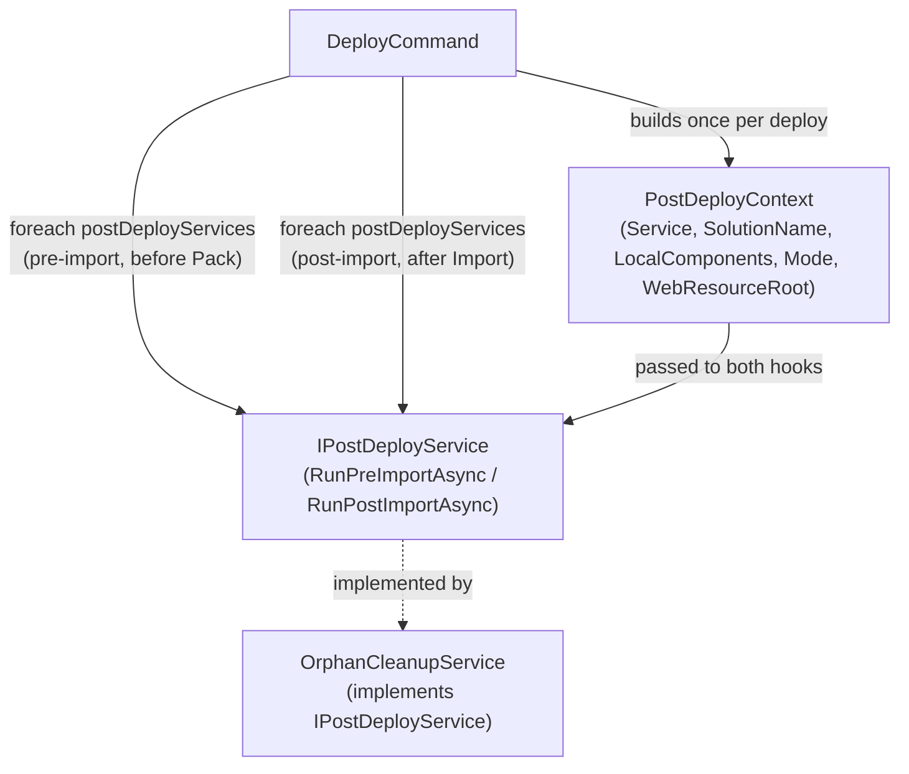

# Post-Deploy Service Protocol - Plan

## Goal Capsule

- **Objective:** Extract `OrphanCleanupService`'s ad-hoc pre/post-import hooks into a typed `IPostDeployService` protocol; refactor `OrphanCleanupService` as its first implementer with no externally observable behavior change.
- **Product authority:** STRATEGY.md "Drift detection + component cleanup" track; idea 6 in `docs/ideation/2026-07-01-post-deploy-environment-config-ideation.html`.
- **Stop conditions:** Stop and ask if implementation reveals `OrphanCleanupService`'s console output or exit-code behavior must change to fit the interface — that would be a Product Contract change, not a planning-time call.
- **Execution profile:** Standard. Four implementation units, single-implementer refactor with no user-facing behavior change.
- **Product Contract preservation:** R1-R7 unchanged from the requirements-only version. Outstanding Questions ("shape of the shared context", "whether the pre-import hook needs a return value") are resolved below in the Planning Contract (KTD2, KTD3) and removed from Product Contract. Key Decisions gained research citations (`file:line`) but no semantic change.

---

## Product Contract

### Summary

Extract `OrphanCleanupService`'s ad-hoc pre/post-import hooks into a typed `IPostDeployService` protocol that `DeployCommand` consumes generically instead of calling a concrete service type. `OrphanCleanupService` becomes the protocol's first implementer, with no observable change in deploy behavior. The protocol is shaped to also fit the state-restoration and pre-deploy-backup capabilities already anticipated elsewhere, without requiring another interface change when those land.

### Problem Frame

`DeployCommand` currently calls `orphanCleanupService.RunPreImportAsync(...)` and `orphanCleanupService.RunPostImportAsync(...)` directly by concrete type (`src/Flowline/Commands/DeployCommand.cs:61,67`). Two more capabilities are already anticipated on the same pre-import/post-import shape: classic-workflow state restoration (`docs/brainstorms/2026-06-12-deploy-state-restoration-requirements.md`) and a pre-deploy backup step (`docs/ideation/IDEAS.md:181-190`, the `flowline release` idea). Left ad-hoc, each new capability adds another bespoke pair of calls and another merge point in `DeployCommand`, and the command accumulates knowledge of every capability's concrete type and return shape. Formalizing the existing pattern once, before the second implementer is built, avoids that growth.

### Key Decisions

- **Stateful service instances, no state parameter on the interface.** Pre-import state (`OrphanCleanupService`'s dependency-deferred retry list) becomes private instance state on the implementing service instead of crossing the interface. Today the `deferred` list is returned by `RunPreImportAsync` and passed explicitly into `RunPostImportAsync` (`src/Flowline.Core/Services/OrphanCleanupService.cs:32,124-139`) — this is a deliberate internal-structure change, not a continuation of the current contract. Externally observable behavior (console output, exit codes) is unchanged; only the mechanism carrying state between the two calls changes. Safe because `OrphanCleanupService` is registered `AddSingleton` (`src/Flowline/Program.cs:63`) and Flowline is a single-command-per-process CLI — each `deploy` invocation is a fresh process, so there is no concurrent-deploy scenario where instance state could leak between runs.
- **Shared per-run context on both hooks.** `OrphanCleanupService` needs inputs (parsed local components, run mode, web-resource root) that other anticipated implementers won't. Both hooks accept one shared per-run context type carrying whatever inputs any implementer might need for that deploy (see KTD2).
- **Uniform failure result, exact contract preserved.** The post-import hook returns a failure count, same as `OrphanCleanupService.RunPostImportAsync` does today (`Task<int>`). `DeployCommand` sums failure counts across all resolved implementers and downgrades the deploy result to `ExitCode.PartialSuccess` (value `18`, documented as a stable public API in `docs/solutions/architecture-patterns/ai-agent-consumable-cli-contract-2026-06-07.md`) under the same trigger condition as today — any non-zero count — generalized across implementers instead of a single concrete type.
- **Interface shaped for known future consumers, not built for them.** The protocol must fit the state-restoration snapshot/restore pattern and the backup step's pre-import-only pattern (a service can implement a no-op post-import hook) without a breaking change later — verified here by design review, not by building either service.
- **DI-resolved collection, registration-order execution, fan-out consumption.** `DeployCommand` depends on a DI-resolved collection of `IPostDeployService`, not on `OrphanCleanupService` by name. Every registered implementer's hooks run (fan-out), not a single selected one — see KTD1 for why this differs from the codebase's only other multi-implementation interface (`IGenerator`). With one implementer, execution order is trivial; an explicit ordering policy is deferred until a second implementer is registered.

### Requirements

**Protocol shape**

- R1. Define `IPostDeployService` with a pre-import hook (runs before packing/import) and a post-import hook (runs after import completes, returns a failure count).
- R2. Both hooks accept a shared per-run context carrying the inputs any implementer may need for that deploy run (connection, solution name, parsed local components, run mode, web-resource root).
- R3. Implementations may hold their own state between the pre-import and post-import calls; the interface itself carries no state parameter.

**OrphanCleanupService migration**

- R4. `OrphanCleanupService` implements `IPostDeployService`. Its classification rules, execution order, cross-solution check, and console output are preserved exactly — this is a signature-level refactor, not a behavior change.

**DeployCommand integration**

- R5. `DeployCommand` depends on `IPostDeployService` (resolved as a DI collection), not on `OrphanCleanupService` directly.
- R6. `DeployCommand` aggregates post-import failure counts across all resolved implementers and downgrades the deploy result to `PartialSuccess` if the total is non-zero — same threshold behavior as today (`src/Flowline/Commands/DeployCommand.cs:70-74`), generalized across implementers.
- R7. DI registers `OrphanCleanupService` as the sole `IPostDeployService` implementer for now (`src/Flowline/Program.cs:63`); registration order determines execution order.

### Scope Boundaries

- `WorkflowRestoreService` (state restoration, per `docs/brainstorms/2026-06-12-deploy-state-restoration-requirements.md`) — separate follow-up plan, not implemented here.
- Pre-deploy backup service (per `docs/ideation/IDEAS.md:181-190`) — no plan exists yet, not implemented here.
- Execution ordering policy across multiple implementers — moot with a single implementer; revisit when a second one is registered.
- Any functional change to orphan cleanup itself (classification rules, cross-solution logic, console output, deletion order) — out of scope; this is a pure interface extraction.

### Dependencies / Assumptions

- Assumes the state-restoration shape (pre-import snapshot of `workflow`/`savedquery` state codes, post-import `SetStateRequest` restore, per `docs/brainstorms/2026-06-12-deploy-state-restoration-requirements.md`) fits the pre-import/post-import hook shape defined here without a further interface change. Verified by design walk-through below (see Planning Contract, "Fit against future consumers"), not by implementation.
- Assumes the pre-deploy backup capability (currently only sketched in `docs/ideation/IDEAS.md:181-190`) needs no meaningful post-import counterpart — a future implementer can satisfy the post-import hook as a no-op returning `0`.

### Success Criteria

- Existing `OrphanCleanupServiceTests` (`tests/Flowline.Core.Tests/OrphanCleanupServiceTests.cs`) pass with no behavior changes — signature-only adjustments where the interface requires them.
- `src/Flowline/Commands/DeployCommand.cs` no longer references `OrphanCleanupService` as a concrete type — only `IPostDeployService`.
- A design walk-through of the interface against the state-restoration and backup shapes (see Planning Contract) surfaces no needed interface change before either of those plans starts.

### Sources / Research

- `src/Flowline.Core/Services/OrphanCleanupService.cs:32-162` — current `RunPreImportAsync`/`RunPostImportAsync` signatures and the `deferred` state passed between them.
- `src/Flowline/Commands/DeployCommand.cs:16,59-68` — constructor injection of `OrphanCleanupService` and its two call sites in the deploy flow.
- `src/Flowline/Program.cs:58-63` — `IGenerator` multi-implementation DI registration precedent (lines 58-60) and `OrphanCleanupService` registered `AddSingleton` (line 63).
- `src/Flowline/Generators/IGenerator.cs:5-9` and `src/Flowline/Commands/GenerateCommand.cs:18,280` — the codebase's only existing multi-implementation interface: `IEnumerable<IGenerator>` injected, one selected via `SingleOrDefault(g => g.Type == ...)`. `IPostDeployService` needs fan-out (all implementers run), not select-one — no local precedent for that half of the shape.
- `docs/solutions/architecture-patterns/orphan-cleanup-two-phase-deploy-pipeline.md` — documents the current two-phase contract in detail, including the fixed deploy execution order (`ValidateTarget → ValidateDtap → DriftCheck → ParseSolutionXml → ConnectDataverse → RunPreImport → Pack → Import → RunPostImport`) and that the `deferred`-list handoff is today an explicit parameter, not instance state.
- `docs/solutions/architecture-patterns/ai-agent-consumable-cli-contract-2026-06-07.md` — `ExitCode` is a documented stable public API; `PartialSuccess = 18` was added specifically for orphan-cleanup partial failure and must keep its exact trigger condition.
- `docs/ideation/2026-07-01-post-deploy-environment-config-ideation.html` (idea 6) — origin of the `IPostDeployService` proposal.
- `docs/brainstorms/2026-06-12-deploy-state-restoration-requirements.md` — the state-restoration shape the interface must also fit.
- `docs/ideation/IDEAS.md:181-190` — the `flowline release` pre-deploy backup idea, the third anticipated shape.
- No relevant `docs/solutions/` entry exists yet for DI interface-extraction patterns or the `IEnumerable<T>` multi-implementation convention itself — worth writing up after this lands, since the pattern is now used twice (`IGenerator`, `IPostDeployService`) with no prior documentation.

---

## Planning Contract

### Key Technical Decisions

- **KTD1 — Fan-out consumption, not select-one.** `DeployCommand` iterates `foreach (var service in postDeployServices)` and calls both hooks on every resolved `IPostDeployService`, unlike `IGenerator`'s `SingleOrDefault(g => g.Type == ...)` pick-one pattern (`src/Flowline/Commands/GenerateCommand.cs:280`). `IPostDeployService` has no discriminator property — every registered implementer participates in every deploy. This is new ground for the codebase; there's no existing "run all matching" precedent to mirror.
- **KTD2 — `PostDeployContext` shape.** A `sealed record PostDeployContext` (matching the project's existing convention for data carriers, e.g. `OrphanEntry` at `src/Flowline.Core/Services/OrphanCleanupService.cs:11`, `DtapGateDecision` at `src/Flowline/Commands/DeployCommand.cs:264`) with fields: `IOrganizationServiceAsync2 Service`, `string SolutionName`, `IReadOnlyList<(Guid ObjectId, int ComponentType)> LocalComponents`, `RunMode Mode`, `string? WebResourceRoot`. `CancellationToken` stays a separate trailing method parameter on both hooks, matching every existing async method in the codebase (e.g. `OrphanCleanupService.RunPreImportAsync`) rather than becoming a context field. Resolves the requirements-only plan's Outstanding Question on context shape.
- **KTD3 — Pre-import hook returns `Task`, not a value.** Since pre-import state no longer crosses the interface (per the Key Decision on stateful instances), `RunPreImportAsync` has no return value. Resolves the requirements-only plan's Outstanding Question on the pre-import return type.
- **KTD4 — File placement mirrors `IGenerator`.** `IPostDeployService` and `PostDeployContext` live in a new file `src/Flowline.Core/Services/IPostDeployService.cs`, same folder as `OrphanCleanupService.cs` — mirroring `IGenerator.cs`'s placement alongside its implementers (`src/Flowline/Generators/`).
- **KTD5 — Aggregation logic as a testable static helper.** `tests/Flowline.Tests/DeployCommandDtapGateTests.cs` shows the only existing pattern for testing `DeployCommand` logic without a full DI/PAC-CLI harness: extract pure logic into an `internal static` method and test it directly (mirroring `DeployCommand.ResolveDtapGate`). The failure-aggregation-to-exit-code decision follows the same pattern: an `internal static` method taking the summed failure count and returning whether to downgrade to `PartialSuccess`, unit-testable without constructing `DeployCommand` itself (which requires live `DataverseConnector`/PAC CLI dependencies with no existing test doubles).

### High-Level Technical Design

The fixed pipeline order from `docs/solutions/architecture-patterns/orphan-cleanup-two-phase-deploy-pipeline.md` is unchanged: pre-import hooks still run after `ParseSolutionXml`/`ConnectToDataverseAsync` and before `PackSolutionAsync`; post-import hooks still run after `ImportSolutionAsync`.

### Fit against future consumers (design walk-through)

Verifying the Dependencies / Assumptions above without building either service:

- **State restoration** (`docs/brainstorms/2026-06-12-deploy-state-restoration-requirements.md`): pre-import snapshots `workflow`/`savedquery` state codes for the deploying solution — needs only `PostDeployContext.Service` and `.SolutionName`, ignoring `LocalComponents`/`Mode`/`WebResourceRoot`. Post-import compares current state to the snapshot and issues `SetStateRequest` calls, returning a count of restore failures. Fits the interface with no change. Its documented `--no-restore` opt-out flag is per-capability, not per-run — it belongs on that service's own constructor-injected settings object, mirroring how `OrphanCleanupService` already receives `FlowlineRuntimeOptions` separately from any per-run context (`src/Flowline.Core/Services/OrphanCleanupService.cs:13`), not as a new `PostDeployContext` field.
- **Pre-deploy backup** (`docs/ideation/IDEAS.md:181-190`): pre-import creates a solution snapshot using `PostDeployContext.Service`/`.SolutionName`. Post-import hook is a no-op returning `0` (per Dependencies / Assumptions). Fits the interface with no change.

No interface revision is needed for either anticipated consumer. Per-capability CLI toggles (like `--no-restore`) stay off `PostDeployContext` entirely — `PostDeployContext` only carries per-run inputs shared across implementers; a toggle specific to one capability is that capability's own constructor-injected concern.

### Assumptions

- No other call site depends on `OrphanCleanupService`'s concrete type beyond `DeployCommand` and its DI registration — confirmed via repo-wide search; the only other references are a code comment in `src/Flowline.Core/Services/ComponentClassifier.cs:14` and the test file, neither of which requires the concrete type.

---

## Implementation Units

### U1. Define `IPostDeployService` and `PostDeployContext`

- **Goal:** Introduce the protocol shape and shared context type with no behavior attached.
- **Requirements:** R1, R2, R3.
- **Dependencies:** None.
- **Files:**
  - `src/Flowline.Core/Services/IPostDeployService.cs` (new)
- **Approach:** Per KTD2/KTD3/KTD4 — `PostDeployContext` as a `sealed record` with `Service`, `SolutionName`, `LocalComponents`, `Mode`, `WebResourceRoot`; `IPostDeployService` with `Task RunPreImportAsync(PostDeployContext context, CancellationToken ct)` and `Task<int> RunPostImportAsync(PostDeployContext context, CancellationToken ct)`.
- **Patterns to follow:** `src/Flowline/Generators/IGenerator.cs` for interface shape and placement; `OrphanEntry` (`src/Flowline.Core/Services/OrphanCleanupService.cs:11`) for the `sealed record` convention.
- **Test scenarios:** Test expectation: none -- pure type definitions with no logic; exercised indirectly through U2 and U3's tests.
- **Verification:** `dotnet build` succeeds with the new file added.

### U2. Refactor `OrphanCleanupService` to implement `IPostDeployService`

- **Goal:** `OrphanCleanupService` implements the new interface. The `sNew`/`mode`/`webresourceRoot` parameters move into `PostDeployContext`; the `deferred` list moves from an explicit return/parameter pair to a private instance field, set at the end of `RunPreImportAsync` and read at the start of `RunPostImportAsync`. All existing logic (classification, execution order, cross-solution check, console output) is otherwise unchanged.
- **Requirements:** R3, R4.
- **Dependencies:** U1.
- **Files:**
  - `src/Flowline.Core/Services/OrphanCleanupService.cs` (modify)
  - `tests/Flowline.Core.Tests/OrphanCleanupServiceTests.cs` (modify: construction and call sites adjusted to the new signatures)
- **Approach:** Replace the five explicit parameters on `RunPreImportAsync` (`service, solutionName, sNew, mode, webresourceRoot`) with `(PostDeployContext context, CancellationToken ct)`, reading each field from `context`. Replace `RunPostImportAsync`'s `(service, solutionName, sNew, deferred, mode, ct)` with `(PostDeployContext context, CancellationToken ct)`, reading the deferred list from the new private field `List<OrphanEntry> _deferred` (initialized empty, populated at the end of `RunPreImportAsync`) instead of a parameter.
- **Test scenarios:**
  - Happy path: every existing test in `OrphanCleanupServiceTests.cs` continues to pass, constructing `OrphanCleanupService` directly and calling the new signatures.
  - Integration (new — closes an existing gap): a dependency-deferred entry returned from `RunPreImportAsync` is retried and resolved by a subsequent `RunPostImportAsync` call on the *same instance*. No current test exercises this round trip (confirmed: no test references `RunPostImportAsync` or `deferred` today) — this is now the only path that proves the instance-field state-threading works.
  - Edge case: calling `RunPostImportAsync` on a fresh instance with no prior `RunPreImportAsync` call returns `0` and performs no action, matching today's `deferred.Count == 0` short-circuit (`src/Flowline.Core/Services/OrphanCleanupService.cs:132`).
- **Verification:** `dotnet test tests/Flowline.Core.Tests/OrphanCleanupServiceTests.cs` passes; console output and exit-code-relevant return values are identical to the pre-refactor baseline for every existing test case.

### U3. Update `DeployCommand` to depend on `IPostDeployService`

- **Goal:** `DeployCommand`'s constructor takes `IEnumerable<IPostDeployService> postDeployServices` instead of `OrphanCleanupService orphanCleanupService`. `DeployCommand` builds one `PostDeployContext` per deploy run, runs every service's pre-import hook before `PackSolutionAsync`, every service's post-import hook after `ImportSolutionAsync`, and aggregates failure counts.
- **Requirements:** R2, R5, R6.
- **Dependencies:** U1, U2.
- **Files:**
  - `src/Flowline/Commands/DeployCommand.cs` (modify)
- **Approach:** Mirror `GenerateCommand`'s constructor-injection style (`IEnumerable<IGenerator> generators`, `src/Flowline/Commands/GenerateCommand.cs:18`), but consume via `foreach` (fan-out, KTD1) rather than `SingleOrDefault`. Build `PostDeployContext` at the point `sNew` and `service` are already available today (`src/Flowline/Commands/DeployCommand.cs:58-60`). Per KTD5, extract the failure-count-to-exit-code decision into an `internal static` method alongside the existing `ResolveDtapGate`/`ReadLocalSolutionVersion` static helpers.
- **Test scenarios:**
  - Unit (via the KTD5 static helper): summed failure count of `0` does not trigger `PartialSuccess`; a non-zero summed count (single service reporting failures, and multiple services reporting failures that sum together) does — matching today's threshold at `src/Flowline/Commands/DeployCommand.cs:70-74`.
  - Test expectation: the fan-out loop itself (iterating `IEnumerable<IPostDeployService>`, invoking both hooks in pipeline order) has no existing unit-test harness — `DeployCommand`'s constructor requires live `DataverseConnector`/PAC CLI dependencies with no test doubles today (confirmed: `tests/Flowline.Tests/DeployCommandDtapGateTests.cs` only exercises static helpers). Verify via a manual `flowline deploy` run during implementation, consistent with how the current orphan-cleanup call sites are verified.
- **Verification:** `dotnet build` succeeds; `dotnet test tests/Flowline.Tests/DeployCommandDtapGateTests.cs` passes (unaffected by this change); the new static aggregation helper has passing unit tests; a manual deploy run against a test environment shows identical orphan-cleanup output and exit code to the pre-refactor behavior.

### U4. Update DI registration in `Program.cs`

- **Goal:** Register `OrphanCleanupService` as `IPostDeployService`.
- **Requirements:** R7.
- **Dependencies:** U1, U2, U3.
- **Files:**
  - `src/Flowline/Program.cs` (modify line 63)
- **Approach:** Replace `services.AddSingleton<OrphanCleanupService>();` with `services.AddSingleton<IPostDeployService, OrphanCleanupService>();`, matching the exact style of the `IGenerator` registrations at lines 58-60.
- **Test scenarios:** Test expectation: none -- DI wiring only, covered by U3's manual deploy-run verification (the command must successfully resolve `IEnumerable<IPostDeployService>` at runtime).
- **Verification:** `dotnet build` succeeds; `flowline deploy` resolves and runs `OrphanCleanupService` via the new registration with no DI resolution errors.

---

## Verification Contract

| Command | Applies to | Done signal |
|---|---|---|
| `dotnet build` | All units | Solution builds with no errors or new warnings |
| `dotnet test tests/Flowline.Core.Tests/OrphanCleanupServiceTests.cs` | U2 | All existing tests pass; new round-trip and edge-case tests pass |
| `dotnet test tests/Flowline.Tests/DeployCommandDtapGateTests.cs` | U3 | Unaffected existing tests still pass |
| Manual `flowline deploy <test-env>` run | U3, U4 | Orphan-cleanup console output and exit code match pre-refactor behavior |

No behavioral-skill evaluation or `release:validate` applies — this is an internal refactor with no CLI-surface or documentation change.

## Definition of Done

- All four implementation units complete and verified per the Verification Contract.
- `src/Flowline/Commands/DeployCommand.cs` contains no reference to `OrphanCleanupService` by concrete type.
- `OrphanCleanupServiceTests.cs` includes a passing test for the pre-import → post-import deferred-entry round trip (previously untested).
- No dead code remains: the old `RunPreImportAsync`/`RunPostImportAsync` parameter shapes and any now-unused `deferred`-as-parameter plumbing in `DeployCommand` are fully removed, not left alongside the new path.
- Manual verification: a `flowline deploy` run against a test environment produces identical console output and exit code to a pre-refactor baseline run.
