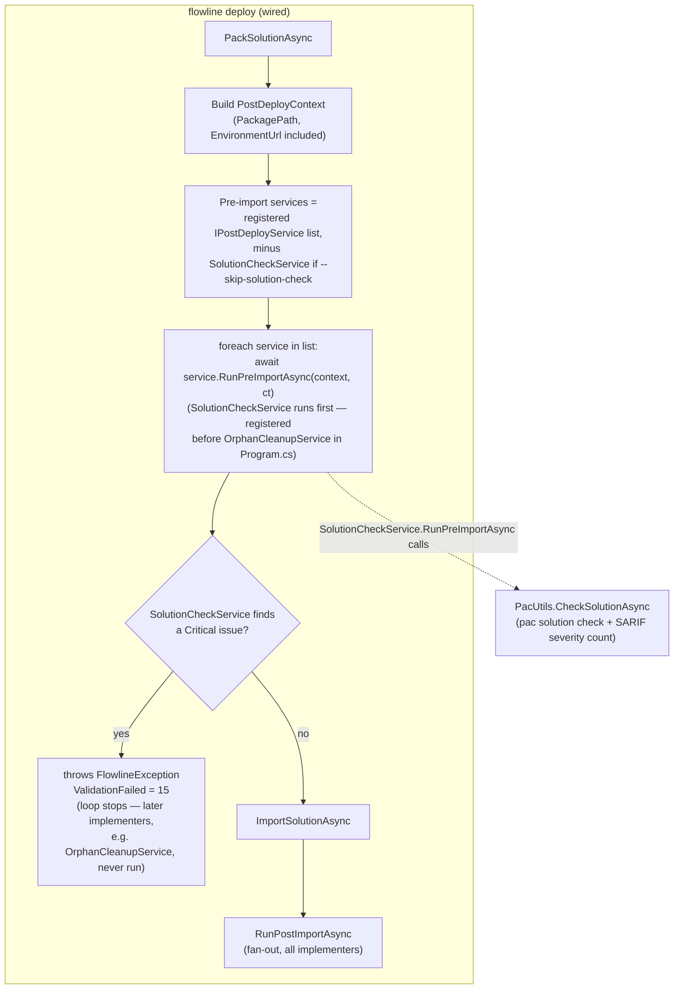

# Solution Checker Gate for `flowline deploy` - Plan

## Goal Capsule

- **Objective:** Implement a `SolutionCheckService` wrapping `pac solution check` as a new `IPostDeployService` implementer — using the protocol's existing two hooks, no interface change — and wire it into `flowline deploy` as a default-on gate that runs before any destructive pre-import work.
- **Product authority:** Idea 5 ("Solution Checker Gate") in `docs/ideation/2026-07-02-alm-accelerator-migration-targeting-ideation.html`.
- **Aligned with:** `docs/plans/2026-07-02-001-refactor-post-deploy-service-protocol-plan.md` — this plan is a new `IPostDeployService` implementer, following that plan's fan-out/shared-context/testable-static-helper conventions, without extending the interface itself.
- **Stop conditions:** Stop and ask if the exact SARIF field carrying Power Apps Checker's severity string turns out not to exist where assumed (see Dependencies / Assumptions) — that changes the parsing approach, not just an implementation detail.
- **Execution profile:** Standard. Three implementation units: one context extension, one low-level `pac solution check` helper, one new service wired into deploy.
- **Not building:** A standalone `flowline check [path]` command. `pac solution check --path <zip>` already works directly against any local zip — confirmed against the CLI reference during planning — so users who want to check an arbitrary zip outside of `flowline deploy` can call `pac` directly; Flowline doesn't need to wrap that mode. Confirmed with the user.
- **Confirmed scope decisions:**
  - `flowline deploy` runs the check by default, with `--skip-solution-check` as an opt-out (mirrors the existing `--skip-dtap-check` escape hatch; named after the specific gate it skips, not a generic "check").
  - Only `Critical`-severity findings fail the gate (mirrors Microsoft's own Managed-Environment enforcement, where only Critical violations block import); High/Medium/Low/Informational are reported but non-blocking.
  - No third `IPostDeployService` hook. `Pack` already moves ahead of the pre-import fan-out (so no destructive Dataverse mutation happens before the artifact is checked); `SolutionCheckService` reuses the existing `RunPreImportAsync` hook, which by construction now runs after packing and before import. It aborts by throwing `FlowlineException(ExitCode.ValidationFailed)` directly rather than returning a count to aggregate.
  - **Ordering between `SolutionCheckService` and `OrphanCleanupService`'s destructive pre-import deletions (which now share the same hook) is handled purely via DI registration order** — `SolutionCheckService` is registered before `OrphanCleanupService` in `Program.cs`, consistent with the existing "registration order determines execution order" convention from the prior plan. Confirmed with the user: no extra ordering logic in `DeployCommand` — the developer maintaining `Program.cs`'s registration order is trusted to keep it correct.

---

## Product Contract

### Summary

`pac solution check` uploads a solution zip to the Power Apps Checker service and returns a SARIF-format report of best-practice violations. This plan wires it into `flowline deploy` as a gate that runs immediately after packing and before any pre-import Dataverse work (including orphan cleanup's deletions) or the import itself, so a solution with Critical violations never mutates or reaches the target environment. Checking an arbitrary local zip outside of `flowline deploy` is left to `pac solution check` directly — the CLI already supports that (`--path` accepts any zip on disk), so Flowline doesn't need a wrapper command for it.

### Problem Frame

`DeployCommand` today calls `PackSolutionAsync` *after* the `RunPreImportAsync` fan-out (`OrphanCleanupService`'s pre-import phase already deletes orphan components from the target before the artifact is even packed) — `docs/solutions/architecture-patterns/orphan-cleanup-two-phase-deploy-pipeline.md` documents this order as `RunPreImport → Pack → Import`. A solution-check gate needs the packed artifact to exist and needs to prevent import (and, ideally, any earlier destructive Dataverse action) on a Critical finding. That requires `Pack` to move ahead of the pre-import fan-out.

`IPostDeployService`'s two existing hooks (`RunPreImportAsync`, `RunPostImportAsync`) already cover "before import" and "after import." Once `Pack` moves ahead of the fan-out, `RunPreImportAsync` already satisfies "runs after pack, before import" for every implementer — a third hook is unnecessary. `SolutionCheckService`'s validation and `OrphanCleanupService`'s destructive deletions now share that one hook; their relative order is governed by DI registration order in `Program.cs` (`SolutionCheckService` registered first), the same mechanism the prior plan's fan-out design already establishes as how execution order is controlled.

Separately, ALM Accelerator's PR-build solution-checker gate was one of its most-cited features (per the ideation doc), and its absence in Flowline is a concrete gap for migrants moving off Azure Pipelines YAML.

### Key Decisions

- **No third hook — reuse `RunPreImportAsync`.** Since `Pack` now runs before the entire pre-import fan-out, `RunPreImportAsync` already means "runs after pack, before import" for every implementer. `SolutionCheckService` implements it directly; `RunPostImportAsync` is a no-op. `IPostDeployService` itself is unchanged. See KTD1.
- **Abort by throwing, not by returning a count.** `RunPreImportAsync` returns `Task`, not `Task<int>` — there's nothing to aggregate. `SolutionCheckService.RunPreImportAsync` throws `FlowlineException(ExitCode.ValidationFailed, ...)` directly when a Critical finding exists, which propagates up through `DeployCommand` and out to `Program.cs`'s global exception handler (same mechanism `ValidateDtapGateAsync` already uses to abort deploy). See KTD1.
- **Ordering is DI registration order, not special-cased in `DeployCommand`.** `SolutionCheckService` is registered before `OrphanCleanupService` in `Program.cs`; the pre-import fan-out in `DeployCommand` stays a plain generic loop over whatever `IPostDeployService` implementers are registered, in registration order — matching the prior plan's established convention (`docs/solutions/architecture-patterns/post-deploy-service-di-fanout-protocol.md`) rather than introducing a new, more defensive mechanism. Confirmed with the user. See KTD3.
- **`PostDeployContext` gains `PackagePath` and `EnvironmentUrl`, both available at construction.** Because `Pack` now runs before `PostDeployContext` is built at all (not mid-pipeline as before), both new fields are known up front — no awkward "context built before the artifact exists" split. `PackagePath` is what `SolutionCheckService` checks; `EnvironmentUrl` is the raw target URL string, needed because `context.Service` is an already-connected SDK client, not usable as `pac`'s `--environment` argument for a new subprocess call. See KTD2.
- **`--skip-solution-check` excludes `SolutionCheckService` from the pre-import fan-out entirely.** Named after the specific gate it skips (mirroring `--skip-dtap-check`'s specificity) rather than a generic `--skip-check`, since more gates could exist later. Every other implementer's `RunPreImportAsync` (e.g. orphan cleanup) still runs normally. See KTD4.
- **Critical-only severity gate.** Matches Microsoft's own Managed-Environment enforcement behavior (Critical blocks import; High/Medium/Low/Informational don't). Confirmed with the user; keeps the MVP boring and defers configurability per the ideation doc's rejected idea #12.
- **`pac solution check` invocation lives in `PacUtils`, matching every other pac wrapper.** `PacUtils.CheckSolutionAsync` follows the same placement and `Cli.Wrap`/`SubprocessCapture` shape as `PackSolutionAsync` and the other `PacUtils` methods, regardless of having a single caller (`SolutionCheckService`). See KTD5.

### Requirements

**Shared context**

- R1. `PostDeployContext` gains two fields: `PackagePath` (string) and `EnvironmentUrl` (string). `IPostDeployService` itself is unchanged — still exactly the two existing hooks.

**Pipeline reorder**

- R2. `DeployCommand` runs `PackSolutionAsync` immediately after the Dataverse connection is established and before any `IPostDeployService` implementer's `RunPreImportAsync` runs. `PostDeployContext` is built once, after packing, already carrying `PackagePath` and `EnvironmentUrl`.

**Solution-check implementer**

- R3. A new `SolutionCheckService` implements `IPostDeployService`: `RunPreImportAsync` runs `pac solution check` against `context.PackagePath` and throws `FlowlineException(ExitCode.ValidationFailed)` if any Critical-severity finding exists; `RunPostImportAsync` is a no-op returning `0`.
- R4. DI registers `SolutionCheckService` **before** `OrphanCleanupService` in `Program.cs` — per the established "registration order determines execution order" convention, this makes the check's `RunPreImportAsync` run before orphan cleanup's deletions within the shared pre-import fan-out, with no additional ordering logic in `DeployCommand`.
- R5. `DeployCommand` gains a `--skip-solution-check` flag (default off) that excludes `SolutionCheckService` from the pre-import fan-out — every other implementer's `RunPreImportAsync` still runs.

### Scope Boundaries

- A standalone `flowline check [path]` command — not built. `pac solution check --path <zip>` already works directly against any local zip; users who want that outside `flowline deploy` can call `pac` themselves. Confirmed with the user.
- Configurable severity thresholds, rule-level overrides, or a false-positive suppression list — deferred; rejected idea #12 in the ideation doc explicitly defers this until the basic gate ships.
- `flowline ci init --github`/`--ado` YAML generation (idea #4) — separate idea, not implemented here.
- `--saveResults` (persisting results to the target environment's Solution Health Hub) — not wired in this MVP; a straightforward follow-up flag if wanted later.
- Any change to `PackSolutionAsync`/`ImportSolutionAsync` themselves, or to `OrphanCleanupService`'s own logic — out of scope. `OrphanCleanupService` requires zero source changes in this plan; only its position in `DeployCommand`'s pipeline (relative to `Pack`) and its position in DI registration order shift.
- A defensive/structural guarantee that `SolutionCheckService` always runs before `OrphanCleanupService` regardless of registration order — explicitly rejected by the user in favor of trusting `Program.cs`'s registration order, consistent with how the prior plan's fan-out design already works.
- Git-tag approval gate (idea #6), per-env deployment settings (idea #1), migration guide (idea #2), env-diff command (idea #3), flow ownership (idea #7) — separate ideas from the same ideation doc, not implemented here.
- Refreshing `docs/solutions/architecture-patterns/orphan-cleanup-two-phase-deploy-pipeline.md`'s documented pipeline order to reflect the reorder in this plan — real follow-up work, but a documentation update rather than an implementation unit; leave for a post-implementation compounding pass.

### Dependencies / Assumptions

- Assumes the PAC CLI version Flowline already depends on supports `pac solution check --path --outputDirectory --environment` as documented (https://learn.microsoft.com/en-us/power-platform/developer/cli/reference/solution#pac-solution-check). No version gate exists today in `PacUtils`; if the installed PAC CLI predates this subcommand, the failure will surface as a normal non-zero pac exit code, not a Flowline-specific check.
- Assumes `pac solution check`'s own process exit code reflects execution success/failure (auth, network, service errors) and does **not** reflect content-level violations — content-level pass/fail must come from parsing the SARIF report, mirroring how the Azure DevOps/GitHub Power Platform Checker tasks work (they surface a SARIF file for external interpretation rather than failing the task on findings). This is inferred from precedent, not confirmed against `pac`'s own wrapper — flagged for confirmation during implementation (see Stop condition above).
- Assumes each SARIF result's Power Apps Checker severity (`Critical`/`High`/`Medium`/`Low`/`Informational`) is available somewhere in the emitted JSON per result — the exact property path (SARIF's native `level` only has four values: none/note/warning/error, fewer than the checker's five severities) is an implementation-time detail to confirm against a real report, not resolved here.
- Assumes `--outputDirectory` produces one or more readable JSON/SARIF files directly in that directory (rather than, say, a zip requiring an extra unzip step) — to be confirmed against real `pac solution check` output during implementation.
- No other call site constructs `PostDeployContext` besides `DeployCommand` — confirmed via the prior plan's equivalent check and unchanged since; adding `PackagePath`/`EnvironmentUrl` only requires updating that one construction site plus test fixtures that build `PostDeployContext` directly.
- Relies on `Program.cs`'s DI registration order being maintained correctly (`SolutionCheckService` before `OrphanCleanupService`) for the "validate before mutate" property to hold — an explicit, accepted trade-off (see Scope Boundaries) rather than an oversight.

### Success Criteria

- `dotnet build` succeeds with the extended context and the new service.
- `OrphanCleanupServiceTests`, `DeployCommandDtapGateTests`, and `DeployCommandPostDeployTests` continue passing with only fixture-level `PostDeployContext` changes, no behavior changes and no source changes to `OrphanCleanupService` itself.
- A unit test proves the SARIF severity-counting logic against fixture reports (a Critical finding, a clean report, multiple report files).
- Manual verification: `flowline deploy <env>` runs the check by default (before any orphan-cleanup deletion), blocks on a Critical finding if one exists, and `--skip-solution-check` bypasses it entirely.

### Sources / Research

- `docs/ideation/2026-07-02-alm-accelerator-migration-targeting-ideation.html` (idea 5) — origin of the Solution Checker Gate proposal, including the rejected idea #12 that defers configurable severity thresholds.
- `docs/plans/2026-07-02-001-refactor-post-deploy-service-protocol-plan.md` — the `IPostDeployService` protocol this plan implements against, unchanged; establishes the fan-out/shared-context/testable-static-helper conventions followed here.
- `src/Flowline.Core/Services/IPostDeployService.cs:1-16` — current two-hook interface and `PostDeployContext` shape (only the record gains fields; the interface itself is untouched by this plan).
- `src/Flowline.Core/Services/OrphanCleanupService.cs:35,130` — existing `RunPreImportAsync`/`RunPostImportAsync` implementation; requires no source changes, only a shift in when `DeployCommand` calls it relative to `Pack`, and its position in DI registration order.
- `src/Flowline/Commands/DeployCommand.cs:58-74,216-244` — the pre-import/pack/import call sites being reordered, and the existing `--skip-dtap-check` flag pattern (lines 32-35, 152-156) the new `--skip-solution-check` mirrors.
- `src/Flowline/Utils/PacUtils.cs:175-211` — existing `PackSolutionAsync` helper and its `Cli.Wrap`/`SubprocessCapture` conventions, the pattern `CheckSolutionAsync` follows.
- `src/Flowline.Core/ExitCode.cs:42` — `ValidationFailed = 15`, the stable CI exit code the deploy gate returns on a Critical finding.
- `docs/solutions/architecture-patterns/post-deploy-service-di-fanout-protocol.md` — design rationale for the fan-out/shared-context pattern, including "registration order determines execution order," the exact mechanism this plan relies on (rather than overriding) to sequence the check before orphan cleanup.
- `src/Flowline/Program.cs:63` — existing `services.AddSingleton<IPostDeployService, OrphanCleanupService>();` registration; the new `SolutionCheckService` registration must be added **before** this line.
- Microsoft Learn, `pac solution` CLI reference (`pac solution check` section) — confirms `--path` accepts any local zip (not tied to a Dataverse export), `--environment` is optional (defaults to the active auth profile), and lists all available flags (`--geo`, `--outputDirectory`, `--ruleSet`, `--ruleLevelOverride`, `--excludedFiles`, `--saveResults`, `--clearCache`).
- Microsoft Learn, "Use the Power Apps checker web API" (report format) — confirms the report is one or more SARIF v2 (OASIS) JSON files; exact severity field path not given at the CLI-wrapper level, hence the Dependencies/Assumptions flag above.
- Microsoft Learn, "Improve solution performance, stability and reliability" (best practice rules table) — confirms Critical/High/Medium/Low/Informational as the five severities used by the ruleset this command runs by default ("Solution Checker").

---

## Planning Contract

### Key Technical Decisions

- **KTD1 — Reuse `RunPreImportAsync`; abort by throwing.** `SolutionCheckService` implements the existing `RunPreImportAsync(PostDeployContext context, CancellationToken ct)` — no interface change. Since it returns `Task`, there's no aggregated count to sum the way `RunPostImportAsync` does; instead, `SolutionCheckService.RunPreImportAsync` throws `FlowlineException(ExitCode.ValidationFailed, ...)` directly on a Critical finding, propagating up through `DeployCommand` to `Program.cs`'s existing global exception handler — the same abort mechanism `ValidateDtapGateAsync` already uses. `RunPostImportAsync` is a no-op returning `0`.
- **KTD2 — `PostDeployContext` gains `PackagePath` and `EnvironmentUrl`, appended last.** Both appended as new positional fields at the end of the record to minimize the diff at the one existing construction site. Both are known before `PostDeployContext` is constructed at all now, since `Pack` moves ahead of the entire pre-import fan-out (R2) — there's no longer a scenario where context must be built before the artifact exists.
- **KTD3 — DI registration order, not special-cased sequencing in `DeployCommand`.** `OrphanCleanupService`'s pre-import deletions and `SolutionCheckService`'s check now share the same `RunPreImportAsync` hook. Their relative order is controlled entirely by DI registration order in `Program.cs` — `SolutionCheckService` registered before `OrphanCleanupService` — with `DeployCommand`'s pre-import fan-out staying a plain generic loop (filtered only by `--skip-solution-check`, see KTD4):
  ```
  var preImportServices = settings.SkipSolutionCheck
      ? postDeployServices.Where(s => s is not SolutionCheckService)
      : postDeployServices;

  foreach (var service in preImportServices)
      await service.RunPreImportAsync(context, ct);   // SolutionCheckService first (by registration order); may throw
  ```
  This matches the prior plan's established "registration order determines execution order" convention (`docs/solutions/architecture-patterns/post-deploy-service-di-fanout-protocol.md`) rather than adding a more defensive, type-aware sequencing mechanism. Confirmed with the user: the developer maintaining `Program.cs`'s registration order is trusted to keep `SolutionCheckService` ahead of `OrphanCleanupService`. The `RunPostImportAsync` fan-out is unaffected and remains fully generic — order doesn't matter there.
- **KTD4 — `--skip-solution-check` excludes one implementer from the fan-out, not a per-implementer context flag.** Consistent with the existing rule that per-capability CLI toggles don't belong on `PostDeployContext` (`docs/solutions/architecture-patterns/post-deploy-service-di-fanout-protocol.md`). `DeployCommand` filters `SolutionCheckService` out of the collection it iterates for `RunPreImportAsync` when the flag is set (new `Settings` flag, default `false`, same shape as `--skip-dtap-check`); named after the specific gate it skips rather than a generic `--skip-check`, since Flowline may gain other deploy-time gates later. Every other implementer's `RunPreImportAsync` — orphan cleanup included — still runs regardless of the flag.
- **KTD5 — `pac solution check` invocation as a `PacUtils` method.** `PacUtils.CheckSolutionAsync(string zipPath, string? environmentUrl, string outputDirectory, SubprocessCapture capture, CancellationToken ct)` returns a `SolutionCheckResult(int CriticalCount, int TotalCount, string OutputDirectory)`. Lives in `src/Flowline/Utils/PacUtils.cs` alongside the existing `PackSolutionAsync`, following the same `Cli.Wrap`/`SubprocessCapture` shape — kept as a `PacUtils` method rather than inlined into `SolutionCheckService`, consistent with every other pac invocation in the codebase living there regardless of caller count. `SolutionCheckService.RunPreImportAsync` is its only caller, sourcing `zipPath`/`environmentUrl` from `context.PackagePath`/`context.EnvironmentUrl`.
- **KTD6 — `SolutionCheckService` lives in `src/Flowline/Services/`, not `Flowline.Core/Services/`.** `Flowline.Core` has no `CliWrap` package reference (confirmed: `src/Flowline.Core/Flowline.Core.csproj` — Dataverse SDK, Spectre.Console, no process-execution dependency), so a service that shells out to `pac` cannot live there. Existing precedent for cross-project implementers: `src/Flowline/Services/` already holds `ProfileResolutionService`, `SecretResolver`, etc.
- **KTD7 — Severity-counting is a pure, testable static function; pac execution failure is never silently a clean pass.** `PacUtils.CheckSolutionAsync` checks `pac`'s own exit code first: non-zero throws `FlowlineException(ExitCode.ConnectionFailed, ...)` — the same single exit code `GetSolutionVersionAsync` maps any pac failure to (`src/Flowline/Utils/PacUtils.cs:312-313`) — because a checker-unreachable outcome must never look identical to "analysis ran and found nothing," or the default-on deploy gate would pass every time the checker service is down. Only on a zero exit code does it parse the report via an `internal static` pure function (mirroring `PacUtils.ParseVersionFromPacOutput`, `src/Flowline/Utils/PacUtils.cs:287`) that reads the JSON/SARIF file(s) and counts by severity. A parse failure *after a successful pac run* (malformed/missing report content) logs a warning and returns zero counts rather than throwing — narrower than the execution-failure case, acceptable because pac already confirmed the analysis executed.
- **KTD8 — Deploy gate defaults on, `--skip-solution-check` opts out.** Confirmed with the user; matches the existing `--skip-dtap-check` precedent rather than introducing an inconsistent opt-in flag for one gate and opt-out for another.

### High-Level Technical Design



The pipeline order documented in `docs/solutions/architecture-patterns/orphan-cleanup-two-phase-deploy-pipeline.md` (`... → ConnectDataverse → RunPreImport → Pack → Import → RunPostImport`) changes to `... → ConnectDataverse → Pack → RunPreImport (fan-out, SolutionCheckService first by registration order) → Import → RunPostImport` — `Pack` moves ahead of the pre-import fan-out, and registration order (not new `DeployCommand` logic) keeps the check ahead of orphan cleanup's deletions. That doc's "Update" note describing the current order will need a follow-up refresh after this lands; not done as part of this plan (see Scope Boundaries).

---

## Implementation Units

### U1. Extend `PostDeployContext` with `PackagePath` and `EnvironmentUrl`

- **Goal:** Add the two new fields the check needs, with no interface method change and no source change to any existing implementer.
- **Requirements:** R1.
- **Dependencies:** None.
- **Files:**
  - `src/Flowline.Core/Services/IPostDeployService.cs` (modify: `PostDeployContext` record only)
  - `tests/Flowline.Core.Tests/OrphanCleanupServiceTests.cs` (modify: any direct `PostDeployContext` construction needs the two new positional arguments)
- **Approach:** Append `string PackagePath` and `string EnvironmentUrl` as the last two positional parameters on the `PostDeployContext` record (per KTD2).
- **Patterns to follow:** The existing `sealed record` shape already in this file.
- **Test scenarios:** Test expectation: none — pure type change; exercised indirectly through U3's tests. Happy path: every existing `OrphanCleanupServiceTests` test continues to pass with only fixture-level construction updates, no assertion changes.
- **Verification:** `dotnet build` succeeds standalone (no existing implementer needs source changes — this unit alone keeps the solution green, unlike an interface-method addition would); `dotnet test tests/Flowline.Core.Tests/OrphanCleanupServiceTests.cs` passes unchanged in behavior.

### U2. `PacUtils.CheckSolutionAsync` helper

- **Goal:** A low-level helper that runs `pac solution check` and returns a Critical/Total severity count, called by `SolutionCheckService` (U3).
- **Requirements:** R3 (the invocation this helper implements).
- **Dependencies:** None (can land independently; only needs to exist before U3).
- **Files:**
  - `src/Flowline/Utils/PacUtils.cs` (modify: add `CheckSolutionAsync` and a `SolutionCheckResult` record)
  - `tests/Flowline.Tests/PacUtilsCheckSolutionTests.cs` (new)
- **Approach:** `public static async Task<SolutionCheckResult> CheckSolutionAsync(string zipPath, string? environmentUrl, string outputDirectory, SubprocessCapture capture, CancellationToken ct)` shells out to `pac solution check --path <zipPath> --outputDirectory <outputDirectory> [--environment <environmentUrl>]` following the exact `Cli.Wrap`/`GetBestPacCommandAsync`/`SubprocessCapture` shape already used by `PackSolutionAsync` (`src/Flowline/Utils/PacUtils.cs:175-211`). Per KTD7: check `pac`'s own exit code first — non-zero throws `FlowlineException(ExitCode.ConnectionFailed, ...)` rather than returning zero counts. Only on a zero exit code does it parse the report via an `internal static` pure function that reads the JSON/SARIF file(s) in `outputDirectory`, returning `SolutionCheckResult(int CriticalCount, int TotalCount, string OutputDirectory)`. A parse failure *after a successful pac run* logs a warning and returns zero counts rather than throwing.
- **Patterns to follow:** `PacUtils.ParseVersionFromPacOutput` (`src/Flowline/Utils/PacUtils.cs:287`) for the "shell out, then parse with an isolated testable static function" split; `PacUtils.PackSolutionAsync` for the `Cli.Wrap` invocation shape; `PacUtilsTests.cs` for how subprocess-adjacent `PacUtils` methods are tested without invoking a real process.
- **Technical design:** Directional shape of the parsing function only (not implementation-ready code):
  ```
  internal static (int Critical, int Total) CountSeverities(IEnumerable<string> reportFilePaths)
      // for each file: parse JSON, walk runs[].results[], read each result's severity
      // (exact property path — result.properties.severity vs. level mapping — confirmed against
      // a real report during implementation per the Dependencies/Assumptions flag)
      // tally Critical vs. total; malformed file → warn, skip, don't throw
  ```
- **Test scenarios:**
  - Happy path: fixture report with one Critical + two Medium results → `CriticalCount == 1`, `TotalCount == 3`.
  - Edge case: fixture report with zero results (pac ran successfully, solution is clean) → `CriticalCount == 0`, `TotalCount == 0`.
  - Edge case: multiple report files in the output directory (the checker service may emit one per analyzed source) → counts aggregate across all files.
  - Error path — pac execution failure: pac exits non-zero (simulated via the same test-seam pattern as `PacUtils.CheckCommandExistsFunc`/`PacUtilsTests.cs`) → `FlowlineException(ExitCode.ConnectionFailed, ...)` is thrown, **not** a zero-count success — this is the scenario that would otherwise let a default-on deploy gate silently pass when the checker service is unreachable.
  - Error path — successful pac run, unreadable report: output directory missing, empty, or containing malformed JSON *after a zero pac exit code* → returns zero counts, does not throw, logs a warning (confirm the warning is observable, not swallowed silently).
- **Verification:** `dotnet test tests/Flowline.Tests/PacUtilsCheckSolutionTests.cs` passes for all fixture scenarios above, including the pac-execution-failure case throwing rather than passing silently.

### U3. `SolutionCheckService` and `DeployCommand` wiring

- **Goal:** A new `IPostDeployService` implementer runs the check via `RunPreImportAsync`; DI registration order (not special-cased `DeployCommand` logic) puts it ahead of `OrphanCleanupService`; `--skip-solution-check` excludes it entirely.
- **Requirements:** R2, R3, R4, R5.
- **Dependencies:** U1, U2.
- **Files:**
  - `src/Flowline/Services/SolutionCheckService.cs` (new)
  - `src/Flowline/Commands/DeployCommand.cs` (modify)
  - `src/Flowline/Program.cs` (modify: DI registration, `SolutionCheckService` registered before `OrphanCleanupService`)
  - `tests/Flowline.Tests/DeployCommandPostDeployTests.cs` (modify: add a test for `SolutionCheckService`'s static abort-decision helper, per KTD1)
- **Approach:** `SolutionCheckService : IPostDeployService` — `RunPreImportAsync` calls `PacUtils.CheckSolutionAsync(context.PackagePath, context.EnvironmentUrl, <output dir>, capture, ct)`; if the result's `CriticalCount > 0`, throws `FlowlineException(ExitCode.ValidationFailed, ...)` referencing the report location (per KTD1). `RunPostImportAsync` is a no-op returning `0`. Extract the gate decision as `internal static bool ShouldAbort(int criticalCount) => criticalCount > 0;` on `SolutionCheckService` itself, mirroring the established testable-static-helper convention (`ResolveDtapGate`, `ShouldReportPartialSuccess`) even though the throw itself happens inline. `DeployCommand` reorders (per R2): `PackSolutionAsync` now runs immediately after the Dataverse connection, and `PostDeployContext` is built once, right after, including `PackagePath`/`EnvironmentUrl`. Per KTD3/KTD4, the pre-import loop stays a plain generic `foreach` over the registered `IPostDeployService` collection, filtered to exclude `SolutionCheckService` only when `--skip-solution-check` (new `Settings` flag, default `false`, same shape as `--skip-dtap-check`) is set — no explicit "call this one first" logic; ordering comes entirely from `Program.cs` registering `SolutionCheckService` before `OrphanCleanupService`. `ImportSolutionAsync` and the `RunPostImportAsync` fan-out (fully generic, all implementers) are otherwise unchanged.
- **Patterns to follow:** `DeployCommand`'s existing `--skip-dtap-check` flag and `ValidateDtapGateAsync` throw-to-abort shape; `ResolveDtapGate`/`ShouldReportPartialSuccess` for the testable-static-helper convention; `Program.cs:58-63`'s existing registration block for where/how to add the new line, ahead of `OrphanCleanupService`'s.
- **Test scenarios:**
  - Unit (via the new static helper): `SolutionCheckService.ShouldAbort(0)` is `false`; `ShouldAbort(1)` is `true`.
  - Test expectation: the pre-import fan-out's reliance on DI registration order, the reordered pipeline, and `--skip-solution-check`'s effect all have no existing unit-test harness — `DeployCommand`'s constructor requires live `DataverseConnector`/PAC CLI dependencies with no test doubles today. Verify via a manual `flowline deploy` run during implementation: once against a solution with no Critical findings (deploy proceeds, orphan cleanup still runs, in the new post-check order); once with `--skip-solution-check` (check doesn't run at all, orphan cleanup and deploy proceed regardless); and — if a fixture solution with a known Critical finding is available — once confirming the abort, the `ValidationFailed` exit code, **and that no orphan components were deleted from the target** (the specific gap this registration order closes).
- **Verification:** `dotnet build` succeeds; `dotnet test tests/Flowline.Tests/DeployCommandPostDeployTests.cs` passes including the new `ShouldAbort` cases; a manual deploy run confirms default-on gating, the registration-order sequencing, and the `--skip-solution-check` bypass.

---

## Verification Contract

| Command | Applies to | Done signal |
|---|---|---|
| `dotnet build` | All units | Solution builds with no errors or new warnings |
| `dotnet test tests/Flowline.Core.Tests/OrphanCleanupServiceTests.cs` | U1 | All existing tests pass with fixture-only changes, no source changes to `OrphanCleanupService` |
| `dotnet test tests/Flowline.Tests/PacUtilsCheckSolutionTests.cs` | U2 | All SARIF-parsing fixture scenarios pass, including the pac-execution-failure case |
| `dotnet test tests/Flowline.Tests/DeployCommandPostDeployTests.cs` | U3 | Existing test passes; new `ShouldAbort` cases pass |
| Manual `flowline deploy <test-env>` run (default, then `--skip-solution-check`) | U3 | Check runs before any pre-import Dataverse mutation and blocks on a Critical finding if one exists; `--skip-solution-check` bypasses only the check |

No behavioral-skill evaluation or `release:validate` applies — this adds a new deploy-time gate, not a change to documented CLI-surface contracts beyond the additive `--skip-solution-check` flag (covered by U3's file list).

## Definition of Done

- All three implementation units complete and verified per the Verification Contract.
- `IPostDeployService` is unchanged (still two hooks); `SolutionCheckService` implements both, with `RunPreImportAsync` performing the check.
- `Program.cs` registers `SolutionCheckService` before `OrphanCleanupService`.
- `flowline deploy` runs the solution-check gate by default, before any other implementer's pre-import hook, and aborts with `ExitCode.ValidationFailed` (15) before any destructive pre-import action or import when a Critical finding exists; `--skip-solution-check` bypasses only the check.
- No dead code: no leftover stubs, no unused parameters.
- Manual verification against a real Dataverse environment and PAC CLI auth session for `flowline deploy` (default and `--skip-solution-check` paths), including confirming no orphan deletions occur when the check aborts.
