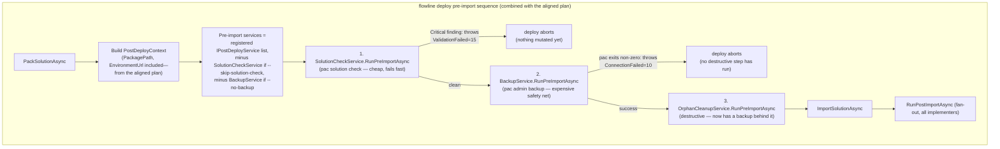

# Pre-Deploy Environment Backup - Plan

## Goal Capsule

- **Objective:** Implement a `BackupService` wrapping `pac admin backup` as a new `IPostDeployService` implementer — reusing the protocol's existing `RunPreImportAsync` hook, no interface change — so `flowline deploy` takes a manual environment backup before any pre-import Dataverse mutation, with a `--no-backup` opt-out.
- **Product authority:** `STRATEGY.md` milestone (2026-06-28, pre-v1.0): `` `deploy` pre-backup + `--no-backup` opt-out (could-have) ``. Mechanism named explicitly by the user: `pac admin backup` (https://learn.microsoft.com/en-us/power-platform/developer/cli/reference/admin#pac-admin-backup). Earlier precedent in `docs/ideation/2026-05-01-concept-ideas.md:181-189` (a speculative `flowline release` command tied backup specifically to PROD) — superseded here per the user's explicit decision below to apply it to every deploy target.
- **Aligned with:** `docs/plans/2026-07-03-001-feat-solution-checker-gate-plan.md` — same architecture pattern (new `IPostDeployService` implementer reusing `RunPreImportAsync`, no third hook, DI-registration-order sequencing, per-implementer skip flag). **Real dependency, not just style alignment:** this plan's `BackupService` needs `PostDeployContext.EnvironmentUrl`, which that plan's U1 adds. See Dependencies / Assumptions.
- **Recommendation on "implement together":** Keep as two separate plans/PRs — they have different risk profiles (a cheap, fast, read-only static-analysis call vs. an expensive, admin-privileged, environment-wide mutation with its own retention-quota cost) and are independently valuable and reviewable. But sequence the work: land the checker-gate plan's U1 (`PostDeployContext.EnvironmentUrl`) first — it's small and low-risk — so this plan can consume the field directly instead of re-adding it. If implementing both in one sitting, the two U1s could even land as a single commit that adds `PackagePath` and `EnvironmentUrl` together; that's an implementation-time call, not required by either plan.
- **Stop conditions:** Stop and ask if `pac admin backup` turns out to require a fundamentally different auth context than Flowline's existing PAC CLI session (e.g., a separate elevated sign-in step) rather than surfacing insufficient permissions as an ordinary non-zero exit code — that would change the design from "just another pac invocation" to "a new auth flow," which is out of this plan's scope.
- **Execution profile:** Standard. Two implementation units, but touching a shared, high-traffic file (`DeployCommand.cs`) with real operational trade-offs (backup-retention consumption, unclear sync/async CLI behavior) worth documenting carefully even at this size.
- **Confirmed scope decisions:**
  - Backup runs for **every** `flowline deploy` target (test/uat/prod/arbitrary URL) by default, not just Prod — confirmed with the user, overriding the narrower PROD-only framing in the older ideation doc.
  - A backup failure **aborts the deploy** before any pre-import Dataverse mutation or import — confirmed with the user; a failed backup means there's no safety net, and proceeding anyway defeats the point of "pre-backup." `--no-backup` remains the deliberate opt-out.
  - No third `IPostDeployService` hook — `BackupService` reuses the existing `RunPreImportAsync` hook, exactly like `SolutionCheckService` in the aligned plan.

---

## Product Contract

### Summary

Before any deploy proceeds to pre-import Dataverse work (orphan cleanup) or import, `flowline deploy` now takes a manual, on-demand backup of the target environment via `pac admin backup --environment <url> --label <label>`. This gives every deploy a rollback point without any external tooling. A `--no-backup` flag opts out for cases where this is too slow or unnecessary (e.g., a Dev-adjacent Test environment that's about to be reset anyway).

### Problem Frame

`flowline deploy` currently has no safety net before it mutates a target environment: orphan cleanup deletes components, and import overwrites customizations, with no built-in way to undo either if something goes wrong. `pac admin backup` already exists as a PAC CLI primitive for exactly this (confirmed via the CLI reference: `--environment`, required `--label`, and a companion `pac admin restore`/`pac admin list-backups` pair for recovering later — restore itself is out of scope here, see Scope Boundaries). `STRATEGY.md` already named this as a pre-v1.0 milestone; this plan implements it.

Two things make this different from the aligned solution-checker-gate plan, both handled deliberately:
1. **No result to parse.** `pac admin backup` either succeeds or fails — there's no SARIF-style report, no severity levels, nothing to count. The gate logic is a plain "did the command succeed."
2. **A different cost profile.** Backup is environment-wide (not solution-scoped), likely requires elevated (System Administrator / environment admin) permissions, and consumes the same backup-retention budget as Dataverse's own automatic nightly backups. Running it by default on every deploy (per the confirmed scope decision) is a real, accepted trade-off, not a free win — see Dependencies / Assumptions and Scope Boundaries.

### Key Decisions

- **No third hook — reuse `RunPreImportAsync`.** `BackupService` implements the interface's existing pre-import hook, exactly like `SolutionCheckService` in the aligned plan. `RunPostImportAsync` is a no-op. `IPostDeployService` itself is unchanged.
- **Abort by throwing, not by returning a count.** `RunPreImportAsync` returns `Task`. `BackupService.RunPreImportAsync` throws `FlowlineException(ExitCode.ConnectionFailed, ...)` directly if `pac admin backup` exits non-zero, propagating to `Program.cs`'s existing global exception handler — same abort mechanism `ValidateDtapGateAsync` and (per the aligned plan) `SolutionCheckService` already use.
- **Reuse `ExitCode.ConnectionFailed`, don't add a new code — but the exception message must not repeat that code's generic doc text verbatim.** A backup failure is an *execution* failure (pac couldn't complete the operation), not a *validation* finding, so `ConnectionFailed = 10` is the right code by the established convention (`GetSolutionVersionAsync`, and `SolutionCheckService`'s execution-failure handling in the aligned plan). But `ConnectionFailed`'s doc comment ("Dataverse environment unreachable. Check environment URL.") describes a *reachability* failure, while the single most likely real-world cause of a backup failure is an *authorization* failure — `pac admin backup` needs an elevated role (System Administrator / environment admin) that ordinary solution import/export doesn't, and a consultant with normal deploy access but not tenant-admin backup rights will hit this on a perfectly reachable environment. Sending that user to "check environment URL" is actively misleading. `BackupEnvironmentAsync`'s thrown message must include pac's actual stderr/stdout (which will name the real cause — e.g. insufficient privileges) rather than a generic reachability message, and should mention `--no-backup` as the immediate workaround. See U1's Approach for the concrete message shape.
- **Registration order: check, then backup, then orphan cleanup.** `Program.cs` registers `SolutionCheckService` first (cheap, fast-failing static analysis), `BackupService` second (expensive safety net — only worth running once the solution has already passed the cheap check), `OrphanCleanupService` third (destructive, now with a backup already in place). This is a recommendation grounded in cost ordering, not a re-litigation of the aligned plan's "registration order, not structural enforcement" decision — it simply extends that same convention to a third implementer.
- **Backup label is a pure, testable function.** `BuildBackupLabel(string solutionName, DateTime utcNow)` produces a deterministic, traceable label (e.g. `flowline-deploy-<solution>-<UTC timestamp>`) — no version number included, to avoid requiring a new `PostDeployContext` field just for labeling; solution name plus timestamp is enough to identify which deploy a backup belongs to.
- **Every deploy target, not just Prod.** Confirmed with the user, per the Goal Capsule.
- **Backup failure aborts deploy.** Confirmed with the user, per the Goal Capsule.

### Requirements

**Low-level helper**

- R1. `PacUtils` gains `BackupEnvironmentAsync(string environmentUrl, string label, SubprocessCapture capture, CancellationToken ct)`, which shells out to `pac admin backup --environment <environmentUrl> --label <label>` and throws `FlowlineException(ExitCode.ConnectionFailed, ...)` on any non-zero exit code, with a message that surfaces pac's actual stderr/stdout (the most likely cause is a missing elevated role, not an unreachable environment) and points at `--no-backup` as the workaround.
- R2. A pure `BuildBackupLabel(string solutionName, DateTime utcNow)` helper produces the backup label used by R1's caller.

**Backup implementer**

- R3. A new `BackupService` implements `IPostDeployService`: `RunPreImportAsync` calls `PacUtils.BackupEnvironmentAsync` using `context.EnvironmentUrl` and a label built from `context.SolutionName`; `RunPostImportAsync` is a no-op returning `0`.
- R4. Backup runs for every `flowline deploy` target by default (test/uat/prod/arbitrary URL) — not gated to Prod.
- R5. A backup failure aborts the deploy before any pre-import Dataverse mutation (e.g. orphan cleanup) or import.

**Deploy wiring**

- R6. `DeployCommand` gains a `--no-backup` flag (default off) that excludes `BackupService` from the pre-import fan-out — every other implementer's `RunPreImportAsync` still runs.
- R7. DI registers `BackupService` in `Program.cs`, positioned after `SolutionCheckService` and before `OrphanCleanupService`.

### Scope Boundaries

- `pac admin restore` / `pac admin list-backups` integration (a `flowline restore` command, or surfacing backup history) — not built; this plan only creates backups, it doesn't help recover from them. Real follow-up work once the backup habit exists.
- `pac admin set-backup-retention-period` (tenant-level retention configuration) — not touched; a separate admin concern, orthogonal to whether Flowline triggers a backup per deploy.
- Prod-only gating — explicitly rejected per the user's confirmed decision; backup applies to every deploy target.
- Solution-scoped backup (backing up only the target solution's customizations) — not possible via `pac admin backup`, which is environment-wide only; not attempted.
- Surfacing the created backup's ID/label anywhere persistent (e.g., writing it to a local file or Dataverse record) beyond console output — not built; if later work wants `flowline restore` or a backup-history report, that's the natural place to add this.

### Dependencies / Assumptions

- **Real dependency, not just alignment:** `BackupService` needs `PostDeployContext.EnvironmentUrl`. That field is added by `docs/plans/2026-07-03-001-feat-solution-checker-gate-plan.md`'s U1, not by this plan. If that plan's U1 hasn't landed when this plan is implemented, add `EnvironmentUrl` to `PostDeployContext` as part of this plan's U2 instead of duplicating it under a different name — check the record's current fields before writing new code.
- Assumes `pac admin backup`'s underlying permission requirement (likely System Administrator or an equivalent environment-admin role, distinct from what ordinary solution import/export needs) surfaces as a normal non-zero pac exit code when missing, not a distinct auth flow Flowline would need to handle specially. If this assumption is wrong, see the Stop condition in the Goal Capsule.
- **Confirmed: `pac admin backup` blocks until the backup is created, and this is expected to be fast.** Per Microsoft's "Back up and restore environments" doc: manual/on-demand backups don't perform a data copy at trigger time — "your on-demand backup is just a timestamp and a label" against Dataverse's continuously-running Azure SQL backup stream — and the admin-center flow confirms this synchronously ("you receive a confirmation message once the backup is successfully created... '\<backup name\> backup was successfully created'"). This is also why `pac admin backup` is the one `pac admin` subcommand in this family with no `--async`/`--max-async-wait-time` flags — unlike `pac admin copy`/`create`/`reset`/`restore`, which perform real data operations and need them. Net: the abort-on-failure design is sound — a non-zero exit means the label/timestamp was never registered, so no backup exists — and every-target-by-default doesn't meaningfully slow deploys, since the operation itself is just metadata registration, not a data copy. (Separately, the doc notes a fresh manual backup may take up to ~10 minutes before it's *restorable* — irrelevant to this plan, which only creates backups, never restores them.)
- Assumes a manual on-demand backup via `pac admin backup` consumes the same retention budget as Dataverse's automatic system backups (both count toward the environment's backup retention window, configurable 7–28 days via `pac admin set-backup-retention-period`). Teams deploying frequently to the same environment will create backups frequently; not resolved here beyond noting it — `--no-backup` is the accepted escape hatch for teams for whom this is too aggressive.
- Assumes no length or character restrictions on the `--label` value beyond ordinary shell-argument quoting — the CLI reference doesn't document any; confirm during implementation if labels containing certain characters (e.g., colons from an ISO timestamp) cause issues, and adjust `BuildBackupLabel`'s format if so.

### Success Criteria

- `dotnet build` succeeds with the new helper and the new service.
- A unit test proves `BuildBackupLabel`'s deterministic format and proves `BackupEnvironmentAsync` throws `FlowlineException(ExitCode.ConnectionFailed)` on a non-zero pac exit code.
- Manual verification: `flowline deploy <env>` creates a labeled backup before orphan cleanup runs, in every case (test/uat/prod), and `--no-backup` bypasses it entirely.

### Sources / Research

- `STRATEGY.md` (milestones section) — `` `deploy` pre-backup + `--no-backup` opt-out (could-have) ``, dated 2026-06-28, pre-v1.0 — the primary product authority for this plan.
- `docs/ideation/2026-05-01-concept-ideas.md:181-189` — earlier, more speculative `flowline release` concept that tied a "PROD customization backup snapshot" specifically to production releases; superseded here by the confirmed every-target decision, but the origin of the idea.
- `docs/plans/2026-07-03-001-feat-solution-checker-gate-plan.md` — the sibling plan this one aligns with: same `IPostDeployService`-reuse pattern, same DI-registration-order convention, and the source of the `PostDeployContext.EnvironmentUrl` field this plan depends on.
- `src/Flowline.Core/Services/IPostDeployService.cs:1-16` — current two-hook interface and `PostDeployContext` shape; unchanged by this plan (assuming the aligned plan's `EnvironmentUrl` field already landed).
- `src/Flowline/Utils/PacUtils.cs:213-225` (`GetEnvironmentsAsync`) — existing precedent for invoking a `pac admin` subcommand (`pac admin list --json`) from this codebase; `BackupEnvironmentAsync` follows the same `Cli.Wrap`/`SubprocessCapture` shape, though `pac admin backup` has no `--json` output to parse.
- `src/Flowline/Utils/PacUtils.cs:298-320` (`GetSolutionVersionAsync`) — the "map any pac failure to `ExitCode.ConnectionFailed`" convention this plan reuses rather than adding a new exit code.
- `src/Flowline.Core/ExitCode.cs:27` — `ConnectionFailed = 10`, reused here rather than adding a new code.
- Microsoft Learn, `pac admin` CLI reference (`pac admin backup`, `pac admin list-backups`, `pac admin restore`, `pac admin set-backup-retention-period` sections) — confirms `pac admin backup`'s required `--label` and optional `--environment` parameters, the absence of `--async`/`--json` support for this specific subcommand (unlike several sibling `admin` commands), and that retention is tenant/environment-configurable in 7/14/21/28-day increments.
- Microsoft Learn, "Back up and restore environments" (`learn.microsoft.com/power-platform/admin/backup-restore-environments`) — confirms manual/on-demand backups are a timestamp+label registered against Dataverse's continuously-running Azure SQL backup stream (not a triggered data copy), and that backup creation itself completes synchronously with a confirmation message — the basis for treating `pac admin backup`'s blocking, fast completion as confirmed rather than assumed.

---

## Planning Contract

### Key Technical Decisions

- **KTD1 — Reuse `RunPreImportAsync`; abort by throwing.** Same shape as the aligned plan's `SolutionCheckService`: `BackupService.RunPreImportAsync` throws `FlowlineException(ExitCode.ConnectionFailed, ...)` directly on failure; `RunPostImportAsync` is a no-op returning `0`. No interface change.
- **KTD2 — `PacUtils.BackupEnvironmentAsync` follows `GetEnvironmentsAsync`'s `pac admin` invocation shape, but exit-code-based, not JSON-based.** `pac admin backup` has no documented `--json` output (unlike `pac admin list`), so success/failure is determined purely by the process exit code — closer to `PackSolutionAsync`/`ImportSolutionAsync`'s `if (result.ExitCode != 0) throw ...` shape than to `GetEnvironmentsAsync`'s JSON-deserialize shape.
- **KTD3 — `BuildBackupLabel` as a pure, isolated function.** `internal static string BuildBackupLabel(string solutionName, DateTime utcNow)` — takes `DateTime` explicitly rather than calling `DateTime.UtcNow` internally, so it's directly unit-testable with a fixed timestamp, mirroring `PacUtils.ParseVersionFromPacOutput`'s "isolate the pure logic" convention from the aligned plan.
- **KTD4 — Registration order: `SolutionCheckService`, `BackupService`, `OrphanCleanupService`.** Cheapest/fastest-failing validation first, expensive-but-non-destructive safety net second, destructive cleanup last — so an expensive backup is never wasted on a solution that was going to fail the cheap check anyway, and the destructive step always has a fresh backup behind it. This extends (does not re-litigate) the aligned plan's "registration order determines execution order, not structural enforcement in `DeployCommand`" decision to a third implementer.
- **KTD5 — `--no-backup` filters the same fan-out list `--skip-solution-check` already filters.** `DeployCommand`'s pre-import loop excludes `BackupService` when `--no-backup` is set and/or `SolutionCheckService` when `--skip-solution-check` is set — two independent, composable flags filtering the same generic `foreach`, not two different mechanisms.
- **KTD6 — Reuse `ExitCode.ConnectionFailed`, no new exit code.** Per Key Decisions above; keeps `ExitCode` from growing for a single-use case and matches the established "any pac execution failure → `ConnectionFailed`" pattern.

### High-Level Technical Design

The pipeline order from the aligned plan (`... → ConnectDataverse → Pack → RunPreImport (fan-out) → Import → RunPostImport`) is unchanged in shape; this plan adds a second implementer into that same fan-out, positioned by DI registration order between the check and orphan cleanup.

---

## Implementation Units

### U1. `PacUtils.BackupEnvironmentAsync` and `BuildBackupLabel`

- **Goal:** A low-level helper that runs `pac admin backup` and a pure function that builds its label.
- **Requirements:** R1, R2.
- **Dependencies:** None.
- **Files:**
  - `src/Flowline/Utils/PacUtils.cs` (modify: add `BackupEnvironmentAsync` and `BuildBackupLabel`)
  - `tests/Flowline.Tests/PacUtilsBackupTests.cs` (new)
- **Approach:** `public static async Task BackupEnvironmentAsync(string environmentUrl, string label, SubprocessCapture capture, CancellationToken ct)` shells out to `pac admin backup --environment <environmentUrl> --label <label>` via the same `Cli.Wrap`/`GetBestPacCommandAsync`/`SubprocessCapture` shape as `PackSolutionAsync` (`src/Flowline/Utils/PacUtils.cs:175-211`); throws `FlowlineException(ExitCode.ConnectionFailed, ...)` if the result's exit code is non-zero, with a message of the shape `$"pac admin backup failed (likely a missing System Administrator / environment-admin role): {capture.StdErr/StdOut}. Use --no-backup to bypass."` — not a generic "check environment URL" message, since the dominant real failure here is authorization, not reachability (see Key Decisions). `internal static string BuildBackupLabel(string solutionName, DateTime utcNow)` returns a deterministic string (e.g. `$"flowline-deploy-{solutionName}-{utcNow:yyyyMMddTHHmmssZ}"`) with no external calls, fully unit-testable.
- **Patterns to follow:** `PacUtils.PackSolutionAsync`/`ImportSolutionAsync` for the `Cli.Wrap` + exit-code-check shape; `PacUtils.GetEnvironmentsAsync` (`src/Flowline/Utils/PacUtils.cs:213-225`) as the existing precedent for invoking a `pac admin` subcommand from this codebase; `PacUtils.ParseVersionFromPacOutput` for the "isolate pure logic into a directly testable static function" convention.
- **Test scenarios:**
  - Happy path: `BuildBackupLabel("ContosoCustomizations", <fixed DateTime>)` returns the expected deterministic string.
  - Edge case: a solution name containing characters that could be awkward in a shell argument or backup label (e.g. spaces) — confirm `BuildBackupLabel`'s output is still a safe, well-formed label (per the Dependencies/Assumptions flag on label constraints).
  - Error path: `pac admin backup` exits non-zero (simulated via the same test-seam pattern as `PacUtils.CheckCommandExistsFunc`/`PacUtilsTests.cs`) → `BackupEnvironmentAsync` throws `FlowlineException(ExitCode.ConnectionFailed, ...)` whose message includes the captured pac output and mentions `--no-backup` (not a generic reachability message).
  - Happy path (helper): `pac admin backup` exits zero → `BackupEnvironmentAsync` returns normally, no exception.
- **Verification:** `dotnet test tests/Flowline.Tests/PacUtilsBackupTests.cs` passes for all fixture scenarios above.

### U2. `BackupService` and `DeployCommand` wiring

- **Goal:** A new `IPostDeployService` implementer takes the backup via `RunPreImportAsync`; `DeployCommand` positions it between the solution check and orphan cleanup, with a `--no-backup` escape hatch.
- **Requirements:** R3, R4, R5, R6, R7.
- **Dependencies:** U1. Also depends on `PostDeployContext.EnvironmentUrl` existing — see Dependencies / Assumptions; add it here if the aligned plan's U1 hasn't landed yet.
- **Files:**
  - `src/Flowline/Services/BackupService.cs` (new)
  - `src/Flowline/Commands/DeployCommand.cs` (modify)
  - `src/Flowline/Program.cs` (modify: DI registration, positioned after `SolutionCheckService` and before `OrphanCleanupService`)
- **Approach:** `BackupService : IPostDeployService` — `RunPreImportAsync` calls `PacUtils.BackupEnvironmentAsync(context.EnvironmentUrl, PacUtils.BuildBackupLabel(context.SolutionName, DateTime.UtcNow), capture, ct)`; any thrown `FlowlineException` propagates unchanged. `RunPostImportAsync` is a no-op returning `0`. `DeployCommand` adds `--no-backup` (new `Settings` flag, default `false`, same shape as `--skip-solution-check`/`--skip-dtap-check`) and extends its pre-import fan-out filter (per KTD5) to also exclude `BackupService` when set. `Program.cs` registers `services.AddSingleton<IPostDeployService, BackupService>();` between the `SolutionCheckService` and `OrphanCleanupService` registrations (per KTD4).
- **Patterns to follow:** `DeployCommand`'s existing `--skip-dtap-check`/`--skip-solution-check` flags for the `Settings` shape; the aligned plan's `SolutionCheckService` for the overall implementer shape (no-op post-import, throw-to-abort pre-import).
- **Test scenarios:**
  - Test expectation: the fan-out sequencing (registration order) and `--no-backup`'s filtering effect have no existing unit-test harness — `DeployCommand`'s constructor requires live `DataverseConnector`/PAC CLI dependencies with no test doubles today. Verify via a manual `flowline deploy` run during implementation: once against a target where backup succeeds (deploy proceeds; a labeled backup now exists, confirmable via `pac admin list-backups`); once with `--no-backup` (no backup call at all, deploy proceeds); and once simulating a backup failure (e.g. a profile without sufficient permission) — confirming the abort, the `ConnectionFailed` exit code, and that no orphan-cleanup deletions ran.
- **Verification:** `dotnet build` succeeds; a manual deploy run confirms the backup runs after the solution check and before orphan cleanup, that `--no-backup` bypasses it, and that a simulated backup failure aborts before any destructive pre-import action.

---

## Verification Contract

| Command | Applies to | Done signal |
|---|---|---|
| `dotnet build` | All units | Solution builds with no errors or new warnings |
| `dotnet test tests/Flowline.Tests/PacUtilsBackupTests.cs` | U1 | All fixture scenarios pass, including the pac-execution-failure case |
| Manual `flowline deploy <test-env>` run (default, then `--no-backup`, then simulated backup failure) | U2 | Backup runs after the solution check and before orphan cleanup by default; `--no-backup` bypasses it; a backup failure aborts before any destructive pre-import action |

No behavioral-skill evaluation or `release:validate` applies — this adds a new deploy-time step, not a change to documented CLI-surface contracts beyond the additive `--no-backup` flag (covered by U2's file list).

## Definition of Done

- Both implementation units complete and verified per the Verification Contract.
- `IPostDeployService` is unchanged (still two hooks); `BackupService` implements both, with `RunPreImportAsync` performing the backup.
- `Program.cs` registers `BackupService` after `SolutionCheckService` and before `OrphanCleanupService`.
- `flowline deploy` takes a backup by default for every target and aborts with `ExitCode.ConnectionFailed` (10) before any destructive pre-import action or import when the backup fails; `--no-backup` bypasses only the backup.
- No dead code: no leftover stubs, no unused parameters.
- Manual verification against a real Dataverse environment and PAC CLI auth session, confirming a labeled backup actually appears (via `pac admin list-backups`) and that `--no-backup`/simulated-failure behavior matches the Verification Contract.
