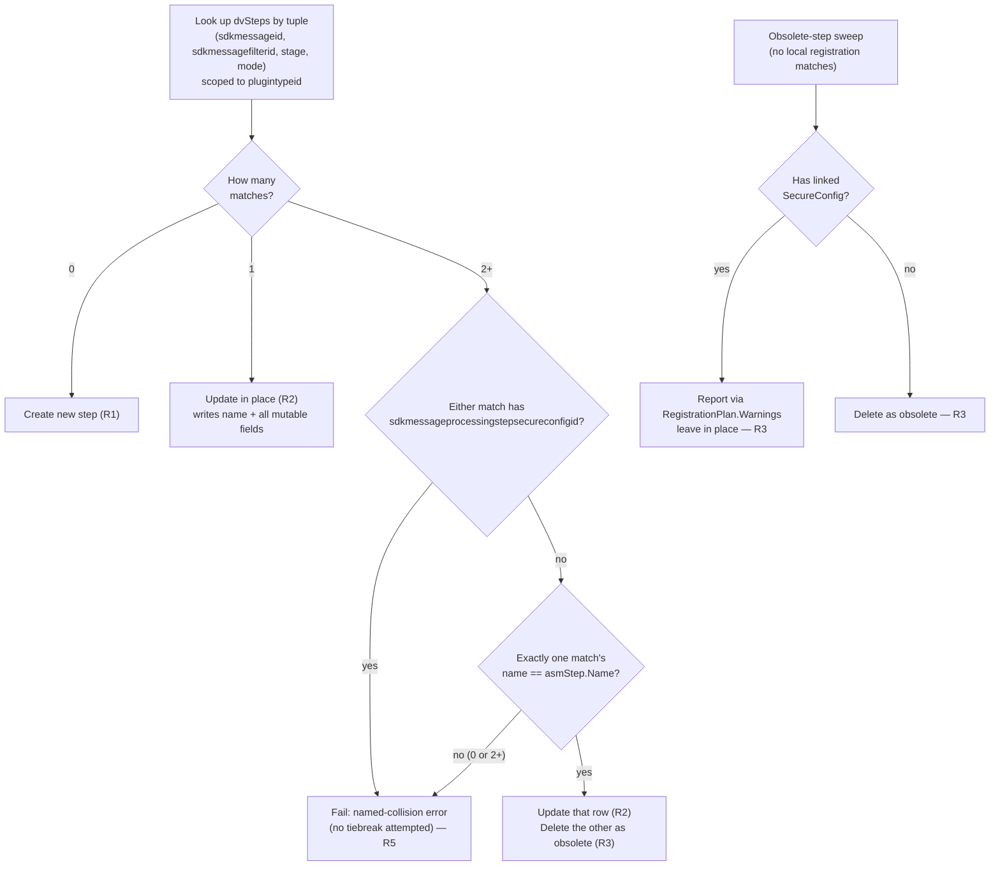
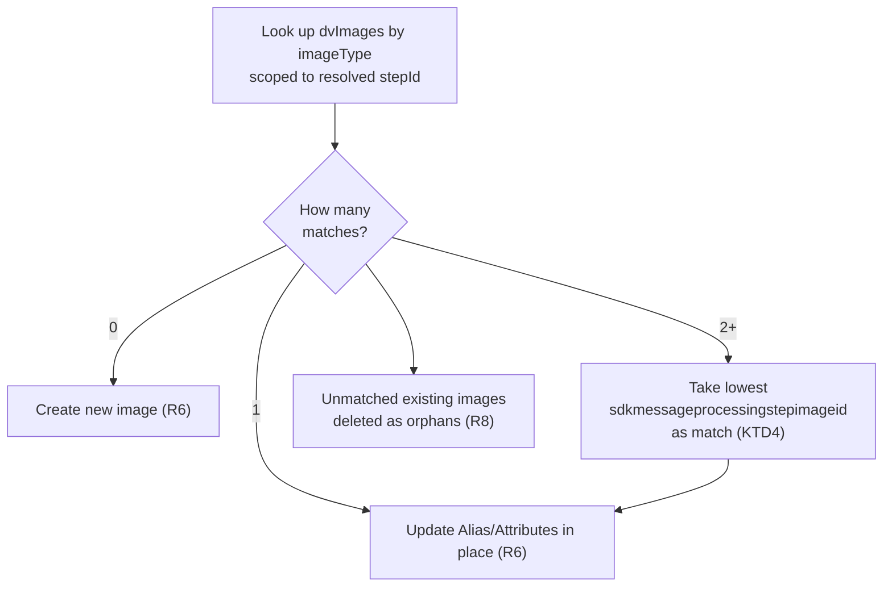

# Plugin Registration Identity Matching - Plan

## Goal Capsule

- **Objective:** Make plugin-step and step-image matching in `PluginPlanner` prefer in-place
  updates over delete+recreate, by keying both on stable identity tuples instead of generated
  display text.
- **Product authority:** Confirmed via brainstorm dialogue in this session; Product Contract
  below is unchanged from the requirements-only version (see preservation note).
- **Open blockers:** None.

---

## Product Contract

**Product Contract preservation note:** unchanged. Planning did not surface any conflict with
the brainstorm's decisions; all R-IDs, Key Decisions, and Scope Boundaries below are carried
forward verbatim from the requirements-only version of this file.

### Summary

Replace push-time plugin-step and step-image matching in `PluginPlanner` with stable identity
keys decoupled from generated display text, so updates happen in place instead of delete+recreate.
Extends CustomApi/RequestParameter/ResponseProperty's principle of a stable identity separate from
mutable display fields to Steps and Images.

### Problem Frame

Today, plugin steps match primarily by their generated display name (embedding class, message,
table, stage), falling back to a secondary tuple match only when the name lookup misses. Any
change to Flowline's own naming conventions — this has already happened once, via multi-`[Handles]`
stage-qualification — risks orphaning and recreating steps that haven't conceptually changed:
churning GUIDs and adding noise to solution-component history. For a step whose Dataverse history
predates Flowline (spkl, Daxif, manual PRT registration), this can also silently discard state
Flowline never modeled in the first place — a manually disabled step, or a Secure Configuration
value with no recovery path (see Key Decisions).

Step images have the same shape: they're matched by `name` within the resolved step, so renaming
an alias for readability silently orphans the old image and creates a new one.

CustomApi and its child entities already avoid this problem — matched by a stable `uniquename`
decoupled from mutable display fields — but Steps and Images never adopted the same shape.

### Key Decisions

- **Step matching becomes tuple-primary, not name-first-with-fallback.** The identity key is
  `(plugintypeid, sdkmessageid, sdkmessagefilterid, stage, mode)` — already computed today as the
  secondary/fallback match — promoted to the only lookup path. `name` becomes a plain field the
  planner writes, never reads for identity. Chosen over keeping today's two-path model because
  Flowline is pre-release, making this the cheapest point to absorb the rework, and because it
  also insulates future Flowline naming-convention changes from ever causing registration churn
  again, not just the currently-known `[Handles]` case.
- **Changing an identity-key field (table/message filter, stage, or mode) on an already-registered
  step recreates it rather than updating it in place — resolved explicitly, not a side effect.**
  Implementing U2 surfaced that R2's original wording (since corrected) implied these fields were
  written back on a match, which is impossible: a match is found *by* tuple equality, so on a
  matched row they are already equal by construction. The real question — clarified directly with
  the user, since it bears on the original "filterentity updated a lot, shouldn't trigger a
  registration" ask — is what happens when code changes one of these fields for a step that used to
  match a different tuple. Two terms needed disambiguating first: "filterentity" meant
  `filteringattributes` (the column list a step filters on), which was never in the identity key and
  is already a plain mutable field — no conflict there. For the table/message filter itself
  (`sdkmessagefilterid`), stage, and mode — which genuinely are in the key — the resolution is
  recreate, not update: these fields exist in the key specifically so multiple `[Handles]` on one
  class can be told apart when they differ only by stage or mode (R4's build-time uniqueness
  guarantee depends on it), so no subset of the tuple can be both a unique disambiguator and
  edit-stable at the same time. A name-based fallback would restore in-place updates for this one
  case but reopens the two-path structure and the naming-fragility risk this plan removes for the
  common case. Accepted as a deliberate, narrow behavior change: today, editing a step's `Stage`,
  `Mode`, or table filter is found via name and updated in place; after this plan, it is treated as
  retiring the old registration and adding a new one — consistent with Dataverse's own execution
  model, where a step at a different stage genuinely runs at a different point in the pipeline.
- **This key is a Flowline-authored disambiguation boundary, not a Dataverse constraint.**
  Verified against the `sdkmessageprocessingstep` metadata: every field in the key (`stage`,
  `mode`, `sdkmessageid`, `sdkmessagefilterid`, `plugintypeid`) is genuinely updatable in place —
  Dataverse has no documented gotcha here the way it does for CustomApi's `RequestParameter`/
  `ResponseProperty` fields (which are silently ignored on update despite passing schema
  validation). The key exists because multi-`[Handles]` lets one plugin type register several
  distinct steps, so something must identify which Dataverse row a given code-side registration
  corresponds to before an update can target it — not because these fields resist update.
- **A step key matching more than one existing Dataverse row is first gated on Secure
  Configuration, then triggers a name-based tiebreak, before failing the push.** R2's own
  mutable-field list (configuration, rank, filtering columns) proves the key is narrower than the
  full row, so two pre-existing rows — accumulated via PRT, spkl, or Daxif before this change —
  could share a key while differing only on a mutable field. If either colliding row has a linked
  `sdkmessageprocessingstepsecureconfigid` (readable without ever reading the secret value itself),
  Flowline skips straight to the named-collision error — a name match only tells us which row is
  the *current* registration, not whether deleting the other one is *safe*, and a Secure
  Configuration value has no recovery path if deleted (see below). Otherwise, Flowline checks
  whether exactly one colliding row's `name` matches what the current code would generate: if so,
  that row is updated and the other is deleted as obsolete, same as any other unmatched row
  (uniform with R3, and with how push already tolerates re-registering a wrongly-deleted image via
  PRT). If zero or more than one colliding row matches by name, the tiebreak itself is ambiguous
  and the push fails with a named-collision error rather than guessing further.
  A third disambiguation signal (comparing existing step images against what `[PreImage]`/
  `[PostImage]` declare) was considered and rejected — it would only help when the name tiebreak
  *also* fails, an edge case of an already-rare edge case, not worth the added query and test
  surface.
  Arbitrary-pick (e.g. first-returned-row) was rejected over hard-failing because `RetrieveMultiple`
  has no guaranteed row order, so an arbitrary pick is non-deterministic across pushes. Applying an
  explicit sort order (e.g. by `sdkmessageprocessingstepid`) would fix that non-determinism, but
  determinism is not the same as safety: a deterministic pick still risks deleting the semantically
  wrong row every time, just consistently. Flowline never reads or writes `statecode`/`statuscode`
  (verified: absent from `PluginPlanner.cs`/`PluginExecutor.cs` entirely), so for a step whose
  history predates Flowline, deleting the wrong colliding row can silently re-enable a step
  manually disabled before Flowline managed it, or — the sharper risk — permanently lose a Secure
  Configuration value, since Dataverse never returns `SecureConfig` on read and excludes it from
  solution export, leaving no re-registration recovery path the way there is for a plain image.
  Collision only arises from non-Flowline-managed history (build-time validation already rules it
  out for Flowline-only operation), which biases the very rows that reach this path toward exactly
  the ones a wrong guess would hurt most.
- **The same Secure Configuration guard extends to R3's ordinary obsolete-step cleanup, not just
  collisions.** The identical irrecoverable-loss risk applies whenever any step is deleted as
  obsolete — and a plugin class removed or renamed from source is a far more common trigger than a
  key collision. Guarding only the rare collision path while leaving everyday obsolete-cleanup
  unprotected would be an inconsistent half-measure once documented this plainly, so R3 itself now
  checks for a linked Secure Configuration before deleting and reports rather than deletes when one
  is present.
- **Image matching becomes `(stepId, imageType)`-keyed**, with `Alias` and `Attributes` (the
  column list) as plain mutable fields. Justified by two facts verified against source:
  `[PreImage]`/`[PostImage]` each allow at most one instance per plugin class (`AttributeUsage`
  without `AllowMultiple`), so `imageType` is guaranteed unique within a step; and research
  (Microsoft Learn, Spkl, Daxif) turned up no functional reason for two same-type images beyond
  incremental accretion by uncoordinated parties.
- **The 1-Pre + 1-Post image cap is retained and documented as a deliberate decision**, not
  loosened to match Dataverse's actual per-type-image capacity or Daxif's unlimited model.
  Dataverse allows unlimited same-type images (confirmed live against a test environment) and
  Daxif exposes this unrestricted; Flowline chooses not to, because splitting one step's columns
  across multiple same-type images has no benefit over one combined image, and every real
  second-image case constructed during research reduced to organic accretion, not a deliberate
  design need.
- **Extra/unrecognized images beyond what code declares are still deleted as orphans** (unchanged
  from today) — confirmed acceptable since re-adding a manually-registered image via the Plugin
  Registration Tool is cheap.
- **PluginType matching stays keyed on `typename`** — not a Flowline convention, but the identity
  Dataverse's own plugin execution engine requires (it reflects into the registered typename to
  instantiate the class), so no client-side matching strategy can avoid a delete+recreate on class
  rename.
- **CustomApi, RequestParameter, and ResponseProperty matching are unchanged** — already keyed on
  a stable `uniquename` decoupled from mutable display fields, serving as the reference pattern
  this plan extends to Steps and Images rather than a target of change. Unlike CustomApi's child
  entities, Steps and Images have no platform-immutable fields to split out (see above) — the
  extension is the identity-decoupling principle, not the immutable/mutable mechanism.

### Requirements

**Step matching**

- R1. Plugin step lookup in `PluginPlanner` uses `(plugintypeid, sdkmessageid, sdkmessagefilterid,
  stage, mode)` as the sole identity key; the generated step `name` is written on create/update but
  never used to find an existing record.
- R2. A step found by this key is updated in place (name, configuration, filtering columns, rank,
  async-auto-delete, impersonation, description) rather than deleted and recreated, regardless of
  whether its generated display name changed. The identity-key fields themselves (stage, mode,
  `sdkmessageid`, `sdkmessagefilterid`) are, by construction, already equal on a matched row and are
  not separately written back — see Key Decisions for what happens when one of them changes in code.
- R3. A step whose key no longer matches any local registration is treated as obsolete and
  deleted, unless it has a linked Secure Configuration, in which case Flowline reports it and
  leaves it in place rather than deleting it.
- R4. Two `[Handles]` registrations on the same plugin type producing an identical key continue to
  be rejected at build time (unchanged validation), preserving the key's uniqueness guarantee.
- R5. If the identity key matches more than one existing Dataverse row for a plugin type, and
  either colliding row has a linked Secure Configuration, the push fails immediately with an error
  naming the colliding rows — no tiebreak is attempted. Otherwise, Flowline checks whether exactly
  one colliding row's `name` matches the name the current code would generate. If exactly one
  matches, that row is updated and the other is deleted as obsolete (same as R3); if zero or more
  than one colliding row matches by name, the push fails with an error naming the colliding rows,
  rather than guessing.

**Image matching**

- R6. Step-image lookup in `PluginPlanner` uses `(resolved stepId, imageType)` as the identity key;
  `Alias`/`Attributes` are compared and written as plain mutable fields.
- R7. `[PreImage]` and `[PostImage]` remain capped at one instance per plugin class (no attribute
  model change).
- R8. An image registered in Dataverse with no matching code declaration is deleted as an orphan,
  matching today's behavior.

**Documentation**

- R9. `src/Flowline.Attributes/README.md` and the wiki's Plugin-Registration page explain the step
  identity model (what fields participate, why display-name changes never cause recreation) and
  state the 1-Pre + 1-Post image cap as an intentional design decision with its rationale, not an
  unexplained limitation.

**Verification**

- R10. Test coverage demonstrates: a step already registered under today's name-based scheme (i.e.,
  an environment pushed before this change) is found correctly by the new key and updated in place
  on the next push, rather than treated as an orphan-plus-new-create pair; a colliding key with
  exactly one name-matching row updates that row and deletes the other per R5; a colliding key with
  zero or multiple name-matching rows fails per R5 rather than guessing; a colliding key where
  either row has a linked Secure Configuration fails immediately without attempting the name
  tiebreak; and an obsolete step with a linked Secure Configuration is reported and left in place
  per R3 rather than deleted.

### Scope Boundaries

- Authoring multiple Pre/Post images of the same type from attributes (`AllowMultiple` on
  `[PreImage]`/`[PostImage]`) — deliberately excluded; see Key Decisions.
- PluginType, CustomApi, RequestParameter, and ResponseProperty matching — unchanged, already
  correct.
- Deploy-time orphan cleanup (`OrphanCleanupService`) — a separate, `solutioncomponent`-GUID-based
  mechanism used by `flowline deploy`; this plan touches only `PluginPlanner`'s push-time matching.
- **Known residual gap, knowingly not covered by this plan:** `PluginService.GetOrRegisterAssemblyAsync`'s
  assembly-identity-change cascade delete (triggered by a public key token, culture, or major/minor
  version change — `PluginService.cs:401`) and `WarnOrphanAssembliesAsync`'s `--force` cascade
  delete (`PluginService.cs:251`) both delete an entire `pluginassembly` and everything under it —
  including steps that may carry a Secure Configuration — with no check equivalent to R3/R5's guard.
  Both are reachable from the same `flowline push` this plan protects, so the plan's own
  "irrecoverable Secure Configuration loss" rationale (Key Decisions) applies there too; extending
  the guard to those paths is a reasonable fast-follow, deliberately left out of this plan's scope
  to keep it focused on `PluginPlanner`'s step/image matching rather than `PluginService`'s
  assembly lifecycle.

### Sources & Research

- `src/Flowline.Attributes/PreImageAttribute.cs`, `PostImageAttribute.cs` —
  `AttributeUsage(AttributeTargets.Class)` with no `AllowMultiple`, confirming the 1-per-type cap
  is compiler-enforced today.
- `src/Flowline.Core/Services/PluginPlanner.cs` — current step match (name primary,
  `(sdkmessageid, sdkmessagefilterid, stage, mode)` secondary), image match (`stepId` + `name`),
  and the CustomApi/RequestParameter/ResponseProperty `uniquename`-decoupled-from-mutable-fields
  pattern this plan extends.
- Microsoft Learn `sdkmessageprocessingstep` table reference (writable columns) — confirms `Stage`,
  `Mode`, `PluginTypeId`, `SdkMessageId`, and `SdkMessageFilterId` are all `IsValidForUpdate: true`
  with no documented ignored-on-update gotcha, unlike CustomApi's `RequestParameter`/
  `ResponseProperty` fields. The identity key is a Flowline-authored disambiguation choice, not a
  platform-forced one.
- Grep confirms `statecode`/`statuscode`/`secureconfig` are absent from `PluginPlanner.cs` and
  `PluginExecutor.cs` entirely — Flowline never reads or writes them, so a wrongly-deleted step
  loses that state with no recovery path. Microsoft Learn's Secure Configuration tutorial note:
  "Secure Configuration data isn't included with the step registration when you export a solution."
- `src/Flowline.Core/Services/PluginAssemblyReader.cs` — multi-`[Handles]` stage-qualification
  logic (`qualifyWithStage`) that motivated the original secondary-match fallback; build-time
  duplicate-key validation.
- `src/Flowline.Core/Services/OrphanCleanupService.cs`, `IPostDeployService.cs` — confirms the
  deploy-time orphan mechanism is architecturally separate (GUID-based) from this plan's scope.
- `docs/plans/2026-06-21-001-feat-multi-handles-step-registration-plan.md` — origin of the current
  secondary-match fallback this plan promotes to primary.
- Live Dataverse query (dev environment) and Plugin Registration Tool inspection confirming the
  platform allows multiple same-type step images, ruling out an assumption that Flowline's cap
  merely reflects a platform limit.
- `CrmPluginRegistrationAttribute.cs` (Spkl) — two-slot (`Image1`/`Image2`) image model with no
  type-uniqueness enforcement.
- `Plugin.cs` (Daxif) — unrestricted `Collection<PluginStepImage>` image model.
- `docs/others/pacx-comparison.md` — confirmed PACX has no comparable declarative matching
  (imperative one-command-per-step registration), nothing to adopt.

---

## Planning Contract

### Key Technical Decisions

- **KTD1 — Merge the duplicated update-application code.** Today's primary-match update block
  (`PluginPlanner.cs:205-234`) and secondary-match update block (`PluginPlanner.cs:260-272`) apply
  the same field writes to `dvStep`, near-verbatim. Since R1 removes the two-path structure, these
  merge into one shared "apply asmStep onto dvStep and upsert" routine, which now also always
  writes `name` (today the secondary path writes `name`; the primary path doesn't, because it
  already matched on it — that asymmetry disappears once name is a plain write-every-time field).
- **KTD2 — Group, don't dictionary, the step lookup.** `dvSteps` is built today via `ToDictionary`
  keyed by `name` (`PluginPlanner.cs:167-170`), which throws on a duplicate key. Since the new
  tuple key can legitimately collide (R5), the lookup must be a multi-value structure
  (`ToLookup`/`GroupBy` on the tuple) so a collision surfaces as "more than one entry," not an
  unhandled exception from the dictionary construction itself.
- **KTD3 — Reuse the existing fail-fast exception convention for R5's collision error only.**
  `PlanPluginSteps` already throws `InvalidOperationException` for unrecoverable per-step problems
  (unknown message, unsupported table, missing `RunAs` user — `PluginPlanner.cs:177-194`). R5's
  named-collision error follows the same convention rather than introducing a new exception type or
  return-code channel. This does **not** extend to R3's Secure-Configuration-protected-obsolete-step
  report, which is non-blocking by design (R3: "reports it and leaves it in place ... rather than
  deleting it" — the push continues) and is routed through the separate mechanism in KTD5.
- **KTD4 — Image-type collision resolves deterministically, with no fail-fast path.** Unlike steps,
  the Product Contract does not require a collision-failure mode for images — R6/R8 only specify
  the `(stepId, imageType)` key and orphan deletion. If a snapshot ever holds 2+ existing images of
  the same type on one step (organic accretion, confirmed live-testable per Sources & Research),
  resolve by taking the row with the lowest `sdkmessageprocessingstepimageid` as the match and
  treating the rest as orphans (R8's existing path). This follows directly from the Product
  Contract's already-accepted risk tolerance for images ("re-adding a manually-registered image via
  PRT is cheap") — images carry no Secure-Configuration-equivalent irreversible-loss risk, so the
  severity argument that justifies R5's hard-fail for steps does not transfer.
- **KTD5 — Route Secure-Configuration reports through the existing `RegistrationPlan.Warnings`
  list**, the same mechanism `AddCrossSolutionWarnings` already uses (`PluginPlanner.cs:130-154`),
  rather than adding a new field to `ActionPlan` (which carries `Upserts`/`Deletes`/
  `AddSolutionComponents` only — no `Warnings` of its own; only the top-level `RegistrationPlan`
  has that list). `Plan()` already holds `plan` (the `RegistrationPlan`) in scope at both
  `PlanPluginSteps` call sites (`PluginPlanner.cs:69` and `:98`), so the natural mechanism is
  passing `plan.Warnings` (or the list itself) into `PlanPluginSteps` as a parameter — a small,
  contained signature change, confirmed at implementation time (U4), not an open architecture
  question.
- **KTD6 — Replace the removed `secondaryMatchedIds` tracking with a `matchedIds` set covering
  every row a match consumes, and rewrite the obsolete-step sweep against it.** Today's obsolete
  sweep (`PluginPlanner.cs:301-303`) is `dvSteps.Where(s => asmPluginSteps.All(p => p.Name !=
  s.Key) && !secondaryMatchedIds.Contains(s.Value.Id))` — it depends on `dvSteps` being name-keyed
  (`s.Key` a name) and on `secondaryMatchedIds`, both of which U2 removes. Left as "unchanged" (as
  U4's Approach originally described it), an implementer patching this predicate onto the new
  tuple-keyed lookup would have a step that was tuple-matched-and-renamed also satisfy the stale
  `p.Name != s.Key` check and get deleted immediately after being updated — reproducing the exact
  churn this plan exists to eliminate. Fix: introduce a single `matchedIds` `HashSet<Guid>`,
  populated with a row's ID at the moment it is chosen as *the* match — U2's single-tuple-match
  path, and U3's tiebreak-winner path. The R5 tiebreak-loser is deliberately **not** added to
  `matchedIds` (per U3's Approach, it flows into the same obsolete-deletion path U4 already
  guards with the Secure Configuration check, rather than being deleted directly by U3). The
  obsolete-step sweep becomes: snapshot rows for this plugin type whose ID is not in `matchedIds`.
- **KTD7 — Gate the obsolete-plugin-type delete on whether U4 left any of its child steps in
  place.** The obsolete-plugin-type sweep (`PluginPlanner.cs:76-103`) calls `PlanPluginSteps` with
  an empty step list (`:92-98`, `obsoleteMetadata` has `Steps: []`) so that every existing step
  under the type is swept as obsolete, then unconditionally deletes the plugin type itself
  (`:102`) — correct today because deleting all child steps first (execution order:
  `RegistrationPlan.cs:9`, "Steps, PluginTypes") always leaves the type childless before its own
  delete runs. R3/U4 break that invariant: a step with a linked Secure Configuration is now
  deliberately left in place instead of deleted, so the plugin-type-obsolete sweep can now queue a
  type delete while one of its own steps still references it — an interaction that could not
  occur before this plan, and one Dataverse's referential integrity most likely rejects (a step
  can't reference a nonexistent plugin type). Fix: after calling `PlanPluginSteps` in the
  obsolete-plugin-type sweep, check whether its returned `stepPlan` left any row un-deleted
  (i.e., the Secure Configuration guard fired for at least one child step); if so, skip adding the
  plugin type to `PluginTypes.Deletes` and report it via the same `RegistrationPlan.Warnings`
  mechanism as KTD5/R3 instead.
- **Cross-solution warnings extend to deletes, not just updates — a code-review finding, not part
  of the original design.** `AddCrossSolutionWarnings` only ever inspected `Upserts`, because before
  this plan every mutable-field change (including stage/mode) was an update. Once identity-key
  changes recreate a step instead (see the tuple-primary Key Decision above), a shared step whose
  stage changes is now deleted, not updated — silently, with no warning, for a case that would have
  warned under the old name-based matching. Fixed by extending the same warning check to
  `Steps.Deletes`/`Images.Deletes`/`CustomApis.Deletes`/`RequestParams.Deletes`/
  `ResponseProps.Deletes`/`PluginTypes.Deletes` via a shared `WarnIfInOtherSolutions` helper.
- **The Secure-Configuration-protected-obsolete-step warning names the duplicate-active-step risk
  when a replacement was also created in the same push — a code-review finding.** Combining
  "identity-key changes recreate the step" with "a step with a linked Secure Configuration is left
  in place rather than deleted" means both the old (protected) and new (just-created) registration
  can be active in Dataverse simultaneously after a stage/mode/message/filter edit on a
  Secure-Configuration-carrying step. Rather than attempting to correlate and auto-resolve this (out
  of scope — the planner has no reliable way to know a new create is "the same logical registration,
  moved" versus a genuinely new one), the warning text itself now says so explicitly when
  `stepPlan.Upserts` contains a create for the same plugin type, so an operator sees the real risk
  instead of assuming a harmless pause.
- **Concurrent first-time `flowline push` runs racing to create the same brand-new step is an
  accepted, documented residual risk, not fixed here.** Two racing pushes can both see zero matches
  for a new `[Handles]` registration and both create a row with the identical Flowline-generated
  name (Dataverse has no server-side uniqueness constraint on the identity tuple). Every subsequent
  push then hits R5's collision path with two identically-named rows, which the name tiebreak can
  never resolve automatically (`nameMatches.Count` is always 2, never 1) — a hard, permanent failure
  requiring manual cleanup via the Plugin Registration Tool. This is a concurrency/architecture
  question (no push-time lock exists, and adding one is a separate feature) out of this plan's scope;
  documented here rather than silently left undiscovered. Operators should serialize `flowline push`
  runs against the same environment/solution (e.g. one CI job at a time), which already avoids it.

### Assumptions

- **Image-type-collision tiebreak (KTD4)** was not explicitly discussed for images during the
  brainstorm dialogue (only for steps, via R5) — inferred from the already-accepted "images are
  low-stakes and recoverable" product stance rather than confirmed directly. If this assumption is
  wrong, the fix is scoped to U5 alone.
- **Secure Configuration presence check** assumes reading
  `sdkmessageprocessingstepsecureconfigid` from the already-fetched snapshot Entity (once U1 adds
  it to the column set) is sufficient — no separate live round-trip to Dataverse is needed, since
  presence is a plain lookup-field read, not a query that could itself expose the secret value.

### High-Level Technical Design

The step-matching decision tree replaces today's two-path (name-primary / tuple-secondary)
structure with one lookup gated by match count, then (on collision) by Secure Configuration
presence, then by a name tiebreak:

Image matching is a simpler, single-level lookup (no collision-failure path, per KTD4):

### Sequencing

U1 → U2 → U3 → U4, then U5 (independent of U2-U4 conceptually, but touches the same file —
sequence after to avoid merge friction), then U6 (documents the shipped behavior of U1-U5).

---

## Implementation Units

### U1. Expose Secure Configuration presence in the step snapshot query

**Goal:** Make `sdkmessageprocessingstepsecureconfigid` available on every fetched step Entity so
later units (U3, U4) can gate on its presence without an extra round-trip.

**Requirements:** R3, R5 (enabling).

**Dependencies:** None.

**Files:**
- `src/Flowline.Core/Services/PluginReader.cs`
- `tests/Flowline.Core.Tests/PluginServiceTests.cs`

**Approach:** Add `"sdkmessageprocessingstepsecureconfigid"` to the `ColumnSet` in
`GetRegisteredStepsAsync` (`PluginReader.cs:228-229`). No `RegistrationSnapshot` model change is
needed — `Entity` is a loose attribute bag, so the new column is available via
`entity.GetAttributeValue<EntityReference?>("sdkmessageprocessingstepsecureconfigid")` once
fetched. Per `docs/solutions/logic-errors/retrieve-multiple-async-silent-truncation-2026-05-29.md`,
`PluginReader`'s step query is already confirmed pagination-safe (scoped to one assembly, always
far below the 5000-row page limit) — no `RetrieveAllAsync` change needed here.

**Patterns to follow:** The existing `ColumnSet` construction at `PluginReader.cs:228-229`.

**Test scenarios:**
- Test expectation: none — mechanical column addition with no behavioral branch of its own.
  Extend `PluginServiceTests.cs`'s `SetupSteps` helper (`PluginServiceTests.cs:171-186`) so a test
  step can carry `["sdkmessageprocessingstepsecureconfigid"] = new EntityReference(...)` — this is
  what U3/U4's tests consume, not a new assertion in this unit.

**Verification:** `GetRegisteredStepsAsync`'s `ColumnSet` includes the new column; existing
`PluginServiceTests.cs` tests continue to pass unchanged (the column addition is additive).

---

### U2. Promote the identity tuple to the sole step-match key

**Goal:** Replace the name-primary/tuple-secondary two-path lookup with one tuple-keyed lookup;
merge the duplicated update-application logic (KTD1).

**Requirements:** R1, R2, R4.

**Dependencies:** None.

**Files:**
- `src/Flowline.Core/Services/PluginPlanner.cs` (`PlanPluginSteps`, currently `:160-316`)
- `tests/Flowline.Core.Tests/PluginPlannerTests.cs`

**Approach:** Replace the `dvSteps` dictionary keyed by `name` (`PluginPlanner.cs:167-170`) with a
lookup grouped by `(sdkmessageid, sdkmessagefilterid, stage, mode)`, scoped to `typeEntity.Id` (the
existing outer filter). Use `GroupBy`/`ToLookup`, not `ToDictionary` (KTD2) — a plain dictionary
throws on the collision case U3 needs to handle. For the single-match case, merge the field-write
logic currently duplicated between the primary-match block (`:205-234`) and the secondary-match
block (`:260-272`) into one routine that always writes `name` (KTD1) alongside the existing fields
(configuration, filtering columns, stage, mode, rank, async-auto-delete, impersonation,
description, `sdkmessageid`, `sdkmessagefilterid`). Preserve the build-time duplicate-key
validation in `PluginAssemblyReader.cs` (R4) — no change needed there; it already prevents two
`[Handles]` on one class from producing an identical tuple.

Introduce a `matchedIds` `HashSet<Guid>` (replacing the removed `secondaryMatchedIds`, KTD6): add a
row's ID the moment it is chosen as the match for an `asmStep` in this unit's single-match path.
The obsolete-step sweep (U4) reads this set — do not leave the sweep's predicate referencing the
old name-keyed `dvSteps`/`secondaryMatchedIds` shape.

**Patterns to follow:** The existing tuple-comparison fields already used in today's secondary
match (`PluginPlanner.cs:240-246`) — this unit promotes that exact tuple, it does not invent a new
one. Per `docs/solutions/logic-errors/secondary-match-predicate-missing-mode.md`, the tuple must
include **both** `stage` and `mode` — `PostOperation` (40) is shared by sync and async steps, so
omitting `mode` reintroduces the exact sync/async confusion bug that solution doc documents.

**Test scenarios:**
- Happy path: an assembly step whose generated name is unchanged from the snapshot's matching row
  updates that row in place (rank, configuration, filtering columns changed) with no delete/create.
- Happy path: a step whose generated display name changed (e.g. multi-`[Handles]` stage
  qualification added or removed) but whose tuple is unchanged is found by the tuple lookup and
  updated in place, including the `name` field itself — covers R10's "environment pushed before
  this change" regression scenario.
- Edge case: two distinct `[Handles]` on one class with different tuples produce two separate
  step rows, neither mistaken for the other.
- Update existing tests `Plan_StepRenamedToStageQualified_SecondaryMatchProducesUpdate`,
  `Plan_SecondaryMatch_DoesNotDeleteOldStepName`, and `Plan_PrimaryMatchPreferredOverSecondary`
  (`PluginPlannerTests.cs:863-988`) — their asserted *outcomes* should hold unchanged under the new
  tuple-primary lookup (e.g. `Plan_PrimaryMatchPreferredOverSecondary`'s two-rows-same-tuple
  scenario now exercises U3's collision-then-name-tiebreak path rather than a "primary vs.
  secondary" distinction that no longer exists), but verify each explicitly rather than assuming —
  and consider renaming them to drop "Primary"/"Secondary" framing now that there is only one path.
- Regression: re-run (or confirm still covered by) the dual-mode test from
  `docs/solutions/logic-errors/secondary-match-predicate-missing-mode.md` (`[Handles(Message.Create,
  Stage.PostOperation)]` + `[Handles(Message.Create, Stage.PostOperationAsync)]` on one class) —
  the tuple lookup must still distinguish sync (mode=0) from async (mode=1) at PostOperation (stage
  40).

**Verification:** All updated and new `PluginPlannerTests.cs` cases pass; no test asserts on the
removed name-first/tuple-fallback two-path structure.

---

### U3. Collision handling: Secure Configuration gate, name tiebreak, hard fail

**Goal:** Implement R5 — when the tuple key matches more than one existing row, gate on Secure
Configuration presence, then attempt a name tiebreak, then fail if still ambiguous.

**Requirements:** R5.

**Dependencies:** U1, U2.

**Files:**
- `src/Flowline.Core/Services/PluginPlanner.cs` (`PlanPluginSteps`)
- `tests/Flowline.Core.Tests/PluginPlannerTests.cs`

**Approach:** When U2's grouped lookup returns 2+ entries for an `asmStep`'s tuple: first check
whether any entry has a non-null `sdkmessageprocessingstepsecureconfigid` (from U1); if so, throw
`InvalidOperationException` (KTD3) naming the colliding row IDs/names and stating that a Secure
Configuration value blocks automatic resolution. Otherwise, filter the entries where
`GetAttributeValue<string>("name")` equals `asmStep.Name` (ordinal, case-insensitive — matching the
comparer already used for `dvSteps`/`asmStepNames` elsewhere in this method); if exactly one
matches, treat it as the resolved row (apply U2's merged update routine, and add its ID to U2's
`matchedIds` set, KTD6) and leave every other colliding row **out** of `matchedIds` so it flows
into U4's obsolete-deletion path (U4 owns whether that deletion is itself blocked by a Secure
Configuration — the gate above only short-circuits when *any* colliding row has one, so a row
without one can still reach U4's per-row check on the "delete as obsolete" branch). If zero or more
than one entry matches by name, throw the same named-collision error as the Secure Configuration
gate.

**Patterns to follow:** `PluginPlanner.cs:177-194`'s existing `InvalidOperationException` style for
per-step validation failures — mirror the message shape (`"Step '{name}' ... Check {attribute} on
[Step]/[Handles] for '{fullName}'."`) adapted to name the colliding rows instead of a single bad
value.

**Test scenarios:**
- Happy path: two colliding rows, one matching `asmStep.Name` exactly and neither carrying a
  Secure Configuration — the matching row is updated, the other is added to the delete set.
- Error path: two colliding rows, neither matching `asmStep.Name` — push fails with an error naming
  both rows.
- Error path: two colliding rows, both matching `asmStep.Name` (e.g. accidental true duplicates) —
  push fails with an error naming both rows, not an arbitrary pick.
- Error path: two colliding rows where exactly one *would* resolve via the name tiebreak, but the
  *other* (non-matching) row has a linked Secure Configuration — push fails immediately citing the
  Secure Configuration, without ever attempting or reporting the name tiebreak outcome.
- Error path: two colliding rows where the row that *would* win the name tiebreak is the one
  carrying the Secure Configuration — same outcome (fails before the tiebreak runs) — confirms the
  gate checks all colliding rows, not just the "losing" one.
- Integration: confirm the `InvalidOperationException` message names both colliding rows'
  `sdkmessageprocessingstepid` (or name, whichever the existing convention in `:177-194` uses) so an
  operator can find them in the maker portal without further investigation.

**Verification:** New `PluginPlannerTests.cs` cases cover all five scenarios above; no case allows
a collision to silently resolve without either an update-and-delete or a thrown exception.

---

### U4. Secure Configuration guard on obsolete-step and obsolete-plugin-type cleanup

**Goal:** Implement R3's Secure-Configuration guard on the obsolete-step deletion path (rewritten
against `matchedIds`, KTD6), wire the reporting mechanism identified in KTD5, and gate the
obsolete-plugin-type delete on whether any of its child steps were left in place (KTD7).

**Requirements:** R3.

**Dependencies:** U1, U2, U3 (consumes the `matchedIds` set U2/U3 populate, and shares the "route
colliding-but-unprotected row to this same obsolete path" behavior established in U3).

**Files:**
- `src/Flowline.Core/Services/PluginPlanner.cs` (obsolete-step loop, currently `:301-313`; obsolete
  plugin-type loop, currently `:76-103`; `Plan()`, currently `:69`, `:98`)
- `tests/Flowline.Core.Tests/PluginPlannerTests.cs`

**Approach:** Rewrite the obsolete-step sweep's predicate from the removed name-keyed
`dvSteps`/`secondaryMatchedIds` shape to "snapshot rows for this plugin type whose ID is not in
`matchedIds`" (KTD6) — do not leave the old `p.Name != s.Key` comparison in place; it references a
key shape U2 removes. For each row the rewritten sweep selects, check
`sdkmessageprocessingstepsecureconfigid` (from U1) before adding it to `stepPlan.Deletes`. If
present, do not delete — instead route a report through the mechanism identified in KTD5 (pass
`plan.Warnings`, or the list itself, into `PlanPluginSteps` as a parameter from both call sites in
`Plan()`, following the same reporting pattern `AddCrossSolutionWarnings` uses at `:130-154`). If
absent, delete as today.

Separately, in the obsolete-plugin-type sweep (`:76-103`), after the `PlanPluginSteps` call at
`:98` returns its `stepPlan`, check whether any of the type's child steps were left un-deleted (the
Secure Configuration guard fired for at least one). If so, skip `plan.PluginTypes.Deletes.Add(...)`
at `:102` for that type and report it via the same `RegistrationPlan.Warnings` mechanism instead
(KTD7) — do not let the plugin-type delete proceed while a step still references it.

**Patterns to follow:** `AddCrossSolutionWarnings` (`PluginPlanner.cs:130-154`) for the
warning-reporting shape and message tone (`"Updating {type} '{name}' which also exists in..."` —
adapt to `"Skipping deletion of {type} '{name}' — has a linked Secure Configuration; remove
manually via the Plugin Registration Tool if intended."` for a step, and an equivalent message for
a plugin type whose child step blocked its removal).

**Test scenarios:**
- Happy path: an obsolete step with no linked Secure Configuration is deleted, matching today's
  behavior exactly (regression check — no behavior change for the common case).
- Edge case: an obsolete step with a linked Secure Configuration is **not** added to
  `stepPlan.Deletes`, and a corresponding warning naming the step appears in the plan's reported
  output.
- Integration: an obsolete step's images are still queued for deletion (or not) consistently with
  whether the step itself was protected — confirm the existing per-obsolete-step image cleanup
  loop (`:308-312`) doesn't orphan images for a step that was left in place.
- Integration: a step that U2 tuple-matched and renamed (its ID is in `matchedIds`) is **not**
  re-selected by the rewritten obsolete-step sweep and deleted immediately after being updated —
  the regression this unit exists to prevent (feasibility-flagged: the stale name-based predicate
  would otherwise still match on the old name and delete the just-updated row).
- Edge case: an obsolete plugin type whose sole child step carries a linked Secure Configuration —
  assert the plugin type is **not** added to `PluginTypes.Deletes`, and a warning naming the type
  appears, rather than the plugin type being queued for deletion alongside its still-referenced
  step.

**Verification:** New `PluginPlannerTests.cs` cases confirm the step-level guard fires only when
`sdkmessageprocessingstepsecureconfigid` is present, the plugin-type-level guard fires only when a
child step was protected, the rewritten sweep correctly excludes `matchedIds` rows, and the
existing no-Secure-Config obsolete-deletion tests are unaffected.

---

### U5. Image matching: key by `(resolved stepId, imageType)`

**Goal:** Implement R6 — rekey image matching from `name` to `(stepId, imageType)`, with
`Alias`/`Attributes` as plain mutable fields; resolve same-type duplicates deterministically
(KTD4).

**Requirements:** R6, R8 (R7 needs no code change — the attribute cap is already
compiler-enforced, verified in the Product Contract's Sources & Research).

**Dependencies:** None functionally; sequence after U2-U4 to avoid merge conflicts in the same
file (see Sequencing).

**Files:**
- `src/Flowline.Core/Services/PluginPlanner.cs` (`PlanImages`, currently `:318-371`)
- `tests/Flowline.Core.Tests/PluginPlannerTests.cs`

**Approach:** Replace `dvImages` (`PluginPlanner.cs:322-325`, keyed by `name`) with a lookup keyed
by `asmImage.ImageType`, still scoped to the existing `stepEntity.Id` filter. Since `[PreImage]`/
`[PostImage]` cap at one instance per class (R7), the assembly side never presents two images of
the same type for one step, so the new key needs no collision handling on that side. On the
snapshot side, if 2+ existing images share a type (organic accretion, per KTD4), take the one with
the lowest `sdkmessageprocessingstepimageid` as the match and add the rest to `plan.Deletes` via
the existing orphan path (`:367-368`, unchanged). Keep `entityalias`/`attributes`
change-comparison logic (`:331-334`) as-is — only the lookup key changes, not what's compared once
a match is found.

**Patterns to follow:** `PlanCustomApi`'s existing pattern of a stable key
(`uniquename`, `PluginPlanner.cs:382-385`) separate from mutable display fields — this unit applies
the same shape to images, with `imageType` playing the role `uniquename` plays for CustomApi.

**Test scenarios:**
- Happy path: an existing image's `Alias` is renamed in code (`[PreImage(Alias = "newAlias")]`)
  with the same `imageType` — updates in place, no delete+create.
- Happy path: an existing image's `Attributes` column list changes — updates in place.
- Edge case: a step's snapshot has two existing images of the same type (e.g. a manually-added
  duplicate) — the lower-ID row is treated as the match and updated; the higher-ID row is deleted
  as an orphan.
- Edge case: an image type present in code with no matching snapshot image is created new
  (unchanged from today).
- Edge case: a snapshot image type with no matching code declaration is deleted as an orphan
  (unchanged from today, R8).

**Verification:** New `PluginPlannerTests.cs` cases cover the rename-preserves-record scenario (the
core motivation for this unit) and the same-type-duplicate resolution; existing image tests
continue to pass with the key changed from `name` to `imageType`.

---

### U6. Documentation: README, wiki, CONCEPTS.md, and the stale tooling-decision doc

**Goal:** Implement R9 and correct documentation that describes the now-superseded matching model.

**Requirements:** R9.

**Dependencies:** U1, U2, U3, U4, U5 (documents the shipped behavior).

**Files:**
- `src/Flowline.Attributes/README.md`
- `Flowline.wiki/04-Plugin-Registration.md` (sibling repo)
- `CONCEPTS.md` (repo root)
- `docs/solutions/tooling-decisions/plugintype-id-not-needed.md`

**Approach:**
- README and wiki: explain the tuple identity model (which fields participate, why a display-name
  change never causes recreation) and state the 1-Pre + 1-Post image cap as an intentional
  decision with its rationale (per R9's exact wording).
- `CONCEPTS.md`: update the existing **Secondary match** entry — it currently describes the tuple
  match as "a fallback lookup strategy... when a Dataverse step's name no longer matches," which
  this plan retires (the tuple is now the *only* lookup, not a fallback). Update the existing
  **Step identity** entry to add `plugintypeid` to the tuple description (today's entry lists only
  `sdkmessageid`, `sdkmessagefilterid`, `stage`, `mode`) and note the Secure Configuration collision
  gate.
- `docs/solutions/tooling-decisions/plugintype-id-not-needed.md`: its "Why This Matters" section
  states steps are "matched by name (primary), then by content tuple... as a secondary match" —
  update to reflect tuple-primary matching (found stale during this plan's research phase).

**Patterns to follow:** Existing `CONCEPTS.md` entry format and cross-linking style (`[[Secondary
match]]`-style backlinks where used elsewhere in the file).

**Test scenarios:** Test expectation: none — documentation only.

**Verification:** All four files describe the shipped tuple-primary model consistently; no
surviving reference to "secondary match" as a fallback, or to name-primary/tuple-secondary
matching, in any of the four files.

---

## Verification Contract

- `dotnet build src/Flowline.Core/Flowline.Core.csproj` — the repo has no solution file; build the
  affected project directly.
- `dotnet test tests/Flowline.Core.Tests/Flowline.Core.Tests.csproj` — full unit-test run covering
  U1-U5's `PluginPlannerTests.cs`/`PluginServiceTests.cs` changes.
- No integration test against a live Dataverse environment is required — `PluginPlannerTests.cs`
  exercises `PluginPlanner.Plan(...)` purely in-memory against constructed `RegistrationSnapshot`/
  `Entity` fixtures, consistent with the existing test layer's approach.

## Definition of Done

- R1-R10 implemented and covered by the test scenarios listed in U1-U5.
- All existing `PluginPlannerTests.cs` and `PluginServiceTests.cs` tests pass, including the three
  renamed/re-verified tests from U2 and the dual-mode regression test
  (`Plan_TwoHandlesSameStageDifferentMode_MatchIndependently`) confirming sync (mode=0) and async
  (mode=1) `PostOperation` steps are never confused by `dvStepsByKey`, per
  `docs/solutions/logic-errors/secondary-match-predicate-missing-mode.md`.
- Cross-solution warnings fire on deletes as well as updates (`Plan_ObsoleteStepInOtherSolution_AddsWarning`),
  closing the gap identified in code review once identity-key changes started deleting rather than
  updating a step.
- The obsolete-step sweep is rewritten against `matchedIds` (KTD6), not the removed name-keyed
  `dvSteps`/`secondaryMatchedIds` shape — a step tuple-matched-and-renamed by U2/U3 is never
  re-selected by the sweep and deleted immediately after being updated.
- An obsolete plugin type whose child step was left in place by U4's Secure Configuration guard is
  never queued for deletion alongside it (KTD7).
- `CONCEPTS.md`'s **Secondary match** and **Step identity** entries, and
  `docs/solutions/tooling-decisions/plugintype-id-not-needed.md`, no longer describe the retired
  name-primary/tuple-secondary model (U6).
- README and wiki Plugin-Registration page document the tuple identity model and the 1-Pre +
  1-Post image cap rationale (U6, R9).
- No leftover dead code from the old two-path (name-primary / tuple-secondary) structure —
  `PlanPluginSteps` has one lookup and one merged update routine (KTD1, KTD2), not two.
