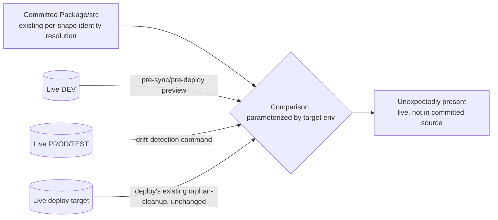
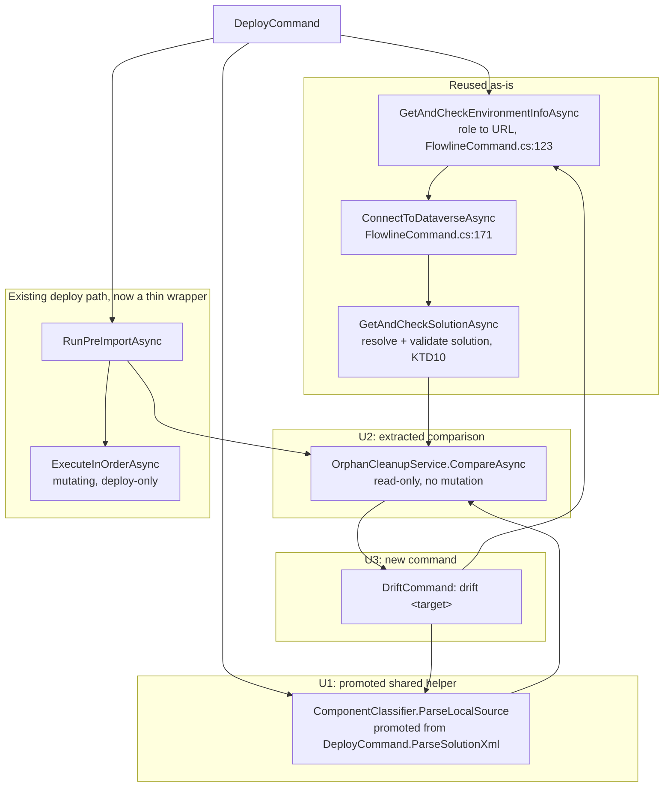

# Drift Detection via Generalized Target-Environment Diff - Plan

## Goal Capsule

- **Objective:** Generalize orphan-cleanup's existing committed-source-vs-live-target comparison so the live side accepts any named environment, not just the real deploy target — and expose that as one new read-only `drift <target>` command serving both the drift-detection and pre-sync/pre-deploy preview use cases. No new artifact, no change to identity-resolution logic.
- **Product authority:** STRATEGY.md's "Drift detection + component cleanup" track; the two Future Considerations named in `docs/plans/2026-07-06-001-feat-orphan-cleanup-verification-shapes-plan.md`; this session's dialogue and a code-verified finding that ruled out the heavier alternatives (see Alternatives Considered).
- **Open blockers:** None.

**Product Contract preservation:** unchanged. `ce-plan` enriched this file in place from its own `ce-brainstorm` output; no R/AE-ID content changed.

---

## Product Contract

### Summary

Parameterize the target environment in orphan-cleanup's existing committed-source-vs-live comparison, currently hardcoded to the real deploy target. Reusing that comparison unchanged, add a drift-detection command (compare committed source vs PROD/TEST) and a pre-sync/pre-deploy preview (compare committed source vs live DEV) — both read-only.

### Problem Frame

Orphan-cleanup's live-vs-committed diff already does exactly what a drift check needs, but it only runs during `deploy`, wired to whichever environment `deploy` is actually targeting. STRATEGY's drift-detection track and `docs/plans/2026-07-06-001`'s Future Considerations proposed two heavier mechanisms to get standalone drift/preview capability — a sync-time manifest and a true dual-live-environment query. This brainstorm evaluated both against today's baseline and rejected them: the value both use-cases actually need (committed source vs one live environment) is already what the existing comparison does; it just needs its target parameterized instead of hardcoded. See Alternatives Considered for the full analysis.

### Key Decisions

- **Reuse today's per-shape identity resolution unchanged.** The committed-source (S_new) side of the comparison stays exactly as `docs/plans/2026-07-06-001` shipped it — Solution.xml id-match, schemaname-keyed folders, inline Customizations.xml, entity-side queries. This work only changes which live environment the other side queries.
- **Parameterize the target environment instead of building a new artifact.** The live side of the comparison becomes a named-environment parameter (DEV/TEST/PROD, resolved the same way `.flowline` config already resolves environments for `deploy`), rather than a new git-committed manifest. See Alternatives Considered for why the manifest was rejected.
- **Drift semantics: committed source vs one live environment, not two live environments at once.** Confirmed with the user — "drift" here means what's committed doesn't match a given live environment, not a genuine both-sides-live-right-now comparison. True dual-live-environment query stays parked.
- **Change detection (content hashing) is explicitly out of scope this round.** Only presence/absence drift (unexpectedly present) is in scope — not detecting that an existing component's definition was silently edited.
- **Forward-only for this round: detects "present live, not declared in committed source"; does not detect "declared in committed source, missing from live."** Discovered during U2's implementation: the reused orphan-cleanup comparison only ever computed the first direction (that's all deploy's mutating cleanup ever needed — a component missing from live doesn't need cleanup, `deploy`'s own import recreates it). The reverse direction is not a byproduct of that logic; it would be new comparison logic with its own false-positive risk, mirroring the exact incident class (`docs/solutions/architecture-patterns/orphan-cleanup-two-phase-deploy-pipeline.md`'s Part 9) that built today's trust-bar guards — an unresolved live identity would need to be *suppressed*, not reported as "missing," and nothing in the reused code does that suppression for this direction today. Deferred rather than built ad-hoc; see Scope Boundaries.

### Requirements

**Target-environment parameterization**

- R1. Orphan-cleanup's live component query accepts an arbitrary named environment (resolved via existing `.flowline` config, the same way `deploy` resolves its target) instead of being hardcoded to the deploy target's connection.
- R2. The comparison's committed-source side is unchanged — built from `Package/src` via today's existing per-shape identity resolution.

**New entry points**

- R3. A drift-detection command runs the comparison against a named PROD or TEST environment, surfacing components present live but not declared in committed source (e.g. created manually, or left over from a removed feature).
- R4. A pre-sync/pre-deploy preview entry point runs the same comparison against live DEV before a real `sync` or `deploy` runs, showing components added in DEV that the next `sync`/`deploy` would pick up.

**Non-goals**

- R5. Neither new entry point mutates anything — both are read-only reporting, independent of the AutoDelete tier and `deploy`'s actual orphan-cleanup deletion behavior.

### Key Diagram

### Acceptance Examples

- AE1. Drift-detection run against PROD where a component exists in both committed source and PROD → no drift reported. **Covers R3.**
- AE2. Drift-detection run against PROD where a component exists live but is not declared in committed source → reported as drift. **Covers R3.**
- AE3. Pre-sync preview run against DEV where a component was added in DEV since the last sync → reported as something the next `sync` would pick up. **Covers R4.**
- AE4. Running either entry point performs no deletions or other mutations regardless of findings. **Covers R5.**

### Scope Boundaries

**Deferred for later**

- True simultaneous two-live-environment query, with no committed baseline — would need new dual-connection infrastructure Flowline doesn't have today. Revisit only if a genuine both-sides-live-right-now audit becomes a felt need.
- Content-hash / change-detection (catching a component silently hand-edited in a live environment) — explicitly declined this round; the only capability that would justify introducing a new artifact, and not currently wanted.
- Extending manifest-style capture to the component types `docs/plans/2026-07-06-001` deferred — moot, since this plan does not introduce a manifest.
- Missing-in-live detection (a component declared in committed source but absent from the target — e.g. deleted directly in PROD, or removed in DEV since the last sync) — deferred, not built this round. This is new comparison logic, not a byproduct of the reused orphan-cleanup extraction, and would need its own identity-resolution guards (an unresolved live identity must suppress, not report as "missing") before it can be trusted. Revisit as a follow-up plan.

**Outside this work's scope**

- Deploy's actual orphan-cleanup deletion behavior — unchanged.
- Managed/patch solution support.

### Dependencies / Assumptions

- Assumes `.flowline` config can resolve connection details for a named TEST/PROD environment the same way it already does for `deploy`'s target — reused, not new.
- Assumes today's per-shape identity resolution is correct as shipped by `docs/plans/2026-07-06-001`; this work does not change identity-resolution correctness, only which live environment it's compared against.

### Outstanding Questions

**Deferred to Planning**

- Whether drift-detection and pre-sync-preview ship as one command with a target-env flag, or two separate commands.
- Reporting format and verbosity for the read-only preview/drift output.

### Alternatives Considered

Two heavier mechanisms were researched and rejected in favor of the target-environment-parameterization approach above.

**Sync-time manifest (rejected).** Capture every component's identity (id, name, and optionally a content hash) from live DEV at `sync` time into a new git-committed manifest file, replacing the per-shape scanners as the committed-source identity check. Rejected because the manifest's central promise — killing per-type scanner maintenance — doesn't hold up: `OrphanCleanupService.cs:439` (`NameResolvableTypes`) confirms identity-key resolution is inherently per-type today, keyed by componenttype to (entity table, id attribute, name attribute), because each Dataverse table exposes its meaningful identity differently. Dataverse metadata does expose a generic `PrimaryNameAttribute` per entity, but that resolves to the human display name, not necessarily the schemaname/uniquename/logicalname-style identity key Flowline needs to match against unpacked source (confirmed distinct for connectionreference: display name vs `connectionreferencelogicalname`). A sync-time capture step would need the same per-type map, just executed earlier — while additionally replacing the standard, Microsoft-maintained PAC-unpacked source with a new Flowline-owned artifact format to build, version, and maintain indefinitely. Net effect: no reduction in per-type maintenance, no clear reduction in false positives (a new capture path is a new bug surface, not fewer bugs), and a new format with no external documentation or tooling behind it.

**True dual-live-environment query (parked, not rejected).** Hold two simultaneous live Dataverse connections and diff live-vs-live directly, with no committed baseline at all. Parked rather than pursued because no Flowline command holds two simultaneous connections today — `Deploy`, `Clone`, and `Provision` each connect to a single environment (confirmed by inspecting `src/Flowline/Commands/DeployCommand.cs`, `CloneCommand.cs`, `ProvisionCommand.cs`) — so this is genuinely new infrastructure, not an extension. Neither use-case motivating this work (drift-detection, pre-sync preview) needs it: both are naturally "committed source vs one live environment" comparisons, which the target-environment-parameterization approach already delivers at much lower cost. Worth revisiting only if a real need for a both-sides-live-right-now audit, independent of git state, surfaces later.

**Content-hash change detection (deferred, not rejected).** Considered as a stretch addition to the manifest — a hash per component captured at sync time, to detect components silently changed (not just added/removed), e.g. a connection reference hand-edited directly in PROD. This is the one capability neither today's approach nor this plan's target-environment-parameterization approach can deliver, since Solution.xml carries no content baseline to hash against. Declined this round because change detection wasn't a need on its own once separated from the (rejected) manifest; if it becomes one later, it should be scoped narrowly as a hash-only companion artifact, not a full identity-source replacement.

### Sources & Research

- `docs/plans/2026-07-06-001-feat-orphan-cleanup-verification-shapes-plan.md` — names the two Future Considerations this plan evaluated, and the per-shape identity taxonomy this work reuses unchanged.
- `docs/solutions/architecture-patterns/orphan-cleanup-two-phase-deploy-pipeline.md` — institutional log of the false-positive incidents that established the evidence-gated trust bar this work must preserve.
- `STRATEGY.md` — "Drift detection + component cleanup" track this work directly advances.
- `src/Flowline.Core/Services/OrphanCleanupService.cs:439-512` (`NameResolvableTypes`, `ResolvedTypeNameAttributes`) — verified that identity-key resolution is inherently per-type, the finding that ruled out the sync-time manifest.
- This session's grounding: `sync` (`src/Flowline/Commands/SyncCommand.cs`) connects to DEV only; `deploy` (`src/Flowline/Commands/DeployCommand.cs`) connects to a single target environment only; no Flowline command holds two simultaneous live connections today.

---

## Planning Contract

### Key Technical Decisions

- **KTD1. Ship as one `drift <target>` command, not two, resolving the Outstanding Question above.** `target` accepts the same keyword shape `DeployCommand.Settings` already uses (`prod`/`uat`/`test`/`dev`, mirroring its `<target>` argument), mapped internally to `EnvironmentRole`. This single command serves both use cases from the Product Contract: `drift prod`/`drift test` is the drift-detection entry point (R3), `drift dev` is the pre-sync/pre-deploy preview entry point (R4) — same operation, different target, exactly as the Product Contract's Key Diagram already shows.
- **KTD2. Resolve the target via `FlowlineCommand.GetAndCheckEnvironmentInfoAsync(EnvironmentRole, ...)` (`src/Flowline/Commands/FlowlineCommand.cs:123`), not `DeployCommand`'s bespoke `ResolveTargetUrl`/`ValidateTargetAsync`.** `GetAndCheckEnvironmentInfoAsync` is already role-generic (used today by `SyncCommand` for `EnvironmentRole.Dev`) and validates environment-type consistency (Prod must be Production-type, non-Prod must not be); `DeployCommand`'s own resolution path additionally enforces deploy-specific concerns (DTAP gate, managed-solution checks) that don't apply to a read-only comparison.
- **KTD3. No DTAP-style Dev-block for `drift`.** `deploy`'s DTAP gate exists because deploying is mutating and destructive into Dev is disallowed; `drift dev` is explicitly the pre-sync-preview use case (R4) and must be allowed — the new command does not call `ValidateDtapGateAsync` or any equivalent.
- **KTD4. Promote `DeployCommand.ParseSolutionXml` (currently `private`, `DeployCommand.cs:221-238`) into a shared static method reusable by both `DeployCommand` and the new `drift` command**, rather than duplicating its `ComponentClassifier.ParseSolutionXmlComponents` + `ScanEntitySubcomponents` + `FlowlineException`-translation logic in the new command.
- **KTD5. Extract `OrphanCleanupService.RunPreImportAsync`'s comparison logic (`OrphanCleanupService.cs:76-256`, ending with its existing `PrintReport` call at line 256, before `ExecuteInOrderAsync` at line 261) into a reusable, non-mutating method.** `RunPreImportAsync` becomes a thin wrapper: call the extracted method (which computes and prints the report as one unit, unchanged from today's call order), then — unless `RunMode.NoDelete` — call `ExecuteInOrderAsync` exactly as today. This is the seam both `deploy`'s existing orphan-cleanup and the new `drift` command call into; keeping `PrintReport` inside the extracted method (not left behind in `RunPreImportAsync`) avoids a double-print or missing-print regression in the existing deploy path.
- **KTD6. Preserve every trust-bar guard verbatim during the KTD5 extraction — relocate, do not rewrite.** Per `docs/solutions/architecture-patterns/orphan-cleanup-two-phase-deploy-pipeline.md`'s incident history: the `SupportedManualTypes` opt-in gate, the empty-live-component short-circuit (`OrphanCleanupService.cs:90-94`), the separate empty-`RootComponents`-in-`Solution.xml` short-circuit (`OrphanCleanupService.cs:98-102`), "unresolved identity suppresses, never reports as orphaned/drifted" (the Part 9 false-positive class), `RetrieveAllAsync` (never `RetrieveMultipleAsync`, which silently truncates at 5000), the `ConditionOperator.In` 2000-item cap, and per-table `try/catch` isolation in any `Task.WhenAll` batch of entity-side queries. These guards exist because of real false-positive incidents against a live org — extraction must not weaken any of them. The 2000-item cap is accepted as-is for this round: it throws with a clear message rather than silently truncating, which is the correct trust-bar failure mode even though `drift` against a long-neglected PROD/TEST environment (its exact use case) is more likely than `deploy` to hit it; raising the cap or chunking is deferred unless it's actually hit in practice.
- **KTD7. `drift` always runs with `Mode: RunMode.NoDelete` on the `PostDeployContext` it builds — hardcoded, never a flag.** This reuses the existing "would" phrasing in `OrphanCleanupService.PrintReport` (already gated on `RunMode.NoDelete`) rather than inventing new dry-run output conventions, and structurally guarantees `drift` can never reach `ExecuteInOrderAsync` (R5).
- **KTD8. Reuse `ExitCode.ValidationFailed` (`15`) for "drift found," not a new exit code.** Its existing doc comment already reads "Validation failed: drift detected, missing dependencies, or schema mismatch" (`src/Flowline.Core/ExitCode.cs:41-42`) — this case was anticipated. `ExitCode.Success` (0) covers "no drift"; existing connection/config codes (`ConnectionFailed`, `ConfigInvalid`, `NotAuthenticated`) propagate unchanged from the shared resolution/connection helpers. One code covers both `drift prod`/`drift test` (drift-detection) and `drift dev` (pre-sync preview) findings — accepted as intentionally coarse for this round rather than adding a second code to distinguish them.
- **KTD9. Register `OrphanCleanupService` as itself in DI, replacing its current registration — not adding alongside it.** Today `src/Flowline/Program.cs:66` only registers `services.AddSingleton<IPostDeployService, OrphanCleanupService>()` — the concrete type isn't independently resolvable, so `DriftCommand` cannot take a plain `OrphanCleanupService` constructor dependency without this change. **Remove line 66's registration and replace it with** `services.AddSingleton<OrphanCleanupService>();` plus a forwarding registration `services.AddSingleton<IPostDeployService>(sp => sp.GetRequiredService<OrphanCleanupService>());` — adding the new registrations *alongside* the old one (rather than replacing it) would leave two independent `IPostDeployService` entries resolving to two different instances, causing `DeployCommand`'s `foreach (var postDeployService in preImportServices)` (`DeployCommand.cs:84-85`) and its post-import counterpart (`DeployCommand.cs:91-92`) to run orphan-cleanup twice per deploy.
- **KTD10. `DriftCommand` resolves and validates `SolutionName` via the existing `GetAndCheckSolutionAsync` helper, mirroring `SyncCommand.cs:50` — not left unspecified.** `PostDeployContext.SolutionName` is a required field that `OrphanCleanupService`'s live query joins `solutioncomponent` against by name; without resolving it explicitly, an unvalidated or mistyped solution name would silently fall into the existing "no solution components — skipping orphan check" short-circuit (`OrphanCleanupService.cs:90-93`) and report a false "no drift" for a solution that was simply never deployed to the target. `DriftCommand` calls `GetAndCheckSolutionAsync(settings.Solution, env.EnvironmentUrl!, includeManaged: null, settings, ct)` right after `ConnectToDataverseAsync`, using its resolved `projectSln.Name` as `PostDeployContext.SolutionName` — the same call `SyncCommand` already makes for its own Dev target.
- **KTD11. The new `drift` command is a distinct concept from the existing `DriftCategory`/`PluginWebResourceDriftChecker` local-build-artifact drift check surfaced today in `deploy`'s pre-deploy warnings (`DeployCommand.cs:205-206`) — kept as two separate mechanisms, not merged or renamed.** That existing check compares local build output (`WebResources/dist`, `Plugins/bin/Release`) against unpacked source, within DEV only; this plan's `drift` compares committed source against an arbitrary live environment. Renaming either would be a larger, riskier change than the value it buys this round; the distinction is recorded here so a future reader isn't left to guess whether the two "drift" concepts are related.

### High-Level Technical Design

### Assumptions

- `DeployCommand.ParseSolutionXml`'s `packagePath` argument on `PostDeployContext` is not read anywhere in the comparison path being extracted in U2 (confirmed: only `SolutionCheckService`, a different `IPostDeployService` implementer, reads `context.PackagePath`) — `DriftCommand` can pass a placeholder value (e.g. the already-known `packageSrcRoot`) without needing to construct a real deployable package.
- No user-facing product decision remains open from the brainstorm; the two items in Outstanding Questions above are resolved by KTD1 (command shape) and KTD8 (exit code) and the format/verbosity question is left to normal implementation judgment, following the existing `PrintReport` shape.

---

## Implementation Units

### U1. Promote shared local-source parsing helper

**Goal:** Make committed-source parsing — `ComponentClassifier.ParseSolutionXmlComponents` + `ScanEntitySubcomponents`, wrapped with `FlowlineException` translation — callable from both `DeployCommand` and the new `drift` command without duplicating logic.

**Requirements:** Supports R2.

**Dependencies:** None.

**Files:**
- `src/Flowline.Core/Services/ComponentClassifier.cs` (add shared static method)
- `src/Flowline/Commands/DeployCommand.cs` (replace private `ParseSolutionXml`, `DeployCommand.cs:221-238`, with a call to the shared method)
- `tests/Flowline.Tests/ComponentClassifierTests.cs`

**Approach:** Move the body of `DeployCommand.ParseSolutionXml(string slnFolder)` into a new public static method on `ComponentClassifier` (e.g. `ParseLocalSource(string packageFolder)`), returning the same `(Components, EntityLogicalNames, NamedComponents)` shape. Keep the `FileNotFoundException`/`InvalidOperationException` → `FlowlineException` translation at whichever layer already owns error-to-exit-code mapping today, so both callers get identical error messages and exit codes. `DeployCommand` calls the shared method in place of its old private one.

**Patterns to follow:** `ComponentClassifier`'s existing static-method style — every other scanner on this class is already static.

**Test scenarios:**
- Happy path: shared method returns identical results to today's `ParseSolutionXml` for a fixture solution folder with `Solution.xml` + entity subcomponents.
- Edge case: missing `Other/Solution.xml` → same `FlowlineException(ExitCode.NotFound, ...)` as today.
- Regression: `DeployCommand`'s existing behavior for a well-formed solution folder is unchanged.

**Verification:** `ComponentClassifierTests` covers the new method directly; any existing `DeployCommand` tests touching this path remain green.

---

### U2. Extract non-mutating comparison engine from OrphanCleanupService

**Goal:** Split `RunPreImportAsync` into a comparison-only method that queries live `solutioncomponent`s, resolves `sNewIds` via all existing special-casing (schemaName, entity, OptionSet, CustomApi, Bot, ConnectionReference), and classifies orphans — stopping before `ExecuteInOrderAsync` — so the comparison is callable from a read-only context.

**Requirements:** R1, R2, R4.

**Dependencies:** None.

**Files:**
- `src/Flowline.Core/Services/OrphanCleanupService.cs`
- `tests/Flowline.Core.Tests/OrphanCleanupServiceTests.cs`

**Approach:** Extract `RunPreImportAsync`'s body (`OrphanCleanupService.cs:76` through orphan classification, before `ExecuteInOrderAsync`) into a new method, e.g. `public async Task<IReadOnlyList<OrphanEntry>> CompareAsync(PostDeployContext context, CancellationToken ct)`. `RunPreImportAsync` becomes: call `CompareAsync`, then — unless `context.Mode == RunMode.NoDelete` — call `ExecuteInOrderAsync` on the result, exactly as today. Relocate every trust-bar guard verbatim per KTD6 — do not rewrite any of the identity-resolution or suppression logic, only move it. The private `_deferred` field (consumed only by `RunPostImportAsync`) is untouched by this extraction.

**Execution note:** Behavior-preserving refactor of an incident-scarred, real-org-tested path (see `docs/solutions/architecture-patterns/orphan-cleanup-two-phase-deploy-pipeline.md`). Confirm the full existing `OrphanCleanupServiceTests` suite is green before starting, and require it green with zero modified assertions after — any required assertion change signals the extraction altered behavior, not just structure.

**Patterns to follow:** The existing CustomApi/Bot/ConnectionReference resolve-and-suppress blocks already in `RunPreImportAsync` — copy their structure into the extracted method unchanged.

**Test scenarios:**
- Regression: every existing `OrphanCleanupServiceTests` case (Role/CustomApi/Bot/ConnectionReference/OptionSet suppression and reporting, dependency-deferral) passes with no assertion changes.
- Happy path: `CompareAsync` called directly against a mocked `IOrganizationServiceAsync2` returns the same classified entries `RunPreImportAsync` would have produced for the same fixture.
- Happy path: `CompareAsync` returns no entries when the mocked live `solutioncomponent` set matches every identity the local fixture declares. **Covers AE1.**
- Happy path: `CompareAsync` returns an unexpectedly-present entry when the mocked live set contains a component not declared in the local fixture (simulating something created directly in the target, or added in DEV since the last sync). **Covers AE2, AE3.**
- Characterization: `CompareAsync` returns no entry at all when a component declared in the local fixture is absent from the mocked live set — confirms the forward-only limitation explicitly (this direction is deferred, see Scope Boundaries), so a future reader doesn't mistake the silence for a bug.
- Edge case: empty live `solutioncomponent` set → `CompareAsync` returns empty with the existing skip message, no exception.
- Edge case: `RunPreImportAsync` called with `RunMode.NoDelete` → identical behavior to today (report built, `ExecuteInOrderAsync` not called).
- Regression: `CompareAsync` itself never calls `ExecuteInOrderAsync` under any input — only `RunPreImportAsync` does, and only when not `RunMode.NoDelete`. **Covers AE4.**

**Verification:** `OrphanCleanupServiceTests` — existing suite green, plus new tests calling `CompareAsync` directly; these are the tests that actually exercise AE1-AE4's comparison scenarios (see U3's Verification note on why `DriftCommandTests` doesn't duplicate them).

---

### U3. Add `drift` command

**Goal:** New CLI command that resolves an arbitrary named environment, connects to it, parses local committed source, runs the extracted comparison, and prints a read-only report — serving both the drift-detection (R3) and pre-sync/pre-deploy preview (R4) use cases.

**Requirements:** R1, R3, R4, R5.

**Dependencies:** U1, U2.

**Files:**
- `src/Flowline/Commands/DriftCommand.cs` (new)
- `src/Flowline/Program.cs` (DI registration per KTD9; command registration is U4)
- `tests/Flowline.Tests/DriftCommandTests.cs` (new)

**Approach:** `DriftCommand(IAnsiConsole console, DataverseConnector dataverseConnector, OrphanCleanupService orphanCleanupService, FlowlineRuntimeOptions runtimeOptions, ProfileResolutionService profileResolutionService, ILoggerFactory loggerFactory, SubprocessCapture capture) : FlowlineCommand<DriftCommand.Settings>`. `Settings` carries `[CommandArgument(0, "<target>")] string Target` (`prod`/`uat`/`test`/`dev`, mirroring `DeployCommand`'s target-argument shape) and `[CommandArgument(1, "[solution]")]` (mirroring `SyncCommand`'s optional-solution argument). `ExecuteFlowlineAsync`: map `Target` to `EnvironmentRole` via a small `internal static` switch (unit-testable per the Deploy/Sync convention of exposing pure logic as `internal static`); call `GetAndCheckEnvironmentInfoAsync(role, null, settings, ct)` (KTD2, no DTAP gate per KTD3); `ConnectToDataverseAsync(dataverseConnector, env.EnvironmentUrl!, ct)`; resolve and validate the solution via `GetAndCheckSolutionAsync(settings.Solution, env.EnvironmentUrl!, includeManaged: null, settings, ct)` (KTD10), mirroring `SyncCommand.cs:50`; parse local source via U1's shared helper; build a `PostDeployContext` with `SolutionName` from the resolved solution, `Mode: RunMode.NoDelete` (KTD7), and the `PackageSrcRoot` value as `PackagePath` (per Assumptions — unread by the comparison path); call `orphanCleanupService.CompareAsync(context, ct)` (U2), which computes and prints the report as one step (KTD5). Exit code: `ExitCode.Success` when `CompareAsync` returns no entries, `ExitCode.ValidationFailed` (KTD8) when entries are found.

**Patterns to follow:** `DeployCommand`'s `Settings`/target-argument shape; `SyncCommand`'s use of `GetAndCheckEnvironmentInfoAsync` and `GetAndCheckSolutionAsync`; `OrphanCleanupService.PrintReport`'s `RunMode.NoDelete` phrasing.

**Test scenarios:**
- Happy path: target keyword `prod`/`uat`/`test`/`dev` maps to the correct `EnvironmentRole`.
- Happy path: `CompareAsync` returning zero entries selects `ExitCode.Success`; returning one or more entries selects `ExitCode.ValidationFailed`.
- Edge case: invalid target keyword (e.g. `drift staging`) → clear `FlowlineException` naming the valid targets, no silent fallback.
- Edge case: `settings.Solution` resolves to a solution not present in the target environment → `GetAndCheckSolutionAsync` surfaces its existing not-found error, `CompareAsync` is never reached.

**Verification:** `DriftCommandTests` covers the target→role mapping and exit-code selection as pure/`internal static` logic (mirroring Deploy/Sync test conventions) — it does not re-exercise the comparison scenarios (AE1-AE4) themselves, since no existing Flowline command test drives a full `ExecuteFlowlineAsync` against a mocked Dataverse connection; those scenarios are covered directly against `CompareAsync` in U2's `OrphanCleanupServiceTests`, the same pattern the codebase already uses for this comparison logic.

---

### U4. Register command, wire help text, and update institutional docs

**Goal:** Make `drift` discoverable and documented — CLI registration with agent-consumable help text, and a dated update entry in the orphan-cleanup institutional log per the pattern that doc already establishes.

**Requirements:** Supports R3, R4 (discoverability) and traceability — no new behavior.

**Dependencies:** U3.

**Files:**
- `src/Flowline/Program.cs`
- `docs/solutions/architecture-patterns/orphan-cleanup-two-phase-deploy-pipeline.md`

**Approach:** Register with `config.AddCommand<DriftCommand>("drift")`, a three-part `.WithDescription(...)` (what it does, when to run it, preconditions — per the existing AI-agent-consumable CLI contract convention) and `.WithExample(...)` for at least one target keyword. Add a dated "part 10" entry to the orphan-cleanup pipeline doc describing the `CompareAsync` extraction (U2) and the new command, in the same voice as the existing entries (parts 1-9). Also update `Command-Reference.md` in the `Flowline.wiki` sibling repo (`../Flowline.wiki` relative to this repo, per this project's convention of updating the wiki alongside new user-facing commands) with a `drift` entry.

**Test expectation:** none — pure CLI registration/help text and documentation, no new runtime behavior beyond U3.

**Verification:** `flowline drift --help` shows the three-part description and example; the institutional doc's new entry accurately reflects the shipped extraction (cross-check against the actual diff, not this plan's Approach fields).

---

## Verification Contract

| Command | Applies to |
|---|---|
| `dotnet build src/Flowline.Core/Flowline.Core.csproj` | All units — must build with 0 errors |
| `dotnet build src/Flowline/Flowline.csproj` | All units — must build with 0 errors |
| `dotnet test tests/Flowline.Core.Tests/Flowline.Core.Tests.csproj` | U1 (`ComponentClassifier` regression), U2 — all tests pass, including new ones, zero modified assertions in existing cases |
| `dotnet test tests/Flowline.Tests/Flowline.Tests.csproj` | U1 (`DeployCommand` regression), U3 |

---

## Definition of Done

- All four units implemented; both test projects pass with no reduction in existing test count and zero modified assertions in existing `OrphanCleanupServiceTests`/`ComponentClassifierTests`/`DeployCommand` tests (behavior-preserving refactor per KTD5/KTD6).
- `drift <target>` exists, registered with three-part help text and at least one example, and never mutates regardless of findings (verified by a test asserting zero delete/remove calls).
- Exit codes: `Success` (no drift), `ValidationFailed` (drift found), existing codes for connection/config failures — no new exit code introduced.
- `docs/solutions/architecture-patterns/orphan-cleanup-two-phase-deploy-pipeline.md` has a new dated entry; `Flowline.wiki`'s `Command-Reference.md` documents `drift`.
- No dead-end or experimental code remains from the extraction — e.g. no leftover duplicate parsing logic in `DeployCommand` once U1 lands, no unused `PostDeployContext` fields introduced.

