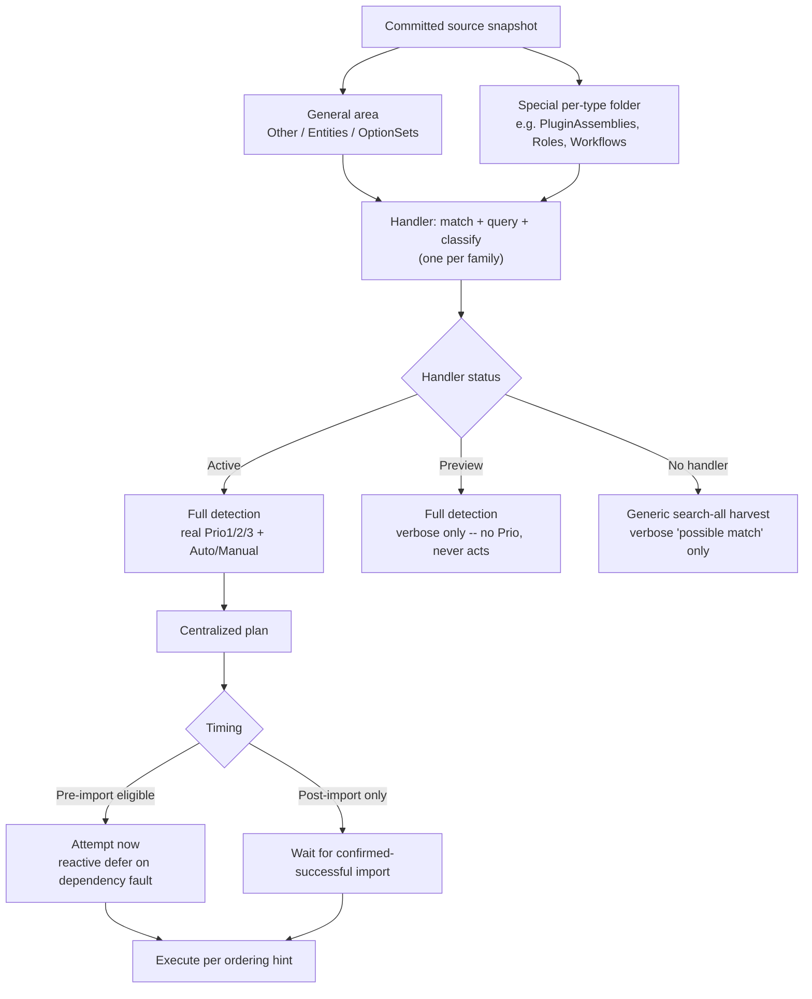

# Orphan-Cleanup Handler Architecture - Plan

## Goal Capsule

- **Objective:** replace `OrphanCleanupService`'s single, monolithic identity-resolution method with an extensible per-component-family handler architecture, and add a risk-priority classification (Prio1/Prio2/Prio3) alongside today's Auto/Manual axis.
- **Product authority:** `STRATEGY.md`'s "Drift detection + component cleanup" track — orphan-cleanup is the near-term focus of Flowline's broader drift-detection goal, which exists to remove the last credible reason unmanaged-solution users would choose managed instead (managed solutions auto-delete removed components and surface unmanaged-layer changes; unmanaged solutions have neither safety net today).
- **Open blockers:** none. The core architecture (handler shape, status model, classification axes, execution timing) is resolved; remaining unknowns are implementation-level and listed under Outstanding Questions.

---

## Product Contract

### Summary

Reorganize orphan-cleanup detection into independently-addable **handlers** — each owning match, live-query, and classification for one family of related component types — replacing the ad-hoc pile of special-case scanners `OrphanCleanupService` has accumulated over ten institutional-log revisions. Each handler self-declares its own maturity (Active / Preview), and every classified finding carries two independent axes: the existing Auto/Manual distinction, and a new Prio1 (blocks deployment) / Prio2 (silently still running deleted logic) / Prio3 (safe to clean up) risk tier.

### Problem Frame

Orphan-cleanup matters for three distinct reasons, not one, and today's implementation only distinguishes Auto-delete from Manual-review — it has no notion of *why* an orphan matters:

1. **Blocking** — some orphans prevent a deploy from succeeding at all. Updating a plugin assembly fails if plugin types or steps still reference classes removed from the assembly.
2. **Risky** — some orphans don't block anything, but keep silently executing logic that source no longer has: a Workflow, Flow, or plugin step still triggers on live data using deleted business logic.
3. **Hygiene** — the rest are harmless but should eventually be removed to keep the environment clean.

Separately, `OrphanCleanupService.cs` has grown into a single ~1240-line file whose identity-resolution logic is six parallel, partially-overlapping per-type lookup tables (`EntityNames`, `ManualTypeLabels`, `NameResolvableTypes`, `CustomApiIdAttributes`, `ResolvedTypeNameAttributes`, `SupportedManualTypes`) plus a growing set of bespoke entity-side-detection branches, one added per institutional-log part (6 through 10) as new component types needed support. Each addition has required touching the same shared functions and re-deriving the same false-positive guards from scratch — the exact failure mode part 9's three-bug regression came from. There is no way today to add support for a new component type without editing shared code, and no way to ship partial/experimental support for a type without it silently affecting the main report.

Two real unpacked solutions were inspected to ground the folder-structure assumptions below: `SpotlerAutomate.Dataverse/src/Solution` (a larger, more varied solution) and `MyFlowTest/solutions/Cr07982/Package` (a smaller one). Both confirm the same underlying shape: a small set of generically-structured areas (`Other`, `Entities`, `OptionSets`) that share one scan pattern across many component types, plus a growing list of special-purpose folders (`AppModules`, `AppModuleSiteMaps`, `Dashboards`, `environmentvariabledefinitions`, `PluginAssemblies`, `SdkMessageProcessingSteps`, `Roles`, `Workflows`, `WebResources`, `bots`, `customapis`, and — found during this grounding pass, not previously known to either side of this discussion — `dvtablesearchentities`/`dvtablesearchs`, a Dataverse Search feature keyed by GUID rather than schemaname), each with its own file/folder shape, matching key, and query strategy.

### Key Decisions

- **Per-family handlers, not per-componenttype.** A handler owns match + live-query + classify as one unit, for one family of related component types — grouped where detection logic already overlaps today (the CustomApi family already shares one entity-side-detection path; PluginAssembly/PluginType/Step/StepImage already share one dependency-ordered deletion chain). This formalizes a split that already exists implicitly in the code (`ParseSolutionXmlComponents`/`ScanEntitySubcomponents` as the de facto general-area handler; `ScanCustomApiNames`/`ScanBotSchemaNames`/`ScanConnectionReferenceLogicalNames` as ad-hoc special-type handlers) rather than inventing a new split.
- **General-area vs special-folder handlers.** Component types declared in the snapshot's generically-structured areas (`Other`, `Entities`, `OptionSets` — Solution.xml-declared, well-known scan pattern) are handled distinctly from types with their own dedicated per-type folder, each of which needs individual structural analysis (folder shape, matching key, live-query strategy) before a handler can be trusted with it.
- **Handler maturity is self-declared in code, not external config.** Each handler hardcodes its own status — the handler is the one place that knows its own confidence level, not a config file a user could misconfigure.
  - **Active** — full detection, real Prio1/2/3 classification, included in the actionable report, eligible for auto-delete when Auto.
  - **Preview** — full detection, verbose findings printed, but excluded from the Prio1/2/3 report and never acts. Lets a handler ship and be field-tested with zero action risk before being promoted to Active.
  - **No handler at all** — falls back to the existing generic search-all identifier-harvest pattern (`BuildLocalIdentifierHarvest`/`LogUnsupportedOrphansAsync`), already implemented today: a verbose "possible match found locally" signal, never prioritized, never acted on. This is not a new mechanism to build.
- **Two independent classification axes.** Auto/Manual (safe to auto-delete vs needs human review) stays a static property of the component type/handler, exactly as today. Prio1/Prio2/Prio3 is decided **inside the handler, per instance** — a type is only ever *capable* of a given Prio (e.g. a Workflow orphan is Prio2-risky only while `Activated`; a deactivated one is Prio3), and the handler inspects the live record to decide which applies.
- **Generic fallback gets no Prio.** A component type with no handler at all can't confidently know its own risk shape, so it never enters the Prio1/2/3 report — only Active/Preview handlers produce a real Prio verdict.
- **Centralized plan/execute, not per-handler execution.** Orphan-cleanup keeps a single plan-then-execute separation (preserving dry-run, matching today's `--no-delete`/`RunMode.NoDelete`), rather than each handler executing its own deletions. `PushCommand`'s `RegistrationPlan`/`PluginExecutor` pattern (one named field per type, hardcoded execution sequence in the executor) was considered and rejected as the model here: it works for Push's fixed set of 6 types, but would require editing a shared hardcoded sequence every time a new handler is added — exactly the coupling this architecture exists to remove.
- **Per-entry ordering hint, not a global position.** Each entry a handler returns carries a coarse ordering hint relative to its own family (leaf/child vs parent/container) rather than a position in one global sequence, so new handlers can be added without editing a shared execution order. Today's reactive dependency-deferral (attempt delete, catch the dependency fault, defer, retry post-import) is preserved unchanged as the safety net for cross-handler ordering surprises no hint anticipated.
- **Declared post-import-only, distinct from reactive deferral.** A component type can be known in advance to be unsafe or disallowed to delete before a successful import (e.g. a future Auto-eligible Attribute deletion) — a static, handler-level declaration, separate from the existing *reactive* deferral that only fires when a delete attempt actually throws a dependency fault. This is safe by construction: `DeployCommand.ImportSolutionAsync` already throws on a failed import before the command ever reaches the post-import phase (`DeployCommand.cs:267-268`, `:91`), so a post-import-only entry can never run against a failed or partial import.
- **Incremental rollout.** Ship the initial handler set from component types already verified today; grow coverage over time, informed by which types real users actually hit.

### Requirements

**Classification**

- R1. Every supported component type classifies findings on two independent axes: Auto vs Manual, and Prio1 (blocks deployment) / Prio2 (silently still running deleted logic) / Prio3 (safe to clean up).
- R2. Auto/Manual is a static property of the component type/handler, decided once — it never varies per instance.
- R3. Prio1/Prio2/Prio3 is decided per instance, inside the handler that owns the type. A type may be capable of more than one Prio outcome; the handler inspects the live record to decide which applies for a given finding.

**Handler architecture**

- R4. Component-type detection is organized into handlers, each owning match, live-query, and classify for one family of related component types, grouped where detection logic already overlaps.
- R5. Each handler declares its own maturity status in its own code: Active or Preview.
- R6. Active handlers produce actionable findings: included in the Prio1/2/3 report, and eligible for auto-delete when Auto.
- R7. Preview handlers run full detection and print verbose findings, but are excluded from the Prio1/2/3 report and never take any action.
- R8. Component types with no handler fall back to the existing generic search-all identifier-harvest pattern: a verbose "possible match" signal only, no Prio classification, never acted on.
- R9. A handler has read access to the entire snapshot below `Package/src`, not just its own component type's folder — it may reference any other folder (general-area or another special-type folder) when its matching or classification logic needs to.

**Execution ordering and timing**

- R10. Orphan-cleanup keeps a centralized plan-then-execute separation, supporting dry-run, rather than each handler executing its own deletions independently.
- R11. Each entry a handler returns carries a coarse ordering hint relative to its own family, rather than a global position among all handlers, so new handlers can be added without editing a shared execution sequence.
- R12. A component type may be declared post-import-only when it's known in advance to be unsafe before a successful import — distinct from reactive dependency-deferral, which defers only after a delete attempt actually fails.
- R13. The existing reactive dependency-deferral mechanism (attempt pre-import, catch the dependency fault, retry post-import) is preserved unchanged as the safety net for cross-handler dependencies no ordering hint anticipated.

**Rollout**

- R14. Ship the initial handler set from component types already verified today (the PluginAssembly family, WebResource, Workflow, the CustomApi family, Bot, ConnectionReference, Role, Entity, Attribute); grow coverage incrementally afterward.

### Handler Dispatch and Classification

### Scope Boundaries

**Deferred for later:**

- The reverse direction (surfacing what's added or modified in a target environment, rather than what's orphaned) — the handler shape should not preclude this later, but it is not this round's requirement.
- Expanding beyond the initial handler roster (R14) — additional types move from generic-fallback to Preview to Active over time, not all at once.
- Making Attribute deletion Auto — stays Manual this round; named as a plausible future candidate precisely because it's the example that motivated the declared post-import-only timing category.

**Outside this round (already deferred by the prior drift plan):**

- Content-hash change detection (detecting a component silently hand-edited rather than added/removed) — out of scope, unchanged from `docs/plans/2026-07-07-002-feat-drift-preview-diff-engine-plan.md`.

### Dependencies / Assumptions

- Builds on the existing `OrphanCleanupService` / `ComponentClassifier` / `DriftCommand` mechanism from the prior drift-preview work (`docs/plans/2026-07-07-002-feat-drift-preview-diff-engine-plan.md`). This plan reorganizes that mechanism's internals; it does not replace the `drift` command or its target-environment parameterization.
- Assumes `RunPostImportAsync` only ever executes after a confirmed-successful solution import — verified: `DeployCommand.ImportSolutionAsync` throws `FlowlineException(ExitCode.BuildFailed, ...)` on a non-zero PAC exit code, aborting the command before it reaches the post-import fan-out loop.
- Assumes the two solutions inspected for grounding (`SpotlerAutomate.Dataverse/src/Solution`, `MyFlowTest/solutions/Cr07982/Package`) are representative enough of real-world folder-shape variety to justify the general-area/special-folder split, though neither is exhaustive of every component type Dataverse supports.

### Outstanding Questions

**Deferred to planning:**

- Exact representation of the per-entry ordering hint (a simple enum like leaf/parent, an integer weight, or something else).
- Exact handler-to-family groupings beyond the examples named in Key Decisions (e.g. does AppModules pair with AppModuleSiteMaps as one handler, given they share a schemaname-keyed folder shape and likely reference each other?).
- How a Preview handler's verbose output should be visually distinguished from today's existing generic-fallback verbose output, so a user can tell "an experimental handler flagged this" apart from "nothing recognized this at all."
- Disposition of component types found unhandled during grounding but not previously discussed: Relationships (componenttype 3, `Other/Relationships.xml` + `Other/Relationships/<entity>.xml`), Formula columns (`Entities/<name>/Formulas/*.xaml`), and Ribbon customizations (`Entities/<name>/RibbonDiff.xml`) — generic-fallback, Preview, or Active in the initial rollout?

### Sources & Research

- `src/Flowline.Core/Services/OrphanCleanupService.cs` — current monolithic implementation; six parallel per-type lookup structures (`EntityNames`, `ManualTypeLabels`, `NameResolvableTypes`, `CustomApiIdAttributes`, `ResolvedTypeNameAttributes`, `SupportedManualTypes`) plus ad-hoc entity-side detection for CustomApi/Bot/ConnectionReference.
- `docs/solutions/architecture-patterns/orphan-cleanup-two-phase-deploy-pipeline.md` — institutional history (parts 1-10) of incremental, ad-hoc special-case additions to the current mechanism, including the part-9 regression this handler architecture is meant to structurally prevent from recurring.
- `SpotlerAutomate.Dataverse/src/Solution/src` and `MyFlowTest/solutions/Cr07982/Package/src` (external repos, inspected for grounding only) — real unpacked-solution folder structures confirming the general-area/special-folder split and surfacing `dvtablesearchentities`/`dvtablesearchs` (GUID-keyed) plus unhandled subcomponent shapes (`Entities/*/Formulas/*.xaml`, `Entities/*/RibbonDiff.xml`, `Other/Relationships.xml` + `Other/Relationships/*.xml`).
- `src/Flowline.Core/Models/RegistrationPlan.cs` and `src/Flowline.Core/Services/PluginExecutor.cs` — `PushCommand`'s plan/execute pattern, inspected and rejected as the execution-ordering model for this architecture (fixed named buckets + hardcoded executor sequence don't scale to independently-pluggable handlers).
- `src/Flowline/Commands/DeployCommand.cs:267-268`, `:81-91` — confirms `RunPostImportAsync` is unreachable after a failed import, which is what makes the declared post-import-only timing category safe by construction.
- `STRATEGY.md` — "Drift detection + component cleanup" track; the unmanaged-vs-managed-solution motivation for orphan-cleanup's product importance.
