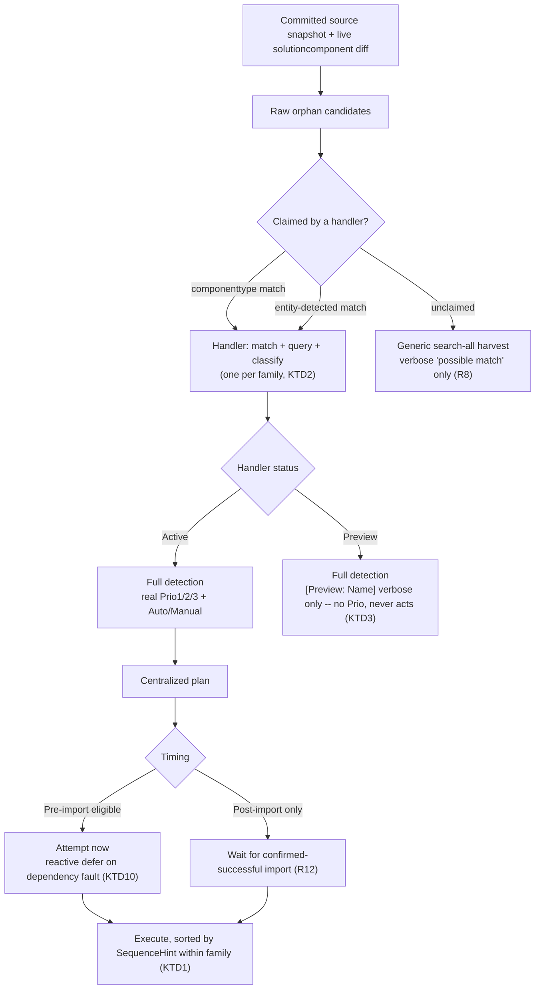

# Orphan-Cleanup Handler Architecture - Plan

## Goal Capsule

- **Objective:** replace `OrphanCleanupService`'s single, monolithic identity-resolution method with an extensible per-component-family handler architecture, and add a risk-priority classification (Prio1/Prio2/Prio3) alongside today's Auto/Manual axis.
- **Product authority:** `STRATEGY.md`'s "Drift detection + component cleanup" track — orphan-cleanup is the near-term focus of Flowline's broader drift-detection goal, which exists to remove the last credible reason unmanaged-solution users would choose managed instead (managed solutions auto-delete removed components and surface unmanaged-layer changes; unmanaged solutions have neither safety net today).
- **Open blockers:** none. The core architecture (handler shape, status model, classification axes, execution timing) is resolved; the Planning Contract below resolves the remaining implementation-level unknowns (ordering-hint representation, handler-to-family groupings, Preview-vs-fallback visual distinction, per-instance Prio rules). Component-type dispositions explicitly deferred by R14's incremental-rollout posture (Relationships, Formula columns, Ribbon customizations, AppModules pairing) stay deferred — see Scope Boundaries.
- **Execution profile:** land handlers incrementally (Implementation Units U2-U8 are independently shippable once U1 exists), then the orchestrator swap (U9), guarded by the existing `OrphanCleanupServiceTests` suite as a behavior-preservation baseline, followed by U10 and U11 which each depend only on U9 and can land independently of each other.
- **Product Contract preservation:** R1-R14 and Key Decisions are carried forward verbatim. Changed: Scope Boundaries (absorbed the two still-deferred Outstanding Questions — AppModules pairing, and the Relationships/Formula-column/Ribbon disposition — as explicit "Deferred for later" items) and Outstanding Questions (removed as a section; its other two questions — ordering-hint representation, Preview-vs-fallback visual distinction — are resolved into KTD1 and KTD3 below, not left open).

---

## Product Contract

### Summary

Reorganize orphan-cleanup detection into independently-addable **handlers** — each owning match, live-query, and classification for one family of related component types — replacing the ad-hoc pile of special-case scanners `OrphanCleanupService` has accumulated over ten institutional-log revisions. Each handler self-declares its own maturity (Active / Preview), and every classified finding carries two independent axes: the existing Auto/Manual distinction, and a new Prio1 (blocks deployment) / Prio2 (silently still running deleted logic) / Prio3 (safe to clean up) risk tier.

### Problem Frame

Orphan-cleanup matters for three distinct reasons, not one, and today's implementation only distinguishes Auto-delete from Manual-review — it has no notion of *why* an orphan matters:

1. **Blocking** — some orphans prevent a deploy from succeeding at all. Updating a plugin assembly fails if plugin types or steps still reference classes removed from the assembly.
2. **Risky** — some orphans don't block anything, but keep silently executing logic that source no longer has: a Workflow, Flow, or plugin step still triggers on live data using deleted business logic.
3. **Hygiene** — the rest are harmless but should eventually be removed to keep the environment clean.

Separately, `OrphanCleanupService.cs` has grown into a single ~1240-line file whose identity-resolution logic is six parallel, partially-overlapping per-type lookup tables (`EntityNames`, `ManualTypeLabels`, `NameResolvableTypes`, `CustomApiIdAttributes`, `ResolvedTypeNameAttributes`, `SupportedManualTypes`) plus a growing set of bespoke entity-side-detection branches, one added per institutional-log part (6 through 10) as new component types needed support. Each addition has required touching the same shared functions and re-deriving the same false-positive guards from scratch — the exact failure mode part 9's three-bug regression came from. There is no way today to add support for a new component type without editing shared code, and no way to ship partial/experimental support for a type without it silently affecting the main report.

Two real unpacked solutions were inspected to ground the folder-structure assumptions below: `SpotlerAutomate.Dataverse/src/Solution` (a larger, more varied solution) and `MyFlowTest/solutions/Cr07982/Package` (a smaller one). Both confirm the same underlying shape: a small set of generically-structured areas (`Other`, `Entities`, `OptionSets`) that share one scan pattern across many component types, plus a growing list of special-purpose folders (`AppModules`, `AppModuleSiteMaps`, `Dashboards`, `environmentvariabledefinitions`, `PluginAssemblies`, `SdkMessageProcessingSteps`, `Roles`, `Workflows`, `WebResources`, `bots`, `customapis`, and — found during this grounding pass, not previously known to either side of this discussion — `dvtablesearchentities`/`dvtablesearchs`, a Dataverse Search feature keyed by GUID rather than schemaname), each with its own file/folder shape, matching key, and query strategy.

### Key Decisions

- **Per-family handlers, not per-componenttype.** A handler owns match + live-query + classify as one unit, for one family of related component types — grouped where detection logic already overlaps today (the CustomApi family already shares one entity-side-detection path; PluginAssembly/PluginType/Step/StepImage already share one dependency-ordered deletion chain). This formalizes a split that already exists implicitly in the code (`ParseSolutionXmlComponents`/`ScanEntitySubcomponents` as the de facto general-area handler; `ScanCustomApiNames`/`ScanBotSchemaNames`/`ScanConnectionReferenceLogicalNames` as ad-hoc special-type handlers) rather than inventing a new split.
- **General-area vs special-folder handlers.** Component types declared in the snapshot's generically-structured areas (`Other`, `Entities`, `OptionSets` — Solution.xml-declared, well-known scan pattern) are handled distinctly from types with their own dedicated per-type folder, each of which needs individual structural analysis (folder shape, matching key, live-query strategy) before a handler can be trusted with it.
- **Handler maturity is self-declared in code, not external config.** Each handler hardcodes its own status — the handler is the one place that knows its own confidence level, not a config file a user could misconfigure.
  - **Active** — full detection, real Prio1/2/3 classification, included in the actionable report, eligible for auto-delete when Auto.
  - **Preview** — full detection, verbose findings printed, but excluded from the Prio1/2/3 report and never acts. Lets a handler ship and be field-tested with zero action risk before being promoted to Active.
  - **No handler at all** — falls back to the existing generic search-all identifier-harvest pattern (`BuildLocalIdentifierHarvest`/`LogUnsupportedOrphansAsync`), already implemented today: a verbose "possible match found locally" signal, never prioritized, never acted on. This is not a new mechanism to build.
- **Two independent classification axes.** Auto/Manual (safe to auto-delete vs needs human review) stays a static property of the component type/handler, exactly as today. Prio1/Prio2/Prio3 is decided **inside the handler, per instance** — a type is only ever *capable* of a given Prio (e.g. a Workflow orphan is Prio2-risky only while `Activated`; a deactivated one is Prio3), and the handler inspects the live record to decide which applies.
- **Generic fallback gets no Prio.** A component type with no handler at all can't confidently know its own risk shape, so it never enters the Prio1/2/3 report — only Active/Preview handlers produce a real Prio verdict.
- **Centralized plan/execute, not per-handler execution.** Orphan-cleanup keeps a single plan-then-execute separation (preserving dry-run, matching today's `--no-delete`/`RunMode.NoDelete`), rather than each handler executing its own deletions. `PushCommand`'s `RegistrationPlan`/`PluginExecutor` pattern (one named field per type, hardcoded execution sequence in the executor) was considered and rejected as the model here: it works for Push's fixed set of 6 types, but would require editing a shared hardcoded sequence every time a new handler is added — exactly the coupling this architecture exists to remove.
- **Per-entry ordering hint, not a global position.** Each entry a handler returns carries a coarse ordering hint relative to its own family (leaf/child vs parent/container) rather than a position in one global sequence, so new handlers can be added without editing a shared execution order. Today's reactive dependency-deferral (attempt delete, catch the dependency fault, defer, retry post-import) is preserved unchanged as the safety net for cross-handler ordering surprises no hint anticipated.
- **Declared post-import-only, distinct from reactive deferral.** A component type can be known in advance to be unsafe or disallowed to delete before a successful import (e.g. a future Auto-eligible Attribute deletion) — a static, handler-level declaration, separate from the existing *reactive* deferral that only fires when a delete attempt actually throws a dependency fault. This is safe by construction: `DeployCommand.ImportSolutionAsync` already throws on a failed import before the command ever reaches the post-import phase (`DeployCommand.cs:267-268`, `:91`), so a post-import-only entry can never run against a failed or partial import.
- **Incremental rollout.** Ship the initial handler set from component types already verified today; grow coverage over time, informed by which types real users actually hit.

### Requirements

**Classification**

- R1. Every supported component type classifies findings on two independent axes: Auto vs Manual, and Prio1 (blocks deployment) / Prio2 (silently still running deleted logic) / Prio3 (safe to clean up).
- R2. Auto/Manual is a static property of the component type/handler, decided once — it never varies per instance.
- R3. Prio1/Prio2/Prio3 is decided per instance, inside the handler that owns the type. A type may be capable of more than one Prio outcome; the handler inspects the live record to decide which applies for a given finding.

**Handler architecture**

- R4. Component-type detection is organized into handlers, each owning match, live-query, and classify for one family of related component types, grouped where detection logic already overlaps.
- R5. Each handler declares its own maturity status in its own code: Active or Preview.
- R6. Active handlers produce actionable findings: included in the Prio1/2/3 report, and eligible for auto-delete when Auto.
- R7. Preview handlers run full detection and print verbose findings, but are excluded from the Prio1/2/3 report and never take any action.
- R8. Component types with no handler fall back to the existing generic search-all identifier-harvest pattern: a verbose "possible match" signal only, no Prio classification, never acted on.
- R9. A handler has read access to the entire snapshot below `Package/src`, not just its own component type's folder — it may reference any other folder (general-area or another special-type folder) when its matching or classification logic needs to.

**Execution ordering and timing**

- R10. Orphan-cleanup keeps a centralized plan-then-execute separation, supporting dry-run, rather than each handler executing its own deletions independently.
- R11. Each entry a handler returns carries a coarse ordering hint relative to its own family, rather than a global position among all handlers, so new handlers can be added without editing a shared execution sequence.
- R12. A component type may be declared post-import-only when it's known in advance to be unsafe before a successful import — distinct from reactive dependency-deferral, which defers only after a delete attempt actually fails.
- R13. The existing reactive dependency-deferral mechanism (attempt pre-import, catch the dependency fault, retry post-import) is preserved unchanged as the safety net for cross-handler dependencies no ordering hint anticipated.

**Rollout**

- R14. Ship the initial handler set from component types already verified today (the PluginAssembly family, WebResource, Workflow, the CustomApi family, Bot, ConnectionReference, Role, Entity, Attribute); grow coverage incrementally afterward.

### Scope Boundaries

**Deferred for later:**

- The reverse direction (surfacing what's added or modified in a target environment, rather than what's orphaned) — the handler shape should not preclude this later, but it is not this round's requirement.
- Expanding beyond the initial handler roster (R14) — additional types move from generic-fallback to Preview to Active over time, not all at once. This includes AppModules/AppModuleSiteMaps (whether they pair as one handler given their shared schemaname-keyed folder shape is a question for whichever future round adds them) and the component types found unhandled during grounding — Relationships (componenttype 3), Formula columns (`Entities/<name>/Formulas/*.xaml`), and Ribbon customizations (`Entities/<name>/RibbonDiff.xml`) — all three fall to the existing generic-fallback signal (R8) until a future round gives them the same local-source verification the R14 roster already has.
- Making Attribute deletion Auto — stays Manual this round; named as a plausible future candidate precisely because it's the example that motivated the declared post-import-only timing category.
- Post-import Prio reclassification for reactively-deferred entries — a still-present, previously-deferred `PluginAssemblyFamilyHandler` orphan could arguably re-surface as Prio1 at post-import, but `RunPostImportAsync` only rebuilds `Action` today and `OrphanEntry` carries no Prio field to update. This round's Prio1 signal is `RunMode.NoDelete`-only (KTD8); teaching post-import re-classification a Prio value is future work.

**Outside this round (already deferred by the prior drift plan):**

- Content-hash change detection (detecting a component silently hand-edited rather than added/removed) — out of scope, unchanged from `docs/plans/2026-07-07-002-feat-drift-preview-diff-engine-plan.md`.

### Dependencies / Assumptions

- Builds on the existing `OrphanCleanupService` / `ComponentClassifier` / `DriftCommand` mechanism from the prior drift-preview work (`docs/plans/2026-07-07-002-feat-drift-preview-diff-engine-plan.md`). This plan reorganizes that mechanism's internals; it does not replace the `drift` command or its target-environment parameterization.
- Assumes `RunPostImportAsync` only ever executes after a confirmed-successful solution import — verified: `DeployCommand.ImportSolutionAsync` throws `FlowlineException(ExitCode.BuildFailed, ...)` on a non-zero PAC exit code, aborting the command before it reaches the post-import fan-out loop.
- Assumes the two solutions inspected for grounding (`SpotlerAutomate.Dataverse/src/Solution`, `MyFlowTest/solutions/Cr07982/Package`) are representative enough of real-world folder-shape variety to justify the general-area/special-folder split, though neither is exhaustive of every component type Dataverse supports.

### Sources & Research

- `src/Flowline.Core/Services/OrphanCleanupService.cs` — current monolithic implementation; six parallel per-type lookup structures (`EntityNames`, `ManualTypeLabels`, `NameResolvableTypes`, `CustomApiIdAttributes`, `ResolvedTypeNameAttributes`, `SupportedManualTypes`) plus ad-hoc entity-side detection for CustomApi/Bot/ConnectionReference.
- `docs/solutions/architecture-patterns/orphan-cleanup-two-phase-deploy-pipeline.md` — institutional history (parts 1-10) of incremental, ad-hoc special-case additions to the current mechanism, including the part-9 regression this handler architecture is meant to structurally prevent from recurring.
- `SpotlerAutomate.Dataverse/src/Solution/src` and `MyFlowTest/solutions/Cr07982/Package/src` (external repos, inspected for grounding only) — real unpacked-solution folder structures confirming the general-area/special-folder split and surfacing `dvtablesearchentities`/`dvtablesearchs` (GUID-keyed) plus unhandled subcomponent shapes (`Entities/*/Formulas/*.xaml`, `Entities/*/RibbonDiff.xml`, `Other/Relationships.xml` + `Other/Relationships/*.xml`).
- `src/Flowline.Core/Models/RegistrationPlan.cs` and `src/Flowline.Core/Services/PluginExecutor.cs` — `PushCommand`'s plan/execute pattern, inspected and rejected as the execution-ordering model for this architecture (fixed named buckets + hardcoded executor sequence don't scale to independently-pluggable handlers).
- `src/Flowline/Commands/DeployCommand.cs:267-268`, `:81-91` — confirms `RunPostImportAsync` is unreachable after a failed import, which is what makes the declared post-import-only timing category safe by construction.
- `STRATEGY.md` — "Drift detection + component cleanup" track; the unmanaged-vs-managed-solution motivation for orphan-cleanup's product importance.
- `src/Flowline.Core/Services/ComponentClassifier.cs` — the existing stateless, filesystem-only scan/parse primitives (`ParseLocalSource`, `ScanEntitySubcomponents`, `ScanCustomApiNames`, `ScanBotSchemaNames`, `ScanConnectionReferenceLogicalNames`, `ScanEntityAttributeLogicalNames`, `ScanShapeFolder`, `Classify`/`ComponentAction`) each new handler decomposes around; confirmed current as of this enrichment pass (no stale signatures from the two recent `refactor(drift)` commits).
- `src/Flowline.Core/Services/IPostDeployService.cs` — defines `PostDeployContext` and the `RunPreImportAsync`/`RunPostImportAsync` contract, unchanged by the two recent `refactor(drift)` commits (only the comparison engine was decoupled from `PostDeployContext`; the fan-out interface itself is untouched).
- `src/Flowline/Commands/DriftCommand.cs:45` — confirms the read-only `CompareAsync(packageFolder, ...)` overload this refactor must keep working unchanged.
- `tests/Flowline.Core.Tests/OrphanCleanupServiceTests.cs` — existing xUnit/NSubstitute test suite, synthetic in-memory `Solution.xml` fixtures (`Ctx`/`WriteSolutionXmlFixture`), the behavior-preservation baseline for this refactor (see Verification Contract).
- `docs/solutions/architecture-patterns/post-deploy-service-di-fanout-protocol.md` — precedent for the handler registry's `IEnumerable<T>` DI fan-out convention, including its documented silent-empty-on-missing-registration tradeoff (see KTD7).
- `docs/solutions/design-patterns/promoting-field-to-identity-key-changes-edit-semantics.md` — the "re-audit every existing consumer of the old classification" lesson this plan applies when introducing Prio1/2/3 as a new axis.
- `docs/solutions/logic-errors/secondary-match-predicate-missing-mode.md` — the parallel-code-path parity-bug pattern this plan's per-handler test scenarios and code review must guard against.
- `docs/solutions/integration-issues/dataverse-orphan-assembly-delete-blocked-by-step-dependencies.md` — this exact codebase's prior incident from bypassing canonical deletion order, grounding the centralized-execution Key Decision.
- `CONCEPTS.md` — "Orphan Cleanup" section (Orphan handler, Handler status, Orphan priority, Local-source identity shape) is already committed vocabulary; this plan uses those terms as defined there rather than restating them.

---

## Planning Contract

### Key Technical Decisions

- **KTD1 — Ordering hint is a small non-negative int, not an enum; cross-family order is an explicit list, not DI-registration order.** Each handler assigns each finding a `SequenceHint` (0 = executes first, i.e. deepest child in that handler's own family) scoped to that handler's family only; the centralized executor sorts entries within a family by ascending `SequenceHint`. This generalizes the existing flat `ExecutionOrder`/`CustomApiEntityOrder` arrays (already implicitly leaf-to-root int-ordered) without inventing new taxonomy — R11 only asks for "coarse," and a per-family int is coarser than a global enum would be. Cross-family order is **not** left to incidental DI-registration order (today's `Program.cs`-style `AddSingleton` call sequence, which a future unrelated edit could silently reorder) — the executor consults one small, explicitly-declared family-order list (mirroring today's single `ExecutionOrder` array's role as sole source of truth for cross-family sequencing: PluginAssembly family, WebResource, Workflow, CustomApi family, Bot, ConnectionReference, Role, Entity family), so adding a new handler means appending to one visible list, not depending on registration-line position. The existing reactive dependency-deferral (R13, KTD10 below) remains the safety net for any cross-family ordering surprise this list doesn't anticipate.
- **KTD2 — Handler-to-family groupings for the R14 roster.** Eight handler classes, delivered across seven Implementation Units (U6 bundles two classes since they share the entity-detected resolve-and-suppress shape), cover the nine component-type slots R14 names:
  | Handler | Component types / detection shape |
  |---|---|
  | `PluginAssemblyFamilyHandler` | PluginAssembly (91), PluginType (90), Step (92), StepImage (93) — componenttype-gated, existing `ExecutionOrder` subset |
  | `WebResourceHandler` | WebResource (61) — componenttype-gated, owns the `// flowline:depends` annotation exemption |
  | `WorkflowHandler` | Workflow (29) — componenttype-gated, owns the deactivate-before-delete step |
  | `CustomApiFamilyHandler` | CustomApi, CustomApiRequestParameter, CustomApiResponseProperty — entity-detected (env-specific componenttype), children-before-parent |
  | `BotHandler` | Bot — entity-detected |
  | `ConnectionReferenceHandler` | ConnectionReference — entity-detected |
  | `RoleHandler` | Role (20) — componenttype-gated, id-in-`LocalComponents` match already works today |
  | `EntityFamilyHandler` | Entity (1), Attribute (2) — grouped because Attribute detection is inherently entity-scoped (`ResolveAttributeInfoAsync`/`ScanEntityAttributeLogicalNames` both require the owning entity's logical name), mirroring how PluginAssembly groups parent+children by shared detection machinery |

  All eight ship **Active** — every type in R14's roster already has a verified local-source check in today's code (this is precisely why R14 named them). No handler in the initial roster ships Preview; Preview is reserved for a future type without that verification yet.
- **KTD3 — Preview vs generic-fallback visual distinction (resolves the former Outstanding Question).** A Preview handler's verbose line carries an explicit `[Preview: <HandlerName>]` prefix, distinct from the existing generic-fallback "not tracked yet, no action taken" phrasing — lets a user tell "an experimental handler flagged this" apart from "nothing recognized this at all." No handler ships Preview in this round (KTD2), so this only needs to exist as a capability U1 provides; it has no visible effect until a future handler uses it.
- **KTD4 — Entity-detected handlers query their own table independently.** `CustomApiFamilyHandler`, `BotHandler`, and `ConnectionReferenceHandler` each run their own live query (with their own `try`/`catch`) against their own backing table(s), rather than one shared batched dispatch across all five. This is a structural requirement, not an optimization: part 9's bug #1 was exactly a shared-`try`/`catch` failure domain widening when a batch grew from 3 to 5 queries (`docs/solutions/architecture-patterns/orphan-cleanup-two-phase-deploy-pipeline.md`). Per-handler query isolation makes that regression shape structurally impossible instead of relying on someone remembering to keep the `try`/`catch` granular.
- **KTD5 — Unresolved identity is always a skip, never an orphan.** Structural invariant for every handler: when a handler cannot resolve a candidate's live identity attribute, the candidate is skipped by that handler (falls through to the next-claiming handler, or generic fallback) — never classified as orphaned. Grounded in part 9's bug #2, where a copied helper defaulted "couldn't verify" to "verified as gone." Every handler's match/verify step must `continue`/skip on an unresolved lookup, matching the fix already applied to `ResolveEntityDetectedManualEntriesAsync` — this decision generalizes that fix into a rule new handlers can't accidentally violate by copying an older, unfixed pattern.
- **KTD6 — Business faults and infrastructure faults are handled distinctly.** Wherever a handler's live lookup gates a classification, it must catch the specific Dataverse business fault meaning "genuinely doesn't exist" (`FaultException<OrganizationServiceFault>`, mirroring `ResolveOptionSetMetadataIdsAsync`'s existing pattern) separately from other exceptions (network, auth, throttling), which must warn and skip rather than count as evidence of deletion. Grounded in part 9's bug #3.
- **KTD7 — Handler registry accepts the existing DI fan-out convention; guards it with a test, not a runtime throw.** The handler set is resolved as `IEnumerable<IOrphanHandler>` via DI, the same fan-out convention `IPostDeployService` already uses (`docs/solutions/architecture-patterns/post-deploy-service-di-fanout-protocol.md`). That convention's documented tradeoff — a missing registration silently resolves to zero handlers rather than throwing — is accepted here for consistency rather than special-cased. U9 adds a test asserting all eight R14 handler classes are actually registered, catching a dropped registration at CI time instead of silently in production, without introducing a runtime behavior inconsistent with the existing convention. This guard is a **standing convention, not a one-time ship-time check**: R14's incremental-rollout posture means future handlers will be added after this round, and `HandlerRegistryTests`' expected set must be updated every time a handler is added or the guard silently stops covering the newest addition — the same fan-out convention that makes a dropped registration a silent no-op instead of a throw.
- **KTD8 — Per-instance Prio rules for the R14 roster (directional defaults).** Decided per instance inside each handler, per R3. These are initial rules grounded in what's inspectable today; refine against real-org findings during rollout, matching R14's own "grow coverage over time" posture:
  | Handler | Auto/Manual | Prio1 | Prio2 | Prio3 (default) |
  |---|---|---|---|---|
  | `PluginAssemblyFamilyHandler` | Auto | `RunMode.NoDelete` is active — this is the only signal `DetectionContext` carries at classify time (see note below on why the reactively-deferred case is out of scope this round) | `RunMode.NoDelete` is not active, and the live PluginType/Step is Enabled | cleanup is expected to complete before import |
  | `WebResourceHandler` | Auto | never | never (no live business-logic execution) | always |
  | `WorkflowHandler` | Auto | never | `statecode` = Activated | `statecode` = Deactivated |
  | `CustomApiFamilyHandler` | Auto | never | always — the CustomApi record is itself the callable surface and stays invocable until deleted | n/a |
  | `BotHandler` | Manual | never | Bot is Published/live | Bot is unpublished/draft |
  | `ConnectionReferenceHandler` | Manual | never | always — a live connection reference remains usable by anything still holding its logical name | n/a |
  | `RoleHandler` | Manual | never | never (roles don't execute logic) | always |
  | `EntityFamilyHandler` | Manual | never | never | always |

  **Timing note on `PluginAssemblyFamilyHandler`'s Prio1 rule:** `CompareAsync` classifies before `ExecuteInOrderAsync` runs, so at the pre-import classify step a handler cannot yet know whether *this run's* deletion attempt will itself fault and defer — only `RunMode.NoDelete` is knowable then. A still-present, previously-deferred entry re-surfacing at post-import as genuinely still-blocking (and so arguably still Prio1) would require `RunPostImportAsync` to re-run classification, not just rebuild `Action` as it does today (`entry with { Action = action }`) — `OrphanEntry` has no Prio field to update and no unit in this plan adds one. Rather than ship an unresolved reclassification path, Prio1 for this round is `NoDelete`-only; post-import Prio reclassification for deferred entries is explicit follow-up work (see Scope Boundaries), not a gap silently left in the shipped code.
- **KTD9 — Prio1/Prio2/Prio3 requires an audit of existing Auto/Manual/report/suppress consumers.** Introducing a second, orthogonal classification axis is the same shape as the `PluginPlanner` incident in `docs/solutions/design-patterns/promoting-field-to-identity-key-changes-edit-semantics.md`, where a reclassification silently stopped covering a case a downstream consumer still assumed was routed the old way. U9 and U10 must grep every existing consumer of `OrphanAction`/`OrphanEntry` (report printing, execution grouping, cross-solution warnings) and verify each still handles every Prio value correctly, not just compiles. Where `OrphanPriority` is switched over, prefer a switch expression with no `default` arm so the compiler (`CS8509`) flags an incomplete case list on any future change to the enum, rather than relying solely on this one-time grep pass.
- **KTD10 — Centralized execution generalizes, reactive deferral stays untouched.** `ExecuteInOrderAsync` is generalized to sort/execute by each entry's handler-declared `SequenceHint` and `Timing`, replacing the static `ExecutionOrder`/`CustomApiEntityOrder` arrays. The existing `IsDependencyError`-triggered reactive deferral (attempt, catch fault code `0x80047002`/"depend" message, defer, retry post-import) is preserved unchanged as R13 requires — this generalization only changes what decides the *attempt* order, never the fault-handling/deferral behavior. Grounded in `docs/solutions/integration-issues/dataverse-orphan-assembly-delete-blocked-by-step-dependencies.md`, which documents a prior incident from bypassing the canonical deletion order in this same codebase — a strong argument for keeping exactly one code path that decides deletion order.

### High-Level Technical Design

`IOrphanHandler` (directional shape, not literal C#): a `Status` (Active/Preview) and a detect step that takes a `DetectionContext` (packageSrcRoot, live service, solutionName, mode — primitives, not `PostDeployContext`, matching the comparison engine's existing shape per KTD-equivalent already in `OrphanCleanupService.cs`) plus the batch of still-unclaimed raw candidates, and returns findings carrying `ObjectId`, `ComponentType`/`EntityName`, `DisplayName`, the handler's static Auto/Manual, a per-instance Prio, a `SequenceHint`, and a `Timing` (PreImportEligible/PostImportOnly). "Match" is **not** a cheap synchronous predicate for every handler: `PluginAssemblyFamilyHandler`/`WebResourceHandler`/`WorkflowHandler`/`RoleHandler`/`EntityFamilyHandler` can match by componenttype alone, but the three entity-detected handlers (`CustomApiFamilyHandler`, `BotHandler`, `ConnectionReferenceHandler`) can only tell whether a candidate is theirs by querying their own backing table — for those, match and detect are the same batched async call, mirroring how `IdentifyEntityDetectedTypesAsync` already works today (one bulk `IN`-query per table, per KTD4). The orchestrator hands each entity-detected handler the full still-unclaimed batch once, not one candidate at a time. `OrphanCleanupService` becomes the orchestrator: run the existing raw-candidate comparison unchanged, dispatch the componenttype-gated handlers by cheap predicate first, then hand the remainder to the entity-detected handlers as one batch each, falling back to the existing generic harvest for anything still unclaimed, aggregate Active-handler findings into the Prio-tagged report, print Preview-handler findings verbose-only, and execute the centralized plan per KTD1/KTD10.

### Assumptions

- The eight R14 handler classes reproduce today's exact classification outcome for every existing test case in `OrphanCleanupServiceTests.cs` — this refactor reorganizes, it does not change behavior for any currently-supported type. Any behavior change (e.g. a Prio value, a changed Manual/Auto default) is a defect, not an intended side effect of this round.
- `DetectionContext` carries enough of `PostDeployContext`'s fields (service, solutionName, mode, packageSrcRoot, environmentUrl) for every handler's needs; if a handler discovers it needs a field not yet on `DetectionContext`, add it there rather than reaching back into `PostDeployContext`.
- No handler in this round needs data from outside `Package/src` (e.g. the packed plugin assembly's own type list) to resolve Prio1 for `PluginAssemblyFamilyHandler` — KTD8's `RunMode`/deferral-based rule avoids that need. If real-org testing shows this rule is too coarse, revisit the assembly-content-inspection approach as follow-up work.

### Sequencing

Land in dependency order: **U1** (contract/types/registry) unblocks everything else. **U2-U8** (seven Implementation Units delivering the eight handler classes — U6 delivers two) are independently shippable once U1 exists and can land in any order or in parallel — each is a self-contained migration of one family's existing logic with no cross-handler coupling. **U9** (orchestrator swap) depends on all of U1-U8 landing first, since it retires the old branching in favor of dispatching to the full handler set. **U10** (report rendering) and **U11** (post-import-only timing hookup) depend on U9. Each handler unit (U2-U8) is verified against the existing `OrphanCleanupServiceTests.cs` cases for that family before U9 begins — this is the behavior-preservation gate the Execution note on each unit calls for.

---

## Implementation Units

### Unit Index

| U-ID | Title | Files touched | Depends on |
|---|---|---|---|
| U1 | Handler contract, shared types, and registry | `OrphanCleanup/IOrphanHandler.cs`, `HandlerStatus.cs`, `OrphanPriority.cs`, `OrphanTiming.cs`, `DetectionContext.cs`, `HandlerFinding.cs` | none |
| U2 | `PluginAssemblyFamilyHandler` | `OrphanCleanup/Handlers/PluginAssemblyFamilyHandler.cs` | U1 |
| U3 | `WebResourceHandler` | `OrphanCleanup/Handlers/WebResourceHandler.cs` | U1 |
| U4 | `WorkflowHandler` | `OrphanCleanup/Handlers/WorkflowHandler.cs` | U1 |
| U5 | `CustomApiFamilyHandler` | `OrphanCleanup/Handlers/CustomApiFamilyHandler.cs` | U1 |
| U6 | `BotHandler` + `ConnectionReferenceHandler` | `OrphanCleanup/Handlers/BotHandler.cs`, `ConnectionReferenceHandler.cs` | U1 |
| U7 | `RoleHandler` | `OrphanCleanup/Handlers/RoleHandler.cs` | U1 |
| U8 | `EntityFamilyHandler` | `OrphanCleanup/Handlers/EntityFamilyHandler.cs` | U1 |
| U9 | Orchestrator swap | `OrphanCleanupService.cs` | U1-U8 |
| U10 | Prio1/2/3 report rendering | `OrphanCleanupService.cs` (`PrintReport`) | U9 |
| U11 | Post-import-only timing hookup | `OrphanCleanupService.cs` (`RunPreImportAsync`/`RunPostImportAsync`) | U9 |

### U1. Handler contract, shared types, and registry

- **Goal:** introduce the `IOrphanHandler` contract and the shared types every handler and the orchestrator depend on, with no behavior change yet (nothing consumes this contract until U2-U9).
- **Requirements:** R4, R5, R9, R11, R12.
- **Dependencies:** none.
- **Files:**
  - `src/Flowline.Core/Services/OrphanCleanup/IOrphanHandler.cs` (new)
  - `src/Flowline.Core/Services/OrphanCleanup/HandlerStatus.cs` (new — Active/Preview enum)
  - `src/Flowline.Core/Services/OrphanCleanup/OrphanPriority.cs` (new — Prio1/Prio2/Prio3/None enum)
  - `src/Flowline.Core/Services/OrphanCleanup/OrphanTiming.cs` (new — PreImportEligible/PostImportOnly enum)
  - `src/Flowline.Core/Services/OrphanCleanup/DetectionContext.cs` (new — primitives: packageSrcRoot, service, solutionName, environmentUrl, mode, entityLogicalNames — the last is required by U8's `ResolveAttributeInfoAsync`-driven check, which today takes it as an explicit parameter rather than deriving it from `packageSrcRoot` alone)
  - `src/Flowline.Core/Services/OrphanCleanup/HandlerFinding.cs` (new — ObjectId, ComponentType/EntityName, DisplayName, Auto/Manual, Prio, SequenceHint, Timing)
  - `tests/Flowline.Core.Tests/OrphanCleanup/HandlerRegistryTests.cs` (new)
- **Approach:** mirror `IPostDeployService`'s existing shape (`src/Flowline.Core/Services/IPostDeployService.cs`) for consistency — a small interface, DI-resolved as `IEnumerable<IOrphanHandler>` (KTD7). `DetectionContext` takes primitives, not `PostDeployContext`, matching the comparison engine's already-established KTD12 pattern.
- **Patterns to follow:** `IPostDeployService`'s interface shape and DI registration convention; `CompareResult`'s existing `Skipped`-vs-empty distinction as a model for HandlerFinding's own must-be-unambiguous states.
- **Test scenarios:**
  - Registering zero handlers resolves `IEnumerable<IOrphanHandler>` to an empty sequence without throwing (documents KTD7's accepted convention).
  - Test expectation: none beyond the registry-arity guard below — this unit is pure type/interface scaffolding with no branching logic of its own.
  - `HandlerRegistryTests`: a test asserting the production DI container registers exactly the eight R14 handler classes (added once U2-U8 exist; stub/skip until then, or land as part of U9 instead if that ordering is cleaner in practice).
- **Verification:** project compiles with the new types; no existing test behavior changes (nothing calls into these types yet).

### U2. `PluginAssemblyFamilyHandler`

- **Goal:** migrate PluginAssembly/PluginType/Step/StepImage (91/90/92/93) detection, classification, and ordering into a handler, preserving today's exact behavior.
- **Requirements:** R1, R2, R3, R4, R6, R9, R11, R14.
- **Dependencies:** U1.
- **Files:**
  - `src/Flowline.Core/Services/OrphanCleanup/Handlers/PluginAssemblyFamilyHandler.cs` (new)
  - `tests/Flowline.Core.Tests/OrphanCleanup/Handlers/PluginAssemblyFamilyHandlerTests.cs` (new)
- **Approach:** move the `NameResolvableTypes` entries for 91/90/92/93 and the `ExecutionOrder` subset `[93, 92, 90, 91]` into this handler's own `SequenceHint` assignment, preserving all four original positions: StepImage = 0, Step = 1, PluginType = 2, PluginAssembly = 3. Prio per KTD8: Prio1 when `DetectionContext.Mode == RunMode.NoDelete`; Prio2 when the live PluginType/Step is Enabled; else Prio3 (see KTD8's timing note on the deferred-arm Prio1 case, which this handler does not implement).
- **Execution note:** start from a characterization test that runs today's `OrphanCleanupServiceTests` PluginAssembly-family cases against this handler directly, confirming identical Auto/Manual output and ordering before adding the new Prio assertions.
- **Patterns to follow:** existing `NameResolvableTypes`/`GetEntityNamesAsync` name-resolution pattern; `TryExecuteEntryAsync`'s dependency-fault handling stays in the orchestrator (U9), not duplicated here.
- **Test scenarios:**
  - Happy path: an orphaned PluginType/Step/StepImage/Assembly resolves to `Action.Delete` with the correct name, same as today.
  - Edge case: `RunMode.NoDelete` active → Prio1, not Prio2/Prio3.
  - Edge case: live PluginType is Disabled → Prio3, not Prio2.
  - Edge case: live Step is Enabled → Prio2.
  - Integration: `SequenceHint` ordering places StepImage before Step before PluginType before PluginAssembly for a mixed batch, matching today's `ExecutionOrder` exactly (no ties).
- **Verification:** `PluginAssemblyFamilyHandlerTests` passes; existing `OrphanCleanupServiceTests` PluginAssembly-family assertions still pass once U9 wires this handler in.

### U3. `WebResourceHandler`

- **Goal:** migrate WebResource (61) detection and the `// flowline:depends` annotation exemption into a handler.
- **Requirements:** R1, R2, R3, R4, R6, R9, R14.
- **Dependencies:** U1.
- **Files:**
  - `src/Flowline.Core/Services/OrphanCleanup/Handlers/WebResourceHandler.cs` (new)
  - `tests/Flowline.Core.Tests/OrphanCleanup/Handlers/WebResourceHandlerTests.cs` (new)
- **Approach:** move `ExemptAnnotationReferencedWebResourcesAsync`'s annotation-scan logic into this handler's detect step, reading `WebResourceAnnotationParser.CollectAllReferences` from `DetectionContext.PackageSrcRoot`. Prio is a constant Prio3 (KTD8 — WebResource never executes business logic).
- **Execution note:** characterize against today's `OrphanCleanupServiceTests` WebResource cases, including the annotation-exemption cases, before adding new assertions.
- **Test scenarios:**
  - Happy path: an orphaned WebResource with no annotation reference resolves to Delete, Prio3.
  - Edge case: a WebResource referenced via `// flowline:depends` in another web resource is exempted (not reported as orphan), matching today's behavior exactly.
  - Integration: exemption reads from `Package/src/WebResources`, never `WebResources/dist`.
- **Verification:** `WebResourceHandlerTests` passes; existing WebResource assertions in `OrphanCleanupServiceTests` still pass once wired into U9.

### U4. `WorkflowHandler`

- **Goal:** migrate Workflow (29) detection, deactivate-before-delete, and per-instance Prio into a handler.
- **Requirements:** R1, R2, R3, R4, R6, R9, R14.
- **Dependencies:** U1.
- **Files:**
  - `src/Flowline.Core/Services/OrphanCleanup/Handlers/WorkflowHandler.cs` (new)
  - `tests/Flowline.Core.Tests/OrphanCleanup/Handlers/WorkflowHandlerTests.cs` (new)
- **Approach:** Prio per KTD8: query the live `statecode` — Activated → Prio2, Deactivated → Prio3. `TryDeactivateWorkflowAsync`'s deactivate-before-delete mechanic stays in the orchestrator's execution step (U9), since it's an execution-time action, not a classification decision — the handler only needs to read `statecode` for Prio.
- **Execution note:** this is the plan's canonical Prio2 example (also documented in `CONCEPTS.md`'s Orphan priority entry) — write the Activated-vs-Deactivated test first since it's the clearest specification of what Prio2 means.
- **Test scenarios:**
  - Happy path: orphaned deactivated Workflow → Delete, Prio3.
  - Edge case: orphaned Activated Workflow → Delete, Prio2.
  - Integration: execution still deactivates before delete, matching today's `TryDeactivateWorkflowAsync` behavior (verified in U9, not duplicated here).
- **Verification:** `WorkflowHandlerTests` passes; existing Workflow assertions in `OrphanCleanupServiceTests` still pass once wired into U9.

### U5. `CustomApiFamilyHandler`

- **Goal:** migrate the CustomApi/CustomApiRequestParameter/CustomApiResponseProperty entity-detected family into a handler with its own independent query (KTD4).
- **Requirements:** R1, R2, R3, R4, R6, R9, R14.
- **Dependencies:** U1.
- **Files:**
  - `src/Flowline.Core/Services/OrphanCleanup/Handlers/CustomApiFamilyHandler.cs` (new)
  - `tests/Flowline.Core.Tests/OrphanCleanup/Handlers/CustomApiFamilyHandlerTests.cs` (new)
- **Approach:** own query against `customapi`/`customapirequestparameter`/`customapiresponseproperty` (KTD4 — not the shared `IdentifyEntityDetectedTypesAsync` batch), each in its own `try`/`catch` per part-9's fix. Cross-check against `ComponentClassifier.ScanCustomApiNames` (uniquename is the only local identity — a recreated CustomApi with the same uniquename must not be reported). `SequenceHint`: request-param/response-property = 0, customapi = 1 (children before parent, matching today's `CustomApiEntityOrder`). Prio2 always (KTD8 — the CustomApi record itself is the live callable surface).
- **Execution note:** characterize against today's CustomApi test cases, including the recreated-uniquename false-positive guard, before adding Prio assertions.
- **Test scenarios:**
  - Happy path: an orphaned CustomApi with no matching local uniquename resolves to Delete, Prio2.
  - Edge case: a recreated CustomApi (same uniquename, new `customapiid`) is not reported (still declared locally).
  - Edge case: an unresolvable identity (query fails for this candidate) is skipped, not reported as orphaned (KTD5).
  - Error path: the `customapiresponseproperty` table query fails — `customapi`/`customapirequestparameter` detection is unaffected (KTD4 isolation test).
  - Error path: a business fault (candidate genuinely not found) is distinguished from an infrastructure fault (network/auth/throttle) — the latter warns and skips rather than counting as evidence of deletion (KTD6).
  - Integration: `SequenceHint` places request-param/response-property before customapi for a mixed batch.
- **Verification:** `CustomApiFamilyHandlerTests` passes, including the KTD4 isolation test; existing CustomApi assertions in `OrphanCleanupServiceTests` still pass once wired into U9.

### U6. `BotHandler` and `ConnectionReferenceHandler`

- **Goal:** migrate the two remaining entity-detected types into their own independently-querying handlers, sharing the existing generic resolve-and-suppress helper shape without sharing a query batch.
- **Requirements:** R1, R2, R3, R4, R6, R9, R14.
- **Dependencies:** U1.
- **Files:**
  - `src/Flowline.Core/Services/OrphanCleanup/Handlers/BotHandler.cs` (new)
  - `src/Flowline.Core/Services/OrphanCleanup/Handlers/ConnectionReferenceHandler.cs` (new)
  - `tests/Flowline.Core.Tests/OrphanCleanup/Handlers/BotHandlerTests.cs` (new)
  - `tests/Flowline.Core.Tests/OrphanCleanup/Handlers/ConnectionReferenceHandlerTests.cs` (new)
- **Approach:** each handler owns its own query against its own table (KTD4), reusing `ResolveEntityDetectedManualEntriesAsync`'s existing shape (or an equivalent internal helper each handler calls independently) — per KTD5, an unresolved identity is skipped, not reported, matching the fix already applied to this helper after part 9's bug #2. Bot Prio: Published/live → Prio2, unpublished/draft → Prio3. ConnectionReference Prio2 always (KTD8 — a live connection reference remains usable by anything still holding its logical name).
- **Execution note:** characterize against today's Bot and ConnectionReference test cases first — these are the two types part 9's regression actually touched, so the existing tests are the most direct behavior-preservation signal for this unit.
- **Test scenarios:**
  - Happy path (Bot): an orphaned unpublished Bot resolves to Manual, Prio3.
  - Edge case (Bot): an orphaned Published Bot resolves to Manual, Prio2.
  - Happy path (ConnectionReference): an orphaned ConnectionReference resolves to Manual, Prio2.
  - Edge case: an unresolvable identity for either type is skipped, not reported (KTD5 — this is the exact bug 2 regression shape; write this test from the part-9 write-up, not just from current code).
  - Error path: a query failure for one type does not affect detection for the other (KTD4 isolation, mirroring bug 1's shared-`try`/`catch` regression).
  - Error path: a business fault is distinguished from an infrastructure fault for both Bot and ConnectionReference lookups (KTD6, mirroring bug 3's regression).
- **Verification:** both handler test files pass, including the KTD4/KTD5 regression-shaped tests; existing Bot/ConnectionReference assertions in `OrphanCleanupServiceTests` still pass once wired into U9.

### U7. `RoleHandler`

- **Goal:** migrate Role (20) detection into a handler.
- **Requirements:** R1, R2, R3, R4, R6, R9, R14.
- **Dependencies:** U1.
- **Files:**
  - `src/Flowline.Core/Services/OrphanCleanup/Handlers/RoleHandler.cs` (new)
  - `tests/Flowline.Core.Tests/OrphanCleanup/Handlers/RoleHandlerTests.cs` (new)
- **Approach:** Role's id is already declared directly in Solution.xml's RootComponent and mirrored in the unpacked `Roles/<name>.xml` file, so the existing plain id-in-`LocalComponents` match already resolves it correctly — this handler mainly wraps the existing `NameResolvableTypes`-driven name lookup. Prio3 always (KTD8 — roles don't execute logic).
- **Test scenarios:**
  - Happy path: an orphaned Role resolves to Manual, Prio3, with its resolved name.
  - Test expectation: no dedicated false-positive guard scenario needed beyond the existing id-match path — Role needs no new local-source scanner (already true today).
- **Verification:** `RoleHandlerTests` passes; existing Role assertions in `OrphanCleanupServiceTests` still pass once wired into U9.

### U8. `EntityFamilyHandler`

- **Goal:** migrate Entity (1) and Attribute (2) detection into one handler, preserving the existing Entity/Attribute false-positive guards.
- **Requirements:** R1, R2, R3, R4, R6, R9, R14.
- **Dependencies:** U1.
- **Files:**
  - `src/Flowline.Core/Services/OrphanCleanup/Handlers/EntityFamilyHandler.cs` (new)
  - `tests/Flowline.Core.Tests/OrphanCleanup/Handlers/EntityFamilyHandlerTests.cs` (new)
- **Approach:** `ResolveEntityMetadataIdsAsync` stays exactly where it is today — a centralized, pre-diff step in the orchestrator that folds declared entity roots into `sNewIds` *before* the raw orphan diff runs, so `EntityFamilyHandler` never re-verifies entity declaration itself (duplicating that check per-candidate would create the exact parallel-code-path parity-bug shape `docs/solutions/logic-errors/secondary-match-predicate-missing-mode.md` warns against). This handler's job starts after the diff: claim componenttype 1/2 candidates that already survived it, and apply `ResolveAttributeInfoAsync`/`ScanEntityAttributeLogicalNames`-driven attribute-level verification (the false-positive guard for Attribute orphans, which has no pre-diff equivalent today). Prio3 always for both Entity and Attribute (KTD8 — hygiene, human review before removal given data-loss risk, but not blocking or risk-executing).
- **Test scenarios:**
  - Happy path: an orphaned Entity resolves to Manual, Prio3.
  - Happy path: an orphaned Attribute resolves to Manual, Prio3, with `<entity>.<attribute>` display name.
  - Edge case: an Attribute still declared in `Entity.xml` is suppressed (not reported), matching today's false-positive guard.
  - Edge case: an Attribute whose owning entity has no `entityLogicalNames` context is reported without the local cross-check (matches today's fallback path).
- **Verification:** `EntityFamilyHandlerTests` passes; existing Entity/Attribute assertions in `OrphanCleanupServiceTests` still pass once wired into U9.

### U9. Orchestrator swap: `OrphanCleanupService` dispatches to handlers

- **Goal:** retire the inline per-type branching in `CompareAsync`/`BuildManualEntriesAsync`/`ExecuteInOrderAsync` in favor of dispatching to the U1-U8 handler set, completing the architecture change.
- **Requirements:** R1, R3, R6, R7, R8, R9, R10, R11, R13.
- **Dependencies:** U1, U2, U3, U4, U5, U6, U7, U8.
- **Files:**
  - `src/Flowline.Core/Services/OrphanCleanupService.cs` (modify — dispatch loop, `ExecuteInOrderAsync` generalization)
  - `tests/Flowline.Core.Tests/OrphanCleanupServiceTests.cs` (modify — this is the behavior-preservation baseline; existing cases must keep passing, add handler-registry-arity and Prio-report assertions)
  - `tests/Flowline.Core.Tests/OrphanCleanup/HandlerRegistryTests.cs` (modify — complete the arity guard stubbed in U1)
- **Approach:** for the raw orphan candidate set (the existing `sOld - sNewIds` diff, unchanged), first claim by componenttype against `PluginAssemblyFamilyHandler`/`WebResourceHandler`/`WorkflowHandler`/`RoleHandler`/`EntityFamilyHandler`; then hand the remainder as one batch each to the three entity-detected handlers (`CustomApiFamilyHandler`, `BotHandler`, `ConnectionReferenceHandler` — match and detect are one batched call for these, per the Planning Contract's HTD note); anything still unclaimed falls through to the existing generic-fallback path (`BuildLocalIdentifierHarvest`/`LogUnsupportedOrphansAsync`, unchanged, R8). Active-handler findings feed the Prio-tagged report (U10); Preview-handler findings print verbose-only (none in this round per KTD2, but the branch must exist). `ExecuteInOrderAsync` sorts by each entry's `SequenceHint` within its family (KTD1) instead of the static `ExecutionOrder`/`CustomApiEntityOrder` arrays, executing families in a single explicit, centrally-declared family order (not implicit DI-registration order — see KTD1) so cross-family sequencing keeps the same single-source-of-truth guarantee `ExecutionOrder` provides today; the `IsDependencyError`-triggered reactive-deferral logic in `TryExecuteEntryAsync` is untouched (KTD10, R13).
- **Execution note:** this is the highest-risk unit in the plan — before changing `CompareAsync`'s branching, run the full existing `OrphanCleanupServiceTests` suite to confirm it's green as a baseline, then refactor with that suite red/green as the primary signal. Do not weaken or skip any existing assertion to make this unit pass (KTD9's audit obligation applies here first).
- **Patterns to follow:** the existing `CompareAsync`/`ExecuteInOrderAsync` split (comparison vs execution) stays intact — this unit reorganizes what feeds each side, not the split itself.
- **Test scenarios:**
  - Integration: every existing `OrphanCleanupServiceTests` case (one per currently-supported type) produces identical `OrphanEntry`/action output after the dispatch-loop rewrite.
  - Integration: a candidate matching no handler still reaches the existing generic-fallback verbose signal, unchanged.
  - Integration: `SequenceHint`-based execution order matches today's `ExecutionOrder`/`CustomApiEntityOrder` output for a mixed batch spanning multiple handlers.
  - Edge case: a pre-import delete attempt that faults with a dependency error is still deferred to post-import and retried there, unchanged (R13 regression guard).
  - `HandlerRegistryTests`: DI container resolves exactly the eight R14 handler classes (KTD7 arity guard).
- **Verification:** full `OrphanCleanupServiceTests` suite green with no assertions weakened or removed; `HandlerRegistryTests` arity guard passes.

### U10. Report rendering: Prio1/2/3 report and Preview visual distinction

- **Goal:** extend `PrintReport` to show Prio1/2/3 for Active-handler findings and the `[Preview: <HandlerName>]` marker for Preview-handler verbose output (KTD3).
- **Requirements:** R1, R6, R7.
- **Dependencies:** U9.
- **Files:**
  - `src/Flowline.Core/Services/OrphanCleanupService.cs` (modify — `PrintReport`)
  - `tests/Flowline.Core.Tests/OrphanCleanupServiceTests.cs` (modify — report-format assertions via `TestConsole`)
- **Approach:** group the Active-handler report by Prio (Prio1 first — these block deployment) in addition to today's Action grouping. Per KTD9, audit every existing `PrintReport` consumer/assertion for whether it implicitly assumed the old two-group (Action-only) shape.
- **Test scenarios:**
  - Happy path: a report with mixed Prio1/2/3 entries renders Prio1 entries first, grouped, with visible Prio labels.
  - Test expectation: none for the Preview marker beyond a rendering-format assertion — no handler ships Preview this round (KTD2), so this only needs a synthetic test exercising the code path directly, not an integration case through a real handler.
- **Verification:** `TestConsole`-captured report output matches the new format in both existing (no Prio1/2 present) and new (Prio1/2 present) scenarios.

### U11. Declared post-import-only timing hookup

- **Goal:** wire `OrphanTiming.PostImportOnly` (R12) into `RunPreImportAsync`/`RunPostImportAsync` as a mechanism, even though no handler in this round declares it (KTD2 — Attribute-Auto, the motivating future use case, is explicitly deferred). R12 is a Product Contract requirement carried forward from the upstream brainstorm, not an implementation-time invention — this unit exists to satisfy R12 as a real, working capability rather than leave it as an unimplemented enum value, accepting that its only test coverage is a synthetic entry until a real handler declares `PostImportOnly`.
- **Requirements:** R12, R13.
- **Dependencies:** U9.
- **Files:**
  - `src/Flowline.Core/Services/OrphanCleanupService.cs` (modify — `RunPreImportAsync`, `RunPostImportAsync`)
  - `tests/Flowline.Core.Tests/OrphanCleanupServiceTests.cs` (modify)
- **Approach:** entries with `Timing == PostImportOnly` are excluded from the pre-import execution pass entirely (never attempted, never subject to reactive deferral) and unconditionally attempted post-import, distinct from the reactive-deferral retry path (which only retries entries that already faulted pre-import). Both paths converge on the same `ExecuteInOrderAsync` call.
- **Test scenarios:**
  - Edge case: a synthetic `PostImportOnly` entry (no real handler produces one yet, so this test constructs one directly) is never attempted pre-import.
  - Edge case: the same entry is attempted post-import unconditionally, independent of whether any dependency-deferral occurred.
  - Integration: `RunPostImportAsync` still only executes when `DeployCommand.ImportSolutionAsync` succeeded (regression guard for the existing Dependencies/Assumptions claim — no new test needed if `DeployCommand`'s own tests already cover this; confirm during implementation and cite rather than duplicate).
- **Verification:** new `OrphanCleanupServiceTests` cases for `PostImportOnly` pass; no existing pre-import/post-import test changes behavior.

---

## Verification Contract

- **Build:** `dotnet build Flowline.slnx`.
- **Full test suite:** `dotnet test Flowline.slnx` — must be green with no `[Skip]`/weakened assertions before any unit in this plan is considered done.
- **Targeted suite during development:** `dotnet test tests/Flowline.Core.Tests/Flowline.Core.Tests.csproj --filter FullyQualifiedName~OrphanCleanup`.
- **Behavior-preservation gate:** the pre-refactor `OrphanCleanupServiceTests.cs` run (captured before U2 starts) is the baseline every handler unit (U2-U8) and the orchestrator swap (U9) is diffed against — no case may change outcome unless the plan explicitly says so (only new Prio assertions are additive; Auto/Manual/Delete/RemoveFromSolution/Manual outcomes must be unchanged).
- **KTD4/KTD5/KTD6 regression-shaped tests are mandatory, not optional:** each entity-detected handler (U5, U6) must include the per-table-failure-isolation test (KTD4), the unresolved-identity-is-skipped test (KTD5), and a test verifying a business fault (record genuinely gone) and an infrastructure fault (network/auth/throttle) are handled distinctly at every live-lookup gating a classification (KTD6) — these three are the direct guards against the part-9 regression this plan exists to structurally prevent.
- **KTD9 audit:** before U9/U10 are marked done, grep every call site of `OrphanAction`, `OrphanEntry.Action`, and `PrintReport` outside the files this plan modifies, confirming none silently assumes the pre-Prio two-value shape.

---

## Definition of Done

- All eleven implementation units (U1-U11) land with their listed test scenarios passing.
- `dotnet test Flowline.slnx` is green, including the full pre-existing `OrphanCleanupServiceTests.cs` suite unmodified in outcome (only additive Prio/report-format assertions).
- No dead code remains from the old inline branching in `OrphanCleanupService.cs` — `EntityNames`, `ManualTypeLabels`, `NameResolvableTypes`, `CustomApiIdAttributes`, `ResolvedTypeNameAttributes`, `SupportedManualTypes`, `ExecutionOrder`, and `CustomApiEntityOrder` are either migrated into their owning handler or removed if fully superseded; no orphaned experiment code from an abandoned approach is left in the diff.
- `HandlerRegistryTests` confirms all eight R14 handler classes are registered (KTD7), and its expected set is updated whenever a future handler is added.
- `CONCEPTS.md`'s existing Orphan Cleanup vocabulary (Orphan handler, Handler status, Orphan priority) still accurately describes the shipped implementation — update only if implementation revealed a genuine drift from those definitions, not to restate them.
- Every KTD1-KTD10 decision is reflected in the shipped code as described; any deviation discovered during implementation is called out explicitly rather than silently diverging from the plan.
