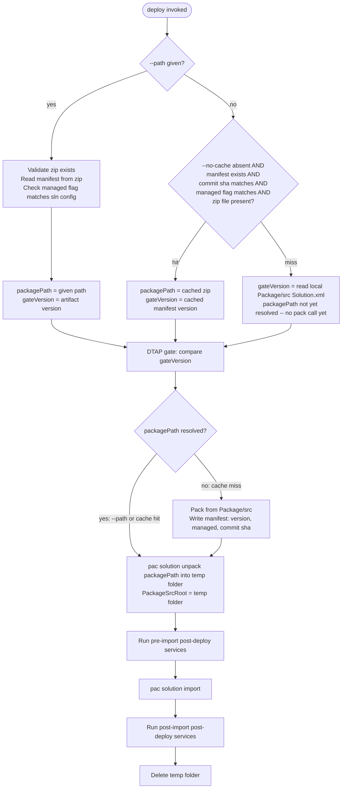

# Deploy Artifact Reuse and --path Import - Plan

## Goal Capsule

- **Objective:** `flowline deploy` accepts `--path <zip>` to import a pre-built artifact directly, and by default reuses the last artifact packed for the current source commit instead of repacking — when promotions run sequentially from one machine, promoting through test → uat → prod builds once and reuses the same bytes with no new command and no flag required. CI pipelines that run each DTAP tier on a separate/ephemeral runner get the same guarantee via `--path` plus the CI system's own artifact transport, not the flagless default.
- **Authority hierarchy:** This plan's Key Technical Decisions govern the approach. Where an assumption below (PAC CLI flag names, `Solution.xml` element or archive-path names) turns out wrong against real `pac` output, the real behavior wins — adjust the implementation, not the plan's intent.
- **Stop conditions:** Flag and pause if `pac solution unpack` requires flags materially different from what's assumed in U5, if `Solution.xml`'s managed indicator isn't at `SolutionManifest/Managed`, or if a packed zip's internal path for `Solution.xml` isn't `Other/Solution.xml`.
- **Execution profile:** Local implementation and testing only.
- **Tail ownership:** Implementer commits locally. No push, no PR — explicit instruction for this run.

---

## Product Contract

### Summary

Add `--path <zip>` to `flowline deploy` so it can import an existing packed solution artifact instead of always repacking from source, matching `pac solution import --path`'s own flag name. Make artifact reuse the transparent default when `--path` is omitted: `deploy` caches the last packed zip against the git commit that produced it, so re-deploying the same unchanged source to the next DTAP tier reuses that exact zip rather than producing a fresh one.

### Problem Frame

`DeployCommand.PackSolutionAsync` (`src/Flowline/Commands/DeployCommand.cs:253-281`) packs from `Package/src` on every `deploy` call. Promoting "the same version" through test → uat → prod therefore produces three independently-packed zips with no guarantee they're byte-identical — the DTAP gate (`DeployCommand.cs:185-219`) only compares version *numbers*, never artifact identity. Separately, post-deploy services receive `PostDeployContext.PackageSrcRoot` (`src/Flowline.Core/Services/IPostDeployService.cs:20-25`) as a direct pointer at `Package/src` (`DeployCommand.cs:106`) — an assumption that only holds because deploy always packs from that exact folder. Once an externally-supplied artifact can be imported, that assumption breaks: `OrphanCleanupService` would evaluate orphan components against source that may not match what's actually being imported.

### Requirements

**Artifact import**
- R1. `flowline deploy` accepts `--path <zip>`, mirroring `pac solution import --path` (already invoked internally at `DeployCommand.cs:292`), to import a specific pre-built artifact instead of packing from source.
- R2. When `--path` is given, the artifact's embedded managed/unmanaged flag must match the solution's configured `IncludeManaged`, or deploy fails before attempting import.
- R3. When `--path` is given, the DTAP gate compares against the version embedded in that artifact, not the local working tree's `Solution.xml`.
- R4. When `--path` is given, `deploy` skips `ValidateGitCleanAsync`'s git-clean check and `ValidateLocalState`'s Dataverse-drift check for the solution folder — neither is meaningful for an externally-supplied artifact that wasn't necessarily packed from the current local tree.

**Default build-once-promote-many**
- R5. When `--path` is omitted, `deploy` reuses a previously packed artifact for the same solution, managed flag, and source commit instead of repacking — no new flag or command needed for this default behavior.
- R6. Packed artifacts are never committed to git; the existing gitignored `solutions/<Name>/artifacts/` folder remains the only storage location.
- R7. `--no-cache` forces a fresh pack even when a cached artifact would otherwise match, reusing the existing global flag rather than introducing a second cache-bypass flag.

**Post-deploy correctness**
- R8. Post-deploy services that read `PackageSrcRoot` always evaluate the actual content of the zip being imported — whether freshly packed, reused from cache, or supplied via `--path` — never an assumed-current local source tree.

### Scope Boundaries

- **Deferred to Follow-Up Work:** Caching or skipping the Solution Checker gate for a reused artifact. Natural pairing with this cache, but already independently scoped as Idea 5 in `docs/ideation/2026-07-05-contoso-alm-comparison-ideation.html:410-440`.
- **Deferred to Follow-Up Work:** Consolidating `DeployCommand.PackSolutionAsync` (`DeployCommand.cs:253`) with the near-duplicate `PacUtils.PackSolutionAsync` (`src/Flowline/Utils/PacUtils.cs:177`) used by `sync`/`clone`. Not touched here.
- **Outside this plan's identity:** A remote or shared artifact store (blob storage, GitHub Releases). Cross-job CI artifact transport is left to the CI system's own mechanism (upload/download-artifact); Flowline only accepts a local file path via `--path`.
- **Outside this plan's identity:** Git-committing packed artifacts. Contradicts the existing `[Aa]rtifacts/` gitignore rule (`.gitignore:16`) and the folder's documented ephemeral status (`CloneCommand.cs:191` doc comment: "packed solution zips (gitignored, regenerated by pack)").
- **Outside this plan's identity:** A separate `flowline pack`/`flowline build` command. `deploy` stays the single entry point.

### Alternatives Considered

- **Always require `--path`, no auto-cache.** R1 alone already gives byte-identical reuse: pack once, pass the same zip path at every tier. Rejected as the *only* mechanism because it pushes bookkeeping onto the user — remembering and re-typing the correct zip path across three separate command invocations, possibly days apart. A dropped or mistyped `--path` silently falls back to a fresh (and possibly different) pack with no warning. The auto-cache (R5) makes the safe behavior the default with zero user action, while `--path` (R1) stays available as the explicit override and the CI escape hatch.

---

## Planning Contract

### Key Technical Decisions

- **KTD1 — Flag name `--path`, not `--zip`/`--solution-zip`.** Mirrors `pac solution import --path`, which `DeployCommand` already invokes internally (`DeployCommand.cs:292`). Zero new vocabulary for anyone already familiar with PAC CLI.
- **KTD2 — Cache key is (managed flag, last-commit-sha touching `slnFolder`), not a content hash.** `ValidateGitCleanAsync` (`DeployCommand.cs:221-228`, called unconditionally at `DeployCommand.cs:61`) already requires a clean working tree in `slnFolder` before this point in the flow runs. That makes `HEAD`'s last commit touching the folder a reliable, already-enforced signature of "what would be packed right now" — no need to hash `Package/src` directly. This holds even if `pac solution pack` turns out to be byte-deterministic for identical input: the cache still avoids a second and third redundant pack subprocess call, and it guarantees artifact identity by construction (reusing the same file) rather than by relying on an undocumented behavior of a third-party CLI that could change across `pac` versions.
- **KTD3 — No remote/shared artifact store.** The existing gitignored `solutions/<Name>/artifacts/` folder (already used identically by `clone`, `sync`, and `deploy`) is enough for single-machine/sequential-session promotion. Cross-job CI promotion is `--path` plus the CI system's own artifact transport — not reinvented here.
- **KTD4 — Always unpack the about-to-be-imported zip into a temp folder for `PackageSrcRoot`.** Replaces the direct `Package/src` reference at `DeployCommand.cs:106`. One code path is correct for all three `packagePath` origins (fresh pack, cache-reuse, `--path`), instead of branching "copy `Package/src`" vs. "unpack zip" by origin — and it stays correct even if a `--path` artifact was built from a different commit than what's currently checked out.
- **KTD5 — Generalize `ReadLocalSolutionVersion` into a shared manifest parser.** Reused for both local-source and zip-embedded `Solution.xml`, keeping the existing method's signature and behavior intact for its current callers (`DeployCommand.cs:360-376`).
- **KTD6 — `--no-cache` busts the artifact-reuse cache.** Reuses the existing global `--no-cache` flag (`FlowlineSettings.cs:16-18`, "Re-run all pre-flight checks instead of using cached results") rather than adding a second, redundant cache-bypass flag — one flag, one mental model for "ignore whatever Flowline cached and start fresh."

### High-Level Technical Design

The DTAP gate must keep running *before* any expensive work, matching today's ordering (`ValidateDtapGateAsync` at `DeployCommand.cs:64`, well before the pack call at `DeployCommand.cs:104`). So version resolution for the gate is split from artifact resolution: the gate version comes from a cheap read (the artifact zip's embedded manifest, the cached manifest, or the local `Solution.xml`) in every branch, and the actual `pac solution pack` subprocess only runs — on a cache miss — *after* the gate has already passed.



### Assumptions

- `Solution.xml`'s managed indicator lives at `SolutionManifest/Managed`, parallel to the existing `SolutionManifest/Version` read by `ReadLocalSolutionVersion` (`DeployCommand.cs:367-370`). Confirm against a real packed `Solution.xml` at implementation time; adjust `ParseSolutionManifest` if the element differs.
- `pac solution unpack` takes `--zipfile`/`--folder`, mirroring `pac solution pack`'s `--zipFile`/`--folder` already used at `DeployCommand.cs:269-270`, plus whatever flags are required for a clean unpack into an empty temp folder (e.g. `--allowWrite`/`--allowDelete`). Confirm exact flags against `pac solution unpack -h` at implementation time.
- The packed zip's internal path for `Solution.xml` is `Other/Solution.xml`, mirroring the unpacked `Package/src` layout. Confirm against a real packed zip at implementation time; adjust `ReadArtifactSolutionManifest`'s entry lookup if the archive layout differs.
- The cache sidecar is a small JSON file co-located with the zip (`<zip-path>.manifest.json`), not a separate folder — keeps `artifacts/` flat, consistent with its existing "packed solution zips" description (`CloneCommand.cs:191`).

---

## Implementation Units

### U1. Shared solution-manifest parsing (local source and artifact zip)

**Goal:** Extract version + managed-flag parsing into a reusable pure method, and add a variant that reads the same information from inside a packed zip.

**Requirements:** R2, R3, R5 (foundation for cache/path validation)

**Dependencies:** none

**Files:**
- `src/Flowline/Commands/DeployCommand.cs`
- `tests/Flowline.Tests/DeployCommandSolutionManifestTests.cs` (new)

**Approach:** Extract `internal static (string Version, bool Managed) ParseSolutionManifest(XDocument doc)` reading `SolutionManifest/Version` and `SolutionManifest/Managed` from an already-loaded `Solution.xml` document. Keep `ReadLocalSolutionVersion(string packageFolderPath)` (`DeployCommand.cs:360-376`) as a thin wrapper that loads the file and delegates, unchanged in signature and behavior. Add `internal static (string Version, bool Managed) ReadArtifactSolutionManifest(string zipPath)` that opens the zip via `System.IO.Compression.ZipFile`, reads the `Other/Solution.xml` entry, and delegates to `ParseSolutionManifest`. Wrap the zip-open/entry-read in a try/catch translating any exception from `ZipFile` (e.g. `InvalidDataException` for a corrupt or non-zip file) into `FlowlineException(ExitCode.ValidationFailed, ...)` naming the zip path — otherwise an invalid `--path` file would surface as a raw stack trace via `Program.cs`'s generic exception handler instead of the clean errors the rest of `DeployCommand` produces.

**Patterns to follow:** `ReadLocalSolutionVersion`'s existing error handling — `FlowlineException(ExitCode.NotFound, ...)` for a missing file, `FlowlineException(ExitCode.ValidationFailed, ...)` for a missing/empty version.

**Test scenarios:**
- `ParseSolutionManifest`: document with `Version=1.0.0.1`, `Managed=1` → returns `("1.0.0.1", true)`.
- `ParseSolutionManifest`: `Managed=0` → returns `Managed: false`.
- `ParseSolutionManifest`: missing `Version` element → throws `FlowlineException` with `ExitCode.ValidationFailed` (matches current `ReadLocalSolutionVersion` behavior).
- `ReadArtifactSolutionManifest`: zip file doesn't exist → throws `FlowlineException` with `ExitCode.NotFound`.
- `ReadArtifactSolutionManifest`: zip exists but has no `Other/Solution.xml` entry → throws `FlowlineException` with `ExitCode.NotFound`, message names the zip path.
- `ReadArtifactSolutionManifest`: file exists but isn't a valid zip archive (e.g. truncated or wrong file type) → throws `FlowlineException` with `ExitCode.ValidationFailed`, not a raw `InvalidDataException`.
- `ReadArtifactSolutionManifest`: valid fixture zip (built in test setup via `ZipArchive.CreateEntry`) → returns the correct `(Version, Managed)`.

**Verification:** `dotnet test tests/Flowline.Tests/Flowline.Tests.csproj --filter DeployCommandSolutionManifestTests` passes.

---

### U2. `git log`-based source signature for cache keying

**Goal:** Add a helper that returns the last commit SHA touching a path, used as the cache's source-identity signature.

**Requirements:** R5

**Dependencies:** none

**Files:**
- `src/Flowline/Utils/GitUtils.cs`
- `tests/Flowline.Tests/GitUtilsTests.cs`

**Approach:** Add `GitUtils.GetLastCommitShaForPathAsync(string path, string? workingDirectory = null, SubprocessCapture? capture = null, CancellationToken cancellationToken = default)` running `git log -1 --format=%H -- <path>`, mirroring `GetUncommittedChangesInPathAsync`'s relative-path handling for the pathspec (`GitUtils.cs:141-161`). Returns `null` when the path has no commits yet (new, uncommitted solution folder) rather than throwing — the cache simply misses in that case.

**Patterns to follow:** `GetUncommittedChangesInPathAsync` (`GitUtils.cs:141-161`) for command shape, working-directory handling, and relative-path conversion for the `--` pathspec.

**Test scenarios:**
- Repo with a committed file under the path → returns the same SHA as `git rev-parse HEAD` (use the existing `ReadGitOutput` test helper in `GitUtilsTests.cs:45-60`).
- Path with no commits touching it yet → returns `null`.
- Two commits touching the path → second call (after the second commit) returns the newer SHA, not the first.
- Path outside any git repo — mirror `GetUncommittedChangesInPathAsync_WithNonExistentPath_ShouldReturnEmptyList` (`GitUtilsTests.cs:143-150`) and return `null` rather than throwing.

**Verification:** `dotnet test tests/Flowline.Tests/Flowline.Tests.csproj --filter GitUtilsTests` passes.

---

### U3. Local build-once artifact cache (default reuse across promotions)

**Goal:** When `--path` is not given, resolve the DTAP gate's version cheaply and reuse a previously packed artifact instead of repacking whenever the source commit and managed flag haven't changed — deferring the actual pack subprocess until after the gate passes.

**Requirements:** R5, R6, R7

**Dependencies:** U1, U2

**Files:**
- `src/Flowline/Commands/DeployCommand.cs`
- `tests/Flowline.Tests/DeployCommandArtifactCacheTests.cs` (new)

**Approach:** Introduce an `internal sealed record ArtifactCacheEntry(string Version, bool Managed, string CommitSha)` — named distinctly from U1's `ReadArtifactSolutionManifest` to avoid confusion between "the cache's own bookkeeping record" and "data read from inside a zip" — serialized as JSON to `<packagePath>.manifest.json`, co-located with the zip in `slnFolder/artifacts/`. Add a pure decision method `internal static bool ArtifactCacheHit(ArtifactCacheEntry? entry, string? currentCommitSha, bool wantManaged)` — `true` only when `entry` is non-null, `entry.CommitSha == currentCommitSha`, and `entry.Managed == wantManaged`. Loading the sidecar file: if it exists but fails to deserialize (e.g. a partial write left by a previously killed process), treat that the same as "absent" (cache miss) rather than letting the exception propagate — the sidecar is a disposable cache the tool itself owns, not a source of truth.

Split resolution into two steps so the DTAP gate keeps running before any expensive work, matching today's ordering (`ValidateDtapGateAsync` at `DeployCommand.cs:64`, before the pack call at `DeployCommand.cs:104`):
1. **Gate version resolution (cheap, no subprocess):** compute `currentCommitSha` via U2, load the sidecar if present, and check `ArtifactCacheHit` plus `File.Exists(packagePath)`. When `settings.NoCache` is set, skip this check entirely and treat it as a miss (R7). On a hit, the gate version is the cached entry's version. On a miss, the gate version is read directly from local `Package/src/Other/Solution.xml` via the existing `ReadLocalSolutionVersion` — no packing yet.
2. **Artifact resolution (deferred, runs only after the gate passes):** on a hit, `packagePath` is the cached zip, unchanged. On a miss, pack now via the existing `pac solution pack` call, then write a fresh `ArtifactCacheEntry` sidecar.

**Technical design:**
```
ResolveGateVersion(sln, slnFolder, noCache):
  sha = GetLastCommitShaForPathAsync(slnFolder)
  entry = noCache ? null : ReadCacheEntryIfExists(manifestPath)   // deserialize failure -> null, same as absent
  if ArtifactCacheHit(entry, sha, sln.IncludeManaged) and File.Exists(packagePath):
    return (version: entry.Version, willReuse: true)
  return (version: ReadLocalSolutionVersion(slnFolder), willReuse: false)   // no pack call yet

// called only after ValidateDtapGateAsync has passed
ResolveArtifact(willReuse, sha, sln, slnFolder):
  if willReuse:
    return packagePath                          // cached zip, unchanged
  packagePath = Pack(sln, slnFolder)             // existing pac solution pack call, now deferred past the gate
  WriteCacheEntry(manifestPath, version, sln.IncludeManaged, sha)
  return packagePath
```

**Patterns to follow:** `PacUtilsTests.cs`'s convention of testing pure decision logic directly rather than the CliWrap call.

**Test scenarios:**
- `ArtifactCacheHit`: entry SHA matches current, managed flag matches → `true`.
- `ArtifactCacheHit`: entry SHA differs from current → `false`.
- `ArtifactCacheHit`: entry managed flag differs from requested (e.g. cached unmanaged, deploying managed) → `false`.
- `ArtifactCacheHit`: `entry` is `null` (no prior artifact) → `false`.
- `ArtifactCacheHit`: `currentCommitSha` is `null` (uncommitted solution folder) → `false`.
- Cache-entry loading: sidecar file exists but contains invalid/truncated JSON → treated as absent (cache miss), not thrown.
- `--no-cache` given → gate-version resolution always misses regardless of a matching sidecar, falling back to reading the local `Solution.xml`.
- Test expectation: none — the end-to-end "deploy test then deploy uat with unchanged source reuses the same zip bytes" scenario is not automatable; `DeployCommand` has no execution test harness (`docs/solutions/architecture-patterns/post-deploy-service-di-fanout-protocol.md:76`). Verify manually: run `deploy` twice against two different target URLs with no source changes in between and confirm the second run logs a reuse message and skips the pack step.

**Verification:** `dotnet test tests/Flowline.Tests/Flowline.Tests.csproj --filter DeployCommandArtifactCacheTests` passes; manual two-deploy reuse check above.

---

### U4. `--path <zip>` flag — explicit artifact import

**Goal:** Let `deploy` import a caller-supplied zip directly, bypassing packing, the U3 cache, and the local-tree-specific preflight checks that don't apply to an externally-supplied artifact.

**Requirements:** R1, R2, R3, R4

**Dependencies:** U1, U3

**Files:**
- `src/Flowline/Commands/DeployCommand.cs`
- `tests/Flowline.Tests/DeployCommandDtapGateTests.cs` (extend)

**Approach:** Add `[CommandOption("--path <zip>")] public string? Path { get; set; }` to `Settings` (`DeployCommand.cs:19-52`). In `ExecuteFlowlineAsync`, when `settings.Path` is set:
- Skip `ValidateGitCleanAsync` and `ValidateLocalState`'s drift check (R4) — both assume `packagePath` was derived from the current local tree, which doesn't hold for an externally supplied artifact.
- Validate the file exists (`FlowlineException(ExitCode.NotFound, ...)`), read `(artifactVersion, artifactManaged)` via U1's `ReadArtifactSolutionManifest`, and validate the managed flag via a new `internal static void ValidateArtifactManagedFlag(bool artifactManaged, bool solutionIncludeManaged)` that throws `FlowlineException(ExitCode.ValidationFailed, ...)` naming both the artifact's flag and the solution's configured mode on mismatch.
- Set `packagePath = settings.Path` and use `artifactVersion` directly as the gate version — skip U3's `ResolveGateVersion`/`ResolveArtifact` entirely.

Refactor `ValidateDtapGateAsync` (`DeployCommand.cs:185-219`) to accept the already-resolved gate version as a parameter instead of calling `ReadLocalSolutionVersion` internally, so the caller passes the artifact's version (`--path`) or U3's `ResolveGateVersion` result, keeping the gate's position in the flow unchanged from today (before any pack subprocess call).

**Test scenarios:**
- `--path` given, file missing → `FlowlineException` with `ExitCode.NotFound`.
- `ValidateArtifactManagedFlag`: artifact `Managed=true`, solution `IncludeManaged=false` → throws `FlowlineException` with `ExitCode.ValidationFailed`.
- `ValidateArtifactManagedFlag`: flags match → no exception.
- `ValidateDtapGateAsync`'s refactored signature: existing scenarios in `DeployCommandDtapGateTests.cs` continue to pass unchanged when the version parameter is supplied explicitly instead of read from disk — regression check, not new coverage.
- Code-review check (not a unit test — `DeployCommand` has no execution harness): the `--path` branch in `ExecuteFlowlineAsync` does not call `ValidateGitCleanAsync` or `ValidateLocalState`.

**Verification:** `dotnet test tests/Flowline.Tests/Flowline.Tests.csproj --filter "DeployCommandDtapGateTests|DeployCommandSolutionManifestTests"` passes.

---

### U5. Always unpack the imported zip for `PackageSrcRoot`

**Goal:** Replace the direct `Package/src` reference passed to post-deploy services with an unpack of whatever zip is actually about to be imported, so `OrphanCleanupService` always evaluates real imported content.

**Requirements:** R8

**Dependencies:** U3, U4 (runs after `packagePath` is finalized, regardless of origin)

**Files:**
- `src/Flowline/Utils/PacUtils.cs`
- `src/Flowline/Commands/DeployCommand.cs`

**Approach:** Add `PacUtils.UnpackSolutionAsync(string zipPath, string destinationFolder, SubprocessCapture capture, CancellationToken cancellationToken)` running `pac solution unpack --zipfile <zipPath> --folder <destinationFolder>` (plus any additional flags confirmed per the Assumptions section), mirroring `PackSolutionAsync`'s (`PacUtils.cs:177-213`) CliWrap shape and `FlowlineException(ExitCode.BuildFailed, ...)` error handling on non-zero exit. In `DeployCommand.ExecuteFlowlineAsync`, replace `var packageSrcRoot = Path.Combine(PackageFolder(slnFolder), "src");` (`DeployCommand.cs:106`) with: create a temp directory (`Path.Combine(Path.GetTempPath(), "flowline-deploy-" + Guid.NewGuid())`) and call `UnpackSolutionAsync(packagePath, tmpDir, ...)` **inside** the same `try` block whose `finally` deletes `tmpDir` — not only around the later pre-import/import/post-import sequence — so a failure inside `UnpackSolutionAsync` itself (e.g. `pac solution unpack` exits non-zero) still cleans up the partially-created temp directory. Set `packageSrcRoot = tmpDir` once unpack succeeds.

**Patterns to follow:** `PackSolutionAsync` (`PacUtils.cs:177-213`) for the CliWrap invocation shape and error mapping.

**Test scenarios:**
- `UnpackSolutionAsync`: non-zero `pac` exit code → throws `FlowlineException` with `ExitCode.BuildFailed` (test the error-mapping logic directly, following `PacUtilsTests.cs`'s pattern of faking the subprocess boundary).
- Test expectation: none for the temp-directory lifecycle itself — `DeployCommand` has no execution test harness. Verify manually: run `deploy` against a real target, confirm orphan-cleanup output (reported/deleted components) is unchanged from before this change, and confirm the temp directory is gone after the command exits — including after a forced failure inside `UnpackSolutionAsync` and after a forced failure later during import.

**Verification:** `dotnet test tests/Flowline.Tests/Flowline.Tests.csproj --filter PacUtilsTests` passes; manual deploy-and-inspect check above.

---

### U6. Documentation

**Goal:** Document the new `--path` flag and the default artifact-reuse behavior.

**Requirements:** R1, R5 (user-facing surface)

**Dependencies:** U4, U3

**Files:**
- `E:\Code\RemyDuijkeren\Flowline.wiki\03-Command-Reference.md` (sibling wiki repo — absolute path noted per `CLAUDE.md`'s wiki-location instruction, since it lives outside this repo)
- `docs/solutions/architecture-patterns/post-deploy-service-di-fanout-protocol.md`

**Approach:** Add `--path` to the `deploy` command's flag table in `03-Command-Reference.md`, and a short note that repeated deploys of unchanged source reuse the last packed artifact by default (single-machine/sequential use; CI cross-job promotion should pass `--path` explicitly), plus that `--no-cache` busts the artifact cache. Append a dated "Update" section to `post-deploy-service-di-fanout-protocol.md` (matching its existing `Update (2026-07-10)` convention) recording that `PackageSrcRoot` is now always populated from an unpack of the actually-imported zip rather than a direct `Package/src` reference.

**Test scenarios:** Test expectation: none — documentation only.

**Verification:** Wiki and doc changes read correctly and match the shipped flag name/behavior.

---

## Verification Contract

| Command | Applies to | Gate |
|---|---|---|
| `dotnet test tests/Flowline.Tests/Flowline.Tests.csproj` | U1-U5 | All new and existing tests in this project pass |
| `dotnet build` (repo-wide) | U1-U5 | No compilation errors across `src/Flowline`, `src/Flowline.Core`, `tests/Flowline.Tests` |
| Manual two-target deploy (unchanged source) | U3 | Second deploy logs artifact reuse, skips packing |
| Manual deploy with real orphan components | U5 | Orphan-cleanup report unchanged vs. pre-change behavior; temp folder removed after completion, including after a forced unpack failure |

## Definition of Done

- All six implementation units complete; `--path` and default cache-reuse both work against a real PAC-connected environment.
- `dotnet test tests/Flowline.Tests/Flowline.Tests.csproj` passes with the new tests from U1-U5.
- No behavior change for existing `deploy` callers who never pass `--path` and whose source changes between every deploy (cache always misses in that case — repacks exactly as before).
- The DTAP gate still runs before any `pac solution pack` subprocess call on every path, matching today's fail-fast ordering.
- `--path` deploys skip `ValidateGitCleanAsync`/`ValidateLocalState`'s drift check; `--no-cache` busts the artifact-reuse cache — both per R4/R7.
- Wiki `03-Command-Reference.md` documents `--path` and `--no-cache`'s effect on the artifact cache; `post-deploy-service-di-fanout-protocol.md` carries the `PackageSrcRoot` update note.
- No dead code left from abandoned approaches (e.g. no unused `--zip`/`--solution-zip` alias if the flag name was adjusted during implementation).
- Work committed locally; not pushed, no PR opened.
