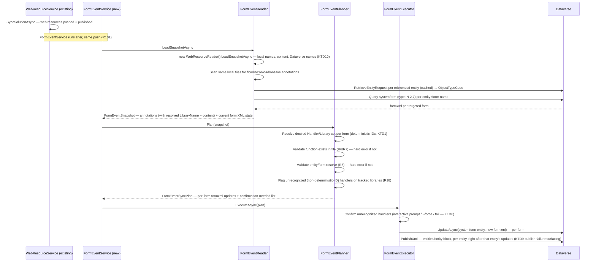

> **Product Contract preservation:** unchanged. R1-R18, Scope Boundaries, and the Empirical Findings recorded during brainstorming are preserved verbatim below. This planning pass adds two further empirically-confirmed facts to Empirical Findings (the raw `systemform.type` optionset values, and `objecttypecode`'s numeric-resolution requirement), then adds Key Technical Decisions, High-Level Technical Design, Implementation Units, an updated Risks section (two of the three original risks are now resolved), Verification Contract, and Definition of Done.

# feat: Automatic Form Event Handler Registration - Plan

## Goal Capsule

- **Objective:** `flowline push` automatically registers and keeps in sync form `onLoad`/`onSave` JavaScript event handlers declared via a source-local annotation, so developers stop wiring handlers by hand in the maker portal after every new or changed function.
- **Product authority:** Extends the `// flowline:depends` annotation mechanism (`docs/plans/2026-06-13-002-feat-webresource-dependency-registration-plan.md`) to a new kind of form metadata.
- **Open blockers:** none. Of the three empirical unknowns originally called out under Risks, two are resolved during this planning pass (see Key Technical Decision KTD4, verified against real Rollup build output); one (`<event>` node `application`/`active` defaults) is resolved with a stated default plus an implementation-time verification step (see Risks).

---

## Problem Frame

Flowline syncs web resource *content* but has no way to wire a JS function to a form event. Every time a developer adds or renames a handler function, they must open the form in the maker portal, add the library, type the function name, and publish — a manual step that's easy to forget, isn't source-controlled, and leaves no trace of intent in the repository.

---

## Empirical Findings (verified live against a Dataverse dev environment)

These were confirmed by manually registering handlers via the maker portal and diffing `systemform.formxml` before/after — see conversation for full diffs.

- Registering a handler adds two things to `formxml`, both server-generated GUIDs: a `<Library name="{webresource-name}" libraryUniqueId="{guid}"/>` under `<formLibraries>`, and a `<Handler functionName="{...}" libraryName="{...}" handlerUniqueId="{guid}" enabled="true" parameters="" passExecutionContext="true"/>` under `<events><event name="onload"|"onsave"><Handlers>`.
- `<Handlers>` (designer/user-added) is a distinct list from `<InternalHandlers>` (system/ISV-added) under the same `<event>`. Only `<Handlers>` should ever be touched.
- `libraryName` must exactly match a `Library.name` in `formLibraries`; `functionName` is an arbitrary string, not validated by Dataverse against the file's actual contents.
- Re-registering/updating an existing handler (e.g. changing `parameters`) reuses the existing `handlerUniqueId` rather than minting a new one — required for idempotent re-deploys.
- `parameters` stores the comma-separated string verbatim, no transformation.
- A form with no prior `<events>`/`<formLibraries>` gets these elements created fresh. The newly-created `<event>` node's `application`/`active` attributes were observed as `true`/`true` on one form and `false`/`false` on another (see Risks) — cause not yet understood.
- **Publishing the form is required** for the change to take effect; a saved-but-unpublished change is invisible on re-query.
- Quick Create forms support `onLoad`/`onSave` the same way Main forms do, structurally identical `<events>`/`formLibraries` shape. Quick View forms do not support JS libraries at all (confirmed via maker portal — no library/event UI available for that form type).
- Field-level `onchange` events live in a different XML location entirely (nested inside `<control><events>`, not the top-level `<events>` block) — a materially different mechanism, out of scope here.
- `systemform.type` raw optionset values confirmed live against a Dataverse dev environment by bisection (`pac env fetch` with `type eq <n>` filters): **Main = 2**, **Quick Create Form = 7** (also incidentally confirmed: Quick View Form = 6, Card = 11, InteractionCentricDashboard = 10, none of which are in scope). R9's form-type restriction resolves to `type IN (2, 7)`.
- `systemform.objecttypecode` is the entity's **numeric** `ObjectTypeCode`, not its logical name string — confirmed live: filtering with the string `"account"` throws `FormatException` ("expected type of attribute value: System.Int32"); filtering with `"1"` (Account's numeric ObjectTypeCode) succeeds. Resolving a logical name to its numeric `ObjectTypeCode` requires a metadata call (`RetrieveEntityRequest`), not a plain `QueryExpression` value.
- Running the real `rollup.config.mjs` scaffold (exact `package.json` devDependencies, `npx rollup --config`) against a sample `export function onLoad(...)` and a sample `export const onSave = (...) => {...}` confirmed both compile to a direct `exports.onLoad = onLoad;` / `exports.onSave = onSave;` assignment inside the IIFE closure — not a `Object.defineProperty` live-binding getter. See KTD4.

---

## Requirements

**Annotation syntax**

- R1. A JS file declares a form event binding via `// flowline:onload <entity> <form> [Function[(param1,param2,...)]]` and `// flowline:onsave` (same shape), mirroring the `// flowline:depends` annotation family.
- R1a. Recognized in all three comment forms `flowline:depends` already supports — `//`, `//!`, `/*! ... */` — and scanned across the whole built file, not just a leading block. The default WebResources scaffold (`rollup.config.mjs`) does not minify output (`plugins = [eslint(), typescript()]`, no minifier), so plain `//` comments survive as-is in a default build. The `//!`/`/*! ... */` legal-comment forms specifically matter for projects that add their own minification step — Terser/esbuild/SWC preserve those by default even when stripping regular comments — which is what makes the annotation minification-resilient if/when that happens, not something the default build requires. Reuses `WebResourceAnnotationParser`'s existing regex/scanning approach rather than a new mechanism.
- R2. `<entity>` is the table logical name.
- R3. `<form>` is the form's display name — written bare when it contains no whitespace, double-quoted when it does (Dataverse form names routinely contain spaces).
- R4. `Function` is optional. When omitted, it defaults to `onLoad` for `flowline:onload` and `onSave` for `flowline:onsave`.
- R5. An optional trailing `(param1,param2,...)` after the function name sets the Handler's comma-separated `parameters` string. Omitted entirely means empty parameters.
- R6. Function name matching (whether explicit or defaulted) is case-insensitive against the file's actual exported function names, checked in both the namespaced form (`<AutoNamespace>.<Function>`, matching the Rollup-derived per-file namespace) and the bare global form (`<Function>` with no namespace) — verbatim-mode web resources (files outside the Rollup build, synced raw — see `WebResourceReader.cs`'s `IsVerbatimPath`) may expose functions directly on the global scope with no namespace wrapper. The registered `functionName` uses whichever form is actually found, with the real casing from the file, not the casing written in the annotation. Detection approach confirmed feasible during planning — see Key Technical Decisions KTD4.

**Validation**

- R7. If the resolved function name does not exist in the file (checked against both the namespaced and bare-global forms), `push` fails with a clear error naming the file and the missing function; no handler is registered for that declaration, but other valid registrations in the same push still apply.
- R8. If `<entity>` or `<form>` does not resolve to an existing table / form, `push` fails with a clear error naming the declaration; no handler is registered for it, but other valid registrations in the same push still apply.

**Sync behavior**

- R9. Applies to Main and Quick Create forms. Quick View forms are excluded (no JS support). Field-level `onchange` is excluded (different XML location/mechanism).
- R10. After web resource content sync, compute the desired `(entity, form, event)` → handler set from all local annotations.
- R10a. Handler/Library registration runs strictly after the referenced web resources have been created or updated in Dataverse within the same push — a `Library` entry can only reference a web resource that already exists, so newly-added libraries must land before the form registration step runs.
- R11. Read current `formxml` before writing (read-modify-write; never overwrite blind).
- R12. Add missing `Library`/`Handler` entries; when a `Handler` for a given `(functionName, libraryName)` already exists, reuse its `handlerUniqueId` and update only what changed (e.g. `parameters`).
- R13. `Enabled` and `Pass execution context as first parameter` are always set `true`. Neither is configurable via the annotation in this version.
- R14. Removing a `// flowline:onload`/`onsave` annotation removes the corresponding `Handler` on the next `push`, subject to the ownership rule (R15).
- R15. Flowline only ever adds, updates, or removes `Handler` entries whose `libraryName` points to a web resource tracked in this project's WebResources folder. Handlers referencing any other library (other solutions, ISVs, system) are never modified or removed — same boundary already used for dependency-annotation orphan exemption.
- R16. Any form whose `Handlers` or `formLibraries` changed is published after the update, in the same publish step web resource changes already go through — publishing is required for the change to take effect; a saved-but-unpublished form is unchanged when re-queried.
- R17. `handlerUniqueId` and `libraryUniqueId` are derived deterministically from the annotation's target (a stable hash of `entity+form+event+functionName+libraryName` for handlers, `libraryName` for libraries) rather than randomly generated. This lets Flowline recognize, on any push, whether a given `Handler`/`Library` in `formxml` is one it created — without a separate tracking file.
- R18. Before deleting or altering any `Handler` on a tracked library whose ID does not match Flowline's deterministic derivation (i.e. a handler Flowline did not create — manually added via the maker portal, or migrated from spkl/Daxif/PACX), `push` surfaces it as a confirmation step and blocks until the user explicitly confirms or adopts it. This applies on every push, not just first adoption — someone can hand-add a handler to a tracked library at any point.

---

## Scope Boundaries

### Out of scope for this version

- Field-level `onchange` events (different XML location: `<control><events>`, not the top-level `<events>` block).
- Quick View forms (Dataverse does not support JS libraries on this form type).
- Per-annotation configuration of `Enabled` or `Pass execution context` — both fixed to `true`.
- Any event type beyond `onload`/`onsave` (the maker portal's own "Configure Event" dialog exposes only these two).

### Outside this product's identity

- General form layout/authoring (fields, tabs, sections) — Flowline manages event/library wiring only, not form design.
- Orphan cleanup changes — this feature never deletes a *web resource*, only `Handler`/`Library` XML entries inside a form. `OrphanCleanupService`/`WebResourceHandler` are unaffected and need no changes.

---

## Key Technical Decisions

**KTD1 — Deterministic ID derivation (R17).** `handlerUniqueId` is derived from a stable SHA-256 hash of the identity key `entity|form|event|functionName|libraryName`; `libraryUniqueId` from `libraryName` alone — matching R17's wording exactly (library identity is not scoped per-form: the same web resource gets the same `libraryUniqueId` in every form's `formLibraries` list it appears in). Truncate the hash to 16 bytes and construct a `Guid`. This is not a spec-compliant UUIDv5 (no BCL support), but doesn't need to be: the `dependencyxml` spike already confirmed Dataverse does not validate `libraryUniqueId`/`handlerUniqueId` against any entity table — any valid GUID is accepted (`docs/solutions/documentation-gaps/webresource-dependencyxml-field-format-2026-06-14.md`). Determinism, not RFC compliance, is what R17/R18 need. To avoid field-boundary ambiguity in the join (a form display name could theoretically contain the join character), length-prefix each field before concatenating (e.g. `$"{part.Length}:{part}"` per field) rather than joining with a bare delimiter — cheap, and closes the ambiguity entirely rather than picking a delimiter and hoping it's rare enough.

**Accepted limitation (KTD1):** the identity key has no per-project or per-solution scope. Two independently-managed Flowline projects that both customize the same Dataverse form with a same-named library and function would derive identical IDs and could recognize each other's handlers as their own. Not fixed here — Flowline's primary usage model is one project per client environment (see `STRATEGY.md`), making this a genuine but low-probability edge case; scoping the key by solution unique name would close it if it ever becomes real, at the cost of a slightly more complex key. Recorded as an accepted risk, not a blocker.

**KTD2 — `formxml` is mutated in place, not round-tripped through a value-object set.** Unlike `dependencyxml` (a small fragment `DependencyXmlSerializer` fully deserializes/reserializes), `formxml` is the form's entire XML document — layout, tabs, sections, everything. `FormXmlEventSerializer` loads it as an `XDocument`, finds-or-creates only the `<events>/<event name="onload|onsave">/<Handlers>` and `<formLibraries>` subtrees, and never touches anything else (especially never `<InternalHandlers>` — verified as a separate, system/ISV-owned sibling list under the same `<event>`). This is a materially different serializer shape than `DependencyXmlSerializer`; do not copy its parse-a-fragment/emit-a-fragment pattern.

**KTD3 — Form resolution requires an entity-metadata call.** `objecttypecode` on `systemform` is the numeric `ObjectTypeCode`, not the logical name (confirmed live — see Empirical Findings). Resolve logical name → `ObjectTypeCode` via `RetrieveEntityRequest` (`EntityFilters.Entity`) — `GenerateReader.cs` already uses this same request shape (`RetrieveEntityRequest` + `EntityFilters.Entity`) for entity `MetadataId` lookups, though in the reverse direction (it reads `.LogicalName`, not `.ObjectTypeCode`; no code in the repo currently reads `EntityMetadata.ObjectTypeCode`). Only the request shape is reusable, not a ready-made lookup — cache the resolved code per push run since multiple annotations commonly target the same entity. Form-type filter is `type IN (2, 7)` per the confirmed values above.

**KTD4 — Dual-form function detection.** Verified empirically during planning (not just inferred from config) by running the actual `rollup.config.mjs` scaffold against a sample `export function onLoad(...)` and a sample `export const onSave = (...) => {...}`. Both produced a direct assignment, not a live-binding getter:

```js
(function (exports) {
    'use strict';
    function onLoad(executionContext) { ... }
    exports.onLoad = onLoad;
})(this.Example1 = this.Example1 || {});
```

The `exports.<Name> = ` assignment is therefore a confirmed, reliable signal for "this function is exported" — for both function-declaration and const-arrow export styles — robust to whatever the bundler does to the underlying declaration name. Verbatim-mode web resources (raw files outside the Rollup build — `WebResourceReader.cs`'s `IsVerbatimPath`) have no such wrapper and may declare `function <Name>(...)` or `const <Name> = (...) =>` directly at the top level. `FormXmlEventSerializer`'s function-existence check tries both patterns, case-insensitively, and returns the real casing from whichever one matched. This resolves the two risks the brainstorm left open (function-existence mechanics; case-insensitive + real-casing lookup shared the same open mechanism).

**KTD5 — Form publish uses the entity-level `PublishXml` block, not the webresource block.** `WebResourceExecutor.cs:180-188` builds `<importexportxml><webresources><webresource>{guid}</webresource>...</webresources></importexportxml>` — that block only applies to web resources. Dataverse has no per-form granular publish list; publishing a form requires `<importexportxml><entities><entity>{logicalname}</entity></entities></importexportxml>`, which republishes every customization on that table (forms, views, etc.), not just the one form. `FormEventExecutor` must build this block, not copy `WebResourceExecutor`'s. **Accepted consequence:** one form's handler change republishes every pending customization on that entity — other in-progress forms/views on the same table go live as an incidental side effect. This is a Dataverse platform constraint (no finer-grained publish exists for forms), not a design choice this plan can avoid; call it out to whoever reviews the shipped behavior, not hide it as an implementation detail.

**KTD9 — Publish-failure surfacing.** `FormEventExecutor` batches all `UpdateAsync` calls, then sends one `PublishXml` per touched entity (KTD5). If `UpdateAsync` succeeds but the subsequent `PublishXml` fails, the form is saved-but-unpublished — and because the planner skips forms with no net `formxml` diff (R11/R12), the *next* push sees the handler already present in `formxml` and emits no plan action, so the touched-entity set feeding `PublishXml` stays empty and the form never gets republished automatically. This mirrors a pre-existing structural risk already present in `WebResourceExecutor`'s own end-of-batch publish (not a regression this feature introduces uniquely). Mitigation in scope for this plan: `FormEventExecutor` must treat a `PublishXml` failure as a hard, loud failure — non-zero exit, explicit error naming every affected entity — never swallowed, so the operator knows to manually publish or re-run in a way that forces it, rather than believing the push succeeded silently.

**KTD6 — R18's confirmation gate reuses the existing `--force` pattern**, not new CLI surface. `PushCommand.Settings.Force` already gates a similar "would silently overwrite" decision for plugin sync (`PushCommand.cs:142`). Interactive sessions (`ConsoleHelper.IsInteractive`, already used the same way in `ProfileResolutionService.cs`) prompt for confirmation; non-interactive sessions require `--force` or fail loudly, naming every unrecognized handler and the file/form it's on.

**KTD7 — The recognition check runs on every push, not just "first adoption."** There is no reliable "is this the first push" signal (every push re-evaluates the full desired set the same way), and the deterministic-ID scheme in KTD1 makes "did Flowline create this" a per-push, stateless check anyway — so R18 doesn't need first-push framing at all.

**KTD8 — Reuse existing patterns directly.** `FormHandler`/`FormLibraryEntry` reuse `DependencyLibrary`'s Name-only-equality-override pattern (`WebResourceModels.cs:50-57`) so `HashSet` membership and GUID reuse key on identity, not on echoed Dataverse values. `FormEventAnnotationParser` reuses `WebResourceAnnotationParser`'s exact whole-file, multi-comment-style regex approach (`//`, `//!`, `/*! ... */`) rather than inventing new parsing.

**KTD10 — `FormEventReader` sources local file content and Dataverse logical names by calling the existing `WebResourceReader` internally, not by re-deriving name resolution.** Every `FormHandler.LibraryName` and every `FormEventDeterministicId` input needs the web resource's *Dataverse logical name* (e.g. `av_Cr07982/example1.js`), which requires the same publisher-prefix / verbatim-mode resolution logic `WebResourceReader.GetLocalWebResources`/`IsVerbatimPath` already implement. Rather than duplicating that logic (a correctness risk if the two copies ever drift) or exposing `WebResourceService`'s internal snapshot across a service boundary it doesn't currently have (`WebResourceService.cs:9-11` constructs `WebResourceReader` privately, and Scope Boundaries already rules out touching that class), `FormEventReader` constructs its own `WebResourceReader` instance and calls `LoadSnapshotAsync` itself — the same class `WebResourceService` already uses, called a second time. This is a deliberate, cheap redundant load (one extra `webresource` query + one extra directory walk, typically a handful of files) traded for reusing the one already-correct implementation of name resolution and content loading, rather than inventing a second one or restructuring `WebResourceService`'s public API.

---

## High-Level Technical Design



`<InternalHandlers>` is never read from or written to by this pipeline — it's shown implicitly as "everything else in formxml" that `FormXmlEventSerializer` (KTD2) leaves untouched.

---

## Implementation Units

### U1. Form event models and deterministic ID derivation

**Goal:** Define the record shapes for annotations, handlers, libraries, and Dataverse form snapshots; provide the deterministic GUID derivation helper (KTD1).

**Requirements:** R17 (foundational for all other units).

**Dependencies:** None.

**Files:**
- `src/Flowline.Core/Models/FormEventModels.cs` (new)

**Approach:** Add to `FormEventModels.cs`:
- `FormEventAnnotation(string Entity, string Form, FormEventType Event, string? FunctionName, string? Parameters)` — raw parsed annotation. `FormEventType` enum: `OnLoad`, `OnSave`.
- `FormHandler(string FunctionName, string LibraryName, Guid HandlerUniqueId, string Parameters)` record — mirrors `DependencyLibrary`'s Name-only-equality-override pattern (KTD8), but keyed on `(FunctionName, LibraryName)` per R12's existing dedup key.
- `FormLibraryEntry(string Name, Guid LibraryUniqueId)` record — same equality pattern, keyed on `Name`.
- `DataverseForm(Guid Id, string Name, string EntityLogicalName, string FormXml)` record.
- `FormEventDeterministicId` static helper: `Guid ForHandler(string entity, string form, FormEventType evt, string functionName, string libraryName)` (key parts: `entity, form, evt, functionName, libraryName`) and `Guid ForLibrary(string libraryName)` (key parts: `libraryName` alone — matches R17 exactly; library identity is not form-scoped). Both implemented as `new Guid(SHA256.HashData(Encoding.UTF8.GetBytes(key))[..16])`, where `key` is built by length-prefixing and concatenating each lowercased part (e.g. `string.Concat(parts.Select(p => $"{p.Length}:{p.ToLowerInvariant()}"))`) rather than joining with a bare delimiter — closes the field-boundary-ambiguity edge case entirely (a form display name containing the delimiter character can't be confused with a different field split) rather than picking a delimiter and hoping it's rare enough.

**Patterns to follow:** `DependencyLibrary`'s equality override (`WebResourceModels.cs:50-57`).

**Test scenarios:**
- Same identity inputs → same derived GUID across repeated calls (determinism).
- Different `functionName` (all else equal) → different derived GUID.
- Case difference in entity/form/function → same derived GUID (case-insensitive identity).
- `FormHandler`/`FormLibraryEntry` `HashSet` membership: two instances with same key but different other fields (e.g. different `Parameters`) are treated as equal / same hash bucket.

**Verification:** New model/derivation tests pass; `FormEventModels.cs` compiles.

---

### U2. Form event annotation parser

**Goal:** Parse `// flowline:onload`/`// flowline:onsave` annotation lines from JS files into `FormEventAnnotation` records (R1, R1a, R2-R6).

**Requirements:** R1, R1a, R2, R3, R4, R5, R6 (parsing portion — matching against the file's real exports is U3/U4).

**Dependencies:** U1.

**Files:**
- `src/Flowline.Core/Services/FormEventAnnotationParser.cs` (new)
- `tests/Flowline.Core.Tests/FormEventAnnotationParserTests.cs` (new)

**Approach:** Static class mirroring `WebResourceAnnotationParser`'s structure (KTD8). Regex per event keyword, recognizing the same three comment forms (`//`, `//!`, `/*! ... */`) and scanning every line of the file, not just a leading block:

```
^(?://!?|/\*!)\s*flowline:on(?<event>load|save)\s+(?<entity>\S+)\s+(?<form>"[^"]+"|\S+)(?:\s+(?<function>[A-Za-z_][\w.]*)(?:\((?<params>[^)]*)\))?)?\s*(?:\*/)?$
```

(Directional grammar — exact regex refined during implementation, but must: match bare or double-quoted `<form>`, make the trailing `Function[(params)]` group fully optional, default `FunctionName` to `null` when omitted so U4/U5 apply the `onLoad`/`onSave` default per R4.) Strip surrounding quotes from `<form>` before returning. Split `<params>` on `,` and trim.

**Patterns to follow:** `WebResourceAnnotationParser.cs`'s whole-file scan, `Regex.Compiled`, and per-file line iteration via `File.ReadLines`.

**Test scenarios:**
- `// flowline:onload account "Account"` → entity=`account`, form=`Account`, event=`OnLoad`, function=`null`.
- `// flowline:onload account Account CustomOnLoad` → function=`CustomOnLoad`, params=`null`.
- `// flowline:onsave account "Account form for Customer Card" onSave(testParam1,testParam2)` → form parsed correctly despite spaces, function=`onSave`, params=`["testParam1","testParam2"]`.
- `//! flowline:onload ...` and `/*! flowline:onload ... */` — both recognized identically to `//`.
- Annotation on line 50 of a file with a Rollup-injected banner comment on lines 1-4 — still recognized (whole-file scan, not leading-block-only).
- Bare form name with no spaces, no quotes — recognized without requiring quotes.
- Two annotations in the same file (different events) — both parsed, no interference.
- Malformed annotation (missing `<form>`) — not matched; not silently mis-parsed into a different field.

**Verification:** New parser tests pass; parser output matches the grammar for every R1-R6 example in the Requirements section.

---

### U3. Form XML event/library serializer

**Goal:** Mutate a `formxml` string's `<events>`/`<formLibraries>` subtrees in place — add/update/remove `Handler`/`Library` entries — without touching anything else in the document (KTD2). Detect whether an annotated function actually exists in a web resource's built content (KTD4, R6/R7).

**Requirements:** R6, R7, R9, R12, R13, R15, R16 (XML shape), R17, R18 (recognition).

**Dependencies:** U1.

**Files:**
- `src/Flowline.Core/Services/FormXmlEventSerializer.cs` (new)
- `tests/Flowline.Core.Tests/FormXmlEventSerializerTests.cs` (new)

**Approach:** Static class operating on `XDocument`.

- `IReadOnlySet<FormHandler> GetHandlers(XDocument form, FormEventType evt)` — reads `<events>/<event name="onload"|"onsave">/<Handlers>/<Handler>` (never `<InternalHandlers>`), returns the current set.
- `IReadOnlySet<FormLibraryEntry> GetLibraries(XDocument form)` — reads `<formLibraries>/<Library>`.
- `void SetHandlers(XDocument form, FormEventType evt, IReadOnlySet<FormHandler> desired)` — finds or creates `<events>` (root-level child of `<form>`), finds or creates `<event name="..." application="true" active="true">` when absent (see Risks for the `application`/`active` default choice), finds or creates `<Handlers>` inside it, and replaces its `<Handler>` children with one element per desired entry: `<Handler functionName="..." libraryName="..." handlerUniqueId="{guid}" enabled="true" parameters="..." passExecutionContext="true"/>` (R13 fixes `enabled`/`passExecutionContext` to `true`). Leaves `<InternalHandlers>` and every other event untouched.
- `void SetLibraries(XDocument form, IReadOnlySet<FormLibraryEntry> desired)` — finds or creates `<formLibraries>`, replaces `<Library>` children analogously.
- `(string FunctionName, bool Found) ResolveFunction(string builtJsContent, string requestedFunctionName, string autoNamespace)` — implements KTD4's dual-form detection: tries `exports\.(?<name>{requestedFunctionName})\s*=` case-insensitively first (namespaced/Rollup form — the match's real casing from the source is captured, `autoNamespace` used as the `Handler.functionName` prefix), then falls back to a bare top-level `function (?<name>{requestedFunctionName})\s*\(|const (?<name>{requestedFunctionName})\s*=` (verbatim form, no namespace prefix). Returns `Found: false` when neither matches.

**Patterns to follow:** `DependencyXmlSerializer.cs`'s `XDocument`/`XElement` construction style — but note KTD2: this serializer mutates an existing document's subtree rather than building a whole new document from a flat set.

**Test scenarios:**
- `GetHandlers`/`GetLibraries` on a form with no `<events>`/`<formLibraries>` at all → empty sets, no exception.
- `GetHandlers` on a form with both `<InternalHandlers>` and `<Handlers>` under the same `<event>` → only `<Handlers>` entries returned.
- `SetHandlers` on a form with no `<events>` element → creates `<events>/<event name="onload">/<Handlers>` fresh, with the chosen default `application`/`active` attributes.
- `SetHandlers` on a form with an existing `<event name="onload">` containing `<InternalHandlers>` → `<InternalHandlers>` unchanged after the call, only `<Handlers>` replaced.
- `SetHandlers`/`SetLibraries` leave every other part of the form (tabs, controls, other events) byte-for-byte unchanged.
- `ResolveFunction` against namespaced Rollup-style content (`function onLoad(){} exports.onLoad = onLoad;`) with requested name `onload` (different case) → found, real casing `onLoad`.
- `ResolveFunction` against verbatim bare content (`function onLoad(executionContext) { ... }`, no `exports.`) → found via the bare-declaration fallback.
- `ResolveFunction` against content with neither pattern → `Found: false`.
- `ResolveFunction` against content with an arrow-function const declaration (`const onLoad = (ctx) => {}`) in verbatim mode → found.

**Verification:** New serializer tests pass, including a round-trip test that constructs a minimal `formxml` fixture (a `<form>` root with one existing `<event name="onload">` containing both `<InternalHandlers>` and `<Handlers>`, plus a `<formLibraries>`), calls `SetHandlers`/`SetLibraries`, and asserts the resulting `<Handler>`/`<Library>` XML matches the exact attribute set confirmed live in Empirical Findings above (`functionName`, `libraryName`, `handlerUniqueId`, `enabled="true"`, `parameters`, `passExecutionContext="true"` for handlers; `name`, `libraryUniqueId` for libraries) — that bullet is the authoritative shape reference, no external fixture needed.

---

### U4. Form event reader

**Goal:** Load the full push-time snapshot: resolve local files to their Dataverse logical names and content (KTD10, reusing `WebResourceReader`), parse all local annotations, resolve entity `ObjectTypeCode`s, query the targeted `systemform` records, and pair each with its current `formxml`.

**Requirements:** R2, R3, R6 (library-name/content plumbing), R8, R9.

**Dependencies:** U1, U2.

**Files:**
- `src/Flowline.Core/Services/FormEventReader.cs` (new)
- `src/Flowline.Core/Models/FormEventModels.cs` (extend: `FormEventSnapshot` record, and add `LibraryName`/`Content` to what an annotation carries once resolved — see Approach)
- `tests/Flowline.Core.Tests/FormEventReaderTests.cs` (new)

**Approach:** `LoadSnapshotAsync(IOrganizationServiceAsync2 service, string webresourceRoot, string solutionName, CancellationToken ct)` (needs `solutionName` — same as `WebResourceReader.LoadSnapshotAsync`'s signature — to resolve the publisher-prefix-qualified logical name):
1. Construct a `WebResourceReader` internally and call `LoadSnapshotAsync(service, webresourceRoot, solutionName, ct)` (KTD10) — this is the *same* call `WebResourceService` already makes earlier in the same push; a deliberate second, cheap load rather than threading a snapshot across a service boundary that doesn't currently exist. Its `LocalResources` dictionary gives every JS file's resolved Dataverse logical name (`LocalWebResource.Name`) and base64 `Content`, keyed the same way `WebResourceReader` already resolves publisher-prefix/verbatim naming.
2. For each `LocalWebResource` of type `Js`, run `FormEventAnnotationParser` against `LocalWebResource.Path`, and for each `FormEventAnnotation` found, pair it with that resource's resolved `LibraryName` (= `LocalWebResource.Name`) and decoded `Content` (`Convert.FromBase64String` → UTF-8 text) — this is what `FormXmlEventSerializer.ResolveFunction` (U3) needs.
3. For each distinct `Entity` referenced across all annotations, resolve `ObjectTypeCode` via `RetrieveEntityRequest` (KTD3), caching per run (`Dictionary<string, int>`).
4. For each distinct `(Entity, Form)` pair, query `systemform` (`ColumnSet("name", "formxml")`, `objecttypecode = <resolved code>`, `type IN (2, 7)`, `name = <form>`) — hard error (R8) if zero or more than one match.
5. Return `FormEventSnapshot(IReadOnlyList<ResolvedFormEventAnnotation> Annotations, IReadOnlyDictionary<(string Entity, string Form), DataverseForm> Forms)` where `ResolvedFormEventAnnotation` adds `LibraryName`, `Content`, and `SourceFile` (= `LocalWebResource.RelativePath`, for error messages) to the raw `FormEventAnnotation`.

**Patterns to follow:** `OrganizationServiceExtensions.RetrieveAllAsync` for the `systemform` query (results are typically small — a handful of forms — but keep the paging-safe extension for consistency); `WebResourceReader.cs`'s `LoadSnapshotAsync` is called directly, not reimplemented.

**Test scenarios:**
- Two JS files each with one `flowline:onload` annotation targeting different forms → both present in `Annotations`, both target forms queried, each with its own resolved `LibraryName`.
- Same entity referenced by two different annotations → `RetrieveEntityRequest` called once for that entity (cache hit on the second).
- Annotation in a verbatim-mode file (publisher-prefixed subfolder) → `LibraryName` resolves to the verbatim relative path, not prefix-qualified (mirrors `WebResourceReader.IsVerbatimPath`).
- Annotation referencing an entity with no such logical name in Dataverse → hard error naming the file and entity (R8).
- Annotation referencing a form name with zero matches for that entity+type → hard error naming the file and form (R8).
- Annotation referencing a form name matching two `systemform` records (e.g. same name present as both Main and Quick Create) → hard error naming the ambiguity (R8's "unresolvable" extends to ambiguous).
- No `flowline:onload`/`onsave` annotations anywhere in the folder → empty snapshot, no `systemform` queries (the underlying `WebResourceReader.LoadSnapshotAsync` call still runs — content/name resolution is needed regardless of whether any annotations exist yet).

**Verification:** New reader tests pass; snapshot correctly pairs every annotation with its resolved `LibraryName`, `Content`, and `DataverseForm`.

---

### U5. Form event planner

**Goal:** Compute the desired `Handler`/`Library` state per form from the snapshot, validate function existence, and flag unrecognized handlers for confirmation.

**Requirements:** R7, R10, R11, R12, R14, R15, R17, R18.

**Dependencies:** U1, U3, U4.

**Files:**
- `src/Flowline.Core/Services/FormEventPlanner.cs` (new)
- `src/Flowline.Core/Models/FormEventModels.cs` (extend: `FormEventPlanAction`, `FormEventSyncPlan`)
- `tests/Flowline.Core.Tests/FormEventPlannerTests.cs` (new)

**Approach:** `FormEventSyncPlan Plan(FormEventSnapshot snapshot)` — each `ResolvedFormEventAnnotation` in the snapshot already carries its `LibraryName` and `Content` (U4), so the planner needs no separately-threaded content map:

1. Group annotations by `(Entity, Form, Event)`.
2. Per group, resolve each annotation's function name against its own `Content` via `FormXmlEventSerializer.ResolveFunction` — hard error (R7, naming the annotation's `SourceFile`) if not found.
3. Build the desired `FormHandler` set using `FormEventDeterministicId.ForHandler` (R17); build the desired `FormLibraryEntry` set similarly.
4. Read the form's current `Handlers`/`Library` sets via `FormXmlEventSerializer.GetHandlers`/`GetLibraries`.
5. Diff: entries present in current but not desired, where the current entry's `HandlerUniqueId`/`LibraryUniqueId` matches what `FormEventDeterministicId` would derive for that identity → safe to remove (R14, R15). Entries present in current but not desired, whose ID does *not* match the deterministic derivation → flag as **unrecognized**, do not include in the removal set automatically; surface on `FormEventSyncPlan.UnrecognizedHandlers` for U6's confirmation gate (R18).
6. Entries in desired matching an existing entry by `(FunctionName, LibraryName)` reuse that entry's stored ID rather than recomputing (idempotent no-op when nothing changed — mirrors `WebResourcePlanner`'s reuse-by-name pattern).
7. Skip forms with no net change (no `FormEventPlanAction` emitted).

**Patterns to follow:** `WebResourcePlanner.cs`'s `BuildDesiredSet`/reuse-by-name shape; `DependenciesDiffer`-style set comparison.

**Test scenarios:**
- Annotation with no matching change to current form → no plan action for that form (skip).
- New annotation, form currently has no `<events>` at all → plan action creates the full subtree.
- Annotation removed from source, corresponding `Handler`'s ID matches deterministic derivation → included in the removal set.
- Handler present in `formxml` with a random (non-deterministic) `handlerUniqueId` on a tracked library, no matching annotation → appears in `UnrecognizedHandlers`, NOT auto-removed.
- Handler on a library *not* tracked by this project (foreign `libraryName`) → never touched, not even evaluated (R15).
- Function name doesn't resolve in the library's built content → hard error naming file + function (R7).
- Two annotations for the same `(entity, form, event, functionName, libraryName)` — same file, duplicate line → deduplicated, one `FormHandler`.
- `Parameters` changed on an otherwise-unchanged handler → plan action updates only `parameters`, ID reused.

**Verification:** New planner tests pass, including the unrecognized-handler flagging scenario end-to-end against a fixture `formxml`.

---

### U6. Form event executor

**Goal:** Apply the plan — confirm unrecognized handlers, write `formxml` via `UpdateAsync`, publish changed forms.

**Requirements:** R16, R18.

**Dependencies:** U1, U3, U5.

**Files:**
- `src/Flowline.Core/Services/FormEventExecutor.cs` (new)
- `tests/Flowline.Core.Tests/FormEventExecutorTests.cs` (new)

**Approach:** `ExecuteAsync(IOrganizationServiceAsync2 service, FormEventSyncPlan plan, bool force, CancellationToken ct)`:

1. If `plan.UnrecognizedHandlers` is non-empty, prompt **once per push** (a single confirmation listing every unrecognized handler, not one prompt per handler) in an interactive session (`ConsoleHelper.IsInteractive`) per KTD6. **On decline (or non-interactive without `--force`):** exclude only the declined unrecognized handlers' removal from the plan — every other plan action (new handlers, updates to recognized handlers, forms with no unrecognized handlers at all) still applies. Never abort the entire push over one form's unrecognized handler. Non-interactive session without `force` throws before applying anything, naming every unrecognized handler (entity, form, functionName, libraryName); `force` skips the prompt and proceeds as if confirmed.
2. For each form with a plan action: `FormXmlEventSerializer.SetHandlers`/`SetLibraries` to produce the updated `formxml` string, then `service.UpdateAsync` on the `systemform` entity (`formid` + `formxml` attribute only).
3. **Publish per entity, immediately after that entity's form updates complete** (KTD9) — not batched to the end of the whole run. Group touched forms by entity; for each entity, once all its forms' `UpdateAsync` calls have completed, send one `PublishXml` request for that entity (`<importexportxml><entities><entity>{logicalname}</entity></entities></importexportxml>`, KTD5). A `PublishXml` failure for one entity is a hard, loud failure (mirrors `WebResourceExecutor`'s `failures` accumulation pattern, surfaced at the end with a non-zero exit) — it must never be swallowed, since a swallowed publish failure combined with the planner's no-net-change skip (U5 step 7) would silently mask the form staying unpublished forever (KTD9).

**Patterns to follow:** `WebResourceExecutor.cs`'s bounded-parallel update shape (`ExecuteBoundedParallelAsync`, max 8) for the `UpdateAsync` calls; its `PublishAsync` structure for building the `OrganizationRequest("PublishXml")` call (different XML block per KTD5, and per-entity timing per KTD9 rather than `WebResourceExecutor`'s end-of-batch timing).

**Test scenarios:**
- Plan with no unrecognized handlers → no confirmation prompt, updates apply directly.
- Plan with unrecognized handlers, interactive session, user confirms → proceeds, handlers removed.
- Plan with unrecognized handlers, interactive session, user declines → only those handlers' removal is excluded; all other plan actions (including on the same form, and on other forms) still apply.
- Plan with unrecognized handlers, non-interactive, no `--force` → throws before applying anything, message names every unrecognized handler with file/entity/form context.
- Plan with unrecognized handlers, non-interactive, `--force` passed → proceeds without prompting.
- Two forms on the same entity touched → single `PublishXml` call for that entity, sent once after both forms' `UpdateAsync` complete (deduplicated per entity, not per form).
- Two different entities touched → two separate `PublishXml` calls, each sent as soon as that entity's own updates finish (not waiting for the other entity).
- `UpdateAsync` failure on one form (simulated `FaultException`) → other forms' updates still attempt; failure surfaced clearly at the end (mirrors `WebResourceExecutor`'s `failures` accumulation pattern).
- `PublishXml` failure for one entity (simulated `FaultException`) → surfaced as a hard failure (non-zero exit, names the entity); other entities' publish calls still attempt.

**Verification:** New executor tests pass; confirmation-gate behavior covers all four interactive/force combinations; publish-failure surfacing is explicitly tested, not just updates.

---

### U7. FormEventService orchestrator and `push` wiring

**Goal:** Wire Reader → Planner → Executor behind a single entry point, register it for DI, and invoke it from `PushCommand` after web resources are pushed (R10a, R9's scope gate).

**Requirements:** R9, R10, R10a.

**Dependencies:** U4, U5, U6.

**Files:**
- `src/Flowline.Core/Services/FormEventService.cs` (new)
- `src/Flowline/Commands/PushCommand.cs`
- `src/Flowline/Program.cs`
- `tests/Flowline.Core.Tests/FormEventServiceTests.cs` (new)

**Approach:** `FormEventService(IAnsiConsole console)` constructs its own `_reader`/`_planner`/`_executor` inline, exactly like `WebResourceService` (KTD8/existing pattern) — no DI registration needed for Reader/Planner/Executor themselves. Public method `SyncSolutionAsync(IOrganizationServiceAsync2 service, string webresourceRoot, string solutionName, bool force, CancellationToken ct)` calls Reader → Planner → Executor in sequence, following `WebResourceService.SyncSolutionAsync`'s phase-reporting shape (status spinner during load, progress during execute). `solutionName` is required because `FormEventReader` constructs its own `WebResourceReader` internally (KTD10) and `WebResourceReader.LoadSnapshotAsync` needs it to resolve publisher-prefix-qualified logical names — same reason `WebResourceService.SyncSolutionAsync` already takes it.

In `Program.cs`, add `services.AddSingleton<FormEventService>();` alongside the existing `WebResourceService` registration.

In `PushCommand.cs`, inside the existing `if (webResourcesSyncFolder != null) { ... }` block (`PushCommand.cs:149-155`), after `webResourceService.SyncSolutionAsync` completes successfully, call `formEventService.SyncSolutionAsync(conn, webResourcesSyncFolder, solutionName, settings.Force, cancellationToken)` — `solutionName` is already in scope at this call site (`PushCommand.cs:110`). This reuses the same `PushScope.WebResources` gate (no new scope flag) and the same `settings.Force` the plugin sync path already uses (KTD6) — satisfying R9 (Main/Quick Create only, gated with web resources) and R10a (runs strictly after web resources are pushed, since it's sequenced after that call completes, and only inside the same `webResourcesSyncFolder != null` branch so it never runs when web resources are out of scope).

**Patterns to follow:** `WebResourceService.cs`'s constructor and `SyncSolutionAsync` orchestration shape; `PushCommand.cs:149-155`'s existing web-resource-scope conditional.

**Test scenarios:**
- `SyncSolutionAsync` with an empty annotation set (no `flowline:onload`/`onsave` anywhere) → no-op, returns without error, no Dataverse calls beyond nothing.
- `SyncSolutionAsync` end-to-end (Reader → Planner → Executor, mocked `IOrganizationServiceAsync2`) with one new annotation → one `UpdateAsync` + one `PublishXml` call.
- `Test expectation: none -- PushCommand/Program.cs wiring is pure composition, no new branching logic; covered indirectly by FormEventServiceTests and existing PushCommand integration coverage.`

**Verification:** New service tests pass; `dotnet build` succeeds; a manual `flowline push` against a live dev environment with a `// flowline:onload` annotation added registers and publishes the handler, matching the exact `formxml` shape confirmed in Empirical Findings.

---

## Risks & Open Questions for Planning

- **Resolved — function-existence check mechanics:** see KTD4. Dual-form detection (namespaced `exports.X =` vs. verbatim bare `function X(`/`const X =`) covers both build modes this codebase produces.
- **Resolved — case-insensitive resolution + real-casing lookup:** same mechanism as above; real casing comes from the regex match against the built file, not from the annotation text.
- **Still open — `<event>` node `application`/`active` defaults when created fresh.** Two data points observed conflicting values (`true`/`true` on a Main form, `false`/`false` on a Quick Create form) — inconclusive with only two samples. **Decision for implementation:** default new `<event>` elements to `application="true" active="true"`, since that matches the value observed on Dataverse's own system-created `onload` event (the more likely "true default" signal, vs. a possibly form-type-specific quirk on the one Quick Create sample). Treat as a execution-time verification item on U3/U6: confirm via a live smoke test that a freshly-created event with these values actually fires in a model-driven app session, both for Main and Quick Create forms, before considering the feature done.
- **Accepted, unverified until U6 — `formxml` write path via `service.UpdateAsync`.** Every Empirical Finding in this document was gathered by *reading* `formxml` after a maker-portal change; the write path (`UpdateAsync` on `systemform` with a hand-mutated `formxml`) has not itself been empirically tested the way `dependencyxml`'s write path was (PATCH → HTTP 204, invalid-XML → HTTP 400, confirmed in the prior dependency-registration plan's spike). No reason to expect different behavior — `formxml` and `dependencyxml` are both Memo-type XML fields on entities in the same platform — but this is an assumption, not a confirmed fact, until Verification Contract scenario 1 runs against a live environment.
- **Accepted — cross-project deterministic-ID collision.** See KTD1's "Accepted limitation" note — not fixed in this plan, tracked here for visibility alongside the other two accepted risks.

---

## Verification Contract

- All new unit tests (U1-U7) pass: `dotnet test tests/Flowline.Core.Tests/Flowline.Core.Tests.csproj`.
- No regression in existing `WebResourceServiceTests`/`WebResourcePlanner`/`WebResourceExecutor` tests — this feature adds a parallel pipeline, does not modify the web resource one.
- `dotnet build` succeeds across the solution.
- Manual smoke, live dev environment (mirrors the empirical investigation already performed in this document):
  1. Add `// flowline:onload <entity> "<form>"` to a tracked JS file exporting a matching function; run `flowline push`. Confirm `formxml` gains the `Library`/`Handler` entries in the exact shape recorded under Empirical Findings, and the form is published (visible immediately in the maker portal's Events tab without a manual publish).
  2. Re-run `flowline push` with no source changes — confirm no `formxml` update occurs (idempotent no-op, `handlerUniqueId` unchanged).
  3. Remove the annotation, re-run `flowline push` — confirm the `Handler` is removed and the form republished.
  4. Reference a nonexistent entity or form in an annotation — confirm `push` fails with a clear error naming the file, and exits non-zero.
  5. Reference a function name that doesn't exist in the file — confirm the same hard-error behavior.
  6. With an unrecognized (manually-added) handler present on a tracked library and a conflicting annotation change pending — confirm the confirmation gate fires in an interactive session, and confirm `push --force` proceeds without prompting in a non-interactive one.

---

## Definition of Done

- U1-U7 implemented, all test scenarios passing.
- `dotnet build` and full test suite green.
- Manual smoke (Verification Contract, all 6 scenarios) confirmed against a live dev environment.
- `docs/WebResources-Project.md` (wiki) updated with the `// flowline:onload`/`// flowline:onsave` annotation syntax, per Documentation Notes below.
- `CONCEPTS.md`'s `Event annotation` entry (added during brainstorming) re-verified against the shipped implementation for accuracy.
- No changes required to `OrphanCleanupService`/`WebResourceHandler` (confirmed in Scope Boundaries) — verify no regression there anyway since `PushCommand.cs` was touched.

---

## Documentation Notes

- `WebResources-Project.md` (wiki) — document the `// flowline:onload`/`// flowline:onsave` annotation syntax alongside the existing `// flowline:depends` documentation, once implemented.
