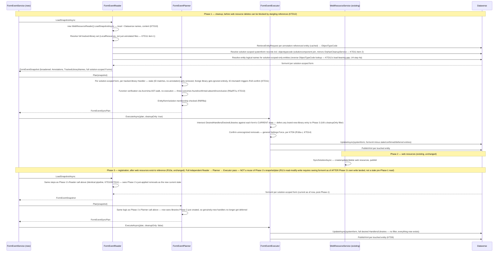

> **Product Contract preservation:** changed — R7, R14, R15, R18 (KTD11-KTD14). This is a second planning pass, made after the first implementation-ready version of this plan was executed (U1-U7 committed) and a code review surfaced a real gap between R14/R15's *stated* intent and what actually shipped. R15's text was already correct — "tracked in this project's WebResources folder" always meant the whole folder, not just annotated files — but the implementation only ever considered annotation-referenced files, so a handler on a genuinely foreign, untracked library could still be flagged "unrecognized" and removed under `--force`. R14 had the equivalent gap: detection only fired for forms a *current* annotation still referenced, so removing the last annotation for a form+event left its handler undetected indefinitely. Neither requirement's *intent* changed to fix this (R14 gained one clarifying sentence making its existing "next push" claim's scope explicit; R15 gained one clarifying sentence spelling out that "tracked" already meant the whole folder, not just annotated files) — the fix is a broadened detection mechanism (KTD11: solution-scoped forms, full tracked-library set) that actually matches what R14/R15 already said. R7 gained a real behavioral split (R7/R7a) after further design discussion distinguished Flowline's own defaulted guesses (still hard-fail) from a user's explicit function-name assertion (now warn, not fail — R6a's escape hatch). R18 gained three sub-items (R18a-c: proposed-annotation messaging, dry-run parity, and — briefly — a dedicated authorization flag; that flag idea was subsequently deferred and R18c now reuses the original KTD6 `--force` mechanism unchanged, see KTD14's "Deferred" note). A further round after live delete-verification testing and design follow-up refined R7a into a three-outcome resolution (found / confirmed absent / inconclusive) now that U8's real parser can sometimes positively prove a name absent, not just fail to find it — confirmed-absence now hard-fails like R7, reserving warn-and-register for genuine inconclusiveness. See KTD11-KTD14 for the full mechanism and rationale, and Risks & Open Questions for what's still explicitly unresolved (Acornima's exact version/API shape for U8).

# feat: Automatic Form Event Handler Registration - Plan

## Goal Capsule

- **Objective:** `flowline push` automatically registers and keeps in sync form `onLoad`/`onSave` JavaScript event handlers declared via a source-local annotation, so developers stop wiring handlers by hand in the maker portal after every new or changed function.
- **Product authority:** Extends the `// flowline:depends` annotation mechanism (`docs/plans/2026-06-13-002-feat-webresource-dependency-registration-plan.md`) to a new kind of form metadata.
- **Open blockers:** none critical to starting implementation. One item is explicitly unresolved and must be confirmed before the unit that depends on it ships — Acornima's exact version/API shape for U8 (the parser choice itself is settled — see KTD13 — only the package specifics need confirming at implementation time). R18c's dedicated-flag idea, previously listed here, is deferred out of scope for this revision (KTD14) — R18c reuses the existing `Settings.Force`, nothing left to confirm. Of the original three empirical unknowns, two are resolved (KTD4, verified against real Rollup build output); the third (`<event>` node `application`/`active` defaults) is resolved with a stated default plus an implementation-time verification step (see Risks).

---

## Problem Frame

Flowline syncs web resource *content* but has no way to wire a JS function to a form event. Every time a developer adds or renames a handler function, they must open the form in the maker portal, add the library, type the function name, and publish — a manual step that's easy to forget, isn't source-controlled, and leaves no trace of intent in the repository.

---

## Empirical Findings (verified live against a Dataverse dev environment)

These were confirmed by manually registering handlers via the maker portal and diffing `systemform.formxml` before/after — see conversation for full diffs.

- Registering a handler adds two things to `formxml`, both server-generated GUIDs: a `<Library name="{webresource-name}" libraryUniqueId="{guid}"/>` under `<formLibraries>`, and a `<Handler functionName="{...}" libraryName="{...}" handlerUniqueId="{guid}" enabled="true" parameters="" passExecutionContext="true"/>` under `<events><event name="onload"|"onsave"><Handlers>`.
- `<Handlers>` (designer/user-added) is a distinct list from `<InternalHandlers>` (system/ISV-added) under the same `<event>`. Only `<Handlers>` should ever be touched.
- `libraryName` must exactly match a `Library.name` in `formLibraries`; `functionName` is an arbitrary string, not validated by Dataverse against the file's actual contents.
- Re-registering/updating an existing handler (e.g. changing `parameters`) reuses the existing `handlerUniqueId` rather than minting a new one — required for idempotent re-deploys.
- `parameters` stores the comma-separated string verbatim, no transformation.
- A form with no prior `<events>`/`<formLibraries>` gets these elements created fresh. The newly-created `<event>` node's `application`/`active` attributes were observed as `true`/`true` on one form and `false`/`false` on another (see Risks) — cause not yet understood.
- **Publishing the form is required** for the change to take effect; a saved-but-unpublished change is invisible on re-query.
- Quick Create forms support `onLoad`/`onSave` the same way Main forms do, structurally identical `<events>`/`formLibraries` shape. Quick View forms do not support JS libraries at all (confirmed via maker portal — no library/event UI available for that form type).
- Field-level `onchange` events live in a different XML location entirely (nested inside `<control><events>`, not the top-level `<events>` block) — a materially different mechanism, out of scope here.
- `systemform.type` raw optionset values confirmed live against a Dataverse dev environment by bisection (`pac env fetch` with `type eq <n>` filters): **Main = 2**, **Quick Create Form = 7** (also incidentally confirmed: Quick View Form = 6, Card = 11, InteractionCentricDashboard = 10, none of which are in scope). R9's form-type restriction resolves to `type IN (2, 7)`.
- `systemform.objecttypecode` is the entity's **numeric** `ObjectTypeCode`, not its logical name string — confirmed live: filtering with the string `"account"` throws `FormatException` ("expected type of attribute value: System.Int32"); filtering with `"1"` (Account's numeric ObjectTypeCode) succeeds. Resolving a logical name to its numeric `ObjectTypeCode` requires a metadata call (`RetrieveEntityRequest`), not a plain `QueryExpression` value.
- Running the real `rollup.config.mjs` scaffold (exact `package.json` devDependencies, `npx rollup --config`) against a sample `export function onLoad(...)` and a sample `export const onSave = (...) => {...}` confirmed both compile to a direct `exports.onLoad = onLoad;` / `exports.onSave = onSave;` assignment inside the IIFE closure — not a `Object.defineProperty` live-binding getter. See KTD4.
- Writing a `<Library name="{webresource-name}">` entry in `formxml` for a web resource that does not yet exist in Dataverse is rejected server-side, at `UpdateAsync` time, before anything is persisted — confirmed live (dev environment, tested against two different `account` forms) via `FaultException`: `The dependent component WebResource (Id={name}) does not exist. Failure trying to associate it with SystemForm (Id={formid}) as a dependency. Missing dependency lookup type = PrimaryNameLookup.` The form's `formxml` was re-read afterward and confirmed unchanged. This is a Dataverse platform-level component-dependency check (part of Dataverse's dependency-tracking system, same mechanism that also governs solution-component dependencies generally), not a maker-portal UI-only affordance — confirms R10a's push-ordering requirement is a hard, enforced constraint rather than an assumption carried over from the manual maker-portal workflow (where the function/library picker simply never offered not-yet-uploaded resources).
- **Confirmed live — delete-blocked-by-dependency.** Created a throwaway web resource, added a `Library`+`Handler` referencing it to a real account form, published, then called `DeleteAsync` on the web resource while the reference still existed. Dataverse rejected the delete with `FaultException<OrganizationServiceFault>`: "The WebResource({id}) component cannot be deleted because it is referenced by 1 other components. For a list of referenced components, use the RetrieveDependenciesForDeleteRequest." This is a distinct fault shape from the create-side finding above (different message, `RetrieveDependenciesForDeleteRequest` pointer instead of `PrimaryNameLookup`), but the same dependency-tracking subsystem and the same practical conclusion: a web resource cannot be deleted while any form's `Library`/`Handler` entries still reference it. Confirms KTD12's phase-ordering requirement (form-event cleanup must run before web resource deletes) as a hard, enforced platform constraint, not an inference. Test form/web resource reverted and cleaned up afterward; no residual state left in the environment.

---

## Requirements

**Annotation syntax**

- R1. A JS file declares a form event binding via `// flowline:onload <entity> <form> [Function[(param1,param2,...)]]` and `// flowline:onsave` (same shape), mirroring the `// flowline:depends` annotation family.
- R1a. Recognized in all three comment forms `flowline:depends` already supports — `//`, `//!`, `/*! ... */` — and scanned across the whole built file, not just a leading block. The default WebResources scaffold (`rollup.config.mjs`) does not minify output (`plugins = [eslint(), typescript()]`, no minifier), so plain `//` comments survive as-is in a default build. The `//!`/`/*! ... */` legal-comment forms specifically matter for projects that add their own minification step — Terser/esbuild/SWC preserve those by default even when stripping regular comments — which is what makes the annotation minification-resilient if/when that happens, not something the default build requires. Reuses `WebResourceAnnotationParser`'s existing regex/scanning approach rather than a new mechanism.
- R2. `<entity>` is the table logical name.
- R3. `<form>` is the form's display name — written bare when it contains no whitespace, quoted when it does (Dataverse form names routinely contain spaces). **Both single- and double-quotes are accepted** (`"Account Main"` or `'Account Main'`) — no grammar conflict either way (nothing else in the annotation syntax uses either quote character). This matters in practice two ways: a form name containing a literal apostrophe (e.g. `Vendor's Invoice`) can be written double-quoted (`"Vendor's Invoice"`) without any escaping needed, and developers whose JS style convention defaults to single-quoted strings have a matching option for form names with no apostrophe. **Still open, pre-existing (not new from adding single-quote support):** no escaping mechanism exists for a form name containing the *same* quote character used to delimit it (e.g. a form literally named with an embedded `"` written in double-quote form) — pick whichever delimiter doesn't appear in that specific form's name.
- R4. `Function` is optional. When omitted, it defaults to `onLoad` for `flowline:onload` and `onSave` for `flowline:onsave`. This default is matched case-insensitively against the file's real exports per R6 — a file exporting PascalCase `OnLoad`/`OnSave` matches the default guess identically to camelCase; the registered handler uses whichever casing the file actually has.
- R5. An optional trailing `(param1,param2,...)` after the function name sets the Handler's comma-separated `parameters` string. Omitted entirely means empty parameters.
- R6. Function name matching (whether explicit or defaulted) is case-insensitive against the file's actual exported function names, checked in both the namespaced form (`<AutoNamespace>.<Function>`, matching the Rollup-derived per-file namespace) and the bare global form (`<Function>` with no namespace) — verbatim-mode web resources (files outside the Rollup build, synced raw — see `WebResourceReader.cs`'s `IsVerbatimPath`) may expose functions directly on the global scope with no namespace wrapper. The registered `functionName` uses whichever form is actually found, with the real casing from the file, not the casing written in the annotation. Detection approach confirmed feasible during planning — see Key Technical Decisions KTD4.
- R6a. **Superseded by live testing — kept for history, not current behavior.** Originally: an explicit dotted `Function` (e.g. `MyCompany.Example1.OnLoad`) was treated as already fully qualified, skipping auto-namespace derivation and its prefix entirely. Live testing (post-implementation) found this let a wrong or typo'd prefix silently match an unrelated same-named export in a different file's own build output (e.g. `Example1.onload1` written inside `example2.js` matched `example2.js`'s own `onLoad1` export, because only the tail was ever checked). Since a Handler's `libraryName` is always the file the annotation lives in, a referenced function can only ever live in that same file — so **the dotted prefix must now match this file's own auto-derived namespace**; a mismatch is a hard fail (folded into R7a's outcome 2), not a fully-qualified escape hatch. This is now purely about whether `Function` was written explicitly by the user (with or without a namespace prefix) vs. defaulted (R4) — R7a governs what happens either way. See `FormEventFunctionResolver.Resolve`'s class doc comment for the current mechanism.

**Validation**

- R7. **When `Function` is omitted** (defaulted to `onLoad`/`onSave` per R4) and the default name does not resolve in the file, `push` fails with a clear error naming the file and the missing function; no handler is registered for that declaration, but other valid registrations in the same push still apply. This is Flowline's own inferred guess failing, not a user assertion — hard fail is correct here, **on any non-resolution, not only a positively-proven absence** (unlike R7a — see below). R7a's "absence must be a positive determination" rule governs the split *within* R7a's explicit-name case only; it does not extend to R7, because R7's defaulted guess has no explicit user assertion to fall back on when the parser can't fully trace the export surface — the escape hatch for that situation is R6a/R7a itself (name the function explicitly instead of relying on the default).
- R7a. **When `Function` is explicitly written by the user** (including a dotted/qualified form, e.g. `MyCompany.Example1.OnLoad` — see R6a), Flowline verifies it against the real parsed structure (U8, Acornima AST-walk) and distinguishes three outcomes, not two:
  1. **Found** — the name resolves in the parsed export surface → register silently.
  2. **Confirmed absent** — Acornima fully traced a *known* export shape (the Rollup `exports.X =` IIFE assignment, or a verbatim bare-global declaration) and the name provably is not there → `push` **hard fails**, same failure style and same per-declaration scope as R7 (fails with a clear error naming the file and the missing function; no handler is registered for that declaration, but other valid registrations in the same push still apply — a bad explicit name never aborts the whole push). Once the parser has positively proven the function doesn't exist, an explicit user assertion doesn't change that — this is no longer "an assertion Flowline merely couldn't confirm," it's a proven mistake (a typo that would otherwise fail silently at runtime, since the handler would simply never fire in the browser).
  3. **Inconclusive** — the parser could not fully trace the file's export surface (e.g. namespace objects assembled across multiple statements, a build shape outside the two known patterns) → `push` **warns** (not fails) that the name could not be confirmed and registers it anyway. This is the case R6a's escape hatch exists for: Flowline's own detection is a fallback, not a source of truth, so when it genuinely can't determine the answer, the user's explicit assertion still wins.

  The load-bearing distinction is that **absence must be a positive determination, never the mere non-appearance of a match** — if the parser isn't certain it saw the file's whole export surface, that's outcome 3 (warn), not outcome 2 (hard fail). See U8's `Resolve` method for how `Found`/`Confident` map onto these three outcomes. Revises the original brainstorm-era R7, which did not distinguish explicit from defaulted function names, and revises this plan's own earlier revision of R7a (warn-always for explicit names), made before U8 committed to a real structural parser capable of proving absence in the known-shape case.
- R8. If `<entity>` or `<form>` does not resolve to an existing table / form, `push` fails with a clear error naming the declaration; no handler is registered for it, but other valid registrations in the same push still apply.
- R8a. If `<entity>`/`<form>` resolve to a real Dataverse table/form but that form is **not a component of this project's Dataverse solution**, `push` fails with a clear error naming the declaration and the form — same hard-error style as R8, not an auto-add. Detectable now that detection is solution-scoped (KTD11). Explicitly rejected auto-adding the form to the solution as a side effect: too large/unexpected a mutation for the user to discover only via a form-event annotation; the maker-portal step to add the form to the solution once is accepted friction.

**Sync behavior**

- R9. Applies to Main and Quick Create forms. Quick View forms are excluded (no JS support). Field-level `onchange` is excluded (different XML location/mechanism).
- R10. After web resource content sync, compute the desired `(entity, form, event)` → handler set from all local annotations.
- R10a. Handler/Library registration runs strictly after the referenced web resources have been created or updated in Dataverse within the same push — a `Library` entry can only reference a web resource that already exists, so newly-added libraries must land before the form registration step runs. Confirmed empirically (server-side rejection, not just a maker-portal UI constraint) — see Empirical Findings.
- R11. Read current `formxml` before writing (read-modify-write; never overwrite blind).
- R12. Add missing `Library`/`Handler` entries; when a `Handler` for a given `(functionName, libraryName)` already exists, reuse its `handlerUniqueId` and update only what changed (e.g. `parameters`).
- R13. `Enabled` and `Pass execution context as first parameter` are always set `true`. Neither is configurable via the annotation in this version.
- R14. Removing a `// flowline:onload`/`onsave` annotation removes the corresponding `Handler` on the next `push`, subject to the ownership rule (R15). **Detection is not annotation-scoped**: `push` scans every `systemform` record that is a component of this project's Dataverse solution (not just forms named by a *current* annotation), so a `Handler` orphaned by removing its only remaining annotation — or by deleting the JS file entirely — is found and removed on the very next `push`, with no dependency on a separate tracking file (see KTD11). Revises the original brainstorm-era R14, whose "next push" claim was previously satisfiable only when another annotation still happened to reference the same form+event.
- R15. Flowline only ever adds, updates, or removes `Handler` entries whose `libraryName` points to a web resource tracked in this project's WebResources folder. Handlers referencing any other library (other solutions, ISVs, system) are never modified or removed — same boundary already used for dependency-annotation orphan exemption. **"Tracked" means every JS web resource in this project's WebResources folder, not only files that currently carry a `flowline:onload`/`onsave` annotation** — the requirement text was already this broad; KTD11 fixes the enforcement mechanism to actually match it (see the Product Contract preservation note at the top of this document for the original-implementation context).
- R16. Any form whose `Handlers` or `formLibraries` changed is published after the update, in the same publish step web resource changes already go through — publishing is required for the change to take effect; a saved-but-unpublished form is unchanged when re-queried.
- R17. `handlerUniqueId` and `libraryUniqueId` are derived deterministically from the annotation's target (a stable hash of `entity+form+event+functionName+libraryName` for handlers, `libraryName` for libraries) rather than randomly generated. This lets Flowline recognize, on any push, whether a given `Handler`/`Library` in `formxml` is one it created — without a separate tracking file.
- R18. Before deleting or altering any `Handler` on a tracked library whose ID does not match Flowline's deterministic derivation (i.e. a handler Flowline did not create — manually added via the maker portal, or migrated from spkl/Daxif/PACX), `push` surfaces it as a confirmation step and blocks until the user explicitly confirms or adopts it. This applies on every push, not just first adoption — someone can hand-add a handler to a tracked library at any point.
- R18a. Every handler surfaced under R18 must show a **proposed annotation** the user could add to the JS file instead of removing it — constructed from the handler's own currently-stored `functionName`, `libraryName`, and `parameters`, using the R6a/R7a escape hatch when `functionName` happens to be a dotted/qualified path. This gives a migrating or trying-out user (a handler that predates Flowline management, not a stale one) a concrete way to adopt it instead of guessing whether removal is safe. Declining removal is not a dead end: adding the proposed annotation and re-pushing silently adopts the handler on the next `push` (identity match on `(functionName, libraryName)` happens before the ID check, so no repeated confirmation is needed once the annotation exists).
- R18b. `--dry-run` shows the same per-handler detail and proposed annotation as the real confirmation prompt (R18a), computed but never applied. A migrating or cautious user can see everything R18 would ask about with zero risk before ever running a real `push`.
- R18c. Authorizing R18's handler removal in a non-interactive session reuses the existing general `--force` flag (`-f|--force`, `FlowlineSettings.cs`), same as every other confirmation gate `push` already has (per KTD6, unchanged). **Deferred, not decided in this revision:** splitting handler-removal authorization out into a flag dedicated to this action, to close the accidental-authorization gap a shared `--force` creates for CI pipelines running `--force` for an unrelated reason — see KTD14's "Deferred" note and Risks & Open Questions for the rationale and a floated (not scheduled) future direction (a repeated/counted `--force`).

---

## Scope Boundaries

### Out of scope for this version

- Field-level `onchange` events (different XML location: `<control><events>`, not the top-level `<events>` block).
- Quick View forms (Dataverse does not support JS libraries on this form type).
- Per-annotation configuration of `Enabled` or `Pass execution context` — both fixed to `true`.
- Any event type beyond `onload`/`onsave` (the maker portal's own "Configure Event" dialog exposes only these two).

### Outside this product's identity

- General form layout/authoring (fields, tabs, sections) — Flowline manages event/library wiring only, not form design.
- Orphan cleanup changes — this feature never deletes a *web resource*, only `Handler`/`Library` XML entries inside a form. `OrphanCleanupService`/`WebResourceHandler` are unaffected and need no changes.

---

## Key Technical Decisions

**KTD1 — Deterministic ID derivation (R17).** `handlerUniqueId` is derived from a stable SHA-256 hash of the identity key `entity|form|event|functionName|libraryName`; `libraryUniqueId` from `libraryName` alone — matching R17's wording exactly (library identity is not scoped per-form: the same web resource gets the same `libraryUniqueId` in every form's `formLibraries` list it appears in). Truncate the hash to 16 bytes and construct a `Guid`. This is not a spec-compliant UUIDv5 (no BCL support), but doesn't need to be: the `dependencyxml` spike already confirmed Dataverse does not validate `libraryUniqueId`/`handlerUniqueId` against any entity table — any valid GUID is accepted (`docs/solutions/documentation-gaps/webresource-dependencyxml-field-format-2026-06-14.md`). Determinism, not RFC compliance, is what R17/R18 need. To avoid field-boundary ambiguity in the join (a form display name could theoretically contain the join character), length-prefix each field before concatenating (e.g. `$"{part.Length}:{part}"` per field) rather than joining with a bare delimiter — cheap, and closes the ambiguity entirely rather than picking a delimiter and hoping it's rare enough.

**Accepted limitation (KTD1):** the identity key has no per-project or per-solution scope. Two independently-managed Flowline projects that both customize the same Dataverse form with a same-named library and function would derive identical IDs and could recognize each other's handlers as their own. Not fixed here — Flowline's primary usage model is one project per client environment (see `STRATEGY.md`), making this a genuine but low-probability edge case; scoping the key by solution unique name would close it if it ever becomes real, at the cost of a slightly more complex key. Recorded as an accepted risk, not a blocker.

**KTD2 — `formxml` is mutated in place, not round-tripped through a value-object set.** Unlike `dependencyxml` (a small fragment `DependencyXmlSerializer` fully deserializes/reserializes), `formxml` is the form's entire XML document — layout, tabs, sections, everything. `FormXmlEventSerializer` loads it as an `XDocument`, finds-or-creates only the `<events>/<event name="onload|onsave">/<Handlers>` and `<formLibraries>` subtrees, and never touches anything else (especially never `<InternalHandlers>` — verified as a separate, system/ISV-owned sibling list under the same `<event>`). This is a materially different serializer shape than `DependencyXmlSerializer`; do not copy its parse-a-fragment/emit-a-fragment pattern.

**KTD3 — Form resolution requires an entity-metadata call.** `objecttypecode` on `systemform` is the numeric `ObjectTypeCode`, not the logical name (confirmed live — see Empirical Findings). Resolve logical name → `ObjectTypeCode` via `RetrieveEntityRequest` (`EntityFilters.Entity`) — `GenerateReader.cs` already uses this same request shape (`RetrieveEntityRequest` + `EntityFilters.Entity`) for entity `MetadataId` lookups, though in the reverse direction (it reads `.LogicalName`, not `.ObjectTypeCode`; no code in the repo currently reads `EntityMetadata.ObjectTypeCode`). Only the request shape is reusable, not a ready-made lookup — cache the resolved code per push run since multiple annotations commonly target the same entity. Form-type filter is `type IN (2, 7)` per the confirmed values above.

**KTD4 — Dual-form function detection.** Verified empirically during planning (not just inferred from config) by running the actual `rollup.config.mjs` scaffold against a sample `export function onLoad(...)` and a sample `export const onSave = (...) => {...}`. Both produced a direct assignment, not a live-binding getter:

```js
(function (exports) {
    'use strict';
    function onLoad(executionContext) { ... }
    exports.onLoad = onLoad;
})(this.Example1 = this.Example1 || {});
```

The `exports.<Name> = ` assignment is therefore a confirmed, reliable signal for "this function is exported" — for both function-declaration and const-arrow export styles — robust to whatever the bundler does to the underlying declaration name. Verbatim-mode web resources (raw files outside the Rollup build — `WebResourceReader.cs`'s `IsVerbatimPath`) have no such wrapper and may declare `function <Name>(...)` or `const <Name> = (...) =>` directly at the top level. This resolves the two risks the brainstorm left open (function-existence mechanics; case-insensitive + real-casing lookup shared the same open mechanism).

**Superseded mechanism, empirical finding still valid (see KTD13):** the original plan had `FormXmlEventSerializer`'s function-existence check try both patterns above via regex. KTD13 replaces the regex mechanism with an embedded JS engine for two reasons the regex approach could not address: (1) a comment or string literal containing lookalike text (`// old: exports.onLoad = ...`) can false-positive-match a regex but not a real parse, and (2) the regex has no way to walk a genuinely nested/prefixed namespace (R6a/R7a's escape hatch). The `exports.<Name> = ` shape confirmed here is still the correct signal to look for — KTD13 just looks for it structurally instead of textually.

**KTD5 — Form publish uses the entity-level `PublishXml` block, not the webresource block.** `WebResourceExecutor.cs:180-188` builds `<importexportxml><webresources><webresource>{guid}</webresource>...</webresources></importexportxml>` — that block only applies to web resources. Dataverse has no per-form granular publish list; publishing a form requires `<importexportxml><entities><entity>{logicalname}</entity></entities></importexportxml>`, which republishes every customization on that table (forms, views, etc.), not just the one form. `FormEventExecutor` must build this block, not copy `WebResourceExecutor`'s. **Accepted consequence:** one form's handler change republishes every pending customization on that entity — other in-progress forms/views on the same table go live as an incidental side effect. This is a Dataverse platform constraint (no finer-grained publish exists for forms), not a design choice this plan can avoid; call it out to whoever reviews the shipped behavior, not hide it as an implementation detail.

**KTD9 — Publish-failure surfacing.** `FormEventExecutor` groups touched forms by entity and sends one `PublishXml` per entity (KTD5) as soon as that entity's own `UpdateAsync` calls complete — not batched to the end of the whole run (see U6's Approach for the exact per-entity timing). If `UpdateAsync` succeeds but the subsequent `PublishXml` fails, the form is saved-but-unpublished — and because the planner skips forms with no net `formxml` diff (R11/R12), the *next* push sees the handler already present in `formxml` and emits no plan action, so the touched-entity set feeding `PublishXml` stays empty and the form never gets republished automatically. This mirrors a pre-existing structural risk already present in `WebResourceExecutor`'s own end-of-batch publish (not a regression this feature introduces uniquely). Mitigation in scope for this plan: `FormEventExecutor` must treat a `PublishXml` failure as a hard, loud failure — non-zero exit, explicit error naming every affected entity — never swallowed, so the operator knows to manually publish or re-run in a way that forces it, rather than believing the push succeeded silently.

**KTD6 — Unchanged.** Reuses the existing global `--force` flag (`FlowlineSettings.cs:12`, `-f|--force`) for R18's confirmation gate, on the reasoning that `PushCommand.Settings` already gates a similar "would silently overwrite" decision for plugin sync (`PushCommand.cs:142`) the same way — same interactive-vs-non-interactive detection (`ConsoleHelper.IsInteractive`, prompt or fail-loudly-naming-every-handler). A later revision briefly proposed splitting this into a dedicated flag (see KTD14's "Deferred" note); that idea is not adopted in this revision — KTD6's original mechanism stands.

**KTD7 — The recognition check runs on every push, not just "first adoption."** There is no reliable "is this the first push" signal (every push re-evaluates the full desired set the same way), and the deterministic-ID scheme in KTD1 makes "did Flowline create this" a per-push, stateless check anyway — so R18 doesn't need first-push framing at all.

**KTD8 — Reuse existing patterns directly.** `FormHandler`/`FormLibraryEntry` reuse `DependencyLibrary`'s Name-only-equality-override pattern (`WebResourceModels.cs:50-57`) so `HashSet` membership and GUID reuse key on identity, not on echoed Dataverse values. `FormEventAnnotationParser` reuses `WebResourceAnnotationParser`'s exact whole-file, multi-comment-style regex approach (`//`, `//!`, `/*! ... */`) rather than inventing new parsing.

**KTD10 — `FormEventReader` sources local file content and Dataverse logical names by calling the existing `WebResourceReader` internally, not by re-deriving name resolution.** Every `FormHandler.LibraryName` and every `FormEventDeterministicId` input needs the web resource's *Dataverse logical name* (e.g. `av_Cr07982/example1.js`), which requires the same publisher-prefix / verbatim-mode resolution logic `WebResourceReader.GetLocalWebResources`/`IsVerbatimPath` already implement. Rather than duplicating that logic (a correctness risk if the two copies ever drift) or exposing `WebResourceService`'s internal snapshot across a service boundary it doesn't currently have (`WebResourceService.cs:9-11` constructs `WebResourceReader` privately, and Scope Boundaries already rules out touching that class), `FormEventReader` constructs its own `WebResourceReader` instance and calls `LoadSnapshotAsync` itself — the same class `WebResourceService` already uses, called a second time. This is a deliberate, cheap redundant load (one extra `webresource` query + one extra directory walk, typically a handful of files) traded for reusing the one already-correct implementation of name resolution and content loading, rather than inventing a second one or restructuring `WebResourceService`'s public API. **Extended by KTD11:** the snapshot this call returns (`LocalResources`) is also the source for the *full* tracked-library-name set R15/KTD11 needs, not just the subset with a current annotation.

**KTD11 — R14/R15 enforcement requires two sets broader than "what's currently annotated," both already reachable from existing patterns.**

1. **Full tracked-library set.** `WebResourceReader.LoadSnapshotAsync`'s `LocalResources` (already loaded per KTD10) is every JS web resource in this project's WebResources folder, whether or not it currently carries a `flowline:onload`/`onsave` annotation. `FormEventReader` must expose this full set (e.g. `FormEventSnapshot.TrackedLibraryNames`), not just the subset derivable from `Annotations`. This directly closes R15's gap: a `Handler` whose `libraryName` isn't in this set is never evaluated, never surfaced in any prompt, and never eligible for removal under any flag — it's a different library category from "tracked but not Flowline's ID" (R18), not a variant of it.
2. **Solution-scoped forms.** `FormEventReader` must also resolve every `systemform` record that is a component of this project's Dataverse solution — not just forms named by a current annotation. Reuse, don't reinvent: `OrphanCleanupService.cs` already has a working `solutioncomponent` → `solution` join pattern (`OrphanCleanupService.cs:772,814,856`, `[60] = ("systemform", "formid", "name")` for `componenttype` 60 = System Form) for exactly this kind of solution-component resolution. Mirror that join, not a fresh one.

**Load-bearing gap this KTD must also close: entity logical name for orphan forms.** Every `DataverseForm` requires a non-nullable `EntityLogicalName` (U1), and R14's stale-handler detection recomputes `FormEventDeterministicId.ForHandler(entity, form, evt, functionName, libraryName)` per current `Handler` to check for a match — both need the entity's *logical name* (a string), not its numeric `ObjectTypeCode`. For a form discovered via a current annotation, the logical name comes from the annotation text directly. For a form discovered only via the solution-scoped join (KTD11's whole point — a form with *zero* current annotations), there is no annotation to read it from, and `systemform` itself carries only the numeric `objecttypecode`, not a logical-name field. KTD3 only covers the forward direction (logical name → `ObjectTypeCode`, via `RetrieveEntityRequest`, needed to build the query filter) — nothing in this plan describes the reverse (`ObjectTypeCode` → logical name) that orphan forms require. Without it, R14's detection cannot construct a `DataverseForm` for exactly the forms it exists to examine.

Fix: include `objecttypecode` in the solution-scoped `systemform` query's `ColumnSet` (alongside `name`/`formxml`), collect the distinct set of codes returned, and resolve that set to logical names via one bulk entity-metadata request (e.g. `RetrieveAllEntitiesRequest` with `EntityFilters.Entity`, filtered client-side to the distinct codes needed — returns `LogicalName`+`ObjectTypeCode` for every entity in one call, regardless of how many distinct codes need resolving). This is a heavier metadata call than KTD3's per-entity `RetrieveEntityRequest`, but it only needs to run once per push, against the small distinct-code set the solution-scoped forms actually reference — not once per form. Exact request shape and cost is an implementation-time confirmation (mirrors KTD3's own empirical-verification pattern), but the *mechanism* — a bulk reverse lookup keyed off the distinct codes in the broadened form set — must exist; U4's Approach specifies it below.

**Revised planner logic**, evaluated for every `Handler` found on every solution-scoped form (U5):
- Library not in the tracked set (item 1) → completely ignored — never evaluated, never surfaced, never eligible for removal, regardless of flags. Replaces the previous behavior (a shipped test, `Plan_HandlerOnUnreferencedLibraryWithNonMatchingId_IsKeptAndFlaggedUnrecognized`, documented the old — incorrect — "flag as unrecognized" behavior for exactly this case; U5 rewrites that test to assert the corrected behavior).
- Library in the tracked set, `Handler`'s ID matches Flowline's deterministic derivation, no current annotation → stale, safe to remove automatically, no confirmation needed (R14). Flowline created it; Flowline can retire it.
- Library in the tracked set, `Handler`'s ID does not match → R18's existing confirmation-gate case, unchanged in kind (R18a-c enrich the messaging, not the gate itself).

**Cost note:** bounding the form scan to `solutioncomponent`-linked forms (a project's own solution, not the whole org) keeps the scan size in line with what a Flowline-managed solution actually contains (typically dozens, not the org's full form count) — the earlier idea of a full-org scan (rejected during the original brainstorm as too expensive for `push`) is not what this does.

**KTD12 — Phase sequencing splits into cleanup-before-delete and registration-after-create/update; R10a's single "runs after web resources" ordering is not sufficient once R14/R15 close the loop on deletions.** The Empirical Findings entry confirming Dataverse rejects a `Library` reference to a nonexistent web resource (`PrimaryNameLookup` fault) implies — with high confidence, not separately re-tested — that Dataverse's dependency system also blocks *deleting* a web resource still referenced by a form's `Library`/`Handler` entries. So when a whole JS file is deleted locally, `WebResourceExecutor`'s delete of the corresponding web resource would itself fail with a dependency fault unless the form-level references are cleared first. R10a's existing ordering (registration strictly *after* web resources are created/updated) stays correct for that direction; a *second*, opposite-direction ordering constraint is needed for deletion: form-event cleanup for anything about to be orphaned by a pending web resource delete must run **before** `WebResourceExecutor`'s delete step.

Net: `PushCommand`'s sequencing becomes three points, not two — (1) form-event cleanup for handlers on libraries about to be deleted, (2) web resource create/update/delete, (3) form-event registration for new/changed handlers. Implementation-time decision (deliberately not settled here, per Phase 3.6): whether `FormEventService`/`FormEventReader`+`Planner`+`Executor` runs twice per push (a cleanup-scoped pass before web resources, a registration-scoped pass after — reuses the existing single-pass Reader→Planner→Executor mechanics unchanged, at the cost of one redundant read+plan pass per push) or whether `WebResourceExecutor`'s delete step is split into a separately-invokable phase `PushCommand` can sequence around (avoids the redundant pass, but means restructuring an already-shipped, working class outside this feature's original file scope). U7 records this as the concrete design point to resolve during implementation.

**Alternative considered and rejected: a manual staging gate instead of automatic sequencing.** `WebResourceExecutor` already has a precedent for opting out of a destructive default (`--no-delete`, skips deletes entirely) — an alternative to building automatic two-call orchestration would be requiring the developer (or a CI script) to run `push --no-delete` first, separately confirm form-event cleanup happened, then re-run `push` without `--no-delete` to actually delete the resource: a manual two-step dance instead of one automatic push. Rejected because it pushes the multi-step burden onto every user for every deletion, which cuts directly against this feature's core value proposition — the whole point is that a developer runs one `push` and never manages this by hand. The automatic three-point sequencing keeps `push` single-step for the user at the cost of the implementation complexity captured above; that trade is judged worth it given the feature's purpose, but is written out explicitly here since a reviewer raised it and the tradeoff wasn't previously stated.

**KTD13 — Function resolution uses a real JS parser (Acornima, structural AST-walk, no execution), not regex, and supports an explicit fully-qualified escape hatch.** Two problems regex can't solve cleanly: (1) a comment or string literal containing lookalike text (`// exports.onLoad = oldThing`) can false-positive-match a text pattern but not a structural parse; (2) regex has no way to verify a genuinely nested/prefixed namespace path (R6a).

**Correction to an earlier claim made during design discussion, before this KTD's original text was written:** `flowline push` was believed to never invoke Node/npm/Rollup itself. That's wrong, confirmed against the actual code — `PushCommand.cs`'s `PrepareWebResourcesForPushAsync` calls `DotNetUtils.BuildSolutionAsync` by default (`--no-build` opts out, defaulting to `false`), and `WebResources.csproj`'s `NpmBuild` target (`BeforeTargets="Build"`) runs `npm install`/`npm run build`. So a normal `push` already shells out to Node/npm/Rollup today. This removes "avoids introducing an external Node process dependency" as a reason to prefer an embedded engine over shelling out to Node directly — that specific argument doesn't hold. It's not fully moot either: `--no-build` is a real, supported flag, and in that path (`dist/` pre-built elsewhere, e.g. committed by CI, the machine running `push` has no Node at all) a Node-shell-out approach would introduce a dependency that genuinely isn't there today, where an in-process approach wouldn't. This is a narrower, weaker justification than originally stated — worth being explicit about the correction rather than quietly fixing the wording.

**Revised recommendation, given four independent review passes converged on the same direction:** parse (Acornima, structural AST-walk) rather than parse-and-execute (Jint's fuller engine). Acornima is Jint's own sole dependency — Jint pulls in Acornima either way — so committing to Acornima directly, without the execution layer on top, is a narrower dependency footprint that fully solves both problems above and eliminates two categories of risk execution would introduce and this plan had not addressed: (1) no execution timeout/resource bound was specified anywhere, so a runaway or infinite-looping bundle would hang `push` indefinitely; (2) realistic browser-targeted JS commonly references host globals (`window`, `document`, `Xrm`) at module scope for feature detection or config — none of which exist in a bare execution sandbox, so legitimate code would throw a runtime error and produce a false R7 hard-fail for a function that actually exists and works fine in a real browser. Neither risk applies to structural parsing: nothing executes, so nothing can hang or throw against a missing global. This also directly answers "why execute instead of parse" — the original KTD13 text presented both as interchangeable without deciding; there's no longer a live tradeoff to defer, parsing dominates execution for this specific use case (finding real exported functions), not just avoids its risks.

Package: **Acornima** (NuGet, the parser Jint itself depends on) — parses JS/ESNext into an ESTree-shaped AST entirely in-process. Version/API-shape confirmation still happens at implementation time (see Risks & Open Questions), same as the rest of this plan's external-package citations.

Approach: parse the built content into an AST, walk it structurally to find `exports.<Name> = ` assignments (KTD4's empirical finding — still the correct target shape) and bare top-level `function <Name>(...)`/`const <Name> = ` declarations, matching `onLoad`/`OnLoad`/`onSave`/`OnSave` with or without a namespace prefix (R6a) — this replaces KTD4's original regex proposal, keeping its empirical finding as the structural target, and additionally replaces the execution-based approach this KTD previously specified.

**Explicit-name escape hatch (R6a/R7a):** when the annotation's `Function` is non-null (user wrote something, whether dotted or not — R4's default is the only case treated as a guess), skip auto-namespace derivation and register the name verbatim — but AST-based verification is no longer purely advisory. Because Acornima performs a real structural parse (not regex), it can sometimes *positively prove* a name absent from a fully-traced known export shape, not just fail to find it. R7a's three-outcome resolution (found / confirmed absent / inconclusive) treats confirmed-absence the same as R7's default-case hard gate, and reserves the original warn-and-register-anyway behavior for genuine inconclusiveness (export shape the AST-walk can't fully trace). See R7a for the full rationale and U8's `Resolve` method for the mechanism.

**KTD14 — R18's confirmation/error messaging is enriched with a proposed adoption annotation (KTD6's single-confirm-for-the-whole-push design and its `--force` authorization are unchanged).**

*Why enrich the messaging (R18a/R18b):* a handler on a tracked library with a non-matching ID is ambiguous by construction — it could be genuinely stale (safe to remove) or a legacy/migration-era registration nobody has annotated yet (removing it is actively harmful). There is no reliable way to auto-detect which situation a given handler is in: the distinguishing fact ("did this handler ever have a Flowline annotation that was later removed, or did it never have one") is exactly the kind of history a local tracking file would capture, and that was already rejected during the original brainstorm (no separate state, everything derivable from source). Rather than guess, surface enough information for the human to decide well: the handler's own stored `functionName`/`libraryName`/`parameters` already fully determine a proposed annotation (R18a) that's guaranteed to resolve correctly if adopted (it composes directly with R6a/R7a's escape hatch — a dotted stored name just becomes a qualified-escape-hatch annotation). `--dry-run` gets the same detail (R18b) so this is discoverable with zero risk before a real `push`.

Deliberately **not** building a per-handler interactive picker (adopt this one, delete that one) — stays with the existing single confirm-for-the-whole-push (original KTD6 design). Non-interactive/flag-authorized mode can never "adopt" anything regardless (that requires editing a source file, a human action outside Flowline's write scope), so per-handler granularity would only ever matter for the interactive path, and the added complexity isn't justified for that alone.

**Accepted consequence of KTD12's two independent phases: a declined handler can be re-prompted within the same push.** "Single confirm-for-the-whole-push" means single-confirm-per-*phase*, not single-confirm-per-*push*, now that KTD12 splits cleanup and registration into two fully independent Reader→Planner→Executor passes (Phase 3 is explicitly not a reuse of Phase 1's plan — see High-Level Technical Design). If a user declines removing an unrecognized handler in Phase 1, that handler is left untouched in `formxml`; nothing about its recognition state changes during Phase 2's web resource sync, so Phase 3's independent re-read recomputes the same handler as unrecognized and prompts for it again before the same `push` invocation finishes. Not fixed here — suppressing the re-prompt would require `FormEventService` to carry declined-handler identities from the cleanup call into the registration call, a piece of cross-phase state this plan doesn't otherwise need and that adds a second bespoke state-passing mechanism beyond `cleanupOnly`. Accepted as a minor UX rough edge (a second identical prompt in one push, not a correctness issue — declining twice has the same effect as declining once) rather than solved with new plumbing; revisit if this proves more disruptive in practice than the desk-check above suggests.

**Deferred — dedicated flag (R18c), reverted to KTD6's original `Settings.Force`.** An earlier revision of this plan proposed splitting handler-removal authorization out of the general `-f|--force` flag (`FlowlineSettings.cs:12`) into a flag scoped only to this action — the concern was real: `--force` already gates unrelated confirmations across other commands (plugin-assembly version conflicts, dirty working directory, etc.), so a CI pipeline passing `--force` for one of those reasons would, as a pure side effect, also silently authorize deleting a form-event handler nobody writing that pipeline ever considered. That concern is not dismissed here — it's deferred, because it's an instance of a broader problem this plan shouldn't solve in isolation: `push` and other commands already overload one `--force` flag across several unrelated destructive confirmations, and a one-off `--force-handlers` would only be the first of what could become many single-purpose force flags. A floated (not decided, not scheduled) future direction is a repeated/counted `--force` — e.g. `--force --force` or `--force 2` — that authorizes N distinct force-gated concerns at once without a proliferation of named flags; this is recorded in Risks & Open Questions as an idea for a future revision, not part of this plan's scope. **R18's removal authorization in this revision reuses the general `Settings.Force`, exactly as originally specified in KTD6** — R18c is retained as a requirement (a confirmation gate must exist and must be authorizable non-interactively) but its "dedicated flag" mechanism is removed; see R18c's revised text above.

---

## High-Level Technical Design

Three-phase sequencing (KTD12) — cleanup before deletes can be blocked by them, registration after new libraries exist to reference:



`<InternalHandlers>` is never read from or written to by this pipeline — it's shown implicitly as "everything else in formxml" that `FormXmlEventSerializer` (KTD2) leaves untouched.

The redundant Reader→Planner pass drawn above (Phase 1 and Phase 3 both run the full pipeline) is the accepted cost of Option A (KTD12/U7) — not an inefficiency to fix, but the price of correctness (R11) without restructuring `WebResourceExecutor`. Whether `WebResourceExecutor`'s delete step instead becomes separately invokable (Option B, avoiding the redundant pass at the cost of touching already-shipped code outside this feature's original scope) is an implementation-time decision — see KTD12 and U7.

---

## Implementation Units

### U1. Form event models and deterministic ID derivation

**Goal:** Define the record shapes for annotations, handlers, libraries, and Dataverse form snapshots; provide the deterministic GUID derivation helper (KTD1).

**Requirements:** R17 (foundational for all other units).

**Dependencies:** None.

**Files:**
- `src/Flowline.Core/Models/FormEventModels.cs` (already exists, shipped — not touched by this revision, listed for reference since later units extend it)

**Approach:** Add to `FormEventModels.cs`:
- `FormEventAnnotation(string Entity, string Form, FormEventType Event, string? FunctionName, string? Parameters)` — raw parsed annotation. `FormEventType` enum: `OnLoad`, `OnSave`.
- `FormHandler(string FunctionName, string LibraryName, Guid HandlerUniqueId, string Parameters)` record — mirrors `DependencyLibrary`'s Name-only-equality-override pattern (KTD8), but keyed on `(FunctionName, LibraryName)` per R12's existing dedup key.
- `FormLibraryEntry(string Name, Guid LibraryUniqueId)` record — same equality pattern, keyed on `Name`.
- `DataverseForm(Guid Id, string Name, string EntityLogicalName, string FormXml)` record.
- `FormEventDeterministicId` static helper: `Guid ForHandler(string entity, string form, FormEventType evt, string functionName, string libraryName)` (key parts: `entity, form, evt, functionName, libraryName`) and `Guid ForLibrary(string libraryName)` (key parts: `libraryName` alone — matches R17 exactly; library identity is not form-scoped). Both implemented as `new Guid(SHA256.HashData(Encoding.UTF8.GetBytes(key))[..16])`, where `key` is built by length-prefixing and concatenating each lowercased part (e.g. `string.Concat(parts.Select(p => $"{p.Length}:{p.ToLowerInvariant()}"))`) rather than joining with a bare delimiter — closes the field-boundary-ambiguity edge case entirely (a form display name containing the delimiter character can't be confused with a different field split) rather than picking a delimiter and hoping it's rare enough.

**Patterns to follow:** `DependencyLibrary`'s equality override (`WebResourceModels.cs:50-57`).

**Test scenarios:**
- Same identity inputs → same derived GUID across repeated calls (determinism).
- Different `functionName` (all else equal) → different derived GUID.
- Case difference in entity/form/function → same derived GUID (case-insensitive identity).
- `FormHandler`/`FormLibraryEntry` `HashSet` membership: two instances with same key but different other fields (e.g. different `Parameters`) are treated as equal / same hash bucket.

**Verification:** New model/derivation tests pass; `FormEventModels.cs` compiles.

---

### U2. Form event annotation parser

**Goal:** Parse `// flowline:onload`/`// flowline:onsave` annotation lines from JS files into `FormEventAnnotation` records (R1, R1a, R2-R6).

**Requirements:** R1, R1a, R2, R3, R4, R5, R6 (parsing portion — matching against the file's real exports is U8).

**Dependencies:** U1.

**Files:**
- `src/Flowline.Core/Services/FormEventAnnotationParser.cs` (already exists, shipped — not touched by this revision, listed for reference)
- `tests/Flowline.Core.Tests/FormEventAnnotationParserTests.cs` (already exists, shipped — not touched by this revision)

**Approach:** Static class mirroring `WebResourceAnnotationParser`'s structure (KTD8). Regex per event keyword, recognizing the same three comment forms (`//`, `//!`, `/*! ... */`) and scanning every line of the file, not just a leading block:

```
^(?://!?|/\*!)\s*flowline:on(?<event>load|save)\s+(?<entity>\S+)\s+(?<form>"[^"]+"|'[^']+'|\S+)(?:\s+(?<function>[A-Za-z_][\w.]*)(?:\((?<params>[^)]*)\))?)?\s*(?:\*/)?$
```

(Directional grammar — exact regex refined during implementation, but must: match bare, double-quoted, or single-quoted `<form>` (R3), make the trailing `Function[(params)]` group fully optional, default `FunctionName` to `null` when omitted so U4/U5 apply the `onLoad`/`onSave` default per R4.) Strip surrounding quotes (either character) from `<form>` before returning. Split `<params>` on `,` and trim.

**Patterns to follow:** `WebResourceAnnotationParser.cs`'s whole-file scan, `Regex.Compiled`, and per-file line iteration via `File.ReadLines`.

**Test scenarios:**
- `// flowline:onload account "Account"` → entity=`account`, form=`Account`, event=`OnLoad`, function=`null`.
- `// flowline:onload account 'Account'` → same result as the double-quoted case above (R3's single-quote support).
- `// flowline:onload account Account CustomOnLoad` → function=`CustomOnLoad`, params=`null`.
- `// flowline:onsave account "Account form for Customer Card" onSave(testParam1,testParam2)` → form parsed correctly despite spaces, function=`onSave`, params=`["testParam1","testParam2"]`.
- `// flowline:onsave account 'Account form for Customer Card' onSave(testParam1,testParam2)` → identical result via single quotes.
- `//! flowline:onload ...` and `/*! flowline:onload ... */` — both recognized identically to `//`.
- Annotation on line 50 of a file with a Rollup-injected banner comment on lines 1-4 — still recognized (whole-file scan, not leading-block-only).
- Bare form name with no spaces, no quotes — recognized without requiring quotes.
- Two annotations in the same file (different events) — both parsed, no interference.
- Malformed annotation (missing `<form>`) — not matched; not silently mis-parsed into a different field.

**Verification:** New parser tests pass; parser output matches the grammar for every R1-R6 example in the Requirements section.

---

### U3. Form XML event/library serializer

**Goal:** Mutate a `formxml` string's `<events>`/`<formLibraries>` subtrees in place — add/update/remove `Handler`/`Library` entries — without touching anything else in the document (KTD2).

**Requirements:** R9, R12, R13, R15, R16 (XML shape), R17, R18 (recognition).

**Dependencies:** U1.

**Files:**
- `src/Flowline.Core/Services/FormXmlEventSerializer.cs` (already exists, shipped — not touched by this revision, listed for reference)
- `tests/Flowline.Core.Tests/FormXmlEventSerializerTests.cs` (already exists, shipped — not touched by this revision)

**Approach:** Static class operating on `XDocument`. Scope note: function-existence resolution (originally planned as part of this unit) moved to U8 — this unit is pure `formxml` mutation, no JS content awareness.

- `IReadOnlySet<FormHandler> GetHandlers(XDocument form, FormEventType evt)` — reads `<events>/<event name="onload"|"onsave">/<Handlers>/<Handler>` (never `<InternalHandlers>`), returns the current set.
- `IReadOnlySet<FormLibraryEntry> GetLibraries(XDocument form)` — reads `<formLibraries>/<Library>`.
- `void SetHandlers(XDocument form, FormEventType evt, IReadOnlySet<FormHandler> desired)` — finds or creates `<events>` (root-level child of `<form>`), finds or creates `<event name="..." application="true" active="true">` when absent (see Risks for the `application`/`active` default choice), finds or creates `<Handlers>` inside it, and replaces its `<Handler>` children with one element per desired entry: `<Handler functionName="..." libraryName="..." handlerUniqueId="{guid}" enabled="true" parameters="..." passExecutionContext="true"/>` (R13 fixes `enabled`/`passExecutionContext` to `true`). Leaves `<InternalHandlers>` and every other event untouched.
- `void SetLibraries(XDocument form, IReadOnlySet<FormLibraryEntry> desired)` — finds or creates `<formLibraries>`, replaces `<Library>` children analogously.

**Patterns to follow:** `DependencyXmlSerializer.cs`'s `XDocument`/`XElement` construction style — but note KTD2: this serializer mutates an existing document's subtree rather than building a whole new document from a flat set.

**Test scenarios:**
- `GetHandlers`/`GetLibraries` on a form with no `<events>`/`<formLibraries>` at all → empty sets, no exception.
- `GetHandlers` on a form with both `<InternalHandlers>` and `<Handlers>` under the same `<event>` → only `<Handlers>` entries returned.
- `SetHandlers` on a form with no `<events>` element → creates `<events>/<event name="onload">/<Handlers>` fresh, with the chosen default `application`/`active` attributes.
- `SetHandlers` on a form with an existing `<event name="onload">` containing `<InternalHandlers>` → `<InternalHandlers>` unchanged after the call, only `<Handlers>` replaced.
- `SetHandlers`/`SetLibraries` leave every other part of the form (tabs, controls, other events) byte-for-byte unchanged.

**Verification:** New serializer tests pass, including a round-trip test that constructs a minimal `formxml` fixture (a `<form>` root with one existing `<event name="onload">` containing both `<InternalHandlers>` and `<Handlers>`, plus a `<formLibraries>`), calls `SetHandlers`/`SetLibraries`, and asserts the resulting `<Handler>`/`<Library>` XML matches the exact attribute set confirmed live in Empirical Findings above (`functionName`, `libraryName`, `handlerUniqueId`, `enabled="true"`, `parameters`, `passExecutionContext="true"` for handlers; `name`, `libraryUniqueId` for libraries) — that bullet is the authoritative shape reference, no external fixture needed.

---

### U8. Function resolution via embedded JS engine (KTD13)

**Goal:** Replace regex-based function-existence checking with real structural JS parsing (Acornima AST-walk, no execution), and implement the explicit fully-qualified escape hatch (R6a/R7a).

**Requirements:** R6, R6a, R7, R7a.

**Dependencies:** U1.

**Files:**
- `src/Flowline.Core/Services/FormEventFunctionResolver.cs` (new — name directional, implementer may fold into a differently-named class if a cleaner seam emerges)
- `tests/Flowline.Core.Tests/FormEventFunctionResolverTests.cs` (new)
- `src/Flowline.Core/Flowline.Core.csproj` (add `Acornima` package reference — confirm current version/license per KTD13 at implementation time, not just what's recorded here)

**Approach:** `(string FunctionName, bool Found, bool Confident) Resolve(string builtJsContent, string requestedFunctionName, string autoNamespace, bool isExplicit)`:

**`isExplicit` is a required parameter, not inferable from `requestedFunctionName` alone.** The caller (U5) already knows whether a name is defaulted or explicit from `FormEventAnnotation.FunctionName` being `null` vs. non-null (R4) — that fact does not survive as a string property once `requestedFunctionName` is a plain string, since an explicit *bare* name (e.g. `CustomOnLoad`, per R5's own annotation example) is indistinguishable from a defaulted bare name (`onLoad`/`onSave`) by content alone. Branching on dot-presence instead of `isExplicit` would silently route every explicit bare name into R7's hard-fail path without ever computing `Confident` — R7a's three-outcome split then becomes unreachable for the entire explicit-but-undotted population, which the Test scenarios below require to work. `isExplicit` closes this gap.

1. If `!isExplicit` (R4 default — `requestedFunctionName` is the auto-derived `onLoad`/`onSave` guess): unchanged auto-detection semantics from the original plan — try `autoNamespace.requestedFunctionName` then bare `requestedFunctionName`, case-insensitive, real casing from source. `Found: false` here is R7's hard-fail case; `Confident` is not meaningful for this branch (R7 doesn't use it).
2. If `isExplicit` (R7a — the user wrote a name, whether dotted (R6a, always explicit) or bare): if dotted, treat as already fully qualified and skip auto-namespace derivation; if bare, still attempt namespaced-then-bare matching same as branch 1, but under R7a's rules, not R7's. Either way, attempt verification against the parsed structure. `Confident` reports whether Acornima fully traced a *known* export shape (the `exports.X =` IIFE assignment, or a verbatim bare-global declaration) for this file — i.e. whether absence, if reported, is a positive determination rather than a shape the walk couldn't fully enumerate. Combined with `Found`, this yields R7a's three outcomes: `Found: true` → register silently; `Found: false, Confident: true` → **confirmed absent, R7a hard-fails** (same handling as R7's `Found: false`); `Found: false, Confident: false` → **inconclusive, R7a warns and registers anyway**.
3. Parsing mechanism: parse `builtJsContent` into an AST via Acornima (no execution), and walk it structurally to find `exports.<Name> = ` assignment nodes and bare top-level `function <Name>(...)`/`const <Name> = ` declaration nodes, matching `onLoad`/`OnLoad`/`onSave`/`OnSave` with or without a namespace prefix. Directional only — implementer confirms exact Acornima API shape (parse entry point, AST node types, tree-walk approach) against the current package version. Malformed/non-JS content (should not occur in practice — it's build output — but exercise gracefully): a parse failure resolves to `Found: false` with a clear internal error, not an unhandled exception surfaced to the user as a stack trace.

**Patterns to follow:** KTD4's empirical finding (the `exports.<Name> = ` assignment shape) is the structural target; KTD13 for full rationale, including why parsing (not executing) was chosen.

**Test scenarios:**
- Namespaced Rollup-style content (`function onLoad(){} exports.onLoad = onLoad;`), requested name `onload` (different case), no dot → found, real casing `onLoad`, confident.
- **File exports PascalCase `OnLoad`/`OnSave` (`function OnLoad(){} exports.OnLoad = OnLoad;`), annotation omits `Function` entirely (R4's defaulted `onLoad`/`onSave` guess) → found via case-insensitive match against the defaulted guess, registered functionName is `OnLoad` (real casing from the file), not the lowercase default that was guessed.** Direct test for R4/R6's already-decided behavior: some developers use PascalCase for these functions, and the defaulted case matches them identically to camelCase — this is not a new capability, just an explicit regression test proving R6's case-insensitivity genuinely covers the defaulted-name path, not only the explicit-name path.
- Verbatim bare content (`function onLoad(executionContext) { ... }`, no `exports.`), no dot → found via bare fallback, confident.
- Content with neither pattern, no dot → `Found: false` (drives R7's hard fail).
- Arrow-function const declaration (`const onLoad = (ctx) => {}`) in verbatim mode, no dot → found.
- Explicit dotted request (`MyCompany.Example1.OnLoad`) where the built content's structure confirms the nested path exists → `Found: true, Confident: true` — registers, no warning (R7a happy path, outcome 1).
- **Explicit request (dotted or bare) for a name that provably does not exist in a fully-traced known export shape** (e.g. `exports.onLoad = onLoad;` present and enumerable, but the requested name matches nothing in it) → `Found: false, Confident: true` — R7a's new hard-fail outcome (outcome 2): the caller must fail the push, not warn-and-register.
- Explicit dotted request where verification is inconclusive (e.g. namespace object assembled across multiple statements, or a build shape the AST-walk doesn't recognize, so the parser cannot fully trace the export surface) → `Found: false, Confident: false` — R7a's warn outcome (outcome 3): registers anyway, caller must surface a warning, does not hard-fail.
- A comment or string literal containing lookalike text (`// exports.onLoad = oldThing`) with no real matching export → NOT found (proves the regex false-positive class from KTD13's rationale is actually closed — a real parser doesn't tokenize comment/string content as executable statements).
- **Content referencing host globals at module scope (`if (typeof window !== 'undefined') { ... } function onLoad(){} exports.onLoad = onLoad;`) → found normally, no error.** Direct regression test proving the parse-only approach doesn't share execution's failure mode (a bare interpreter would throw on the undefined `window` reference; a structural parse never evaluates it).
- Content that is not valid JS (should not occur in practice since it's build output, but exercise gracefully) → resolves to `Found: false` with a clear internal error, not an unhandled exception propagating to the user as a stack trace.

**Verification:** New resolver tests pass; the lookalike-comment scenario specifically proves the regex blind spot is closed, not just re-implemented differently.

---

### U4. Form event reader

**Goal:** Load the full push-time snapshot: resolve local files to their Dataverse logical names and content (KTD10, reusing `WebResourceReader`), parse all local annotations, resolve entity `ObjectTypeCode`s, resolve **every solution-scoped `systemform` record** (not just annotation-targeted ones — KTD11), and the **full tracked-library-name set** (KTD11), pairing each targeted form with its current `formxml`.

**Requirements:** R2, R3, R8, R8a, R14, R15 (broadened detection scope).

**Dependencies:** U1, U2.

**Files:**
- `src/Flowline.Core/Services/FormEventReader.cs` (already exists, shipped — extend per the Migration note below, don't replace)
- `src/Flowline.Core/Models/FormEventModels.cs` (extend: `FormEventSnapshot` record with `TrackedLibraryNames` and the full solution-scoped `Forms` map, plus `LibraryName`/`Content` on resolved annotations — see Approach)
- `tests/Flowline.Core.Tests/FormEventReaderTests.cs` (already exists, shipped — extend, including the named test rewrite below)

**Approach:** `LoadSnapshotAsync(IOrganizationServiceAsync2 service, string webresourceRoot, string solutionName, CancellationToken ct)` (needs `solutionName` — same as `WebResourceReader.LoadSnapshotAsync`'s signature):
1. Construct a `WebResourceReader` internally and call `LoadSnapshotAsync(service, webresourceRoot, solutionName, ct)` (KTD10) — same deliberate second load `WebResourceService` already performs. `LocalResources` gives every JS file's resolved Dataverse logical name and base64 `Content`. **`TrackedLibraryNames` is the full set of `LocalResources` keys of type `Js`** — not filtered to annotated files (KTD11 item 1) — this is what R15's enforcement in U5 filters against.
2. For each `LocalWebResource` of type `Js`, run `FormEventAnnotationParser` against its content, pairing each `FormEventAnnotation` found with the resource's `LibraryName` and decoded `Content` (U8 needs this).
3. For each distinct `Entity` referenced across all annotations, resolve `ObjectTypeCode` via `RetrieveEntityRequest` (KTD3), caching per run (forward direction: logical name → code, needed for step 4's query filters).
4. **Resolve solution-scoped `systemform` records** (KTD11 item 2): query `solutioncomponent` joined to `solution` (mirror `OrphanCleanupService.cs:772,814,856`'s existing join, `componenttype = 60`), scoped to this project's solution, `type IN (2, 7)`. Fetch `ColumnSet("name", "formxml", "objecttypecode")` for the resolved set — `objecttypecode` is new versus the original plan, required for step 4a below. This is the form set the planner (U5) diffs against for R14/R15 — a materially larger set than "forms named by a current annotation."
4a. **Resolve entity logical names for the solution-scoped set** (KTD11's load-bearing gap, closed here): collect the distinct `objecttypecode` values from step 4's results, and resolve that distinct set to logical names via one bulk entity-metadata request (e.g. `RetrieveAllEntitiesRequest` with `EntityFilters.Entity`, filtered client-side to the needed codes — exact request shape confirmed at implementation time). This is the *reverse* of step 3's forward resolution, and is what lets `DataverseForm.EntityLogicalName` (a required field) be populated for forms discovered only through the solution-component join — i.e. forms with zero current annotations, exactly the case R14 exists to catch. Merge this into the same entity-code cache step 3 builds, keyed by whichever direction was resolved first.
5. Validate every annotation's `(Entity, Form)` still resolves within the solution-scoped set from step 4: zero matches → hard error (R8); a match that exists in Dataverse generally but isn't in the solution-scoped set → hard error naming the form (R8a); more than one match → hard error naming the ambiguity.
6. Return `FormEventSnapshot(Annotations, TrackedLibraryNames, Forms)` where `Forms` is the **full solution-scoped map** from step 4/4a (not filtered to annotation-targeted forms, every entry has a resolved `EntityLogicalName`), and `Annotations` carries `LibraryName`/`Content`/`SourceFile` as before.

**Migration note (this unit revises already-shipped code, not greenfield):** the currently-shipped `FormEventReader.LoadSnapshotAsync` short-circuits with `if (resolvedAnnotations.Count == 0) return new FormEventSnapshot([], new Dictionary<(string, string), DataverseForm>());` before any solution/form resolution runs. This early return must be **removed**, not preserved — under the broadened design, a project with zero current annotations but existing solution-scoped forms carrying Flowline-managed handlers is exactly the R14 orphan-detection case; keeping the early return as a seemingly-harmless optimization would silently reintroduce the gap this whole revision exists to close. Flagging explicitly since an incremental-migration reading of this unit's Approach (additive steps layered onto existing code) could otherwise miss that this specific existing line must go.

**Named test requiring rewrite (same trap U5 flags for its planner test):** the currently-shipped `FormEventReaderTests.LoadSnapshotAsync_NoAnnotations_ShouldReturnEmptySnapshotWithoutThrowing` asserts `Assert.Empty(snapshot.Forms)` for a project with no annotations — this assertion is **false** under the broadened design (see the last Test scenario below) and must be rewritten to assert `Forms`/`TrackedLibraryNames` are populated instead, not left in place. Called out explicitly, the same way U5 calls out `Plan_HandlerOnUnreferencedLibraryWithNonMatchingId_IsKeptAndFlaggedUnrecognized`, so an implementer doesn't mistake a still-passing-but-now-wrong test for a green signal.

**Patterns to follow:** `OrganizationServiceExtensions.RetrieveAllAsync` for both queries; `OrphanCleanupService.cs`'s `solutioncomponent`/`solution` join pattern for the solution-scoped form resolution (KTD11) — mirror, don't reinvent; `WebResourceReader.cs`'s `LoadSnapshotAsync` called directly, not reimplemented.

**Test scenarios:**
- Two JS files each with one `flowline:onload` annotation targeting different forms → both present in `Annotations`, both target forms present in `Forms`.
- A third JS file with no annotation at all → still contributes its name to `TrackedLibraryNames`.
- A `systemform` that's a solution component but has zero current annotations targeting it → still present in `Forms`, **with `EntityLogicalName` correctly populated via the reverse ObjectTypeCode lookup (step 4a)** — this is what makes U5's orphan-detection possible, and is the direct regression test for the gap feasibility review found.
- Same entity referenced by two different annotations → `RetrieveEntityRequest` called once for that entity (cache hit on the second).
- An entity that owns only orphan forms (no annotation ever references it) → its logical name is still resolved, via step 4a's reverse lookup rather than step 3's forward one — proves the two resolution directions are both exercised, not just the annotation-driven one.
- Annotation in a verbatim-mode file → `LibraryName` resolves to the verbatim relative path (mirrors `WebResourceReader.IsVerbatimPath`).
- Annotation referencing an entity with no such logical name in Dataverse → hard error naming the file and entity (R8).
- Annotation referencing a form that exists generally in Dataverse but isn't a component of this solution → hard error naming the form (R8a), distinct from R8's "doesn't exist at all" message.
- Annotation referencing a form name matching two `systemform` records within the solution scope → hard error naming the ambiguity.
- No `flowline:onload`/`onsave` annotations anywhere, but the solution has solution-scoped forms with tracked-library handlers on them → `Annotations` is empty, `Forms` and `TrackedLibraryNames` are still fully populated (this is the case U5 needs to detect orphaned handlers with zero remaining annotations) — **the shipped early-return no longer short-circuits this.**

**Verification:** New reader tests pass; a test specifically proves a solution-scoped form with no current annotation still appears in `Forms` with a correctly-resolved `EntityLogicalName` (the mechanism R14/R15 depend on).

---

### U5. Form event planner

**Goal:** Compute the desired `Handler`/`Library` state for **every solution-scoped form** (not just annotation-referenced ones) from the broadened snapshot, validate function existence, enforce the tracked-library boundary, and build the R18a proposed-annotation text for anything flagged unrecognized.

**Requirements:** R6a, R7, R7a, R10, R11, R12, R14, R15, R17, R18, R18a.

**Dependencies:** U1, U3, U4, U8.

**Files:**
- `src/Flowline.Core/Services/FormEventPlanner.cs` (already exists, shipped — extend, don't replace)
- `src/Flowline.Core/Models/FormEventModels.cs` (extend: `FormEventPlanAction`, `FormEventSyncPlan`, `UnrecognizedHandler` with a `ProposedAnnotation` field)
- `tests/Flowline.Core.Tests/FormEventPlannerTests.cs` (already exists, shipped — extend, including the named test rewrite below)

**Approach:** `FormEventSyncPlan Plan(FormEventSnapshot snapshot)`:

1. Iterate `snapshot.Forms` (the **full solution-scoped set**, per U4/KTD11) — not `snapshot.Annotations` grouped by target. A form with zero current annotations is still evaluated; this is what closes R14 for the "last annotation removed" case.
2. For each form/event, group any *current* annotations targeting it by `(Entity, Form, Event)` as before; resolve each via U8's `Resolve(...)` (replaces the old direct `FormXmlEventSerializer.ResolveFunction` call), passing `isExplicit: annotation.FunctionName is not null` (R4's own defaulted-vs-explicit signal — see U8's Approach for why this must be an explicit parameter, not inferred from dot-presence). Three outcomes drive three distinct handling paths, not two:
   - Name was **defaulted** (R4) and `Found: false` → R7's hard error path, regardless of `Confident` (no explicit user assertion exists to fall back on for a defaulted guess — see R7's reconciliation note).
   - Name was **explicit** and `Found: false, Confident: true` → **R7a's new hard-fail path** — Acornima positively proved the name absent from a fully-traced known export shape; same hard-error handling as the line above (names the file and function; other valid registrations in the same push still apply, per R7/R8's per-declaration failure semantics).
   - Name was **explicit** and `Found: false, Confident: false` → R7a's warn-and-register path — the parser couldn't fully trace the export surface, so absence isn't proven; register the name verbatim and surface a warning.
3. Build the desired `FormHandler`/`FormLibraryEntry` sets from resolved annotations, same as before (R17 deterministic IDs).
4. Read the form's current `Handlers`/`Library` sets via `FormXmlEventSerializer.GetHandlers`/`GetLibraries`.
5. **Revised diff (KTD11), evaluated per current `Handler`:**
   - `Handler.LibraryName` not in `snapshot.TrackedLibraryNames` → ignore entirely. Not added to any plan action, not evaluated further, never appears in `UnrecognizedHandlers` (R15).
   - `Handler.LibraryName` in the tracked set, ID matches Flowline's deterministic derivation for that identity, no current annotation produces it → safe to remove automatically (R14). No confirmation needed.
   - `Handler.LibraryName` in the tracked set, ID does not match → `UnrecognizedHandlers` (R18), **with `ProposedAnnotation` built from the handler's own stored `FunctionName`/`LibraryName`/`Parameters`** (R18a) — e.g. `// flowline:onload account "Account Main" LegacyOnLoad` when `Parameters` is empty, with the `(param1,param2)` suffix appended when not. Use the R6a escape-hatch form verbatim when the stored `FunctionName` contains a `.` — no re-derivation needed, the stored name already round-trips.
6. Entries in desired matching an existing entry by `(FunctionName, LibraryName)` reuse that entry's stored ID (idempotent no-op when nothing changed — mirrors `WebResourcePlanner`'s reuse-by-name pattern).
7. Skip forms with no net change (no `FormEventPlanAction` emitted) — a form with zero tracked-library handlers and zero current annotations produces nothing, keeping the common case cheap despite the broadened scan.

**Patterns to follow:** `WebResourcePlanner.cs`'s `BuildDesiredSet`/reuse-by-name shape; `DependenciesDiffer`-style set comparison.

**Test scenarios:**
- Annotation with no matching change to current form → no plan action for that form (skip).
- New annotation, form currently has no `<events>` at all → plan action creates the full subtree.
- Annotation removed from source, corresponding `Handler`'s ID matches deterministic derivation → included in the removal set.
- **A solution-scoped form with a Flowline-created `Handler` and zero current annotations anywhere for that form+event** → still evaluated (via `snapshot.Forms`, not annotation grouping), `Handler` correctly flagged for automatic removal — this is the direct regression test for the original R14 gap.
- Handler present in `formxml` with a random (non-deterministic) `handlerUniqueId` on a tracked library, no matching annotation → appears in `UnrecognizedHandlers` with a non-empty `ProposedAnnotation`, NOT auto-removed.
- Handler on a library *not* tracked by this project (foreign `libraryName`) → never touched, never evaluated, never appears in `UnrecognizedHandlers` under any condition — this is the direct regression test for the original R15 gap and replaces the old `Plan_HandlerOnUnreferencedLibraryWithNonMatchingId_IsKeptAndFlaggedUnrecognized` test's assertion (rewritten to assert the corrected behavior).
- `ProposedAnnotation` for an unrecognized handler with a dotted stored `FunctionName` (e.g. `MyCompany.Example1.OnLoad`) → proposed text uses the dotted name verbatim, not re-derived.
- `ProposedAnnotation` for an unrecognized handler with non-empty `Parameters` → proposed text includes the `(param1,param2)` suffix.
- Function name doesn't resolve (defaulted, U8 `Found: false`) → hard error naming file + function (R7); other valid registrations in the same push still produce plan actions.
- **Function name explicit and confirmed absent from a fully-traced known export shape (U8 `Found: false, Confident: true`)** → hard error naming file + function (R7a's new outcome 2), no handler registered for that declaration, but other valid registrations in the same push still apply. Direct regression test for the R7a hard-fail split this revision added.
- Function name explicit but genuinely unconfirmable (U8 `Found: false, Confident: false`) → registers, warning surfaced, not a hard error (R7a outcome 3).
- Two annotations for the same `(entity, form, event, functionName, libraryName)` — same file, duplicate line → deduplicated, one `FormHandler`.
- `Parameters` changed on an otherwise-unchanged handler → plan action updates only `parameters`, ID reused.

**Verification:** New planner tests pass, including the two direct regression tests (R14 zero-annotation orphan, R15 foreign-library exclusion) and the `ProposedAnnotation` construction scenarios.

---

### U6. Form event executor

**Goal:** Apply the plan — confirm unrecognized handlers (with proposed-annotation messaging), write `formxml` via `UpdateAsync`, publish changed forms, and support a dry-run-only preview path.

**Requirements:** R16, R18, R18a, R18b, R18c.

**Dependencies:** U1, U3, U5.

**Files:**
- `src/Flowline.Core/Services/FormEventExecutor.cs` (already exists, shipped — extend, don't replace)
- `tests/Flowline.Core.Tests/FormEventExecutorTests.cs` (already exists, shipped — extend)

**Approach:** `ExecuteAsync(IOrganizationServiceAsync2 service, FormEventSnapshot snapshot, FormEventSyncPlan plan, bool force, bool dryRun, bool cleanupOnly, CancellationToken ct)` — `force` is the already-shipped general `Settings.Force` parameter (KTD6, unchanged by this revision — R18c's dedicated-flag idea is deferred, see KTD14); `dryRun`/`cleanupOnly` are new versus the already-shipped signature, added for R18b and to make KTD12's two-phase split concretely buildable (see below).

**Signature-change note (this unit revises already-shipped code, not greenfield):** the currently-shipped `ExecuteAsync(service, snapshot, plan, force, ct)` takes 5 parameters; every existing call site — every test in `FormEventExecutorTests.cs` and the (pre-revision) caller in `FormEventService`/`PushCommand` — passes exactly that arity and will fail to compile once `dryRun`/`cleanupOnly` are inserted. This is a mechanical but total break: expect to touch every existing test method's call, not just add new ones, before the project compiles again.

1. **If `cleanupOnly` (Phase 1/cleanup call — KTD12/U7):** before computing what to write for each form, replace `plan`'s per-form `DesiredHandlers`/`DesiredLibraries` with their **intersection against the form's current `Handlers`/`Library` sets** (read via `FormXmlEventSerializer.GetHandlers`/`GetLibraries`, using `FormHandler`/`FormLibraryEntry`'s existing identity-only equality). This is the concrete mechanism for "apply only the removal-eligible portion" — a desired handler/library not already present on the form necessarily references a not-yet-created web resource (nothing else could have gotten it onto the form), so excluding it defers it to Phase 3 without needing any separate "does this library exist in Dataverse yet" lookup. Anything currently present and still desired (unchanged, or with only a `Parameters` update) is safe to write now, since its library is — by construction, since it's already on the form — already real; keep it. Anything current-but-not-desired (stale, or confirmed-unrecognized-for-removal) is correctly dropped either way, same as the non-cleanup path. `UnrecognizedHandlers` and the confirmation gate (steps 2-3 below) are unaffected by this filter — a form can still have unrecognized handlers surfaced and confirmed in the cleanup pass; the filter only ever *removes candidates from the write*, never adds one.
2. If `dryRun`: print the same per-handler detail as step 3 below (entity/form/function/library plus `ProposedAnnotation`) for every entry in `plan.UnrecognizedHandlers`, and a summary of what would be created/updated/removed — then return without calling `UpdateAsync`/`PublishXml` at all (R18b). This must reuse the same message-formatting code path as step 3, not a separate implementation, to avoid the two drifting.
3. If `plan.UnrecognizedHandlers` is non-empty, prompt **once per push** (single confirmation, not one per handler — KTD14) in an interactive session (`ConsoleHelper.IsInteractive`). Each listed handler shows its `ProposedAnnotation` alongside the removal warning (R18a) — e.g. "`account/Account Main: LegacyOnLoad (av_/account.js)` — to keep this, add `// flowline:onload account \"Account Main\" LegacyOnLoad` to av_/account.js; confirming below removes it." **On decline (or non-interactive without `force`):** exclude only the declined unrecognized handlers' removal from the plan — every other plan action still applies. Never abort the entire push over one form's unrecognized handler. Non-interactive without `force` throws before applying anything, naming every unrecognized handler and its proposed annotation; `force` skips the prompt and proceeds as if confirmed — same general `Settings.Force` used for `push`'s other confirmations (KTD6, unchanged by this revision).
4. For each form with a plan action: `FormXmlEventSerializer.SetHandlers`/`SetLibraries` to produce the updated `formxml` string (using the filtered sets from step 1 when `cleanupOnly`, the plan's sets as-is otherwise), then `service.UpdateAsync` on the `systemform` entity (`formid` + `formxml` attribute only).
5. **Publish per entity, immediately after that entity's form updates complete** (KTD9) — per-entity, as soon as that entity's own `UpdateAsync` calls finish, not waiting for other entities and not batched to the end of the whole run. Group touched forms by entity; for each entity, once all its forms' `UpdateAsync` calls have completed, send one `PublishXml` request for that entity (KTD5). A `PublishXml` failure for one entity is a hard, loud failure — never swallowed (KTD9).

**Patterns to follow:** `WebResourceExecutor.cs`'s bounded-parallel update shape (`ExecuteBoundedParallelAsync`, max 8) for the `UpdateAsync` calls; its `PublishAsync` structure for the `PublishXml` call (different XML block per KTD5, per-entity timing per KTD9); `PushCommand.Settings.DryRun`'s existing wiring pattern for the new dry-run parity requirement.

**Test scenarios:**
- Plan with no unrecognized handlers → no confirmation prompt, updates apply directly.
- Plan with unrecognized handlers, interactive session, user confirms → proceeds, handlers removed.
- Plan with unrecognized handlers, interactive session, user declines → only those handlers' removal is excluded; all other plan actions still apply.
- Plan with unrecognized handlers, non-interactive, no `force` → throws before applying anything, message names every unrecognized handler **and its proposed annotation** (R18a).
- Plan with unrecognized handlers, non-interactive, `force` passed → proceeds without prompting (already covered by the shipped `FormEventExecutorTests` — extend for the proposed-annotation detail in the thrown message, R18a).
- `dryRun: true` with unrecognized handlers present → prints per-handler detail and proposed annotations, zero `UpdateAsync`/`PublishXml` calls, no confirmation prompt fires even interactively.
- **`cleanupOnly: true`, plan has a mix of (a) a brand-new desired handler (not currently on the form) and (b) a stale current handler with no matching annotation → only (b)'s removal is written; (a) is silently excluded from this write and left for the registration-phase call.** Direct regression test for the intersection-filter mechanism this unit adds.
- **`cleanupOnly: true`, a desired handler is already current but with a changed `Parameters` value → the update is written** (its library already exists, safe to apply now) — proves the filter isn't overly conservative about legitimate updates to already-present handlers.
- Two forms on the same entity touched → single `PublishXml` call for that entity, sent once after both forms' `UpdateAsync` complete.
- Two different entities touched → two separate `PublishXml` calls, each sent as soon as that entity's own updates finish.
- `UpdateAsync` failure on one form (simulated `FaultException`) → other forms' updates still attempt; failure surfaced clearly at the end.
- `PublishXml` failure for one entity (simulated `FaultException`) → surfaced as a hard failure (non-zero exit, names the entity); other entities' publish calls still attempt.

**Verification:** Extended executor tests pass; confirmation-gate behavior covers interactive/`force`/dry-run combinations; the `cleanupOnly` intersection filter is explicitly tested against both a deferred-addition and a safe-update case; publish-failure surfacing is explicitly tested.

---

### U7. FormEventService orchestrator and `push` wiring — three-point sequencing (KTD12)

**Goal:** Wire Reader → Planner → Executor behind entry points, register for DI, and invoke from `PushCommand` at **two new `FormEventService` call sites** — a cleanup pass before web resources are deleted, a registration pass after web resources are created/updated (R10a, KTD12) — bracketing the existing, unchanged web-resource sync step, for **three sequencing points total** in `PushCommand` (KTD12's count; "two" below refers to the count of new `FormEventService` calls specifically, not the whole sequence).

**Requirements:** R9, R10, R10a, R14 (cleanup timing), R18c (confirmation-gate wiring, reuses `Settings.Force`).

**Dependencies:** U4, U5, U6.

**Files:**
- `src/Flowline.Core/Services/FormEventService.cs` (already exists, shipped — extend for the three-point sequencing below, don't replace)
- `src/Flowline/Commands/PushCommand.cs`
- `tests/Flowline.Core.Tests/FormEventServiceTests.cs` (already exists, shipped — extend)

**Approach:** `FormEventService(IAnsiConsole console)` constructs its own `_reader`/`_planner`/`_executor` inline (KTD8/existing pattern). Public surface needs to support the KTD12 two-phase split; implementation-time decision on the exact shape (deliberately not settled here per Phase 3.6):

- **Option A (default recommendation — least invasive):** two public methods, `CleanupOrphanedAsync(...)` and `RegisterAsync(...)`, both internally calling the same Reader→Planner pipeline, but the Executor call differs — `CleanupOrphanedAsync` passes `cleanupOnly: true` (U6's new parameter, which intersects `DesiredHandlers`/`DesiredLibraries` against each form's *current* state before writing, concretely deferring any brand-new-library entry to the registration pass), `RegisterAsync` passes `cleanupOnly: false` (unfiltered, the original behavior). Reuses the existing single-pass Reader/Planner mechanics unchanged; costs one redundant read+plan pass per push (same class of tradeoff KTD10 already accepted for the Reader's second `WebResourceReader` load).
- **Option B:** split `WebResourceExecutor`'s delete step into a separately-invokable phase so `PushCommand` can sequence a single `FormEventService.SyncSolutionAsync` call around it. Avoids the redundant pass but means restructuring an already-shipped, working class outside this feature's original file scope — larger blast radius.

Whichever option, `solutionName` remains required (KTD10 — `WebResourceReader.LoadSnapshotAsync` needs it for publisher-prefix resolution).

**`PushCommand.cs` sequencing** (`PushCommand.cs:149-155`'s existing `if (webResourcesSyncFolder != null) { ... }` block is restructured, not just appended to):
1. **Before** `webResourceService.SyncSolutionAsync`: call the cleanup phase — removes stale/confirmed handlers on libraries about to be deleted or already orphaned (R14), gated by `settings.Force` for anything requiring confirmation (R18c, reuses the general flag per KTD6).
2. `webResourceService.SyncSolutionAsync` runs unchanged (create/update/delete/publish web resources) — now safe from the dependency-fault KTD12 identified, since step 1 already cleared blocking references.
3. **After** `webResourceService.SyncSolutionAsync` completes: call the registration phase — the original R10a-ordered call, computing new/updated handlers now that web resources exist.

Reuses the same `PushScope.WebResources` gate for both phases (no new scope flag) — satisfying R9 (Main/Quick Create only, gated with web resources).

**Flag wiring (R18c/KTD14):** no new flag — wire `settings.Force` (already resolved by `PushCommand` for its other confirmations) through to `FormEventExecutor.ExecuteAsync`'s `force` parameter (U6), same value used everywhere else `push` gates on `--force`. Also wire `settings.DryRun` through to the same call for R18b's dry-run parity (`PushCommand.cs` already resolves `RunMode`/`DryRun` for the web resource path — reuse the same resolved value, don't re-derive it).

In `Program.cs`, add `services.AddSingleton<FormEventService>();` alongside the existing `WebResourceService` registration (unchanged from the original plan).

**Patterns to follow:** `WebResourceService.cs`'s constructor and `SyncSolutionAsync` orchestration shape; `PushCommand.cs:149-155`'s existing web-resource-scope conditional (now split across two call sites instead of one).

**Test scenarios:**
- Cleanup phase with an empty tracked-library/solution-scoped-form set producing no removals → no-op, no Dataverse calls beyond the broadened read.
- Registration phase end-to-end (Reader → Planner → Executor, mocked `IOrganizationServiceAsync2`) with one new annotation → one `UpdateAsync` + one `PublishXml` call.
- Cleanup phase runs and completes **before** the mocked `webResourceService.SyncSolutionAsync` call in a `PushCommand`-level integration test (ordering assertion, not just presence) — direct regression test for KTD12's sequencing requirement.
- `dryRun: true` end-to-end through `PushCommand` → no `UpdateAsync`/`PublishXml` calls from either phase, output shows what each phase would have done.
- `Test expectation: none -- Program.cs DI registration is pure composition, covered indirectly by FormEventServiceTests.`

**Verification:** New service tests pass; `dotnet build` succeeds; a manual `flowline push` against a live dev environment covers both phases — (a) an annotation added registers and publishes the handler per Empirical Findings' shape, and (b) an annotation removed (with no other annotation on that form+event) has its handler removed on the very next push with no dependency on a second unrelated annotation surviving.

---

## Risks & Open Questions for Planning

- **Resolved — function-existence check mechanics:** see KTD4's empirical finding (the `exports.X =` assignment shape) and KTD13 (the current mechanism — Acornima-based structural AST resolution, no execution, superseding KTD4's original regex proposal but reusing its finding as the target signal). Covers both build modes this codebase produces (namespaced/Rollup and verbatim/bare).
- **Resolved — case-insensitive resolution + real-casing lookup:** same mechanism as above; real casing comes from the actual parsed/executed structure, not from the annotation text.
- **Decided, pending live verification — `<event>` node `application`/`active` defaults when created fresh.** Two data points observed conflicting values (`true`/`true` on a Main form, `false`/`false` on a Quick Create form) — inconclusive with only two samples. **Decision for implementation:** default new `<event>` elements to `application="true" active="true"`, since that matches the value observed on Dataverse's own system-created `onload` event (the more likely "true default" signal, vs. a possibly form-type-specific quirk on the one Quick Create sample). Treat as a execution-time verification item on U3/U6: confirm via a live smoke test that a freshly-created event with these values actually fires in a model-driven app session, both for Main and Quick Create forms, before considering the feature done.
- **Accepted, unverified until U6 — `formxml` write path via `service.UpdateAsync`.** Every Empirical Finding in this document was gathered by *reading* `formxml` after a maker-portal change; the write path (`UpdateAsync` on `systemform` with a hand-mutated `formxml`) has not itself been empirically tested the way `dependencyxml`'s write path was (PATCH → HTTP 204, invalid-XML → HTTP 400, confirmed in the prior dependency-registration plan's spike). No reason to expect different behavior — `formxml` and `dependencyxml` are both Memo-type XML fields on entities in the same platform — but this is an assumption, not a confirmed fact, until Verification Contract scenario 1 runs against a live environment.
- **Accepted — cross-project deterministic-ID collision.** See KTD1's "Accepted limitation" note — not fixed in this plan, tracked here for visibility alongside the other two accepted risks.
- **Accepted — declined unrecognized-handler confirmation can re-prompt within the same push.** See KTD14's "Accepted consequence" note — Phase 1 and Phase 3 are independent passes (KTD12), so a handler declined in Phase 1's confirmation can be re-prompted in Phase 3 before the same `push` finishes. Not fixed here; feasibility review flagged this as a real interaction, judged a minor UX rough edge rather than a correctness gap.
- **Deferred — dedicated flag for R18c (KTD14).** Explicitly out of scope for this revision — R18c reuses the general `Settings.Force`, per KTD6, unchanged. The underlying concern (a shared `--force` can accidentally authorize an unrelated destructive confirmation) is real and not dismissed, but splitting it into a one-off `--force-handlers` flag was judged premature given `push` and other commands already overload `--force` across multiple unrelated confirmations — a single-purpose flag here would just be the first of what could become many. A floated (not decided, not scheduled) future direction: a repeated/counted `--force` (e.g. `--force --force` or `--force 2`) authorizing N distinct force-gated concerns at once, addressing the general overloading problem rather than this one instance of it. Revisit in a future plan, not this one.
- **Open — Acornima's exact version/API shape (KTD13/U8).** The parser-not-executor choice itself is settled — Jint (a fuller execution engine) was the original recommendation, revised to Acornima-only (its own sole dependency, structural AST-walk, no execution) after security-lens, adversarial, and feasibility reviewers independently converged on the same concern: unbounded execution has no stated timeout/resource bound, and would throw on realistic code referencing host globals (`window`/`document`/`Xrm`) at module scope — neither risk applies to parsing without executing. What's still open is Acornima's exact current version, license, and AST API shape (parse entry point, node types, tree-walk approach) — confirm at U8 implementation time, same as the rest of this plan's external-package citations. This remains the one new external package dependency this revision introduces.
- **Open — KTD12's Option A vs Option B for phase-splitting (U7).** Left as an implementation-time decision. Option A (call the existing pipeline twice, once cleanup-scoped and once registration-scoped) is the default recommendation; Option B (split `WebResourceExecutor`'s delete step) trades a larger, more invasive change for avoiding a redundant read+plan pass. Confirm which one implementation actually needs once U4/U5 are in hand and the redundant-pass cost is measured against a real project, not assumed.
- **Resolved — delete-blocked-by-dependency (KTD12's foundation).** Independently live-tested (see Empirical Findings) — a web resource still referenced by a form's `Library`/`Handler` cannot be deleted; Dataverse rejects it with a dependency `FaultException`. KTD12's phase-ordering rationale (form-event cleanup before web resource deletes) is now confirmed, not inferred.

---

## Verification Contract

- All new unit tests (U1-U8) pass: `dotnet test tests/Flowline.Core.Tests/Flowline.Core.Tests.csproj`.
- No regression in existing `WebResourceServiceTests`/`WebResourcePlanner`/`WebResourceExecutor` tests — this feature adds a parallel pipeline, does not modify the web resource one (beyond `PushCommand.cs`'s sequencing, per KTD12).
- `dotnet build` succeeds across the solution, including the new `Acornima` package reference (U8).
- Manual smoke, live dev environment (mirrors the empirical investigation already performed in this document):
  1. Add `// flowline:onload <entity> "<form>"` to a tracked JS file exporting a matching function; run `flowline push`. Confirm `formxml` gains the `Library`/`Handler` entries in the exact shape recorded under Empirical Findings, and the form is published.
  2. Re-run `flowline push` with no source changes — confirm no `formxml` update occurs (idempotent no-op, `handlerUniqueId` unchanged).
  3. Remove the **only** annotation targeting a given form+event (no other annotation anywhere in the project still references it), re-run `flowline push` — confirm the `Handler` is removed and the form republished, with **no dependency on a second, unrelated annotation still existing on that form**. This is the direct end-to-end proof for the original R14 gap.
  4. Delete the JS file entirely (web resource + its handler both need to go) — confirm `flowline push` removes the form-level `Handler`/`Library` references *before* the web resource delete runs, and the whole push succeeds without a Dataverse dependency-fault error (KTD12).
  5. Hand-add (via maker portal) a second handler on a form, pointing its `libraryName` at a web resource that is **not** part of this project's WebResources folder (a genuinely foreign/untracked library, not a tracked one) — confirm `flowline push` **never surfaces it, never prompts about it, and never removes it**, even with `--force` passed. Direct end-to-end proof for the original R15 gap.
  6. Reference a nonexistent entity or form in an annotation — confirm `push` fails with a clear error naming the file, and exits non-zero.
  7. Reference a form that exists in Dataverse generally but isn't a component of this project's solution — confirm `push` fails with a clear error naming the form (R8a), distinct from scenario 6's message.
  8. Reference a function name that doesn't exist in the file with no explicit `Function` given (defaulted) — confirm the hard-error behavior (R7).
  9a. Reference an explicit, dotted function name (`MyCompany.Example1.OnLoad`) that Flowline's verification genuinely can't trace (inconclusive export shape) — confirm `push` **warns but still registers** it (R7a outcome 3), does not hard-fail.
  9b. Reference an explicit function name (dotted or bare) that Acornima confirms, from a fully-traced known export shape, does **not** exist, alongside a second, unrelated, valid annotation — confirm `push` **hard-fails** naming the file and function (R7a outcome 2), does not register a handler for the bad declaration, but the second annotation still registers (per-declaration failure, same as R7 — not a whole-push abort).
  10. With an unrecognized (manually-added) handler present on a tracked library and a conflicting annotation change pending — confirm the confirmation gate fires in an interactive session and shows the proposed adoption annotation (R18a); confirm `--dry-run` shows the same detail without applying anything (R18b); confirm `--force` proceeds without prompting in a non-interactive session (R18c, reuses the general flag per KTD6).

---

## Definition of Done

- U1-U8 implemented, all test scenarios passing.
- `dotnet build` and full test suite green.
- Manual smoke (Verification Contract, all 11 scenarios) confirmed against a live dev environment.
- `docs/WebResources-Project.md` (wiki) updated with the `// flowline:onload`/`// flowline:onsave` annotation syntax, including the R6a/R7a explicit-qualified-name escape hatch, per Documentation Notes below.
- `CONCEPTS.md`'s `Event annotation` entry (added during brainstorming) re-verified against the shipped implementation for accuracy — including that its description doesn't overclaim R14/R15 behavior beyond what actually shipped.
- No changes required to `OrphanCleanupService`/`WebResourceHandler` beyond the read-side `solutioncomponent` join pattern reused (not modified) by U4/KTD11 — confirm no regression there.
- `PushCommand.cs`'s sequencing change (KTD12) verified not to alter existing web-resource-only push behavior when no form-event annotations exist anywhere in the project (the broadened read still runs per push scope, but produces no plan actions and no behavior change for a project not using this feature).

---

## Documentation Notes

- `WebResources-Project.md` (wiki) — document the `// flowline:onload`/`// flowline:onsave` annotation syntax alongside the existing `// flowline:depends` documentation, including the explicit-qualified-name escape hatch (R6a/R7a) and that unrecognized-handler removal is authorized via the existing `-f|--force` flag (R18c, unchanged from KTD6).
