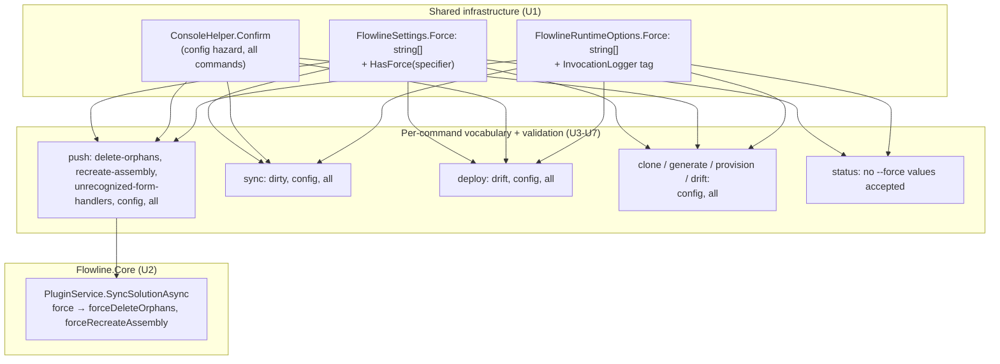

# Mandatory --force Specifier - Plan

> **Update (2026-07-12):** `push`'s `unrecognized-form-handlers` specifier was renamed to `delete-form-handlers` for brevity. References to `unrecognized-form-handlers` below reflect the vocabulary as originally planned and implemented; the reasoning for the `form` domain prefix still applies, the `unrecognized` qualifier does not carry over.

## Goal Capsule

- **Objective:** Replace bare `-f`/`--force` with a mandatory `--force <specifier>` across the CLI, so every force-gated hazard is named explicitly and never blanket-approved by accident.
- **Product authority:** `STRATEGY.md` (Flowline targets solo/small-team Dataverse consultants running interactive and CI/non-interactive invocations); this brainstorm's dialogue.
- **Open blockers:** None. Hard break confirmed — Flowline has no prior release to preserve compatibility with.

## Product Contract

### Summary

Replace the CLI's bare `-f`/`--force` boolean with a mandatory `--force <specifier>` value on every command that gates a destructive or overwrite operation. Each hazard gets its own named specifier value; a universal `all` value approves everything a given command has; bare `--force` with no value is a hard parse error everywhere, with no exceptions and no deprecation window.

### Problem Frame

One boolean `--force` currently gates every force-issue on a command indiscriminately. On `push` alone, a single `--force` silently approves up to four unrelated hazards at once — including recreating a plugin assembly, which deletes and recreates all its step and image registrations and their GUIDs. A user or CI script intending to approve one low-stakes hazard has no way to avoid approving a high-stakes one in the same invocation, and the current error text ("Use --force to allow") doesn't tell them what they're actually agreeing to.

### Key Decisions

- **Hard break, no deprecation window.** Bare `--force` becomes a parse error immediately; there is no prior release to protect compatibility for.
- **Per-command specifier vocabulary, not one global list.** Each command declares only the specifier values meaningful to it, matching the `--scope` pattern already used by `push` (`PushCommand.cs:34-36`). A single shared enum across all commands was considered and rejected — `--help <command>` would either show irrelevant values or need per-command filtering anyway, at which point it's the per-command approach with extra indirection.
- **`config` is the one specifier shared across commands**, because the hazard it names — overwriting an already-set value in `.flowline` — is genuinely cross-cutting infrastructure (`FlowlineCommand.cs:144-148,195` calling into `ProjectConfig.cs`), not a command-specific operation like the others.
- **`all` always means "every specifier this command has,"** including `config` when present. It is the one universal escape hatch, but a conscious one — typing the word `all` is a deliberate choice, unlike today's silent-by-omission blanket approval.
- **push's two orphan-deletion hazards (assembly, step) are merged into one `delete-orphans` value** rather than split by blast radius, keeping the vocabulary small — a handful of fixed, known categories — rather than fragmenting by internal implementation detail.
- **Specifier names take the shape each hazard actually needs, not one uniform template.** `delete-orphans` and `recreate-assembly` are verb-first, matching Flowline's own internal vocabulary (e.g. `PluginService.cs` logs `"...Deleting."` for the orphan case) — the bare noun alone would either collide with Flowline's separate multi-action orphan-cleanup concept (`CONCEPTS.md`'s Orphan handler/Orphan priority) or be meaningless standalone (`recreate` *what*?). `dirty`, `drift`, and `config` stay bare nouns — only one action is ever taken on each of those states, so no verb is needed. `unrecognized-form-handlers` needs both a qualifier (`unrecognized` — distinguishes it from the code's separate `foreign` and `stale` handler categories, which are never force-gated; verified against `FormEventPlanner.cs:91-134`) and a domain prefix (`form` — disambiguates from `push`'s plugin/assembly hazards, which are also a kind of Dataverse event handling).
- **Error messages name the exact required specifier(s)**, replacing today's generic `"...Use --force to allow"` text, so the CLI is self-documenting at the point of failure.

### Requirements

**Force specifier surface**
- R1. `--force`/`-f` takes a required value; invoking it with no value is a parse error on every command, with no fallback interpretation.
- R2. `--force <value>` is repeatable (`--force x --force y`), matching the existing `--scope` option shape (`PushCommand.cs:34-36`), not a comma-separated list.
- R3. `-f` keeps working as a short alias and also requires a value (`-f delete-orphans`).
- R4. `--force all` is accepted on every command that has at least one specifier value, and resolves to every hazard that command gates, including `config` where present.
- R5. Passing a specifier value not valid for the current command is a validation error naming the values that are valid for that command.

**Per-command specifier vocabulary**

| R-ID | Command | Specifier values | Hazard(s) covered |
|---|---|---|---|
| R6 | `push` | `delete-orphans`, `recreate-assembly`, `unrecognized-form-handlers`, `config`, `all` | Delete orphaned plugin assembly/step with no local source (`PluginService.cs:277,363`); assembly identity changed or downgraded → delete & recreate, losing step/image GUIDs (`PluginService.cs:453`); remove an unrecognized Event Handler (`CONCEPTS.md`) on a form — ambiguous provenance, distinct from the auto-dropped stale case and the untouched foreign case (`FormEventExecutor.cs:124`, `FormEventPlanner.cs:91-134`); config overwrite |
| R7 | `sync` | `dirty`, `config`, `all` | Overwrite uncommitted local package changes (`SyncCommand.cs:68`); config overwrite |
| R8 | `deploy` | `drift`, `config`, `all` | Skip drift validation for local-only or plugin-size-mismatch changes (`DeployCommand.cs:332`); config overwrite |
| R9 | `clone`, `generate`, `provision`, `drift` | `config`, `all` | Config overwrite only |
| R10 | `status` | — | No force-gated hazard; command is unaffected |

**Error messaging**
- R11. Every force-required error names the specific specifier(s) needed for that hazard (e.g. `"...Use --force recreate-assembly to allow"`), not a generic `--force` mention.
- R12. Force-related errors follow existing tone-of-voice conventions (`docs/tone-of-voice.md`): red, direct, tell the user what to do next, no passive voice.

### Acceptance Examples

- AE1. **Covers R1, R6.** Given `push` invoked non-interactively, when `--force` is passed with no value, then the command fails with Spectre's own generic missing-value parse error (e.g. "Option 'force' requires a value") **before any Flowline code runs — this error does not list `push`'s valid values**, because settings binding (and therefore `ValidateForce`, which owns the domain vocabulary) cannot execute until parsing succeeds; see AE1a for the value-listing case. (Corrected during planning — see Planning Contract's Product Contract preservation note and KTD9.)
- AE1a. **Covers R5, R6 (split out of the original AE1, which conflated the empty-value and invalid-value cases).** Given `push` invoked with `--force banana` (a value that isn't one of `push`'s specifiers), then the command fails with a validation error listing `push`'s valid values: `delete-orphans`, `recreate-assembly`, `unrecognized-form-handlers`, `config`, `all`.
- AE2. **Covers R4, R7.** Given `sync` hits both the `dirty` and `config` hazards in one run, when invoked with `--force all`, then both hazards are approved without a further prompt.
- AE3. **Covers R5, R8.** Given `deploy` invoked with `--force dirty`, when `dirty` is not one of `deploy`'s valid values, then the command fails with a validation error naming `deploy`'s actual valid values: `drift`, `config`, `all`.

### Scope Boundaries

- The `config` hazard's own interactive confirm prompt (`ConsoleHelper.Confirm`'s TTY behavior) is unchanged — only what's required to skip it non-interactively changes.
- No change to how `PluginService` or `FormEventExecutor` compute or classify hazards (what counts as an orphan, what counts as an identity change, what counts as unrecognized) — only how the CLI surface gates them, and the granularity of the boolean(s) used to gate.
- `DeployCommand.cs:334`'s remediation-text bug (told users to run `sync` instead of `push`) was found during this brainstorm and already fixed separately, outside this plan's scope.
- `ProvisionCommand`'s existing `--allow-overwrite` flag is a separate, already-explicit override unrelated to `--force` — untouched by this plan.

### Dependencies / Assumptions

- Spectre.Console.Cli's `CommandOption` supports a repeatable `string[]`-typed option with a required value template (`<SPECIFIER>`), in the same shape as the existing `--scope` option (`PushCommand.cs:39-41`) — confirmed low risk, since that exact array-binding mechanism is already working code in this repo (`PushCommand.Settings.Scopes`).

### Sources / Research

- `FlowlineSettings.cs:12-14` — current `-f|--force` boolean definition, shared base for every command.
- `ConsoleHelper.cs:43-59` — `Confirm()`, the shared gate that reads `settings.Force` for non-interactive auto-accept.
- `PluginService.cs:277,363,453` — orphan assembly/step deletion and assembly recreate hazards.
- `FormEventExecutor.cs:124-147` — unrecognized Event Handler removal, gated once per push (fires during both the cleanup and registration passes).
- `FormEventPlanner.cs:91-134` — distinguishes unrecognized (ambiguous provenance, force-gated) from stale (auto-dropped, no confirmation) and foreign (untracked library, never touched) handlers.
- `SyncCommand.cs:68-78` — uncommitted local change overwrite.
- `DeployCommand.cs:312-334` — drift validation skip.
- `ProjectConfig.cs:48,83,118,153,224` and `FlowlineCommand.cs:144-148,195` — cross-cutting config-overwrite hazard.
- `docs/tone-of-voice.md` — error message conventions.
- `CONCEPTS.md` (Orphan handler / Orphan priority) and `STRATEGY.md` (Drift detection track, `--no-delete` milestone) — established Flowline vocabulary that motivated disambiguating `delete-orphans` from the product's separate multi-action orphan-cleanup concept.
- `CONCEPTS.md` (Form Library / Event Handler / Event annotation) — canonical Dataverse Maker Portal-aligned terms that motivated `unrecognized-form-handlers` over the earlier, vaguer `form-handlers`.

---

## Planning Contract

**Product Contract preservation:** changed — Dependencies/Assumptions, and AE1 (split into AE1/AE1a). The original assumption named a "repeatable, per-command-typed enum array in the same shape as `--scope`." Planning verified (by loading `Spectre.Console.Cli.dll` v0.55.0 via reflection — no local source available, and no existing hyphenated-enum precedent in this codebase) that Spectre's default enum `TypeConverter` uses `Enum.Parse`, which cannot parse hyphenated tokens (`delete-orphans`, `recreate-assembly`, `unrecognized-form-handlers`) without a custom converter. Rather than introduce an unproven custom `TypeConverter` per command, the plan uses a plain repeatable `string[]` (same array-binding mechanism as `--scope`, minus the enum type) plus explicit per-command validation in code — mirroring the pattern `PushCommand.ResolveScope` (`PushCommand.cs:321-350`) already uses for `--scope` value validation. This changes *how* R1-R5 are implemented, not what they require. Separately, planning also found the original AE1 conflated two distinct failure paths (empty value vs. invalid value) that cannot both produce a values-listing error under Spectre's parse-then-execute sequencing — true regardless of the enum-vs-string[] choice — so AE1 was split into AE1 (empty value, generic parse error, no values listed) and AE1a (invalid value, `ValidateForce` error, values listed). See KTD9.

**Behavior-change note (found during empirical verification, not a new requirement):** `push` and `sync` have a leading optional positional `[solution]`; `deploy` and `drift` have a leading required positional `<target>` (prod/uat/test/url). Because `--force` now requires a value, a bare flag immediately followed by what looks like the next positional token — e.g. `flowline deploy --force prod` (a plausible pre-existing muscle-memory invocation, previously valid since bare `--force` took no value and `prod` bound cleanly to `<target>`) — now binds that token as `--force`'s value instead, leaving the positional unset. This fails safely — `ValidateForce` rejects a non-specifier token and names the real values (and for `deploy`/`drift`, the now-missing required `<target>` surfaces its own error too) — but is a visible behavior change worth a callout in U8's documentation pass, not a silent trap (confirmed empirically: `CommandApp.Run(["probe","--force","MySolution"])` against a `[CommandArgument(0,"[solution]")]`-shaped settings class bound `Force = ["MySolution"]` and left the positional null; the same binding order applies to a required `<target>` positional).

### Key Technical Decisions

- **KTD1. `FlowlineSettings.Force` changes type from `bool` to `string[]`, staying on the shared base class.** `[CommandOption("-f|--force <SPECIFIER>")]`. Keeping it on the base (rather than redeclaring per-command, which would require hiding via `new` and break the several call sites below that read it generically) preserves `FlowlineCommand<TSettings>.InitializeRuntimeOptions` (`FlowlineCommand.cs:45-49`), `InvocationLogger`'s telemetry tag (`InvocationLogger.cs:43,60`), and `ConsoleHelper.Confirm` (`ConsoleHelper.cs:46-59`) as generic, command-agnostic code. `StatusCommand.Settings` still inherits the property (and the CLI option) since it extends `FlowlineSettings`, but per KTD5 it is validated to always be empty.
- **KTD2. `FlowlineSettings` gains an instance helper `HasForce(string specifier)`:** `Force.Contains(specifier, StringComparer.OrdinalIgnoreCase) || Force.Contains("all", StringComparer.OrdinalIgnoreCase)`. This is the single implementation of R4's "all resolves to every hazard" rule — every hazard-gate call site and `ConsoleHelper.Confirm` use it instead of duplicating the `all`-fallback check.
- **KTD3. Each command validates its own vocabulary in code, not via Spectre's `Settings.Validate()` override.** `CommandSettings.Validate()` exists in Spectre.Console.Cli 0.55.0 (confirmed via reflection: `public virtual ValidationResult Validate()`), but this codebase has no existing precedent for it, and a `Validate()` failure's resulting exit code is not verified to route through the `FlowlineException`/`ExitCode` contract (`docs/solutions/architecture-patterns/ai-agent-consumable-cli-contract-2026-06-07.md`) the same way. Each command instead adds a static `ValidSpecifiers` array and a static `ValidateForce(Settings settings)` method, called at the top of `ExecuteFlowlineAsync` (or `ExecuteAsync` for `StatusCommand`), throwing `FlowlineException(ExitCode.ValidationFailed, ...)` on an unrecognized value — directly mirroring the already-proven `PushCommand.ResolveScope` mutual-exclusivity check (`PushCommand.cs:326-329`). **Test-seam split (empirically motivated):** message-content assertions (R5, R11, AE1a — "names the valid values") test `ValidateForce` directly the same way `ResolveScope_*_ShouldThrow` tests already do (`act.Should().Throw<FlowlineException>().Where(e => e.Message.Contains(...))`, `PushCommand.cs` test file), not through `CommandApp.Run`. The `CommandApp` seam (KTD9) is exit-code-only, since Spectre renders its own errors via `AnsiConsole` rather than `Console.Out`/`Console.Error` — a simple `Console.SetOut` redirection in a test captures nothing (confirmed empirically: the bare-`--force` probe returned `OUTPUT=[]` despite a real non-zero exit code), so `CommandApp`-based tests should only assert `ExitCode != 0`, never message content.
- **KTD4. `PluginService.SyncSolutionAsync` (and its two internal overloads) splits its single `bool force` parameter into two: `bool forceDeleteOrphans, bool forceRecreateAssembly`.** Today one `force` bool flows from `PushCommand.cs:151` into `GetOrRegisterAssemblyAsync` (`PluginService.cs:453`, the `recreate-assembly` hazard) and into both `WarnOrphanAssembliesAsync` (`PluginService.cs:277`) and `WarnOrphanStepsAsync` (`PluginService.cs:363`, both the `delete-orphans` hazard). Since R6 requires these to be independently approvable, the two orphan-warning call sites take `forceDeleteOrphans`; `GetOrRegisterAssemblyAsync` takes `forceRecreateAssembly`. `FormEventService.CleanupOrphanedAsync`/`RegisterAsync` (`FormEventService.cs:30,42`) both stay single-`bool force` — they're the same `unrecognized-form-handlers` hazard, so `PushCommand` computes one bool and passes it to both, unchanged in shape.
- **KTD5. `StatusCommand` (R10) validates `settings.Force` is empty and rejects any value with `ExitCode.ValidationFailed`.** `StatusCommand` does not extend `FlowlineCommand<TSettings>` (it extends `AsyncCommand<Settings>` directly — `StatusCommand.cs:13`) and never reaches `ProjectConfig.GetOrUpdate*`/`ConsoleHelper.Confirm`, so it has no reachable hazard at all — including `config`. Rather than leave `--force <anything>` silently accepted and ignored (which would violate R5's "invalid values are a validation error" for a command whose valid list is empty), `StatusCommand.ExecuteAsync` checks `settings.Force.Length > 0` and throws before doing anything else.
- **KTD6. Clone/Generate/Provision/Drift (R9) share one `static readonly string[] ValidSpecifiers = ["config", "all"]` constant and one shared validation call**, since their vocabulary is identical — avoiding four copies of the same two-element array. Defined once (e.g. as an internal static field on `FlowlineSettings` or a small shared static class) and referenced by all four commands' `ValidateForce` methods.
- **KTD7. Error messages naming a required specifier (R11) are updated at their existing throw/print sites**, not centralized — each site already knows exactly which hazard it's gating, so the fix is a literal string edit (e.g. `PluginService.cs:282,392,456-457`: `"...Use --force to delete."` → `"...Use --force delete-orphans to delete."` / `"...Use --force recreate-assembly to allow."`). `ConsoleHelper.Confirm` (`ConsoleHelper.cs:55`) is the one shared site (used by every `config`-hazard call across all commands) and always names `config`, since that specifier name is constant across commands per the Key Decisions.
- **KTD8. `--force`'s `[Description]` text stays generic on the shared base class; per-command vocabulary discoverability is delivered by R5's runtime validation error, not by Spectre's own `--help` text.** The original Key Decision rejecting a single shared enum was about `--help <command>` showing irrelevant *values* — that risk is specific to an enum's reflected member list, not to a `string[]` option's description string. Overriding `[Description]` per command would require redeclaring `Force` with `new` on every command's `Settings` (reintroducing the per-command-type complexity KTD1 deliberately avoided) for a benefit R5 already delivers operationally: `flowline status --force anything` (or any invalid value on any command) immediately fails with an error naming that exact command's valid values. `--help` itself shows one generic sentence (e.g. "Approve a specific hazard by name for this command; repeatable. Pass 'all' for everything this command gates — an invalid value lists the valid ones.").
- **KTD9 (verified empirically).** Built a throwaway `CommandApp` harness (a minimal `Command<T>` with `[CommandOption("-f|--force <SPECIFIER>")] public string[] Force`) and ran it directly — `Spectre.Console.Testing` 0.57.2 (this repo's locked version) has no `CommandAppTester`/`CommandApp`-parsing test helper at all; it only exports `TestConsole`/`TestConsoleExtensions`/`TestConsoleInput`/`TestCapabilities` (console-output testing, not CLI-argument testing), confirmed both by a `CS0246` compile error and a byte-level type-name scan of the DLL. Testing R1/R2 therefore means instantiating `Spectre.Console.Cli.CommandApp` directly in a test and calling `.Run(args)`, not reaching for a nonexistent tester package. Using that harness, confirmed: `["probe", "--force"]` (bare, no value) returns a non-zero exit code (`-1`), and structurally cannot list domain-specific valid values in that error — Spectre's own missing-value check runs during settings binding, strictly before `Execute`/`ValidateForce` ever gets a constructed `Settings` to inspect, so no code that knows the per-command vocabulary has run yet (see the AE1/AE1a split above); `["probe", "--force", "--verbose"]` (immediately followed by another flag) also returns non-zero — Spectre does **not** swallow the next flag as `--force`'s value; `["probe", "--force", "config"]` parses to `Force = ["config"]`; `["probe", "--force", "config", "--force", "dirty"]` parses to `Force = ["config", "dirty"]`; `["probe", "--force", "MySolution"]` against a settings class with a leading `[CommandArgument(0, "[solution]")]` positional (matching push/sync/deploy/drift's actual shape) parsed successfully (`exit 0`) with `Force = ["MySolution"]` and the positional left **null** — confirming the behavior-change note above. This is the same required-value, repeatable-array parsing behavior already proven by `--scope` (`PushCommand.Settings.Scopes`), now directly confirmed for the plain-`string[]` shape this plan uses — R1, R2, and R3 are satisfied by Spectre's own parser before any command code runs, with no gap for a bare flag or a swallowed adjacent flag; the value-listing half of AE1's original intent is satisfied by R5/`ValidateForce` on the invalid-value path, not the empty-value path.

### High-Level Technical Design

Shared infrastructure (KTD1-2) sits below every command; each command adds only its own vocabulary + validation + wiring on top. `push` is the only command needing a Core-layer signature change (KTD4), because it's the only command whose single legacy `force` bool actually gated two independently-specifiable hazards.

---

## Implementation Units

### U1. Shared force-specifier infrastructure

**Goal:** Give every command a common `string[] Force` surface with an `all`-aware hazard check, without breaking the generic code that reads `Force` today.

**Requirements:** R1, R2, R3, R4 (infrastructure half); supports R6-R10.

**Dependencies:** None — foundation unit.

**Files:**
- `src/Flowline/FlowlineSettings.cs` — change `Force` from `bool` to `string[]` with `[CommandOption("-f|--force <SPECIFIER>")]`; add `public bool HasForce(string specifier)`.
- `src/Flowline/Utils/ConsoleHelper.cs` — `Confirm()` (lines 46-59): replace `settings?.Force == true` with `settings?.HasForce("config") == true`; update the thrown message to `"...Use --force config to proceed."`.
- `src/Flowline.Core/FlowlineRuntimeOptions.cs` — `Force` property: `bool` → `string[]`.
- `src/Flowline/Commands/FlowlineCommand.cs` — `InitializeRuntimeOptions` (line 48): `RuntimeOptions.Force = settings.Force;` (type now matches directly, no logic change).
- `src/Flowline/Commands/InvocationLogger.cs` — lines 43, 60: adapt the structured-log/activity-tag call sites from a bool to a `string[]` (e.g. join with `,` for the tag value); no behavioral requirement beyond "doesn't break the build."
- `tests/Flowline.Tests/ConsoleHelperTests.cs` — update/extend for the new `HasForce`-based check.

**Approach:** This is a pure plumbing change — no new hazard logic, just widening the type `bool` → `string[]` and centralizing the `all`-fallback in `HasForce`. Do this unit first; every other unit depends on `Force` already being `string[]` and `HasForce` existing.

**Patterns to follow:** `PushCommand.Settings.Scopes` (`PushCommand.cs:39-41`) for the repeatable-`CommandOption` shape on an array-typed property.

**Test scenarios:**
- Happy path: `HasForce("config")` returns `true` when `Force = ["config"]`; returns `true` when `Force = ["all"]`; returns `false` when `Force = ["dirty"]`.
- Edge case: `HasForce("config")` returns `false` when `Force = []` (default/no `--force` passed).
- Edge case: `HasForce` is case-insensitive (`Force = ["CONFIG"]` matches `HasForce("config")`).
- `ConsoleHelper.Confirm`: non-interactive + `Force` contains `"config"` → returns `true` without prompting (replaces existing `Settings_Force_ShouldDefaultToFalse`-style tests, now asserting `Force` defaults to `[]`).
- `ConsoleHelper.Confirm`: non-interactive + `Force` empty → throws `FlowlineException` with `ExitCode.ForceRequired` and a message naming `config`.

**Verification:** Existing `ConsoleHelperTests.cs` pass with the new type; solution builds with `Force` as `string[]` everywhere it's currently read as `bool` (compiler will surface every remaining call site).

---

### U2. `PluginService`: split `force` into `forceDeleteOrphans` / `forceRecreateAssembly`

**Goal:** Let `push` approve `delete-orphans` and `recreate-assembly` independently, at the Core service layer.

**Requirements:** R6 (delete-orphans / recreate-assembly independence), R11 (message updates for these two hazards).

**Dependencies:** None (Core-layer change, independent of U1's CLI-layer plumbing — can run in parallel with U1).

**Files:**
- `src/Flowline.Core/Services/PluginService.cs` — `SyncSolutionAsync` (both overloads, lines 94-115), `GetOrRegisterAssemblyAsync` (~line 405-476), `WarnOrphanAssembliesAsync` (~line 258-282), `WarnOrphanStepsAsync` (~line 340-392): replace the single `bool force` parameter with `bool forceDeleteOrphans, bool forceRecreateAssembly`, routing each to the call site(s) that need it (`GetOrRegisterAssemblyAsync` gets `forceRecreateAssembly`; both `WarnOrphan*Async` methods get `forceDeleteOrphans`).
- `tests/Flowline.Core.Tests/PluginServiceTests.cs` — 9 call sites currently pass a single `force: true` named argument; update each to pass both new named arguments with the value appropriate to what that test is exercising (recreate-assembly tests pass `forceRecreateAssembly: true, forceDeleteOrphans: false` and vice versa, unless the test is agnostic, in which case both `true`).

**Approach:** Purely a signature/plumbing split — the orphan/identity-change *detection* logic (what counts as an orphan, what counts as a version downgrade) is unchanged per the Scope Boundaries; only the gating boolean's granularity changes. Update the three "Use --force..." message strings (`PluginService.cs:282,392` → `"...Use --force delete-orphans to delete."`; `PluginService.cs:456-457` → `"...Use --force recreate-assembly to allow."`; the cosmetic `forceNote` at `PluginService.cs:475-476` → `"(--force recreate-assembly)"`).

**Patterns to follow:** Existing parameter-threading shape in `SyncSolutionAsync` — no new pattern, just one more parameter of the same kind.

**Test scenarios:**
- Happy path: `forceDeleteOrphans: true, forceRecreateAssembly: false` deletes an orphan assembly but does NOT allow an identity-changed assembly to be recreated (throws `ForceRequired` for that half).
- Happy path: `forceRecreateAssembly: true, forceDeleteOrphans: false` allows assembly recreate but does NOT delete an orphaned step (throws `ForceRequired` for that half).
- Happy path: both `true` behaves exactly as today's `force: true` did (regression coverage for the 9 existing call sites).
- Edge case: both `false` — orphan assembly/step surfaces a warning only (unchanged from today); identity-changed assembly throws `FlowlineException(ExitCode.ForceRequired, ...)` naming `recreate-assembly`.

**Verification:** `PluginServiceTests.cs` passes with the split signature; no change to which Dataverse calls fire for a given true/false combination that matches today's single-bool behavior (both flags true ⇔ old `force: true`; both false ⇔ old `force: false`).

---

### U3. `push` — specifier vocabulary, validation, and wiring

**Goal:** Give `push` its full 5-value vocabulary (R6) and wire each hazard to the right boolean, replacing the single blanket `settings.Force`.

**Requirements:** R1-R6, R11, R12.

**Dependencies:** U1, U2.

**Files:**
- `src/Flowline/Commands/PushCommand.cs` — add `static readonly string[] ValidSpecifiers = ["delete-orphans", "recreate-assembly", "unrecognized-form-handlers", "config", "all"]`; add `static void ValidateForce(Settings settings)` (mirrors `ResolveScope`'s validation shape at `PushCommand.cs:321-350`), called early in `ExecuteFlowlineAsync`; replace `settings.Force` at lines 151, 166, 179 with computed hazard-specific values: `settings.HasForce("delete-orphans")` and `settings.HasForce("recreate-assembly")` passed as the two new `PluginService.SyncSolutionAsync` parameters (line 151), and `settings.HasForce("unrecognized-form-handlers")` passed to both `formEventService.CleanupOrphanedAsync` (line 166) and `formEventService.RegisterAsync` (line 179).
- `src/Flowline.Core/Services/FormEventExecutor.cs` — line 216: `"Use --force to proceed."` → `"Use --force unrecognized-form-handlers to proceed."`.
- `tests/Flowline.Tests/PushCommandTests.cs` — add `ValidateForce` tests (mirroring the existing `ResolveScope_*` test style at lines 38-132); update any test relying on `Force` as `bool`.

**Approach:** `ValidateForce` throws `FlowlineException(ExitCode.ValidationFailed, $"...Use one of: {string.Join(", ", ValidSpecifiers)}.")` when `settings.Force` contains a value not in `ValidSpecifiers`. Call it before any Dataverse work begins (same place `ResolveScope` already runs, near the top of `ExecuteFlowlineAsync`).

**Patterns to follow:** `PushCommand.ResolveScope` (`PushCommand.cs:321-350`) for the validate-in-code shape; `PushCommand.Settings.Scopes` (`PushCommand.cs:39-41`) for the `[CommandOption]` array-property shape (already present on the base class per U1 — per KTD8, no per-command `[Description]` override; the base class's generic description plus `ValidateForce`'s error message are the vocabulary-discoverability mechanism).

**Test scenarios:**
- Happy path: `--force delete-orphans` deletes an orphan assembly, doesn't touch an identity-changed assembly, doesn't remove unrecognized handlers.
- Happy path: `--force all` approves all three push hazards plus `config` in one invocation.
- Happy path: `--force delete-orphans --force config` (repeated flag) approves exactly those two, leaving `recreate-assembly` and `unrecognized-form-handlers` gated (Covers AE2's repeatable-flag shape, applied to push).
- Edge case (required, not optional — see KTD9), `CommandApp` seam, exit-code-only per KTD3's test-seam split: `--force` with no value is rejected by Spectre's own parser before `ExecuteFlowlineAsync`/`ValidateForce` ever runs (Covers AE1 — assert non-zero exit only; do not assert message content here). Add a `CommandApp`-based test (instantiate `new CommandApp()`, `.Configure(c => c.AddCommand<PushCommand>("push"))`, `.Run(args)`, assert non-zero exit) — `Spectre.Console.Testing` has no dedicated CLI-parsing tester (verified per KTD9), so this is a direct `CommandApp` test, not a `CommandAppTester` one.
- Error path, `ValidateForce` seam per KTD3: `--force banana` (not one of push's 5 values) fails validation naming push's actual valid values (Covers AE1a) — assert directly on the thrown `FlowlineException.Message`, mirroring `ResolveScope_*_ShouldThrow`'s style, not via `CommandApp`.
- Error path, `ValidateForce` seam: `--force dirty` (a `sync`-only value) fails validation, naming push's actual 5 valid values.
- Edge case, `CommandApp` seam: `--force MySolution` (force immediately followed by what looks like the positional solution name, with the solution argument otherwise omitted) binds `MySolution` as `--force`'s value and leaves the `[solution]` positional unset (assert on the bound `Settings.Force`/`Settings.Solution` values directly, exit-code/downstream-error assertions optional) — not a silent misfire (Covers the Planning Contract's behavior-change note).
- Integration: `--force recreate-assembly` on an assembly with a version downgrade proceeds past the `GetOrRegisterAssemblyAsync` gate (`PluginService.cs:453`) without also silently approving an unrelated orphan step deletion in the same run.

**Verification:** `flowline push --force delete-orphans` against a solution with an orphaned assembly (no local source) deletes it; the same invocation against a solution with only an identity-changed assembly fails with a `recreate-assembly`-naming error.

---

### U4. `sync` — specifier vocabulary, validation, and wiring

**Goal:** Give `sync` its 3-value vocabulary (R7): `dirty`, `config`, `all`.

**Requirements:** R1-R5, R7, R11, R12.

**Dependencies:** U1.

**Files:**
- `src/Flowline/Commands/SyncCommand.cs` — add `static readonly string[] ValidSpecifiers = ["dirty", "config", "all"]`; add `ValidateForce`; replace `settings.Force` (line 68) with `settings.HasForce("dirty")`; update line 77's message: `"...or re-run with --force."` → `"...or re-run with --force dirty."`.
- `tests/Flowline.Tests/SyncCommandTests.cs` — replace `Settings_Force_ShouldDefaultToFalse` (line 9-11, asserts `Force.Should().BeFalse()`) with a default-empty-array assertion; add `ValidateForce` tests.

**Approach:** Same validate-then-compute shape as U3, scaled down to one hazard plus `config`.

**Patterns to follow:** U3's `ValidateForce` shape (establish it there first, since `push` is implemented first per dependency order — this unit can copy the shape, not the vocabulary).

**Test scenarios:**
- Happy path: `--force dirty` on a dirty `src/` tree overwrites with a warning (unchanged behavior from today's `--force`, now gated by name).
- Happy path: `--force all` approves `dirty` and `config` together (Covers AE2 exactly as originally specified).
- Edge case: no `--force` on a dirty tree throws `ExitCode.DirtyWorkingDirectory` with the updated message naming `dirty`.
- Error path: `--force config` alone does NOT suppress the dirty-tree error (specifiers are independent — approving `config` doesn't imply `dirty`).
- Error path: an unrecognized value (e.g. `--force delete-orphans`) fails validation naming `sync`'s actual 3 valid values.

**Verification:** `flowline sync --force dirty` on a repo with uncommitted `Package/src/` changes proceeds with a warning; `flowline sync` (no force) on the same repo fails with `DirtyWorkingDirectory` and a message that says `--force dirty`.

---

### U5. `deploy` — specifier vocabulary, validation, and wiring

**Goal:** Give `deploy` its 3-value vocabulary (R8): `drift`, `config`, `all`.

**Requirements:** R1-R5, R8, R11, R12.

**Dependencies:** U1.

**Files:**
- `src/Flowline/Commands/DeployCommand.cs` — add `static readonly string[] ValidSpecifiers = ["drift", "config", "all"]`; add `ValidateForce`; replace `settings.Force` (line 332) with `settings.HasForce("drift")`; update line 334's message: `"...or use --force to skip."` → `"...or use --force drift to skip."`.
- `tests/Flowline.Tests/DeployCommandDtapGateTests.cs` (or a new `DeployCommandForceTests.cs` alongside the existing `DeployCommand*Tests.cs` files) — add `ValidateForce` and drift-gating tests.

**Approach:** Same shape as U4. Note the naming proximity between the `drift` *specifier* here and the separate `flowline drift` *command* (R9) — same word, different scope (a CLI verb vs. a `deploy`-local hazard name); no code collision, but worth a one-line comment at the `ValidSpecifiers` declaration to preempt confusion for a future reader.

**Patterns to follow:** U3/U4's `ValidateForce` shape.

**Test scenarios:**
- Happy path: `--force drift` on a solution with `OnlyLocal`/`PluginSizeMismatch` drift warnings proceeds past `ValidateLocalState` (`DeployCommand.cs:312-335`).
- Happy path: `--force all` approves `drift` and `config` together.
- Edge case: no `--force` with drift present throws `ExitCode.ValidationFailed` naming `drift`.
- Error path: an unrecognized value (e.g. `--force dirty`, a `sync`-only value) fails validation naming `deploy`'s actual 3 valid values (Covers AE3 exactly as originally specified).

**Verification:** `flowline deploy prod --force drift` on a solution with local-only plugin changes proceeds; the same command without `--force` fails, naming `drift` in the error.

---

### U6. `clone` / `generate` / `provision` / `drift` — shared config-only vocabulary

**Goal:** Give these four commands the shared 2-value vocabulary (R9): `config`, `all` — no command-specific hazards.

**Requirements:** R1-R5, R9, R11, R12.

**Dependencies:** U1.

**Files:**
- `src/Flowline/FlowlineSettings.cs` (or a small new shared static class, e.g. `src/Flowline/Commands/ConfigOnlyForce.cs`) — `internal static readonly string[] ConfigOnlyValidSpecifiers = ["config", "all"]`, shared by all four commands per KTD6.
- `src/Flowline/Commands/CloneCommand.cs`, `src/Flowline/Commands/GenerateCommand.cs`, `src/Flowline/Commands/ProvisionCommand.cs`, `src/Flowline/Commands/DriftCommand.cs` — each adds a `ValidateForce` call (or one shared static helper taking `Settings settings, string[] valid` if the four `Settings` types share no common non-`FlowlineSettings` base — verify at implementation time whether a single shared validator taking `FlowlineSettings` works, or each needs its own thin wrapper) at the top of `ExecuteFlowlineAsync`.
- `tests/Flowline.Tests/GenerateCommandTests.cs`, `tests/Flowline.Tests/ProvisionCommandTests.cs`, `tests/Flowline.Tests/DriftCommandTests.cs` — add `ValidateForce` tests. No existing `CloneCommandTests.cs` — create one covering at minimum `ValidateForce`, following the sibling files' structure.

**Approach:** These four commands never call `settings.Force` directly today — `config` is only ever reached indirectly through `GetAndCheckEnvironmentInfoAsync`/`GetAndCheckSolutionAsync` (`FlowlineCommand.cs:123-208`) calling into `ProjectConfig.GetOrUpdate*`/`ConsoleHelper.Confirm`, which U1 already makes `HasForce`-aware. This unit is therefore validation-only (reject unrecognized values) — no hazard-wiring change needed, since `config` routes through the already-fixed shared `Confirm()`.

**Patterns to follow:** U3's `ValidateForce` shape, reduced to the shared 2-value list.

**Test scenarios:**
- Happy path: `--force config` on any of the four commands, when a `.flowline` value is already set and the input differs, skips the interactive confirm and proceeds (Covers AE2's mechanism, applied per-command).
- Happy path: `--force all` behaves identically to `--force config` for these four commands (no other hazard for `all` to add).
- Error path: an unrecognized value (e.g. `--force dirty`) fails validation naming the command's actual 2 valid values.
- Test expectation: none beyond validation — these commands have no other force-gated behavior to exercise (per R9's "config overwrite only").

**Verification:** `flowline clone --force config` (or the equivalent per-command config-overwrite trigger) skips the "Overwrite it?" prompt non-interactively; an invalid specifier value on any of the four fails with that command's own valid-values list, not a generic message.

---

### U7. `status` — no force-gated hazard

**Goal:** `status` accepts `--force` (inherited from the shared base per KTD1) but rejects any value, since it has no hazard at all (R10).

**Requirements:** R5, R10.

**Dependencies:** U1.

**Files:**
- `src/Flowline/Commands/StatusCommand.cs` — at the top of `ExecuteAsync` (line 24), add: if `settings.Force.Length > 0`, throw `FlowlineException(ExitCode.ValidationFailed, "'status' has no force-gated behavior — remove --force.")`.
- A new or existing `tests/Flowline.Tests/StatusCommandTests.cs` (verify whether one exists — not seen in the current test listing; create if absent) — add the rejection test.

**Approach:** `StatusCommand` extends `AsyncCommand<Settings>` directly, not `FlowlineCommand<TSettings>` (`StatusCommand.cs:13`), so it cannot share U3-U6's `ExecuteFlowlineAsync`-based validation hook — this check goes directly in `StatusCommand.ExecuteAsync`.

**Test scenarios:**
- Happy path: `flowline status` (no `--force`) behaves exactly as today.
- Error path: `flowline status --force config` (or any other value) fails with `ExitCode.ValidationFailed` before any status output is printed.
- Test expectation: no other force-related coverage needed — `status` never reaches `ConsoleHelper.Confirm` (it only reads config via `ProjectConfig.Load`, never `GetOrUpdate*`).

**Verification:** `flowline status --force anything` exits non-zero with a message telling the user to remove the flag; `flowline status` alone is unaffected.

---

### U8. Documentation — wiki Command Reference, Deploy guide, AI-Agents contract

**Goal:** Keep the GitHub Wiki in sync with the new per-command `--force` surface, per this repo's own convention of updating wiki pages alongside user-facing CLI changes.

**Requirements:** Supports R6-R12 (documentation of the shipped behavior, not a new behavioral requirement itself).

**Dependencies:** U3, U4, U5, U6, U7 (needs the final per-command vocabulary settled before describing it).

**Files:**
- `Flowline.wiki/03-Command-Reference.md` — replace the single global `-f, --force` row (line 29) with either a per-command table or a pointer to each command's own `--help` output plus the full vocabulary table (mirroring the Requirements table's R6-R10 shape in this plan).
- `Flowline.wiki/07-Deploy.md` — line 25's `"...or pass --force to skip the check"` → `"...or pass --force drift to skip the check"`.
- `Flowline.wiki/10-AI-Agents.md` — lines 21, 24, 37, 38, 64, 72: update the exit-code corrective-action table (14 `VersionConflict`, 17 `ForceRequired`) and the example invocation (`flowline deploy prod --force` → `flowline deploy prod --force drift`) to name real specifiers, since this page is explicitly the machine-readable contract AI agents read for corrective actions.

**Approach:** Text-only edits, no code. Do this last so the vocabulary being documented is final, not provisional. Include one explicit callout (in `03-Command-Reference.md`, near the `--force` row) about the positional-argument interaction found during planning: since `--force` now requires a value, a bare `--force` immediately followed by a positional token (e.g. `flowline deploy --force prod`, or `flowline push --force MySolution`) binds that token as the force value instead of its intended positional — always name the specifier explicitly and put the positional in its own place, e.g. `flowline deploy prod --force drift` / `flowline push MySolution --force delete-orphans`.

**Test scenarios:** Test expectation: none — documentation only.

**Verification:** Wiki pages no longer show a bare `--force` example anywhere; every example names a real specifier for that command.

---

## Verification Contract

- All new/changed unit tests pass: `dotnet test` across `Flowline.Tests` and `Flowline.Core.Tests`.
- Every hazard's happy-path, edge-case, and error-path test scenarios listed per unit above are implemented and pass.
- `dotnet build` succeeds with zero warnings introduced by the `Force` type change (the compiler will surface every remaining `bool`-typed read of `.Force` across the solution — treat any surviving one as a missed call site, not a warning to suppress).
- R1 (bare `--force` with no value is a parse error) is covered by a required `CommandApp`-based test in U3 (see KTD9) — not optional. `Spectre.Console.Testing` has no `CommandAppTester`; use `Spectre.Console.Cli.CommandApp` directly, exactly as the throwaway harness that verified this behavior during planning did.
- Every AE1, AE1a, AE2, and AE3 acceptance example is reproducible against the built CLI.

## Definition of Done

- U1-U8 all complete; every command's `--force` behavior matches its row in the Requirements table (R6-R10).
- No remaining reference to `settings.Force` as a `bool` anywhere in `src/` (compiler-enforced) or in test files (grep-verified).
- Wiki pages (`03-Command-Reference.md`, `07-Deploy.md`, `10-AI-Agents.md`) show only specifier-qualified `--force` examples.
- `docs/tone-of-voice.md` conventions hold for every new/changed error message (red, direct, names the next action) — spot-check against `/tone` if available.
