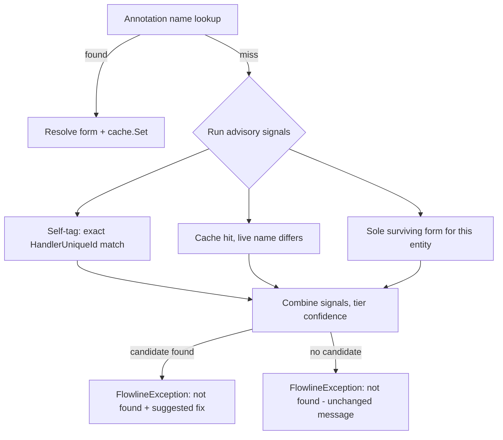

# Form Event Rename Resilience - Plan

## Goal Capsule

- **Objective:** when a form-event annotation's name lookup fails against Dataverse, give the developer an actionable, evidence-based suggestion instead of a bare "not found" — without ever resolving, auto-fixing, or silently succeeding.
- **Authority hierarchy:** Requirements below are binding; Key Technical Decisions guide implementation choices where the Requirements leave room; implementer judgment fills anything neither covers.
- **Stop conditions:** if closing a gap would require auto-editing an annotation source file or changing the annotation grammar, stop and raise it as an open question rather than implementing it — both are explicitly out of scope this round.
- **Execution profile:** local library change, no deploy or release surface; a single implementer session is sufficient.
- **Tail ownership:** implementer runs the test suite and confirms no behavior change to a successful push before calling the work done.

---

## Product Contract

### Summary

Add rename resilience to Flowline's form-event registration. A user-profile-scoped cache remembers resolved form identities across pushes, and a three-signal advisory resolver (self-tag match, cache lookup, sole-surviving-form) enriches a lookup-miss error with a concrete suggestion. The push still always fails on a mismatch — nothing here auto-corrects source or lets registration proceed silently.

### Problem Frame

`FormEventReader` resolves a form-event annotation's target `systemform` by a literal `(EntityLogicalName, FormName)` string match (`FormEventReader.cs:104-149`). Renaming a form in the Maker Portal doesn't touch the annotation, so the next `push` fails with `"form '{form}' not found for entity '{entity}' (Main or Quick Create form)."` (`FormEventReader.cs:146`) — even though the form's existing handler registration keeps working in Dataverse (it's wired by `formid`, not name). The developer has no clue *what* changed or where to look; they have to go compare Maker Portal history against source by hand.

### Requirements

**Rename cache**

- R1. A user-profile-scoped cache persists resolved `(entity, form name) -> formId` mappings per Dataverse organization, following the `FlowlineStoragePaths` storage-root convention rather than a repo-local or committed file.
- R2. The cache updates on every successful form resolution during a push, including `--dry-run` runs.
- R3. A missing, empty, or corrupt cache file degrades to a cache-miss rather than failing the push.

**Rename detection**

- R4. When a form-event annotation's name lookup fails, Flowline gathers three advisory signals before failing: a self-tag match against the form's own previously-written handler fingerprint, a rename-cache lookup, and a sole-surviving-form check on the entity.
- R5. A name-lookup failure always fails the push; no signal, alone or combined, lets registration proceed or succeed silently.
- R6. When a signal identifies a candidate, the failure message names it and shows the exact annotation text to change; when no signal identifies a candidate, the message is unchanged from today's.
- R7. The annotation grammar and `FormEventAnnotationParser` are unchanged — the form-name token stays mandatory.

**Explicitly deferred**

- R8. Fuzzy name-similarity matching and an explicit `formid:` GUID-pin annotation token are documented as future options, not implemented.

### Scope Boundaries

#### Deferred to Follow-Up Work

- Fuzzy name-similarity as a fourth advisory signal.
- An explicit `formid:` escape-hatch token in the annotation grammar, with candidate GUIDs surfaced in diagnostics.
- Proactive rename surfacing in `drift`/`status`, ahead of the next `push`.
- A manual `--relink`-style command to update the cache without a full push.

#### Outside this round

- Auto-rewriting annotation source files under any circumstance.

---

## Planning Contract

### Key Technical Decisions

- **KTD1 — Cache shape and location.** New `FormEventIdentityCache` class (`Flowline.Core`), backed by a JSON array of `{Entity, Name, FormId, LastSeenUtc}` records via `System.Text.Json`, one file per Dataverse organization (keyed by a sanitized environment host). No `Type` field: the reader's own matching already treats Main and Quick Create forms as one combined pool keyed purely by `(Entity, Name)` (`FormKeyComparer`, `FormEventReader.cs:288-300`), and the annotation grammar has no type token to disambiguate against even if a cache entry carried one — so a cache keyed by type would have no way to be looked up by type. `Flowline.Core` has no project reference to `Flowline` (confirmed: `Flowline.Core.csproj` only references `Flowline.Attributes`; the reference runs the other way), so the cache class cannot call `FlowlineStoragePaths` itself — it takes an already-resolved file path in its constructor. `FlowlineStoragePaths` (in `Flowline`) gains a new `GetFormEventCachePath(environmentUrl)` method, mirroring `GetLogsPath`'s subfolder convention (`FlowlineStoragePaths.cs:22-26`): `GetStorageRoot()` plus a `form-events/` subfolder plus the sanitized environment host. `PushCommand` resolves the path and threads it down through `FormEventService` into `FormEventReader`, which constructs the cache. One file per org avoids mixing unrelated customers' form data.
- **KTD2 — Corruption and failure handling.** Both read and write swallow all exceptions, mirroring the deploy artifact cache (`DeployCommand.cs:350-378`): a corrupt file degrades to a cache-miss, a failed write is silently skipped. The cache is tool-owned bookkeeping, never a user-facing failure — no `FileMode.CreateNew` race detection like `TelemetrySaltStore` needs, since a lost write here is harmless.
- **KTD3 — Dry-run coverage comes free.** Cache writes live inside `FormEventReader.LoadSnapshotAsync`, which already runs identically regardless of `--dry-run` (`FormEventService.cs:67-68` calls it unconditionally). R2's "updates during `--dry-run` too" falls out of where the write is placed — no dry-run flag needs to reach the cache at all. `LoadSnapshotAsync` also runs twice per push (cleanup pass, then registration pass — `FormEventService.cs:10-15`), so a resolved form's cache entry is written twice per push; harmless, since `Set` overwrites rather than appends.
- **KTD4 — Self-tag match is an exact ID comparison, not a fuzzy one.** `FormEventDeterministicId.ForHandler(entity, form, evt, functionName, libraryName)` (`FormEventModels.cs:51-52`) derives a form's `HandlerUniqueId` from the name Flowline used *at registration time* — which is still the annotation's current (unrenamed) value. The `functionName` going into that computation must be the *resolved* name, not the raw (possibly-omitted) annotation field: `FormEventPlanner.cs:56-62` already shows the shape — derive `requestedFunctionName` (the annotation's `FunctionName` or the event's default), then call `FormEventFunctionResolver.Resolve(content, requestedFunctionName, autoNamespace, isExplicit)` to get the final name. The advisor reuses this exact call against the failing annotation's own already-loaded `Content`/`LibraryName` (`ResolvedFormEventAnnotation`, available in `FormEventReader` before any filtering) rather than inventing new resolution logic; if resolution reports `found: false`, self-tag simply skips that annotation — the other two signals still run. Recomputing the ID and scanning every live candidate's FormXml (`FormXmlEventSerializer.GetHandlers`, `FormXmlEventSerializer.cs:11-31`) for an exact match is deterministic proof of prior authorship, regardless of the candidate's current live name — stronger than comparing function/library name pairs.
- **KTD5 — Signal confidence stays tiered, never collapsed.** The message states self-tag match as strong evidence, a cache hit with a differing live name as a probable rename, and sole-surviving-form as a hedged note — following the evidence-gating discipline already established for orphan-cleanup (`docs/solutions/architecture-patterns/orphan-cleanup-two-phase-deploy-pipeline.md`: a signal only earns confident phrasing once cross-checked; "no evidence" never collapses into a confident verdict).
- **KTD6 — Naming avoids collision.** The advisory logic lives in a new `FormEventRenameAdvisor` class — not `...Handler` (collides with `IOrphanHandler`) or a bare `...Cache`/`...Resolver` — per the platform-vocabulary discipline already documented for this feature area (`docs/solutions/conventions/match-platform-vocabulary-for-new-domain-concepts.md`).

### High-Level Technical Design

---

## Implementation Units

### U1. Form event identity cache

**Goal:** a standalone, user-profile-scoped JSON cache of resolved form identities, testable in isolation.

**Requirements:** R1, R2, R3

**Dependencies:** none

**Files:**
- `src/Flowline.Core/Services/FormEventIdentityCache.cs` (new)
- `tests/Flowline.Core.Tests/FormEventIdentityCacheTests.cs` (new)

**Approach:** a constructor takes an explicit file path (testability seam, mirroring `TelemetrySaltStore.cs:6-10`) — the path is always supplied by the caller (KTD1), there is no auto-deriving overload, since `Flowline.Core` cannot reach `FlowlineStoragePaths`. Expose `TryGet(entity, name) -> Guid?` and `Set(entity, name, formId)`, keeping one entry per `(entity, name)` and stamping `LastSeenUtc` on write. Both methods swallow all exceptions per KTD2, mirroring `DeployCommand.cs:350-378`'s `ReadCacheEntryIfExists`/`WriteCacheEntry` shape rather than `TelemetrySaltStore`'s race-detected write.

**Patterns to follow:** `src/Flowline/Logging/TelemetrySaltStore.cs` (constructor/path shape, temp-dir test pattern in `tests/Flowline.Tests/TelemetrySaltStoreTests.cs`); `src/Flowline/Commands/DeployCommand.cs:343-378` (record + try/catch shape).

**Test scenarios:**
- Happy path: `Set` then `TryGet` on the same key returns the stored `formId`.
- Happy path: `TryGet` for an unset key returns `null`.
- Edge case: calling `Set` twice for the same key with a different `formId` overwrites rather than duplicates the entry.
- Edge case: no cache file exists yet — `TryGet` returns `null` without throwing.
- Error path: cache file contains invalid JSON — `TryGet` returns `null` without throwing.
- Error path: the write path's directory can't be created (e.g. a file already occupies that path) — `Set` does not throw.
- Integration-adjacent: a `Set` from one cache instance is visible to `TryGet` on a freshly constructed instance pointed at the same path — proves the round-trip goes through the file, not just in-memory state.

**Verification:** `FormEventIdentityCacheTests` pass in isolation.

---

### U2. Wire the cache into `FormEventReader`

**Goal:** every successful form resolution updates the cache.

**Requirements:** R1, R2, R7

**Dependencies:** U1

**Files:**
- `src/Flowline.Core/Services/FormEventReader.cs`
- `src/Flowline.Core/Services/FormEventService.cs`
- `src/Flowline/Commands/PushCommand.cs`
- `src/Flowline/Utils/FlowlineStoragePaths.cs`
- `tests/Flowline.Core.Tests/FormEventReaderTests.cs`
- `tests/Flowline.Core.Tests/FormEventServiceTests.cs`
- `tests/Flowline.Tests/FlowlineStoragePathsTests.cs`

**Approach:** add `FlowlineStoragePaths.GetFormEventCachePath(environmentUrl)` (KTD1), mirroring `GetLogsPath`'s subfolder convention. `PushCommand` resolves this path once (using the already-available `environmentUrl`, `PushCommand.cs:118`) and threads the resolved path — not `environmentUrl` itself — down through `FormEventService.CleanupOrphanedAsync`/`RegisterAsync`/`SyncAsync` (call sites at `PushCommand.cs:166,179`) into `FormEventReader.LoadSnapshotAsync` as a new parameter, used to construct `FormEventIdentityCache`. After a form resolves in the solution-scoped happy path (`resolvedForms`, `FormEventReader.cs:101-114`), call `cache.Set(...)` for its `(entity, name, formId)` — the fallback lookup (`globalMatches.Count switch`, `FormEventReader.cs:144-148`) only ever produces error strings, so it has no success case to cache from. Confirm R7 by inspection: this unit touches no annotation-parsing code. Update `FormEventServiceTests.cs`'s 13 existing calls to `CleanupOrphanedAsync`/`RegisterAsync` for the new parameter (give it a sensible test default so unrelated call sites don't all need editing).

**Patterns to follow:** the existing `Task.WhenAll` fan-out shape at `FormEventReader.cs:58-64,123-149`.

**Test scenarios:**
- Happy path: a normal successful resolution writes a cache entry with the correct `entity`/`name`/`formId`.
- Happy path: `FlowlineStoragePaths.GetFormEventCachePath(environmentUrl)` returns a path under the `form-events/` subfolder, sanitized and stable for the same `environmentUrl` across calls.
- Edge case: resolving the same form twice in one run (an `onLoad` and `onSave` annotation sharing a form) writes one cache entry, not a conflicting pair.
- Edge case: `LoadSnapshotAsync` runs twice in one push (cleanup then registration pass) — the second run's `cache.Set` overwrites the first's entry without error.

**Verification:** existing `FormEventReaderTests` and `FormEventServiceTests` pass unchanged (aside from the new parameter's test default); new tests above pass; `FormEventAnnotationParserTests` unchanged (confirms R7).

---

### U3. Multi-strategy rename advisor and enriched failure message

**Goal:** on a name-lookup miss, combine the three advisory signals into a tiered, actionable suggestion appended to the existing failure — never changing the outcome.

**Requirements:** R4, R5, R6

**Dependencies:** U1, U2

**Files:**
- `src/Flowline.Core/Services/FormEventRenameAdvisor.cs` (new)
- `src/Flowline.Core/Services/FormEventReader.cs`
- `src/Flowline.Core/Services/FormEventPlanner.cs`
- `tests/Flowline.Core.Tests/FormEventRenameAdvisorTests.cs` (new)
- `tests/Flowline.Core.Tests/FormEventReaderTests.cs`

**Approach:** `FormEventRenameAdvisor` takes the failed `(entity, requestedName)` pair, the annotation(s) sharing that pair (needed because one `(entity, form)` pair can back multiple annotations — e.g. `onLoad` and `onSave` — each with its own function/library), the full `solutionForms` candidate list, and the `FormEventIdentityCache`. It returns a tiered suggestion or nothing — never a resolved form. Self-tag: for each sharing annotation, resolve its final function name the same way `FormEventPlanner.cs:56-62` does — derive `requestedFunctionName` (the annotation's `FunctionName` or the event's default) and call `FormEventFunctionResolver.Resolve(content, requestedFunctionName, autoNamespace, isExplicit)` against the annotation's own already-loaded `Content`/`LibraryName`. `FormEventPlanner`'s `DeriveAutoNamespace`/`ToPascalCase` helpers (`FormEventPlanner.cs:251-257`) currently have no access modifier (private to that class) — change them to `internal static` so the advisor can call the same derivation instead of duplicating it. Recompute the deterministic handler ID per KTD4 and scan candidates' FormXml for an exact match; if resolution reports `found: false`, skip self-tag for that annotation and fall through to the other signals. When sharing annotations disagree (one yields a self-tag match, another yields nothing), the pair-level message uses whichever sharing annotation produced the strongest signal — ties are broken the same way as cross-signal ties (KTD5's confidence tiering applies per-annotation too, not just across the three signal types). Cache: `TryGet(entity, requestedName)`; treat it as a candidate only if that `formId` still appears live in `solutionForms` under a different current name. Sole-survivor: exactly one live candidate remains among `solutionForms` for this entity, regardless of type — this deliberately mirrors `FormKeyComparer`'s (Entity, Name)-only key (`FormEventReader.cs:288-300`), which already treats Main and Quick Create forms as one combined pool; an entity with one live Main form and one live Quick Create form is two candidates, not two "sole" ones, so the signal correctly stays silent rather than guessing. This narrows the signal's real-world reach: it only fires for entities where the renamed form was the entity's sole solution-scoped form of any type — an entity with both an annotated Main and an annotated Quick Create form (a common shape for this feature) won't trigger it, even on a clean single-form rename. Accepted for this round: the signal is a bonus hint when it fires, not a coverage guarantee, and the self-tag and cache signals don't share this gap. Wire the call into the lookup-miss branch already in `FormEventReader.cs` (the `globalMatches.Count switch`, lines 144-148) and append the advisor's text to the existing error string, using the "state the problem, then show the exact fix" two-line shape from `FormEventExecutor.FormatUnrecognizedHandlerLine` (`FormEventExecutor.cs:110-113`).

**Technical design:** see the High-Level Technical Design flowchart above.

**Patterns to follow:** `FormEventExecutor.FormatUnrecognizedHandlerLine` for message shape; the evidence-gating discipline in `docs/solutions/architecture-patterns/orphan-cleanup-two-phase-deploy-pipeline.md` for confidence wording.

**Test scenarios:**
- Happy path: self-tag match alone — a renamed live form still carries the deterministic handler ID; the advisor returns a strong-confidence candidate.
- Happy path: cache-only match — no self-tag evidence, but a cached mapping's `formId` still resolves live under a different name; the advisor returns a probable-rename candidate.
- Happy path: sole-survivor-only — no self-tag or cache evidence, but exactly one live form exists on the entity; the advisor returns a clearly-hedged note, not a confident claim.
- Edge case: multiple signals agree on the same candidate — the message combines them without overstating confidence beyond the strongest signal.
- Edge case: signals disagree on different candidates — the advisor's chosen tie-break behavior (strongest signal wins) is asserted explicitly, not left implicit.
- Edge case: the entity has one live Main form and one live Quick Create form — sole-survivor stays silent (two candidates, not one); the other two signals are still evaluated independently.
- Edge case: no live form remains at all for the entity — no sole-survivor signal; the other two signals are still evaluated independently.
- Error path: no signal produces a candidate — the advisor returns nothing, and `FormEventReader`'s error text is unchanged from today's (regression guard for R6's second half).
- Integration: an end-to-end scenario through `FormEventReader.LoadSnapshotAsync` (not just the advisor in isolation) asserts the exact enriched `FlowlineException.Message` text for a self-tag-match rename.
- Regression (R5): the "candidate found" scenario still throws — the push never succeeds because a suggestion exists.

**Verification:** `FormEventRenameAdvisorTests` pass in isolation; updated `FormEventReaderTests` cover the end-to-end enriched-message scenarios; the full `Flowline.Core.Tests` suite stays green.

---

## Verification Contract

| Command | Applies to | Proves |
|---|---|---|
| `dotnet test tests/Flowline.Core.Tests/Flowline.Core.Tests.csproj` | U1, U2, U3 | All new and updated test scenarios above pass |
| `dotnet test tests/Flowline.Tests/Flowline.Tests.csproj` | U2 | `FlowlineStoragePathsTests`'s new `GetFormEventCachePath` scenarios pass — a separate test project from `Flowline.Core.Tests` |
| `dotnet build Flowline.slnx` | U1, U2, U3 | No compile regressions from the new cache-path parameter threaded through `PushCommand` → `FormEventService` → `FormEventReader` |

No `release:validate` or deploy-time gate applies — this is a `Flowline.Core` library change with no Dataverse schema or CI/CD surface.

## Definition of Done

- U1, U2, U3 implemented; all listed test scenarios pass.
- A push with no rename in play behaves identically to today (no message or outcome change) — verified by the U3 regression test.
- `FormEventAnnotationParserTests` unchanged and passing — confirms R7 (grammar untouched).
- Fuzzy-matching and the `formid:` escape hatch remain undocumented-in-code and unimplemented, only noted under Scope Boundaries.
- Any exploratory code from approaches that didn't pan out (e.g. an alternate self-tag matching strategy) is removed, not left in the diff.
