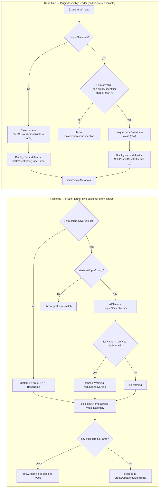

# CustomApi UniqueName Override - Plan

## Goal Capsule

- **Objective:** let `[CustomApi]` classes override the Dataverse unique name Flowline would otherwise derive from the class name, via a new `UniqueName` property that takes the **complete** unique name (publisher prefix included) — so migrating an existing class from another registration tool can adopt an already-live Custom API in place, with the exact live name pasted in verbatim, the way that tool's own linking attribute already worked.
- **Authority hierarchy:** Requirements below are binding; Key Technical Decisions guide implementation choices where the Requirements leave room; implementer judgment fills anything neither covers.
- **Stop conditions:** preserving a live Custom API's identity across a genuine C# class rename is explicitly out of scope (plugin type identity is the class's `FullName`, independent of `UniqueName` — see the correctness constraint below); if closing that gap looks tempting mid-implementation, stop and leave it as a documented limitation instead.
- **Correctness constraint:** `UniqueName` must not be framed, in code comments or docs, as a way to rename a C# class while keeping its Custom API stable — plugin type identity is matched by the class's `FullName` (`PluginPlanner.cs:34`), independent of `UniqueName`; a genuine class rename always produces a new plugin type regardless. Verify this constraint holds (re-read `PluginPlanner.cs:31-56,431-461`) before writing or editing any doc content in U5.
- **Execution profile:** local library change across `Flowline.Attributes`, `Flowline.Core`'s read path (`PluginAssemblyReader`), and `Flowline.Core`'s plan path (`PluginPlanner`, where the live publisher prefix is known) — no deploy or release surface. Also touches the GitHub Wiki, a separate sibling repo (`Flowline.wiki`, see U5). Single implementer session is sufficient, but this now touches core Custom API matching logic (`PluginPlanner.PlanCustomApi`), not just an additive attribute — review the diff to that file with the same care as any change to existing registration behavior.
- **Tail ownership:** implementer runs `dotnet test` across the affected projects and confirms: (1) an unrelated `[CustomApi]` class (no `UniqueName` set) still produces the exact same unique name as before this change, and (2) two classes given colliding unique names fail the push with a clear error rather than silently overwriting one another, before calling the work done.

---

## Product Contract

### Summary

`[Step]` already has a brownfield escape hatch — `[Handles]` — for when a class name can't follow the naming convention. `[CustomApi]` has no equivalent: today the Custom API's unique name is *always* `{publisher prefix}_{class name minus Api/CustomApi/Plugin suffix}`, with no way to override it. This blocks a common migration scenario: an existing `IPlugin` class, kept exactly as-is, is being switched from another tool's registration mechanism (spkl, Daxif) to Flowline's `[CustomApi]` — but that tool's already-live Custom API was never named using Flowline's suffix-stripping convention (spkl, for example, links to an arbitrary pre-existing unique name via `[CrmPluginRegistration("dev1_MyCustomApi")]`, unrelated to the class name). Because `PluginPlanner` matches an existing Custom API to a plugin type first (by the class's `FullName`, `PluginPlanner.cs:34`) and *then* by unique name within that plugin type (`PluginPlanner.cs:441-442,447`), an unchanged class already lands on the right plugin type — but if Flowline's derived unique name doesn't match the live API's, it's treated as a new API instead of updating the existing one.

This plan adds an optional `UniqueName` property to `[CustomApi]` that takes the **complete** Dataverse unique name, publisher prefix included — e.g. `[CustomApi(UniqueName = "dev1_MyCustomApi")]`. This is a deliberate design choice over a base-name-only override: it mirrors exactly what a migrating user is copying from (the source tool's own literal unique-name string, e.g. spkl's `[CrmPluginRegistration("dev1_MyCustomApi")]`), and it lets Flowline structurally validate the value against the solution's real publisher prefix at plan time — turning "don't accidentally include the prefix" from a documentation-only warning into an enforced, fail-fast check.

**Not solved by this feature:** renaming the C# class itself. Plugin type identity is the class's `FullName` (`PluginPlanner.cs:34`); a renamed class is a *different* plugin type regardless of `UniqueName`, so the Custom API under the old type is orphaned and a new one is created under the new type — `UniqueName` cannot prevent this. See the correctness constraint in the Goal Capsule.

### Problem Frame

`PluginAssemblyReader.TryBuildCustomApi` (`src/Flowline.Core/Services/PluginAssemblyReader.cs:183-234`) unconditionally derives a Custom API's base name from the class name via `StripCustomApiSuffix(type.Name)` (`PluginAssemblyReader.cs:222,795-801`), which strips a trailing `CustomApi`, `Api`, or `Plugin` suffix. `PluginPlanner.Plan` matches a plugin type by the class's `FullName` (`PluginPlanner.cs:34`: `snapshot.PluginTypes.TryGetValue(asmPluginType.FullName, ...)`) — an unrenamed class during migration matches its already-registered plugin type, if that tool also used the FQN as `typename` (a common, near-guaranteed convention: Dataverse loads plugin types by FQN via reflection at runtime, so any tool registering plugin types this way has to use it). `PluginPlanner.PlanCustomApi` then looks up an existing Custom API scoped to *that* plugin type by unique name (`PluginPlanner.cs:441-442`), prepending the publisher prefix to the derived base name to build the comparison key (`PluginPlanner.cs:447`: `$"{prefix}_{asmApi.UniqueName}"`). If the source tool's live unique name doesn't happen to match Flowline's suffix-stripping convention, this lookup misses and a duplicate is planned instead of an update — even though the plugin type itself matched correctly.

**Architectural constraint this plan works around:** `PluginAssemblyReader` (where `[CustomApi]` is read) runs *before* `snapshot.PublisherPrefix` is resolved — the live prefix is only known later, in `PluginPlanner` (`FlowlineValidator.cs:137` resolves it; `PluginPlanner.cs:439,447` consumes it). Anything that needs to compare against the real prefix — validating `UniqueName` starts with it, detecting a redundant override, detecting two classes colliding on the same final name — cannot happen at read time and must happen at plan time instead. This shapes U3/U4 below: read time only does prefix-independent parsing and format validation; everything prefix-dependent moves to `PluginPlanner`.

### Requirements

- R1. `[CustomApi]` gains an optional `UniqueName` named property. When set, it is the **complete** Dataverse unique name for the Custom API, publisher prefix included (e.g. `"dev1_MyCustomApi"`) — used verbatim once validated, not run through `StripCustomApiSuffix` and not prefix-prepended by Flowline.
- R2. When `UniqueName` is omitted (`null`), behavior is byte-for-byte unchanged: the unique name derives from the class name via the existing `StripCustomApiSuffix` convention, prefixed automatically by `PluginPlanner` as today.
- R3. `UniqueName` is format-validated at assembly-read time, before any Dataverse call: an empty or whitespace-only value throws; a value that isn't a valid identifier shape (starts with a letter; remaining characters letters, digits, or underscore only) throws; a value with no underscore at all throws (it can never be prefix-qualified — this is the cheapest, earliest place to catch that specific mistake); a value whose segment *after* the first underscore is empty (e.g. `"cr123_"`) throws — a prefix with nothing after it is never valid, and catching it locally beats an opaque Dataverse push rejection. Messages name the class and state the rule, matching the existing validation-message convention (see `ValidateSecondaryLogicalName`, `PluginAssemblyReader.cs:595-601`).
- R4. `UniqueName` is prefix-validated at plan time, after the live publisher prefix is known: it must start with `{publisher prefix}_`. A mismatch throws before any create/update/delete action from this push is executed — this is the structural enforcement of "don't include the wrong prefix" that a documentation-only warning can't guarantee.
- R5. When a validated `UniqueName` equals what Flowline would have derived automatically for that class, Flowline emits a redundancy warning at plan time — a hint, never a failure.
- R6. No two Custom APIs in the same assembly — whether their unique name is derived or explicitly set via `UniqueName` — may resolve to the same final Dataverse unique name. A collision throws at plan time, naming every colliding plugin type, before any Dataverse call. This closes a gap that predates this feature (two classes could already collide on a derived name) and is sharpened by it (a string literal has none of the friction that discourages two classes from accidentally sharing a name the way class-name collisions do).
- R7. `DisplayName`, when not explicitly set, continues to default to a PascalCase-split label. For the derived (no-`UniqueName`) path this is unchanged (`SplitPascalCase(baseName)`). For the `UniqueName` override path, the real prefix isn't known yet at read time, so the default splits on the *first* underscore in `UniqueName` and PascalCase-splits everything after it — a best-effort cosmetic default, not a guarantee of exact prefix-boundary accuracy; an explicit `DisplayName` always overrides it either way.
- R8. Documentation reflects the new override, its full-name-with-prefix requirement, the plan-time prefix and duplicate validation, and explicitly warns that a genuine C# class rename is not solved by this feature: attribute XML docs, `src/Flowline.Attributes/README.md`, the GitHub Wiki's `04-Push-Plugins-and-Custom-APIs.md`, and a short mention in the spkl and Daxif migration guides (both already have a Custom API class-naming migration section to extend — see U5 for why a new illustrative example is needed rather than reusing the existing one, since neither example currently shows a naming mismatch).

### Scope Boundaries

#### Deferred to Follow-Up Work

- An analogous "pin the identity" override for `[Step]`/`[Handles]` — already solved there by `[Handles]` itself; not this plan's concern.
- Silently adopting a lone existing Custom API already linked to a matched plugin type, instead of requiring an explicit `UniqueName`. Rejected: silent adoption can misread a genuine rename-of-intent (the developer meant to replace the old API, not inherit it) as an update; explicit `UniqueName` is predictable and auditable in source, silent adoption is not.
- Any mechanism to preserve a live Custom API's identity across a genuine C# class rename (a `FullName` change). Plugin type matching is keyed by `FullName` (`PluginPlanner.cs:34`) and is out of this feature's reach entirely — solving it would mean changing plugin type matching itself, a materially different and riskier change than a naming override.
- Cross-assembly duplicate detection. R6's duplicate check is scoped to one assembly (one `flowline push`); two different plugin assemblies targeting the same solution with colliding unique names are not locally detectable and would surface as a Dataverse-level rejection at push time instead.

---

## Planning Contract

### Key Technical Decisions

- **KTD1 — `UniqueName` holds the complete name, publisher prefix included; not a base-name-only override.** This is the load-bearing design choice of the whole feature. A base-name-only override (the original design) leaves "don't include the prefix" as an unenforceable documentation warning, because the reader can't check a value it doesn't have. Requiring the full name turns that into a validated fact (R4) and matches exactly what a migrating user is copying from — spkl's `[CrmPluginRegistration("dev1_MyCustomApi")]` already takes the literal full unique name, so migration becomes a direct copy-paste rather than a mental "strip the prefix I already know" step.

- **KTD2 — Two-phase validation split along the prefix-availability boundary.** Format validation (R3: non-empty, identifier shape, contains an underscore) runs at read time in `PluginAssemblyReader`, because none of it needs the live prefix. Prefix-match validation (R4), redundancy detection (R5), and duplicate detection (R6) all run at plan time in `PluginPlanner`, because all three need to compare against the real `snapshot.PublisherPrefix` (`PluginPlanner.cs:439`) or against other classes' resolved names — neither is available inside `PluginAssemblyReader`. This is not an arbitrary split; it is forced by the existing architecture (see Problem Frame's "architectural constraint" paragraph), and it means `PluginPlanner.PlanCustomApi` gains real validation logic it doesn't have today, not just a rename.

- **KTD3 — `CustomApiMetadata` model change: rename `UniqueName` → `BaseName`, add `UniqueNameOverride`.** The model's existing first field (`CustomApiMetadata.UniqueName`, `src/Flowline.Core/Models/CustomApiMetadata.cs:4`) currently holds the derived, prefix-less base name — renaming it to `BaseName` removes the collision between "the model field" and "the new attribute property," both of which would otherwise be called `UniqueName` with different shapes (one prefix-less, one prefix-included). Add a new nullable `string? UniqueNameOverride` field carrying the raw attribute value (`null` when omitted). Renaming a positional record parameter does not break any existing caller — every current `CustomApiMetadata(...)` construction in the codebase uses positional arguments, not named ones (confirmed: `tests/Flowline.Core.Tests/PluginPlannerTests.cs:1041,1089,1157`, `tests/Flowline.Core.Tests/PluginServiceTests.cs:804`, `PluginAssemblyReader.cs:228-233`). `UniqueNameOverride` is added as a **trailing parameter defaulted to `null`** — `null` *is* a valid C# parameter default (unlike a `List<string>` default, which isn't — see the note this plan carried from an earlier design pass), so none of the four existing hand-built test call sites need editing at all.

- **KTD4 — Duplicate detection runs once, up front, in `PluginPlanner.Plan`, over fully-resolved final names.** Rather than detecting collisions on the *derived* base name alone (which would miss a derived name colliding with an explicit `UniqueName`'s base part, or two explicit overrides colliding), the check resolves every Custom API in the assembly to its final `{prefix}_{...}` string first — for the derived path via `$"{prefix}_{asmApi.BaseName}"` (unchanged formula), for the override path via the already-prefix-validated `UniqueNameOverride` used verbatim — then compares those resolved strings across the *entire* assembly, not per plugin type. This has to run before the existing per-plugin-type `PlanCustomApi` loop (`PluginPlanner.cs:32-73`) does its create/update/delete diffing, so a collision fails the push before any other planning work runs. A new private helper resolves and validates every Custom API's final name once (throwing on prefix mismatch or duplicate), and `PlanCustomApi` consumes the already-resolved name instead of recomputing prefix logic inline.

- **KTD5 — `DisplayName` default heuristic for the override path is a first-underscore split, not a false claim of prefix accuracy.** `SplitPascalCase` (`PluginAssemblyReader.cs:842-853`) only inserts spaces at PascalCase boundaries — it does not touch underscores, so calling it on a raw `"dev1_MyCustomApi"` would leave the underscore in the output (`"dev1_ my Custom Api"`). Splitting on the *first* underscore before calling `SplitPascalCase` produces a clean default (`"My Custom Api"`) without needing to know the true prefix boundary — a reasonable heuristic since publisher prefixes conventionally contain no underscores themselves. If the heuristic guesses wrong (an unconventional prefix, or a base name that itself starts with an underscore-adjacent word), the result is a mildly-off cosmetic default the user can override explicitly with `DisplayName` — never a functional defect, since `DisplayName` has no bearing on Custom API identity or matching.

- **KTD6 — First-ever `[CustomApi]` mock coverage through the real `Analyze()` pipeline.** `PluginAssemblyReaderTests.cs` currently has no mock class carrying `[CustomApi]` at all — every existing CustomApi-naming test (`PluginPlannerTests.cs`, `PluginServiceTests.cs`) constructs `CustomApiMetadata` by hand, bypassing `TryBuildCustomApi`/`StripCustomApiSuffix` entirely. U4 below adds the first such mocks, which both proves the new `UniqueName` override and closes this pre-existing coverage gap for the unchanged (no-override) path as a natural side effect.

### High-Level Technical Design

---

## Implementation Units

### U1. `[CustomApi]` — add the `UniqueName` override property

**Goal:** expose the override as an attribute property, documented clearly enough that a migrating user understands it takes the complete unique name and why.

**Requirements:** R1, R8

**Dependencies:** none

**Files:**
- `src/Flowline.Attributes/CustomApiAttribute.cs`

**Approach:** add `public string UniqueName { get; set; }` as a named property — plain `string`, not `string?`: `src/Flowline.Attributes/Flowline.Attributes.csproj:6-7` pins `LangVersion 7.3` with `Nullable disable` (source-only package; consumers may be C# 7.3 / net462 Dataverse plugin projects), where `?` on a reference type is a compile error (`CS8370`), and every existing optional property in this file (`Table`, `TableCollection`, `DisplayName`, `Description`, `ExecutePrivilege`) is already plain `string`. Named property, not a constructor argument, matching the `DisplayName`/`Description` style. Update the class-level `<remarks>` intro (currently states flatly that the class name always becomes the unique name, `CustomApiAttribute.cs:14-17`) to mention the override exists. Add a `
` on `UniqueName` explaining: it is the **complete** Dataverse unique name including the publisher prefix (e.g. `"dev1_MyCustomApi"`), not just a base name; Flowline validates it starts with the solution's actual publisher prefix and throws if it doesn't; intended for migrating an existing (unrenamed) class from another registration tool whose live Custom API's unique name doesn't follow Flowline's suffix-stripping convention — not for preserving identity across a class rename (plugin type identity follows the class's fully-qualified name regardless of `UniqueName`). Include one `<code>` example showing the migration use case with a concrete prefix.

**Patterns to follow:** the `DisplayName`/`Description` property doc style already in this file; the "hard rule" callout tone used for `[Step].Config`'s secrets warning (wiki `04-Push-Plugins-and-Custom-APIs.md:87`, README equivalent) for the "must include the correct prefix" warning.

**Test scenarios:** Test expectation: none -- the attribute is a plain data holder with no logic; its behavior is exercised where it's read and validated, in U3 and U4.

**Verification:** `dotnet build` compiles the `Flowline.Attributes` project cleanly; XML doc comments have no malformed-tag warnings.

---

### U2. `CustomApiMetadata` — rename `UniqueName` to `BaseName`, add `UniqueNameOverride`

**Goal:** give the model the two distinct pieces of naming information `PluginAssemblyReader` and `PluginPlanner` each need, without a name collision against the new attribute property.

**Requirements:** supports R1, R2

**Dependencies:** none

**Files:**
- `src/Flowline.Core/Models/CustomApiMetadata.cs`

**Approach:** rename the record's first positional parameter from `UniqueName` to `BaseName` (KTD3) — a pure rename, no behavior change; every existing construction of this record uses positional arguments, so this does not require touching any existing call site. Add `string? UniqueNameOverride = null` as a new trailing parameter, defaulted to `null` (a valid default for a nullable reference type, unlike a `List<string>` default) — this also needs no edits to existing call sites. Leave every other field and the existing parameter order untouched.

**Patterns to follow:** none needed — this is a minimal, additive model change.

**Test scenarios:** Test expectation: none -- pure model rename/addition with no branching logic; covered indirectly by U3's and U4's assertions.

**Verification:** `dotnet build`; all existing `CustomApiMetadata(...)` call sites across the codebase (`PluginPlannerTests.cs:1041,1089,1157`, `PluginServiceTests.cs:804`, `PluginAssemblyReader.cs:228-233`) compile with zero edits.

---

### U3. `PluginAssemblyReader` — read and format-validate `UniqueName`; DisplayName default heuristic

**Goal:** the read-time half of the feature — everything that doesn't need the live publisher prefix.

**Requirements:** R2, R3, R7

**Dependencies:** U1, U2

**Files:**
- `src/Flowline.Core/Services/PluginAssemblyReader.cs`
- `tests/Flowline.Core.Tests/PluginAssemblyReaderTests.cs`

**Approach:** In `TryBuildCustomApi` (`PluginAssemblyReader.cs:183-234`), read a `"UniqueName"` named argument into a local `uniqueNameOverride` alongside the existing `foreach (var arg in customApiAttr.NamedArguments)` switch (`PluginAssemblyReader.cs:202-214`). Add a new validator, `ValidateCustomApiUniqueNameFormat(string className, string? uniqueName)`, alongside the file's existing `Validate*` helpers (`PluginAssemblyReader.cs:582-698`): no-op when `uniqueName` is `null`; throw `InvalidOperationException` when it's empty or whitespace-only (message phrasing mirrors `ValidateSecondaryLogicalName`, `PluginAssemblyReader.cs:597-600`); throw when it doesn't match a valid identifier shape (first character a letter, remaining characters letters/digits/underscore); throw when it contains no underscore at all, with a message explaining `UniqueName` must be the complete name including the publisher prefix (e.g. `"dev1_MyCustomApi"`, not just `"MyCustomApi"`); throw when the segment after the first underscore is empty (e.g. `"cr123_"` — a prefix with nothing after it). Call this validator immediately after reading `uniqueNameOverride`, before it's used anywhere else. This is format validation only — it does not (and cannot, at this point in the pipeline) check whether the segment before the first underscore is the *correct* publisher prefix; that's U4's job.

Rename `var baseName = StripCustomApiSuffix(type.Name);` (`PluginAssemblyReader.cs:222`) to use the model's renamed `BaseName` field — this line's logic itself is unchanged (KTD3 is a model-field rename, not a behavior change); it continues to always compute the derived base name regardless of whether `UniqueName` was set, since it's still needed for KTD4's duplicate-detection formula on the non-override path.

For `DisplayName`'s default (`displayName ??= SplitPascalCase(baseName);`, `PluginAssemblyReader.cs:223`), branch on `uniqueNameOverride`: when `null`, keep this line exactly as today; when set, instead split `uniqueNameOverride` on its first `_` and call `SplitPascalCase` on everything after it (KTD5) — e.g. `SplitPascalCase("MyCustomApi")` from `"dev1_MyCustomApi"`. An explicitly-set `DisplayName` is respected unchanged in both branches (the `??=` already handles this).

Pass `uniqueNameOverride` into the `new CustomApiMetadata(...)` call (`PluginAssemblyReader.cs:228-233`) as the new `UniqueNameOverride` argument.

Add the first `[CustomApi]`-attributed mock plugin classes to `PluginAssemblyReaderTests.cs` (KTD6) to exercise both the pre-existing derivation and the new override's read-time behavior through the real `Analyze()` pipeline, following the file's existing `Mock*Plugin` naming and placement convention (`PluginAssemblyReaderTests.cs:823` onward).

**Technical design:** see the "Read time" subgraph in the High-Level Technical Design flowchart above.

**Patterns to follow:** `ValidateSecondaryLogicalName`/`ValidateCustomApiAttributesOnStep` for validator shape and message tone (`PluginAssemblyReader.cs:595-610`); the existing `GetPlugin(Analyze(), nameof(...))` mock-class test pattern (`PluginAssemblyReaderTests.cs:823` onward).

**Test scenarios:**
- Happy path: `[CustomApi]` with no `UniqueName` on a class such as `MockGetAccountRiskApi` — `CustomApis.Single().BaseName` equals the suffix-stripped class name (`"MockGetAccountRisk"`), `UniqueNameOverride` is `null`. Covers R2, and doubles as the first-ever regression guard for `StripCustomApiSuffix` through the real pipeline (KTD6).
- Happy path: `[CustomApi(UniqueName = "dev1_LegacyOrderApproval")]` — `UniqueNameOverride` equals `"dev1_LegacyOrderApproval"` verbatim. Covers R1's read-time half.
- Happy path: `DisplayName` omitted alongside an explicit `UniqueName = "dev1_MyCustomApi"` — `DisplayName` defaults to `"My Custom Api"` (split on the segment after the first underscore), not a naive split of the whole string. Covers R7.
- Happy path: explicit `DisplayName` alongside `UniqueName` — the explicit value wins, the heuristic never runs.
- Error path: `[CustomApi(UniqueName = "")]` — `Analyze()` throws `InvalidOperationException` naming the class and stating `UniqueName` cannot be empty.
- Error path: `[CustomApi(UniqueName = "   ")]` — same as above, whitespace-only value.
- Error path: `[CustomApi(UniqueName = "123Bad_Name")]` — throws; message explains the identifier-format rule (leading digit invalid).
- Error path: `[CustomApi(UniqueName = "Bad Name_Here")]` — throws for the embedded space.
- Error path: `[CustomApi(UniqueName = "NoUnderscoreAtAll")]` — throws stating `UniqueName` must include the publisher prefix (no underscore present).
- Error path: `[CustomApi(UniqueName = "dev1_")]` — throws stating the segment after the prefix is empty.
- Integration: a class with `[CustomApi(UniqueName = "...")]` plus `[Input]`/`[Output]` — request/response parameter composite labels still key off `BaseName` (the class-derived value, `PluginAssemblyReader.cs:226,237`), unaffected by the override — proving `ReadClassLevelParameters` doesn't need to change.

**Verification:** `dotnet test tests/Flowline.Core.Tests/Flowline.Core.Tests.csproj` — all scenarios above pass; existing `PluginAssemblyReaderTests` (Step/Handles scenarios) stay green.

---

### U4. `PluginPlanner` — prefix validation, redundancy warning, duplicate detection

**Goal:** the plan-time half of the feature — everything that needs the live publisher prefix, plus the assembly-wide safety net a string-literal override needs that a compiler-enforced class name didn't.

**Requirements:** R4, R5, R6

**Dependencies:** U1, U2, U3

**Files:**
- `src/Flowline.Core/Services/PluginPlanner.cs`
- `tests/Flowline.Core.Tests/PluginPlannerTests.cs`

**Approach:** Add a new private method (e.g. `ResolveCustomApiNames`) that runs once near the top of `Plan` (`PluginPlanner.cs:28-30`, before the main `foreach (var asmPluginType in metadata.Plugins)` loop), taking the already-resolved `snapshot.PublisherPrefix` and every `CustomApiMetadata` across `metadata.Plugins` (flattened). For each: if `UniqueNameOverride` is `null`, the resolved final name is `$"{prefix}_{asmApi.BaseName}"` (the existing formula, unchanged). If `UniqueNameOverride` is set, check it starts with `$"{prefix}_"` (`StringComparison.Ordinal`); throw `InvalidOperationException` naming the class, the given value, and the expected prefix if it doesn't (R4). When it does match, the resolved final name is `UniqueNameOverride` used verbatim; if that resolved name equals what the derived formula would have produced for the same class, call `console.Warning(...)` with wording mirrored from the existing `[Handles]` redundancy pattern (`PluginAssemblyReader.cs:364-369`), adapted for `[CustomApi] UniqueName` (R5). After every Custom API in the assembly has a resolved final name, group by that name and throw `InvalidOperationException` for any group with more than one entry, naming every colliding plugin type's `FullName` (R6) — this is the assembly-wide check KTD4 describes, and it must complete (throwing on any violation) before the existing per-plugin-type loop begins its create/update/delete diffing.

Thread the resolved final name from this new method into `PlanCustomApi` (`PluginPlanner.cs:431-544`) so it stops recomputing `fullApiName = $"{prefix}_{asmApi.UniqueName}"` inline (`PluginPlanner.cs:447`) — replace that line with a lookup into the pre-resolved mapping instead (built once, not per-plugin-type). Key that mapping by `PluginTypeFullName` (a string), not by the `CustomApiMetadata` record itself — records have value equality, so keying by the object is a latent footgun even though today's shape (at most one `CustomApiMetadata` per plugin type) can't yet produce a collision through that door.

**This same fix must also reach the obsolete-API comparison a few lines below** (`PluginPlanner.cs:530-531`: `foreach (var obsoleteApi in dvApis.Where(a => asmCustomApis.All(c => $"{prefix}_{c.UniqueName}" != a.Key)))`) — this loop decides which live Dataverse Custom APIs get **deleted** as no-longer-present. It uses the same derived-name formula as line 447, so a mechanical `c.UniqueName` → `c.BaseName` rename here would be *wrong*, not just incomplete: for the core migration scenario (an override adopting an existing live record), this comparison would compute the derived name (which the live record's `uniquename` does *not* match — that's the whole premise), conclude the live record has no matching local declaration, and delete the exact record the feature exists to adopt. This line must compare against the same resolved-name mapping used at line 447, not against a re-derived formula. Flag this explicitly during implementation — it is the one place in this unit where the obvious mechanical edit produces silent data loss instead of a compile error. Every other reference inside `PlanCustomApi` and its callees (`PlanRequestParameters`, `PlanResponseProperties`) that reads `asmApi.UniqueName` should read `asmApi.BaseName` where the existing behavior used the short, prefix-less label (matching today's output exactly), and continue to use the resolved full name (already the pattern at most call sites, e.g. `PluginPlanner.cs:471,474-479`) wherever the actual Dataverse-facing value is needed — this is a mechanical rename following KTD3's model change, not a behavior change for the non-override path.

**Technical design:** see the "Plan time" subgraph in the High-Level Technical Design flowchart above.

**Patterns to follow:** the existing `immutableChanged` → `console.Warning(...)` block (`PluginPlanner.cs:469-471`) for the redundancy-warning shape; the existing obsolete-API comparison fix note at `PluginPlanner.cs:530` for how this method already reasons about prefix-qualified names.

**Test scenarios:**
- Happy path: no `UniqueNameOverride` anywhere in the assembly — resolved names and all planning behavior are identical to before this change (regression guard using existing `PluginPlannerTests` fixtures with `[]`/`null` appended per U2).
- Happy path: one class with a valid `UniqueNameOverride` matching the live prefix, no existing Dataverse record — planned as a create using the override's exact value as `uniquename`.
- Happy path: one class with a valid `UniqueNameOverride` matching an *existing* Dataverse Custom API's `uniquename` on the correctly-matched plugin type — planned as an update, not a duplicate create, **and no delete action is planned for the adopted record**. This is the core migration scenario the feature exists for, and the no-delete assertion is what catches a mis-ported obsolete-comparison (see the `:530-531` note above) — without it, a plan carrying both a spurious delete and the correct update would pass a weaker "update happened" check.
- Edge case: `UniqueNameOverride` resolves to the exact same value the derived formula would have produced — `console.Warning` fires exactly once, planning proceeds as a normal create/update (not a failure).
- Error path: `UniqueNameOverride` starts with a different prefix than the live solution's publisher prefix — `Plan` throws `InvalidOperationException` before any create/update/delete action is added to the returned plan, naming the class, the given value, and the expected prefix.
- Error path: two classes in the same assembly resolve to the same final name — one via `UniqueNameOverride`, one via the derived formula (or two via either combination) — `Plan` throws `InvalidOperationException` naming both classes, before any create/update/delete action is added to the returned plan.
- Error path: two classes both use the *same literal* `UniqueNameOverride` string — same as above, the duplicate check doesn't distinguish by source.

**Verification:** `dotnet test tests/Flowline.Core.Tests/Flowline.Core.Tests.csproj` — all scenarios above pass; existing `PluginPlannerTests` CustomApi scenarios (`Plan_CustomApiWithMatchingPrefix_NotTreatedAsObsolete`, `Plan_NewCustomApi_CreatesUpsertWithSolutionName`, etc.) stay green with only the mechanical `BaseName`/`UniqueNameOverride` argument updates from U2.

---

### U5. Documentation and changelog

**Goal:** the override is discoverable, its full-name-with-prefix requirement is impossible to miss, and the "this doesn't solve class renames" boundary is stated plainly.

**Requirements:** R8

**Dependencies:** U1, U4

**Target repo note:** the GitHub Wiki lives in a separate sibling repo, `Flowline.wiki` (per this repo's `CLAUDE.md`) — the three wiki paths below are relative to that repo, not this one.

**Files:**
- `src/Flowline.Attributes/README.md` (this repo)
- `CHANGELOG.md` (this repo)
- `04-Push-Plugins-and-Custom-APIs.md` (`Flowline.wiki`)
- `12-Migration-from-spkl.md` (`Flowline.wiki`)
- `13-Migration-from-Daxif.md` (`Flowline.wiki`)

**Approach:** Update `src/Flowline.Attributes/README.md`'s "Custom APIs > Class naming" section (currently lines 387-397) — keep the existing convention-derived example table, and add a short paragraph plus one code example showing `[CustomApi(UniqueName = "dev1_MyCustomApi")]` — the **complete** name, prefix included — with a bolded warning that Flowline validates the prefix and throws on mismatch (mirroring the `Config` secrets-callout style already used elsewhere in the same doc). State plainly that `UniqueName` pins the resolved unique name only; it does not preserve a Custom API's identity across a C# class rename (plugin type identity follows the class's fully-qualified name, unaffected by `UniqueName`). Add `UniqueName` as a row in the "Optional named properties" table (currently lines 429-438). Mention that two Custom APIs resolving to the same final name — whether derived or explicit — fail the push. Mirror the same additions in the wiki's `04-Push-Plugins-and-Custom-APIs.md` "Custom APIs > Class naming" section and its `[CustomApi]` properties table (currently around lines 262-304) — this is the canonical user-facing reference per `CLAUDE.md`'s wiki-update rule.

Add one short paragraph each to `12-Migration-from-spkl.md`'s and `13-Migration-from-Daxif.md`'s existing "Custom APIs" migration sections (spkl: lines 199-211; Daxif: lines 187-209): the class stays unchanged during migration, and `UniqueName` takes the exact same literal string the source tool's own linking attribute already used, so migration is a direct copy of that value with `[CustomApi(UniqueName = "...")]`. Note that neither section's existing example actually shows a mismatch worth illustrating with a copy — spkl's `MyCustomApiPlugin` linked to `dev1_MyCustomApi` happens to already strip to the same base name, and Daxif's example has no unique name at all — so add a small, deliberately mismatched illustrative example rather than annotating the existing one: a class such as `LegacyOrderApprovalPlugin` whose Flowline-derived name would be `dev1_LegacyOrderApproval`, but the tool's already-live API is `dev1_ApproveOrder` — set `[CustomApi(UniqueName = "dev1_ApproveOrder")]` to adopt it in place, copied directly from the source tool's own attribute.

Add one line under `CHANGELOG.md`'s `[Unreleased] > Added`, matching the terse, value-focused style of the existing `[0.10.0]` entries — mention both the override itself and that colliding unique names now fail the push instead of silently colliding.

**Patterns to follow:** `CHANGELOG.md`'s `[0.10.0]` `### Added` entries for tone and format; the existing `[Handles]` "brownfield escape hatch" framing (README and wiki) as the template for introducing this override.

**Test scenarios:** Test expectation: none -- documentation only, no runtime behavior to test.

**Verification:** proofread the five updated files for consistency with the shipped U1-U4 behavior (property name, full-name requirement, validation rules, warning/error wording); markdown tables render correctly.

---

## Verification Contract

| Command | Applies to | Proves |
|---|---|---|
| `dotnet build Flowline.slnx` | U1, U2, U3, U4 | No compile regressions across `Flowline.Attributes` and `Flowline.Core` |
| `dotnet test tests/Flowline.Core.Tests/Flowline.Core.Tests.csproj` | U2, U3, U4 | All new and existing `CustomApi`/`Step` scenarios pass, including the U3 and U4 test lists above |

No `release:validate` or deploy-time gate applies — this is a library-level attribute, reader, and planner change with no Dataverse schema or CI/CD surface.

## Definition of Done

- U1-U5 implemented; all listed test scenarios pass.
- `[CustomApi]` with no `UniqueName` set produces the exact same resolved unique name as before this change (regression-guarded by U3's and U4's baseline tests).
- A `UniqueName` whose prefix doesn't match the live solution's publisher prefix fails the push with a clear error, before any create/update/delete action executes.
- Two Custom APIs in the same assembly resolving to the same final unique name — regardless of whether either came from `UniqueName` or the derived convention — fail the push with a clear error naming both, before any create/update/delete action executes.
- A redundant `UniqueName` (matching what would have been derived anyway) warns but never fails the read or the push.
- An invalid `UniqueName` (empty, whitespace-only, malformed identifier, or missing an underscore) fails fast at assembly-read time with an actionable message, before any Dataverse call.
- `src/Flowline.Attributes/README.md`, `CHANGELOG.md`, and the three `Flowline.wiki` pages (`04-Push-Plugins-and-Custom-APIs.md`, `12-Migration-from-spkl.md`, `13-Migration-from-Daxif.md`) are updated.
- Every updated doc frames `UniqueName` as the complete, prefix-included unique name for a same-class migration, and none of them imply it preserves identity across a C# class rename (see the Goal Capsule's correctness constraint).
