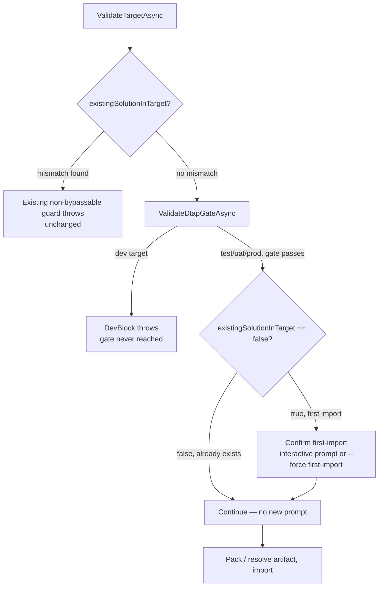

# Deploy First-Import Confirmation Gate - Plan

## Goal Capsule

- **Objective:** `deploy` drops `--managed` — it silently mutated `.flowline` instead of acting as a per-run override — and gains a confirmation gate for a solution's first-ever import to a target, required for both managed and unmanaged, since Flowline itself can't switch a target's mode afterward.
- **Authority hierarchy:** This plan's Requirements and Key Technical Decisions govern the approach.
- **Stop conditions:** None identified — this is additive/subtractive CLI-surface work with no external unknowns.
- **Execution profile:** Local implementation and testing.
- **Tail ownership:** Implementer commits locally. No push, no PR unless separately requested.

---

## Product Contract

### Summary

Remove `--managed` from `deploy` — managed/unmanaged mode is decided once, at `clone`/`sync` time, and `deploy` should only ever read it from `.flowline`. Add a confirmation gate that fires the first time a solution is imported to a target environment that doesn't have it yet, worded per mode, bypassable only via a new named `--force` specifier.

### Problem Frame

`deploy --managed` (`src/Flowline/Commands/DeployCommand.cs:68`) resolves the solution through `GetOrUpdateSolution`, which persists a differing value to `.flowline` after a confirm prompt (`src/Flowline/Config/ProjectConfig.cs:220-230`) — the same write path `sync --managed` and `clone --managed` use. On a non-interactive run with a differing value, this throws unless `--force config` is passed, so a CI pipeline can't apply a one-off managed/unmanaged choice without either pre-matching `.flowline` or authorizing a config mutation it may not intend. `IncludeManaged` is also a single project-wide setting used for every target (`DeployCommand.cs` reads `sln.IncludeManaged` for prod/uat/test alike), so the flag was never really a per-run override to begin with.

Separately, `ValidateTargetAsync` (`DeployCommand.cs:237-265`) only blocks a managed/unmanaged *mismatch* against what's already installed in a target. When the target has no solution installed yet (`existingSolutionInTarget == false`), neither direction gets any confirmation — the first-ever import proceeds silently, even though Dataverse itself won't let a solution's managed/unmanaged mode be converted later without an uninstall (`docs/solutions/architecture-patterns/managed-unmanaged-type-guard-in-deploy-command-2026-06-07.md`). Both directions carry the same operational risk — Flowline can't fix a wrong first choice — even though the underlying blast radius differs (undoing a wrong managed import touches a live environment's dependents; undoing a wrong unmanaged import is a plain delete).

### Requirements

**Remove `--managed` from `deploy`**
- R1. `deploy`'s `--managed` CLI option is removed. `IncludeManaged` for a deploy is always read from `.flowline`, never written by `deploy` itself.
- R2. The solution-resolution call in `ExecuteFlowlineAsync` passes no managed override (`includeManaged: null`), matching how `GenerateCommand.cs:127` already calls `GetOrUpdateSolution` config-read-only.
- R3. `deploy --help` no longer lists `--managed`. Managed/unmanaged mode is configured exclusively via `clone --managed`/`sync --managed`.

**First-import confirmation gate**
- R4. Before importing, when the solution does not yet exist in the target (`existingSolutionInTarget == false`), `deploy` requires explicit confirmation before proceeding.
- R5. The confirmation is worded per mode: managed names that the target's mode can't be converted back without an uninstall; unmanaged names that converting this target to managed later needs the solution removed manually first.
- R6. The confirmation is interactive by default and skippable non-interactively via a new named `--force` specifier — not bare `--force`, not the existing `config` specifier.
- R7. The existing managed/unmanaged type-*mismatch* guard in `ValidateTargetAsync` stays non-bypassable and unchanged — the new gate only fires on the `existingSolutionInTarget == false` branch and never overlaps with the mismatch guard's two throw branches.
- R8. The gate does not fire for a `dev` target, since `deploy dev` is already rejected by the DTAP gate's `DevBlock` outcome before any import-worthy work happens.
- R9. `config` is removed from `deploy`'s `ValidSpecifiers` — it only ever gated the `--managed` mismatch-confirm this plan removes (R1), and `deploy` has no other config-write hazard. `deploy --force config` becomes an unrecognized value rather than a silently-inert one.

### Scope Boundaries

- `clone`'s and `sync`'s own `--managed`/`--include-managed` flags are untouched — they remain the only way to set or change `IncludeManaged`.
- The existing type-mismatch guard's non-bypassable design is untouched (R7) — per the established doctrine in `docs/solutions/architecture-patterns/managed-unmanaged-type-guard-in-deploy-command-2026-06-07.md` and `docs/solutions/best-practices/provision-safety-guard-unmanaged-solutions-2026-05-18.md`, a genuine irreversible mismatch never gets a bypass flag. The new gate is a different risk class — confirming an as-yet-undetermined first choice, not blocking an already-irreversible one — which is why it *is* bypassable, matching the existing `config`/`drift` specifiers' shape instead.
- No change to the DTAP gate, orphan cleanup, or solution-checker gate.

---

## Planning Contract

### Key Technical Decisions

- **KTD1 — `GetOrUpdateSolution` call becomes read-only for `deploy`.** `DeployCommand.cs:68` changes from `Config!.GetOrUpdateSolution(settings.Solution, settings.Managed.IsSet ? settings.Managed.Value : (bool?)null, settings)` to omitting the managed argument entirely, mirroring `GenerateCommand.cs:127`'s existing config-read-only call. `deploy` becomes a pure reader of `IncludeManaged`, never a writer.
- **KTD2 — Generalize `ConsoleHelper.Confirm` instead of duplicating its interactive/non-interactive branching.** `Confirm` (`ConsoleHelper.cs:46-59`) currently hardcodes the `"config"` specifier in its non-interactive force-check and error message. Add an explicit `string specifier` parameter, update the 5 existing call sites (`ProjectConfig.cs:48,83,118,153,224`) to pass `"config"` explicitly, and have the new gate pass its own specifier. This keeps one confirmation mechanism instead of two, and matches the force-specifier design's own principle of naming the hazard explicitly rather than borrowing an unrelated specifier's plumbing implicitly.
- **KTD3 — New specifier name: `first-import`.** A bare noun, matching the force-specifier vocabulary's own rule that only one action is ever taken on this hazard (confirm and proceed) — the same shape as `dirty`/`drift`/`config`, not the verb-first shape used where multiple distinct actions exist (`delete-orphans`, `recreate-assembly`).
- **KTD4 — Gate placement: after `ValidateDtapGateAsync`, not immediately after `ValidateTargetAsync`.** `ValidateTargetAsync` (`DeployCommand.cs:78`) resolves `existingSolutionInTarget` before the DTAP gate (`DeployCommand.cs:109`) has a chance to throw its `DevBlock` outcome for a `dev` target. Placing the new confirmation right after `ValidateTargetAsync` would prompt for a first-import confirmation on a `dev` deploy that's about to be rejected moments later anyway (R8). Placing it after `ValidateDtapGateAsync` returns means `dev` never reaches it, and test/uat/prod all pass through the DTAP existence/version checks first.
- **KTD5 — Reuses `existingSolutionInTarget`, no new Dataverse call.** `ValidateTargetAsync` already computes this boolean (`DeployCommand.cs:78,254`) for the mismatch guard; the new gate reads the same value rather than re-querying.
- **KTD6 — Message-building extracted into a pure static method.** Mirrors the established pattern in `docs/solutions/best-practices/provision-safety-guard-unmanaged-solutions-2026-05-18.md` ("keeping the check logic in a pure `internal static` method... means it can be unit tested without a live PAC CLI or Dataverse connection"). A method taking `(string solutionName, string targetDisplayName, bool includeManaged)` and returning the mode-specific prompt text lets the wording be unit-tested directly. The `Confirm` call passes `defaultValue: false`, matching the 5 existing `ConsoleHelper.Confirm` call sites in `ProjectConfig.cs` — bare Enter never approves a first import.
- **KTD7 — `config` removed from `deploy`'s `ValidSpecifiers` (R9).** Before this plan, `config` only ever gated the `--managed` mismatch-confirm inside `GetOrUpdateSolution` (`ProjectConfig.cs:220-230`) — the one write path R1-R3 remove from `deploy` entirely. Leaving `config` listed as a valid-but-permanently-inert value would mean `deploy --force config` parses successfully and does nothing, silently misleading a caller who expects it to approve something. `ValidSpecifiers` becomes `["drift", "first-import", "all"]`.

### High-Level Technical Design

---

## Implementation Units

### U1. Remove `--managed` from `deploy`

**Goal:** `deploy` no longer accepts `--managed`; it only ever reads `IncludeManaged` from `.flowline`.

**Requirements:** R1, R2, R3

**Dependencies:** None — foundation unit.

**Files:**
- `src/Flowline/Commands/DeployCommand.cs` — remove `Managed` from `Settings` (the `FlagValue<bool>` property and its `[CommandOption("--managed")]`); change the `GetOrUpdateSolution` call (line 68) to omit the managed argument.

**Approach:** Delete the property and its attribute; the compiler surfaces any remaining reference. Update the `GetOrUpdateSolution` call to the same shape `GenerateCommand.cs:127` already uses.

**Patterns to follow:** `GenerateCommand.cs:127`'s config-read-only `GetOrUpdateSolution` call.

**Test scenarios:**
- Happy path: `deploy prod` with `.flowline` already configured (via a prior `clone`/`sync`) resolves and deploys using that config's `IncludeManaged`, unchanged from today.
- Test expectation: none beyond a build check for U1 itself — removing a CLI option surfaces no new branch to unit test; regression coverage lives in U3's gate tests, which exercise the resolved `sln.IncludeManaged` value downstream.

**Verification:** `dotnet build` succeeds with no remaining reference to `settings.Managed` in `DeployCommand.cs`; `flowline deploy --help` no longer lists `--managed`.

---

### U2. Generalize `ConsoleHelper.Confirm` to an explicit specifier

**Goal:** Let `Confirm` gate on any named hazard, not just `config`, so the new first-import gate can reuse its interactive/non-interactive branching instead of duplicating it.

**Requirements:** Supports R4, R6 (infrastructure).

**Dependencies:** None — can run in parallel with U1.

**Files:**
- `src/Flowline/Utils/ConsoleHelper.cs` — `Confirm(string prompt, bool defaultValue, FlowlineSettings? settings)` (lines 46-59) gains a required `string specifier` parameter; the non-interactive branch's `settings?.HasForce("config")` and thrown message become `settings?.HasForce(specifier)` and a message naming `specifier`.
- `src/Flowline/Config/ProjectConfig.cs` — 5 call sites (lines 48, 83, 118, 153, 224) updated to pass `"config"` explicitly.
- `tests/Flowline.Tests/ConsoleHelperTests.cs` — extend existing `Confirm` tests to cover a non-`"config"` specifier.

**Approach:** Pure signature widening — no change to the interactive branch (`AnsiConsole.Confirm`), only the non-interactive force-check and error text become specifier-parameterized.

**Patterns to follow:** The existing `Confirm` method's own structure; `FlowlineSettings.HasForce` (already specifier-generic).

**Test scenarios:**
- Happy path: non-interactive + `Force` contains `"config"` + `specifier: "config"` → returns `true` (regression: existing 5 call sites unaffected).
- Happy path: non-interactive + `Force` contains `"first-import"` + `specifier: "first-import"` → returns `true`.
- Edge case: non-interactive + `Force` contains `"config"` but `specifier: "first-import"` → throws `FlowlineException` naming `first-import`, not `config` (specifiers are independent).
- Error path: non-interactive + `Force` empty + any `specifier` → throws `FlowlineException` with `ExitCode.ForceRequired`, message names that exact specifier.

**Verification:** `dotnet test --filter ConsoleHelperTests` passes; `dotnet build` surfaces any missed call site (specifier is a required parameter, not optional).

---

### U3. `first-import` force specifier + gate wiring in `deploy`

**Goal:** Wire the confirmation gate into `deploy`'s flow at the correct point (KTD4), gated by the new `first-import` specifier.

**Requirements:** R4, R5, R6, R7, R8

**Dependencies:** U1, U2

**Files:**
- `src/Flowline/Commands/DeployCommand.cs` — change `ValidSpecifiers` from `["drift", "config", "all"]` to `["drift", "first-import", "all"]` (R9 drops `config`, this unit adds `first-import`); add a pure static method building the mode-specific prompt text (KTD6); call `ConsoleHelper.Confirm(...)` with the `"first-import"` specifier right after `ValidateDtapGateAsync` returns, only when `existingSolutionInTarget == false`.
- `tests/Flowline.Tests/DeployCommandForceTests.cs` — update `ValidateForce_UnrecognizedValue_ThrowsNamingValidValues` (currently asserts the error message contains `"config"`) to assert `"first-import"` instead; extend `ValidSpecifiers` assertions accordingly; update `HasForce_All_ApprovesDriftAndConfigTogether` to cover `drift`/`first-import` instead of `drift`/`config`.
- `tests/Flowline.Tests/DeployCommandFirstImportTests.cs` (new) — tests for the pure prompt-building method.

**Approach:** The confirmation call sits between the DTAP gate and `ValidateLocalState`/pack resolution, reading `existingSolutionInTarget` already returned by `ValidateTargetAsync`. On decline (interactive, user says no), `deploy` stops before any pack or import work — same "nothing else applies" shape as a declined confirmation elsewhere in the codebase's `config`-gated call sites.

**Patterns to follow:** U2's generalized `Confirm`; `docs/solutions/best-practices/provision-safety-guard-unmanaged-solutions-2026-05-18.md`'s pure-static-method testability pattern.

**Test scenarios:**
- Happy path: prompt-builder with `includeManaged: true` names that the target's mode can't be converted back without an uninstall.
- Happy path: prompt-builder with `includeManaged: false` names that switching to managed later needs manual removal first.
- Happy path: `deploy prod --force first-import` on a target with no existing solution proceeds without an interactive prompt.
- Edge case: `deploy prod` (no force) on a target with no existing solution, interactive session, user confirms → proceeds.
- Edge case: `deploy prod` (no force) on a target with no existing solution, interactive session, user declines → stops before packing/importing.
- Edge case: `deploy dev` never reaches the first-import gate — the DTAP gate's `DevBlock` throws first (Covers R8).
- Edge case: `deploy prod` on a target where the solution already exists (`existingSolutionInTarget == true`) → no first-import prompt, existing mismatch guard (if any) still applies unchanged.
- Error path: `deploy prod` (no force) on a target with no existing solution, non-interactive session → throws `FlowlineException` with `ExitCode.ForceRequired`, message names `first-import`.
- Error path: `deploy prod --force drift` (wrong specifier) on a target with no existing solution, non-interactive → still throws, naming `first-import` — approving `drift` doesn't imply `first-import`.
- Error path: `deploy prod --force config` on any target, any session → fails validation naming `deploy`'s actual valid values (`drift`, `first-import`, `all`) — `config` is no longer one of them (Covers R9).

**Verification:** `dotnet test --filter "DeployCommandForceTests|DeployCommandFirstImportTests"` passes; manual check against a target environment with no prior solution confirms the prompt appears once, matches the mode, and `--force first-import` skips it.

---

### U4. Documentation — wiki and CHANGELOG

**Goal:** Keep the GitHub Wiki and CHANGELOG in sync with the removed flag and new gate.

**Requirements:** Supports R1-R8 (documentation of shipped behavior).

**Dependencies:** U1, U2, U3 (needs final behavior settled before describing it).

**Files:**
- `07-Deploy.md` (wiki repo — see note below) — "Managed vs unmanaged" section: remove the `deploy prod --managed` example and the sentence describing `--managed`/`--managed false` on `deploy`; state managed/unmanaged is configured exclusively via `clone`/`sync`. Add a short section on the first-import confirmation and `--force first-import`.
- `03-Command-Reference.md` (wiki repo) — remove the `deploy` options table's `--managed` row; add `--force first-import` to the vocabulary shown for `deploy`.
- `CHANGELOG.md` — `[Unreleased]/Changed`: note `--managed` removed from `deploy` (breaking change, no deprecation window, matching this project's established convention for CLI-surface changes). `[Unreleased]/Added`: first-import confirmation gate.
- `README.md` — "Quick start (project mode)" doesn't show a `deploy --managed` example, so no change is expected there; verify it and the "Commands" table (line ~153) still read correctly with `--managed` gone from `deploy`.

**Wiki repo:** `Flowline.wiki`, the sibling repo referenced by this repo's `CLAUDE.md`. Paths above are relative to that repo, not this one.

**Approach:** Text-only edits, no code. Do this last so the documented vocabulary and behavior are final.

**Test scenarios:** Test expectation: none — documentation only.

**Verification:** Wiki pages show no remaining `deploy --managed` example; `CHANGELOG.md`'s `[Unreleased]` section lists both the removal and the new gate.

---

## Verification Contract

- `dotnet test tests/Flowline.Tests/Flowline.Tests.csproj` — all new and existing tests pass (`ConsoleHelperTests`, `DeployCommandForceTests`, `DeployCommandFirstImportTests`).
- `dotnet build` — zero remaining references to a `Managed` property on `DeployCommand.Settings`.
- Manual verification against a real (or test) Dataverse environment with no prior solution installed: first-import prompt appears, worded per mode, and `--force first-import` bypasses it non-interactively.

## Definition of Done

- U1-U4 complete; `deploy --managed` no longer exists; the first-import gate fires only on a true first import to a target, not on `dev`, not on an already-existing solution.
- `ConsoleHelper.Confirm` takes an explicit specifier everywhere it's called; no remaining hardcoded `"config"` inside `Confirm` itself.
- `deploy`'s `ValidSpecifiers` is `["drift", "first-import", "all"]` — `config` no longer appears, and no test still asserts it does.
- Wiki pages (`07-Deploy.md`, `03-Command-Reference.md`) and `CHANGELOG.md` reflect the final shipped behavior.
- No dead code left from the removed `Managed` property or its `FlagValue<bool>` usage in `DeployCommand`.
