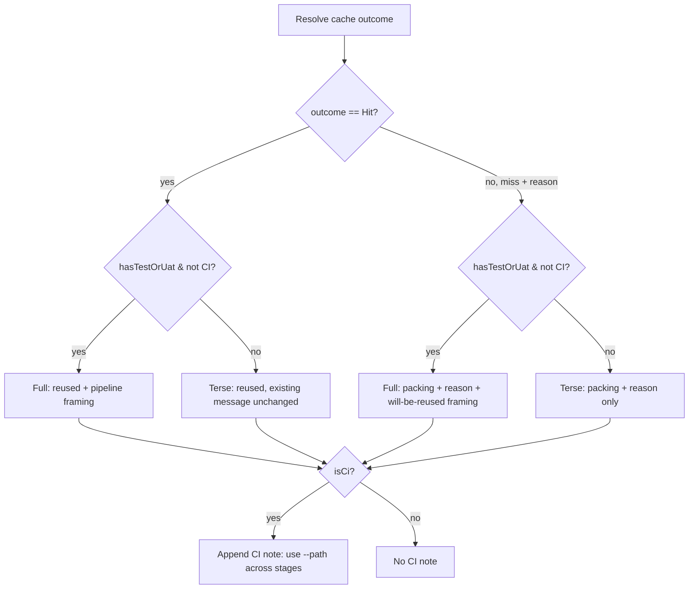

# Deploy Artifact Cache Visibility - Plan

## Goal Capsule

- **Objective:** Make `deploy`'s artifact-reuse cache visible on every run — a full explanation for projects that actually benefit from it (Test and/or UAT configured), a terse reason line otherwise, and a CI-specific note instead of a reason that can only ever say "miss."
- **Authority hierarchy:** This plan's Requirements and Key Technical Decisions govern the approach.
- **Stop conditions:** None identified.
- **Execution profile:** Local implementation and testing.
- **Tail ownership:** Implementer commits locally. No push, no PR unless separately requested.

---

## Product Contract

### Summary

`deploy`'s build-once-promote-many artifact cache (`docs/plans/2026-07-10-001-feat-deploy-artifact-reuse-plan.md`) only narrates itself on a cache *hit* (`Console.Skip(...)`, `DeployCommand.cs:156`) — a fresh pack is silent. This plan makes every non-`--path` deploy report its cache outcome and the reason for it, adds a longer pipeline-style explanation for projects where the cache actually matters (Test/UAT configured), and replaces that explanation with a CI-specific note on CI runners, where the cache structurally can never hit.

### Problem Frame

`solutions/<Name>/artifacts/` is gitignored (`.gitignore:16`), so a CI runner — a fresh checkout per job — never has a prior cache entry; the cache always misses there. That's a speed cost, not a correctness one: `pac solution pack` is deterministic over the clean git tree `deploy` already requires (`ValidateGitCleanAsync`), and the DTAP gate enforces an exact version match regardless of which machine packed which tier. But today's messaging doesn't distinguish "first pack, will be reused later" from "packing again because nothing changed on this project," and a CI log would show the same "no cache" outcome every single run forever with no explanation — reading as a broken feature rather than an inapplicable one.

### Requirements

**Every-deploy status line**
- R1. Every non-`--path` deploy prints a cache status line, whether the artifact was reused or freshly packed — not only on a hit.
- R2. On a miss, the line names the reason: no cached entry yet, the source commit changed since the last cached build, the current commit couldn't be resolved at all, `--no-cache` was passed, the cached build's managed flag differs from what this deploy wants, or the cached manifest exists but the artifact file is missing.

**Test/UAT-gated explanation**
- R3. A longer, pipeline-style explanation of why the cache exists (build once, reuse across promotion stages) is shown on every local deploy when the project has Test and/or UAT configured (`Config.TestUrl`/`Config.UatUrl` non-empty). Projects with only Dev and Prod configured get the terse status line only — they get no benefit from the cache, so the explanation would be noise.

**CI-specific handling**
- R4. On CI (`CiEnvironment.IsCi()`), the status line still reports the real outcome (hit or miss-with-reason, same as local) — a self-hosted or persisted-workspace CI runner can genuinely hit the cache, so the line must never claim a fresh pack when one didn't happen. A CI-specific note is appended after the outcome, pointing at `--path` as the correct mechanism for reusing one build across DTAP stages when each stage runs on a separate ephemeral job/runner.
- R5. Cache mechanics themselves — commit-SHA keying, `--no-cache`, the gitignored `artifacts/` folder — are unchanged. This plan is messaging-only.

### Scope Boundaries

- The cache is not removed or disabled — explicitly out of scope, since it remains the correct default for single-machine/sequential DTAP promotion.
- No change to `--path`'s behavior or messaging.
- No change to `ArtifactCacheHit`'s hit/miss *outcome* for any given input — only what gets reported about a miss changes.
- `docs/plans/2026-07-13-003-feat-deploy-ci-artifact-publish-plan.md` edits `DeployCommand.ExecuteFlowlineAsync` in the same neighborhood (right after this plan's U2 block, once `packagePath` is finalized) but touches only what happens to the already-resolved zip, not cache semantics — no correctness overlap, but implement the two plans one at a time rather than in parallel to avoid reconciling two concurrent edits to the same method.

---

## Planning Contract

### Key Technical Decisions

- **KTD1 — `ArtifactCacheHit`'s boolean becomes a reason-carrying outcome.** Replace `internal static bool ArtifactCacheHit(entry, currentCommitSha, wantManaged, noCache)` (`DeployCommand.cs:352-353`) with an enum (`Hit`, `NoEntry`, `CommitChanged`, `NoCurrentCommit`, `ManagedMismatch`, `NoCacheFlag`, `ArtifactFileMissing`) and a resolving method that also takes whether the artifact file exists on disk (folding in the existing `File.Exists(candidatePackagePath)` check at the call site, `DeployCommand.cs:98`). `outcome == Hit` replaces every existing boolean use; the miss branches add the reason R2 needs. `NoCurrentCommit` is distinct from `CommitChanged`: it fires when `GitUtils.GetLastCommitShaForPathAsync` itself returns `null` (a git failure, or no commit yet touches the solution folder) — there is no "old vs. new commit" to name, so it can't share `CommitChanged`'s wording.
- **KTD2 — No "shown once" state.** The Test/UAT-gated explanation (R3) and the CI note (R4) are pure per-invocation branches on `(CiEnvironment.IsCi(), hasTestOrUat)` — no persisted "have I shown this before" flag. Every deploy re-evaluates the same two booleans; simpler than tracking display history, and matches the requirement that the explanation is relevant on every deploy, not just the first.
- **KTD3 — `hasTestOrUat` reuses existing config reads.** `!string.IsNullOrEmpty(Config.TestUrl) || !string.IsNullOrEmpty(Config.UatUrl)` — the same fields `ResolveDtapGate` already reads (`DeployCommand.cs:456-459`), no new config surface.
- **KTD4 — Message-building extracted into a pure static method.** `internal static string BuildCacheStatusMessage(CacheOutcome outcome, string solutionName, string? cachedCommitSha, string? currentCommitSha, bool cachedManaged, bool wantManaged, bool isCi, bool hasTestOrUat)` (exact signature settled at implementation time) — `cachedManaged`/`wantManaged` are needed so the `ManagedMismatch` branch can name both the cached build's mode and this deploy's requested mode (R2); both values are already available at the call site (`cacheEntry.Managed`, `sln.IncludeManaged`). Keeps the branching logic unit-testable without a PAC connection, matching this codebase's established pure-decision-method pattern (`ArtifactCacheHit` itself, `FindProblematicSolutions` in `docs/solutions/best-practices/provision-safety-guard-unmanaged-solutions-2026-05-18.md`).
- **KTD6 — Miss-reason precedence when multiple conditions co-occur.** Mirrors the existing `ArtifactCacheHit` short-circuit order: `--no-cache` first (`NoCacheFlag`), then no entry (`NoEntry`), then unresolvable current commit (`NoCurrentCommit`), then commit changed (`CommitChanged`), then managed mismatch (`ManagedMismatch`), then artifact file missing (`ArtifactFileMissing`) — the first condition that applies names the reason; the resolving method never reports more than one.
- **KTD5 — CI appends a note to the real outcome; it never substitutes for it.** The CI-specific `--path` note is appended after whatever `outcome` actually resolved to — a self-hosted or persisted-workspace runner can genuinely hit the cache, and the status line must keep telling the truth (R1) regardless of platform. `hasTestOrUat`'s longer pipeline framing is still suppressed on CI (a CI runner gets no benefit from the local cache even when it configures Test/UAT), but the CI note is additive to the outcome line, not a replacement for it.

### High-Level Technical Design

---

## Implementation Units

### U1. Refactor cache-hit boolean into a reason-carrying outcome

**Goal:** Replace `ArtifactCacheHit`'s bool with an outcome that also names why a miss happened.

**Requirements:** R2, R5 (foundation for R1/R3/R4's messaging)

**Dependencies:** None — foundation unit.

**Files:**
- `src/Flowline/Commands/DeployCommand.cs` — replace `ArtifactCacheHit` (lines 352-353) with a `CacheOutcome` enum and a resolving method folding in the artifact-file-exists check currently inline at the call site (line 98).
- `tests/Flowline.Tests/DeployCommandArtifactCacheTests.cs` — rename/extend existing `ArtifactCacheHit_*` tests to assert the specific outcome value, not just true/false.

**Approach:** Preserve every existing hit/miss decision exactly — this is a refactor of what gets *reported*, not what gets *decided*. `outcome == CacheOutcome.Hit` is a drop-in replacement for the old `true` at the one call site that gates cache reuse (`DeployCommand.cs:98`).

**Patterns to follow:** The existing `ArtifactCacheHit`'s own pure-static-method shape; `ReadCacheEntryIfExists`'s existing tolerance for a missing/corrupt sidecar (treat as `NoEntry`, not a thrown exception).

**Test scenarios:**
- Happy path: entry present, commit SHA matches, managed flag matches, artifact file exists, `noCache` false → `Hit`.
- Edge case: entry is `null` (no prior cache) → `NoEntry`.
- Edge case: entry present but commit SHA differs → `CommitChanged`.
- Edge case: entry present, SHA matches, but `Managed` differs from what's requested → `ManagedMismatch`.
- Edge case: entry present, SHA and managed match, but the artifact zip file is missing on disk → `ArtifactFileMissing`.
- Edge case: `noCache` is `true`, even with an otherwise-matching entry → a miss outcome (distinct from `NoEntry` — reported reason must say `--no-cache` forced it, not "no cache found").
- Edge case: `currentCommitSha` is `null` (git failure, or no commit yet touches the solution folder) → `NoCurrentCommit`, not `Hit` and not `CommitChanged`.

**Verification:** `dotnet test --filter DeployCommandArtifactCacheTests` passes; `dotnet build` surfaces the one call site that must switch from the old bool to `outcome == Hit`.

---

### U2. Wire per-deploy cache messaging

**Goal:** Print the right message for every combination of cache outcome, CI/local, and Test/UAT-configured — replacing the current hit-only `Console.Skip` call.

**Requirements:** R1, R3, R4

**Dependencies:** U1

**Files:**
- `src/Flowline/Commands/DeployCommand.cs` — replace the `if (reusableCacheEntry != null) Console.Skip(...) else { pack }` block (`DeployCommand.cs:153-164`) with a call to the new message-building method (KTD4) followed by the existing pack-or-reuse branching, unchanged in its actual decision logic.
- `tests/Flowline.Tests/DeployCommandCacheMessagingTests.cs` (new) — tests for `BuildCacheStatusMessage`'s branches directly, no PAC connection needed.

**Approach:** The message-building method is a pure function of the outcome and the two booleans (KTD5's CI-first branch order); `ExecuteFlowlineAsync` calls it once, after the outcome is resolved and before the pack-or-reuse decision executes, then prints the result via the existing `Console` wrapper at the appropriate tone (dim for a reuse/skip, matching this codebase's existing "already there, skipping" convention; plain for a fresh pack).

**Patterns to follow:** `docs/tone-of-voice.md`'s "already there, skipping" (dim) and spinner-label conventions; the existing `Console.Skip` call this replaces.

**Test scenarios:**
- Happy path: `Hit`, not CI, no Test/UAT configured → terse reuse message (existing wording, commit SHA shown).
- Happy path: `Hit`, not CI, Test/UAT configured → reuse message plus pipeline framing.
- Happy path: `NoEntry`, not CI, Test/UAT configured → pack message naming "no cached build yet" plus "will be reused for later promotions" framing.
- Edge case: `CommitChanged`, not CI, no Test/UAT → pack message naming the old→new commit change, no pipeline framing.
- Edge case: `ManagedMismatch`, not CI → pack message naming the cached build's mode vs. this deploy's requested mode.
- Edge case: `NoCacheFlag`, not CI → pack message naming that `--no-cache` forced the fresh pack.
- Edge case: `ArtifactFileMissing`, not CI → pack message naming that the cached manifest existed but the zip file was gone.
- Edge case: `NoCurrentCommit`, not CI → pack message naming that the current commit couldn't be resolved.
- Edge case: `Hit`, `isCi: true` → the real reuse message still prints (Covers R4 — a self-hosted/persisted-workspace CI runner can genuinely hit), with the `--path` note appended after it, not in place of it.
- Edge case: any miss outcome, `isCi: true` → the real miss-and-reason message still prints, with the same `--path` note appended — the note's text doesn't vary by which reason triggered the miss.
- Edge case: any outcome, `isCi: true`, `hasTestOrUat: true` → the terse (non-pipeline-framed) outcome message prints, plus the CI note — the longer pipeline framing stays suppressed on CI regardless of Test/UAT (Covers KTD5's framing-suppression half).

**Verification:** `dotnet test --filter DeployCommandCacheMessagingTests` passes; manual check — two sequential local deploys with unchanged source show the full reuse message when Test/UAT is configured and the terse one when it isn't; a deploy run with `CI=true` set shows the real outcome (hit or miss-with-reason) plus the `--path` note appended, never a generic message that ignores what actually happened.

---

### U3. Documentation — wiki and CHANGELOG

**Goal:** Keep the wiki's "Artifacts" section and CHANGELOG in sync with the new messaging.

**Requirements:** Supports R1, R3, R4 (documentation of shipped behavior).

**Dependencies:** U1, U2

**Files:**
- `07-Deploy.md` (wiki repo — see note below) — "Artifacts" section: describe the every-deploy status line, the Test/UAT-gated explanation, and the CI-specific note (appended to the real outcome, not a replacement for it); keep the existing "Build once, promote many" framing but tie it explicitly to the new visible messaging.
- `CHANGELOG.md` — `[Unreleased]/Changed`: cache outcome now reported on every deploy, with a CI-aware note appended pointing at `--path`.
- `README.md` — no caching detail currently exists here (it's wiki-only per the "Artifacts" section); verify this stays the right split and no summary line needs adding.

**Wiki repo:** `Flowline.wiki`, the sibling repo referenced by this repo's `CLAUDE.md`. The path above is relative to that repo, not this one.

**Approach:** Text-only edits, no code.

**Test scenarios:** Test expectation: none — documentation only.

**Verification:** Wiki's "Artifacts" section describes all three message shapes (terse, full, CI); `CHANGELOG.md`'s `[Unreleased]/Changed` lists the messaging change.

---

## Verification Contract

- `dotnet test tests/Flowline.Tests/Flowline.Tests.csproj` — all new and existing tests pass (`DeployCommandArtifactCacheTests`, `DeployCommandCacheMessagingTests`).
- `dotnet build` — zero remaining callers of the old boolean `ArtifactCacheHit` signature.
- Manual verification: two sequential local deploys with no source change show a reuse message; a source change between them shows the commit-changed reason; setting `CI=true` still shows the real outcome, with the CI-specific note appended.

## Definition of Done

- U1-U3 complete; every non-`--path` deploy reports a cache outcome, never silent on a miss, and CI never overrides a real outcome with a generic message.
- The pipeline-style explanation appears only when Test and/or UAT is configured, and never on CI regardless of that configuration.
- Wiki (`07-Deploy.md`) and `CHANGELOG.md` reflect the final shipped messaging.
- No dead code left from the old boolean `ArtifactCacheHit` signature.
