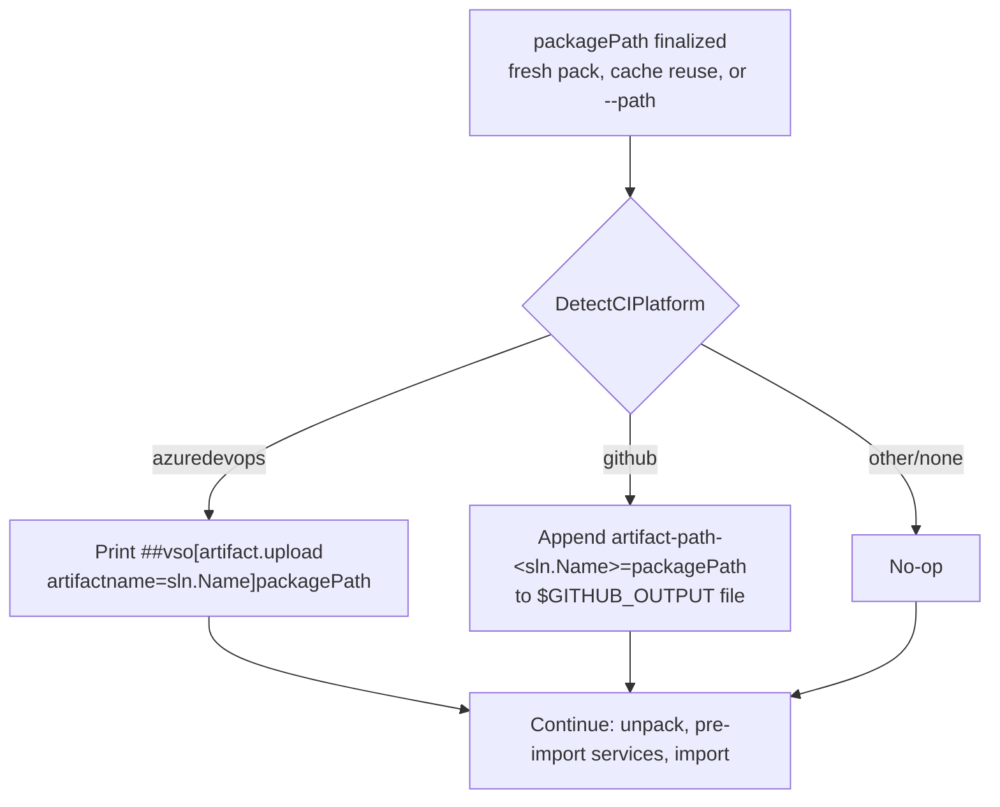

# Deploy CI Artifact Publish - Plan

## Goal Capsule

- **Objective:** `deploy` surfaces the packed solution zip as a native build artifact on Azure Pipelines automatically, and exposes its path as a GitHub Actions step output so the calling workflow can upload it with its own `actions/upload-artifact` step.
- **Authority hierarchy:** This plan's Requirements and Key Technical Decisions govern the approach.
- **Stop conditions:** None identified — both mechanisms are documented, stable platform protocols with no ambiguity to resolve during implementation.
- **Execution profile:** Local implementation and testing (CI-platform behavior verified against documented protocol, not a live pipeline run).
- **Tail ownership:** Implementer commits locally. No push, no PR unless separately requested.

---

## Product Contract

### Summary

After `deploy` resolves the solution zip actually being imported — freshly packed, reused from cache, or supplied via `--path` — it emits Azure Pipelines' native artifact-upload logging command when running under Azure DevOps, and writes the resolved path to the GitHub Actions step-output file when running under GitHub Actions. Neither mechanism requires a new flag; neither affects deploy's success/failure outcome.

### Problem Frame

`deploy` already writes the packed zip to a deterministic, gitignored path (`solutions/<Name>/artifacts/<name>_{managed|unmanaged}.zip`, `DeployCommand.cs:342-346`), but nothing surfaces that file to the CI system running the pipeline. A user has to know the path and wire their own upload step by hand. Azure Pipelines supports a zero-dependency, zero-auth mechanism for this (a documented stdout logging command); GitHub Actions does not have an equivalent — its artifact upload is a dedicated Action requiring the Node toolkit or a REST call with a token, which is more auth surface than a Dataverse deploy tool should carry. GitHub Actions does, however, support writing step outputs to a file path named by `$GITHUB_OUTPUT`, which is enough to let the user's own workflow YAML reference the resolved artifact path without hardcoding it.

### Requirements

- R1. When running under Azure Pipelines (detected via `ConsoleHelper.DetectCIPlatform()` returning `"azuredevops"`), after the artifact zip path is finalized, `deploy` emits Azure Pipelines' native artifact-upload logging command for that zip — on by default, no opt-in flag.
- R2. When running under GitHub Actions (`DetectCIPlatform()` returning `"github"`), `deploy` writes the resolved artifact path to the file named by the `GITHUB_OUTPUT` environment variable, under a documented output name qualified by the solution name, so the calling workflow's own `actions/upload-artifact` step can reference it — and so looping `deploy` over multiple sibling solutions within one workflow step doesn't have each write silently clobber the previous solution's output key.
- R3. Outside these two platforms (local, other CI, or no CI), neither mechanism fires — no behavior change.
- R4. A failure to emit the logging command or write the output file is a warning, never a deploy-blocking error — mirrors this codebase's existing tolerance for non-essential side effects (e.g. the temp-directory-cleanup `finally` block, `DeployCommand.cs:207-215`).
- R5. Both mechanisms fire regardless of whether the subsequent `pac solution import` succeeds — the packed zip is already valid and potentially useful (manual retry, inspection of a failed deploy) once it's resolved, independent of import outcome.

### Scope Boundaries

- **Outside this plan's identity:** GitHub Actions direct upload via the `gh` CLI, the Actions Toolkit, or the REST API — all require token/auth handling this plan deliberately avoids; the user's own workflow YAML owns the actual upload.
- **Outside this plan's identity:** Any CI platform beyond Azure DevOps and GitHub Actions. `CiEnvironment.IsCi()` remains a generic "some CI" signal; this plan adds platform-specific behavior only for the two named platforms.
- No change to what gets packed, when, or the artifact-reuse cache from `docs/plans/2026-07-10-001-feat-deploy-artifact-reuse-plan.md`.
- `docs/plans/2026-07-13-002-feat-deploy-cache-visibility-plan.md` edits `DeployCommand.ExecuteFlowlineAsync` in the same neighborhood (the block just before this plan's dispatcher call point) but touches only cache-outcome messaging, not what gets published to CI — no correctness overlap, but implement the two plans one at a time rather than in parallel to avoid reconciling two concurrent edits to the same method.

---

## Planning Contract

### Key Technical Decisions

- **KTD1 — Reuse `ConsoleHelper.DetectCIPlatform()`, don't re-check env vars.** `DetectCIPlatform()` (`ConsoleHelper.cs:34-41`) already distinguishes `"github"`/`"azuredevops"`/`"jenkins"`/`"unknown"` from `GITHUB_ACTIONS`/`TF_BUILD`/`JENKINS_URL`/`CI`, and returns `null` when none of those are set (no CI detected at all). This plan branches on its return value instead of re-implementing the same environment-variable checks a second time.
- **KTD2 — Placement: immediately after `packagePath` is finalized, before `PacUtils.UnpackSolutionAsync`.** At this point the zip is valid regardless of origin (fresh pack, cache reuse, or `--path`) and regardless of whether import later succeeds (R5) — the same point `DeployCommand.cs:169` already sits at today.
- **KTD3 — Azure DevOps: one stdout logging-command line, no SDK.** `##vso[artifact.upload artifactname=<name>]<path>` is Azure Pipelines' documented protocol for any process's stdout, not a Node/PowerShell-specific mechanism — consistent with R1's "no opt-in flag" requirement, since printing a line has no failure mode worth gating behind a flag. Must be emitted through a plain, non-markup-parsing write (e.g. `IAnsiConsole.WriteLine`) — never `Console.MarkupLine`, which `DeployCommand.cs` already uses elsewhere (`DeployCommand.cs:248`) and which would try to parse the vso line's literal `[artifact.upload ...]` as a Spectre style tag and throw.
- **KTD4 — GitHub Actions: append to `$GITHUB_OUTPUT`, not the deprecated `::set-output`.** `$GITHUB_OUTPUT` is GitHub's current documented mechanism for step outputs; append (not overwrite) the file, matching the protocol's own contract for multiple outputs from one step.
- **KTD5 — Both emissions wrapped in try/catch, logged as a warning on failure (R4).** Mirrors the existing pattern of swallowing non-essential cleanup failures elsewhere in `DeployCommand` (`DeployCommand.cs:207-215`) rather than letting a CI-integration side effect fail an otherwise-successful deploy.
- **KTD6 — Output/artifact naming: `artifact-path-<sln.Name>` (GitHub Actions output key), `sln.Name` (Azure DevOps artifact name).** `sln.Name` is already the identifier used throughout `DeployCommand` for this solution. The GitHub Actions key is qualified by solution name rather than a bare `artifact-path`, because `$GITHUB_OUTPUT` keys the same key written twice within one step to only the last value — a workflow that loops `deploy` over sibling solutions in a single step would otherwise silently lose every solution's path but the last.

### High-Level Technical Design

---

## Implementation Units

### U1. CI artifact-publish dispatcher (Azure DevOps + GitHub Actions)

**Goal:** Emit the right platform-specific signal right after the artifact zip is resolved, non-fatally on failure.

**Requirements:** R1, R2, R3, R4, R5

**Dependencies:** None — foundation and only code unit.

**Files:**
- `src/Flowline/Commands/DeployCommand.cs` — add a method (e.g. `PublishArtifactForCi(string packagePath, string solutionName)`) called once `packagePath` is finalized (`DeployCommand.cs:169`, before `PacUtils.UnpackSolutionAsync`); branches on `ConsoleHelper.DetectCIPlatform()`, wrapped in try/catch per KTD5.
- `tests/Flowline.Tests/DeployCommandCiArtifactTests.cs` (new) — tests for the pure message/line-building logic, separated from the actual file/stdout write so the branching is testable without a real CI environment.

**Approach:** Split into a pure function building the Azure DevOps logging-command string and the GitHub Actions output line, and a thin wrapper performing the actual `Console.WriteLine`/file-append side effect — the pure function is what gets unit tested; the wrapper is exercised manually (matches this codebase's established pattern for effects with no test harness, e.g. `docs/solutions/best-practices/provision-safety-guard-unmanaged-solutions-2026-05-18.md`'s pure-static-method approach).

**Patterns to follow:** `DeployCommand.cs:207-215`'s try/catch-and-warn shape for non-essential cleanup; `ConsoleHelper.DetectCIPlatform()`'s existing return-value contract.

**Test scenarios:**
- Happy path: build the Azure DevOps logging-command string for a given `packagePath` and `solutionName` — exact expected format.
- Happy path: build the GitHub Actions output line (`artifact-path-<solutionName>=<packagePath>`) for a given `packagePath` and `solutionName`.
- Edge case: `DetectCIPlatform()` returns `null` (no CI detected), `"jenkins"`, or `"unknown"` → dispatcher is a no-op, no line built for either platform.
- Error path: the GitHub Actions branch's file-append target is unwritable (e.g. `GITHUB_OUTPUT` env var set to a nonexistent directory) → caught, logged as a warning, does not throw past the dispatcher, and `dotnet build`/the calling deploy still completes (Covers R4 end-to-end, not just that the exception is caught).
- Edge case: `GITHUB_ACTIONS` is set but `GITHUB_OUTPUT` itself is unset or empty → treated as a no-op, not a crash (defensive; shouldn't occur on real runners).
- Integration: dispatcher runs after `packagePath` is finalized for all three origins (fresh pack, cache reuse, `--path`) — same call site regardless of how `packagePath` was resolved (Covers R5's "regardless of origin").

**Verification:** `dotnet test --filter DeployCommandCiArtifactTests` passes; manual check — running `deploy` with `TF_BUILD` set prints the expected `##vso[artifact.upload...]` line; running with `GITHUB_ACTIONS` set and `GITHUB_OUTPUT` pointed at a temp file leaves that file containing the `artifact-path-<solutionName>=` line after the run; running with `GITHUB_OUTPUT` pointed at an unwritable path still completes the deploy, with a warning logged instead of a thrown exception.

---

### U2. Documentation — wiki and CHANGELOG

**Goal:** Document both mechanisms, including a worked GitHub Actions YAML snippet since that side needs the user's own workflow step.

**Requirements:** Supports R1, R2, R3 (documentation of shipped behavior).

**Dependencies:** U1

**Files:**
- `08-Deploy.md` (wiki repo — see note below) — new subsection under "Artifacts" describing: Azure Pipelines gets the packed zip attached as a build artifact automatically; GitHub Actions gets the path exposed as a step output (`artifact-path-<SolutionName>`), with a short example step referencing it via `actions/upload-artifact`, and a note that looping over sibling solutions needs one step per solution to read each output; other CI platforms need to wire their own upload against the existing deterministic `solutions/<Name>/artifacts/` path.
- `CHANGELOG.md` — `[Unreleased]/Added`: CI artifact publishing for Azure Pipelines and GitHub Actions.
- `README.md` — no CI-artifact detail exists here today (CI specifics live in the wiki's "Artifacts" section); verify this split still holds and no summary line needs adding.

**Wiki repo:** `Flowline.wiki`, the sibling repo referenced by this repo's `CLAUDE.md`. The path above is relative to that repo, not this one.

**Approach:** Text-only edits, no code.

**Test scenarios:** Test expectation: none — documentation only.

**Verification:** Wiki's "Artifacts" section documents both mechanisms with a working GitHub Actions YAML example; `CHANGELOG.md`'s `[Unreleased]/Added` lists the feature.

---

## Verification Contract

- `dotnet test tests/Flowline.Tests/Flowline.Tests.csproj` — `DeployCommandCiArtifactTests` passes alongside all existing tests.
- `dotnet build` — no compilation errors introduced.
- Manual verification: `TF_BUILD` set → expected `##vso[artifact.upload]` line printed; `GITHUB_ACTIONS` + `GITHUB_OUTPUT` set → expected `artifact-path-<solutionName>=` line appended to the target file; neither variable set → no output from either mechanism; `GITHUB_OUTPUT` pointed at an unwritable path → deploy still completes, warning logged instead of a thrown exception (Covers R4's failure path explicitly, not just its happy path).

## Definition of Done

- U1-U2 complete; both platform signals fire automatically with no new flag, never block a deploy's own success/failure outcome, and the GitHub Actions output key is qualified per solution.
- Wiki (`08-Deploy.md`) and `CHANGELOG.md` document both mechanisms and the GitHub Actions workflow-YAML pairing.
- No dead code left from the dispatcher's pure-function/wrapper split.
