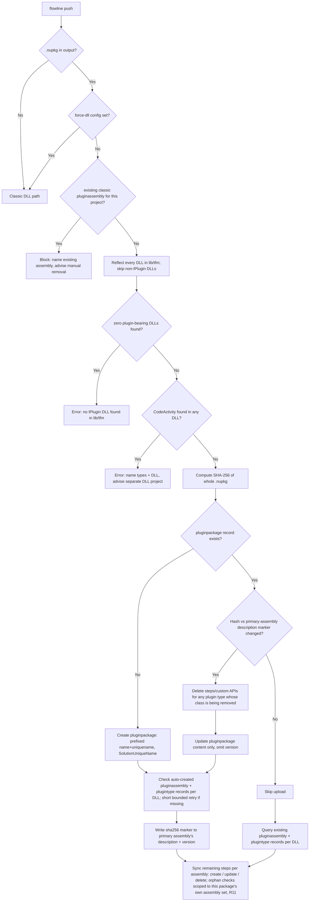
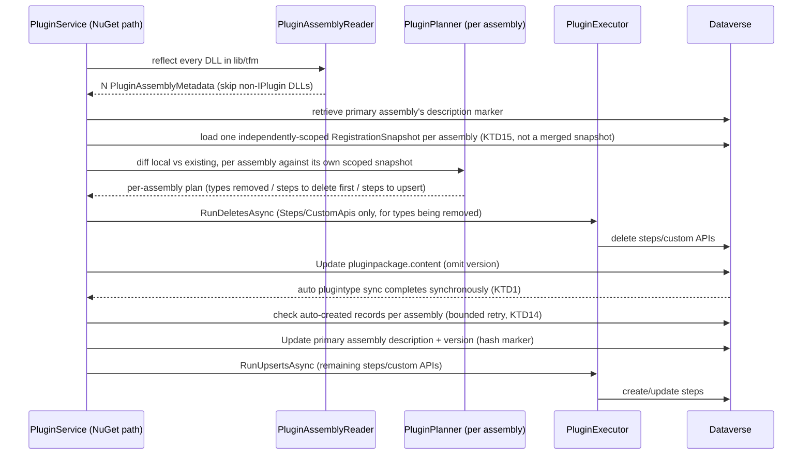
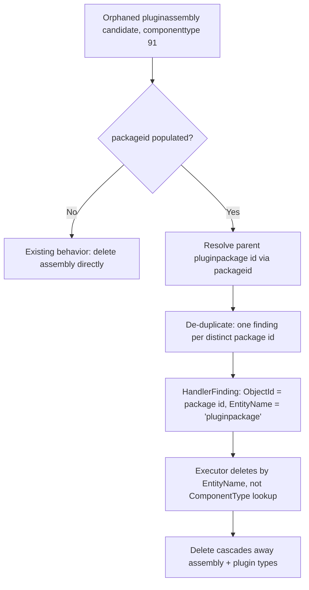

# Plugin NuGet Package Support - Plan

## Goal Capsule

- **Objective:** Enable `flowline push` to deploy plugins via the Dataverse `pluginpackage` table (Dependent Assemblies), eliminating the ILMerge/ILRepack requirement for projects with external NuGet dependencies.
- **Product authority:** Flowline CLI v1.0 track (`STRATEGY.md` — Code asset push track, v1.0 addition).
- **Authority hierarchy:** Requirements below are binding; Key Technical Decisions guide implementation choices where Requirements leave room; implementer judgment fills anything neither covers.
- **Stop conditions:** automated migration of an existing classic `pluginassembly` to a `pluginpackage` — in any form, including an opt-in flag — is explicitly out of scope (KTD9). If closing that gap looks tempting mid-implementation (e.g. "while I'm touching detect-and-block, may as well auto-migrate"), stop and leave it as documented follow-up work instead.
- **Execution profile:** cross-cutting change through `Flowline.Core`'s plugin registration pipeline (`PluginAssemblyReader`, `PluginReader`, `PluginPlanner`, `PluginService` — `PluginExecutor` is read, not modified; see KTD13) plus `Flowline`'s `PushCommand` and `.flowline` config (`ProjectSolution`), and one orphan-cleanup handler (`PluginAssemblyFamilyHandler`). No new service classes — every unit extends an existing file (KTD13).
- **Tail ownership:** implementer runs `dotnet test` across `Flowline.Core.Tests` and `Flowline.Tests`, and confirms against a real `pac plugin init`-scaffolded package with an external NuGet dependency (e.g. Newtonsoft.Json) pushed to a real Dataverse dev environment: (1) first push creates the package and registers all steps, (2) a second push with no changes skips upload, (3) removing a `[Step]`-decorated class and re-pushing succeeds and leaves no orphaned plugin type, before calling the work done.

---

## Product Contract

**Product Contract preservation:** R1, R3, R4, R6-R8, KD1-KD6, F1-F3, and AE1, AE3-AE8 are unchanged from the brainstorm-sourced requirements. Refined or added during planning, all resolved live with the user or via live Dataverse verification: R2a and R5a (standalone `--pluginFile` nupkg support and the version-omit-on-update rule, both surfaced by KTD4/KTD6's live findings); R9/R10 (detect-and-block, orphan-cleanup redirect, KTD9/KTD10); R3a and R11 (empty-package rejection and multi-assembly orphan-check scoping, both surfaced by this plan's own document review — see KTD15/KTD16). F4 and AE9-AE12 cover the added requirements. Scope Boundaries' migration wording was tightened to explicitly rule out an opt-in migration flag alongside full automation.

### Summary

Adds NuGet package deployment to `flowline push`. When the build produces a `.nupkg`, Flowline uploads it to the `pluginpackage` Dataverse table. Live verification against a real Dataverse environment (see Planning Contract) confirmed that Dataverse extracts the package and creates the linked `pluginassembly` and `plugintype` records synchronously, inside the same Create/Update request — by the time the request returns, the records already exist server-side. Flowline still performs one immediate existence check (with a short bounded retry as insurance against slower/larger packages) before registering steps against those records. The `[Step]` attribute API is unchanged. This plan covers the full requirements scope with no narrowing, resolves the two questions the requirements left open (migration scope, package-owned orphan cleanup), and extends Flowline's existing plugin-registration pipeline rather than introducing a parallel one.

### Problem Frame

Classic plugin projects with external NuGet dependencies must merge all assemblies into a single DLL before upload — typically with ILMerge (unmaintained) or ILRepack (adds build complexity). Dataverse's Dependent Assemblies feature eliminates this entirely: upload a `.nupkg` and Dataverse extracts its contents in the sandbox at runtime.

NuGet package deployment has been the platform default for new Dataverse plugin projects since 9.1. The `pac plugin init` template produces a `.nupkg` by default. Flowline's inability to deploy this path is the single blocker to recommending it for greenfield projects.

### Key Decisions

- **KD1 — Auto-detect `.nupkg` over explicit flag.** If the build output contains a `.nupkg` for the plugins project, Flowline uses the package path automatically. This aligns with Flowline's convention-over-configuration approach and requires no user action for `pac plugin init` projects. A `.flowline` config key allows projects to force the classic DLL path when both files are present.

- **KD2 — Read auto-created plugin type records; do not create them.** Unlike the classic DLL path where Flowline creates `plugintype` records from assembly reflection, the NuGet path reads the type records Dataverse auto-creates from the package. Live verification confirmed this happens synchronously within the Create/Update call — no real wait loop is needed, just a post-call existence check (bounded retry as insurance; see KTD1). Reflection on the `.dll`s is still used for `[Step]` / `[CustomApi]` attribute scanning and pre-flight validation — not for creating type records.

- **KD3 — Migration deferred; orphan cleanup is not.** Migrating an existing classic `pluginassembly` to a `pluginpackage` involves replacing a live, working registration — deferred to follow-up work in any form (KTD9). This is a distinct concern from cleaning up an already-orphaned `pluginpackage` (e.g. a plugins project that stops building a `.nupkg` locally): that path is now in scope (R10, KTD10) since it reuses the existing orphan-cleanup pipeline rather than introducing new migration mechanics. Live verification found that a `pluginassembly` owned by a `pluginpackage` cannot be deleted directly ("Unable to delete plug-in assembly as it is part of plugin package") — only deleting the parent `pluginpackage` works, and that cascades to remove the assembly and its plugin types even when they still exist (confirmed with no steps registered; KD4 covers the case where steps do exist).

- **KD4 — Removed plugin classes must have their steps deleted before the package update, not after.** Live verification found that updating a `pluginpackage` with a `.nupkg` that drops a class fails outright ("Unable to delete 'X' plugintype due to N step(s) registered on it") if that class's `plugintype` still has registered `sdkmessageprocessingstep` records. This reverses the assumed ordering: for the classic DLL path, Flowline uploads first and reconciles steps after; for the NuGet path, Flowline must delete steps (and custom APIs) for plugin types that are about to disappear *before* calling Update on the `pluginpackage`, then let Dataverse's synchronous type-sync remove the now-empty plugin type as part of that same call.

- **KD5 — A `.nupkg` can contain multiple plugin-bearing DLLs; reflection and type lookup must be per-assembly, not per-package.** A `.nupkg`'s `lib/<tfm>/` folder holds one primary DLL plus any dependency DLLs not marked `PrivateAssets="All"` (the mechanism that makes Dependent Assemblies work at all) — and there is nothing stopping a project from producing, or a package from bundling, more than one DLL that itself contains plugin classes (e.g. a `ProjectReference` to another plugin-bearing project). Live verification injected a second, independent DLL with its own `IPlugin` class into an existing package's `lib/net462/` folder and confirmed Dataverse creates **one `pluginassembly` record per DLL that contains plugin types**, correctly skipping the pure-dependency DLL (Newtonsoft.Json.dll) entirely — 2 assemblies were created, not 3, each scoped to only its own plugin types. Flowline's existing single-DLL `PluginAssemblyReader.Analyze(string dllPath)` (`PluginAssemblyReader.cs:12`) cannot be reused as-is for the NuGet path: it must be extended to enumerate every DLL inside the package's `lib/<tfm>/` folder, reflect each one, and skip any DLL containing no class implementing `IPlugin` — mirroring the exact filter Dataverse itself applies. Step/custom API registration (R7) must then resolve each attribute-decorated type back to the correct `plugintype`, which is scoped under the correct `pluginassembly` (matched by assembly name) — a package with N plugin-bearing DLLs has N independent assembly/type-record sets, not one.

  Framing note: multiple plugin-bearing DLLs in one `.nupkg` is the genuine edge case here, not the mainline. A `dotnet` project normally produces one NuGet package each, so a second plugin-bearing DLL only shows up via a deliberate `ProjectReference` chain into another plugin project — not something that happens by accident the way a single extra dependency DLL does. The whole reason to prefer the NuGet/Dependent-Assemblies path over the classic `.dll` path is to avoid ILMerge/ILRepack for genuinely non-plugin dependency DLLs (Newtonsoft.Json and the like — see the Problem Frame above), not to bundle multiple independent plugin projects into one package. KD5/KTD15/KTD16 and U1/U4/U5's per-assembly scoping still have to be correct regardless — a rare configuration that silently corrupts a sibling assembly's registrations (the P0 fixed post-implementation, see Implementation Units) is exactly as bad as a common one — but this is why the plan does not invest further in N>2-assembly ergonomics, performance, or UX: real-world packages are expected to carry at most one or two plugin-bearing DLLs.

- **KD6 — The NuGet path must work identically through `flowline push`'s auto-detected build output and the existing standalone `--pluginFile` flag.** Flowline already has a `-p|--pluginFile <PATH>` standalone mode (`PushCommand.cs:43`) that explicitly rejects `.nupkg` today: `ResolveStandalonePluginFilePath` throws "NuGet packages not yet supported — use a .dll file." (`PushCommand.cs:391-395`). The package-reflection-and-upload logic this plan adds must be a single shared code path taking a `.nupkg` file path, invoked identically whether that path came from auto-detecting the plugins project's build output (project mode) or from an explicit `--pluginFile some.nupkg` (standalone mode) — not something wired only into the auto-detect flow.

### Requirements

**Detection and configuration**

- R1. When the plugins project build output contains a `.nupkg`, Flowline selects the NuGet package deployment path automatically.
- R2. A `.flowline` config key (`PluginPackageMode`: `Auto` | `Nupkg` | `Dll`, default `Auto`) controls the deployment path. `Auto` keeps R1's zero-config auto-detect (nupkg if the build produced one, else the classic DLL); `Dll` forces the classic path even when a `.nupkg` is present; `Nupkg` requires a `.nupkg` and fails loudly instead of silently falling back to the classic DLL when the build didn't produce one. The key lives per-solution (KTD12), not at the config root. (Superseded during implementation: originally scoped as a `ForceClassicPluginAssembly` boolean — widened to a 3-state enum so a team can also assert "must be nupkg" rather than only "must be classic".)
- R2a. The existing standalone `-p|--pluginFile <PATH>` flag accepts a `.nupkg` path in addition to `.dll` (`ResolveStandalonePluginFilePath`, `PushCommand.cs:386-401`, currently throws "NuGet packages not yet supported" for `.nupkg` at line 391-392). The reflection/upload logic is shared between this path and the auto-detected project-mode path (KD6) — no separate implementation for standalone mode.

**Pre-flight validation**

- R3. Before any upload, Flowline extracts the `.nupkg` (a standard zip/OPC package) and enumerates every DLL in its `lib/<tfm>/` folder — not just one designated "main" assembly. A single package can contain more than one DLL with plugin classes (KD5), and Dataverse itself creates one `pluginassembly` per such DLL, correctly ignoring pure-dependency DLLs that contain no `IPlugin`-derived types. Flowline reflects each DLL in the folder and skips any DLL with no class implementing `IPlugin`, mirroring Dataverse's own filter (KTD8). Across all reflected plugin-bearing DLLs, Flowline checks for workflow activity types; if any class extends `CodeActivity`, Flowline rejects the push with an error that names the offending types (and the DLL they're in) and advises moving them to a separate project for classic DLL deployment.
- R3a. If reflection (R3) finds zero plugin-bearing DLLs anywhere in the `.nupkg`, Flowline rejects the push before any hash computation, primary-assembly resolution, or Dataverse write, naming the `.nupkg` and stating that no DLL implementing `IPlugin` was found in `lib/<tfm>/`. Without this, R4's hash marker and R6's existence check have no primary assembly to resolve against, and the failure would otherwise surface as an unclear downstream error instead of an actionable one.
- R9. When `flowline push` finds an existing classic (non-package) `pluginassembly` already registered for a project whose build now produces a `.nupkg`, Flowline blocks the push with a clear error naming the existing assembly and advising manual removal before the package path can take over (KTD9). No automated migration of any kind ships in this plan.

**Change detection**

- R4. Before uploading, Flowline computes a SHA-256 hash of the whole local `.nupkg` file's bytes (not just one DLL inside it) and compares it against a Flowline-managed marker stored in the `description` field of the **primary** auto-created `pluginassembly` — the one whose name matches the plugins project's own build output assembly name, which Flowline already knows deterministically without guessing. If unchanged, Flowline skips the upload and proceeds to step sync only. This reuses the exact `[flowline] sha256=<hash>` convention the classic DLL path already writes (`PluginService.cs:437,492,964`), just relocated to the package's primary assembly instead of a standalone `pluginassembly`.
  - **Why the whole-package hash, not a per-DLL hash:** comparing only the primary DLL's own bytes would miss a `.nupkg` that changes *only* in a pure-dependency DLL with no plugin types (e.g. a patch-version bump of Newtonsoft.Json), silently leaving a stale, potentially vulnerable dependency deployed. Hashing the full `.nupkg` bytes catches this; comparing against a marker read from one assembly record (a small, cheap retrieve) avoids ever needing to download and re-hash the full base64 `content` from `pluginpackage` itself.
  - **Corrected twice by live verification:** first, `pluginpackage` itself has no `description` attribute (confirmed via `RetrieveEntityRequest` metadata) and no other free-text field suitable for a hash marker, so the hash cannot live on the package record directly. The child `pluginassembly` *does* have `description` (same field the classic path already writes), and live verification confirmed Flowline can write to it directly with one caveat: a bare `Update` containing only `description` throws an internal Dataverse `NullReferenceException` (`Microsoft.Crm.ObjectModel.AssemblyMetadataValidator.ValidateInternal`) — including `version` (even set to its own unchanged value) in the same `Update` call avoids this and the write succeeds (KTD3). The marker was also confirmed to survive a subsequent content update to the *parent* `pluginpackage` (the assembly's `modifiedon` changes as Dataverse re-syncs it, but a previously-set `description` is left untouched) — so it is durable across pushes.
  - **Secondary (non-primary) plugin-bearing assemblies (KD5)** do not need their own change-detection marker for R4's purposes — the whole-package hash on the primary assembly already governs the single upload/skip decision for the entire `.nupkg`. Their `plugintype` sets are still reconciled per R7 every time an upload does happen.

**Upload and registration**

- R5. Flowline creates the `pluginpackage` record with `name` **and** `uniquename` both prefixed by the target solution's publisher prefix, `version` read from the nupkg's own nuspec version, and content set to the base64-encoded `.nupkg` bytes. The create call uses `CreateRequest` with the `SolutionUniqueName` request parameter set to the target solution — verified live: this produced a `solutioncomponent` row for the target solution (plus the standard Default Solution row every component gets), the same pattern Flowline already uses for `pluginassembly` creation (`PluginService.cs:441`). Setting `solutionid` directly on the entity does not work (`IsValidForCreate=false` in metadata). Dataverse validates the `name` attribute — not `uniquename`, not the nupkg's own internal NuGet `PackageId`/filename — against a registered publisher prefix at create time ("The nuget file name does not contain a solution prefix"), confirmed by creating successfully with an unprefixed `PackageId` nupkg once `name` carried the prefix, and by reproducing the failure with a prefixed `uniquename` but unprefixed `name`. The publisher prefix itself is the existing live-resolved solution publisher prefix (KTD11), not a new config value.
- R5a. On update to the `pluginpackage`, Flowline sends only `content`, omitting `version` entirely (KTD4). `content` alone is fully mutable in place on `pluginpackage`.
- R6. After create/update, Flowline checks once for the auto-created `pluginassembly` records matching the plugin-bearing DLLs found during reflection (R3) — potentially more than one (KD5) — and their plugin type records (verified synchronous — KTD1), retrying briefly on a short bounded schedule as insurance for larger packages or environments not covered by verification (KTD14), and erroring clearly if that bounded wait is exceeded for any expected assembly. Once the primary assembly (R4) is confirmed, Flowline writes the `[flowline] sha256=<hash>` marker for the whole `.nupkg` to its `description`, including `version` (re-read from that same assembly, unchanged) in the same `Update` call.
- R7. For each reflected plugin-bearing DLL (R3), Flowline registers, updates, and deletes plugin steps against that DLL's own auto-created plugin type records — diffed against a snapshot scoped to that DLL's own assembly (KTD15), not a single assembly per package (KD5) and not a merged view of every assembly's types. It does not create or modify plugin type records directly. **Ordering constraint (KD4):** for any plugin type whose class is being removed from the package, Flowline must delete its steps (and custom APIs) *before* uploading the new package content — Dataverse rejects the content update otherwise.
- R10. Orphan cleanup for the `PluginAssembly` family (componenttype 91) recognizes package-owned assemblies and redirects deletion to the parent `pluginpackage` record instead of the assembly directly, since the direct delete is confirmed to fail (KD3). The redirect uses the already-confirmed `packageid` lookup on the assembly, not a new Dataverse component-type constant (KTD10).
- R11. `flowline push`'s own push-time orphan warnings (the existing `WarnOrphanAssembliesAsync`/`WarnOrphanStepsAsync` checks the classic path already runs as part of every push) do not misclassify a package's *other* plugin-bearing assemblies as orphans on the NuGet path. The classic path's single-assembly check compares by `name != managedAssemblyName`; a multi-assembly package (KD5) has more than one legitimately-managed name in the same push, so a literal reuse of that check would flag every secondary assembly as orphaned on every single push, and under `--force delete-orphans` would delete its live steps and custom APIs before failing on the assembly delete itself (KD3). See KTD16.

**Step API**

- R8. The `[Step]` attribute contract is unchanged. Existing `[Step]` attributes on plugin classes require no modification.

### Key Flows

- F1. **New package push**
  - **Trigger:** `flowline push`; `.nupkg` detected; no existing `pluginpackage` record; no existing classic assembly conflict.
  - **Steps:** Reflect every DLL → reject if zero plugin-bearing DLLs found (R3a) → validate no CodeActivity (R3) → compute whole-package hash → query: not found → create package with prefixed `name`/`uniquename` via `SolutionUniqueName` (R5) → check auto-created records per DLL, synchronous in practice (R6) → write hash marker → register steps per assembly, scoped orphan checks (R7, R11).
  - **Covers:** R1, R3, R3a, R4, R5, R6, R7, R8, R11

- F2. **Update push (changed package)**
  - **Trigger:** `flowline push`; existing `pluginpackage` record; whole-package hash differs from the primary assembly's stored marker.
  - **Steps:** Reflect → validate → hash differs → delete steps/custom APIs for any plugin type whose class is being removed (KD4) → update package content only, omitting `version` (R4, R5a) → check auto-created records per DLL (R6) → write hash marker → sync remaining steps per assembly, scoped orphan checks (R11).
  - **Covers:** R1, R3, R4, R5, R5a, R6, R7, R11

- F3. **No-op push (unchanged package)**
  - **Trigger:** `flowline push`; existing `pluginpackage` record; whole-package hash unchanged.
  - **Steps:** Reflect → validate → hash matches → skip upload (R4) → query existing records per assembly directly → sync steps, scoped orphan checks (R11).
  - **Covers:** R1, R3, R4, R7, R11

- F4. **Detect-and-block (existing classic assembly)**
  - **Trigger:** `flowline push`; `.nupkg` detected; a classic (non-package) `pluginassembly` already registered for this project's assembly name.
  - **Steps:** Detect the conflict before any reflection or upload → error naming the existing assembly and advising manual removal.
  - **Covers:** R9

### Acceptance Examples

- AE1. **Auto-detection selects NuGet path**
  - **Covers:** R1
  - **Given:** Build output contains `Plugins.nupkg` and `Plugins.dll`; no force-dll config; no existing classic assembly conflict
  - **When:** `flowline push`
  - **Then:** Flowline uses the NuGet package path; no DLL upload occurs

- AE2. **Config override forces classic DLL**
  - **Covers:** R1, R2
  - **Given:** Build output contains `.nupkg`; the plugins project's `.flowline` solution entry has the force-dll key set
  - **When:** `flowline push`
  - **Then:** Flowline uses the classic DLL path; `.nupkg` is ignored

- AE3. **CodeActivity blocks push**
  - **Covers:** R3
  - **Given:** Plugins project contains a class extending `CodeActivity`; build produces `.nupkg`
  - **When:** `flowline push`
  - **Then:** Flowline errors before any upload, names the CodeActivity type(s) and the DLL, and advises moving them to a separate project for classic DLL deployment

- AE4. **Unchanged package skips upload**
  - **Covers:** R4
  - **Given:** The primary auto-created `pluginassembly`'s `description` holds a `[flowline] sha256=<hash>` marker matching the SHA-256 of the local `.nupkg` file
  - **When:** `flowline push`
  - **Then:** Flowline skips upload and proceeds directly to step sync

- AE4a. **Dependency-only change is still detected**
  - **Covers:** R4
  - **Given:** Only a pure-dependency DLL inside the `.nupkg` changed (e.g. a NuGet dependency patch bump); no plugin-bearing DLL's bytes changed
  - **When:** `flowline push`
  - **Then:** Flowline still uploads the package, because R4 hashes the whole `.nupkg` file rather than only the primary assembly's own DLL bytes

- AE5. **New package: full flow succeeds**
  - **Covers:** R5, R6, R7
  - **Given:** No `pluginpackage` record exists for this project
  - **When:** `flowline push`
  - **Then:** Flowline creates the package with a prefixed `name`/`uniquename`, confirms the auto-created plugintype records (synchronous in practice), then registers all steps

- AE6. **Removing a plugin class deletes its steps before the update**
  - **Covers:** R7, KD4
  - **Given:** An existing `pluginpackage` has a registered step on a plugin type whose class was removed from the local project
  - **When:** `flowline push`
  - **Then:** Flowline deletes the step (and any custom API) for the removed type before updating the package content, so the update succeeds and the now-orphaned plugin type is removed by Dataverse as part of that same update

- AE7. **Package with multiple plugin-bearing DLLs registers steps against each**
  - **Covers:** R3, R6, R7, KD5
  - **Given:** The plugins project's `.nupkg` contains two DLLs with `[Step]`-decorated classes (e.g. via a `ProjectReference`) plus a pure dependency DLL with no plugin types
  - **When:** `flowline push`
  - **Then:** Flowline reflects both plugin-bearing DLLs (skipping the dependency DLL), confirms both auto-created `pluginassembly`/`plugintype` record sets exist, and registers each DLL's steps against its own plugin type records

- AE8. **Standalone `--pluginFile` accepts a `.nupkg`**
  - **Covers:** R2a, KD6
  - **Given:** `flowline push <solution> --pluginFile ./MyPlugins.1.0.0.nupkg` run outside a Flowline project folder
  - **When:** The command executes
  - **Then:** Flowline deploys the package via the same NuGet path used in project mode, instead of the current "NuGet packages not yet supported" rejection

- AE9. **Existing classic assembly blocks the package path**
  - **Covers:** R9, KTD9
  - **Given:** A classic (non-package) `pluginassembly` named `Plugins` is already registered; the local build now also produces `Plugins.nupkg`
  - **When:** `flowline push`
  - **Then:** Flowline errors before any reflection or upload, naming the existing assembly and advising manual removal before the package path can take over

- AE10. **Orphan cleanup redirects a package-owned assembly's deletion**
  - **Covers:** R10, KTD10
  - **Given:** Orphan cleanup detects a `pluginassembly` with no local source, and that assembly's `packageid` is populated
  - **When:** Orphan cleanup runs its delete pass
  - **Then:** Flowline deletes the parent `pluginpackage` record instead of the assembly directly, which cascades away the assembly and its plugin types, rather than attempting (and failing) a direct assembly delete

- AE11. **Empty package rejected with an actionable error**
  - **Covers:** R3a
  - **Given:** A `.nupkg` whose `lib/<tfm>/` folder contains only dependency DLLs, no DLL with an `IPlugin`-derived class
  - **When:** `flowline push`
  - **Then:** Flowline errors before any hash computation or Dataverse write, naming the `.nupkg` and stating no plugin-bearing DLL was found

- AE12. **A no-op push on a multi-assembly package doesn't touch the sibling assembly's steps**
  - **Covers:** R11, KD5
  - **Given:** An existing multi-assembly package (two plugin-bearing DLLs, each with its own registered steps); nothing changed locally
  - **When:** `flowline push`
  - **Then:** Both assemblies' steps are confirmed present and untouched — neither assembly's steps are flagged as orphaned or deleted because the other assembly exists in the same push

### Scope Boundaries

#### Deferred to Follow-Up Work

- Automated migration from an existing classic `pluginassembly` to a `pluginpackage` — in any form, including an opt-in flag. v1 ships detect-and-block only (KTD9). Revisit only if a concrete user request materializes; the risk profile (deleting a live, working registration) doesn't justify building it speculatively.
- In-solution deployment via `pac solution pack` — unknown whether SolutionPackager supports `pluginpackage` in solution XML; v1 deploys out-of-solution, same as the classic DLL path, regardless of the answer.

#### Outside this scope

- Workflow activities (`CodeActivity`) on the NuGet path — Dataverse platform constraint; not a Flowline choice.
- On-premises environments — Dependent Assemblies is cloud-only.

---

## Planning Contract

### Key Technical Decisions

Live-verified 2026-07-14 against the AutomateValue Dev Dataverse environment (`https://automatevalue-dev.crm4.dynamics.com/`), using a real `pac plugin init`-scaffolded package with an external NuGet dependency (Newtonsoft.Json), uploaded and updated via the SDK and cross-checked with the official `pac plugin push` tool. All test records were fully cleaned up afterward; none remain in the environment or the repo.

- **KTD1 — Package/assembly/type auto-creation is synchronous within the Create/Update call.** Server-side `createdon` timestamps on the auto-created `pluginassembly`/`plugintype` records land seconds *before* the client-observed response, both on initial create and on subsequent content updates. No real wait loop is required in this environment; R6's bounded retry is insurance for packages/environments not covered by this test (PowerPlatform-Core's `WaitForPackagePluginTypes()` suggests some environments or package sizes may behave differently — not reproduced here), not evidence timing is genuinely in doubt.

- **KTD2 — No side-channel hash field exists on `pluginpackage`; the marker relocates to the primary `pluginassembly`.** `pluginpackage` has no `description` attribute (confirmed via full `RetrieveEntityRequest` metadata) and no other free-text/spare field — the writable string-typed fields are `name` (consumed by the publisher-prefix check, R5) and `uniquename`/`version` (both effectively immutable post-create). The auto-created child `pluginassembly` has `description`, the same field the classic path already uses (`PluginService.cs:437,492,964`); R4 relocates the hash marker there. `pluginassembly.sourcehash` also exists but was confirmed empty/not auto-populated by Dataverse for package-derived assemblies — not usable.

- **KTD3 — Writing `description` on a package-owned assembly requires `version` in the same `Update` call.** A direct `Update` containing only `description` throws an internal Dataverse error (`FaultException`, ErrorCode `0x80040216`, inner `NullReferenceException` in `Microsoft.Crm.ObjectModel.AssemblyMetadataValidator.ValidateInternal`). Isolated by testing a `version`-only update (succeeds) and a `description`+`version` update together (succeeds) — the validator bug is specifically triggered by writing `description` without `version` present in the same request. A package-owned assembly's own `content` field was also confirmed empty on retrieve (the real DLL bytes live only in the parent `pluginpackage.content`), so `content` is neither available nor needed in this update. The marker was confirmed to survive a subsequent content update to the parent `pluginpackage` (the assembly's `modifiedon` advances, `description` is untouched).

- **KTD4 — `version` is create-time-only on `pluginpackage`.** Dataverse rejects an Update that changes `version` to a different value ("PluginPackage version cannot be updated"). Omitting `version` from an Update, or setting it to the existing value, succeeds. Reproduced both via raw SDK `Update` and via the official `pac plugin push` tool, which likewise leaves the stored `version` unchanged when pushing a new package version — platform behavior, not an SDK-usage mistake. Because it can never be corrected after create, R5's create path reads the real nuspec version rather than a placeholder.

- **KTD5 — Solution membership via `SolutionUniqueName` request parameter, verified independently.** `solutionid` is `IsValidForCreate=false` on `pluginpackage` metadata — it cannot be set as a create attribute. Verified by creating a package with `CreateRequest { ["SolutionUniqueName"] = "TempSolution" }` and confirming a `solutioncomponent` row for that solution afterward — the same request-parameter pattern Flowline already uses for `pluginassembly` (`PluginService.cs:441`) also works for `pluginpackage`. (Greg.Xrm.Command's package path instead sets `solutionid` directly on the create model, which this session's metadata finding indicates would not work — not otherwise tested since Flowline doesn't use that pattern.)

- **KTD6 — The publisher-prefix check is on `name`, not `uniquename` or the nupkg's own `PackageId`.** Isolated with a four-way test: an unprefixed `PackageId` nupkg with a prefixed `name`/`uniquename` succeeds; a prefixed `uniquename` with an unprefixed `name` fails ("The nuget file name does not contain a solution prefix"). `uniquename` is `IsValidForCreate=true, IsValidForUpdate=false` (immutable after creation); `content` is `IsValidForCreate=true, IsValidForUpdate=true` (freely updatable).

- **KTD7 — A `pluginpackage` can auto-create more than one `pluginassembly`.** Verified by injecting a second, independent DLL (its own `IPlugin` class, no shared code with the first) into an existing package's `lib/net462/` folder and re-uploading: Dataverse created exactly 2 `pluginassembly` records (one per DLL containing plugin types), each with only its own `plugintype` records, and zero assembly records for the pure-dependency DLL (Newtonsoft.Json.dll) already in the package. `pluginassembly` has no `pluginpackageid` field — the lookup back to the parent package is named `packageid`.

- **KTD8 — Reflection reuses `PluginAssemblyReader`'s existing type-detection helpers, generalized to loop.** `IsDerivedFrom(type, "System.Activities.CodeActivity")` (`PluginTypeMetadataScanner.cs:55-56` — this scanning logic was extracted out of `PluginAssemblyReader.cs` during a later maintainability pass) already distinguishes `IPlugin` classes from `CodeActivity` classes for the classic path — the same check, applied per-DLL across every file in `lib/<tfm>/`, both selects which DLLs are "plugin-bearing" (skip if no `IPlugin`-derived type) and flags `CodeActivity` classes for R3's rejection. No new type-detection logic; the extension is enumerating DLLs and looping the existing per-assembly analysis, not inventing a new classifier.

- **KTD9 — Migration scope: detect-and-block only, resolved with the user.** The original brainstorm deferred migration because a full classic-to-package migration seemed to need an async wait between upload and re-registration, with a real failure window if something went wrong mid-way. Live verification found the create/update calls are synchronous (KTD1) and Flowline already has a solved pattern for delete-steps-before-types-before-assembly ordering (same as today's orphan cleanup) — so full migration is more tractable than the brainstorm assumed, and was a live option, not just a deferred one. Discussed directly: full or opt-in migration both require writing and testing a real re-register-then-delete-old-assembly flow with its own partial-failure handling, which is feature-sized work, not "an edge case with minimal code." Detect-and-block (R9) is the only option that stays small: an existence check against the classic assembly lookup Flowline already has, plus an error message. No migration flag of any kind ships in this plan.

- **KTD10 — Orphan-cleanup fix needs no new Dataverse component-type constant.** `pluginpackage`'s `componenttype` value was observed as `10109` on a live `solutioncomponent` row, but is **not present** in the platform's published global `componenttype` choice metadata (`RetrieveOptionSetRequest` returned 90 options for this global choice; none for value 10109 or a "Plugin Package" label) — unlike `PluginAssembly` (91) and `PluginType` (90), which are published and already used as stable constants elsewhere in Flowline (per `STRATEGY.md`'s 2026-06-24 milestone verifying componenttype constants via metadata). Hardcoding 10109 would be exactly the fragile, unverified bet that milestone's own methodology was meant to avoid. The actual fix needs no such constant: `PluginAssemblyFamilyHandler.DetectAsync` (`PluginAssemblyFamilyHandler.cs:67`), for any orphaned `pluginassembly` (componenttype 91, a stable published constant) candidate, checks live whether that specific assembly's `packageid` is populated. If populated, the handler emits a `HandlerFinding` whose `ObjectId` is the *parent* `pluginpackage`'s id and whose `EntityName` field (`HandlerFinding.cs:24`, already supported — "non-null only for entity-detected findings", currently used by CustomApi/Bot/ConnectionReference) is explicitly set to `"pluginpackage"`. The centralized executor's delete path (`OrphanCleanupService.cs:949`: `entry.EntityName ?? (EntityNames.TryGetValue(entry.ComponentType, out var n) ? n : null)`) already prefers `EntityName` over a `ComponentType`-keyed lookup when set — so the redirected finding never needs `pluginpackage`'s numeric component type at all. Live-verified: deleting `pluginpackage` directly (with no manual child deletion first) cascades away its `pluginassembly` and `plugintype` records in one call, provided no steps block it (KD4's step-blocking finding still applies — a package-owned assembly whose plugin types have live steps must have those steps deleted first, same as today). Multiple orphaned assemblies sharing the same parent package must be de-duplicated to one package-delete finding, not one per assembly.

- **KTD11 — Publisher prefix is resolved live, not read from `.flowline` config.** `RegistrationSnapshot.PublisherPrefix` (`RegistrationSnapshot.cs:15`) is already populated by `PluginReader.GetPublisherPrefixAsync` (`PluginReader.cs:319`) / `SolutionReader` by querying the target solution's linked publisher (`customizationprefix`) at push time — the same value the classic path already uses for web resources and Custom APIs (`WebResourceService.cs:77`, `PluginPlanner.cs:439,498`). This corrects an assumption in the original requirements doc ("Publisher prefix ... available in `.flowline` config") — no new config key is needed; R5 reuses this existing resolution path.

- **KTD12 — The `PluginPackageMode` config key lives on `ProjectSolution`, per-solution.** `ProjectConfig` (`src/Flowline/Config/ProjectConfig.cs`) holds only environment URLs at the root; per-solution settings (`IncludeManaged`, `Generate`) live on `ProjectSolution` (`src/Flowline/Config/ProjectSolution.cs`). R2's new key follows that existing precedent rather than introducing a root-level flag. Serializes as a string (`[JsonConverter(typeof(JsonStringEnumConverter))]`, matching `GeneratorType`'s existing precedent), not the underlying int, so `.flowline` stays human-readable/-editable.

- **KTD13 — Extends existing services directly; no new parallel pipeline.** `PluginReader`/`PluginPlanner`/`PluginExecutor`/`PluginService` are extended in place for the NuGet path — no new `PluginPackageService`-style class. In particular, `PluginExecutor`'s existing Level-ordered `RunUpsertsAsync`/`RunDeletesAsync`/`RunAddSolutionComponentsAsync` (`PluginExecutor.cs:24-178`) already delete leaf-first (images/props/params → steps/customapis → plugintypes) and upsert types-first — exactly the ordering KD4 needs. The NuGet path reuses these methods unchanged; the only new orchestration is *when* they run: the Steps/CustomApis-delete portion must execute before the `pluginpackage` content update, not after, since Flowline never calls `DeleteAsync("plugintype", ...)` itself on this path (Dataverse's package sync removes the now-empty type automatically, KD2). This is a sequencing change in the caller (`PluginService`), not a new execution primitive.

- **KTD14 — R6's existence-check retry budget is short and bounded, not a long poll.** Given KTD1's synchronous-in-practice finding, a handful of 1-second polls (a few seconds total) is defense-in-depth for the untested cases PowerPlatform-Core's own poll implies might exist (larger packages, different environments) — not a hedge against real observed latency. A long poll loop would be over-engineering for behavior never observed to be slow.

- **KTD15 — Multi-assembly diffing uses N independently-scoped snapshots, not one merged snapshot.** An earlier draft of this plan proposed merging all of a package's assemblies' plugin types into one shared `RegistrationSnapshot.PluginTypes` dictionary before diffing (justified as "type full names are unique class names, no collision risk across assemblies in practice"). Document review caught that this is wrong on two counts, not just risky: `PluginPlanner.Plan(RegistrationSnapshot snapshot, PluginAssemblyMetadata metadata, Entity assembly, string solutionName)` (`PluginPlanner.cs:28`) is called once per assembly, and its obsolete-sweep (`PluginPlanner.cs:76-77`) compares the *entire* `snapshot.PluginTypes` against that *one* call's single-assembly local metadata — so with a merged snapshot, every OTHER assembly's plugin types would look "no longer present locally" from the current assembly's point of view, and their steps/custom APIs would be scheduled for deletion on every push after the first (KD5's own multi-assembly scenario, verified live to auto-create two independent assemblies, would have its second assembly's registrations destroyed by the first real update). Separately, even setting that aside, a merged dictionary keyed only by type full name has no defense against two DLLs defining a class with the same full name — a silent key overwrite that would misattribute one assembly's steps to the other. The fix removes the merge step entirely rather than patching around it: `PluginReader`'s multi-assembly extension (U4) resolves each reflected DLL's own `pluginassembly`/`plugintype` set and produces one independently-scoped `RegistrationSnapshot` *per assembly* (each one shaped exactly like the classic path's existing single-assembly snapshot), not a shared union. Only `PublisherPrefix` is resolved once and reused across all N snapshots, since it's a package-wide, not per-assembly, value. `PluginPlanner.Plan` is unchanged and is called once per assembly against that assembly's own scoped snapshot — its existing obsolete-sweep is now correct by construction, with nothing to patch inside `PluginPlanner` itself.

- **KTD16 — The NuGet path does not reuse the classic path's push-time orphan warnings as-is.** `SyncSolutionAsync`'s existing composition (which U6 was told to mirror) calls `WarnOrphanAssembliesAsync`/`WarnOrphanStepsAsync` (`PluginService.cs:137`, `:256-329`, `:338-360`), which flag any `pluginassembly` whose `name != managedAssemblyName` as having "no local source" — a check built for the classic path's one-assembly-per-push invariant. Document review caught that a literal reuse would flag a multi-assembly package's *other* legitimate assemblies as orphans on every single push, and — worse — under `--force delete-orphans` would delete that assembly's steps and custom APIs (`PluginService.cs:316-327`) before the assembly delete itself fails per KD3 ("part of plugin package"), destroying live registrations for no reason. The NuGet path's orchestration (U6) does not call these two methods as-is: it either skips them for the package path entirely (deferring orphan detection for package-owned assemblies to the dedicated orphan-cleanup pipeline, R10/U8, which already handles this correctly) or adapts them to compare against the full set of names this push manages (`ConditionOperator.NotIn` the package's own known assembly names, not `NotEqual` a single name) — the implementer's choice between these two, but the plan requires one of them, not literal reuse.

### Assumptions

- Build output always contains both `.dll` and `.nupkg` when using the `pac plugin init` project template — not independently re-verified this session, carried over from prior research.
- Dependent Assemblies worked without any feature flag in the one cloud environment tested; not verified across other Dataverse cloud environments/regions.
- Whether `pac solution pack` includes `pluginpackage` in solution XML is unresolved — doesn't block this plan since v1 deploys out-of-solution regardless (Scope Boundaries), but would matter if a future plan revisits in-solution deployment.
- KD4's delete-steps-then-update-package-then-write-marker sequence (U6) has no explicitly tested crash-mid-sequence scenario. The design appears self-healing on retry by construction — each phase re-derives its precondition from live Dataverse state (the next push re-diffs against whatever actually exists) rather than a local transaction log — but U6's test scenarios don't include an explicit "interrupted between steps-delete and content-update, then retried" case to confirm this inference.

### High-Level Technical Design

Update-flow ordering (F2) — the sequencing KD4/KTD13 require, shown because the "delete before upload, not after" order inverts the classic path's assumption:

Orphan-cleanup redirect (R10/KTD10) — why no new component-type constant is needed:

---

## Implementation Units

### U1. `PluginAssemblyReader` — multi-DLL package reflection

**Goal:** Extend reflection to work over a `.nupkg`'s `lib/<tfm>/` folder instead of a single `.dll`, producing one `PluginAssemblyMetadata` per plugin-bearing DLL.

**Requirements:** R3, R3a, KD5, KD6, KTD8

**Dependencies:** none

**Files:**
- `src/Flowline.Core/Services/PluginAssemblyReader.cs`
- `tests/Flowline.Core.Tests/PluginAssemblyReaderTests.cs`

**Approach:** Add a new entry point (e.g. `AnalyzePackage(string nupkgPath)`) alongside the existing `Analyze(string dllPath)` (`PluginAssemblyReader.cs:12`), returning a collection rather than a single `PluginAssemblyMetadata`. Extract the `.nupkg` (a standard OPC zip — `System.IO.Compression.ZipFile`, no new dependency needed) to a temp folder or read entries directly from the archive, enumerate every `.dll` under `lib/<tfm>/`, and for each: run the existing `Analyze`-equivalent per-assembly logic (the `MetadataLoadContext` load, `ScanPluginTypes`, hash computation — `PluginAssemblyReader.cs:12-22`, delegating to `PluginTypeMetadataScanner.ScanPluginTypes` since a later maintainability pass extracted the reflection scanning into its own class) but first check whether the assembly contains at least one class implementing `IPlugin` (reuse `IsDerivedFrom`, `PluginTypeMetadataScanner.cs:733`, generalized to check `IPlugin` as well as `CodeActivity`); skip the DLL entirely if not (this is what filters out pure-dependency DLLs like Newtonsoft.Json without any new classifier logic, KTD8). Aggregate the `CodeActivity` check (already present per-assembly) across all reflected DLLs so R3's rejection names every offending type and which DLL it's in. `BuildResolverPaths` (`PluginAssemblyReader.cs:188-244`) needs its search scope widened to the whole `lib/<tfm>/` folder (already partially covers this via its existing `lib`/`ref`/`external` folder search) so `MetadataLoadContext` can resolve cross-DLL type references within the same package (e.g. a plugin-bearing DLL referencing a type from the dependency DLL).

**Technical design:** see the orphan-cleanup and update-flow diagrams in Planning Contract's High-Level Technical Design — this unit is the "reflect every DLL in lib/tfm" step both diagrams depend on.

**Patterns to follow:** the existing single-assembly `Analyze` method's structure (hash, `AssemblyName`, `ScanPluginTypes`) — this unit loops it, not replaces it; `IsDerivedFrom` for the `IPlugin`/`CodeActivity` type checks.

**Test scenarios:**
- Happy path: a `.nupkg` with one plugin-bearing DLL and one pure-dependency DLL — `AnalyzePackage` returns exactly one `PluginAssemblyMetadata`, for the plugin-bearing DLL only.
- Happy path: a `.nupkg` with two independent plugin-bearing DLLs (no shared types) plus a dependency DLL — returns exactly two `PluginAssemblyMetadata`, each with only its own plugin types; the dependency DLL contributes nothing.
- Edge case: a `.nupkg` with only dependency DLLs and no plugin-bearing DLL at all — `AnalyzePackage` returns an empty collection; U3's caller is responsible for rejecting this (R3a), not this unit.
- Error path: a `CodeActivity` class exists in one of several DLLs — the aggregated check across all DLLs surfaces it, naming both the type and which DLL it's in.
- Integration: a plugin-bearing DLL that references a type defined in the package's own dependency DLL — `MetadataLoadContext` resolves it correctly via the widened resolver-path search.

**Verification:** `dotnet test tests/Flowline.Core.Tests/Flowline.Core.Tests.csproj` — new `AnalyzePackage` scenarios pass; existing single-DLL `Analyze` scenarios stay green (this unit adds a new entry point, it does not change `Analyze`'s existing behavior).

---

### U2. `.flowline` config — `PluginPackageMode` key

**Goal:** Add the per-solution `PluginPackageMode` config key (`Auto` | `Nupkg` | `Dll`) that lets a project force the classic DLL path, require the NuGet package path, or keep today's zero-config auto-detect (R2).

**Requirements:** R2

**Dependencies:** none

**Files:**
- `src/Flowline/Config/ProjectSolution.cs`
- Corresponding `ProjectConfig`/`ProjectSolution` test file (locate existing coverage, e.g. `tests/Flowline.Tests/Config/`)

**Approach:** Add a `PluginPackageMode` enum (`Auto`, `Nupkg`, `Dll`) and a matching property to `ProjectSolution` (`src/Flowline/Config/ProjectSolution.cs`), defaulting to `Auto`. Decorate the enum with `[JsonConverter(typeof(JsonStringEnumConverter))]`, matching `GeneratorType`'s existing precedent (`src/Flowline/Config/GeneratorType.cs`), so `.flowline` serializes the mode as a readable string rather than the underlying int. (Superseded during implementation — see R2's note: the original single boolean, modeled on `IncludeManaged`'s shape, was widened to a 3-state enum so a project can also assert "must be nupkg, fail if the build didn't produce one," not only "must be classic.")

**Patterns to follow:** `GeneratorType`'s enum + `JsonStringEnumConverter` pattern for the type itself; `IncludeManaged`'s property declaration and its round-trip through `ProjectConfig.Load`/`Save` (`ProjectConfig.cs:236-273`, unchanged — `JsonSerializer` picks up the new property automatically) for how it plugs into `ProjectSolution`.

**Test scenarios:**
- Happy path: a `.flowline` file with the key set to `"Dll"` (or `"Nupkg"`) round-trips through `ProjectConfig.Load`/`Save` correctly, serialized as a string.
- Happy path: a `.flowline` file without the key at all deserializes with the property defaulted to `Auto` (backward compatible with existing config files).

**Verification:** `dotnet test tests/Flowline.Tests/Flowline.Tests.csproj` — config round-trip scenarios pass.

---

### U3. `PluginService` — package create/update, change detection, detect-and-block

**Goal:** The core new orchestration logic for creating/updating the `pluginpackage` record itself, the hash-marker change detection, and the classic-assembly conflict check — the parts of the flow that don't depend on multi-assembly snapshot loading (U4/U5).

**Requirements:** R3a, R4, R5, R5a, R6 (package-level portion), R9

**Dependencies:** U1

**Files:**
- `src/Flowline.Core/Services/PluginService.cs`
- `tests/Flowline.Core.Tests/PluginServiceTests.cs`

**Approach:** Add new methods to `PluginService` alongside the existing `SyncSolutionAsync`/`SyncAssemblyOnlyAsync` (`PluginService.cs:21,94`) — no new service class (KTD13). A new package-path entry point (e.g. `SyncSolutionFromPackageAsync(service, nupkgPath, solutionName, ...)`, mirroring `SyncSolutionAsync`'s existing signature shape at `PluginService.cs:94-101`) becomes the shared code path both project-mode auto-detection and standalone `--pluginFile` (U7) call into (KD6).

Zero-DLL rejection (R3a): immediately after calling U1's `AnalyzePackage`, if it returns an empty collection, throw before any hash computation, primary-assembly resolution, or Dataverse write — naming the `.nupkg` path and stating no `IPlugin`-derived DLL was found in `lib/<tfm>/`. This is the first check in the method, ahead of detect-and-block and change detection, since neither of those has anything to operate against without at least one reflected assembly.

Detect-and-block (R9): before any reflection, query for an existing classic `pluginassembly` matching this project's expected assembly name (reuse the existing classic-path lookup, `PluginService.cs:51-58` shows the pattern, extended to include `packageid` in its `ColumnSet` — the existing classic-path query doesn't need it, but this check does) — if found and `packageid` is empty (i.e. it's genuinely classic, not already package-owned), throw before touching the `.nupkg` at all, naming the existing assembly.

Package create/update (R5/R5a): reuse the exact `CreateRequest { Target = entity, ["SolutionUniqueName"] = solutionName }` pattern already used for `pluginassembly` (`PluginService.cs:441`) for `pluginpackage` creation — `name`/`uniquename` both set to `{prefix}_{projectAssemblyName}` (KTD11's live-resolved prefix), `version` from the nuspec, `content` base64-encoded. On update, only `content` is sent (KTD4) — no `version`, no create-time fields.

Change detection (R4): retrieve the primary assembly's `description` (the one whose name matches the plugins project's own build output name from U1's reflection results) and parse the existing `sha256=` marker with the same `ParseStoredHash` helper the classic path uses (`PluginService.cs:981-984`) — reuse verbatim, this parsing logic doesn't change. Compare against a SHA-256 of the whole local `.nupkg` file's bytes (not the DLL — R4's rationale).

Marker write (part of R6): `Update` the primary assembly with `description` set to `$"{FlowlineMarker} sha256={hash}"` (reusing the existing constant, `PluginService.cs:13`) **and** `version` re-read from that same assembly unchanged (KTD3's validator-bug workaround) in the same call. U6's orchestration is what times this call to run after the primary assembly is confirmed present (U4/U5) — this method itself just performs the write once told to.

**Technical design:** see the sequence diagram in Planning Contract's High-Level Technical Design.

**Patterns to follow:** `PluginService.cs:437,492,964` for the `[flowline] sha256=` marker convention; `PluginService.cs:441` for the `SolutionUniqueName` create pattern; `PluginService.cs:981-984`'s `ParseStoredHash` for reading the marker back.

**Test scenarios:**
- Happy path: no existing `pluginpackage`, no existing classic assembly conflict — creates the package with prefixed `name`/`uniquename`, correct `version` from nuspec, `content` set.
- Happy path: existing `pluginpackage` with a stale hash marker — updates `content` only, omits `version` from the update payload.
- Happy path: existing `pluginpackage` with a matching hash marker — no update call is made at all.
- Happy path: after a successful create/update, the primary assembly's `description` is updated to the new marker, and the same `Update` call includes `version` (regression guard for KTD3's validator-bug workaround — a test that only checks `description` was set would miss a regression where `version` gets dropped from the payload).
- Error path: an existing classic `pluginassembly` (no `packageid`) matches this project's name — `SyncSolutionFromPackageAsync` throws before any reflection or Dataverse write, naming the existing assembly.
- Edge case: an existing `pluginassembly` matching this project's name but *with* a populated `packageid` (i.e. it's already package-owned from a prior push) — this is not a conflict; proceeds normally as an update.
- Error path (R3a): U1's `AnalyzePackage` returns zero assemblies — `SyncSolutionFromPackageAsync` throws immediately, before the detect-and-block check or any Dataverse call, naming the `.nupkg` path.

**Verification:** `dotnet test tests/Flowline.Core.Tests/Flowline.Core.Tests.csproj` — all scenarios above pass; existing classic-path `SyncSolutionAsync`/`SyncAssemblyOnlyAsync` scenarios stay green.

---

### U4. `PluginReader` — per-assembly snapshot loading for N assemblies

**Goal:** Extend live-state snapshot loading to resolve N independently-scoped `RegistrationSnapshot`s for a package's plugin-bearing DLLs — one per assembly, not one merged snapshot (KTD15) — reusing the classic path's existing single-assembly shape unchanged, N times.

**Requirements:** R6, R7, KD5, KTD15

**Dependencies:** U1

**Files:**
- `src/Flowline.Core/Services/PluginReader.cs`
- `tests/Flowline.Core.Tests/PluginReaderTests.cs` (or equivalent existing coverage)

**Approach:** `LoadSnapshotAsync(service, assemblyId, metadata, solutionName, ...)` (`PluginReader.cs:10-15`) already takes exactly one `assemblyId` and one `PluginAssemblyMetadata` and returns one assembly-scoped `RegistrationSnapshot` — this is exactly the shape KTD15 requires, so this unit does **not** change `LoadSnapshotAsync`'s contract or introduce a merge step. Given the package's id and U1's N reflected `PluginAssemblyMetadata` results, resolve each metadata's matching auto-created `pluginassembly` by name, scoped to `packageid` = the package's id (reusing the `packageid` field confirmed in Planning Contract), then call `LoadSnapshotAsync` once per resolved `(assemblyId, metadata)` pair — producing N independent snapshots, each shaped identically to what the classic path already produces for its one assembly. `PublisherPrefix` (`RegistrationSnapshot.cs:15`) is resolved once for the whole package via `GetPublisherPrefixAsync` (`PluginReader.cs:319`, unchanged) and reused across all N calls rather than re-queried per assembly — the only piece of state shared across assemblies; everything else in each snapshot (in particular `PluginTypes`) stays scoped to that one assembly and is never merged with another's.

**Patterns to follow:** call `LoadSnapshotAsync` exactly as the classic path already does, N times — do not add a new merged model or a new dictionary-union step; the fix is *not building* a shared snapshot in the first place (KTD15).

**Test scenarios:**
- Happy path: a package with one plugin-bearing assembly — the single resulting snapshot is byte-for-byte the same shape `LoadSnapshotAsync` already produces for the classic path (regression guard).
- Happy path: a package with two plugin-bearing assemblies, each with distinct plugin types — two independent snapshots are produced; assembly A's snapshot contains none of assembly B's plugin types and vice versa.
- Regression guard for KTD15: two plugin-bearing assemblies where one has a plugin type NOT present in the other — confirm assembly A's snapshot's `PluginTypes` does not include assembly B's type at all (not just "correctly attributed" but genuinely *absent* from A's snapshot), proving there is no merged dictionary for a later diff to see the "wrong" assembly's types in.
- Edge case: one of the reflected DLLs from U1 has no matching auto-created `pluginassembly` yet (mid-poll, before R6's existence check completes) — that assembly's snapshot load handles this as "not yet present" rather than throwing, consistent with R6's retry semantics; it does not block loading the other assemblies' snapshots.

**Verification:** `dotnet test tests/Flowline.Core.Tests/Flowline.Core.Tests.csproj` — new multi-assembly scenarios pass; existing single-assembly `LoadSnapshotAsync` scenarios stay green (this unit calls the existing method N times, it does not change its contract).

---

### U5. `PluginPlanner` — per-assembly diff and removed-type step ordering

**Goal:** Extend the diff engine to plan per plugin-bearing assembly (not a single `PluginAssemblyMetadata`/`Entity assembly` pair), and to surface which steps must be deleted *before* the package content update (KD4) as a distinguishable subset of the plan.

**Requirements:** R7, KD4, KD5, KTD15

**Dependencies:** U1, U4

**Files:**
- `src/Flowline.Core/Services/PluginPlanner.cs`
- `tests/Flowline.Core.Tests/PluginPlannerTests.cs`

**Approach:** `Plan(RegistrationSnapshot snapshot, PluginAssemblyMetadata metadata, Entity assembly, string solutionName)` (`PluginPlanner.cs:28`) takes one assembly today and is **not modified by this plan** — call it once per reflected plugin-bearing assembly (U1's output), each call passed that same assembly's own independently-scoped `RegistrationSnapshot` from U4 (never a snapshot containing another assembly's types, per KTD15). Because each snapshot only ever contains its own assembly's plugin types, `Plan`'s existing obsolete-sweep (`PluginPlanner.cs:76-77`, which compares `snapshot.PluginTypes` against the current call's local metadata) is correct by construction — there is nothing to patch inside `PluginPlanner` itself, and no risk of one assembly's plan flagging a sibling assembly's live types as obsolete. The new piece is at the caller level (`PluginService`, U3/U6): unlike the classic path, this plan's `PluginTypes.Deletes` must never be executed via `DeleteAsync("plugintype", ...)` (Dataverse's package sync handles that automatically, KD2) — so the NuGet-path caller must split each assembly's plan into "the Steps/CustomApis-Deletes portion, which runs before the package content update" and "everything else, which runs after" (KTD13), rather than passing the whole `RegistrationPlan` to `PluginExecutor.ExecuteDeletesAsync` in one call the way the classic path does. This split happens in the calling orchestration (U6), not inside `PluginPlanner` itself.

**Technical design:** see the sequence diagram in Planning Contract's High-Level Technical Design — the "Plan" step there is this unit, called once per assembly against that assembly's own scoped snapshot.

**Patterns to follow:** `PluginPlanner.Plan`'s existing per-type diff loop and `RegistrationPlan` shape — unchanged; this unit calls the existing method N times against N independent snapshots, it does not rewrite its internals or introduce any cross-assembly comparison.

**Test scenarios:**
- Happy path: two assemblies from the same package, each independently diffed against its own scoped snapshot (U4) — each assembly's plan only contains changes relevant to its own plugin types.
- Happy path: a plugin type removed from one assembly's reflected metadata (class deleted locally) — that assembly's plan includes the type in `PluginTypes.Deletes` and its steps in `Steps.Deletes`, exactly as the classic path already computes.
- Regression guard for KTD15 (the bug this design change fixes): a package with two plugin-bearing assemblies, neither of which changed locally — planning assembly A against its own scoped snapshot produces an EMPTY plan (no deletes, no upserts); assembly B's live-only plugin types never appear in A's `PluginTypes.Deletes` because A's snapshot never contained them. This is the scenario a merged-snapshot design would have gotten wrong (A's plan would have flagged B's types as obsolete).

**Verification:** `dotnet test tests/Flowline.Core.Tests/Flowline.Core.Tests.csproj` — all scenarios above pass, in particular the KTD15 regression guard; existing single-assembly `Plan` scenarios stay green (this unit calls `Plan` per assembly, it does not change `Plan`'s own contract).

---

### U6. `PluginService` — end-to-end orchestration and ordering

**Goal:** Wire F1-F4 together: the full push sequence in the correct order, reusing `PluginExecutor` unchanged but calling its Steps/CustomApis-delete portion before the package content update (KD4), and everything else after — and ensure the classic path's push-time orphan warnings don't misfire against a multi-assembly package's own legitimate assemblies (R11, KTD16).

**Requirements:** R6, R7, R9 (integration), R11, KD4, KTD16

**Dependencies:** U1, U3, U4, U5

**Files:**
- `src/Flowline.Core/Services/PluginService.cs`
- `tests/Flowline.Core.Tests/PluginServiceTests.cs`

**Approach:** The new package entry point from U3 (`SyncSolutionFromPackageAsync`) becomes the full orchestrator: detect-and-block check (U3) → reflect (U1) → CodeActivity validation (U1) → hash comparison (U3) → if changed: build the per-assembly plans against each assembly's own scoped snapshot (U4/U5), extract each plan's Steps/CustomApis-Deletes portion and run it via `PluginExecutor.ExecuteDeletesAsync` (`PluginExecutor.cs:12-14`, called with a plan containing only that subset — `PluginExecutor`'s method signature and Level-ordering are unchanged, it simply receives a smaller plan) → update the `pluginpackage` content (U3) → check auto-created records per assembly, bounded retry (U4) → write the hash marker (U3) → re-load each assembly's own scoped snapshot (types have now changed for any assembly with removed classes) → re-plan per assembly → run the remaining upserts via `PluginExecutor.ExecuteUpsertsAsync`/`ExecuteAddToSolutionAsync` unchanged. If unchanged (hash matches): skip straight to loading existing records and syncing steps, same as today's no-op path.

**Orphan-warning scoping (R11/KTD16):** `SyncSolutionAsync`'s existing composition calls `WarnOrphanAssembliesAsync`/`WarnOrphanStepsAsync` (`PluginService.cs:137,256-329,338-360`) as part of every classic-path push. The NuGet path's orchestrator does **not** call these two methods unmodified — do one of: (a) skip them entirely for the package path (orphan detection for package-owned assemblies is already covered by the dedicated orphan-cleanup pipeline, R10/U8), or (b) pass them the full set of this package's own assembly names and change their query from `ConditionOperator.NotEqual` a single name to `ConditionOperator.NotIn` that set. Either way, a package's own second (or third) plugin-bearing assembly must never be treated as "no local source" by this push just because it isn't the one assembly the classic-path check expects.

**Technical design:** see the sequence diagram in Planning Contract's High-Level Technical Design — this unit is the diagram's `PluginService (NuGet path)` participant lifeline in full.

**Patterns to follow:** `PluginService.SyncSolutionAsync`'s existing overall structure (`PluginService.cs:94-108`) for how the classic path composes `PluginReader` → `PluginPlanner` → `PluginExecutor` today — the NuGet path mirrors this composition, just with the reordering KD4 requires, a loop over N assemblies each with its own scoped snapshot instead of one, and the orphan-warning scoping above.

**Test scenarios:**
- Happy path (F1): new package, no existing steps — full create → check → marker-write → register-all-steps flow completes in order.
- Happy path (F2): existing package, a step's plugin type is being removed — steps deleted first, package content updated second, no type-delete call ever issued for that type (Dataverse handles it), remaining steps for surviving types upserted last.
- Happy path (F3): unchanged package — no create/update calls at all, only step-sync queries and any necessary step upserts/deletes for changes that don't touch package content.
- Error path (F4 integration): detect-and-block fires before any of the above steps run, confirmed by no Dataverse write calls occurring.
- Integration: a package with two assemblies (KD5) where one assembly has a removed class and the other doesn't — only the affected assembly's steps are deleted-then-recreated; the unaffected assembly's steps are untouched (this is the scenario KTD15's per-assembly-scoped snapshots exist to get right).
- Regression guard for R11/KTD16 (AE12): a no-op push (F3) on an existing two-assembly package — neither assembly's steps are flagged by the orphan-warning check or scheduled for deletion, confirmed by asserting zero delete calls for either assembly's steps/custom APIs, not just that the push "succeeds".

**Verification:** `dotnet test tests/Flowline.Core.Tests/Flowline.Core.Tests.csproj` — all scenarios above pass. Additionally, per the Goal Capsule's tail-ownership note, manually verify against a real `pac plugin init`-scaffolded package with an external NuGet dependency pushed to a real Dataverse dev environment: first push creates and registers; second unchanged push skips upload; removing a `[Step]` class and re-pushing succeeds with no orphaned plugin type left behind.

---

### U7. `PushCommand` — routing, standalone `--pluginFile`, config wiring

**Goal:** Wire the auto-detection (R1), config override (R2), and standalone `--pluginFile` (R2a) entry points to the new orchestration (U6).

**Requirements:** R1, R2, R2a, KD1, KD6

**Dependencies:** U2, U6

**Files:**
- `src/Flowline/Commands/PushCommand.cs`
- `tests/Flowline.Tests/PushCommandTests.cs` (or equivalent existing coverage)

**Approach:** In project mode, after the existing build-output detection logic locates the plugins project's output, check for a `.nupkg` alongside the `.dll`; under `PluginPackageMode.Auto` or `Nupkg` (U2), call the new package entry point (U6) instead of today's DLL-based `SyncSolutionAsync`; under `Dll`, always use the classic path. `Nupkg` additionally fails loudly (`FlowlineException`) if no `.nupkg` was found, instead of `Auto`'s silent fallback to the classic DLL. In standalone mode, `ResolveStandalonePluginFilePath` (`PushCommand.cs:386-401`) currently throws for `.nupkg` at line 391-392 — replace that branch with acceptance of the `.nupkg` extension, routing to the exact same U6 entry point used by project mode (KD6) rather than a separate code path.

**Patterns to follow:** the existing `.dll`/build-output detection branch this new check sits alongside; `ResolveStandalonePluginFilePath`'s existing extension-check structure (just flipping the `.nupkg` branch from reject to accept-and-route).

**Test scenarios:**
- Happy path: build output has both `.dll` and `.nupkg`, `PluginPackageMode.Auto` — routes to the package path.
- Happy path: build output has both, `PluginPackageMode.Dll` — routes to the classic DLL path, `.nupkg` ignored.
- Happy path: build output has only `.dll` (no `.nupkg`), `PluginPackageMode.Auto` — routes to the classic DLL path unchanged (regression guard — most existing plugin projects don't produce a `.nupkg` yet).
- Error path: build output has only `.dll` (no `.nupkg`), `PluginPackageMode.Nupkg` — fails loudly instead of silently falling back to the classic DLL.
- Happy path: standalone `--pluginFile ./x.nupkg` — routes to the same package entry point as project mode, rather than the old rejection.
- Regression: standalone `--pluginFile ./x.dll` — unchanged classic-path behavior.

**Verification:** `dotnet test tests/Flowline.Tests/Flowline.Tests.csproj` — all scenarios above pass; existing classic-path `PushCommand` scenarios (both project and standalone mode) stay green.

---

### U8. `PluginAssemblyFamilyHandler` — orphan-cleanup package redirect

**Goal:** Fix orphan cleanup so a package-owned orphaned `pluginassembly` is deleted via its parent `pluginpackage` instead of failing on a direct assembly delete.

**Requirements:** R10, KTD10

**Dependencies:** none (independent of U1-U7 — this is a standalone orphan-cleanup fix, not part of the push flow)

**Files:**
- `src/Flowline.Core/Services/OrphanCleanup/Handlers/PluginAssemblyFamilyHandler.cs`
- `tests/Flowline.Core.Tests/OrphanCleanup/Handlers/PluginAssemblyFamilyHandlerTests.cs`

**Approach:** In `DetectAsync` (`PluginAssemblyFamilyHandler.cs:67`), for candidates with `ComponentType == 91` (PluginAssembly), add a live check of that assembly's `packageid` (a straightforward `RetrieveMultipleAsync`/`RetrieveAsync` against `pluginassembly`, similar in shape to the existing `ResolveNamesAsync` batch lookup at `PluginAssemblyFamilyHandler.cs:368-399`). For any assembly candidate where `packageid` is populated: instead of building a `HandlerFinding` for the assembly itself, build one for the *parent* `pluginpackage` — `ObjectId` = the package's id (read from the `packageid` `EntityReference`), `EntityName` explicitly set to `"pluginpackage"` (the `HandlerFinding.EntityName` field already exists for exactly this purpose, `HandlerFinding.cs:24`), keeping the same `SequenceHint`/`Timing`/`Priority` semantics the assembly candidate would have had. De-duplicate: if multiple orphaned assembly candidates share the same `packageid` (KD5's multi-assembly case), emit only one package-delete finding, not one per assembly. Package-owned assemblies whose plugin types still have live steps must still have those steps deleted first — this is already guaranteed by the family's existing `SequenceHint` ordering (Step=1 executes before PluginAssembly=3, `PluginAssemblyFamilyHandler.cs:39-45`); the redirect doesn't change that ordering, it only changes what gets deleted at the PluginAssembly slot.

**Technical design:** see the orphan-cleanup redirect flowchart in Planning Contract's High-Level Technical Design.

**Patterns to follow:** `ResolveNamesAsync`'s existing batched, per-componenttype live-query pattern with `FaultException<OrganizationServiceFault>` degrade-and-continue handling (`PluginAssemblyFamilyHandler.cs:368-399`) — the `packageid` check should follow the same fault-tolerance shape (a transient query failure degrades to today's un-redirected behavior for that candidate, with a console warning, rather than aborting the whole detection pass).

**Test scenarios:**
- Happy path: an orphaned `pluginassembly` candidate with no `packageid` — behavior is completely unchanged from today (regression guard).
- Happy path: an orphaned `pluginassembly` candidate with a populated `packageid` — the finding reported has `ObjectId` = the package's id and `EntityName` = `"pluginpackage"`, not the assembly's own id.
- Edge case: two orphaned assembly candidates from the same package (KD5's multi-assembly case) — only one package-delete finding is emitted, not two.
- Edge case: a package-owned assembly's plugin type still has a live, enabled step — the step is still classified with its existing Prio2/Prio3 logic (unchanged), and the family's existing sequence ordering still deletes it before the redirected package-delete finding executes.
- Error path: the live `packageid` lookup query itself fails transiently (`FaultException<OrganizationServiceFault>`) — degrades to today's un-redirected assembly-delete finding for that candidate, with a console warning, rather than aborting detection for the whole family.

**Verification:** `dotnet test tests/Flowline.Core.Tests/Flowline.Core.Tests.csproj` — all scenarios above pass; existing `PluginAssemblyFamilyHandlerTests` scenarios stay green. Manually verify against a real environment: create a package-owned assembly with an orphaned local source, run orphan cleanup, confirm the package (not the assembly) is what gets deleted, and confirm it cascades away cleanly.

---

## Verification Contract

| Command | Applies to | Proves |
|---|---|---|
| `dotnet build Flowline.slnx` | U1-U8 | No compile regressions across `Flowline.Core` and `Flowline` |
| `dotnet test tests/Flowline.Core.Tests/Flowline.Core.Tests.csproj` | U1, U3, U4, U5, U6, U8 | All new and existing plugin-registration and orphan-cleanup scenarios pass |
| `dotnet test tests/Flowline.Tests/Flowline.Tests.csproj` | U2, U7 | Config round-trip and `PushCommand` routing scenarios pass |
| Manual push against a real Dataverse dev environment with a `pac plugin init`-scaffolded package (external NuGet dependency) | U1, U3, U6, U7 | First push creates and registers; unchanged second push skips upload; removing a `[Step]` class and re-pushing succeeds with no orphaned plugin type |
| Manual orphan-cleanup run against a package-owned assembly with orphaned local source | U8 | Deletion targets the parent package, not the assembly, and cascades cleanly |

No `release:validate` or CI/CD-specific gate applies beyond the existing `dotnet build`/`dotnet test` gates already run for every Flowline change.

## Definition of Done

- U1-U8 implemented; all listed test scenarios pass.
- `flowline push` auto-detects a `.nupkg` in build output and uses the package path under `PluginPackageMode.Auto` (default), unless the solution's `PluginPackageMode` is set to `Dll` (R1, R2).
- Standalone `flowline push <solution> --pluginFile ./x.nupkg` deploys via the same package path as project mode, replacing today's "NuGet packages not yet supported" rejection (R2a).
- A `.nupkg` with zero plugin-bearing DLLs is rejected with an actionable error before any Dataverse write (R3a).
- A `.nupkg` containing multiple plugin-bearing DLLs registers steps correctly against each DLL's own auto-created plugin types, using an independently-scoped snapshot per assembly rather than a merged one (R3, R7, KD5, KTD15).
- An unchanged `.nupkg` (including one where only a pure-dependency DLL changed) is correctly detected as changed or unchanged via the whole-package hash, without ever downloading and re-hashing the full stored package content (R4).
- Removing a `[Step]`-decorated class from the package and re-pushing succeeds, with no plugin type left registered for the removed class and no leftover step (R7, KD4).
- On a multi-assembly package, a no-op push does not flag or delete any assembly's steps as orphaned just because another assembly exists in the same package (R11, KTD16).
- An existing classic `pluginassembly` blocks the package path with a clear, actionable error rather than silently creating a duplicate or conflicting registration (R9).
- Orphan cleanup deletes a package-owned assembly's parent `pluginpackage` instead of attempting (and failing) a direct assembly delete (R10).
- No new Dataverse component-type constant for `pluginpackage` was introduced anywhere in the implementation (KTD10).
- No new service class was introduced for this feature — all changes extend existing files (KTD13).
- `PluginPlanner.Plan` and `PluginExecutor` are called unchanged, N times against N independently-scoped inputs — no merged multi-assembly data structure exists anywhere in the implementation (KTD15).
