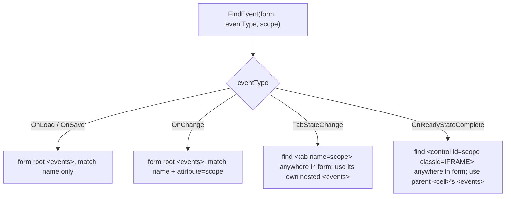

# Form Event Tab/IFRAME Events & Pipeline Rules - Plan

## Goal Capsule

- **Objective:** Close the FormXml-settable event gap (Tab `TabStateChange`, IFRAME `OnReadyStateComplete`), add bulk-edit-form opt-in for `onload`, and enforce the Form Event Pipeline's ordering and 50-handler-per-event rules.
- **Product authority:** This document.
- **Open blockers:** none.

---

## Product Contract

### Summary

Extend Flowline's form-event annotation system to cover the two remaining FormXml-settable events — Tab `TabStateChange` and IFRAME `OnReadyStateComplete` — scoped by control name the same way `onchange` is scoped by attribute. Add a `[bulkEdit]` annotation modifier so an `onload` handler can opt into running during Dataverse's bulk-edit form, and an `[order:N]` modifier for explicit cross-file handler sequencing. Enforce the Form Event Pipeline's ordering and 50-handler-per-event rules that today go unchecked — for all five event types, not just the two being added.

**Product Contract preservation:** changed. Live verification against a real Dataverse environment found the Tab/IFRAME FormXml scoping mechanism differs from the assumed shape (container-nesting, not an `attribute` token like `onchange`) — the Key Decisions and R3's default naming convention are corrected below. Product intent (scope, requirements, acceptance behavior) is unchanged.

| Element | Event | Scope token | Status |
|---|---|---|---|
| Form | OnLoad | none | Existing |
| Form | OnSave | none | Existing |
| Column | OnChange | attribute | Existing |
| Tab | TabStateChange | tab name | New (this plan) |
| IFRAME | OnReadyStateComplete | control name | New (this plan) |

### Problem Frame

FormXml can represent five events through the Maker Portal's Event Handlers UI; Flowline's annotation system currently covers three (`OnLoad`, `OnSave`, `OnChange`). Anyone wiring a Tab or IFRAME event handler today has to hand-edit FormXml or use the Maker Portal directly, outside Flowline's tracked-annotation model.

Separately, two rules from Microsoft's Form Event Pipeline docs go unenforced today: handler registration order is undefined (`FormXmlEventSerializer.SetHandlers` writes from a `HashSet`, not the order annotations were read), and Dataverse's 50-handler-per-event cap is never checked before a push. These gaps exist for the three events Flowline already supports, not just the two being added.

Order only matters when one event/scope carries more than one Flowline-managed handler — e.g. two `flowline:onload` annotations for the same form (whether split across two lines in one file or one line each in two different files), or two `flowline:onchange` annotations on the same attribute. Dataverse invokes handlers sequentially in the FormXml list order; a handler that depends on state an earlier one set — via `executionContext.getSharedVariable`/`setSharedVariable`, or a side effect like a default value the next handler reads — needs to run after it. Today that order is accidental (`HashSet` enumeration), not something a developer can rely on or control by how they arrange their annotations. A form with a single handler per event, the common case, has nothing to order.

### Key Decisions

- **Directive names mirror the event name, lowercased** (`tabstatechange`, `onreadystatecomplete`) — matches the existing `FormEventType.ToString().ToLowerInvariant()` derivation used by `onload`/`onsave`/`onchange`; no aliasing.
- **Tab and IFRAME events are scoped by a control-name token in the annotation**, positioned the same place `onchange`'s `<attribute>` token sits. The underlying FormXml mechanism is **container-nesting, not attribute-matching** (corrected from the original assumption, live-verified against the AutomateValue Dev environment — see Sources): `TabStateChange` lives inside the `<tab name="...">` element's own nested `<events>` collection; `OnReadyStateComplete` lives inside the `<cell>` that holds the `<control id="..." classid="{FD2A7985-3187-444E-908D-6624B21F69C0}">`, as an `<events>` sibling of that `<control>`. This differs from `onchange`, whose scope is an `attribute="..."` token on a sibling `<event>` element inside the form-level `<events>` collection.
- **`[bulkEdit]` is `onload`-only.** Dataverse only honors `BehaviorInBulkEditForm` on the form's `onload` event; the annotation parser accepts the modifier syntactically anywhere, but the push rejects it wherever it isn't `onload`.
- **Conflicting `[bulkEdit]` declarations resolve by OR.** If any `onload` annotation for a form specifies `[bulkEdit]`, the form's onload event is bulk-edit-enabled — consistent with how Flowline already unions handlers and libraries across annotation sources.
- **Handler order defaults to annotation-encounter order**, replacing today's arbitrary `HashSet`-derived order — sufficient on its own within a single file.
- **Cross-file ordering is explicit, not positional.** An optional `[order:N]` modifier lets a developer sequence handlers that share an event/scope regardless of which file declares them, mirroring the Maker Portal's own reorderable Event Handlers list rather than relying on file-system enumeration. Handlers without the modifier keep default encounter order and sort after every explicitly-ordered one.
- **Bracket modifiers (`[bulkEdit]`, `[order:N]`) are trailing tokens before the function name** — the same slot the existing optional `Function(params)` tail already occupies, e.g. `// flowline:onload account "Main" [bulkEdit][order:1] MyFunction(param)`. This is net-new grammar; no bracket-modifier syntax exists anywhere in the codebase today.
- **Exceeding 50 handlers on one event/scope hard-fails the push** via `FlowlineException`, before any Dataverse write — same validation-failure pattern as the existing function-not-found check.

### Requirements

**Tab & IFRAME events**

- R1. Flowline recognizes `flowline:tabstatechange` and `flowline:onreadystatecomplete` annotations, supporting the same `//`, `//!`, and `/*! */` comment forms as the existing directives.
- R2. Each directive requires a control-name token (tab name for `tabstatechange`, IFRAME control name for `onreadystatecomplete`) in the same position `onchange`'s attribute token occupies. Tab names match the exact FormXml `name` value case-insensitively. IFRAME control ids match case-insensitively and prefix-insensitively: Maker Portal always renders `IFRAME_` as a fixed, non-editable prefix in the control's Name field (confirmed live), so the annotation token may be written either with it (`IFRAME_myFrame`) or without it (`myFrame`, the form the maker actually typed) — both resolve to the same control.
- R3. The default function name follows the existing `on<X>...`-style convention (e.g. `on<TabName>TabStateChange`, `on<IframeName>ReadyStateComplete`); unlike `onchange`, no publisher-prefix stripping applies, since tab and IFRAME control names are maker-assigned form-design names, not Dataverse schema attribute names.
- R4. Orphan cleanup, unrecognized-handler detection, and foreign-handler pass-through apply to Tab and IFRAME events the same way they already apply to `onload`/`onsave`/`onchange` — including leaving any pre-existing sibling events untouched (e.g. an IFRAME control's Maker-Portal-generated empty `onload` stub).
- R5. Multiple tabs or IFRAME controls on one form register independently, one nested `<events>` collection per container.

**Bulk edit support**

Bulk edit form, for reference: a Dataverse feature where a user selects multiple rows in a grid/view and clicks **Edit** on the command bar, opening a scaled-down "Edit (N) records" form (timeline wall, quick view forms, and reference panels stripped out). A saved change applies to every selected record in one action; the feature requires the `prvBulkEdit` privilege. Event handlers — onload, onsave, onchange, business rules — don't fire by default in this mode, since a script written for one record's context could misbehave when applied simultaneously to N different underlying records. `BehaviorInBulkEditForm="Enabled"` is the per-event opt-in for a handler that's safe to run there anyway (e.g. one that only sets field visibility or defaults from values that don't vary by record). Source: [Edit multiple rows (Bulk edit)](https://learn.microsoft.com/power-apps/user/edit-rows).

`BehaviorInBulkEditForm` is scoped to the `<event name="onload">` element, not to an individual `<Handler>`. A form has exactly one such element regardless of how many `onload` handlers register against it (unlike `onchange`, which gets one `<event>` per attribute) — every handler from every file lands as a `<Handler>` child inside the same shared `<Handlers>` collection:

```xml
<event name="onload" application="true" active="true" BehaviorInBulkEditForm="Enabled">
  <Handlers>
    <Handler functionName="InitDefaults" .../>   <!-- from library A -->
    <Handler functionName="ValidateOnLoad" .../> <!-- from library B -->
  </Handlers>
</event>
```

One flag, whole event — which is exactly why two annotations can disagree: library A's `onload` handler may not need bulk-edit while library B's does, and there's only one `BehaviorInBulkEditForm` slot to write for the form. Confirmed against `src/Flowline.Core/Services/FormXmlEventSerializer.cs:151-159` (`FindEvent` matches `onload` by `name="onload"` alone, no per-handler split) and `FormXmlEventSerializer.cs:74-111` (`SetHandlers` writes every handler for an event into that one shared `<Handlers>` collection).

- R6. An `onload` annotation may carry an optional `[bulkEdit]` modifier that sets `BehaviorInBulkEditForm="Enabled"` on the form's `<event name="onload">` element.
- R7. A push fails with a clear error if `[bulkEdit]` appears on any directive other than `flowline:onload`.
- R8. When a form's `onload` annotations disagree on `[bulkEdit]` (some set it, some don't), the form's onload event is marked bulk-edit-enabled if at least one does; if none do (including after a previously-set one is removed), the attribute is cleared.

**Pipeline rules**

- R9. Handlers for the same (entity, form, event, scope) register in the order their annotations were encountered by default (file line order; current enumeration order across files) — the only behavior needed when a single handler targets that event/scope.
- R10. Any annotation may carry an optional `[order:N]` modifier. When 2+ annotations share an event/scope and at least one specifies `[order:N]`, explicitly-ordered handlers sequence by ascending `N` first; unordered handlers keep their default encounter order and are appended after.
- R11. Two annotations sharing the same event/scope with the same `[order:N]` value fail the push with a clear error naming the conflicting annotations.
- R12. A push fails with a `FlowlineException`, before touching Dataverse, if any single event/scope's final handler count — the full set that will be written, including foreign and unrecognized handlers passed through untouched — would exceed 50, not just the count of handlers Flowline itself is adding.

### Acceptance Examples

- AE1. Given an `onsave` annotation carrying `[bulkEdit]`, when pushed, then the push fails naming the offending annotation. **Covers R7.**
- AE2. Given two `onload` annotations for the same form in different files, one with `[bulkEdit]` and one without, when pushed, then the form's onload event has `BehaviorInBulkEditForm="Enabled"`. **Covers R8.**
- AE3. Given three `onload` annotations for the same form with no `[order:N]` modifiers, when pushed, then the resulting `<Handlers>` element lists them in the order their annotations were encountered. **Covers R9.**
- AE4. Given two `onload` annotations for the same form in different files, tagged `[order:2]` and `[order:1]` respectively, when pushed, then the `[order:1]` handler is listed first regardless of file. **Covers R10.**
- AE5. Given two `onload` annotations for the same form both tagged `[order:1]`, when pushed, then the push fails naming both conflicting annotations. **Covers R11.**
- AE6. Given a form's `onchange` event for one attribute already has 49 Flowline-managed handlers and a new annotation would add a 50th, when pushed, then it succeeds; a 51st fails before any Dataverse write. **Covers R12.**
- AE7. Given an IFRAME control's `<events>` collection already contains a Maker-Portal-generated empty `onload` stub (`<event name="onload" application="false" active="false" />`, no `<Handlers>`), when an `onreadystatecomplete` annotation is pushed for that same control, then the stub is left untouched. **Covers R4.**

### Scope Boundaries

- Grid/subgrid events, lookup/kbsearch events, process events, control `OnOutputChange`, form `Loaded`, and form-data `OnLoad` stay out of scope — none are FormXml-settable; supporting them needs JS-side `add*` wiring, a different mechanism than annotation-driven FormXml writes.
- `BehaviorInBulkEditForm` support is limited to `OnLoad` — Dataverse doesn't honor it on any other event today.
- Rename resilience for tabs and IFRAME controls (mirroring the form-level self-tag/rename-cache/sole-survivor advisor in `FormEventRenameAdvisor`) is deferred — a renamed tab or IFRAME control behaves like today's plain not-found case, no advisory suggestion. That advisor's logic is built around whole-form identity, not sub-elements within a form's FormXml, so extending it is a separate, larger piece of work to scope later if it proves necessary.

### Sources / Research

- Microsoft Learn — [Events in forms and grids in model-driven apps](https://learn.microsoft.com/power-apps/developer/model-driven-apps/clientapi/events-forms-grids): bulk-edit-form behavior, Form Event Pipeline (order, 50-handler cap), code-only vs. FormXml-settable event table.
- Microsoft Learn — [Configure model-driven app form event handlers](https://learn.microsoft.com/power-apps/maker/model-driven-apps/configure-event-handlers-legacy): the definitive FormXml/UI-settable event list (Form OnLoad/OnSave, Tab TabStateChange, Column OnChange, IFRAME OnReadyStateComplete).
- Microsoft Learn — [Edit multiple rows (Bulk edit)](https://learn.microsoft.com/power-apps/user/edit-rows): how bulk edit forms work end-to-end (grid selection, the scaled-down record dialog, the `prvBulkEdit` privilege).
- **Live verification (AutomateValue Dev, `pac env fetch`)** — resolves the original Outstanding Question. A FetchXML query against live `systemform` records found 12 forms with a real `tabstatechange` handler (Microsoft's own Omnichannel package), each nested as `<tab name="...">...<events><event name="tabstatechange" application="false" active="false"><Handlers>...` — confirming Tab events are container-nested, not attribute-scoped. A test `onreadystatecomplete` handler added to the Account form's IFRAME control (`id="IFRAME_new_myiFrame" classid="{FD2A7985-3187-444E-908D-6624B21F69C0}"`) confirmed the analogous shape for IFRAME: `<events>` as a sibling of `<control>` inside the same `<cell>`, alongside a Maker-Portal-auto-generated empty `<event name="onload" application="false" active="false" />` stub that must survive untouched.
- `src/Flowline.Core/Models/FormEventModels.cs:6-11` — current `FormEventType` enum (`OnLoad`, `OnSave`, `OnChange` only).
- `src/Flowline.Core/Models/FormEventModels.cs:13-14` — `FormEventAnnotation` record; `Attribute` is the existing scope-token field this plan reuses for tab-name/control-id.
- `src/Flowline.Core/Models/FormEventModels.cs:51-69` — `FormEventDeterministicId.ForHandler`, whose optional `attribute` parameter is injected between event name and function name in the hash key; the same dimension this plan reuses for Tab/IFRAME scope.
- `src/Flowline.Core/Services/FormXmlEventSerializer.cs:151-159` — `FindEvent` matches `onload`/`onsave` by `name` alone and `onchange` by `name`+`attribute`; the lookup this plan extends with a container-nested path for Tab/IFRAME.
- `src/Flowline.Core/Services/FormXmlEventSerializer.cs:74-111` — `SetHandlers`, including its current `HashSet`-order iteration (no ordering guarantee) this plan replaces with an ordered list.
- `src/Flowline.Core/Services/FormEventPlanner.cs:48-61` — the explicit `planningKeys` list (not `Enum.GetValues`) this plan's Tab/IFRAME scope enumeration extends, mirroring the existing `onChangeAttributes` union pattern.
- `src/Flowline.Core/Services/FormEventPlanner.cs:240-245` — the accumulate-errors-then-throw `FlowlineException` pattern this plan's bulkEdit/order/50-cap validation reuses.
- `src/Flowline.Core/Services/FormEventAnnotationParser.cs:18-37` — existing annotation grammar (`OnLoadSaveAnnotationRegex`, `OnChangeAnnotationRegex`, `AnnotationIntentRegex`) this plan's new directives and bracket-modifier grammar extend. No existing bracket-modifier precedent exists anywhere in this codebase.
- `src/Flowline.Core/Services/FormEventRenameAdvisor.cs` — confirmed whole-form-identity scoped (not sub-element scoped), consistent with this plan's Scope Boundaries; already threads an optional `attribute` value through to `ForHandler`, so Tab/IFRAME's scope token needs no new advisor code path.
- `docs/plans/2026-07-14-001-feat-form-event-onchange-annotation-plan.md` — prior plan that added `onchange`'s attribute scoping; structural precedent for this plan's units (one unit per file + its test file, KTDs naming exact file/line anchors).
- `06-WebResources-Project.md:203-249` (sibling repo `Flowline.wiki`; this content later moved to `05-Push-WebResources.md` when the wiki was reorganized) — the wiki page documenting the annotation grammar end-to-end; needs updating alongside this work (see Documentation Notes below).

---

## Planning Contract

### Key Technical Decisions

- KTD1. **Container-scoped event lookup, extend by switch, not by resolver abstraction.** `FindEvent`/`GetHandlers`/`SetHandlers` gain a branch on `FormEventType`, mirroring the existing `attribute is null ? ... : ...` shape rather than introducing a delegate/strategy resolver: `OnLoad`/`OnSave`/`OnChange` keep the current form-root `<events>` lookup (`OnChange` still discriminated by the `attribute` XML attribute); `TabStateChange` locates the `<tab name="{scope}">` element anywhere in the form tree and manages its own nested `<events>` child; `OnReadyStateComplete` locates the `<control id="{scope}" classid="{FD2A7985-3187-444E-908D-6624B21F69C0}">` element anywhere in the tree and manages the `<events>` sibling within that control's parent `<cell>`. New-node defaults for both new event types: `application="false" active="false"` (matches `onchange`, not `onload`/`onsave`'s `true`/`true`). Rationale: extending one method with a discriminated branch matches the existing code shape; a resolver abstraction would be premature generalization for two more cases.
- KTD2. **Handler write order becomes list-based, not set-based, for every event type — and stays ordered all the way to the write.** `FormEventFormPlan.DesiredHandlers` (and the `SetHandlers`/`GetHandlers` parameter it feeds) changes from `IReadOnlySet<FormEventHandler>` to an ordered `IReadOnlyList<FormEventHandler>`. The planner computes the order once per (event, scope) key, resolving each annotation to its handler *before* deduplicating by identity, so `Order`/encounter-position survive to the sort step: explicitly `[order:N]`-tagged handlers sort ascending by `N` first, then unordered handlers keep their annotation-encounter order and append after (R9/R10). Two annotations that resolve to the same handler identity (`FunctionName`+`LibraryName`) but disagree on `Order` are not a new conflict class this plan introduces validation for — keep today's existing behavior of resolving to whichever annotation was encountered first, same as the current identity-based dedup. This is the pipeline-ordering mechanism for all five event types, not just Tab/IFRAME — the ordering gap exists for `onload`/`onsave`/`onchange` today too (Problem Frame). The order must also survive `FormEventExecutor`'s write path: it currently converts `DesiredHandlers` to a `HashSet` twice (`FormEventExecutor.cs:399,403`) immediately before calling `SetHandlers` — those conversions need an order-preserving de-duplication instead, or the planner's computed order is silently discarded one layer downstream from where U3/U4 establish it.
- KTD3. **Bracket-modifier grammar is parsed permissively, validated at plan time.** `[bulkEdit]` and `[order:N]` are captured as trailing bracket tokens by the annotation regex, positioned before the function name (confirmed placement — the same slot the existing `(params)` tail already occupies), for any directive that syntactically carries them. Semantic validation — `[bulkEdit]` only legal on `onload` (R7), duplicate `[order:N]` on a shared event/scope (R11) — happens in the planner alongside the existing function-not-found check, using the same accumulate-errors-then-throw `FlowlineException` pattern. Rationale: mirrors the existing parser/planner split, where the parser enforces syntax only and the planner enforces cross-annotation semantics.
- KTD4. **`[bulkEdit]` union recomputes from scratch on every push.** The planner computes one boolean per (entity, form) onload plan: enabled if any onload annotation for that form specifies `[bulkEdit]`, cleared otherwise (R8) — including the "previously set, now removed" case, since the union is derived fresh from current annotations each push rather than merged with the prior FormXml state. The serializer writes or clears `BehaviorInBulkEditForm="Enabled"` on the onload `<event>` element it already locates — no new lookup path, just an attribute write gated by the planner's computed boolean.
- KTD5. **50-handler cap validated per (event, scope) key, before any write.** Same granularity as the planner's existing per-key handler resolution (R12). The counted total includes foreign/unrecognized handlers already destined for that event/scope, not just the handlers Flowline itself is adding. Reuses KTD3's accumulate-then-throw pattern.
- KTD6. **Rename advisor's matching logic requires no structural change; its suggestion-text rendering needs a one-line fix.** `FormEventRenameAdvisor`'s self-tag/cache/sole-survivor *matching* signals already operate on whole-form identity and already thread an optional `attribute` value through `FormEventDeterministicId.ForHandler` — Tab/IFRAME's scope token (tab name / control id) reuses that same parameter, so matching needs no new code path. `BuildSuggestedAnnotation` (`FormEventRenameAdvisor.cs:120-126`), however, only includes the scope token in its rendered suggestion text when `resolved.Annotation.Event == FormEventType.OnChange` — a Tab/IFRAME-scoped annotation's rename suggestion would render without its mandatory scope token, producing text that wouldn't parse back through the new regex (R2). This ternary needs widening to cover `OnChange`, `TabStateChange`, and `OnReadyStateComplete` alike. The identical ternary appears in `FormEventPlanner.BuildProposedAnnotation` (`FormEventPlanner.cs:263`, used for R4's unrecognized-handler proposals) and needs the same widening — see U4.
- KTD7. **Live-verified FormXml shapes for Tab/IFRAME resolve the original Outstanding Question.** See Sources for the exact live-fetch evidence; this KTD exists to flag that the Product Contract's Key Decisions were corrected as a direct result.
- KTD8. **Order-changed detection is a separate planner-level check, not a `FormEventHandlerDiffer` redefinition.** The existing "did anything change" gate (`FormEventPlanner.cs:203-205`, delegating to `FormEventHandlerDiffer.Diff`) only detects added/updated/removed handlers by identity and parameter state — a pure reordering with no membership or parameter change diffs to `(0,0,0)`, so the plan entry is skipped entirely (`FormEventPlanner.cs:204-205`) and the corrected order never reaches `SetHandlers`. The fix adds an independent order-changed check alongside the existing diff — a plan entry emits when either the handler set changed (today's `FormEventHandlerDiffer.Diff` check) or the computed order differs from the current live order (which becomes read in FormXml document order once U3's `GetHandlers` change lands) — rather than folding position into `FormEventHandlerDiffer`'s "updated" meaning. This keeps `FormEventHandlerDiffer` scoped to its existing single responsibility (content-equality, shared with the executor's dry-run change report) instead of conflating a parameter change with a pure reorder in that report.

### High-Level Technical Design

The container-lookup dispatch (KTD1) is a 4-way branching gate worth sketching directly, since prose alone under-communicates which container each event type resolves against:



### Assumptions

- Handler order is fully recomputed from annotations on every push (not merged with whatever order the prior FormXml happened to have) — consistent with `SetHandlers` already wholesale-replacing a `<Handlers>` collection's contents on every write.
- `[order:N]` accepts any non-negative integer with no explicit upper bound beyond the 50-handler cap itself constraining practical range.

### Documentation Notes

`06-WebResources-Project.md:203-249` in the sibling `Flowline.wiki` repo documented the annotation grammar end-to-end (directive list, comment forms, examples) at the time this plan was written; that content now lives in `05-Push-WebResources.md`'s "Form event registration" section. Update it alongside this work to add `flowline:tabstatechange`/`flowline:onreadystatecomplete` to the directive list and examples, and document the `[bulkEdit]`/`[order:N]` bracket-modifier grammar with an example of both together. This lives outside this repo's build/test loop.

---

## Implementation Units

### U1. Model layer — new event types, annotation modifiers, ordered handler plan

- **Goal:** Extend the form-event data model to represent the two new event types and the two new annotation modifiers, and switch the handler collection from set to ordered list.
- **Requirements:** R1, R6, R9, R10
- **Dependencies:** none
- **Files:** `src/Flowline.Core/Models/FormEventModels.cs`, `tests/Flowline.Core.Tests/FormEventModelsTests.cs`
- **Approach:** Add `TabStateChange` and `OnReadyStateComplete` to `FormEventType` (`FormEventModels.cs:6-11`). Add `bool BulkEdit = false` and `int? Order = null` to `FormEventAnnotation` (`FormEventModels.cs:13-14`), after the existing `Attribute` field. Change `FormEventFormPlan.DesiredHandlers` from `IReadOnlySet<FormEventHandler>` to `IReadOnlyList<FormEventHandler>`, and add a `bool BulkEditEnabled` field for onload plans. `FormEventDeterministicId.ForHandler`'s existing optional `attribute` parameter needs no signature change — it's reused as-is for the tab-name/control-id dimension.
- **Patterns to follow:** The prior `onchange` plan's model unit (`docs/plans/2026-07-14-001-feat-form-event-onchange-annotation-plan.md`, KTD1) added `Attribute` the same way — a new optional field on the existing record, not a new subtype.
- **Test scenarios:**
  - `FormEventType` enum contains `TabStateChange` and `OnReadyStateComplete` alongside the existing three members.
  - A `FormEventAnnotation` with `BulkEdit=true, Order=5` round-trips through construction/deconstruction correctly; default-constructed annotations have `BulkEdit=false, Order=null`.
  - `FormEventFormPlan.DesiredHandlers` accepts and preserves list order — constructing it from an already-ordered sequence does not silently re-sort or de-duplicate by insertion order.
  - `FormEventDeterministicId.ForHandler` produces distinct hashes for the same scope-token string used as a tab name vs. an IFRAME control id vs. an `onchange` attribute (same entity/form/functionName/library, different `FormEventType`) — proves no accidental ID collision now that three of five event types share the `attribute` hash dimension.
- **Verification:** `FormEventModelsTests` (and any deterministic-ID test file) pass; the model compiles with the new enum members and fields referenced nowhere else yet.

### U2. Annotation parser — new directives and bracket-modifier grammar

- **Goal:** Recognize `flowline:tabstatechange`/`flowline:onreadystatecomplete` annotations and the `[bulkEdit]`/`[order:N]` bracket-modifier tail on any directive.
- **Requirements:** R1, R2, R3, R6, R10
- **Dependencies:** U1
- **Files:** `src/Flowline.Core/Services/FormEventAnnotationParser.cs`, `tests/Flowline.Core.Tests/FormEventAnnotationParserTests.cs`
- **Approach:** Add `TabStateChangeAnnotationRegex` and `OnReadyStateCompleteAnnotationRegex`, mirroring `OnChangeAnnotationRegex`'s shape (`FormEventAnnotationParser.cs:29-31`) — entity, form, mandatory scope token, optional function/params tail. Extend `AnnotationIntentRegex` (`FormEventAnnotationParser.cs:35-37`) to also recognize the two new directive names, so a malformed line still surfaces as a malformed annotation rather than being silently ignored. Add a shared optional bracket-modifier capture group ahead of the existing function-name group, following the same "optional trailing group" pattern the `(?:\(...\))?` params tail already uses — parsed permissively (any directive can syntactically carry either modifier); semantic rejection is a planner concern (KTD3).
- **Patterns to follow:** `OnChangeAnnotationRegex`'s deliberately narrowed bare-token form fallback (`FormEventAnnotationParser.cs:22-28`) — the same technique (a narrower fallback pattern than the onload/onsave regex) prevents backtracking from misparsing a malformed mandatory-token line.
- **Test scenarios:**
  - `// flowline:tabstatechange account "Main" Summary` parses to `Entity=account, Form=Main, Event=TabStateChange, Attribute=Summary, FunctionName=null`.
  - `// flowline:onreadystatecomplete account "Main" IFRAME_myFrame onMyFrameReady(param)` parses with explicit function and params.
  - `//!` and `/*! ... */` comment forms are recognized for both new directives.
  - `[bulkEdit][order:1]` and `[order:1][bulkEdit]` both parse identically regardless of modifier order, on a directive where they're syntactically permitted.
  - A malformed bracket token (`[order:abc]`, an unclosed `[bulkEdit`) is flagged via the existing `MalformedLines` path, not silently dropped.
  - A `tabstatechange`/`onreadystatecomplete` line missing its mandatory scope token fails the strict regex and falls through to malformed-line detection (mirrors `onchange`'s existing missing-attribute precedent).
  - `AnnotationIntentRegex` correctly flags a syntactically-broken `flowline:tabstatechange`/`flowline:onreadystatecomplete` line as "intends to be an annotation" rather than ignoring it.
- **Verification:** `FormEventAnnotationParserTests` passes, including new fixtures for both directives and every bracket-modifier combination listed above.

### U3. Serializer — container-scoped lookup, ordered writes, bulk-edit toggle

- **Goal:** Teach `FormXmlEventSerializer` to read/write Tab- and IFRAME-scoped events at their real container locations, write handlers in the planner-supplied order, and toggle `BehaviorInBulkEditForm`.
- **Requirements:** R2, R4, R5, R6, R9, R10
- **Dependencies:** U1
- **Files:** `src/Flowline.Core/Services/FormXmlEventSerializer.cs`, `tests/Flowline.Core.Tests/FormXmlEventSerializerTests.cs`
- **Approach:** Implement KTD1's branch in `FindEvent` (`FormXmlEventSerializer.cs:151-159`): for `TabStateChange`, search `form.Root` recursively for a `<tab>` element whose `name` attribute matches `scope` case-insensitively, then look inside *that* element's own `<events>` child (creating it if absent) rather than the form-root `<events>`; for `OnReadyStateComplete`, search recursively for a `<control>` element whose `id` matches `scope` case-insensitively and whose `classid` is the IFRAME classid, then use the `<events>` sibling within that control's parent `<cell>` (creating it if absent). New `<event>` nodes for both get `application="false" active="false"` defaults, matching `onchange`. Update `SetHandlers`/`GetHandlers` to accept and preserve `IReadOnlyList<FormEventHandler>` order instead of iterating a `HashSet` (KTD2) — this changes the write loop for every event type, not just the two new ones. Add `BehaviorInBulkEditForm` set/clear on the onload `<event>` element, gated by a new boolean parameter (KTD4). Add tab-name/IFRAME-control-id enumeration helpers mirroring `GetOnChangeAttributes` (`FormXmlEventSerializer.cs:38-51`) for the planner's orphan-scope enumeration.
- **Patterns to follow:** `GetOnChangeAttributes`'s `StringComparer.OrdinalIgnoreCase` HashSet construction; the existing `TwoOnChangeAttributesFormXml`-style test fixture (`FormXmlEventSerializerTests.cs:308-324`) for proving sibling-scope isolation.
- **Test scenarios:**
  - `SetHandlers` for `TabStateChange` + scope `"Summary"` creates a new `<tab name="Summary">`'s nested `<events><event name="tabstatechange" application="false" active="false">` when none exists.
  - `SetHandlers` for `OnReadyStateComplete` + scope `"IFRAME_myFrame"` creates the `<cell>`'s sibling `<events><event name="onreadystatecomplete" .../>` next to the matching `<control id="IFRAME_myFrame" classid="{FD2A7985-3187-444E-908D-6624B21F69C0}">`.
  - `GetHandlers`/`SetHandlers` preserve the exact write order of a planner-supplied ordered list — no internal re-sorting.
  - A cell with a pre-existing empty `<event name="onload" application="false" active="false" />` stub is left untouched when writing `onreadystatecomplete` Handlers for the same cell. **Covers AE7 / R4.**
  - Two tabs sharing an identical handler function name but different tab-name scopes get independent nested `<events>` blocks, each isolated from the other. **Covers R5.**
  - The tab-name / IFRAME-control-id enumeration helpers return the correct set for orphan-cleanup scope enumeration when a previously-registered tab/control no longer has a matching annotation.
  - Read→write→read idempotency: writing the same desired handler list twice produces byte-identical FormXml for both the Tab and IFRAME container paths.
  - Setting `BehaviorInBulkEditForm="Enabled"` then clearing it on a subsequent plan removes the attribute entirely, rather than leaving `"Disabled"` or an empty string.
- **Verification:** `FormXmlEventSerializerTests` passes, including the new container-nesting, ordering, and bulk-edit-toggle fixtures.

### U4. Planner — scope enumeration, ordering, and validation

- **Goal:** Enumerate Tab/IFRAME (event, scope) keys, compute handler order and the bulk-edit union, validate `[bulkEdit]` placement/duplicate `[order:N]`/the 50-handler cap, and carry that order through the write path.
- **Requirements:** R5, R7, R8, R9, R10, R11, R12
- **Dependencies:** U1, U2, U3
- **Files:** `src/Flowline.Core/Services/FormEventPlanner.cs`, `tests/Flowline.Core.Tests/FormEventPlannerTests.cs`, `src/Flowline.Core/Services/FormEventExecutor.cs`, `tests/Flowline.Core.Tests/FormEventExecutorTests.cs`
- **Approach:** Extend the `planningKeys` list (`FormEventPlanner.cs:48-61`) with Tab/IFRAME keys, built the same way `onChangeAttributes` is: the union of scopes with a live container-scoped event and scopes referenced by a current annotation. Resolve each annotation to its handler before deduplicating by identity, so `Order`/encounter-position survive to the sort step; within each (event, scope) key's handler resolution, sort by ascending `Order` first (nulls last), then by encounter order among the unordered remainder (KTD2). Compute the per-form onload `BulkEditEnabled` boolean as an OR across that form's onload annotations (KTD4). Widen `BuildProposedAnnotation`'s directive-specific scope-token ternary (`FormEventPlanner.cs:263`) from `OnChange`-only to also cover `TabStateChange`/`OnReadyStateComplete` (KTD6) — otherwise an unrecognized-handler proposal (R4) for a Tab/IFRAME annotation renders without its mandatory scope token. Add the order-changed check from KTD8 alongside the existing `handlersChanged` gate (`FormEventPlanner.cs:203-205`) so a pure reorder still emits a plan entry. Add validation, using the existing accumulate-then-throw `FlowlineException` pattern (`FormEventPlanner.cs:240-245`): `[bulkEdit]` on a non-onload annotation is an error naming the annotation (R7); two annotations sharing an event/scope with the same `Order` value is an error naming both (R11); a final per-(event, scope) handler count — Flowline-managed plus foreign/unrecognized — exceeding 50 is an error naming the event/scope and count (R12). In `FormEventExecutor.cs`, replace the two `.ToHashSet()` conversions of `formPlan.DesiredHandlers` (`FormEventExecutor.cs:399,403`) with an order-preserving de-duplication so the planner's computed order reaches `SetHandlers` (`FormEventExecutor.cs:409`) instead of being discarded one layer downstream of KTD2.
- **Patterns to follow:** The existing function-not-found error message shape (`FormEventPlanner.cs:86`: `"{resolved.SourceFile}: function '{requestedFunctionName}' not found..."`) for the new error messages' `{sourceFile}: {description}` prefix convention.
- **Test scenarios:**
  - `planningKeys` includes a `(TabStateChange, "Summary")` and an `(OnReadyStateComplete, "IFRAME_myFrame")` entry when annotations or live FormXml reference them. **Covers R5.**
  - Three `onload` annotations with no `[order:N]` resolve in encounter order. **Covers AE3 / R9.**
  - Two `onload` annotations tagged `[order:2]`/`[order:1]` in different files resolve with `[order:1]` first regardless of file. **Covers AE4 / R10.**
  - Mixed ordered + unordered annotations on the same event/scope: ordered ones sort first by `N`, unordered ones keep encounter order and append after.
  - A push that changes only the `[order:N]` values on already-registered, otherwise-identical handlers still emits a plan entry and writes the corrected order — proving the order-changed check (KTD8) fires when `FormEventHandlerDiffer.Diff` alone would report `(0,0,0)`.
  - `[bulkEdit]` present on some but not all `onload` annotations for a form resolves to bulk-edit-enabled; removing the last `[bulkEdit]` annotation on a subsequent push clears it. **Covers AE2 / R8.**
  - `[bulkEdit]` on an `onsave`/`onchange`/`tabstatechange`/`onreadystatecomplete` annotation fails the push naming the offending annotation. **Covers AE1 / R7.**
  - Two annotations sharing an event/scope both tagged `[order:1]` fail the push naming both conflicting annotations. **Covers AE5 / R11.**
  - A 49-handler event/scope plus one new annotation succeeds (50 total); a 51st fails before any Dataverse write. **Covers AE6 / R12.**
  - The 50-cap count includes foreign/unrecognized handlers already destined for that event/scope, not just Flowline-managed ones. **Covers R12.**
  - An unrecognized-handler proposal (R4) for a Tab/IFRAME-scoped handler includes its scope token in the proposed annotation text.
  - `FormEventExecutor`'s write path preserves the planner's computed handler order end to end — no reordering introduced by the de-duplication step before `SetHandlers`.
- **Verification:** `FormEventPlannerTests` and `FormEventExecutorTests` pass, including new fixtures for ordering, the order-changed gate, bulk-edit union, proposed-annotation scope tokens, and all three validation-failure cases.

### U5. Rename advisor — scope-token pass-through regression coverage

- **Goal:** Confirm `FormEventRenameAdvisor`'s matching signals still work correctly when sharing annotations carry a Tab/IFRAME scope token, and fix its suggestion-text rendering to include that scope token.
- **Requirements:** none directly (regression coverage for the Scope Boundaries deferral, plus the KTD6 rendering fix)
- **Dependencies:** U1, U3
- **Files:** `src/Flowline.Core/Services/FormEventRenameAdvisor.cs`, `tests/Flowline.Core.Tests/FormEventRenameAdvisorTests.cs`
- **Approach:** The self-tag/cache/sole-survivor *matching* logic needs no change — `FindSelfTagMatch` already threads its `attribute` parameter into `FormEventDeterministicId.ForHandler` and `FormXmlEventSerializer.GetHandlers`. `BuildSuggestedAnnotation` (`FormEventRenameAdvisor.cs:120-126`) does need a fix (KTD6): its scope-token ternary only fires for `FormEventType.OnChange` today, so a rename suggestion for a Tab/IFRAME-scoped annotation would render without its mandatory scope token — widen the ternary to also cover `TabStateChange`/`OnReadyStateComplete`. Add test fixtures proving the self-tag, rename-cache, and sole-survivor signals behave identically when the sharing annotations include a `TabStateChange`/`OnReadyStateComplete` entry (scope = tab name / control id) alongside `onload`/`onchange`. This unit does not depend on U4 — its code surface (`FindSelfTagMatch`, `BuildSuggestedAnnotation`) never calls into `FormEventPlanner`'s bulkEdit/order/50-cap validation.
- **Patterns to follow:** The existing self-tag test fixtures in `FormEventRenameAdvisorTests.cs`, extended with a Tab/IFRAME-scoped annotation in the sharing set.
- **Test scenarios:**
  - Self-tag match still resolves correctly for an entity whose sharing annotations include a Tab/IFRAME-scoped one.
  - Sole-survivor and rename-cache signals are unaffected by the presence of Tab/IFRAME-scoped annotations sharing the entity — both operate at whole-form granularity, per Scope Boundaries.
  - A rename suggestion for a `TabStateChange`/`OnReadyStateComplete`-scoped annotation includes its scope token in the suggested annotation text, mirroring `onchange`'s existing behavior.
  - Test expectation: no new advisory signal is added for Tab/IFRAME sub-element renames beyond the above; this is confirmed by the absence of a failing case in the above fixtures.
- **Verification:** `FormEventRenameAdvisorTests` passes with the new fixtures, including the widened-ternary suggestion-text case.

---

## Verification Contract

| Command | Applicability | Done signal |
|---|---|---|
| `dotnet build Flowline.slnx` | All units | Clean build, no warnings introduced |
| `dotnet test tests/Flowline.Core.Tests` | U1-U5 | All new and existing tests pass |
| `dotnet test tests/Flowline.Tests` | Cross-cut regression check | No regressions in dependent projects |
| Manual live push round-trip (AutomateValue Dev or equivalent test environment) | U3, U4 | Pushed FormXml is accepted by Dataverse; a second push produces no diff (idempotency) for both a Tab and an IFRAME scope |

---

## Definition of Done

- All U1-U5 test scenarios pass, including the container-nesting, ordering, bulk-edit, and validation-failure fixtures.
- `dotnet build Flowline.slnx` is clean; `dotnet test tests/Flowline.Core.Tests` and `tests/Flowline.Tests` pass with no regressions to existing `onload`/`onsave`/`onchange` behavior.
- A live manual push round-trip against a real Dataverse test environment succeeds for both a Tab-scoped and an IFRAME-scoped annotation, and a repeat push is idempotent.
- The wiki page `05-Push-WebResources.md` (formerly `06-WebResources-Project.md`) is updated with the two new directives and the bracket-modifier grammar (see Documentation Notes).
- No dead-end or experimental code remains from exploring the container-lookup design (e.g. an abandoned resolver-abstraction attempt) — only the switch-based implementation from KTD1 ships.
