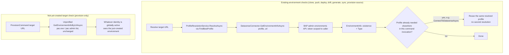

# Environment Existence/Type Check Independent of Active PAC Profile - Plan

## Goal Capsule

- **Objective:** remove `pac admin list`'s active-PAC-profile dependency from Flowline's environment existence/Type checks, so `clone`, `push`, `deploy`, `drift`, and `generate` resolve environments correctly regardless of which PAC auth profile is globally active.
- **Authority hierarchy:** This plan's Requirements (R1-R6) and Key Technical Decisions govern the approach — resolved in the ce-brainstorm dialogue and grounded in live empirical verification against real Dataverse and Power Platform APIs.
- **Stop conditions:** None — technical feasibility confirmed live. Service-principal BAP token acquisition is unverified (see Open Questions) but is not launch-blocking: it reuses the existing client-credentials cache pattern and surfaces its own auth error if unsupported, rather than gating the rest of the fix.
- **Execution profile:** Local implementation and testing. The live BAP token round-trip itself needs manual verification against a real multi-profile PAC CLI setup (network/token-dependent, same constraint as the existing `Skip`-marked `ConnectViaPacAsync` tests).
- **Tail ownership:** Implementer commits locally. No push, no PR unless separately requested.

---

## Product Contract

Product Contract: two corrections applied during planning/doc-review, both verified against the codebase — R3 now names the commands that actually carry the Type guard (`deploy` excluded, `sync` added; see KTD9), and AE1's coverage tag drops R4 (`clone` never calls `ConnectToDataverseAsync`, so it can't demonstrate profile-sharing; see KTD5/U4). No other Product Contract text changed.

### Summary

Flowline's environment existence and Production/Sandbox Type check moves off `pac admin list` — which is scoped to whichever PAC auth profile happens to be globally active — onto per-command profile resolution. It resolves the target profile the same way the connect step already does (`FindBestProfile`, URL-matched against local PAC auth profiles), then retrieves existence and Type via a direct token read against that resolved profile's cached credentials, with no `pac.exe` subprocess involved.

### Requirements

**Profile & existence resolution**
- R1. Environment existence and Type checks resolve the target profile via the same URL-matching logic the connect step already uses (`FindBestProfile`), instead of requiring a specific PAC auth profile to be globally active.
- R2. Existence and Type data are retrieved via a direct token acquisition against the resolved profile's cached PAC CLI credentials — no `pac.exe` subprocess, no dependency on which profile is globally active — mirroring the existing Dataverse connection mechanism.
- R4. Profile resolution for the existence/Type check and for the subsequent Dataverse connect share a single resolved profile per command invocation, rather than resolving independently.

**Type/Production guard**
- R3. The Production/Sandbox Type guard (`role == Prod ⇔ Type == Production`) continues to gate `clone`, `sync`, `push`, `generate`, and any other role-aware command that has this guard today, exactly as today, sourced from the new resolution mechanism instead of `pac admin list`. `deploy` has no Type guard today and this plan does not add one (see KTD9).
- R6. Ambiguous-profile and no-matching-profile outcomes (multiple local profiles matching a URL, or none) continue to use the existing `ProfileResolutionService` behavior (active-for-kind tiebreak, then prompt/error) — unchanged by this fix.

**Command coverage**
- R5. This fix applies uniformly to every command that currently performs an existence/Type check via the shared helper: `clone`, `push`, `deploy`, `drift`, `generate`.

### Key Decisions

- **Existence/Type check moves off `pac.exe` entirely, onto direct MSAL-cache token reads.** Confirmed live that `pac.exe` has no way to scope a single invocation to a non-active profile — `pac solution list --environment <url>` uses the globally active identity regardless of the URL given, returning `403 Forbidden` when that identity doesn't belong to the target tenant. Any fix routed through `pac.exe` inherits the same active-profile coupling this work removes. A direct token read is the only mechanism confirmed profile-agnostic, and it's already proven safe in production for the Dataverse connection itself.
- **Production/Sandbox Type is sourced from the Power Platform BAP admin API (`api.bap.microsoft.com`), not the Dataverse organization service.** Confirmed live: the Dataverse `organization` table, `pac org who`, and `pac env list` all lack a genuine Production/Sandbox field (`pac env list`'s `EnvironmentIdentifier.Type` is a different, unrelated classification). Only the BAP admin-scoped environments API carries `environmentSku` (Production/Sandbox/Developer/Teams/Default) — the same source `pac admin list` already uses internally, called directly instead of through a `pac.exe` subprocess bound to the active profile.
- **No new permission requirement.** The BAP admin API access needed is the same access `pac admin list` already required. A user able to push or deploy solutions to an environment already has this level of access to that specific environment — Microsoft's documented inclusion rules state a Dataverse System Administrator role in an environment qualifies for that environment to appear in this API's results.

### Scope Boundaries

- No change to how `.flowline` selects Prod/Dev/UAT/Test URLs — still project config, untouched by this fix.
- No change to `ProfileResolutionService`'s ambiguous-match or no-match handling — reused as-is.
- Standalone-mode active-profile defaulting (push/generate without `.flowline`) is a separate, already-scoped plan (`docs/plans/2026-07-17-001-feat-standalone-active-profile-default-plan.md`), not part of this fix.

### Dependencies / Assumptions

- Assumes the resolved profile's cached PAC CLI token can silently acquire a BAP-scoped token via `AcquireTokenSilent` with no new interactive consent — confirmed live for a `UNIVERSAL`/user-kind profile. Behavior for service-principal profiles (`IsServicePrincipal`) is unverified; confirm live during planning before relying on it, since service-principal profiles use a different token acquisition path (`AcquireTokenForClient`) than user profiles.

### Acceptance Examples

- AE1. Clone targeting Prod, an unambiguous profile exists for the Prod URL, and a different, unrelated profile is globally active.
  - **Given:** `.flowline`'s `ProdUrl` matches exactly one local PAC auth profile; a different tenant's profile is globally active.
  - **When:** `flowline clone <solution>` runs.
  - **Then:** existence and Type resolve correctly via the matched profile; the command proceeds without requiring `pac auth select`.
  - **Covers:** R1, R2.
- AE2. Push targeting the Dev role, but the resolved environment's Type is Production.
  - **Given:** `.flowline`'s `DevUrl` accidentally points at a Production-type environment.
  - **When:** `flowline push` runs.
  - **Then:** the command refuses with the existing Type-guard error, sourced from the BAP-derived Type instead of `pac admin list`.
  - **Covers:** R3.
- AE3. Multiple local profiles match the same URL.
  - **Given:** two PAC auth profiles both point at the same environment URL.
  - **When:** any covered command runs.
  - **Then:** existing ambiguous-profile behavior fires unchanged (active-for-kind tiebreak, else prompt or error).
  - **Covers:** R6.

### Sources / Research

- `pac solution list --environment <url>` uses the globally active identity regardless of the URL argument — verified live (returned `403 Forbidden` when the active profile's tenant didn't match the URL's tenant).
- Dataverse `organization` table has no Production/Sandbox field — verified live via `pac env fetch --xml "<fetch><entity name='organization'><all-attributes/></entity></fetch>"` against the real AutomateValue Prod environment; no matching column across the full attribute set.
- `pac org who` has no Type field — verified live.
- `pac env list --json`'s `EnvironmentIdentifier.Type` does not correspond to Production/Sandbox — cross-referenced live against known `pac admin list` values for the same four environments (Production and Sandbox environments both returned `Type: 1`).
- BAP admin API `GET https://api.bap.microsoft.com/providers/Microsoft.BusinessAppPlatform/scopes/admin/environments?api-version=2020-10-01` returns `properties.environmentSku` (Production/Sandbox/Developer/Teams/Default) — verified live via a direct MSAL-cache token acquisition mirroring `DataverseConnector.ConnectViaPacAsync` (`src/Flowline.Core/Services/DataverseConnector.cs:25`); no `pac.exe` involved, no active-profile dependency, succeeded silently with no new interactive consent.
- Microsoft's "Troubleshoot missing environments" doc confirms `pac admin list`'s inclusion rule: a Dataverse System Administrator role in a specific environment qualifies for that environment to appear in the caller's results, independent of tenant-wide admin rights.
- Existing shared existence-check entry point: `FlowlineCommand.GetAndCheckEnvironmentInfoAsync` (`src/Flowline/Commands/FlowlineCommand.cs:136`), used by clone/push/deploy/drift/generate; standalone push path: `PushCommand.GetAndCheckStandaloneEnvironmentAsync` (`src/Flowline/Commands/PushCommand.cs:560`).
- Profile resolution mechanism to reuse: `DataverseConnector.FindBestProfile` (`src/Flowline.Core/Services/DataverseConnector.cs:215`), `ProfileResolutionService.ResolveAsync` (`src/Flowline/Services/ProfileResolutionService.cs:17`).

---

## Planning Contract

### Additional call sites found during planning

The Product Contract's Sources cite the shared helper and the connect/resolve mechanism. Planning traced every caller of the environment-existence check to confirm R5's coverage claim:

- Four call sites bypass the shared helper and resolve a raw URL directly: `DeployCommand.ValidateTargetAsync` (`src/Flowline/Commands/DeployCommand.cs:265`), `DriftCommand.ResolveEnvironmentAsync`'s raw-URL branch (`src/Flowline/Commands/DriftCommand.cs:69`), `PushCommand.GetAndCheckStandaloneEnvironmentAsync` (`src/Flowline/Commands/PushCommand.cs:568`), `GenerateCommand.CheckStandaloneEnvironmentAsync` (`src/Flowline/Commands/GenerateCommand.cs:362`) — all four, plus the shared helper itself, are covered by Implementation Units U3-U7.
- `ProvisionCommand.cs:85,104` also call the shared `FlowlineValidator.GetEnvironmentInfoByUrlAsync`, but to check whether a **not-yet-created** target environment exists (before/after `pac admin create`) — a different semantic KTD7 addresses explicitly by leaving them on the unprofiled overload.
- `sync` and `provision`'s source-environment check both call `FlowlineCommand.GetAndCheckEnvironmentInfoAsync` too, even though R5 doesn't name them — confirmed with the user during planning (Phase 5.1.5 scoping synthesis) that the fix reaches them as a structural consequence of changing the shared helper's signature.

### Key Technical Decisions

- **KTD1 — New capability lives on `DataverseConnector`, not a separate service.** `DataverseConnector` already owns the MSAL cache + profile-to-token acquisition mechanism (`ConnectViaPacAsync`). The BAP-scoped environment lookup is a sibling method (`GetEnvironmentInfoAsync(PacProfile, string, CancellationToken)`) on the same class, reusing its existing MSAL-cache-directory setup rather than duplicating it in a new class.
- **KTD2 — `DataverseConnector` gains an `HttpClient` constructor dependency.** `HttpClient` is already registered as a DI singleton in `Program.cs` (`services.AddSingleton<HttpClient>()`), so DI-resolved construction (`services.AddSingleton<DataverseConnector>()`) needs no `Program.cs` change. Direct `new DataverseConnector(console)` call sites (tests, `ValidationProbes`' static default) pass an `HttpClient` instance explicitly.
- **KTD3 — Additive `ValidationProbes`/`FlowlineValidator` overload, not a signature change.** `ValidationProbes` gains a new `GetEnvironmentByProfileAsync` delegate (default bound to a static `DataverseConnector` instance, mirroring the existing `s_defaultCapture` static-default-instance pattern) and `FlowlineValidator` gains a new `GetEnvironmentInfoByUrlAsync(string, PacProfile, FlowlineSettings, CancellationToken)` overload. The existing unprofiled `GetEnvironmentAsync`/`GetEnvironmentInfoByUrlAsync` stay exactly as they are today, still backed by `PacUtils`' `pac.exe` subprocess — see KTD7 for why they're kept rather than replaced.
- **KTD4 — `FlowlineCommand<TSettings>` exposes its already-injected `ProfileResolutionService`.** Currently captured only for `ConnectToDataverseAsync`'s internal use; promoted to a `protected` member so the four raw-URL/standalone call sites (Deploy, Drift's raw-URL branch, Push standalone, Generate standalone) can resolve a profile directly without new per-command DI wiring.
- **KTD5 — Bidirectional profile sharing via an optional pre-resolved parameter (R4).** Both `GetAndCheckEnvironmentInfoAsync` and `ConnectToDataverseAsync` take an optional `PacProfile? resolvedProfile = null` and return the profile they used. Whichever call happens first in a given command resolves the profile; the second call reuses it instead of re-resolving. This covers both call orders in the codebase — existence-check-then-connect (Clone, Push, Deploy, Drift) and connect-then-existence-check (Generate) — without a third orchestration layer.
- **KTD6 — Environment cache stays keyed by URL only.** Type/existence at a URL doesn't vary by which *correctly-resolved* profile asked, so no cache-key change is needed; both the old and new `GetEnvironmentInfoByUrlAsync` overloads read/write the same `ValidationCache.Environments` dictionary.
- **KTD7 — `ProvisionCommand`'s target-environment-creation checks (`ProvisionCommand.cs:85,104`) stay on the unprofiled, `pac.exe`-backed overload.** Those two calls check a URL that intentionally has no matching local PAC profile yet — the environment doesn't exist until `pac admin create` finishes. `FindBestProfile`'s only fallback for an unmatched URL is an active `UNIVERSAL` profile, which isn't guaranteed to be the currently-active identity for every user. Forcing this check onto profile resolution risks regressing `provision` when no `UNIVERSAL` profile is active. `provision`'s *source*-Prod existence check (`ProvisionCommand.cs:51`, via the shared role-based helper) still gets the profile-agnostic fix, since that environment already exists and has a resolvable profile.
- **KTD8 — R5's per-command profile-threading (U5-U7) is proven by manual/live check, not unit tests — an explicit, accepted gap.** `FlowlineCommand.GetAndCheckEnvironmentInfoAsync` calls `FlowlineValidator.Default` — a static singleton bound to real cache/network state — rather than an injected `FlowlineValidator` instance, so a unit test can't substitute a fake environment probe at the command layer without either seeding real cache files or a separate DI refactor making `FlowlineValidator` injectable into `FlowlineCommand`. That refactor is out of this plan's scope (it would touch every command, not just the five/seven this plan already spans). U3's mechanism-level test (does `ConnectToDataverseAsync` skip re-resolving when given a profile) is unit-tested; whether each of U5-U7's commands actually *wires* the resolved profile from its existence check into its connect call is verified only by the Verification Contract's manual multi-profile check. A future edit that silently breaks that wiring in one command would pass CI — accepted for this plan given the static-singleton constraint, not overlooked.
- **KTD9 — Deploy has no Production/Sandbox Type guard today, and this plan does not add one.** Unlike `clone`/`sync`/`push`/`generate` (all gated via `GetAndCheckEnvironmentInfoAsync`'s `role == Prod ⇔ Type == Production` check), `DeployCommand.ValidateTargetAsync` never reads `env.Type` — deploy's role-safety instead comes entirely from the DTAP gate's version/promotion rules, a separate mechanism this plan doesn't touch. R3's "continues to gate ... exactly as today" is satisfied as zero-guard-before, zero-guard-after; U7 sources Deploy's existence check from the new BAP mechanism without introducing a new Type guard that wasn't there before.

### High-Level Technical Design

---

## Implementation Units

U3 changes `GetAndCheckEnvironmentInfoAsync`'s and `ConnectToDataverseAsync`'s signatures; U4-U7 update every call site. U3-U7 are one compile-atomic changeset — the build doesn't go green until all four caller units land alongside U3, so they should be implemented and committed together rather than as independently-mergeable steps.

### U1. `DataverseConnector`: direct-token environment/Type lookup via the BAP admin API

**Goal:** Add a profile-scoped, `pac.exe`-free way to retrieve an environment's existence and Type.

**Requirements:** R1, R2

**Dependencies:** None — foundation unit.

**Files:**
- `src/Flowline.Core/Services/DataverseConnector.cs` — add `HttpClient httpClient` constructor parameter; extract the MSAL-cache-directory setup shared by `ConnectServicePrincipalAsync`/`ConnectUserAsync` into a small private helper reused by the new method; add `GetEnvironmentInfoAsync(PacProfile profile, string environmentUrl, CancellationToken cancellationToken)`; add an `internal static` pure mapper from a BAP environment JSON entry to `EnvironmentInfo`.
- `tests/Flowline.Core.Tests/DataverseConnectorTests.cs` — extend; update existing `new DataverseConnector(console)` construction to pass an `HttpClient`.

**Approach:**
- Acquire a token scoped to `https://api.bap.microsoft.com/.default` using the same cached-account lookup `ConnectUserAsync` uses for user profiles (`AcquireTokenSilent`) and the same cache-only assertion pattern `ConnectServicePrincipalAsync` uses for service-principal profiles (`AcquireTokenForClient`). Reuse `ConnectViaPacAsync`'s existing `InvalidOperationException`-with-actionable-message shape on an `MsalUiRequiredException`/`MsalException`.
- Call `GET https://api.bap.microsoft.com/providers/Microsoft.BusinessAppPlatform/scopes/admin/environments?api-version=2020-10-01` with the acquired token; find the entry whose linked Dataverse instance URL matches `environmentUrl` (trimmed, case-insensitive — same normalization `FindBestProfile` already uses).
- Map the matched entry to `EnvironmentInfo`: `Type` from `environmentSku` (Production/Sandbox/Developer/Teams/Default — the one field path confirmed during the brainstorm's live verification). Confirm the exact JSON property paths for `EnvironmentUrl`, `DisplayName`, `EnvironmentId`, `OrganizationId`, `DomainName`, and `Version` against a fresh live BAP response before implementing the mapper (see Open Questions — non-blocking).
- Extract the mapping into a pure `internal static` method, mirroring `PacUtils.BuildCheckResult`/`TryCountSeverities`'s existing testable-extraction pattern, so it's unit-testable without a token or network call.
- Return `null` (not throw) when no entry matches the URL — matches the existing `GetEnvironmentInfoByUrlAsync` contract callers already handle (`env == null` → `ExitCode.ConnectionFailed`).

**Patterns to follow:** `ConnectViaPacAsync`'s MSAL cache setup and per-profile-kind token split; `PacUtils.BuildCheckResult`/`TryCountSeverities`'s pure-static-method extraction.

**Test scenarios:**
- Happy path: pure mapper — a representative BAP JSON environment entry with `environmentSku: "Production"` maps to `EnvironmentInfo.Type == "Production"`.
- Happy path: pure mapper — `environmentSku: "Sandbox"` maps to `Type == "Sandbox"`.
- Edge case: pure mapper — a multi-environment BAP response; the entry whose URL matches `environmentUrl` (case-insensitive, trailing-slash-normalized) is selected.
- Edge case: pure mapper — no entry's URL matches `environmentUrl` → returns `null`.
- Error path: `GetEnvironmentInfoAsync` with a service-principal profile missing `ApplicationId` throws the same `InvalidOperationException` shape `ConnectViaPacAsync` throws today (regression parity).
- Error path (existing regression, unaffected): `ConnectViaPacAsync`'s null-profile/null-URL guard clauses still throw as today after the constructor change.

**Verification:** `dotnet test tests/Flowline.Core.Tests/Flowline.Core.Tests.csproj --filter DataverseConnectorTests` passes. The live BAP round-trip stays `Skip`-marked (network/PAC-auth dependent), mirroring `ConnectViaPacAsync_ShouldConnect_WhenRealEnvironmentUrlIsProvided`.

---

### U2. `FlowlineValidator`/`ValidationProbes`: profile-aware environment lookup overload

**Goal:** Wire U1's lookup into the cached environment probe without disturbing the existing unprofiled probe `ProvisionCommand` still needs (KTD7).

**Requirements:** R1, R2

**Dependencies:** U1

**Files:**
- `src/Flowline/Validation/ValidationProbes.cs` — add `GetEnvironmentByProfileAsync` delegate (`Func<PacProfile, string, bool, CancellationToken, Task<EnvironmentInfo?>>`), default bound to a static `DataverseConnector` instance calling U1's method. Existing `GetEnvironmentAsync` untouched.
- `src/Flowline/Validation/FlowlineValidator.cs` — add `GetEnvironmentInfoByUrlAsync(string environmentUrl, PacProfile profile, FlowlineSettings settings, CancellationToken cancellationToken)` overload, forwarding to `_probes.GetEnvironmentByProfileAsync`. Existing overload untouched.
- `tests/Flowline.Tests/FlowlineValidatorTests.cs` — extend with probe-override coverage for the new overload.

**Approach:** `ValidationCache`/`ValidationCacheStore` are untouched (KTD6) — both overloads share the same `cache.Environments` dictionary and TTL.

**Patterns to follow:** `ValidationProbes`'s existing `Func<...>` `init`-settable delegate pattern; `s_defaultCapture`'s static-default-instance convention.

**Test scenarios:**
- Happy path: the new overload, on a fresh cache miss, calls `GetEnvironmentByProfileAsync` with the given `profile` (assert via an overridden delegate capturing its argument).
- Happy path: a fresh cache hit (within `EnvironmentTtl`) returns the cached value without invoking either probe — regression, unaffected by the new overload.
- Edge case: a stale cache entry re-invokes the new probe with the current `profile`, not a stale one from a prior call.
- Test expectation: the existing unprofiled overload's behavior is unchanged — no new scenarios needed, existing coverage (thin as it is today) still applies.

**Verification:** `dotnet test tests/Flowline.Tests/Flowline.Tests.csproj --filter FlowlineValidatorTests` passes.

---

### U3. `FlowlineCommand` base: share one resolved profile between existence check and Dataverse connect

**Goal:** Give every command a single point where the existence/Type check and the subsequent Dataverse connect agree on one resolved profile (R4).

**Requirements:** R1, R4

**Dependencies:** U2

**Files:**
- `src/Flowline/Commands/FlowlineCommand.cs` — expose `ProfileResolutionService` as `protected`; `GetAndCheckEnvironmentInfoAsync` gains an optional `PacProfile? resolvedProfile = null` parameter, calls U2's new profile-aware overload, and returns `(EnvironmentInfo Info, PacProfile Profile)`; `ConnectToDataverseAsync` gains the same optional parameter, reusing it instead of re-resolving when supplied.
- `tests/Flowline.Tests/FlowlineCommandTests.cs` — extend per Test scenarios below.

**Approach:** Both methods take `PacProfile? resolvedProfile = null`. When `null`, each resolves via `ProfileResolutionService.ResolveAsync` as today; when supplied, each reuses it and skips its own resolution call. Both return the profile they used, so whichever call runs first in a command hands its result to the second.

**Patterns to follow:** `ConnectToDataverseAsync`'s existing `(Connection, Profile)` tuple-return shape, extended to `GetAndCheckEnvironmentInfoAsync` for symmetry.

**Test scenarios:**
- Happy path: `ConnectToDataverseAsync(dataverseConnector, url, ct, resolvedProfile: profile)` does not invoke `ProfileResolutionService.ResolveAsync` — verified via a counting `FindBestProfileOverride` (same seam `ProfileResolutionServiceTests.cs` uses); the downstream `ConnectViaPacAsync` call may itself fail (no real PAC auth in a unit test) — the assertion only needs the resolve-call count.
- Happy path: `ConnectToDataverseAsync(dataverseConnector, url, ct)` (no `resolvedProfile`) still resolves via `ProfileResolutionService.ResolveAsync` exactly once — regression, unaffected default.
- Test expectation: `GetAndCheckEnvironmentInfoAsync`'s reuse path is exercised indirectly through U5-U7's command-level runs and the Verification Contract's manual check, not a unit test — see KTD8 for why.

**Verification:** `dotnet test tests/Flowline.Tests/Flowline.Tests.csproj --filter FlowlineCommandTests` passes; `dotnet build` surfaces every call site whose tuple-unpacking needs updating (U4-U7).

---

### U4. Clone / Sync / Provision: adopt the shared helper's new return shape

**Goal:** Keep the three simplest callers of the shared helper compiling and correct against U3's new tuple return.

**Requirements:** R1, R4, R5 (Clone) — reaches Sync/Provision as a structural consequence (see "Additional call sites found during planning")

**Dependencies:** U3

**Files:**
- `src/Flowline/Commands/CloneCommand.cs` — `FindUnmanagedSourceAsync` unpacks the new tuple from `GetAndCheckEnvironmentInfoAsync`.
- `src/Flowline/Commands/SyncCommand.cs` — same tuple-unpack at its one call site.
- `src/Flowline/Commands/ProvisionCommand.cs` — same tuple-unpack at its line-51 call site only; the target-environment-creation checks at lines 85/104 are untouched (KTD7) and need no change.
- `tests/Flowline.Tests/CloneCommandTests.cs`, `tests/Flowline.Tests/SyncCommandTests.cs`, `tests/Flowline.Tests/ProvisionCommandTests.cs` — confirm existing tests (pure static helpers unrelated to this call) still compile and pass.

**Approach:** None of these three commands call `ConnectToDataverseAsync` afterward, so there's nothing to thread the resolved profile into — this is a mechanical tuple-unpack to keep the existing `EnvironmentInfo`-only usage compiling.

**Patterns to follow:** existing `var env = await GetAndCheckEnvironmentInfoAsync(...)` call sites, adjusted to `var (env, _) = await GetAndCheckEnvironmentInfoAsync(...)`.

**Test scenarios:** Test expectation: none beyond a build check — mechanical signature adaptation with no new branch; existing tests in the three files above must still pass unchanged.

**Verification:** `dotnet build` succeeds; `dotnet test tests/Flowline.Tests/Flowline.Tests.csproj --filter "CloneCommandTests|SyncCommandTests|ProvisionCommandTests"` passes.

---

### U5. Drift: role-based and raw-URL resolution, sharing one profile into `ConnectToDataverseAsync`

**Goal:** Cover both of Drift's environment-resolution branches with a single shared profile (R5).

**Requirements:** R1, R4, R5

**Dependencies:** U3

**Files:**
- `src/Flowline/Commands/DriftCommand.cs` — `ResolveEnvironmentAsync` returns `(EnvironmentInfo, PacProfile)` for both branches: the role branch delegates to U3's helper; the raw-URL branch resolves via the now-`protected` `ProfileResolutionService` directly, then calls U2's new `GetEnvironmentInfoByUrlAsync` overload. `ExecuteFlowlineAsync` passes the resolved profile into `ConnectToDataverseAsync`.
- `tests/Flowline.Tests/DriftCommandTests.cs` — confirm existing `TryResolveRole` coverage still passes.

**Approach:** `TryResolveRole` (role keyword vs. raw URL) is unaffected. The raw-URL branch gains the same "resolve profile, then check, keep the profile" shape the role branch already gets from U3.

**Patterns to follow:** U3's shared-profile pattern, applied symmetrically to both of `ResolveEnvironmentAsync`'s branches.

**Test scenarios:**
- Happy path: `TryResolveRole` regression coverage unchanged (existing tests).
- Test expectation: end-to-end profile-sharing across `ResolveEnvironmentAsync` → `ConnectToDataverseAsync` is exercised via the Verification Contract's manual check, not a unit test — see KTD8.

**Verification:** `dotnet build` succeeds; `dotnet test tests/Flowline.Tests/Flowline.Tests.csproj --filter DriftCommandTests` passes.

---

### U6. Push: non-standalone and standalone paths share one profile into `ConnectToDataverseAsync`

**Goal:** Cover both of Push's environment-resolution paths with a single shared profile (R5).

**Requirements:** R1, R4, R5

**Dependencies:** U3

**Files:**
- `src/Flowline/Commands/PushCommand.cs` — `ResolveEnvironmentAndSolutionAsync` returns the resolved profile alongside its existing results (non-standalone branch from U3's helper; `GetAndCheckStandaloneEnvironmentAsync` converts from `static` to an instance method so it can resolve via `ProfileResolutionService` and call U2's new overload). The `ConnectToDataverseAsync(dataverseConnector, environmentUrl, cancellationToken)` call passes the resolved profile.
- `tests/Flowline.Tests/PushCommandTests.cs` — confirm existing `IsStandaloneMode`/`ResolveScope` coverage still passes.

**Approach:** `GetAndCheckStandaloneEnvironmentAsync` currently takes an `IAnsiConsole console` parameter precisely because it's `static` (no instance to read console from); converting it to an instance method drops that parameter in favor of the base class's `Console` property, matching every other instance-method call site in this file.

**Patterns to follow:** U3's shared-profile pattern; the existing non-standalone/standalone branch split in `ResolveEnvironmentAndSolutionAsync`.

**Test scenarios:** Test expectation: profile-sharing itself is exercised via the Verification Contract's manual check, not a unit test (KTD8); existing `IsStandaloneMode`/`ResolveScope` pure-function tests must still pass unchanged (regression).

**Verification:** `dotnet build` succeeds; `dotnet test tests/Flowline.Tests/Flowline.Tests.csproj --filter PushCommandTests` passes.

---

### U7. Deploy and Generate: raw-URL target check and reversed-order profile sharing

**Goal:** Cover Deploy's raw-URL target check and Generate's connect-before-check ordering (R5).

**Requirements:** R1, R4, R5

**Dependencies:** U3

**Files:**
- `src/Flowline/Commands/DeployCommand.cs` — `ValidateTargetAsync` resolves the profile via `ProfileResolutionService.ResolveAsync(targetUrl, ct)` before calling U2's new overload, and returns it alongside its existing `(TargetEnv, ExistingSolution)` result; the `ConnectToDataverseAsync(dataverseConnector, targetUrl, cancellationToken)` call (`DeployCommand.cs:154`) passes that profile through.
- `src/Flowline/Commands/GenerateCommand.cs` — `CheckStandaloneEnvironmentAsync` gains a `PacProfile profile` parameter, called with the `resolvedProfile` `ConnectToDataverseAsync` already returned (`GenerateCommand.cs:201`) instead of triggering a second resolution; the non-standalone branch's `GetAndCheckEnvironmentInfoAsync` call (`GenerateCommand.cs:221`) passes that same `resolvedProfile` as U3's optional parameter.
- `tests/Flowline.Tests/DeployCommandFirstImportTests.cs`, `tests/Flowline.Tests/GenerateCommandTests.cs` — confirm existing pure-function coverage still passes.

**Approach:** Deploy is the one raw-URL-only command with no role-keyword shortcut — `ValidateTargetAsync` resolves the profile itself, mirroring Drift's raw-URL branch (U5). Generate is the one command where `ConnectToDataverseAsync` runs *before* either environment check, so both of its branches consume the profile already resolved rather than producing one; the `--client-id` override logic (`GenerateCommand.cs:209-211`) is unaffected, since `effectiveProfile` derives from `resolvedProfile`, not from the existence-check call being changed here.

**Patterns to follow:** U3's shared-profile pattern (bidirectional — Deploy produces then shares forward; Generate consumes what `ConnectToDataverseAsync` already produced).

**Test scenarios:** Test expectation: profile-sharing verified via the Verification Contract's manual check, not a unit test (KTD8, same as U5/U6); existing pure-function coverage in both test files must still pass unchanged (regression).

**Verification:** `dotnet build` succeeds; `dotnet test tests/Flowline.Tests/Flowline.Tests.csproj --filter "DeployCommand|GenerateCommandTests"` passes.

---

## Open Questions

- Exact BAP admin-environments JSON property paths for `EnvironmentUrl`, `DisplayName`, `EnvironmentId`, `OrganizationId`, `DomainName`, and `Version` (only `environmentSku`'s path was pinned during the brainstorm's live verification). Non-blocking — confirm against a fresh live BAP response at the start of U1, the same way the brainstorm verified `environmentSku`.
- Whether a service-principal profile's BAP-scoped `AcquireTokenForClient` call succeeds silently, matching the confirmed `UNIVERSAL`/user-profile behavior. Non-blocking per the confirmed scope decision — U1 reuses the existing client-credentials cache pattern and lets a real auth failure surface its own error rather than pre-emptively blocking service-principal profiles.

## Risks & Dependencies

- **External API surface.** The BAP admin-environments endpoint is an undocumented-for-this-use, Microsoft-internal API surface (the same one `pac admin list` calls internally) rather than a published, versioned contract — a Microsoft-side response-shape change could break the mapper without a deprecation notice. Mitigated by the pure-mapper extraction in U1 (isolates the blast radius to one function) and by keeping the existing `pac.exe`-based overload alive for `ProvisionCommand` (KTD7), so a BAP-side regression doesn't take down environment creation too.
- **File overlap with the standalone-active-profile-default plan.** `docs/plans/2026-07-17-001-feat-standalone-active-profile-default-plan.md` also touches `PushCommand.cs` and `GenerateCommand.cs`'s standalone paths (URL *selection* when `--dev` is omitted), while this plan changes the same files' standalone paths (profile *resolution* once the URL is known). The two changes are additive, not conflicting, but whichever lands second should rebase against the other rather than assume a clean merge.
- **Live-verification-only coverage, two distinct gaps.** The actual BAP token round-trip (U1, as opposed to the pure JSON-mapping logic) can only be verified against a real PAC CLI auth cache and network access, consistent with this codebase's existing `Skip`-marked `ConnectViaPacAsync` tests. Separately, R5's per-command profile-threading (U5-U7) is also manual-only, for the static-singleton reason in KTD8. Both mean a genuine regression in either path could pass CI and only surface manually.

---

## Verification Contract

- `dotnet build` — zero new warnings or errors across all files touched by U1-U7.
- `dotnet test tests/Flowline.Core.Tests/Flowline.Core.Tests.csproj --filter DataverseConnectorTests` — U1's mapper and guard-clause tests pass.
- `dotnet test tests/Flowline.Tests/Flowline.Tests.csproj` — full suite passes, including `FlowlineValidatorTests`, `FlowlineCommandTests`, and the unaffected command test files touched by U4-U7.
- Manual verification (mirrors the brainstorm's own verification method): with two local PAC profiles pointing at different tenants, set one active, then run `flowline clone`/`push`/`deploy`/`drift`/`generate` from a `.flowline`-configured project against the *other* profile's URL — existence/Type resolves correctly without `pac auth select` (AE1); a push targeting an accidentally-Production URL still refuses per the existing Type guard, now sourced from BAP instead of `pac admin list` (AE2); `flowline provision` against a brand-new target URL still creates and finds the environment via the unchanged `pac.exe` path (KTD7 regression check).

## Definition of Done

- U1-U7 complete; no covered command's environment existence/Type check depends on `pac admin list`/a `pac.exe` subprocess.
- `dotnet build` and both test projects (`Flowline.Core.Tests`, `Flowline.Tests`) pass with zero new warnings.
- `clone`, `push`, `deploy`, `drift`, `generate` (R5) plus `sync`/`provision`'s source-environment check (structural consequence, confirmed scope) all resolve environment existence/Type via the shared, per-command-resolved profile.
- The Production/Sandbox Type guard (R3) fires identically to today, verified against a real environment.
- `provision`'s target-environment-creation checks (`ProvisionCommand.cs:85,104`) are unchanged and still pass against a real `pac admin create` flow (KTD7).
- R6's ambiguous/not-found profile handling is untouched; `ProfileResolutionServiceTests.cs` passes unchanged.
- No dead code left behind: `PacUtils.GetEnvironmentsAsync`/`GetEnvironmentInfoByUrlAsync` are kept (still used by `ProvisionCommand`'s target-creation checks, KTD7), not removed.
