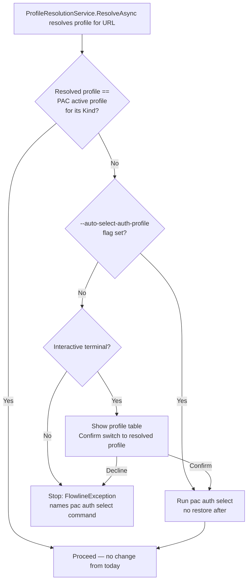

# Active PAC Profile Enforcement - Plan

## Goal Capsule

- **Objective:** guarantee that PAC CLI's globally-active auth profile matches the profile Flowline already resolved for the target environment before any environment-scoped `pac.exe` subprocess call runs — closing the gap where `solution list`/`sync`/`online-version`/`admin backup` silently succeed or fail depending on whichever profile happens to be active, independent of `--environment`.
- **Authority hierarchy:** resolved across an extended live-debugging and design session (see Sources / Research) that traced a real `flowline clone` failure to this exact gap. One prior architectural conflict surfaced during research — `docs/brainstorms/2026-06-19-auth-strategy-requirements.md`'s "Flowline is read-only on PAC profiles" scope boundary — was raised explicitly and resolved: proceed, documented as a deliberate, narrow supersession (see Key Decisions).
- **Stop conditions:** none — direction confirmed across multiple rounds of discussion; the one blocking conflict found during research has been resolved.
- **Execution profile:** local implementation plus one manual/live multi-profile check. This codebase has no CliWrap-mocking seam (confirmed during research) — pac.exe's actual subprocess behavior and its effect on global PAC state can only be verified live, mirroring the precedent already accepted in `docs/plans/2026-07-17-002-refactor-environment-check-drop-active-profile-plan.md`'s KTD8.
- **Tail ownership:** implementer commits locally. No push, no PR unless separately requested.

---

## Product Contract

### Summary

`docs/plans/2026-07-17-002-refactor-environment-check-drop-active-profile-plan.md` made environment existence/Type checks resolve the correct PAC profile per URL, independent of which profile is globally active in PAC CLI. That resolution only reaches Flowline's own direct-token operations. Every environment-scoped operation that still shells out to `pac.exe` (`solution list`, `solution sync`, `solution online-version` get/set, publisher-prefix `env fetch`, `env who`, `admin backup`) silently uses whichever profile PAC CLI considers globally active, regardless of the environment Flowline already validated — because `pac.exe` has no per-invocation credential override; `--environment` only selects which org to query once connected as whatever's active. This plan adds a guard, hooked into the existing profile-resolution choke point, that verifies the active profile matches before any such call runs: blocking by default in non-interactive terminals, prompting to switch in interactive ones, and — opt-in, via a flag — switching automatically without asking.

### Problem Frame

A live `flowline clone` against a project with multiple PAC profiles across tenants (`ROVM-Dev` and `Prod`) resolved the correct `ROVM-Dev` profile for the existence check — proceeding independent of PAC's active profile, exactly as designed — then failed moments later when `pac.exe solution list --environment <url>` ran with `Prod` still globally active, returning "The user is not a member of the organization." The existence-check fix and this failure are the same root cause (`pac.exe` cannot be scoped per invocation) hitting two different call classes: one Flowline already moved off `pac.exe` entirely (direct token reads), the other still depends on it and has no way to route around it — reimplementing these operations via direct Dataverse Web API calls, or Flowline managing its own credential store independent of PAC CLI, were both considered and rejected (see Key Decisions). The fix has to work within `pac.exe`'s single-global-active-profile model.

### Requirements

**Core guard behavior**

- R1. Before any environment-scoped `pac.exe` subprocess call — `solution list`, `solution sync`, `solution online-version` get and set, publisher-prefix `env fetch`, `env who`, `admin backup`, and `solution check` only when an `--environment` is supplied to it — Flowline verifies PAC CLI's currently-active profile (for the resolved profile's Kind) matches the profile Flowline already resolved for that environment URL. `solution pack`/`unpack` are local file operations with no `--environment` and are unaffected.
- R2. On mismatch in non-interactive mode, Flowline stops before any affected `pac.exe` call runs, with a clear error naming the exact corrective command — `pac auth select --name '<resolved-name>'` for a named profile, `pac auth select --index <n>` for an unnamed one (see U1's `--index` fallback).

**Interactive confirmation**

- R3. On mismatch in interactive mode, Flowline shows the local PAC profiles styled like `pac auth list` (name, kind, user, which one is currently active) and asks the user to confirm switching to the resolved profile.
- R4. Confirming switches PAC CLI's active profile and proceeds; declining aborts with the same corrective message the non-interactive path shows.

**Opt-in automation**

- R5. An opt-in `--auto-select-auth-profile`/`-a` flag skips the block/prompt in both interactive and non-interactive modes and switches automatically.
- R6. Switching the active profile — whether via a confirmed prompt or `--auto-select-auth-profile` — does not restore the previously active profile afterward.

**Guard placement and command coverage**

- R8. The guard runs at the existing profile-resolution point, not scattered across each individual `pac.exe` call site. For a command that resolves more than one environment in sequence (e.g. comparing two URLs), the guard re-evaluates at each URL's own resolution point rather than firing once globally per command.
- R9. `StatusCommand` — which today never resolves a PAC profile at all — gains profile resolution, but as a report-only exception to R1-R8: it checks each environment it reports on and shows whether the active profile matches, without ever blocking or prompting. `status` is inherently a multi-environment overview (it can report on up to four environments in one run), not a single-target operation, so enforcing the guard there would mean up to several confirm prompts in one read-only glance. A `ProfileNotFound` or ambiguous-match result reports the same way today's "not authenticated" state does — informational, not blocking.
- R10. `ProvisionCommand`'s target-environment-creation checks (a brand-new environment with no local PAC profile yet) stay exempt from the guard, consistent with the existing carve-out for that path — there is no profile to compare against.

### Key Decisions

**No migration to direct Dataverse Web API calls.** Flowline's stated design philosophy (`Flowline.wiki/11-Philosophy.md`, "Delegate to the platform — build only the gap") is to not reimplement what PAC CLI already does. Reimplementing `solution list`/`sync`/`check`/`backup` would route around the active-profile problem instead of solving it within the tool's chosen architecture, and was explicitly rejected during design.

**No separate, Flowline-owned credential store.** Considered as an alternative (the PACX/Greg.Xrm.Command model) and rejected: PACX's own `pacx auth select` step shows that owning credentials doesn't remove the "pick the right one" step, only relocates it, and PACX's project-mode UX works only because PACX is fully self-contained with no external CLI dependency — `pac.exe` is a genuinely separate process with its own persistent global state Flowline cannot make an in-process credential store reach.

**Deliberate, narrow supersession of the "Flowline is read-only on PAC profiles" boundary.** `docs/brainstorms/2026-06-19-auth-strategy-requirements.md`'s Scope Boundaries state profile management — create, rename, select, delete — stays entirely with PAC CLI. `--auto-select-auth-profile` runs `pac auth select`, which is exactly the "select" operation that boundary named. Confirmed to proceed anyway: the reversal is scoped to `select` only (never create/rename/delete). Without any flag or config, the default behavior (block, or prompt-with-confirm) never writes to PAC's active-profile state *without the user's explicit yes* — a plain block never touches it, and a declined prompt never touches it either. `--auto-select-auth-profile` additionally skips asking; it doesn't introduce the write capability, only removes the confirmation step.

**No restore of the previous active profile after a switch.** A user confirming a switch, or opting into `--auto-select-auth-profile`, is telling Flowline which environment they're working in right now — restoring behind their back would be more surprising, not less, for follow-up manual `pac`/`flowline` commands. It also halves the subprocess overhead of the alternative (switch, then switch back) and removes the failure mode of a crash between switch and restore leaving state stuck.

---

## Planning Contract

### Key Technical Decisions

**KTD1 — The guard hooks into `ProfileResolutionService.ResolveAsync`, not into `PacUtils`.** None of the `PacUtils` functions that shell out to `pac.exe` accept a profile parameter, and `pac.exe` has no per-invocation credential override (confirmed during research) — the only lever is PAC's global active-profile state. `ResolveAsync` already runs once per environment URL per command (per `docs/plans/2026-07-17-002-...`'s KTD5 resolve-once-and-share pattern), at the exact point `EmitStatusLine` already fires, and — critically — always *before* any `Console.Status()`/`Progress()` spinner opens (the existing ambiguous-profile prompt already depends on this sequencing to avoid Spectre.Console's "prompt inside an active display" exception). Extending `ResolveAsync`'s success path inherits correct sequencing for free and reaches every caller that already resolves a profile through it — `FlowlineCommand.GetAndCheckEnvironmentInfoAsync`, `ConnectToDataverseAsync`, and any command calling `ProfileResolutionService.ResolveAsync` directly (`DeployCommand.ValidateTargetAsync`, `DriftCommand`'s raw-URL branch) — without threading a profile parameter through every downstream `PacUtils` call.

**KTD2 — The active-vs-resolved comparison is a pure, internal-static method on `DataverseConnector`.** Mirrors the existing placement of `FindBestProfile`/`GetCurrentResourceSpecificPacProfile`, which already own `PacAuthProfiles`-shape logic. Comparing `resolvedProfile` against `profiles.Current[resolvedProfile.Kind]` is a different check than `FindBestProfile`'s existing ambiguous-candidate active-preference tiebreak — a URL with exactly one matching profile never exercises that tiebreak and can still mismatch the active profile, which is precisely the bug this plan fixes.

**KTD3 — Interactive UX is a profile table plus `ConsoleHelper.Confirm`, not a `SelectionPrompt`.** `ConsoleHelper.Confirm` already implements the exact interactive/non-interactive split this guard needs (interactive: `AnsiConsole.Confirm`; non-interactive: fail with an actionable message) and is already used elsewhere in the codebase (e.g. `DeployCommand`). Printing the profile table first gives full context ("here's everyone available, here's who's active"), and a yes/no confirm defaulting to the resolved profile satisfies "preselect the needed one and ask to confirm" without introducing a second interactive-prompt primitive alongside `ProfileResolutionService.HandleAmbiguousAsync`'s existing `SelectionPrompt`.

**KTD4 — `--auto-select-auth-profile`/`-a` is a bool on `FlowlineSettings`, read into `FlowlineRuntimeOptions` at command startup.** The flag needs to apply uniformly across every command that resolves a profile (push, sync, deploy, drift, clone, provision, generate) — the same shape as `Verbose`/`Force`/`NoCache`, which already live on the shared `FlowlineSettings` base rather than being redeclared per command. `ProfileResolutionService` is a DI singleton with no access to per-command `TSettings` today, and there's no existing precedent for settings reaching it — `ConsoleHelper.IsInteractive(settings)` never actually reads its own `settings` parameter, and `ProfileResolutionService.HandleAmbiguousAsync` already calls it with `settings: null`. Rather than threading a settings parameter through `ResolveAsync` and every one of its callers, the flag's value is read into `FlowlineRuntimeOptions` — a DI singleton already populated once per command run and already available wherever `ProfileResolutionService` runs (mirrors how `Verbose` already reaches shared services this way) — and `ResolveAsync`'s guard reads it from there.

**KTD5 — `StatusCommand` gains profile resolution via constructor injection, bypassing `ProfileResolutionService.ResolveAsync` entirely.** `StatusCommand` is today a bare `AsyncCommand<Settings>` with no `ProfileResolutionService`. Promoting it to the shared `FlowlineCommand<TSettings>` base would pull in machinery (`.flowline` config loading, the full role-based environment resolution flow) this command doesn't otherwise need. But `ResolveAsync` itself is now enforcement-capable (it can block or prompt, per KTD1) and also has its own pre-existing ambiguous-profile prompt (`HandleAmbiguousAsync`) — both wrong for a report-only command per R9. `StatusCommand` instead injects `DataverseConnector` directly and calls `FindBestProfile` (the pure resolution lookup, no prompting) for each environment it checks, then U1's comparison method for reporting only — never routing through `ResolveAsync`'s guard or its ambiguous-picker prompt. Each environment is still resolved sequentially, one at a time, before the existing `Task.WhenAll`/`Console.Status()` block that runs the actual `pac.exe`-backed calls — not because a prompt could fire (it never does here), but to keep the resolution step itself simple and consistent with how every other command resolves before opening a spinner.

**KTD6 — `ProvisionCommand`'s target-environment-creation checks need no code change.** They already stay on the unprofiled, `pac.exe`-backed path (`docs/plans/2026-07-17-002-...`'s KTD7) specifically because a not-yet-created environment has no local PAC profile to resolve — they never call `ProfileResolutionService.ResolveAsync` today, so the new guard (which hooks into that same method) never fires for them either. This carve-out falls out of KTD1's placement rather than needing a separate exemption.

**KTD7 — Coverage for `Sync`/`Clone`/`Deploy`/`Provision`'s remaining `pac.exe` calls is verified, not re-plumbed, except where verification finds a real gap.** Research traced every direct `PacUtils` call site in these commands (see Sources) and found each is preceded, within the same command execution and for the same URL, by an existing `ProfileResolutionService.ResolveAsync` call (via `GetAndCheckEnvironmentInfoAsync` or the command's own direct call) — even where the resolved `PacProfile` value itself is discarded (`var (env, _) = ...`), the guard's side effect (verifying/switching the active profile) already happened. The one confirmed structural gap is `StatusCommand` (KTD5). Implementation still verifies this trace holds for `DeployCommand`'s post-import `BackupService`/`SolutionCheckService` loop specifically, since research could not fully confirm execution order there — see U4.

### High-Level Technical Design

### Assumptions

- `pac auth select` accepts `--name <profile-name>` (confirmed live via `pac auth select --help` this session); an unnamed profile falls back to `--index`, resolved from the profile's position in the already-parsed `authprofiles_v2.json`.

---

## Implementation Units

### U1. Core comparison and `pac auth select` wrapper

**Goal:** a pure, testable check for whether a resolved profile is PAC's currently active one, and a way to switch it.

**Requirements:** R1, R6

**Dependencies:** None — foundation unit.

**Files:**
- `src/Flowline.Core/Services/DataverseConnector.cs` — add an `internal static` method comparing a `PacProfile` against `PacAuthProfiles.Current` for that profile's Kind.
- `src/Flowline/Utils/PacUtils.cs` — add a function wrapping `pac auth select --name <name>` (or `--index <n>` for an unnamed profile) via the existing `CliWrap` pattern.
- `tests/Flowline.Core.Tests/DataverseConnectorTests.cs` — extend with the comparison method's cases.
- `tests/Flowline.Tests/PacUtilsTests.cs` — extend with argument-building coverage for the new wrapper (mirrors the existing pattern of testing only the pure/argument-building pieces, not the subprocess call itself — no CliWrap-mocking seam exists in this codebase).

**Approach:** The comparison reads `profiles.Current[resolved.Kind]` and compares identity/name against `resolved` — no network call, no subprocess. The `pac auth select` wrapper follows the exact `Cli.Wrap(cmdName)` / `WithArguments` / `WithValidation(CommandResultValidation.None)` shape every other `PacUtils` function already uses.

**Patterns to follow:** `DataverseConnector.FindBestProfile`/`GetCurrentResourceSpecificPacProfile` for the comparison's placement and style; `PacUtils.GetEnvWhoAsync` for the simplest existing subprocess-wrapper shape to mirror.

**Test scenarios:**
- Happy path: resolved profile matches `Current[Kind]` — comparison returns true.
- Happy path: resolved profile does not match `Current[Kind]` — comparison returns false.
- Edge case: `Current` has no entry for the resolved profile's Kind — comparison returns false (nothing is confirmed active).
- Edge case: resolved profile has no `Name` (unnamed) — the select wrapper builds an `--index`-based argument set instead of `--name`.

**Verification:** `dotnet test tests/Flowline.Core.Tests/Flowline.Core.Tests.csproj --filter DataverseConnectorTests` and `dotnet test tests/Flowline.Tests/Flowline.Tests.csproj --filter PacUtilsTests` pass.

---

### U2. Guard wiring, interactive confirm, and the auto-switch flag

**Goal:** the behavioral guard itself — block, prompt, or auto-switch, wired into the existing resolution choke point.

**Requirements:** R2, R3, R4, R5, R6, R8

**Dependencies:** U1

**Files:**
- `src/Flowline/Services/ProfileResolutionService.cs` — extend `ResolveAsync`'s success path (`HandleFound`/`HandleAmbiguousAsync`, at the point `EmitStatusLine` already fires) with the guard: compare via U1, and on mismatch either auto-switch, block, or prompt per `FlowlineRuntimeOptions`' auto-switch value (KTD4) and `ConsoleHelper.IsInteractive`.
- `src/Flowline/FlowlineSettings.cs` — add the `--auto-select-auth-profile`/`-a` option (KTD4).
- Wherever `FlowlineRuntimeOptions` is currently populated from settings at command startup — add the auto-switch value alongside the existing options it already carries (KTD4).
- `tests/Flowline.Tests/Services/ProfileResolutionServiceTests.cs` — extend per Test scenarios below.

**Approach:** On mismatch with `FlowlineRuntimeOptions`' auto-switch value true, run U1's select wrapper and proceed without prompting, in both interactive and non-interactive modes. On mismatch with auto-switch false: non-interactive throws `FlowlineException(ExitCode.NotAuthenticated, ...)` naming the exact corrective command (`--name` or `--index` per R2); interactive prints a profile table (mirroring `pac auth list`'s columns) and calls `ConsoleHelper.Confirm` for switching to the resolved profile — confirm runs the U1 wrapper and proceeds, decline throws the same exception the non-interactive path throws. If the U1 select wrapper itself fails (stale index, transient PAC CLI error) on any of these paths, that failure surfaces as the same `FlowlineException` shape rather than letting execution continue against a still-mismatched active profile (see System-Wide Impact). Every time the select wrapper actually runs — confirmed prompt or `--auto-select-auth-profile` — print a distinct, always-visible line naming the switch (old active profile -> new one), separate from `EmitStatusLine`'s existing "Using PAC auth profile" line, so a switch is never silent in a terminal or a CI log.

**Patterns to follow:** `ConsoleHelper.Confirm`'s existing interactive/non-interactive split (`DeployCommand.cs`'s call site) — but the non-interactive block path here must not accept any `--force <specifier>` bypass; a mismatch is a correctness gate, not a confirmation `Confirm`'s existing force-bypass semantics were built for. `ProfileResolutionService.HandleAmbiguousAsync`'s `SelectionPrompt`/`Markup.Escape` conventions for rendering the profile table; `EmitStatusLine`'s existing status-line format. The interactive confirm's default (bare-Enter) answer is decline, not switch — consistent with a fail-safe default for a non-restorable global credential change.

**Test scenarios:**
- Happy path: profile already active — no prompt, no switch, output unchanged from today.
- Non-interactive, mismatch, no auto-switch — throws `FlowlineException` with `ExitCode.NotAuthenticated` and the corrective command in the message.
- Non-interactive, mismatch, `--force <specifier>` or `--force all` passed for an unrelated reason — still throws; the mismatch block is not bypassed by `--force`.
- Interactive, mismatch, confirm — switch wrapper invoked once, a switch-announcement line prints, command proceeds.
- Interactive, mismatch, decline (including a bare-Enter default) — same exception as the non-interactive case, switch wrapper never invoked.
- `--auto-select-auth-profile` (or `-a`) flag set, non-interactive, mismatch — switch wrapper invoked, switch-announcement line prints, no exception, no prompt.
- `--auto-select-auth-profile` flag set, interactive, mismatch — switch wrapper invoked, switch-announcement line prints, no prompt shown.
- `-a` short alias behaves identically to the long flag form.
- A command resolving two different URLs in sequence (e.g. drift) re-evaluates the guard independently at each resolution — a switch triggered for the first URL doesn't suppress the check for the second.
- The select wrapper itself fails (simulated failure) — throws `FlowlineException` with `ExitCode.NotAuthenticated`, command does not proceed to the mismatched `pac.exe` call, no switch-announcement line prints.

**Verification:** `dotnet test tests/Flowline.Tests/Flowline.Tests.csproj --filter ProfileResolutionServiceTests` passes.

---

### U3. `StatusCommand`: report-only profile-match check

**Goal:** close the one confirmed structural gap — `StatusCommand` never resolves a profile today — without making a report-only command block or prompt, per R9.

**Requirements:** R9

**Dependencies:** U2

**Files:**
- `src/Flowline/Commands/StatusCommand.cs` — inject `DataverseConnector`; before the existing `Task.WhenAll`/`Console.Status()` block, resolve each checked environment's profile sequentially via `FindBestProfile` (not `ProfileResolutionService.ResolveAsync`) and compare via U1's comparison method; carry each environment's outcome (matched / mismatched / not found / ambiguous) into the existing per-environment reporting so it renders as an informational row alongside today's "Connected"/"✗ Not authenticated" states.
- `tests/Flowline.Tests/StatusCommandTests.cs` — extend or create, confirming the resolution step runs before the existing `pac.exe`-backed calls and that no code path in this command throws `FlowlineException` or calls a confirm/select-switch primitive.

**Approach:** Constructor injection only (KTD5) — no promotion to `FlowlineCommand<TSettings>`, and no dependency on `ProfileResolutionService.ResolveAsync`'s guard or ambiguous-picker prompt.

**Patterns to follow:** `FlowlineCommandTests.cs`'s `TestCommand` seam for asserting resolve-call behavior without real PAC auth; `DataverseConnector.FindBestProfile`'s existing `ProfileFound`/`ProfileAmbiguous`/`ProfileNotFound` result shapes for mapping to report rows.

**Test scenarios:**
- Happy path: `StatusCommand` resolves and compares a profile for each checked environment before calling `GetEnvWhoAsync`/`GetSolutionVersionAsync` — verified via the resolve-call-counting seam.
- Mismatch case: a mismatched environment renders as an informational row and does not throw, block, or prompt — the command completes and reports on every environment regardless of any individual mismatch.
- `ProfileNotFound`/`ProfileAmbiguous` cases: both render as informational rows, matching today's degrade-and-continue behavior, not a command-level failure.
- Test expectation: existing `StatusCommand` behavior for a matching/no-mismatch profile is unchanged (regression).

**Verification:** `dotnet test tests/Flowline.Tests/Flowline.Tests.csproj --filter StatusCommandTests` passes; manual run of `flowline status` against a project with at least one environment whose resolved profile doesn't match PAC's active one confirms the command completes and reports the mismatch instead of blocking.

---

### U4. Verify and close remaining coverage gaps (Sync, Clone, Deploy, Provision)

**Goal:** confirm every environment-scoped `PacUtils` call in these commands is already covered by U2's guard through an existing `ResolveAsync` call for the same URL earlier in the same execution, and wire a direct call only where that's not true.

**Requirements:** R1, R8, R10

**Dependencies:** U2, U3

**Files:**
- `src/Flowline/Commands/SyncCommand.cs`, `CloneCommand.cs`, `DeployCommand.cs`, `ProvisionCommand.cs` — no changes expected beyond the DeployCommand check below, per KTD7's trace; add a direct `ResolveAsync` call at any site the execution-time trace shows is genuinely uncovered.
- `src/Flowline.Core/Services/IPostDeployService.cs`, `src/Flowline/Services/BackupService.cs`, `src/Flowline/Services/SolutionCheckService.cs` — touch only if the `DeployCommand` post-import loop trace (see Approach) finds it runs before or independent of `DeployCommand`'s own `ResolveAsync` call.

**Execution note:** This unit is verification-led, not construction-led. Trace each `PacUtils` call site identified during research (see Sources) against "does `ResolveAsync` already run for this URL earlier in this same execution path" — most already do (KTD7); wire a new call only where the trace shows a genuine gap.

**Approach:** The one site research could not fully confirm is `DeployCommand`'s post-import `IPostDeployService` loop (`BackupService.RunPreImportAsync`, `SolutionCheckService.RunPreImportAsync`) — confirm it runs after `DeployCommand.ValidateTargetAsync`'s `ProfileResolutionService.ResolveAsync` call for the same target URL. If confirmed, no change is needed there (U1's guard already protects it as a side effect). If the loop can run independently of that resolution (e.g. a code path that reaches the post-import steps without the target validation step running first), extend `PostDeployContext` with the resolved URL and call `ResolveAsync` explicitly before the loop runs.

**Patterns to follow:** KTD1's placement — prefer confirming an existing `ResolveAsync` call already covers a site over adding a new one.

**Test scenarios:**
- Test expectation: existing `SyncCommand`/`CloneCommand`/`DeployCommand`/`ProvisionCommand` tests continue to pass unchanged (regression) — this unit's own verification is the manual multi-profile check in the Verification Contract, not new unit tests, unless the `DeployCommand` trace finds a genuine gap requiring new wiring (in which case that new call site gets the same coverage as U2's other guard call sites).

**Verification:** `dotnet build` succeeds; `dotnet test tests/Flowline.Tests/Flowline.Tests.csproj --filter "SyncCommandTests|CloneCommandTests|DeployCommand|ProvisionCommandTests"` passes; the manual multi-profile check in the Verification Contract exercises `clone`, `sync`, `push`, `deploy`, and `provision` (source-side) specifically.

---

### U5. Documentation

**Goal:** keep the user-facing contract documented, per this project's convention of updating the wiki alongside user-facing behavior changes.

**Requirements:** R1-R10 (documentation coverage, no new product requirements)

**Dependencies:** U1-U4

**Files:**
- `Flowline.wiki/02-Authentication.md` — document the default block/prompt behavior and the `--auto-select-auth-profile`/`-a` flag.
- `Flowline.wiki/03-Command-Reference.md` — add the new flag to the shared-options reference.

**Test expectation:** none — documentation-only unit.

**Verification:** Manual read-through confirms the new behavior is described accurately against the shipped implementation.

---

### U6. Terminology consistency: "PAC profile" -> "PAC auth profile"

**Goal:** align existing user-facing terminology with `--auto-select-auth-profile`'s vocabulary — status lines, error messages, and docs consistently say "PAC auth profile" rather than the current "PAC profile," so the flag name and the existing UI don't use two different terms for the same concept.

**Requirements:** none new — pure terminology consistency, explicitly requested during planning.

**Dependencies:** None — independent of the guard mechanism, can land in any order relative to U1-U5.

**Files:**
- `src/Flowline.Core/Services/DataverseConnector.cs` — 3 occurrences (error messages, verbose log line).
- `src/Flowline/Validation/ValidationProbes.cs` — 2 occurrences (comments).
- `src/Flowline/Validation/FlowlineValidator.cs` — 1 occurrence (comment).
- `src/Flowline/Generators/XrmContext3Generator.cs` — 1 occurrence (error message).
- `src/Flowline/Commands/GenerateCommand.cs` — 1 occurrence (error message).
- `src/Flowline/Commands/PushCommand.cs` — 1 occurrence (error message).
- `src/Flowline/Services/ProfileResolutionService.cs` — 4 occurrences, including `EmitStatusLine`'s "Using PAC profile ..." line printed on every command run and the ambiguous-match messages.
- `Flowline.wiki/02-Authentication.md`, `Flowline.wiki/09-Generate-Early-Bound-Types.md`.
- `tests/Flowline.Core.Tests/DataverseConnectorTests.cs`, `tests/Flowline.Tests/Services/ProfileResolutionServiceTests.cs` — both assert on the literal "PAC profile" substring today; update expected strings to match.

**Approach:** Find-and-replace "PAC profile" -> "PAC auth profile" (case-preserving) across the files above — user-facing error messages, comments, and wiki prose. No behavior change. Shares `Flowline.wiki/02-Authentication.md` with U5 — whichever of U5/U6 lands second should write the renamed terminology directly rather than requiring a follow-up pass.

**Test scenarios:** Test expectation: none beyond updating the two test files' existing string assertions to the new wording — this is a text-only change with no new branch to cover.

**Verification:** `dotnet test tests/Flowline.Core.Tests/Flowline.Core.Tests.csproj --filter DataverseConnectorTests` and `dotnet test tests/Flowline.Tests/Flowline.Tests.csproj --filter ProfileResolutionServiceTests` pass with updated assertions; `dotnet build` clean.

---

## Scope Boundaries

- No migration of any `PacUtils` `pac.exe` wrapper to a direct Dataverse Web API call.
- No separate, Flowline-owned credential store independent of PAC CLI's `authprofiles_v2.json`.
- No restore-after mechanic for a switched active profile — deliberately dropped (see Key Decisions).
- `StatusCommand` is not promoted to `FlowlineCommand<TSettings>` — the smaller constructor-injection fix is sufficient (KTD5).
- `ProvisionCommand`'s target-environment-creation checks are untouched — they're already exempt by construction (KTD6).

### Deferred to Follow-Up Work

- Documenting the `AADSTS90072`/`AADSTS65002` bugs fixed earlier this session as a `docs/solutions/` entry — a real gap found during research, but a separate, smaller piece of work from this plan.

---

## System-Wide Impact

**Affected surface:** every command that resolves a PAC profile through `ProfileResolutionService.ResolveAsync` — `clone`, `push`, `sync`, `deploy`, `drift`, `provision` (source-side), `generate` — gains the guard as a side effect, without each command needing its own wiring (KTD1). Two deliberate exceptions: `ProvisionCommand`'s target-environment-creation checks never call `ResolveAsync` at all (KTD6), and `status` calls `DataverseConnector.FindBestProfile` directly rather than `ResolveAsync`, so it reports mismatches without ever blocking or prompting (R9, KTD5).

**Failure propagation.** Two distinct failure points, handled differently:
- The *comparison* (U1) is pure and cannot fail — it either finds a match in `PacAuthProfiles.Current` or it doesn't.
- The *switch* (`pac auth select`, U1's wrapper) is a real subprocess call and can fail — a stale index, a profile deleted between resolution and switch, or a transient PAC CLI error. On a failed switch, Flowline must not silently proceed as if the switch succeeded: U2 surfaces the switch failure as a `FlowlineException(ExitCode.NotAuthenticated, ...)` naming the failure and the same manual `pac auth select` corrective command, rather than continuing to the now-still-mismatched `pac.exe` call. This applies identically whether the switch was triggered by a confirmed prompt or by `--auto-select-auth-profile`.

**Shared global state.** PAC CLI's active-profile pointer (`authprofiles_v2.json`'s `Current` map) is process-external, shared machine-wide state — not scoped to a single Flowline invocation. Writing to it always requires either the user's explicit yes at a prompt or the explicit `--auto-select-auth-profile` opt-in; a plain block or a declined prompt never touches it. Only that one field is ever written (never create/rename/delete), per the narrow supersession in Key Decisions.

---

## Risks & Dependencies

- **File overlap with `docs/plans/2026-07-17-001-feat-standalone-active-profile-default-plan.md`.** That plan (still requirements-only, not yet implemented) touches the same standalone paths in `PushCommand.cs`/`GenerateCommand.cs` — different concern (defaulting the target URL from the active profile when none is specified) but the same files. That plan's own Risks section already names this: whichever change lands second should rebase against the other rather than assume a clean merge.
- **No CI coverage for the actual `pac auth select` subprocess behavior.** Consistent with every other `PacUtils` function in this codebase (no CliWrap-mocking seam exists) — covered by the manual multi-profile verification instead of unit tests, an accepted gap mirroring plan 002's KTD8.
- **Residual global-state risk in `--auto-select-auth-profile`.** A crash mid-command after a switch, or the user running `pac` manually in another terminal concurrently, can leave PAC's active profile in a state the user didn't expect — inherent to `pac.exe`'s single-global-active-profile model and not fully closable without moving off `pac.exe` (rejected — see Key Decisions). Scoped by being opt-in only; the default (block/prompt) path never touches PAC state.

---

## Sources / Research

- `docs/plans/2026-07-17-002-refactor-environment-check-drop-active-profile-plan.md` — KTD5 (resolve-once, share-profile pattern this plan's guard hooks into) and KTD7 (`ProvisionCommand`'s target-environment exemption, reused as-is per KTD6).
- `docs/brainstorms/2026-06-19-auth-strategy-requirements.md` — R2/R3/R4 established the `Current[Kind]`-based active-profile comparison and the interactive/non-interactive split this plan's guard reuses; its "Flowline is read-only on PAC profiles" Scope Boundary is the one explicitly, narrowly superseded decision (see Key Decisions).
- `docs/solutions/runtime-errors/spectre-console-status-prompt-exclusivity.md` — the sequencing constraint behind KTD1 (a prompt must run before any `Console.Status()`/`Progress()` spinner opens, not inside one).
- `Flowline.wiki/11-Philosophy.md` (§3, "Delegate to the platform") and `Flowline.wiki/16-Migration-from-PACX.md` — grounding for the two rejected alternatives (Web API migration, separate credential store).
- Live `pac auth select --help` check this session — confirmed `--name`/`--index` argument shape.
- Live `flowline clone` failure log (`pac.exe solution list --environment <url>` returning 403 "not a member of the organization" against an environment Flowline had just correctly validated existed) — the concrete repro that motivated this plan.
- Repository research this session traced every direct `PacUtils` environment-scoped call site across `push`/`sync`/`deploy`/`drift`/`clone`/`provision`/`status`/`generate` against whether a prior `ProfileResolutionService.ResolveAsync` call already covers it — findings incorporated into KTD7 and U4.
- Live search this session for "PAC profile" across `src/` and `Flowline.wiki/` — 12 occurrences across 7 source files plus 2 test files, and 12 across 2 wiki pages — scoped U6.
- Live `flowline status`/`StatusCommand.cs` read this session (during doc review) confirmed the command checks up to four environments concurrently inside one `Console.Status()` spinner, and today degrades a per-environment auth failure to an informational row rather than aborting — the basis for R9's report-only carve-out.

---

## Verification Contract

- `dotnet build` — zero new warnings or errors across all files touched by U1-U6.
- `dotnet test tests/Flowline.Core.Tests/Flowline.Core.Tests.csproj --filter DataverseConnectorTests` and `dotnet test tests/Flowline.Tests/Flowline.Tests.csproj` (full suite) — pass, including the new `ProfileResolutionServiceTests`, `PacUtilsTests`, and `StatusCommandTests` coverage.
- Manual verification (mirrors plan 002's own precedent): with two local PAC profiles pointing at different tenants, set one active, then run `flowline clone`/`sync`/`push`/`deploy` from a `.flowline`-configured project against the *other* profile's URL:
  - Non-interactive (CI env var set): the command refuses immediately with the exact corrective command (`--name` or `--index`), before any `pac.exe` call for that URL runs.
  - Interactive: the profile table prints, confirming the switch actually flips PAC's active profile (`pac auth list` reflects it afterward, not restored), and the command proceeds.
  - `--auto-select-auth-profile` (or `-a`): the switch happens without any prompt, in both interactive and non-interactive runs.
  - `flowline provision` against a brand-new target URL still creates and finds the environment via the unchanged, unprofiled path (KTD6 regression check).
  - `flowline status` against a project where one environment's resolved profile doesn't match PAC's active one: the command completes and reports the mismatch as an informational row — no block, no prompt, no exception (R9/KTD5 regression check).

## Definition of Done

- U1-U6 complete; `dotnet build` and both test projects (`Flowline.Core.Tests`, `Flowline.Tests`) pass with zero new warnings.
- Every environment-scoped `pac.exe` call in `push`/`sync`/`deploy`/`drift`/`clone`/`provision`/`generate` is preceded by the active-profile guard, except `ProvisionCommand`'s target-environment-creation checks (deliberately exempt, KTD6). `status` checks and reports mismatches without enforcing them (deliberately exempt, R9/KTD5).
- `--auto-select-auth-profile` (and its `-a` short form) verified live to actually flip PAC CLI's active profile without restoring it afterward.
- `Flowline.wiki/02-Authentication.md` and `Flowline.wiki/03-Command-Reference.md` updated to document the new default behavior and the opt-in flag.
- No dead code left behind: no abandoned attempt at threading `PacProfile` through `PacUtils`/`FlowlineValidator`/`PostDeployContext` signatures survives if U4's trace confirms the simpler guard-only fix is sufficient everywhere except the sites it actually changes.
