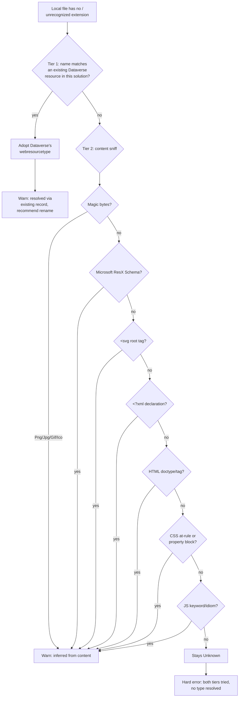

# WebResource Extensionless File Type Fallback - Plan

## Goal Capsule

- **Objective:** stop `push`/`sync` from hard-failing on local web resource files whose extension is missing or unrecognized, by resolving their Dataverse `webresourcetype` through two fallback tiers — an existing-resource metadata lookup, then content sniffing — before falling back to today's error.
- **Authority hierarchy:** resolved from a live `flowline push` failure log, root-caused by direct file inspection (magic bytes, content grep) in this session, then designed conversationally across several rounds ending in explicit user confirmation of scope, including one call-out (Tier 1 lookup scope) the user resolved directly.
- **Stop conditions:** none — design confirmed; the one open call-out (global-orphan lookup scope) was resolved: global matches fall through to content sniffing rather than expanding Tier 1.
- **Execution profile:** local implementation with unit and integration-style tests, using the existing `WebResourceServiceTests.cs` harness (`IOrganizationServiceAsync2` via NSubstitute, temp directories) — no live Dataverse connection required.
- **Tail ownership:** implementer commits locally. No push, no PR unless separately requested.

---

## Product Contract

### Summary

Add a two-tier fallback for local web resource files whose type can't be determined from their file extension. Tier 1 looks up the file's already-known type from a matching same-solution Dataverse resource. Tier 2, for files with no such match, infers the type from file content using deterministic signals (binary magic bytes, format-specific markers, syntax heuristics). Both tiers warn on every resolution — this is a workaround, not an endorsement of extensionless naming. Files unresolved by either tier keep today's hard error, reworded to say both tiers were tried.

### Problem Frame

A real `flowline push --dry-run` run failed with `Unsupported file extension` for four local web resource files (`dwe_cateringjs`, `dwe_hidevalues`, `dwe_Logoromeo`, `dwe_particulierbedrijf`) that have no extension at all. Direct inspection confirmed these mirror pre-existing, already-in-production Dataverse web resources whose unique `name` itself has no extension — a legacy naming pattern from before extension-suffixed names were the convention. `Path.GetExtension` returns `""` for these files, so `WebResourceReader.LocalResourceFromFile` can't map them to a `WebResourceType` and marks them `Unknown`; `WebResourcePlanner.ValidateWebResourceFiles` then hard-stops the entire sync.

Renaming isn't a safe fix: Flowline derives a resource's Dataverse `name` directly from its local file path (including the extension), so giving the local file a proper extension would make Flowline treat it as a *different* resource — creating a duplicate and treating the real, already-referenced one as an orphan candidate for deletion. Dataverse web resource names are also immutable after creation, so there's no matching fix on the Dataverse side either.

spkl — the tool Flowline's users are migrating from — solves an adjacent version of this same problem with an explicit `spkl.json` file mapping each local file path to its Dataverse `uniquename`, decoupling the two. Flowline's design deliberately avoids that kind of mapping file (`Flowline.wiki/13-Migration-from-spkl.md` documents deriving the Dataverse name from folder structure specifically to avoid needing one) and this plan does not reintroduce it: the fallback tiers below let today's push succeed, but every resolution still warns that the underlying legacy name should eventually be fixed at the source.

### Requirements

**Metadata lookup (Tier 1)**

- R1. When a local web resource file's type can't be determined from its extension, and its computed name matches an existing Dataverse web resource in the *same solution* being synced, Flowline adopts that resource's stored `webresourcetype` instead of failing.
- R2. Every Tier 1 resolution prints a warning naming the file, the resolved type, and a recommendation to create a properly-extensioned replacement and migrate references, since the Dataverse name itself can't be changed.

**Content sniffing (Tier 2)**

- R3. When Tier 1 does not resolve a file — no local extension match, and no matching Dataverse resource in the current solution (including a resource that exists only under a *different* solution) — Flowline attempts to infer the type from file content using deterministic signals only: binary magic bytes (PNG, JPEG, GIF, ICO), a RESX schema marker, an SVG root-tag marker, an XML declaration, an HTML doctype/tag, CSS at-rules or a property-block pattern, and JavaScript keyword/idiom signals. Signals are checked most-specific-first so RESX and SVG (both XML supersets) are never misclassified as generic XML.
- R4. Every Tier 2 resolution prints a warning naming the file and the inferred type, recommending the file be given a real extension — content sniffing is a guess even when constrained to strong signals.

**Unresolved files**

- R5. A file unresolved by both tiers keeps today's hard failure, with the error message updated to state that both metadata lookup and content sniffing were tried.
- R6. Fallback resolution never overrides a type already correctly determined from a recognized file extension — it only fills in for files that would otherwise be `Unknown`.

### Key Decisions

**No mapping-file escape hatch.** Explicitly rejected during design, mirroring the project's existing stance against `spkl.json`-style explicit mappings (see Problem Frame). The fallback tiers unblock today's sync; the warnings on every resolution keep pressure on fixing the underlying legacy name rather than letting Flowline quietly accommodate it forever.

**Warn on every fallback resolution, including successful ones.** A Tier 1 resolution is fully reliable (the type comes straight from Dataverse), but it still surfaces a warning rather than a quiet info line — Flowline's position is that these names are a problem to fix, not a pattern to support silently.

**Tier 1 is scoped to the current solution only.** A local file whose Dataverse match exists under a *different* solution is not looked up — it falls through to Tier 2 content sniffing (or the hard error) like a genuinely new file. Confirmed explicitly during design rather than expanding Tier 1 to a global lookup.

---

## Planning Contract

### Key Technical Decisions

**KTD1 — Tier 1/2 backfill runs before `EnrichDependencies`, and re-parses annotations for any file it resolves to `Js`.** `LoadSnapshotAsync`'s current body (`src/Flowline.Core/WebResources/WebResourceReader.cs:21-68`) calls `EnrichDependencies` (LCID expansion, RESX-to-JS auto-matching — both gated on `resource.Type == WebResourceType.Js`/`Resx`) at line 40, *before* `dataverseResourcesDict` is even built (lines 48-51). Placing Tier 1/2 "after both dictionaries are available," as originally planned, would run it after `EnrichDependencies` already skipped every still-`Unknown` file — silently losing their dependency wiring. The fix reorders the method: resolve `dataverseResourcesDict` and ownership first, run Tier 1 (metadata lookup) then Tier 2 (content sniffing) against any local resource still `Unknown`, and — because `LocalResourceFromFile` (line 295-308) parses `// flowline:depends` annotations only when the *extension-derived* type is already `Js`, before any Dataverse context exists — re-run `WebResourceAnnotationParser.ParseAnnotations` for any file the backfill resolves to `Js`. Only then does `EnrichDependencies` run, against the corrected types. Extension-based detection itself is unaffected.

**KTD2 — Tier 2 is a new pure static helper, not inline logic; it reads raw bytes from disk, not `LocalWebResource.Content`.** A dedicated `WebResourceTypeSniffer` (or similarly named) static class takes raw file bytes and returns `WebResourceType?` — no I/O, no Dataverse dependency, fully unit-testable with byte arrays. `LocalWebResource.Content` is a base64 string (`null` for empty files), not the bytes the sniffer needs, so the Tier 2 call site re-reads the small number of still-unresolved files directly via `File.ReadAllBytes(resource.Path)` rather than decoding `Content` — avoiding a null-decode on empty files and keeping the sniffer's own signature (`byte[]`) uncomplicated by the base64 round-trip.

**KTD3 — Signal priority order: magic bytes -> Resx -> Svg -> Xml -> Html -> Css -> Js -> unresolved.** Magic bytes are checked first (cheapest, zero ambiguity). RESX and SVG are checked before the generic XML declaration check specifically because both are XML supersets — checking XML first would misclassify a `.resx`- or `.svg`-shaped file as generic `Xml` (`WebResourceType.Xml = 4` vs. `Svg = 11` / `Resx = 12` in `src/Flowline.Core/Models/WebResourceModels.cs` — genuinely different Dataverse values, not a cosmetic difference).

**KTD4 — CSS and JS both use positive-signal detection, not exclusion/default; the CSS property-block signal is scoped to avoid matching JS object literals.** Neither type is a "nothing else matched, so assume this" fallback. CSS requires an at-rule keyword (`@media`, `@import`, `@font-face`, `@keyframes`, `@charset`, `@supports`) or a property-block match *strictly inside a brace pair*, requiring a semicolon-terminated `property: value;` declaration — not a bare `property: value` pair terminated by a comma or the closing brace, which is how JS object literals (e.g. `{ color: 'red', margin: 10 }`) are shaped and must not trip the CSS signal. JS requires at least one recognizable idiom (a `function` declaration, arrow function, `var`/`let`/`const` declaration, or a Dataverse-specific global like `Xrm.Page`/`formContext.`/`executionContext.`, or a common script call like `document.getElementById(`/`console.log(`/`module.exports`/`require(`). A file matching neither stays unresolved rather than defaulting to either type — a wrong `webresourcetype` written to Dataverse is a worse outcome than the existing hard error.

**KTD5 — The still-unresolved hard error becomes a `FlowlineException(ExitCode.ValidationFailed, ...)`, not a raw `InvalidOperationException`.** `WebResourcePlanner.ValidateWebResourceFiles` (`src/Flowline.Core/WebResources/WebResourcePlanner.cs:193-226`) currently throws `InvalidOperationException`, which `Program.cs`'s default exception handler renders as a full raw stack trace rather than the clean `[red]Error:[/] <message>` format `FlowlineException` gets. This plan touches this exact method to update the error wording anyway (R5), so the exception type is corrected in the same change rather than left as a pre-existing inconsistency — matches the project's established convention of throwing `FlowlineException` for precondition failures.

**KTD6 — Warnings print from `WebResourceReader` during snapshot loading, before `WebResourcePlanner.Plan` runs.** `WebResourceReader` already takes an `IAnsiConsole console` in its constructor, matching the existing pattern where `WebResourcePlanner` calls `console.Error`/`console.Warning` directly (`src/Flowline.Core/WebResources/WebResourcePlanner.cs:218-223`). Tier 1 and Tier 2 warnings print inline as each file is resolved, so they appear before the sync plan (and, in `--dry-run`, before the plan summary) rather than needing a separate collection-and-flush step.

### High-Level Technical Design

---

## Implementation Units

### U1. Content-sniffing helper (Tier 2 core logic)

**Goal:** a pure, dependency-free helper that inspects raw file bytes and returns a `WebResourceType?` using the KTD3/KTD4 signal set and priority order.

**Requirements:** R3, R4 (detection logic only — wiring and warnings come in U3)

**Dependencies:** none

**Files:**
- Create: `src/Flowline.Core/WebResources/WebResourceTypeSniffer.cs`
- Test: `tests/Flowline.Core.Tests/WebResources/WebResourceTypeSnifferTests.cs`

**Approach:** a single static method, e.g. `TrySniff(byte[] content) : WebResourceType?`, checking signals in KTD3's priority order and returning `null` when nothing matches. Magic-byte checks operate on the raw bytes; text-based checks (Resx/Svg/Xml/Html/Css/Js) decode a bounded prefix of the content as UTF-8 (tolerating decode failures by treating them as "no text signal") before pattern-matching. The CSS property-block check (KTD4) matches only a semicolon-terminated `property: value;` pair inside a brace pair — not a comma- or closing-brace-terminated one — so a JS object literal's `{ color: 'red', margin: 10 }` shape does not qualify.

**Patterns to follow:** `PacUtils.ParseVersionFromPacOutput` and other small pure static parsers in this codebase — no console/IO dependencies, directly unit-testable.

**Test scenarios:**
- Happy path: PNG, JPEG, GIF, and ICO magic bytes each resolve to their respective type.
- Happy path: content containing the RESX schema marker resolves to `Resx`.
- Happy path: content starting with an `<svg` root tag — with and without a preceding `<?xml` declaration — resolves to `Svg`.
- Happy path: a bare `<?xml` declaration with no RESX/SVG marker resolves to `Xml`.
- Happy path: content starting with an HTML doctype or `<html` tag (case-insensitive) resolves to `Html`.
- Happy path: content containing a CSS at-rule (e.g. `@media`) resolves to `Css`.
- Happy path: content containing a semicolon-terminated `{ property: value; }`-shaped block with no at-rule resolves to `Css`.
- Happy path: content containing each of the JS signals (a `function` declaration, an arrow function, a `var`/`let`/`const` declaration, `Xrm.Page`/`formContext.`) resolves to `Js`.
- Edge case: RESX/SVG priority — content is `<?xml version="1.0"?><svg ...>` resolves to `Svg`, not `Xml` (verifies priority order, not just detection).
- Edge case (KTD4 collision guard): a JS object literal (e.g. `const config = { color: 'red', margin: 10 };`) resolves to `Js`, not `Css` — the comma-separated, non-semicolon-terminated properties inside the braces must not trip the CSS property-block signal.
- Edge case: empty byte array, and plain text matching none of the signals, both return `null`.

**Verification:** all listed scenarios pass as unit tests with no I/O.

---

### U2. Metadata lookup (Tier 1) wired into snapshot loading

**Goal:** resolve a local `Unknown`-typed file's type from a matching same-solution Dataverse resource, with a warning on every resolution.

**Requirements:** R1, R2, R6

**Dependencies:** none (independent of U1's content sniffer)

**Files:**
- Modify: `src/Flowline.Core/WebResources/WebResourceReader.cs`
- Test: `tests/Flowline.Core.Tests/WebResources/WebResourceReaderTests.cs` (new file, following the `WebResourceServiceTests.cs` harness pattern — `IOrganizationServiceAsync2` via NSubstitute, temp directory for local files)

**Approach:** reorder `LoadSnapshotAsync` (KTD1) so `dataverseResourcesDict` and ownership are resolved *before* `EnrichDependencies` runs. Immediately after, backfill any local resource still `Unknown` whose name matches a same-solution Dataverse resource — replace its `Type` with the Dataverse resource's `Type` (`LocalWebResource` is a record; use a `with` expression) — and for any file this backfill resolves to `Js`, re-run `WebResourceAnnotationParser.ParseAnnotations` against it and set the result as its `DependsOn` (its original parse at read time used the pre-backfill `Unknown` type and always produced an empty list). Print the Tier 1 warning for each file resolved this way. Only then does `EnrichDependencies` run, against the corrected types and dependencies.

**Patterns to follow:** the existing dictionary-join logic already in `LoadSnapshotAsync` (`dataverseResourcesDict`, `orphanNames`) for the lookup; `WebResourcePlanner`'s `console.Error`/`console.Warning` calls for the warning format.

**Test scenarios:**
- Happy path: a local extensionless file whose computed name matches an existing same-solution Dataverse resource adopts that resource's type; the sync proceeds without a validation error.
- Happy path: the warning is printed, naming the file and the resolved type.
- Edge case (R6 regression guard): a local file with an already-recognized extension is untouched by Tier 1, even if a same-named Dataverse resource of a different type exists.
- Edge case: a local extensionless file with no matching same-solution Dataverse resource is left `Unknown` — Tier 1 does not resolve it (falls through to U3's Tier 2).
- Edge case (KTD1 ordering guard): an extensionless local file with a `// flowline:depends` annotation, resolved to `Js` by Tier 1, retains that dependency in its `DependsOn` after `EnrichDependencies` runs — proving annotations are re-parsed against the corrected type rather than silently dropped.
- Integration scenario: reproduces the reported failure shape directly — multiple extensionless local files (a JS-shaped one and an image-shaped one) all matching existing same-solution Dataverse resources sync successfully with no `Unsupported file extension` error.

**Verification:** listed scenarios pass; existing `WebResourceServiceTests.cs` suite (904 lines) has no regressions.

---

### U3. Wire Tier 2 into resolution; update the unresolved-file error

**Goal:** run U1's sniffer as the fallback after Tier 1 fails to resolve a file, with its own warning; correct the still-unresolved error's wording and exception type (KTD5).

**Requirements:** R3, R4, R5

**Dependencies:** U1, U2

**Files:**
- Modify: `src/Flowline.Core/WebResources/WebResourceReader.cs` (Tier 2 wiring, alongside U2's Tier 1 backfill)
- Modify: `src/Flowline.Core/WebResources/WebResourcePlanner.cs` (`ValidateWebResourceFiles` error wording and exception type)
- Test: `tests/Flowline.Core.Tests/WebResources/WebResourceReaderTests.cs` (Tier 2 cases, same file as U2)
- Test: `tests/Flowline.Core.Tests/WebResources/WebResourcePlannerTests.cs` (new file, or extend existing planner-adjacent coverage if found during implementation — placed alongside U1/U2's new test files rather than the existing flat `WebResourceServiceTests.cs` location, since this plan is what introduces the `WebResources/` test subfolder)

**Approach:** for any local resource still `Unknown` after U2's Tier 1 pass, re-read its bytes (`File.ReadAllBytes(resource.Path)` — see KTD2) and call U1's sniffer; on a match, adopt the sniffed type and print the Tier 2 warning. `ValidateWebResourceFiles`'s still-`Unknown` branch throws `FlowlineException(ExitCode.ValidationFailed, ...)` (KTD5) with wording stating both tiers were tried.

**Patterns to follow:** `FlowlineException` construction and `ExitCode.ValidationFailed` usage elsewhere in the codebase (e.g. `DeployCommand`'s DTAP gate errors).

**Test scenarios:**
- Happy path: a local extensionless file with no Dataverse match, whose content matches a Tier 2 signal (e.g. valid PNG bytes), resolves via content sniffing; the Tier 2 warning is printed.
- Edge case: a local extensionless file matching neither tier still throws — now as `FlowlineException(ExitCode.ValidationFailed, ...)` with wording naming both tiers, not the old raw `InvalidOperationException`.
- Edge case (R3's confirmed scope decision): a local extensionless file whose Dataverse match exists only under a *different* solution is not resolved by Tier 1 — it takes the Tier 2 content-sniffing path exactly like a genuinely new file, not a silent skip or a different error.
- Integration scenario: one sync run with three extensionless files — one resolved by Tier 1, one by Tier 2, one unresolved — confirms each takes its correct path and only the unresolved one fails the run.

**Verification:** listed scenarios pass; the reported push log's exact failure shape (four extensionless files, all Dataverse-matched) succeeds end-to-end via `WebResourceService.SyncSolutionAsync` in a `--dry-run`-equivalent test.

---

### U4. Documentation

**Goal:** document the fallback behavior so users understand the warnings when they see them.

**Requirements:** R1-R5 (documents the completed behavior)

**Dependencies:** U2, U3

**Files:**
- Modify: `Flowline.wiki/05-Push-WebResources.md`

**Approach:** a short new subsection explaining that Flowline falls back to metadata lookup then content sniffing for extensionless/unrecognized files, that both tiers warn, and what the recommended fix is (a properly-named replacement, since the Dataverse name is immutable).

**Patterns to follow:** the existing "Keeping PAC CLI's active profile in sync" subsection style in `Flowline.wiki/02-Authentication.md` (short prose, one small example block).

**Test scenarios:**
Test expectation: none -- documentation only, no behavior change.

**Verification:** subsection reads clearly against the actual U2/U3 behavior; no broken links.

---

## Scope Boundaries

- **No mapping-file / explicit override config** (spkl.json-style) — deliberately rejected; see Key Decisions.
- **Tier 1 is same-solution only** — a global-orphan lookup (matching a Dataverse resource that exists only under a different solution) is explicitly not built; those files fall through to Tier 2 or the hard error.
- **No sniffing support added for `Xap`, `Xsl`/`Xslt`, `Xaml`/`Xsd`** — these are legacy/niche types (`Xap` already has its own deprecation-warning path in `WebResourcePlanner`) with no evidence any current extensionless file needs them; an extensionless file of one of these types stays unresolved today.
- **No automatic remediation** — Flowline only warns and recommends a fix; it does not rename files, create replacement resources, or modify Dataverse on the user's behalf.

### Deferred to Follow-Up Work

- Expanding Tier 1 to a global (cross-solution) orphan lookup, if a real case surfaces where a same-named resource exists only under a different solution.
- Broader review of `Program.cs`'s default (non-`FlowlineException`) exception rendering — KTD5 fixes this specifically for `ValidateWebResourceFiles`, but other call sites in the WebResources area may have the same raw-`InvalidOperationException`-renders-a-stack-trace issue and were not audited here.

---

## System-Wide Impact

`WebResourceReader.LoadSnapshotAsync` and `WebResourcePlanner.ValidateWebResourceFiles` are the shared choke point for both `flowline push` and `flowline sync`'s web resource handling (and their `--dry-run` variants) — this change affects both commands identically, not just the `push` path where the bug was reported.

---

## Risks & Dependencies

- **Tier 2 false positives.** CSS and JS detection are heuristic. Mitigated by requiring a positive, specific signal (never a "nothing else matched" default — KTD4) and by warning on every Tier 2 resolution so a wrong guess is visible rather than silent. If a guess is wrong on a genuinely new (Tier-2-only) resource, the write already landed on Dataverse — this plan has no automatic remediation (Scope Boundaries) and does not establish whether `webresourcetype` can be corrected post-creation; the warning is the only safeguard, which is why Tier 2 is conservative by design (KTD4) rather than best-effort.
- **No live-Dataverse dependency.** All new logic is testable against the existing `IOrganizationServiceAsync2` mock harness; no manual/live verification step is required for this plan (unlike some other recent plans in this repo).

---

## Sources / Research

- Live failure log: `C:\Users\RemyvanDuijkeren\AppData\Local\Flowline\logs\2026-07-18T063454Z-push.log` — the four `Unsupported file extension` errors that started this investigation.
- Direct content inspection this session confirmed the four reported files' actual types (`file`/`xxd` on `dwe_cateringjs`, `dwe_hidevalues`, `dwe_particulierbedrijf` → JS; `dwe_Logoromeo` → JPEG), grounding the JS-detection signal set in KTD4.
- `src/Flowline.Core/WebResources/WebResourceReader.cs`, `WebResourcePlanner.cs`, `src/Flowline.Core/Models/WebResourceModels.cs` — current type-detection and validation logic.
- `Flowline.wiki/13-Migration-from-spkl.md` (`## Step 2 — Replace web resource configuration`) — spkl's `spkl.json` mapping-file precedent for the same underlying problem (local-file-vs-Dataverse-name decoupling), and why Flowline's convention-over-configuration approach doesn't adopt it.
- `tests/Flowline.Core.Tests/WebResourceServiceTests.cs` — existing test harness pattern (NSubstitute `IOrganizationServiceAsync2`, temp-directory local files) reused by U2/U3.

---

## Verification Contract

- `dotnet build E:\Code\RemyDuijkeren\Flowline\Flowline.slnx` — clean build, no warnings introduced.
- `dotnet test E:\Code\RemyDuijkeren\Flowline\tests\Flowline.Core.Tests\Flowline.Core.Tests.csproj` — all new tests (U1-U3) plus the full existing `WebResourceServiceTests.cs` suite pass with no regressions.
- Manual sanity check (optional, not blocking): re-run the original failing `flowline push --dry-run` scenario against the reported environment to confirm the four originally-failing files now sync with warnings instead of a hard error.

---

## Definition of Done

- U1-U4 complete.
- `dotnet build` clean; `dotnet test` passes for `Flowline.Core.Tests` with no regressions in `WebResourceServiceTests.cs`.
- Every fallback resolution (Tier 1 and Tier 2) prints a warning; the still-unresolved path throws `FlowlineException(ExitCode.ValidationFailed, ...)` with updated wording.
- `Flowline.wiki/05-Push-WebResources.md` documents the fallback behavior.
- No leftover experimental/dead-end code from approaches explored during implementation.
