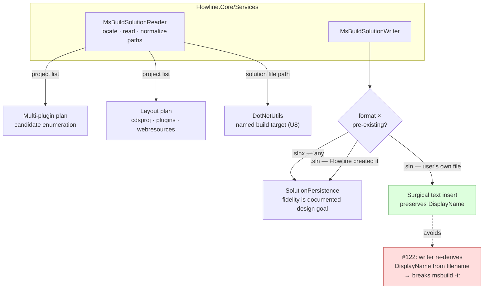

# Solution File Project Wiring - Plan

## Goal Capsule

- **Objective:** Give users a supported way to wire a `.cdsproj` into a project's solution file, and move new projects to `.slnx` while continuing to read `.sln`.
- **Product authority:** This document. Product decisions were settled during brainstorm; planning owns implementation choices only.
- **Open blockers:** None. Both prior questions are settled: `Microsoft.VisualStudio.SolutionPersistence` is the read/write mechanism (KD9), and R7 plus the `sln` branch ship in v1.0 (2026-08-01, `STRATEGY.md`). This plan ships first of three, alongside `2026-07-15-001` (multi-plugin discovery) and `2026-07-20-001` (project layout and naming) — all three in v1.0, so the layout v1.0 commits to is the final one and no installed base is created on the old shape.

---

## Product Contract

### Summary

Add `flowline sln add <path>`, a command that wires a `.cdsproj` into the project's solution file. Replace clone's rename-based workaround with a direct write, and have `clone` create `.slnx` for new projects while Flowline continues to read `.sln`.

### Problem Frame

`dotnet sln add` refuses a `.cdsproj`: *"Project has an unknown project type and cannot be added to the solution file."* It also exits 0, so a script cannot detect the failure. This is [dotnet/sdk#47638](https://github.com/dotnet/sdk/issues/47638) — the SDK cannot resolve a `DefaultProjectTypeGuid` for extensions it does not recognize.

`clone` works around this by renaming `Package.cdsproj` to `Package.csproj`, calling `dotnet sln add`, renaming it back, then string-replacing the filename inside the `.sln` (`src/Flowline/Commands/CloneCommand.cs:413-446`). Two costs follow. The workaround is reachable only from `clone`, so anyone whose project did not come from `clone` — a repo migrating off spkl, Daxif, or PACX, a second solution added later, a hand-assembled project — has no supported path. And the rename opens a crash window: an interrupted `clone` leaves `Package.csproj` on disk, at which point clone's own guard (`CloneCommand.cs:341`) tells the user to delete `Package/` and re-clone — destructive advice for a state one rename would fix.

Separately, `.slnx` has become the default for `dotnet new sln` in .NET 10, and `clone` passes `--format sln` (`CloneCommand.cs:402`) to opt out. That opt-out rests on an assumption that `.slnx` cannot hold a `.cdsproj`, which testing disproved.

### Key Decisions

- **KD1 — `flowline sln add`, a subcommand under an `sln` branch.** The user arrives here having just watched `dotnet sln add` fail, so `dotnet` → `flowline` is a one-word substitution. "Solution" already means a Dataverse solution throughout Flowline; naming the file extension avoids that collision, which `flowline add project` would invite. The branch is the first in an otherwise flat command surface (`src/Flowline/Program.cs:149-193`), accepted because a Spectre branch costs registration lines and no runtime or config surface.

- **KD2 — `.cdsproj` only; a `.csproj` argument is refused.** Flowline handles what the SDK cannot and stays out of the way otherwise. Wrapping a working first-party command would add a surface with no capability behind it.

- **KD3 — Write the solution entry directly; never rename the project file.** The rename exists only to satisfy `dotnet sln add`, and writing the entry removes both the shell-out and the crash window. Both formats are writable: `.sln` needs a project GUID and matching `ProjectConfigurationPlatforms` entries, `.slnx` needs neither.

- **KD4 — `clone` creates `.slnx` by default and falls back to `.sln` below the SDK floor; Flowline reads either format.** Verified working with a real `Package.cdsproj` on SDK 10.0.302: `dotnet sln list` enumerates it and `dotnet build` completes the SolutionPackager run and produces the zip. The fallback is not optional polish — `.slnx` requires SDK 9.0.200, and the artifact outlives the machine that created it (see KD7).

- **KD5 — Existing `.sln` projects are left alone, with no conversion and no nudge.** `.sln` is not deprecated, so there is no forcing function, and shipping a wrapper around a first-party command earns nothing. Note for anyone who does convert: `dotnet sln migrate` writes the `.slnx` but leaves the original `.sln` in place, which is the coexistence state R5a governs.

- **KD7 — The SDK floor is a downstream-consumer risk, not a Flowline-user risk, so the escape hatch is a flag rather than a version check.** Flowline ships as a `net10.0` global tool (`src/Directory.Build.props`), so anyone who can run `clone` already has tooling far above the 9.0.200 floor — a clone-time SDK check would almost never fire. The exposure is on machines that never run Flowline: a teammate, a client's build agent, a CI runner pinned to an older SDK, opening a repo the consultant committed. Clone cannot detect those, so the correct control is an explicit opt-out the consultant chooses when they know their client's toolchain, not a probe of their own machine.

- **KD9 — `Microsoft.VisualStudio.SolutionPersistence` is the read/write mechanism for both formats.** It is the library behind `dotnet sln` and the tool that emits KD6's `Type="C#"` during `dotnet sln migrate`, so Flowline's output matches the first-party tool by construction rather than by imitation. Adopting it collapses the cost asymmetry described below: the `.sln` writer stops being most of the work, so **Flowline keeps writing both formats** and R7's opt-out is honored cheaply. It also supplies KD8's reader, so parsing is never hand-rolled anywhere in the codebase.

- **KD8 — This plan owns the shared solution-file reader; the discovery plans consume it.** R3, R6, and R12 already need format-agnostic resolution here, so the reader is built once in this plan as a reusable component rather than inline at those call sites. `docs/plans/2026-07-15-001-feat-multi-plugin-project-support-plan.md` (KD1 candidate enumeration) and `docs/plans/2026-07-20-001-refactor-project-layout-naming-plan.md` (KD5, all-three-project discovery) both need the same "list the projects in this solution file" capability, and neither should build a second parser. **This plan therefore ships first**, which also means every project R7 creates is readable by discovery from the moment discovery exists — the failure mode R9a warns about cannot occur.

- **KD6 — The `.cdsproj` entry declares `Type="C#"`, and this is load-bearing rather than cosmetic.** Verified against `Microsoft.VisualStudio.SolutionPersistence` 1.0.52: `AddProject("Solution/DWE_Base.cdsproj")` with no type throws `SolutionArgumentException: ProjectType '' not found`, while `AddProject(path, "C#")` succeeds. **[dotnet/sdk#47638](https://github.com/dotnet/sdk/issues/47638) therefore lives in the library, not in the `dotnet sln add` command** — the type must be supplied explicitly by the caller, which is exactly what Flowline does and `dotnet sln add` does not. This is also what `dotnet sln migrate` emits, so Flowline's output matches the first-party tool. Passing the type is not optional: omit it and every `.cdsproj` write fails.

### Requirements

**Command**

- R1. `flowline sln add <path>` adds the given `.cdsproj` to the project's solution file.
- R2. A `.csproj` argument is refused with a message directing the user to `dotnet sln add`.
- R3. The command locates the project's solution file itself and operates on whichever format is present.
- R4. Adding a project already present in the solution file succeeds without duplicating the entry.
- R5. A missing project file produces an actionable error naming the path that was not found.
- R5a. When a `.sln` and a `.slnx` sharing a base name are both present, Flowline operates on the `.slnx` and reports that the leftover `.sln` should be deleted. This is not an error state — it is what `dotnet sln migrate` leaves behind.
- R5b. ~~When no solution file exists, `flowline sln add` creates one in the format `clone` would produce and then writes the entry.~~ **Changed — the maintainer reversed this during code review.** `sln add` never creates a solution file; it only adds a `.cdsproj` to one that already exists. It resolves the file by walking up from the current directory, and fails with `ExitCode.NotFound` when no `.sln` or `.slnx` is found in any ancestor, pointing the user at `dotnet new sln`. Rationale: creating a solution file is `dotnet new sln`'s job, and KD2 already scopes Flowline to what the SDK cannot do.

**Solution file format**

- R6. `flowline sln add` and the build-target resolution in R12 read both `.sln` and `.slnx`, via a shared reader that also exposes the solution's project list. The reader is a reusable component, not inline resolution at each call site, because the two discovery plans consume it (KD8).
- R7. `clone` creates a `.slnx` for new projects. **Changed during review:** the explicit `.sln` opt-out this requirement called for was removed at the maintainer's direction — a project that already has a `.sln` keeps it, which covers the case the opt-out existed for without adding a flag. KD7's reasoning about the SDK floor being a downstream-consumer risk still holds; what changed is that reusing an existing solution file answers it, so no flag is needed.
- R8. A written `.cdsproj` entry declares `Type="C#"`.
- R9. A project with an existing `.sln` keeps working unchanged — Flowline never converts it, prompts about it, or warns about it.
- R9a. The `.sln`-membership language in `docs/plans/2026-07-15-001-feat-multi-plugin-project-support-plan.md` (KD1, KD5, R1, R8, AE2, AE3) is restated as "solution file (`.sln` or `.slnx`)". With KD8 fixing this plan first, that restatement is a wording change rather than a fix for a live gap.

**Clone and build path**

- R10. `clone` writes the `.cdsproj` solution entry directly and never renames the project file.
- R11. An interrupted `clone` never leaves a `.cdsproj` renamed to `.csproj`.
- R12. When building at the project root, Flowline names the solution file explicitly rather than relying on the working directory holding exactly one. Project-level builds (`Plugins/`, `WebResources/`) hold no solution file and are unaffected.

### Acceptance Examples

- AE1. Refusing a csproj
  - **Given:** a project with `Plugins/Plugins.csproj`.
  - **When:** the user runs `flowline sln add Plugins/Plugins.csproj`.
  - **Then:** nothing is written, and the message names `dotnet sln add` as the tool for this case.
  - **Covers R2.**

- AE2. Adding to a project that still uses `.sln`
  - **Given:** a project whose solution file is `MySolution.sln`.
  - **When:** the user runs `flowline sln add Package/Package.cdsproj`.
  - **Then:** the entry is written into the existing `.sln`, and the project is not converted to `.slnx`.
  - **Covers R3, R6, R9.**

- AE3. Re-adding a project already wired in
  - **Given:** a solution file that already references `Package/Package.cdsproj`.
  - **When:** the user runs `flowline sln add Package/Package.cdsproj`.
  - **Then:** the command reports the project is already present and the file gains no second entry.
  - **Covers R4.**

- AE4. Interrupted clone
  - **Given:** a `clone` that is terminated while setting up the solution file.
  - **When:** the user inspects `Package/`.
  - **Then:** `Package.cdsproj` is present under its own name, and re-running `clone` proceeds without asking the user to delete `Package/`.
  - **Covers R10, R11.**

- AE5. Both solution formats present after a manual migrate
  - **Given:** a project root holding both `MySolution.sln` and `MySolution.slnx`, the state `dotnet sln migrate` leaves behind.
  - **When:** the user runs `flowline sln add Package/Package.cdsproj`.
  - **Then:** the entry is written into the `.slnx`, and the output says the leftover `.sln` should be deleted. The command does not refuse.
  - **Covers R5a.**

- AE6. Building with both formats present
  - **Given:** the same dual-file root as AE5.
  - **When:** any Flowline command that builds at the project root runs.
  - **Then:** the build targets one named solution file and does not fail with MSB1011.
  - **Covers R12.**

- AE7. Adding to a project with no solution file — **changed, see R5b**
  - **Given:** a repo migrated off spkl with `Package/Package.cdsproj` and no `.sln` or `.slnx` in the current directory or any folder above it.
  - **When:** the user runs `flowline sln add Package/Package.cdsproj`.
  - **Then:** ~~a solution file is created in the format R7 would choose, and the entry is written into it~~ the command fails with `ExitCode.NotFound`, names the directory it searched from, and tells the user to run `dotnet new sln` first. Nothing is written. *(Reversed by the maintainer during code review: creating a solution file is `dotnet new sln`'s job, and KD2 scopes Flowline to what the SDK cannot do.)*
  - **Covers R5b.**

- AE8. Cloning for a team on an older toolchain
  - **Given:** a consultant whose client's build agents run SDK 8.
  - **When:** the user runs `clone` with the `.sln` opt-out.
  - **Then:** a `.sln` is created rather than a `.slnx`, and every other clone behavior is unchanged.
  - **Covers R7.**

### Scope Boundaries

- No conversion command and no migration prompt. `dotnet sln migrate` covers this, and users who never run it are not disadvantaged.
- No other `sln` subcommands. `sln list` and `sln remove` have no demand behind them.
- Visual Studio's handling of `.cdsproj` is out of scope — see the verified behavior in Dependencies. This work neither causes nor fixes it.
- Implementing `.sln`-membership *discovery* for multi-plugin push stays with `docs/plans/2026-07-15-001-feat-multi-plugin-project-support-plan.md`, and the layout rename stays with `docs/plans/2026-07-20-001-refactor-project-layout-naming-plan.md`. This plan builds the shared *reader* those plans call (KD8); it does not build the discovery logic, the reflection filter, or any scaffolding change.

### Should Flowline keep writing `.sln` at all?

Worth separating, because the two halves have very different costs.

**Reading `.sln` is not optional.** R6 and R9 commit to leaving existing projects alone, and every project created before this change is `.sln`. Dropping read support would break them.

**Writing `.sln` is the only discretionary part**, and its cost depends entirely on the KD3 mechanism. Hand-rolled, `.sln` is most of the work and `.slnx` is nearly free: a `.slnx` entry is one XML element, while a `.sln` entry needs a project GUID, a `Project(...)`/`EndProject` pair, a `SolutionConfigurationPlatforms` section, and per-project `ProjectConfigurationPlatforms` rows for every configuration and platform. That asymmetry is what makes "drop `.sln` writing" look attractive.

It stops looking attractive if planning adopts `Microsoft.VisualStudio.SolutionPersistence` (see Outstanding Questions). That library reads and writes both formats and is what `dotnet sln` itself uses, so the marginal cost of the second format collapses to choosing a serializer. The build-vs-buy decision therefore dominates the keep-vs-drop one, and should be made first.

**Resolved: keep writing `.sln`, using the library (KD9).** With it the second format is close to free and R7's opt-out costs almost nothing to honor. The alternative considered and rejected — hand-rolling, then dropping the R7 opt-out and documenting SDK 9.0.200 as a hard floor — is recorded here because it is the correct fallback if the library ever proves unusable for `.cdsproj` entries.

### Dependencies and Assumptions

- `.slnx` requires SDK 9.0.200 or later to build and to use `dotnet sln`. Verified working on 10.0.302.
- Flowline ships as a `net10.0` global tool, so every Flowline user's own SDK is comfortably above that floor. The floor matters only for machines that open the repo without running Flowline.
- `.sln` and `.slnx` cannot coexist as the build target in a project root: bare `dotnet build` fails with MSB1011. R5a and R12 exist because of this.
- `dotnet sln add` refuses a `.cdsproj` on **both** formats — verified against `.sln` and `.slnx` on SDK 10.0.302, failing with "unknown project type" and, notably, **exit code 0**. Any implementation that shells out to it cannot detect the failure from the exit code. This is [dotnet/sdk#47638](https://github.com/dotnet/sdk/issues/47638).
- `dotnet sln add` accepts a `.csproj` into a `.slnx` normally — verified — so clone's existing `Plugins`/`WebResources` calls need no change.
- Visual Studio opens a `.slnx` and loads the `.csproj` projects inside it; only the `.cdsproj` fails to load, and it fails identically from a `.sln`. Verified by hand. Rider handles `.slnx` including the `.cdsproj`. So the format switch is parity for VS users, not a regression.
- **Verified: no `pac` command Flowline invokes reads the project's solution file.** Parameter surfaces carry no solution-file input — `pac solution pack` takes only `--zipfile`/`--folder`, `pac solution clone` takes `--name`/`--outputDirectory`, `pac solution sync` takes `--solution-folder`, and `pac solution init` takes `--outputDirectory`. `pac plugin init` was run with a `.slnx` present in the parent directory and completed normally. Checked against `pac` 2.9.3. The residual gap is that this covers the commands Flowline invokes today, not every `pac` command — a new call site should be re-checked rather than assumed.

### Outstanding Questions

**Deferred to planning**

- Path separator normalisation in the shared reader. Verified: a `.slnx` round-trips project paths with backslashes (`Plugins\DWE_Base.Plugins.csproj`) while a `.sln` returns forward slashes (`Plugins/DWE_Base.Plugins.csproj`). Consumers compare these paths against on-disk locations, so the reader must normalise before returning rather than leaving each caller to discover the difference.

---

## Planning Contract

**Product Contract preservation:** unchanged. No R/KD/AE was altered during planning. KD6 was sharpened by a spike (the explicit `Type` argument is mandatory, not stylistic) but its decision is the same.

### Key Technical Decisions

- **KTD1 — Name the type `MsBuildSolutionReader`, not `SolutionReader`.** `src/Flowline.Core/Services/SolutionReader.cs` already exists and reads *Dataverse solution records* via `QueryExpression`. Throughout this codebase "solution" means the Dataverse artifact; the `.sln`/`.slnx` file is the exception. Every new type carries an `MsBuild` prefix — `MsBuildSolutionReader`, `MsBuildSolutionWriter`, `MsBuildSolutionProject` — so the two never read as the same concept.

- **KTD2 — Reader lives in `Flowline.Core/Services/` as a stateless type, `new()`'d at field level.** It needs no `CommandContext`/`CommandSettings`, so the AGENTS.md boundary rule places it in Core. It follows the existing stateless-reader shape (`SolutionReader.cs`, `PluginAssemblyReader.cs`, `WebResourceReader.cs`) — no constructor, no DI registration, consumed as `readonly MsBuildSolutionReader _reader = new();`. Do **not** register it in `Program.cs`; the DI-singleton shape is for stateful services holding `IAnsiConsole`/`ILogger`.

- **KTD3 — The reader normalizes path separators before returning; callers never see raw library output.** Verified: the library returns `Plugins\X.csproj` from `.slnx` and `Plugins/X.csproj` from `.sln` on Windows, and its own duplicate detection is exact-string, case-insensitive, **not** separator-normalized ([vs-solutionpersistence#134](https://github.com/microsoft/vs-solutionpersistence/issues/134)) — so `Solution\X.cdsproj` and `Solution/X.cdsproj` both get added and only fail later. The repo has already been bitten by this class of bug (`docs/solutions/design-patterns/pac-solution-xml-diff-pattern.md:176-177` records git-vs-`.sln` separator drift). The reader returns repo-relative paths with a single canonical separator, and the writer normalizes before every `FindProject`/`AddProject` call.

- **KTD4 — Writing splits by (format × whether the file already exists). This is the crux decision of the plan.** A spike against 1.0.52 proved the `.sln` writer discards the parsed `DisplayName` and re-derives it from the project filename, silently rewriting `Project(...) = "MyFriendlyName"` to `"DWE_Base.Plugins"` and breaking `msbuild -t:MyFriendlyName` ([vs-solutionpersistence#122](https://github.com/microsoft/vs-solutionpersistence/issues/122)). Re-assigning `DisplayName` before save does **not** prevent it — tested, does not work. Everything else round-trips intact (VS version header, `ExtensibilityGlobals`, existing project GUIDs, config rows).

  | Case | Mechanism | Why |
  |---|---|---|
  | Read, either format | Library | No fidelity risk on read |
  | `.slnx`, new or existing | Library | Fidelity is the documented design goal (XML decorator layer preserves comments/whitespace) |
  | `.sln`, newly created by Flowline | Library | Flowline authored it; there is no user content to preserve |
  | **`.sln`, pre-existing user file** | **Surgical text insert** | Round-trip would rewrite display names. R9 promises existing `.sln` projects keep working unchanged, and the command must work standalone on any project |

  The surgical path inserts a `Project(...)`/`EndProject` block before `Global` and the matching `ProjectConfigurationPlatforms` rows, leaving every other byte untouched. Rejected alternative: detect a `DisplayName != ActualDisplayName` mismatch and refuse — cheaper, but it makes the command fail on exactly the projects it is meant to serve.

- **KTD5 — The truncation hazard does not exist; do not code around it.** Source reading suggested `SaveAsync` uses `File.OpenWrite` without truncating, which would leave stale trailing bytes when a save shrinks the file. Tested directly: a 1120-byte file rewritten to 659 bytes ends cleanly at `EndGlobal` with no leftover content. Recorded so the concern is not re-raised in review.

- **KTD6 — `sln add` must not inherit the standard setup probe.** `FlowlineCommand.CheckSetupAsync` (`src/Flowline/Commands/FlowlineCommand.cs:111`) probes git, git-repo, branch, dotnet, and pac on every command. `sln add` touches only local files and must work standalone in a repo that uses no other Flowline feature, so it overrides `RequiresProject => false` (as `CloneCommand.cs:47` does) and overrides `CheckSetupAsync` to skip the probe. Paying a pac probe to edit a local XML file is both slow and wrong.

- **KTD7 — Testable logic goes in `internal static` methods on the command.** The suite almost never constructs a `FlowlineCommand<TSettings>`; it instantiates the nested `Settings` POCO and calls `internal static` helpers (`CloneCommand.HasManagedContent`, `DeployCommand.GetDeploymentInputPaths`, `SyncCommand.BumpVersion`, `DriftCommand.SelectExitCode`). `SlnAddCommand` follows that shape or it cannot be tested. `Flowline.Core.csproj` already grants `InternalsVisibleTo` to both test projects.

- **KTD8 — Replacing the shell-out is itself a testability win.** The current path shells out to `dotnet sln add` (`CloneCommand.cs:413-446`) and the suite has no process fake — only a static-delegate seam on `PacUtils`. Writing solution files in-process makes the whole path testable against a real temp directory with no seam at all.

### High-Level Technical Design

Read path is uniform; write path branches on format and on whether the file is Flowline's or the user's. That branch is KTD4 and it is the only place fidelity risk lives.

Both consumer plans depend on the reader only — neither writes solution files.

### Patterns to Follow

- Stateless reader shape: `src/Flowline.Core/Services/SolutionReader.cs`, `src/Flowline.Core/Plugins/PluginAssemblyReader.cs`
- Command shape and `internal static` helper extraction: `src/Flowline/Commands/DriftCommand.cs` (cleanest template in the repo)
- Errors: throw `FlowlineException(ExitCode.X, message)`; never catch-and-print (`src/Flowline.Core/FlowlineException.cs`)
- Console: `Console.Ok/Skip/Warning/Verbose` from `src/Flowline.Core/Console/FlowlineConsoleExtensions.cs`; user-visible paths through `ConsolePath.FormatRelativePath`
- Tests: xUnit + FluentAssertions, `<Subject>Tests` class, `Method_Scenario_ExpectedOutcome`, ctor/`Dispose` temp-dir lifecycle

### Risks

- **Spectre.Console.Cli is pinned at 0.55.0 while Spectre.Console is 0.57.2** (`Directory.Packages.props:15-16`). `flowline sln add` introduces the **first** `AddBranch` in the codebase (`src/Flowline/Program.cs:149-198` registers eight flat commands). Branch behaviour must be verified against 0.55.0 specifically — U5 carries this.
- `ValidateExamples()` runs under `#if DEBUG` (`Program.cs`), so every `.WithExample(...)` must parse against the real settings type or DEBUG builds fail at startup.
- Central package management is on: a new dependency needs a `Directory.Packages.props` entry **and** a `packages.lock.json` regen. CI sets `RestoreLockedMode=true` when `GITHUB_ACTIONS=true`, so a stale lock file fails the build rather than silently restoring.

---

## Implementation Units

### U1. Add the SolutionPersistence dependency

**Goal:** `Microsoft.VisualStudio.SolutionPersistence` 1.0.52 available to `Flowline.Core`.
**Requirements:** KD9.
**Dependencies:** none.
**Files:** `Directory.Packages.props`, `src/Flowline.Core/Flowline.Core.csproj`, `src/Flowline.Core/packages.lock.json`, `src/Flowline/packages.lock.json`
**Approach:** Central package management — version pins in `Directory.Packages.props`, bare `PackageReference` in the csproj. Regenerate lock files (`dotnet restore --force-evaluate`). Library targets `net472;net8.0`; Flowline's `net10.0` resolves the `net8.0` asset. MIT licensed.
**Test expectation:** none — dependency wiring, proven by U2's tests compiling and CI restoring in locked mode.
**Verification:** `dotnet restore Flowline.slnx` succeeds; a locked-mode restore (`RestoreLockedMode=true`) also succeeds.

### U2. `MsBuildSolutionReader` — locate and read solution files

**Goal:** One place that finds a project's solution file and lists its projects, for both formats, with normalized paths.
**Requirements:** R3, R6, KD8. Foundation for the multi-plugin and layout plans.
**Dependencies:** U1.
**Files:** `src/Flowline.Core/Services/MsBuildSolutionReader.cs`, `src/Flowline.Core/Models/MsBuildSolutionProject.cs`, `tests/Flowline.Core.Tests/MsBuildSolutionReaderTests.cs`
**Approach:** Stateless, no ctor (KTD2). Surface: locate the solution file under a root folder (preferring `.slnx` when both exist, per R5a); read a solution file into `MsBuildSolutionProject` records carrying repo-relative normalized path, project name, and type; find a project by path. Wrap library exceptions — `FileNotFoundException` for a missing file, `SolutionException` (a `FormatException` carrying `ErrorType`/`Line`/`Column`) for malformed content — into `FlowlineException` with `ExitCode.NotFound` / `ExitCode.ConfigInvalid`. `GetSerializerByMoniker` returns `null` for unknown extensions rather than throwing; treat that as an unsupported-file error.
**Patterns to follow:** `src/Flowline.Core/Services/SolutionReader.cs` for shape; `src/Flowline.Core/FlowlineException.cs` for error style.
**Test scenarios:**
- Reads a `.sln` containing csproj + cdsproj entries; returns both with correct names and types.
- Reads a `.slnx` containing the same projects; returns an identical normalized result — **the separator difference between formats must not leak** (KTD3).
- Paths are returned repo-relative with one canonical separator regardless of source format.
- A solution file with zero projects returns an empty collection, not null and not an error.
- Locating: root with only `.sln` → finds it; only `.slnx` → finds it; **both present → returns the `.slnx`** (covers R5a); neither → returns none (not an exception).
- Malformed solution file → `FlowlineException` with `ExitCode.ConfigInvalid`, message naming the file.
- Missing file → `FlowlineException` with `ExitCode.NotFound`, message naming the path.
- Unknown extension (e.g. `foo.txt`) → actionable error rather than a null-reference.
- Find-by-path matches regardless of separator direction and case (guards vs-solutionpersistence#134).
**Verification:** both formats produce identical project lists for equivalent input.

### U3. `MsBuildSolutionWriter` — create files and add entries

**Goal:** Write a `.cdsproj` (or any project) entry into a solution file, creating the file when absent.
**Requirements:** R1, R4, R5b, R7, R8, KD3, KD6.
**Dependencies:** U2.
**Files:** `src/Flowline.Core/Services/MsBuildSolutionWriter.cs`, `tests/Flowline.Core.Tests/MsBuildSolutionWriterTests.cs`
**Approach:** Library-based path (KTD4 rows 2-3): open or construct a `SolutionModel`, normalize the incoming path (KTD3), `FindProject` before `AddProject` for idempotency, pass the project type **explicitly** — `AddProject(path)` without a type throws `SolutionArgumentException: ProjectType '' not found` for `.cdsproj`, so KD6's `Type="C#"` is mandatory, not decorative. New files need `AddPlatform`/`AddBuildType` before projects ([#132](https://github.com/microsoft/vs-solutionpersistence/issues/132) reports a bad model state otherwise). Creating a file honors R7's format choice.
**Test scenarios:**
- Adding a `.cdsproj` to a new `.slnx` produces `<Project Path="..." Type="C#" />`.
- Adding a `.cdsproj` to a new `.sln` produces the C# type GUID and matching `ProjectConfigurationPlatforms` rows for every configuration.
- Adding a project that is already present is a no-op — no duplicate entry, no throw (covers R4/AE3).
- Idempotency holds when the existing entry uses the opposite separator (`Solution\X.cdsproj` vs `Solution/X.cdsproj`).
- Adding to a path with no solution file creates one in the configured format, then writes the entry, and reports `Created` (this is `clone`'s path — `sln add` no longer uses it, see revised R5b).
- A `.csproj` is accepted by the writer (the refusal is a command-level concern, U5).
- Round-tripping a `.slnx` with comments and user-added elements preserves them.
**Verification:** `dotnet sln list` enumerates the written entry, and `dotnet build` on the result runs SolutionPackager and produces the zip.

### U4. Surgical insert for pre-existing `.sln` files

**Goal:** Add an entry to a user's existing `.sln` without rewriting anything else in it.
**Requirements:** R1, R9, KD3. Implements KTD4 row 4.
**Dependencies:** U2.
**Files:** `src/Flowline.Core/Services/MsBuildSolutionWriter.cs` (surgical path), `tests/Flowline.Core.Tests/MsBuildSolutionWriterSurgicalTests.cs`
**Approach:** Text-level insert, never a library round-trip. Read the file, verify the project is not already present (via U2's reader for the membership check), generate a project GUID, insert the `Project(...)`/`EndProject` block immediately before `Global`, and add `ProjectConfigurationPlatforms` rows for each configuration/platform already declared in `SolutionConfigurationPlatforms`. Write via temp-file-then-replace so an interrupted write cannot leave a half-file — the same crash-window reasoning that motivates KD3/R11.
**Execution note:** Start with a characterization test that captures a real hand-authored `.sln` byte-for-byte, then assert the only diff after insertion is the added lines. That is the actual contract and the cheapest way to prove it.
**Test scenarios:**
- **A project whose `DisplayName` differs from its filename keeps its display name** — the exact `#122` regression this unit exists to prevent.
- `ExtensibilityGlobals`, `SolutionGuid`, VS version header, comments, and existing project GUIDs are all byte-identical after insertion.
- The inserted entry gets config rows matching every configuration/platform pair already in the file (not a hardcoded Debug/Release × Any CPU assumption).
- A file with CRLF line endings keeps CRLF; a file with LF keeps LF.
- Inserting into a solution with zero existing projects works (no `Project(` block to anchor against).
- Adding an already-present project is a no-op and leaves the file byte-identical.
- A `.sln` with an unusual but valid `GlobalSection` ordering is preserved.
**Verification:** diff of before/after shows only added lines; `dotnet sln list` shows both old and new projects; `msbuild -t:<OriginalDisplayName>` still resolves.

### U5. `flowline sln add` command and the first Spectre branch

**Goal:** The user-facing command, working standalone in any repo.
**Requirements:** R1, R2, R3, R5, R5a, KD1, KD2.
**Dependencies:** U2, U3, U4.
**Files:** `src/Flowline/Commands/SlnAddCommand.cs`, `src/Flowline/Program.cs`, `tests/Flowline.Tests/SlnAddCommandTests.cs`
**Approach:** First `config.AddBranch("sln", ...)` in the codebase — there is no precedent, and `Spectre.Console.Cli` is pinned at 0.55.0 while `Spectre.Console` is 0.57.2, so verify branch registration, help output, and example validation against 0.55.0. Command overrides `RequiresProject => false` and skips `CheckSetupAsync` (KTD6) so it runs in a repo with no `.flowline`. Argument validation, format/extension refusal, and exit-code selection go in `internal static` helpers (KTD7). Refuse `.csproj` with a message naming `dotnet sln add` (R2). Report the R5a dual-file case as informational, not an error.
**Patterns to follow:** `src/Flowline/Commands/DriftCommand.cs` for command shape and static-helper extraction.
**Test scenarios:**
- `sln add Plugins/X.csproj` → refuses, message names `dotnet sln add`, nothing written (covers R2/AE1).
- `sln add Solution/X.cdsproj` in a project whose solution file is `.sln` → entry written into the `.sln`, file not converted to `.slnx` (covers R3/R6/R9/AE2).
- Re-adding an already-present project → reports already-present, no second entry (covers R4/AE3).
- A path that does not exist → `ExitCode.NotFound`, message names the missing path (covers R5).
- Both `MySolution.sln` and `MySolution.slnx` present → writes to the `.slnx`, output says to delete the leftover `.sln`, exit code is success not failure (covers R5a/AE5).
- No solution file in the current directory or any folder above it → `ExitCode.NotFound`, message names the directory searched and points at `dotnet new sln`, nothing written (covers R5b/AE7 as revised).
- Run from a subfolder whose repo root holds the solution file → the walk-up finds it and the entry is written relative to the solution file, not the current directory.
- Runs in a directory with no `.flowline` and no git repo — the standalone requirement (KTD6).
- Exit-code helper maps each outcome to the right `ExitCode`.
**Verification:** the command works end-to-end in a scratch repo that has never been touched by Flowline.

### U6. `clone` writes the entry directly and stops renaming

**Goal:** Remove the rename workaround and its crash window.
**Requirements:** R10, R11, KD3.
**Dependencies:** U3.
**Files:** `src/Flowline/Commands/CloneCommand.cs`, `tests/Flowline.Tests/CloneCommandTests.cs`
**Approach:** Delete the rename-shell-out-rename-string-replace sequence at `CloneCommand.cs:413-446` and call the writer instead. Revisit the guard at `CloneCommand.cs:341` that currently tells the user to delete `Package/` and re-clone — its triggering state (a `.cdsproj` left renamed to `.csproj`) can no longer occur, so the destructive advice should go with it.
**Test scenarios:**
- After clone, the solution file contains the `.cdsproj` entry with `Type="C#"`.
- No `.csproj` file exists alongside the `.cdsproj` at any point (assert on the final state; the intermediate rename is gone).
- Cloning into a project that already has the entry does not duplicate it.
- Covers AE4: an interrupted clone leaves the `.cdsproj` under its own name and re-running clone proceeds without demanding a folder delete.
**Verification:** the AE4 interruption scenario no longer produces the delete-and-re-clone message.

### U7. `clone` scaffolds `.slnx` with an opt-out

**Goal:** New projects get `.slnx`; teams below the SDK floor can opt out.
**Requirements:** R7, KD4, KD7.
**Dependencies:** U3, U6.
**Files:** `src/Flowline/Commands/CloneCommand.cs`, `src/Flowline/Commands/CloneCommand` settings, `tests/Flowline.Tests/CloneCommandTests.cs`
**Approach:** Drop `--format sln` (`CloneCommand.cs:402`) so `.slnx` is produced, and add an explicit opt-out flag per KD7 — a user-chosen switch, not an SDK probe, because the exposure is on machines that never run Flowline. Flag naming and help text follow `docs/tone-of-voice.md`. Remember `ValidateExamples()` — any `.WithExample` using the new flag must parse.
**Test scenarios:**
- Default clone produces `<SolutionName>.slnx` containing all three projects.
- Clone with the opt-out produces `<SolutionName>.sln` with the same three projects and matching config rows.
- Both outputs build: `dotnet build` runs SolutionPackager and emits the zip (AE8's substance).
- The opt-out changes only the solution file format — no other scaffolding differs.
**Verification:** both formats build clean on SDK 10.0.302.

### U8. Name the solution file explicitly when building

**Goal:** Root builds never depend on there being exactly one solution file.
**Requirements:** R12.
**Dependencies:** U2.
**Files:** `src/Flowline/Utils/DotNetUtils.cs`, call sites that build at the project root, `tests/Flowline.Tests/DotNetUtilsTests.cs`
**Approach:** Resolve the solution file via U2's locator and pass it explicitly to `dotnet build` rather than relying on the working directory. `.sln` and `.slnx` cannot coexist as an implicit build target — bare `dotnet build` fails with MSB1011, which is the documented hazard behind R5a and is also recorded in `docs/solutions/architecture-patterns/orphan-cleanup-two-phase-deploy-pipeline.md`. Project-level builds (`Plugins/`, `WebResources/`) hold no solution file and are unaffected.
**Test scenarios:**
- With both `.sln` and `.slnx` in the root, a root build targets one named file and does not fail with MSB1011 (covers R12/AE6).
- With only one solution file present, behaviour is unchanged.
- A project-level build path is untouched by the change.
**Verification:** the dual-file root builds successfully.

---

## Verification Contract

- `dotnet build Flowline.slnx` clean.
- `dotnet test Flowline.slnx` green, including the new reader, writer, surgical-insert, and command tests.
- Manual, on SDK 10.0.302: clone a real solution → `.slnx` produced, contains all three projects, `dotnet build` emits the zip.
- Manual standalone check: in a scratch repo with no `.flowline`, no git, and a hand-authored `.sln` whose project display name differs from its filename, run `flowline sln add` and confirm the entry lands and the display name is untouched.
- Locked-mode restore succeeds (`RestoreLockedMode=true`), proving the lock files were regenerated.

## Definition of Done

- `flowline sln add` works on `.sln` and `.slnx`, standalone, in a repo using no other Flowline feature.
- No code path renames a `.cdsproj`; the interrupted-clone crash window is gone along with the delete-and-re-clone advice it triggered.
- New projects scaffold `.slnx`, with a documented opt-out.
- `MsBuildSolutionReader` is the single entry point for solution-file membership, ready for the multi-plugin and layout plans to consume.
- Existing `.sln` projects are provably unmodified apart from added entries.
- README and wiki updated where the command surface changed; CLI text reviewed against `docs/tone-of-voice.md`.

---

### Sources and Research

- `src/Flowline/Commands/CloneCommand.cs:387-448` — solution file creation and the rename workaround.
- `src/Flowline/Commands/CloneCommand.cs:341` — the delete-and-re-clone guard that an interrupted rename triggers.
- `src/Flowline/Utils/DotNetUtils.cs:15-33` — builds by working directory with no explicit solution file.
- `src/Flowline/Program.cs:149-193` — the eight flat commands the new branch joins.
- `src/Flowline/Commands/DeployCommand.cs:358` — records that `.sln`-membership discovery is not yet implemented.
- `src/Directory.Build.props` — `net10.0` and `PackAsTool`, which is why the SDK floor is a downstream-consumer concern rather than a Flowline-user one (KD7).
- `docs/plans/2026-07-15-001-feat-multi-plugin-project-support-plan.md` — the sibling plan whose `.sln` language R9a amends.
- [microsoft/vs-solutionpersistence](https://github.com/microsoft/vs-solutionpersistence) — the library behind `dotnet sln`, reading and writing both formats; adopted in KD9. Verified at version 1.0.52: writes both formats from one model, round-trips project lists for KD8, and requires an explicit project type for `.cdsproj` (KD6).
- [dotnet/sdk#47638](https://github.com/dotnet/sdk/issues/47638) — `dotnet sln add` fails for unknown project extensions.
- [Slnx.xsd](https://github.com/microsoft/vs-solutionpersistence/blob/main/src/Microsoft.VisualStudio.SolutionPersistence/Serializer/Xml/Slnx.xsd) — the `Type` attribute is schema-supported; it is absent from Microsoft Learn.
- [dotnet new sln defaults to SLNX](https://learn.microsoft.com/dotnet/core/compatibility/sdk/10.0/dotnet-new-sln-slnx-default) — the .NET 10 default that `CloneCommand.cs:402` opts out of.
