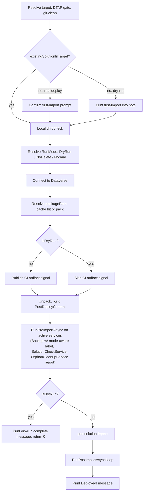

# Deploy Dry-Run - Plan

## Goal Capsule

- **Objective:** Add `--dry-run` to `deploy` — run every pre-deploy check (DTAP gate, git-clean, local drift, packing, solution checker, orphan-cleanup preview) and back up the target environment, but never call `pac solution import` or run post-import cleanup.
- **Authority hierarchy:** This plan's Requirements and Key Technical Decisions govern the approach.
- **Stop conditions:** None identified.
- **Execution profile:** Local implementation and testing.
- **Tail ownership:** Implementer commits locally. No push, no PR unless separately requested.

---

## Product Contract

### Summary

`deploy` has no way to preview a real run short of reading its own pre-flight output and stopping by hand. `flowline drift <target>` already covers a lighter, pack-free preview of the orphan-cleanup step alone ([[project_alm_thesis]] and `docs/plans/2026-07-07-002-feat-drift-preview-diff-engine-plan.md`, KTD11) — it is deliberately narrow and stays that way. This plan adds `deploy --dry-run`: it packs the solution, runs the DTAP gate, the local drift check, the solution-checker gate, and the orphan-cleanup report exactly as a real deploy would, and also creates a labeled environment backup — then stops before `pac solution import` and before any post-import cleanup.

### Problem Frame

A user who wants to know "would this deploy succeed, and what would it clean up?" today has to either run a real deploy and accept the consequences, or manually reconstruct the answer from `pack` + `drift` + reading the DTAP/solution-checker logic. `RunMode` already has an unused `DryRun` value (`src/Flowline.Core/Models/RunMode.cs:3`), established by `PushCommand --dry-run` (`src/Flowline/Commands/PushCommand.cs:75-78,256`) for exactly this "preview, never mutate" contract — `deploy` is the one command in the promote pipeline missing it.

The one wrinkle: whether the pre-deploy backup should run during a dry run. `pac admin backup` is not a bulk snapshot — Microsoft's docs confirm a manual backup is "just a timestamp and a label" backed by Azure SQL's continuous backup, retained for a fixed 7-28-day window with **no cap on how many manual backups an environment can hold** (learn.microsoft.com/power-platform/admin/backup-restore-environments). Running it on every dry run doesn't evict anything. The only real cost is that a dry-run backup and a real-deploy backup would otherwise carry the same `flowline-deploy-<solution>-<timestamp>` label shape, making them indistinguishable later in the admin center's Manual Backups tab.

### Requirements

**Flag and composition**
- R1. `deploy` accepts `--dry-run`: it runs every pre-deploy validation and creates a labeled environment backup, but never imports the solution and never runs post-import cleanup.
- R2. `--dry-run` composes unchanged with `--no-backup`, `--skip-solution-check`, and `--skip-dtap-check` — each still suppresses its own step during a dry run exactly as it does during a real deploy. `--no-delete` is redundant once `--dry-run` is set (R6 already forces the same report-only orphan behavior), not independently additive like the other three.

**Retained pre-flight checks**
- R3. The DTAP gate, the git-clean check, and the local plugin/web-resource drift check run identically under `--dry-run` and a real deploy — including the Dev-target block — so a dry run surfaces the same blockers a real deploy would hit.
- R4. Packing (or artifact-cache reuse) and the solution-checker gate (`SolutionCheckService`) run identically under `--dry-run`; a Critical finding still aborts the run with the same error a real deploy would raise.

**Backup**
- R5. `--dry-run` creates an environment backup by default, labeled distinctly from a real deploy's backup (`flowline-dryrun-...` vs `flowline-deploy-...`) so the two are distinguishable later in the Dataverse admin center.

**Orphan preview**
- R6. The orphan-cleanup report runs in report-only mode under `--dry-run`, regardless of `--no-delete` or the solution's managed status, with hint text that names it as a dry-run preview rather than reusing `--no-delete`'s phrasing.

**Skipped mutations and first-import friction**
- R7. `--dry-run` never calls `pac solution import`, never runs any `IPostDeployService.RunPostImportAsync`, and never emits the CI artifact-publish signal (`##vso`/`$GITHUB_OUTPUT`) — none of those describe or hand off a deployment that happened.
- R8. The first-deploy confirmation prompt is replaced by an informational note under `--dry-run` — a dry run never performs the irreversible action the prompt exists to gate, so blocking on it is pure friction.

**Messaging**
- R9. A completed dry run prints a distinct completion message naming that nothing was imported.

### Scope Boundaries

- `flowline drift <target>` is unchanged and not superseded — it stays the lighter, pack-free, orphan-only preview against any environment; `deploy --dry-run` is the fuller pre-flight (packing, solution checker, DTAP gate) and is complementary, not a replacement.
- No new flag to opt out of the dry-run backup beyond the existing `--no-backup`.
- No new comparison mechanism — the orphan report and the solution-checker output are the same ones a real deploy already produces; `--dry-run` only changes which of the surrounding steps run.
- `--force first-import` becomes a harmless no-op combined with `--dry-run` (the confirmation it would skip never fires under dry-run) — not validated as an error, not called out beyond this note. `--no-delete` is likewise redundant under `--dry-run` (R2) — not validated as an error either.
- No new automated test drives `DeployCommand.ExecuteFlowlineAsync` end-to-end to prove `--dry-run` never calls `pac solution import` — no existing `DeployCommand` test does this today (see U3's Test scenarios), so the never-import guarantee is verified by manual check against a sandbox environment, the same bar the rest of `DeployCommand` is held to. Building a mockable process-launch seam for `DeployCommand` is a larger, separate undertaking, not scoped here.

### System-Wide Impact

- **CI/CD consumers are unaffected.** `PublishArtifactForCi` never fires under `--dry-run` (R7), so no downstream Azure DevOps or GitHub Actions stage can mistake a dry-run pack for a promotable artifact.
- **`OrphanCleanupService` mutation paths are untouched.** `ExecuteInOrderAsync` — the only place that calls `Delete`/`RemoveSolutionComponent` — is reached solely through `RunPreImportAsync`'s post-`NoDelete`-check branch, which `RunMode.DryRun` now short-circuits identically to `RunMode.NoDelete` (KTD2). `PluginAssemblyFamilyHandler`'s own `RunMode` check (also widened by KTD2) only ever changes classification/priority, never whether `ExecuteInOrderAsync` runs — no new call path into live deletion is introduced anywhere.
- **The target environment's Manual Backups list gains entries.** Frequent `--dry-run` use (e.g. one per CI-validated PR) adds one `flowline-dryrun-...` backup per run — informational, not destructive (confirmed no retention-eviction risk per the Problem Frame), and distinctly labeled so it doesn't get confused with a real pre-deploy checkpoint.
- **`flowline drift` is untouched.** It doesn't share code with the changed `RunMode`/`BuildNoDeleteHint` call sites — its own `CompareAsync` overload hardcodes `RunMode.NoDelete` directly (`OrphanCleanupService.cs:162-169`), never passing through the branches this plan modifies.

---

## Planning Contract

### Key Technical Decisions

- **KTD1 — Reuse `RunMode.DryRun`, don't force `RunMode.NoDelete`.** `RunMode` already has three values (`Normal`, `NoDelete`, `DryRun`); `--dry-run` sets `PostDeployContext.Mode = RunMode.DryRun` instead of forcing `NoDelete`. This is the only signal that distinguishes a dry run from a real managed-first-install deploy (both would otherwise sit at `NoDelete`), and `BackupService` needs exactly that distinction to choose its label prefix (KTD3).
- **KTD2 — Every `NoDelete`-only check across orphan-cleanup becomes `NoDelete`-or-`DryRun`, including one inside a handler.** Four call sites compare `mode == RunMode.NoDelete` to decide "report only, never execute": three in `src/Flowline.Core/OrphanCleanup/OrphanCleanupService.cs` (`RunPreImportAsync`'s early return, `RunPostImportAsync`'s early return, `PrintReport`'s label/summary branch), plus one inside `PluginAssemblyFamilyHandler.DetectAsync` (`src/Flowline.Core/OrphanCleanup/Handlers/PluginAssemblyFamilyHandler.cs:92`), which forces every claimed plugin-assembly-family candidate to `OrphanPriority.Prio1` under `NoDelete` and otherwise fires a live enabled-state query to compute Prio2/Prio3. Left unwidened, a dry run on a managed solution would take that handler's live-query branch instead of `NoDelete`'s forced-Prio1 branch — an extra query and a different priority grouping than the real (managed → `NoDelete`) deploy it's supposed to preview, breaking R6's "regardless of ... managed status" guarantee. All four sites become `mode is RunMode.NoDelete or RunMode.DryRun`. Passing `RunMode.DryRun` through unwidened would otherwise fall through to each site's execute/live-query path during a dry run.
- **KTD3 — `BackupService` reads `context.Mode` to pick the label prefix.** `PacUtils.BuildBackupLabel` gains an optional `dryRun` parameter (default `false`, so the two existing tests keep passing unmodified); `BackupService.RunPreImportAsync` passes `context.Mode == RunMode.DryRun`. A real deploy (`Normal` or `NoDelete`, e.g. a managed first install) still gets `flowline-deploy-...`; only `RunMode.DryRun` gets `flowline-dryrun-...`.
- **KTD4 — `BuildNoDeleteHint` gains a `RunMode` parameter, defaulted so existing tests are untouched.** `internal static string BuildNoDeleteHint(DeploySolutionInfo solution, RunMode mode = RunMode.NoDelete)` — a `mode == RunMode.DryRun` check returns `"(--dry-run preview)"` before the existing managed/unmanaged/exists-in-target branching runs. The default keeps `OrphanCleanupServiceTests.BuildNoDeleteHint_ReturnsExpected`'s four existing cases (all implicitly `NoDelete`) passing with zero assertion changes, matching this codebase's established "extraction must not require existing test changes" bar (`docs/solutions/architecture-patterns/orphan-cleanup-two-phase-deploy-pipeline.md`).
- **KTD5 — Pre-import checks (DTAP, git-clean, local drift, packing, solution checker, orphan preview, backup) are the exact same code path for dry-run and real deploy — this is what satisfies R3 and R4, rather than either requirement having its own implementation unit.** `--dry-run` only changes what happens *after* that shared path: skip `ImportSolutionAsync`, skip the `RunPostImportAsync` loop, skip `PublishArtifactForCi`, print a different completion message. This is a single branch late in `ExecuteFlowlineAsync`, not a parallel dry-run code path — minimizes the risk of dry-run and real-deploy behavior silently diverging on the checks that matter most.
- **KTD6 — Skipping `RunPostImportAsync` entirely for dry-run is safe by construction.** `OrphanCleanupService.RunPreImportAsync` returns before populating `_deferred`/`_postImportOnly` whenever `context.Mode is RunMode.NoDelete or RunMode.DryRun` (KTD2) — both stay empty, so even if `RunPostImportAsync` were called it would no-op (`candidates.Count == 0`). `BackupService`/`SolutionCheckService`'s `RunPostImportAsync` are unconditional no-ops already. Skipping the whole loop for dry-run is therefore behavior-preserving, not just a shortcut.
- **KTD7 — The first-import confirmation becomes an info note, not a skipped step.** A new pure function `BuildFirstImportDryRunNote(solutionName, targetDisplayName, includeManaged)` mirrors `BuildFirstImportPrompt`'s wording but as a statement; `ExecuteFlowlineAsync` prints it via `Console.Info` when `!existingSolutionInTarget && isDryRun`, instead of calling `ConsoleHelper.Confirm`.

### High-Level Technical Design

---

## Implementation Units

### U1. Add `--dry-run` flag and `RunMode` resolution

**Goal:** `deploy` accepts `--dry-run`; the existing inline `runMode` ternary becomes a testable, dry-run-aware pure function.

**Requirements:** R1, R2

**Dependencies:** None — foundation unit.

**Files:**
- `src/Flowline/Commands/DeployCommand.cs` — add `DryRun` to `Settings` (near `NoDelete`, `DeployCommand.cs:49-52`); replace the inline `var runMode = settings.NoDelete || sln.IncludeManaged ? RunMode.NoDelete : RunMode.Normal;` (`DeployCommand.cs:149`) with a call to a new `internal static RunMode ResolveRunMode(bool dryRun, bool noDelete, bool includeManaged)`.
- `tests/Flowline.Tests/DeployCommandDryRunTests.cs` (new)

**Approach:** `[CommandOption("--dry-run")]` with description along the lines of "Run every pre-deploy check and back up the target, without importing the solution" (final wording subject to `/tone`) — `dryRun` takes precedence over `noDelete`/`includeManaged` in the resolver, since a dry run is always the most restrictive mode regardless of what those two would otherwise select.

**Patterns to follow:** The codebase's established pure-decision-method style for exactly this kind of branch (`ResolveDtapGate`, `ResolveCacheOutcome`, `DtapVersionMatches` — all `internal static`, all unit-tested without a live PAC/Dataverse connection).

**Test scenarios:**
- Happy path: `dryRun: true, noDelete: false, includeManaged: false` → `RunMode.DryRun`.
- Edge case: `dryRun: true, noDelete: true, includeManaged: true` → still `RunMode.DryRun` (dry-run takes precedence over both).
- Regression: `dryRun: false, noDelete: true, includeManaged: false` → `RunMode.NoDelete` (existing behavior unchanged).
- Regression: `dryRun: false, noDelete: false, includeManaged: true` → `RunMode.NoDelete` (existing behavior unchanged).
- Regression: `dryRun: false, noDelete: false, includeManaged: false` → `RunMode.Normal` (existing behavior unchanged).

**Verification:** `dotnet test tests/Flowline.Tests/Flowline.Tests.csproj --filter DeployCommandDryRunTests` passes.

---

### U2. Skip the first-import confirmation under dry-run

**Goal:** Replace the blocking confirmation prompt with an informational note when `--dry-run` is set and the solution has never been deployed to the target.

**Requirements:** R8

**Dependencies:** U1 (needs the resolved dry-run flag in scope)

**Files:**
- `src/Flowline/Commands/DeployCommand.cs` — new `internal static string BuildFirstImportDryRunNote(string solutionName, string targetDisplayName, bool includeManaged)` beside `BuildFirstImportPrompt` (`DeployCommand.cs:320-323`); branch the existing `if (!existingSolutionInTarget) { ... }` block (`DeployCommand.cs:126-134`) on `settings.DryRun`.
- `tests/Flowline.Tests/DeployCommandFirstImportTests.cs` — extend with the new note function's tests.

**Approach:** When `!existingSolutionInTarget`: real deploy keeps calling `ConsoleHelper.Confirm(BuildFirstImportPrompt(...), false, settings, "first-import")` exactly as today; dry-run instead calls `Console.Info(BuildFirstImportDryRunNote(...))` and continues — never returns `ExitCode.Cancelled`, since there is nothing to cancel.

**Patterns to follow:** `BuildFirstImportPrompt`'s own managed/unmanaged wording split and its "pure so it's unit-testable without a live PAC CLI" rationale (`DeployCommand.cs:318-319`).

**Test scenarios:**
- Happy path: managed, note names that the real deploy will ask for confirmation before importing.
- Happy path: unmanaged, same shape with unmanaged-appropriate wording.
- Regression: `existingSolutionInTarget: true` — neither the prompt nor the note fires, for dry-run or real deploy (unchanged existing behavior).
- Regression: `--dry-run` not set, `existingSolutionInTarget: false` — the existing `ConsoleHelper.Confirm` path is unchanged and can still return `ExitCode.Cancelled`.

**Verification:** `dotnet test tests/Flowline.Tests/Flowline.Tests.csproj --filter DeployCommandFirstImportTests` passes.

---

### U3. Gate deploy-only mutations behind dry-run

**Goal:** Skip `pac solution import`, the post-import `RunPostImportAsync` loop, and the CI artifact-publish signal under `--dry-run`; print a distinct completion message instead.

**Requirements:** R1, R7, R9

**Dependencies:** U1

**Files:**
- `src/Flowline/Commands/DeployCommand.cs` — guard `PublishArtifactForCi(...)` (`DeployCommand.cs:205`) with `if (!settings.DryRun)`; after the existing `activeServices` `RunPreImportAsync` loop (`DeployCommand.cs:224-225`), branch on `settings.DryRun`: dry-run prints the new completion message and returns `0`; real deploy keeps the existing `ImportSolutionAsync` call, `RunPostImportAsync` loop, and `"Deployed!"` message (`DeployCommand.cs:227-242`) exactly as today.
- `tests/Flowline.Tests/DeployCommandDryRunTests.cs` — add the new completion-message function's tests (same file as U1).

**Approach:** New `internal static string BuildDryRunCompleteMessage(string solutionName, string targetDisplayName)`, e.g. "Dry run complete — `{solutionName}` would deploy cleanly to `{targetDisplayName}`. Run without `--dry-run` to make it real." (final wording subject to `/tone`). The branch sits after the shared pre-import block (KTD5) so every check up to and including the orphan-cleanup report still runs identically for both paths.

**Patterns to follow:** `PublishArtifactForCi`'s own "fires regardless of import outcome" comment (`DeployCommand.cs:202-205`) is scoped to *whether import throws*, not *whether import runs at all* — dry-run is a new case that comment didn't cover, so the guard here is a deliberate, documented exception to it, not a contradiction.

**Test scenarios:**
- Happy path: `BuildDryRunCompleteMessage` names both the solution and the target.
- Test expectation: none for the `ExecuteFlowlineAsync` branch itself beyond the pure message function above — this codebase's established pattern (per `DriftCommandTests`' verification note, `docs/plans/2026-07-07-002-feat-drift-preview-diff-engine-plan.md` U3) is that no existing `DeployCommand` test drives a full `ExecuteFlowlineAsync` against a mocked Dataverse connection; the branch itself is exercised by manual verification (see Verification Contract).

**Verification:** `dotnet test tests/Flowline.Tests/Flowline.Tests.csproj --filter DeployCommandDryRunTests` passes; manual check — `flowline deploy <target> --dry-run` against a real or sandbox environment completes without calling `pac solution import` (confirm via `--verbose` or by checking the target's solution version is unchanged).

---

### U4. Distinguish the dry-run backup label

**Goal:** A dry-run backup is labeled `flowline-dryrun-<solution>-<timestamp>`, distinct from a real deploy's `flowline-deploy-<solution>-<timestamp>`.

**Requirements:** R5

**Dependencies:** U1 (needs `RunMode.DryRun` reaching `PostDeployContext.Mode`)

**Files:**
- `src/Flowline/Utils/PacUtils.cs` — `BuildBackupLabel` (`PacUtils.cs:355-356`) gains an optional `bool dryRun = false` parameter.
- `src/Flowline/Services/BackupService.cs` — `RunPreImportAsync` (`BackupService.cs:11-16`) passes `context.Mode == RunMode.DryRun`.
- `tests/Flowline.Tests/PacUtilsBackupTests.cs` — extend `BuildBackupLabelTests` with dry-run cases.

**Approach:** `BuildBackupLabel(solutionName, utcNow, dryRun: false)` → `$"flowline-{(dryRun ? "dryrun" : "deploy")}-{solutionName}-{utcNow:yyyyMMddTHHmmssZ}"`. `--no-backup` still suppresses `BackupService` entirely for both real and dry-run deploys (unchanged `IsSkipped` check, `DeployCommand.cs:218-220`).

**Patterns to follow:** `BuildBackupLabel`'s existing deterministic-format test shape.

**Test scenarios:**
- Regression: `BuildBackupLabel("ContosoCustomizations", utcNow)` (no third argument) → unchanged `"flowline-deploy-ContosoCustomizations-..."` (existing test, must keep passing unmodified).
- Happy path: `BuildBackupLabel("ContosoCustomizations", utcNow, dryRun: true)` → `"flowline-dryrun-ContosoCustomizations-..."`.
- Edge case: `dryRun: true` with a solution name containing spaces → spaces preserved, mirroring the existing `PreservesSpacesInSolutionName` case.

**Verification:** `dotnet test tests/Flowline.Tests/Flowline.Tests.csproj --filter BuildBackupLabelTests` passes.

---

### U5. Orphan-cleanup `DryRun` parity in `OrphanCleanupService`

**Goal:** `RunMode.DryRun` gets the exact same report-only treatment `RunMode.NoDelete` gets today, with dry-run-specific hint text.

**Requirements:** R6

**Dependencies:** U1

**Files:**
- `src/Flowline.Core/OrphanCleanup/OrphanCleanupService.cs` — three `mode == RunMode.NoDelete` checks (`RunPreImportAsync` line 136, `RunPostImportAsync` line 398, `PrintReport` lines 884 and 900) become `mode is RunMode.NoDelete or RunMode.DryRun` (KTD2); `BuildNoDeleteHint` (lines 149-152) gains the `RunMode mode = RunMode.NoDelete` parameter and dry-run branch (KTD4); its one call site — `BuildNoDeleteHint(context.Solution)` inside `RunPreImportAsync` (line 134) — becomes `BuildNoDeleteHint(context.Solution, context.Mode)`.
- `src/Flowline.Core/OrphanCleanup/Handlers/PluginAssemblyFamilyHandler.cs` — the `context.Mode == RunMode.NoDelete` check (line 92) becomes `context.Mode is RunMode.NoDelete or RunMode.DryRun` (KTD2).
- `tests/Flowline.Core.Tests/OrphanCleanupServiceTests.cs` — extend `BuildNoDeleteHint_ReturnsExpected` with `RunMode.DryRun` cases; add a `CompareAsync`/`RunPreImportAsync` regression case asserting `RunMode.DryRun` never reaches `ExecuteInOrderAsync` (mirroring the existing `RunMode.NoDelete` characterization test from `docs/plans/2026-07-07-002-feat-drift-preview-diff-engine-plan.md` U2).
- `tests/Flowline.Core.Tests/OrphanCleanup/Handlers/PluginAssemblyFamilyHandlerTests.cs` — add a `RunMode.DryRun` case asserting the same forced-`Prio1`, no-live-query behavior as the existing `RunMode.NoDelete` case.

**Approach:** No change to identity resolution, handler dispatch, or any trust-bar guard (`SupportedManualTypes`, the empty-live/empty-`Solution.xml` short-circuits, `RetrieveAllAsync`, the `ConditionOperator.In` cap, per-table fault isolation) — this unit only widens which `RunMode` values count as "report, don't execute," including the one handler that branches on `RunMode` itself rather than deferring to the shared `OrphanCleanupService` gate.

**Patterns to follow:** This codebase's existing "extraction/change must not require existing test assertion changes" bar for this exact service (`docs/solutions/architecture-patterns/orphan-cleanup-two-phase-deploy-pipeline.md`).

**Test scenarios:**
- Regression: all four existing `BuildNoDeleteHint_ReturnsExpected` cases pass unmodified (default `mode` parameter keeps them at `NoDelete` behavior).
- Happy path: `BuildNoDeleteHint(solution, RunMode.DryRun)` → `"(--dry-run preview)"` regardless of `includeManaged`/`existsInTarget` (add cases for both combinations to confirm the dry-run branch short-circuits before the existing managed/unmanaged logic).
- Regression: `RunPreImportAsync` with `context.Mode == RunMode.DryRun` returns after the comparison — `ExecuteInOrderAsync` is never called (assert via no delete/remove calls reaching the mocked `IOrganizationServiceAsync2`, mirroring the existing `RunMode.NoDelete` coverage).
- Happy path: `PrintReport` output under `RunMode.DryRun` uses "would delete"/"would remove from solution" labels, matching `RunMode.NoDelete`'s existing wording exactly except for the hint line.
- Happy path: `PluginAssemblyFamilyHandler.DetectAsync` under `RunMode.DryRun` forces every claimed candidate to `OrphanPriority.Prio1` and never calls the live enabled-state query — the same outcome as the existing `RunMode.NoDelete` test, not the live-query branch.

**Verification:** `dotnet test tests/Flowline.Core.Tests/Flowline.Core.Tests.csproj --filter "OrphanCleanupServiceTests|PluginAssemblyFamilyHandlerTests"` passes with zero modified assertions on the four pre-existing `BuildNoDeleteHint_ReturnsExpected` cases or the existing `PluginAssemblyFamilyHandlerTests` `RunMode.NoDelete` case.

---

### U6. Documentation — wiki and CHANGELOG

**Goal:** `07-Deploy.md`, `03-Command-Reference.md`, and `CHANGELOG.md` describe `--dry-run`.

**Requirements:** Supports R1-R9 (documentation of shipped behavior).

**Dependencies:** U1-U5

**Files:**
- `07-Deploy.md` (wiki repo, `../Flowline.wiki` relative to this repo per `AGENTS.md`) — add `--dry-run` to the flags table (mirroring the existing `--no-backup`/`--no-delete`/`--skip-solution-check` rows) and one line in the numbered pre-deploy-steps list noting that `--dry-run` runs steps 1-6 (through orphan cleanup) and stops before import.
- `03-Command-Reference.md` (wiki repo) — add `--dry-run` to `deploy`'s flag reference.
- `CHANGELOG.md` — `[Unreleased]/Added`: `deploy --dry-run`, one paragraph naming what runs (including the labeled backup) and what's skipped.

**Approach:** Text-only edits, no code. Confirm the wiki checkout exists at `../Flowline.wiki` before editing (per `AGENTS.md`'s "do not silently skip required wiki updates" rule); report if it's unavailable.

**Test scenarios:** Test expectation: none — documentation only.

**Verification:** Wiki's `07-Deploy.md` flags table and step list, and `03-Command-Reference.md`'s `deploy` entry, both show `--dry-run`; `CHANGELOG.md`'s `[Unreleased]/Added` names it.

---

## Verification Contract

- `dotnet build src/Flowline.Core/Flowline.Core.csproj` — 0 errors.
- `dotnet build src/Flowline/Flowline.csproj` — 0 errors.
- `dotnet test tests/Flowline.Core.Tests/Flowline.Core.Tests.csproj --filter "OrphanCleanupServiceTests|PluginAssemblyFamilyHandlerTests"` — U5, zero modified assertions in the four pre-existing `BuildNoDeleteHint_ReturnsExpected` cases or the existing `PluginAssemblyFamilyHandlerTests` `RunMode.NoDelete` case.
- `dotnet test tests/Flowline.Tests/Flowline.Tests.csproj` — full run; covers U1-U4 (`DeployCommandDryRunTests`, `DeployCommandFirstImportTests`, `BuildBackupLabelTests`) plus regression on every existing `DeployCommand`/`PacUtils` test.
- Manual verification: `flowline deploy <target> --dry-run` against a sandbox/test environment — completes without importing (target's solution version unchanged), creates a `flowline-dryrun-...` backup entry, and prints the dry-run completion message.
- `/tone` review on the new user-facing strings (`BuildFirstImportDryRunNote`, `BuildDryRunCompleteMessage`, the `(--dry-run preview)` orphan-report hint, the `--dry-run` option description) against `docs/tone-of-voice.md`.

## Definition of Done

- U1-U6 complete; `deploy --dry-run` runs every pre-deploy check and the labeled backup, never imports, never runs post-import cleanup, never publishes a CI artifact signal.
- `--no-backup`, `--skip-solution-check`, and `--skip-dtap-check` each still suppress their own step under `--dry-run`; `--no-delete` remains a harmless redundant no-op alongside it (R2).
- `RunMode.DryRun` gets identical report-only treatment to `RunMode.NoDelete` everywhere orphan-cleanup branches on `RunMode` — `OrphanCleanupService` and `PluginAssemblyFamilyHandler` — with dry-run-specific hint text.
- Wiki (`07-Deploy.md`, `03-Command-Reference.md`) and `CHANGELOG.md` reflect the shipped flag.
- No dead code left from the `runMode` ternary this plan replaces with `ResolveRunMode`.
