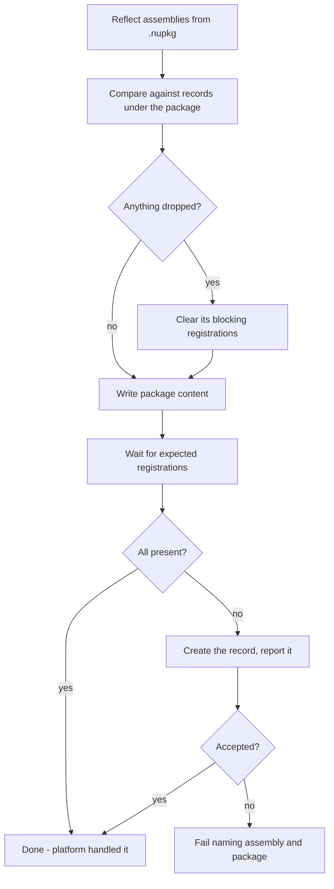
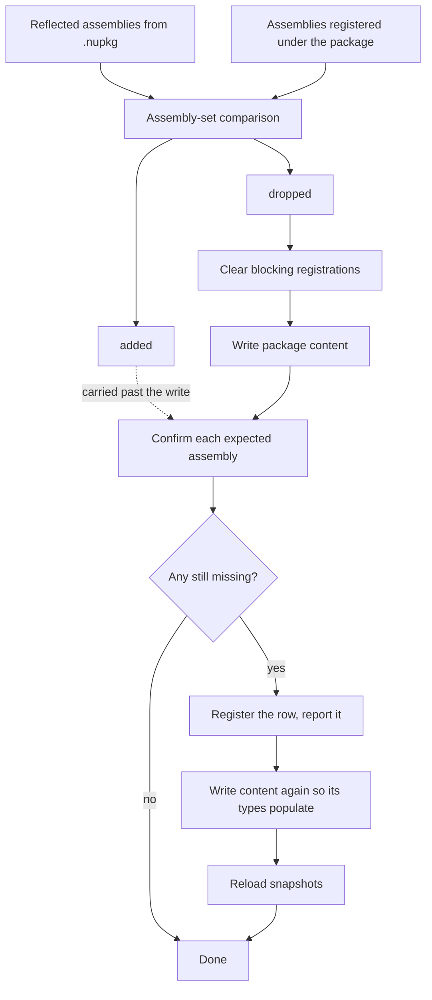

# Plugin Package Assembly Set Changes - Plan

## Goal Capsule

- **Objective:** Make `flowline push` handle a plugin package whose set of plugin-bearing assemblies has changed — an assembly added to the `.nupkg`, or one removed from it — without failing and without leaving the environment half-applied.
- **Product authority:** This plan owns the package content path in `push` (`SyncSolutionFromPackageAsync`). The classic single-assembly path, orphan cleanup, and `deploy` are context, not active scope.
- **Open blockers:** None. The platform behavior is measured, the workaround is proven live, and the product decisions are settled.

---

## Product Contract

### Summary

`push` decides the whole assembly-set change before it writes package content: which assemblies are being added, which are being dropped, and what has to be cleared first. When Dataverse declines to register an added assembly — which it always does today — `push` registers it directly and reports that it did.

### Problem Frame

A Dataverse plugin package is a NuGet package holding one or more plugin-bearing assemblies. Microsoft documents the registration contract plainly: *"When you upload your NuGet package, any assemblies that contain classes that implement the `IPlugin` interface are registered in the `PluginAssembly` table and associated with the plug-in package."* No exception is stated for updates.

That contract holds on create and breaks on update. A package created from a `.nupkg` containing two plugin-bearing DLLs registers both assemblies. The same `.nupkg` uploaded as an *update* to an existing package registers only the assemblies already known — a newly added one is silently ignored. The package content in the org then contains a DLL that nothing points at.

`push` hits this because it waits for the registration it was promised. Its bounded retry expires, and it fails with `Timed out waiting for Dataverse to auto-create plugin assembly record(s)` — after the content write has already committed. The message names a timeout for something that will never arrive, blames the project whose pass was running, and leaves the org in a state a re-run does not recover.

The mirror case fails too, for a different and *documented* reason: dropping an assembly whose plugin types still carry step registrations is rejected by design, and the remedy is to clear those registrations first.

The cost lands on the shape this repo is built for. A consultant splitting a growing plugin project into two, or folding a shared plugin library into an existing package, hits a failed push whose only recovery is deleting and recreating the package by hand — which destroys every step registration in it.

### Platform Findings

Measured live against a Dataverse environment on 2026-07-29/30. These findings are the justification for every decision below, and are recorded in full because the behavior is undocumented and unreported elsewhere.

**What Dataverse does on a package content update:**

| Change in the `.nupkg` | Dataverse behavior on update |
|---|---|
| New class in an already-registered assembly | Registers the new plugin type |
| Changed code in an already-registered assembly | Updates it |
| Assembly removed from the package | Removes it — but only once its types carry no step registrations |
| **Assembly added to the package** | **Nothing. No record is created, ever.** |

Only the last row is broken. The others were each confirmed by observation during the same sessions.

**Four independent checks establish that the add case is a genuine platform gap, not a local fault:**

1. **It is not latency.** Package content was written at 18:57:07 with a second plugin-bearing DLL present. The assembly was still absent at 19:15:32 — over 18 minutes later — with no other activity against the environment. An earlier session reached the same conclusion at a shorter interval.
2. **It is not how Flowline writes the update.** `pac plugin push --type Nuget` against the same package with the same `.nupkg` reported `Plug-in package was updated successfully` and left the assembly equally unregistered. Microsoft's own tool has the gap and reports success.
3. **The platform is capable of it.** Deleting the package and pushing the identical two-DLL `.nupkg` as a *create* registered both assemblies, both as solution components.
4. **The probe assembly was valid.** SDK-style project, `net462`, strong-named with the same key, one class directly implementing `IPlugin` — every documented requirement met, and the type was reflected correctly by the push before upload.
5. **Re-writing the content does not help.** Two consecutive pushes each wrote the same two-DLL content and both failed identically, leaving the assembly unregistered. A third write through PAC did the same. Nothing short of creating the record registers it.

**The package version is not the lever.** The obvious first hypothesis — that Dataverse re-enumerates only on a version change — is contradicted by documentation and by observation. Microsoft: *"The version of the plug-in package or plug-in assembly is not a factor in any upgrade behaviors"*, and separately, *"The name and version of the plug-in package cannot be changed once created."* Across a dozen pushes the local `.nupkg` version never moved while code changes, new classes, new Custom APIs and removed classes all applied normally. Content is synced by content.

This is worth stating explicitly because a real and well-known versioning rule exists nearby and does not apply here: for *classic* (non-package) assemblies, a build or revision change is an in-place upgrade while a major or minor change makes Dataverse treat the assembly as a different one, leaving existing steps pointed at the old version. Those rules govern solution import of classic assemblies. They do not carry over to plugin packages.

**Registering the assembly directly works, and the code runs.** Verified in four steps:

1. Creating a `pluginassembly` row with `packageid` set is accepted — but only with sandbox isolation. Without it the create is rejected outright: `'<assembly>' is not allowed to be registered in full-trust mode, assembly must be registered in isolation.`
2. The row lands inert — zero plugin types immediately after the create.
3. The next package content update populates its plugin types, after which an ordinary `push` completes and registers the assembly's steps.
4. The assembly genuinely executes. The probe plugin was changed to throw a recognizable exception, pushed, and a real record update returned that exact message — proving the sandbox loads and runs the type out of the package content for a hand-created row. The earlier no-op version of the same check proved nothing, because a silently skipped step is indistinguishable from a step that ran and did nothing.

**The drop case is documented, unlike the add case.** Microsoft: *"If your update removes any plug-in assemblies, or types which are used in plug-in step registrations, the update will be rejected. You must manually remove any step registrations that use plug-in assemblies or plug-in types that you want to remove with your update."* Related and relevant to orphan cleanup: a package cannot be deleted while any step registrations remain against its assemblies.

**Nobody appears to have written this up.** Community coverage of plugin packages is almost entirely about *dependent* assemblies — shipping a helper library or a serializer alongside one plugin assembly, which is the scenario Microsoft's own documentation leads with. Two or more *plugin-bearing* assemblies in a single package is barely covered. The nearest adjacent complaints concern classic assemblies and the version rules above, which are a different mechanism.

### Key Decisions

- **Wait, then register.** `push` keeps the existing bounded confirm-retry and creates the row only when that wait expires. The wait is the detection mechanism: if Microsoft ever fixes the gap, the retry starts succeeding and the fallback stops firing on its own, with no version sniffing and nothing to rip out later. Governs R4, R5.
- **Self-registration is ungated** (session-settled: user-directed — chosen over a new `--force` specifier and over silent operation: a gated push has no other way to succeed, and refusing would fight `push`'s low-friction role). Creating a row is additive and repairs a state the user asked for by pushing. Governs R6, R7.
- **Decide the assembly-set change before writing content** (session-settled: user-directed — chosen over accepting the current ordering and over transactional rollback: the query is already needed for the drop path, so the information is free). Governs R1, R2, R3.
- **Prefer the platform; forge only where a gap is proven; keep the fallback self-limiting.** This is the general stance the work establishes, not a rule for this case alone. Flowline does not pre-empt platform behavior it has not measured, and any substitute it does perform is structured so the platform reclaims the job automatically once it works.
- **Match the classic path's restraint on derived metadata.** The existing classic registration sets only what it knows from the assembly and leaves `culture` and `publickeytoken` for Dataverse to derive. The forged package row follows the same principle, setting the minimum the create requires.

### Requirements

**Assembly-set pre-flight**

- R1. Before writing package content, `push` compares the assemblies reflected from the local `.nupkg` against those registered under the existing package, and determines which are being added and which are being dropped.
- R2. `--dry-run` reports the assembly-set change — each assembly that would be added and each that would be dropped — rather than only that package content would update.
- R3. A failure to determine the assembly-set plan, or to clear what a drop requires, surfaces before the package content write commits. Registration outcomes are necessarily later — R8 owns that case.

**Registering an added assembly**

- R4. After the content write, `push` waits for Dataverse to register each expected assembly, using a bounded retry.
- R5. When the wait expires with an expected assembly still unregistered, `push` creates the `pluginassembly` record itself, associated with the package and registered in sandbox isolation.
- R6. Self-registration requires no `--force` specifier.
- R7. `push` reports each assembly it registered itself, naming the assembly, in normal (non-verbose) output.
- R8. When self-registration is itself rejected, `push` fails with a message naming the assembly and its package and stating that the package content now contains a DLL with no registration — never as a timeout.

**Dropping an assembly**

- R9. When an assembly is being dropped from the package, `push` clears the registrations that block its removal — its images, Custom API parameters and properties, steps, and Custom APIs — before the content write.
- R10. Custom APIs are cleared only when they name one of the dropped assembly's own plugin types as their implementation.
- R11. Plugin types and the `pluginassembly` record of a dropped assembly are left for the content update to remove.
- R12. Under `--no-delete`, `push` does not clear a dropped assembly's registrations and warns that the update will be rejected.

**Reporting**

- R13. Both the added and dropped paths name the affected assembly in output; neither acts silently.

### Key Flows

- F1. Assembly added to an existing package
  - **Trigger:** The local `.nupkg` contains a plugin-bearing assembly with no `pluginassembly` record under the package.
  - **Steps:** Pre-flight identifies the addition; content is written; `push` confirms each expected assembly; the confirm expires; `push` creates the record, writes the content again so the plugin types populate, and the assembly's steps register.
  - **Outcome:** Push completes, having reported the assembly it registered.
  - **Covered by:** R1, R4, R5, R6, R7

- F2. Assembly dropped from an existing package
  - **Trigger:** A `pluginassembly` record exists under the package for an assembly the local `.nupkg` no longer contains.
  - **Steps:** Pre-flight identifies the drop; blocking registrations are cleared; content is written; Dataverse removes the plugin types and the assembly record.
  - **Outcome:** Push completes and the dropped assembly is gone from the environment.
  - **Covered by:** R1, R9, R10, R11, R13

- F3. The platform starts doing its job
  - **Trigger:** An assembly is added and Dataverse registers it during the confirm-retry.
  - **Steps:** The wait succeeds; the self-registration branch never runs.
  - **Outcome:** Push completes with no forged record and nothing reported as registered by Flowline.
  - **Covered by:** R4

### Acceptance Examples

Acceptance is established by live integration runs against the DEV environment with the resulting records queried and compared against expectations — not by unit tests alone.

- AE1. **Covers R1, R4, R5, R7.** Given a package registered with one assembly, when a second plugin-bearing assembly is added to the project and pushed, then the push exits 0, the output names the assembly Flowline registered, and a query returns two `pluginassembly` records under the package.
- AE2. **Covers R5.** Given the state in AE1, when a record that fires the added assembly's step is updated, then the plugin executes — verified by a plugin that throws a recognizable exception, not by absence of error.
- AE3. **Covers R9, R10, R11, R13.** Given a package registered with two assemblies where one has a registered step, when that assembly is removed from the project and pushed, then the push exits 0, the output names the assembly being cleared, and a query shows the assembly, its plugin types and its step all gone.
- AE4. **Covers R10.** Given a Custom API sharing the publisher prefix but implemented by a plugin type in a different assembly, when an assembly is dropped, then that Custom API still exists afterwards.
- AE5. **Covers R2.** Given a pending assembly-set change, when `--dry-run` runs, then the preview names the assemblies that would be added and dropped, and a query afterwards shows the environment unchanged.
- AE6. **Covers R12.** Given a pending assembly drop, when pushed with `--no-delete`, then no registration is cleared and the output warns that the update will be rejected.

### Scope Boundaries

- Deleting and recreating the package to force re-registration. It works, but it destroys every assembly, plugin type and step registration in the package and changes every record identifier — a disproportionate remedy for a single missing row.
- Rolling back the package content write when a later step fails. The pre-flight in R3 removes most of the exposure, and R8 makes the residue legible rather than eliminating it: a rejected registration still leaves content the org cannot use. Restoring prior content would mean Flowline holding and re-uploading it, where a failed restore leaves a worse state than the one it prevented.
- Creating plugin types directly. The content update populates them once the assembly record exists; there is no measured case requiring Flowline to create them.
- Any change to how classic (non-package) assemblies register.
- Reporting the platform gap to Microsoft, or working around it in `deploy`.

### Dependencies / Assumptions

- The drop path (R9–R12) already ships as of commit `b79642a` and its follow-up, but this plan folds its discovery into the shared pre-flight (KTD1), so that code is reopened and its live verification has to be re-earned rather than inherited.
- Assumed: the gap is environment-independent. It reproduced consistently in one environment through both Flowline and PAC, but has not been checked against a second tenant or region.
- The bounded retry behind R4 is a check, not a latency accommodation. Measured on a package create: both assemblies carried `createdon` timestamps *earlier* than the moment the create call returned, and the next milestone landed 3.2s later — too fast for the loop to have spent its sleeps. Its budget therefore needs no change.

### Outstanding Questions

**Deferred to Implementation**

- The exact minimum field set the forged record needs. KTD3 settles the method — start from the smallest set and add only what Dataverse rejects the create without — but the resulting set is a finding of U3, not something this plan pins.
- Whether the confirm-retry's attempt count and delay should become overridable for tests. U3's scenarios are the first to drive the loop to full expiry, which costs several real seconds per test at the current constants. Worth deciding when writing those tests rather than now.

### Sources / Research

- [Build and package plug-in code](https://learn.microsoft.com/power-apps/developer/data-platform/build-and-package) — the registration contract, the SDK-style project requirement, and the note that signing is not required for package assemblies.
- [Create and register a plug-in package using PAC CLI](https://learn.microsoft.com/power-platform/developer/howto/cli-create-package#plug-in-package-management) — the update-rejection rule for removed assemblies and types, the statement that version is not a factor in upgrade behaviors, and the package name/version immutability.
- [Create and register a plug-in package using Visual Studio](https://learn.microsoft.com/power-platform/developer/howto/vs-create-package#plug-in-package-management) — what deleting a package destroys.
- [Register a plug-in: assembly versioning](https://learn.microsoft.com/power-apps/developer/data-platform/register-plug-in#assembly-versioning) — the classic-assembly version rules that do *not* apply to packages.
- `docs/test-findings/changing-a-plugin-packages-assemblies-breaks-push.md` — the finding this plan resolves, with the original reproductions.
- `docs/test-findings/push-delete-orphans-fails-on-package-owned-assembly.md` — the orphan-cleanup work that established the package-ownership queries this plan reuses.
- `src/Flowline.Core/Plugins/PluginService.cs` — `SyncSolutionFromPackageAsync` (package create/update, confirm-retry), and the classic registration path whose field restraint the forged record follows.
- `src/Flowline/Commands/PushCommand.cs` — `--force` specifier registration, for the decision not to add one.
- `docs/solutions/integration-issues/dataverse-orphan-assembly-delete-blocked-by-step-dependencies.md` — the reverse-dependency delete order the drop path already follows.

---

## Planning Contract

**Product Contract preservation:** restructured, no scope change. Two entries were corrected in place by planning findings — the drop-path dependency now records that KTD1 reopens that code, and the retry assumption now records the measurement showing it is a check rather than a wait. Outstanding Questions lost two entries that this plan answered (KTD2, KTD3) and one that KTD1 answered. No requirement changed meaning; no R-ID moved.

### Key Technical Decisions

- KTD1. **One pre-flight comparison feeds both directions.** (session-settled: user-directed — chosen over leaving the shipped drop discovery in place: one query answers both questions and keeps the two halves from drifting apart.) The existing dropped-assembly lookup is absorbed rather than duplicated, which reopens live-verified code — see the Definition of Done. Governs R1, R3, R9.
- KTD2. **Self-register on any confirm-retry expiry, not only the add-to-an-existing-package case.** (session-settled: user-directed — chosen over special-casing the create path: measurement showed the retry is a check, not a latency accommodation, so an expiry means broken wherever it happens.) Governs R4, R5.
- KTD3. **Discover the forged record's field set empirically, starting from the smallest.** (session-settled: user-directed — chosen over mirroring the classic path's fields or reusing the probe's full set: the probe passed a placeholder public key token, and metadata Dataverse derives from the binary should not be asserted by Flowline.) Add a field only when the create is rejected without it. Governs R5.
- KTD4. **Create the record with the same direct request-plus-solution-name pattern the classic registration uses.** Research found no wrapper helper anywhere in the repo; introducing one for a single new call site would be a new abstraction with one consumer. Governs R5.
- KTD6. **After self-registering, write the package content again rather than creating the plugin types directly.** (session-settled: user-approved — chosen over having the planner create the types from a refetched empty snapshot: forging one row and letting the platform do the rest is what the policy above commits to, and widening the forgery to a whole type subtree is untested.) A freshly registered assembly owns no plugin types — the probe's row landed with zero, and they appeared only on the next content write. This is the sequence that was observed working end to end. **The order is load-bearing, not incidental:** two consecutive pushes, each writing the same content with no row created in between, both failed identically and registered nothing. The write populates types for assemblies Dataverse already knows about; it never learns of a new one from content alone. Cost: a push that adds an assembly uploads the same content twice. Governs R5.
- KTD5. **The live environment run is a named manual gate, not an automated test.** The acceptance signal is a real push against DEV with the resulting records queried back; unit tests cannot prove Dataverse's behavior, which is the entire subject of this work.

### High-Level Technical Design

The structural idea is one comparison with two consumers that fire at different points in the push — the reason KTD1 folds the shipped drop discovery in rather than leaving a second query beside it.

### Sequencing

U1 establishes the comparison, and U2 reads it. U3 is functionally independent of both — it changes the confirm step, which derives its own missing set — but it edits the same method as U1, so land them in a deliberate order. U4 documents whatever U2 and U3 land.

---

## Implementation Units

### U1. Shared assembly-set pre-flight

- **Goal:** One comparison of reflected-versus-registered assemblies, producing the added set and the dropped set, run before package content is written.
- **Requirements:** R1, R3, R9, R10, R11, R12, R13
- **Dependencies:** none
- **Files:** `src/Flowline.Core/Plugins/PluginService.cs`, `tests/Flowline.Core.Tests/PluginServiceTests.cs`
- **Approach:**
  1. Absorb the existing dropped-assembly lookup into a single comparison that returns both sets, per KTD1.
  2. Run it before the snapshot-and-plan step so its failure precedes the content write (R3).
  3. Keep the existing clearing behavior and its Custom API attribution rule (R10) unchanged in effect — this unit moves where the input comes from, not what happens to a dropped assembly.
- **Patterns to follow:** the reverse-dependency delete order recorded in `docs/solutions/integration-issues/dataverse-orphan-assembly-delete-blocked-by-step-dependencies.md`, already implemented on this path.
- **Test scenarios:**
  - Covers R1. A package with one registered assembly and a two-assembly `.nupkg` yields exactly one added and zero dropped.
  - Covers R1, R9. A package with two registered assemblies and a one-assembly `.nupkg` yields zero added and exactly one dropped.
  - An assembly present in both is classified as neither added nor dropped.
  - Covers R9, R10. A dropped assembly's steps and its own Custom APIs are deleted before the content write; a Custom API sharing the publisher prefix but implemented by another assembly's plugin type survives.
  - Covers R11. A dropped assembly's plugin types and its assembly record are not deleted by Flowline.
  - Covers R12. Under `--no-delete`, nothing is cleared and the run warns that the update will be rejected.
  - A brand-new package (nothing registered yet) yields every reflected assembly as added and nothing as dropped, without querying for a package that does not exist.
- **Verification:** the existing drop-path tests still pass unchanged in behavior, and the comparison is exercised directly rather than only through the drop path.

### U2. Dry-run preview of the assembly-set change

- **Goal:** `--dry-run` names the assemblies that would be added and dropped instead of reporting only that package content would update.
- **Requirements:** R2
- **Dependencies:** U1
- **Files:** `src/Flowline.Core/Plugins/PluginService.cs`, `tests/Flowline.Core.Tests/PluginServiceTests.cs`
- **Approach:** feed the comparison's two sets into the existing dry-run branch alongside the create-versus-update line it already prints.
- **Test scenarios:**
  - Covers R2. A pending add is named in the preview.
  - Covers R2. A pending drop is named in the preview.
  - Covers R2, R3. A dry-run with both pending performs no delete and no content write.
  - A package with no assembly-set change previews exactly as it does today.
- **Verification:** preview output names each affected assembly, and no Dataverse write occurs.

### U3. Self-registration fallback on confirm expiry

- **Goal:** When the confirm step expires with an expected assembly still unregistered, Flowline creates the record itself and reports it; when that create is rejected, it fails with a message that names the assembly and its package.
- **Requirements:** R4, R5, R6, R7, R8, R13
- **Dependencies:** none functionally — the confirm loop derives its own missing set, so this does not consume U1's comparison. It edits the same method as U1, so land them in a deliberate order rather than in parallel.
- **Files:** `src/Flowline.Core/Plugins/PluginService.cs`, `tests/Flowline.Core.Tests/PluginServiceTests.cs`
- **Approach:**
  1. On expiry, register each still-missing assembly rather than throwing, per KTD2.
  2. Build the record per KTD3 and KTD4 — smallest field set that the create accepts, using the existing direct request-plus-solution-name pattern. Sandbox isolation is required; Dataverse rejects a full-trust registration outright.
  3. Write the package content a second time, then reload the snapshots, per KTD6. A freshly registered assembly owns no plugin types yet, and the content write is what populates them.
  4. Report each registered assembly by name in normal output (R7).
  5. Replace the timeout-shaped failure with R8's message when the create is itself rejected.
- **Execution note:** the minimum field set is a live finding. Start from the smallest set against DEV and add only what the create demands, rather than porting the probe's field list.
- **Test scenarios:**
  - Covers R5, R7. An expected assembly missing after the confirm step is registered, and the output names it.
  - Covers R5. The created record carries the package association and sandbox isolation.
  - Covers R5. After a self-registration, the package content is written a second time and the snapshots are reloaded, so no assembly reaches the post-update step without a snapshot.
  - Covers R4, R5. An assembly present at the first confirm attempt is not registered by Flowline.
  - Covers R6. No `--force` specifier is consulted on this path, and the run succeeds without one.
  - Covers R8. A rejected create fails naming the assembly and the package, and the message does not describe a timeout.
  - Covers R8. The failure states that package content in the org now holds a DLL with no registration.
- **Verification:** a push whose package gained an assembly completes and reports the registration; a rejected create produces R8's message rather than the old timeout text.

### U4. Documentation

- **Goal:** CHANGELOG and wiki reflect the new behavior.
- **Requirements:** R2, R5, R7
- **Dependencies:** U2, U3
- **Files:** `CHANGELOG.md`, `docs/test-findings/changing-a-plugin-packages-assemblies-breaks-push.md`, and the push wiki page in the sibling `Flowline.wiki` checkout
- **Approach:** record the added-assembly behavior under Unreleased, and close out the finding's remaining half. The wiki's plugin-package section already describes the drop behavior and needs the add side beside it.
- **Test scenarios:** `Test expectation: none -- documentation only.`
- **Verification:** the finding no longer describes an unfixed half, and the wiki states what happens when a package gains an assembly.

---

## Verification Contract

| Gate | Command or action | Applies to |
|---|---|---|
| Build | `dotnet build Flowline.slnx` | U1–U3 |
| Full suite | `dotnet test Flowline.slnx` — baseline is 1993 passed / 0 failed / 4 skipped | U1–U3 |
| Tool rebuild | `dotnet pack src/Flowline/Flowline.csproj -c Release`, then uninstall and reinstall the global tool pinned to the exact version | before any live gate |
| Live add | Give the package project a second plugin-bearing assembly, push, then query `pluginassembly` under the package | U3 |
| Live drop | Remove that assembly, push, then query for the assembly, its plugin types and its step | U1 |
| Live dry-run | Run both pending changes under `--dry-run`, then query to confirm nothing moved | U2 |
| Live foreign API | With a Custom API implemented by another assembly's plugin type, run the drop and confirm it survives | U1 |

Two traps this work has already hit, both worth repeating in the runbook. MinVer keeps the same version when no commit lands, so a repack produces the same version string with different code — clear the cached package before reinstalling and check the installed assembly's timestamp rather than trusting `--version`. And `!` is not a FetchXML escape character; a filter like `av!_%` silently matches nothing and reads as a clean result.

---

## Definition of Done

- R1–R13 are satisfied, or explicitly deferred with the reason recorded.
- The full suite passes at or above the baseline, with new tests covering each unit's scenarios.
- The live gates in the Verification Contract have run against DEV and their results were **queried back and compared against expectations** — a push exiting 0 is not by itself evidence.
- The drop behavior folded into U1 has been re-verified live, not inherited from its earlier verification.
- The minimum field set discovered in U3 is recorded in the finding document, so the next reader does not have to rediscover it.
- DEV is returned to its fixture state: two unmanaged assemblies, their two steps, no probe records or leftover packages.
- Probe projects, throwaway packages and scratch tooling created during verification are removed from the test workspace.
- CHANGELOG and the wiki describe the added-assembly behavior alongside the existing drop behavior.
