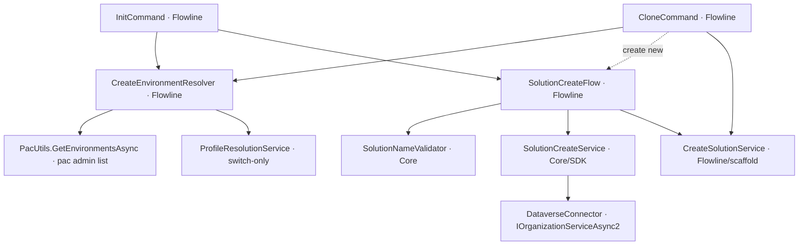
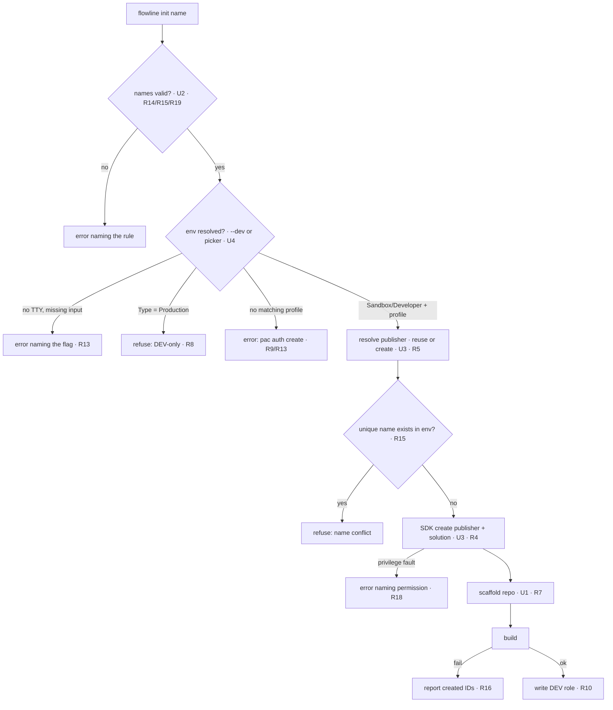

# Clone / Init Greenfield Solution - Plan

## Goal Capsule

- **Objective:** Let Flowline bootstrap a *new* Dataverse solution (create publisher + empty unmanaged solution, then scaffold the repo), and make `clone` interactive so an unspecified environment or solution prompts instead of failing.
- **Product authority:** This plan owns solution-creation and interactive selection for repo bootstrap. Environment *creation* stays with `provision`; managed-solution handling and component authoring are out of scope.
- **Open blockers:** None. All product decisions resolved in brainstorm; remaining unknowns are implementation-time details deferred to units.
- **Execution profile:** Deep; 7 implementation units. The scaffold extraction (U1) is behavior-preserving — `CloneCommand`'s existing test suite is the guardrail.
- **Stop conditions:** Surface a blocker if the live SDK create needs a Publisher/Solution field the plan doesn't cover, if `EnvironmentInfo.Type` doesn't reliably separate `Production` from `Sandbox`/`Developer`, or if the extraction would change `CloneCommand`'s observable behavior.
- **Tail ownership:** Commit per unit; keep the full suite green; update README/wiki/CHANGELOG; verify live against DEV via `docs/test-goal.md`.
- **Product Contract preservation:** unchanged — all R/KD/AE IDs and scope preserved; this enrichment adds only the Planning Contract, Implementation Units, Verification Contract, and Definition of Done.

---

## Design revision (2026-08-02, post-live-validation)

Interactive testing + live `pac`/docs validation reshaped the environment/role handling. These decisions **supersede** the noted requirements below (patched inline where they contradicted):

- **Source-of-truth model is now explicit** (recorded in `AGENTS.md`): PROD holds the unmanaged solution by default (like `master`); DEV is a branch of PROD (`provision dev`) where changes happen, then `deploy` merges to PROD. Users may instead keep managed-only in PROD and treat DEV as truth — supported, not the default.
- **init vs clone use different environment resolution** (two methods on `CreateEnvironmentResolver`):
  - **init** (`ResolveCreateTargetAsync`): DEV-only. Picker **filtered** to Sandbox+Developer (Spectre has no non-selectable item — filter, don't gray), plus a `+ Create new environment for DEV role` choice that exits with advice to run `flowline provision dev` (env creation stays with `provision`). The created env is always the **Dev** role. No PROD prompt.
  - **clone** (`ResolveSourceAsync`): **env-first**, all types shown, title hints the source of truth is usually PROD. No DEV-only guard (clone writes nothing). Zero unmanaged in the chosen env → source-of-truth hint + re-pick. Role is **type-driven**: `Production→Prod` (locked), `Developer→Dev` (locked), else (Sandbox/other) prompt `{Dev,Test,UAT}` default Dev. Clone's create-new proceeds only if the source is create-eligible; otherwise advise `flowline init <name>` and exit (option b).
- **PROD is not required at bootstrap.** It's needed only by `provision`/`deploy`, which resolve it when first run. Neither init nor clone prompts for PROD (would confuse; clone-from-Production captures it as the Prod role automatically).
- **Environment-type facts (verified live):** `pac solution clone`/`sync` work against a **Developer** env (so Developer stays create-eligible). `pac admin copy` **cannot target a Developer** env, so a `provision`-created DEV is always a **Sandbox**.

---

## Product Contract

### Summary

Add greenfield solution creation to Flowline. A shared create service stands up a publisher (reuse an existing one or create new) and an empty unmanaged solution in Dataverse via the SDK, then runs the existing clone scaffold. It is reached two ways: a discoverable `flowline init <name>` front door, and `clone`'s interactive "no solution → pick existing or create new" menu. When environment or solution are unspecified, `clone` prompts (tenant-wide environment pick, then solution pick-or-create); when flags fully specify inputs, it runs silent.

### Problem Frame

Today `clone` only *pulls an existing* unmanaged solution: it iterates the configured role URLs, finds the first unmanaged solution, and scaffolds around it (`src/Flowline/Commands/CloneCommand.cs:325` `FindUnmanagedSourceAsync`). Starting a brand-new solution means leaving Flowline — create the publisher and solution in the maker portal first, then come back and clone. There is no create path in the tool at all: no pac wrapper for `solution create` or publisher creation exists in the repo.

Separately, `clone` is fully flag-driven. A user who runs it without a solution name or without a configured environment URL gets an error, not a picker — even though the environment and solution lists needed to help them are already reachable (`PacUtils.GetSolutionsAsync` lists all solutions; `ProfileResolutionService` already prompts for ambiguous profiles). The bootstrap step, the one moment a user is least oriented, is the least guided.

### Key Decisions

- KD1. **Clone owns create; `init` is a thin discoverable alias.** The create path must exist inside `clone`'s interactive menu regardless, so a standalone `init` adds only a front door over logic that already exists — not a second implementation. *(session-settled: user-directed — chosen over standalone-`init` and clone-only: discoverability without duplicating scaffold logic.)* Governs R1, R2, R3.
- KD2. **Greenfield means Flowline creates the solution.** Starting state is nothing in Dataverse; Flowline creates publisher + empty unmanaged solution, not just adopting a portal-made one. *(session-settled: user-directed — chosen over portal-created-adoption.)* Governs R4, R7.
- KD3. **Create via the SDK, then reuse the existing clone.** Two SDK `Create` calls (publisher if new + empty unmanaged solution) land the solution in DEV; `flowline clone` then pulls and scaffolds it unchanged. PAC was evaluated and rejected for the write: it has no create verb, and its only env-side create (`pac solution init` → pack → `import`) pays a multi-minute async import and forks the scaffold. Verified live that `pac solution sync` cannot substitute — it is a pull that errors on a missing solution and creates nothing. SDK create is a standard Dataverse API; being outside the documented CLI path does not make it fragile. *(session-settled: user-directed — chosen over pac init→import and over folding create into a smart `sync`.)* Governs R4, R5, R7.
- KD4. **One `--publisher-prefix` param, reuse-or-create by prefix; PAC-aligned names.** A single flag drives both: an existing prefix is reused, a new prefix is created (friendly name deduced). The name mirrors `pac solution init`'s `--publisher-prefix` so users recognize it; an optional `--publisher-name` overrides the deduced friendly name on create. Long forms only — no short aliases (`-pp`/`-pn`). Interactively, a picker lists existing publishers plus a create-new option. *(session-settled: user-directed — single param, reuse-or-create, PAC-recognizable long names, no short aliases.)* Governs R5, R6.
- KD5. **Tenant-wide environment picker; switch, never authenticate.** When no environment is specified, list all tenant environments (not just already-authenticated profiles). For the chosen one, Flowline switches to an existing matching pac auth profile — it never creates an auth profile or launches an interactive login; if no matching profile exists it errors naming the `pac auth create` command for the user to run. Heavier than a profile picker, chosen for full discovery. *(session-settled: user-directed — tenant-wide discovery; switch-only auth.)* Governs R9, R10.
- KD6. **Create is DEV-only, enforced by environment type.** Creating a solution and a new publisher is permitted only against a DEV environment. The guard queries the target's actual Dataverse environment type before any create call — not the `.flowline` role, which does not yet exist on a fresh `init` — so it holds identically on the `--dev` flag path and the interactive picker, and never treats an unlabeled environment as DEV. The chosen environment becomes the DEV role once create succeeds. *(session-settled: user-directed.)* Governs R8, R10, R16.
- KD7. **Prompt only for gaps.** Prompts fill unspecified inputs; a complete flag set runs silent; a missing input with no TTY errors rather than hanging. *(session-settled: user-directed — chosen over always-interactive.)* Governs R12, R13.
- KD8. **Positional `<name>` is the unique name; deduce the display name, never the publisher prefix.** The `init <name>` positional is the solution's unique name — matching `clone <solution>`, whose positional is also the unique name — so there is no lossy display→unique derivation. The friendly/display name defaults to a humanized form of the unique name (`--display-name` overrides; see KTD3). The **publisher prefix is never derived** from the solution name — it is supplied via `--publisher-prefix`, prompted interactively, or fails the command (per R5); the publisher friendly name is deduced from the prefix. Explicit flags override. *(session-settled: user-directed — unique-name positional; publisher prefix required, never derived.)* Governs R1, R5, R6.

### Requirements

**Command surface**

- R1. `flowline init <name>` creates a greenfield solution and scaffolds the repo, jumping straight to the create path. Flags: `<name>` positional (the solution **unique name**, matching `clone <solution>`), `--dev <URL>` (target DEV environment; omitted → tenant env picker), `--display-name <text>` (friendly name; defaults to the unique name), `--publisher-prefix <prefix>` (reuse-or-create per R5, name matches `pac solution init`), optional `--publisher-name` (publisher friendly-name override).
- R2. `flowline clone` with no solution named offers an interactive choice between picking an existing solution and creating a new one; the create choice reaches the same logic as `init`.
- R3. Create logic lives in one shared service invoked by both `init` and `clone`; neither duplicates the scaffold path in `CloneCommand`.

**Solution & publisher creation**

- R4. Create writes the publisher (if new) and an empty *unmanaged* solution into the DEV environment via the SDK (`IOrganizationService.Create`); pac has no verb for this.
- R5. A single `--publisher-prefix <prefix>` flag handles both reuse and create: a prefix matching an existing publisher reuses it, a new prefix creates one (friendly name deduced, overridable with the optional `--publisher-name`). The prefix is never defaulted or derived from the solution name: when `--publisher-prefix` is omitted, the interactive publisher picker prompts (choose an existing publisher, or create-new which asks for the prefix); with no TTY the command fails naming `--publisher-prefix`. Listing existing publishers uses the SDK (pac has no publisher-list verb). Flag names mirror `pac solution init`.
- R6. The positional `<name>` is the solution unique name. The display/friendly name defaults to a humanized form of it (`--display-name` overrides; humanize rule in KTD3); the publisher friendly name defaults to the prefix when unspecified. The publisher prefix itself is not derived (see R5). Explicit flags override any derived value.
- R7. After the publisher and solution exist, create runs the existing clone scaffold (solution file, Plugins and WebResources projects, `AGENTS.md`/`CLAUDE.md`, Dataverse context) — identical to a clone of that solution.
- R8. Greenfield create (solution and new publisher) is permitted only against a DEV environment. The check queries the target environment's actual Dataverse environment type before any create call and applies identically to the `--dev` flag path and the interactive picker; a non-dev — or unclassifiable — target is refused, and a fresh project with no `.flowline` role still runs this platform-level check rather than assuming DEV (per KD6).
- R16. If create fails after the publisher or solution has already been written to Dataverse (scaffold or `dotnet build` fails), Flowline reports the created publisher/solution identifiers and environment for manual cleanup rather than discarding them silently.
- R18. When the authenticated user lacks Dataverse privileges to create the publisher or solution, create fails with a clear error naming the missing permission, not a raw SDK exception.

**Interactive selection**

- R9. When no environment is specified, prompt with a tenant-wide environment picker. **[Revised 2026-08-02]** The framing differs by command: **init** frames it as picking this project's **DEV** environment and **filters the list to Sandbox+Developer** (plus a `+ Create new environment for DEV role` escape hatch → exit advising `flowline provision dev`); **clone** frames it as picking the **source of truth (usually PROD)** and lists **all** environment types (no filter — clone writes nothing). For the chosen environment, switch to an existing matching pac auth profile; Flowline never creates an auth profile or launches an interactive login — if no matching profile exists, it errors naming the `pac auth create` command to run.
- R10. The environment chosen for a create becomes the DEV role in `.flowline`, written only after the full create + scaffold + build succeeds (per R16). On writing it, Flowline confirms the designation with a line naming the environment (e.g. `✓ DEV set to <name> (<url>)`), so both the interactive picker and the silent `--dev` path surface that this environment is now the project's DEV.
- R11. When cloning an existing solution with none named, resolve the source environment **first** (env-first ordering), then list the *unmanaged* solutions in it for the user to pick (via `pac solution list`), excluding managed ones with a note of how many were hidden — clone supports unmanaged only. **[Revised 2026-08-02]** If the chosen environment has **zero** unmanaged solutions, emit a source-of-truth hint (unmanaged usually lives in PROD) and re-prompt the environment picker rather than dead-ending.
- R17. When an interactively-picked environment is used to clone an *existing* solution (not create), Flowline saves it under a `.flowline` role so later role-based commands (`push`/`sync`/`deploy`) resolve it correctly. **[Revised 2026-08-02]** The role is **type-driven**, not a free pick defaulting DEV: `Production→Prod` (locked, no prompt), `Developer→Dev` (locked), everything else (Sandbox/other/unknown) prompts among `{Dev,Test,UAT}` defaulting Dev. Prod is only ever assigned to a genuinely Production-typed environment.

**Interactivity contract**

- R12. Prompt only for unspecified inputs; when flags fully specify the inputs, run without prompts.
- R13. When an input is missing and there is no interactive terminal, error naming the flag to pass — never block waiting on input. Flowline never launches an interactive login: if the resolved or `--dev`-specified environment has no matching pac auth profile, it errors naming the `pac auth create` command (per R9) with or without a TTY, rather than blocking on a device-code/browser flow.
- R14. Before anything is created in Dataverse, the positional unique name is checked against C# keywords (it becomes the plugin namespace), refusing up front so create never produces a solution it then refuses to scaffold.
- R15. Before creating, create also checks whether a solution with that unique name already exists in the target environment and refuses with a clear naming-conflict error — covering retries and duplicate names, extending R14's check-before-writing pattern to Dataverse-side collisions.
- R19. Create validates every name input against its documented rules before any write, refusing invalid input up front (like R14) with a message naming the rule:
  - **Solution unique name** (the `<name>` positional): `[A-Za-z0-9_]` only, starts with a letter or underscore, at most 65 characters.
  - **Solution display name** (`--display-name`, defaults to a humanized form of the unique name — KTD3): free text, at most 256 characters.
  - **Publisher prefix** (`--publisher-prefix`): 2–8 characters, alphanumeric, starts with a letter, must not start with `mscrm`.
  - **Publisher unique name**: `[A-Za-z0-9_]` only, starts with a letter or underscore.

  Publisher rules per the [`pac solution init` reference](https://learn.microsoft.com/power-platform/developer/cli/reference/solution#pac-solution-init); solution field character sets and lengths per the [Dataverse Solution table reference](https://learn.microsoft.com/power-apps/developer/data-platform/reference/entities/solution) (`uniquename` max 65, `friendlyname` max 256).

### Key Flows

- F1. `flowline init` — greenfield create
  - **Trigger:** User runs `flowline init MySolution` (flags optional).
  - **Steps:** Resolve the DEV environment (prompt tenant-wide if unspecified; switch to a matching pac profile or error naming `pac auth create`; refuse a non-dev target per R8); validate the unique name (not a C# keyword, not already present in the environment); resolve the publisher (reuse by prefix or create, deducing prefix/names); create the publisher and empty unmanaged solution via the SDK; run the clone scaffold; build; write the DEV role on success. On a post-create failure, report the created identifiers.
  - **Outcome:** New publisher (if created) and unmanaged solution exist in the DEV environment; the repo is scaffolded and `dotnet build` passes.
  - **Covers R1, R4, R5, R6, R7, R8, R14, R15, R16, R18, R19.**

- F2. `flowline clone` — fully interactive
  - **Trigger:** User runs `flowline clone` with no solution and no configured environment.
  - **Steps:** Prompt the tenant-wide environment picker; then offer pick-an-existing-solution (listed from that environment) or create-new (routes into F1's create path).
  - **Outcome:** Either an existing solution is cloned, or a new one is created — both end in a scaffolded repo.
  - **Covers R2, R9, R11, R17.**

### Acceptance Examples

- AE1. **Covers R12.** **Given** `flowline init Sol --dev <dev-url> --publisher-prefix dwe`, **when** run, **then** it creates and scaffolds with no prompts.
- AE2. **Covers R13.** **Given** a missing `--dev` and no TTY (CI or piped), **when** run, **then** it exits with an error naming the flag to pass, without hanging.
- AE3. **Covers R8, R10.** **Given** a non-dev environment — chosen interactively **or** passed via `--dev` — **when** *create* is attempted (init, or clone's create-new), **then** it is refused after checking the environment type; a dev environment proceeds and becomes the DEV role on success. **[Revised 2026-08-02]** The refusal is **create-path only** — cloning an *existing* solution from a Production environment is allowed (and assigns the Prod role); the DEV-only guard never applies to clone-existing.
- AE4. **Covers R5.** **Given** `--publisher-prefix dwe` where `dwe` already exists, **when** create runs, **then** it reuses that publisher; a prefix that doesn't exist creates the publisher. With no flag, the picker lists existing publishers plus create-new.
- AE5. **Covers R14.** **Given** a `<name>` that is a C# keyword, **when** create runs, **then** it refuses before creating anything in Dataverse.
- AE6. **Covers R15.** **Given** `<name>` matches a solution already in the target environment, **when** create runs, **then** it refuses with a naming-conflict error before writing anything.
- AE7. **Covers R13.** **Given** `--dev <url>` for an environment with no matching pac auth profile and no TTY, **when** run, **then** it errors naming the `pac auth create` command rather than blocking on a login prompt.
- AE8. **Covers R5.** **Given** `flowline init Sol --dev <dev-url>` with no `--publisher-prefix` and no TTY, **when** run, **then** it fails naming `--publisher-prefix` (never deriving one from `Sol`); interactively, the publisher picker prompts instead.
- AE9. **Covers R19.** **Given** `--publisher-prefix mscrmx` or `--publisher-prefix a` (too short) or a 9-character prefix, **when** create runs, **then** it refuses up front naming the prefix rule, before any Dataverse write.

### Scope Boundaries

- Managed-solution creation — create makes unmanaged solutions only.
- Solution version setting, component authoring, and templates beyond the current clone scaffold.
- Editing or reconfiguring existing publishers (reuse-as-is only).
- Environment creation — `provision` already owns that (`src/Flowline/Commands/ProvisionCommand.cs`).
- Folding create into a smart `flowline sync` (create-if-missing, option D) — a possible future direction, deferred now to keep `sync`'s pull-only semantics and dirty-tree/version guards intact.
- Multi-environment DTAP role assignment during clone/init (picking several environments and tagging each dev/test/uat/prod) — deferred; the picker sets one environment (the DEV/source role), and test/uat/prod are configured later via the existing `--test`/`--uat`/`--prod` flags.
- Non-interactive create through `clone` (a `clone --create` flag) — out. Flag-driven / scripted create is `flowline init` only; `clone`'s create-new is interactive-menu-only, so the two commands don't share a create flag surface.

### Dependencies / Assumptions

- Create uses `IOrganizationService.Create` via `DataverseConnector` (`src/Flowline.Core/Services/DataverseConnector.cs`) for the publisher and solution records — the publisher record needs a valid customization prefix and option-value prefix.
- The tenant-wide environment picker reuses the existing `PacUtils.GetEnvironmentsAsync` wrapper (`pac admin list --json`, `src/Flowline/Utils/PacUtils.cs`), already consumed via `GetEnvironmentInfoByUrlAsync` in `FlowlineCommand`/`ProvisionCommand`/`DriftCommand`/`DeployCommand` — not a net-new capability.
- Publisher/solution create is reachable through `DataverseConnector.ConnectViaPacAsync`, which returns `IOrganizationServiceAsync2` (includes `Create`) — confirmed feasible.
- The existing clone pulls and scaffolds a freshly created empty unmanaged solution unchanged (it is unmanaged, so `FindUnmanagedSourceAsync`'s contract holds). Verified live: `pac solution sync` errors on a missing solution (`"...unique name... is not valid"`, exit 1) and creates nothing, so lazy creation via sync is not available without new behavior.

### Sources / Research

- `src/Flowline/Commands/CloneCommand.cs` — existing clone + scaffold path the create flow reuses; `FindUnmanagedSourceAsync` (:325), scaffold steps (:53–108), C# keyword check `DescribeCSharpKeywordCollision` (:148).
- `src/Flowline.Core/Services/DataverseConnector.cs` — direct Dataverse SDK access for create.
- `src/Flowline/Services/ProfileResolutionService.cs` — established `SelectionPrompt` / `ConfirmationPrompt` interactive pattern.
- `src/Flowline/Utils/PacUtils.cs` — `GetSolutionsAsync` (solution listing); no create/publisher wrappers present.
- `src/Flowline/Program.cs` — command registration slot for a new `init` command.
- PACX `pacx solution create` — reference for deduction-heavy, flag-only create (name → uniqueName → prefix → publisher, auto-creates publisher): https://github.com/neronotte/Greg.Xrm.Command/wiki/pacx-solution-create
- [`pac solution` reference](https://learn.microsoft.com/power-platform/developer/cli/reference/solution) — confirms no `solution create` verb; source of the PAC-aligned long flag names `--publisher-prefix` / `--publisher-name` reused here (long forms only, no short aliases), and the publisher prefix/name validation rules (R19).
- [Dataverse Solution table reference](https://learn.microsoft.com/power-apps/developer/data-platform/reference/entities/solution) — `uniquename` (`[A-Za-z0-9_]`, max 65) and `friendlyname` (free text, max 256) constraints for R19; `customizationoptionvalueprefix` derivation on the Publisher record decided in KTD3.
- Microsoft ALM guidance — greenfield is documented as portal-create-then-clone ([source control with solution files](https://learn.microsoft.com/power-platform/alm/use-source-control-solution-files#create-a-solution)) or code-first `init`→build→`import` ([code components ALM](https://learn.microsoft.com/power-apps/developer/component-framework/code-components-alm)). SDK-create is chosen deliberately over the documented import path for speed and reuse (see KD3).
- [Work with solutions using the Dataverse SDK](https://learn.microsoft.com/power-platform/alm/solution-api#create,-export,-or-import-an-unmanaged-solution) — the `IOrganizationService.Create` create-publisher / create-solution sample the SDK create path (U3) mirrors.
- `src/Flowline/Utils/PacUtils.cs` — `GetEnvironmentsAsync` (`pac admin list --json`) with `EnvironmentInfo.Type` (`Production`/`Sandbox`/`Developer`); `GetPublisherCustomizationPrefixAsync`.
- `src/Flowline.Core/Services/DataverseConnector.cs` — `ConnectViaPacAsync` returns `IOrganizationServiceAsync2` (includes `Create`).

---

## Planning Contract

### Key Technical Decisions

- KTD1. **Shared create flow + extracted scaffold; both commands call the flow, not each other.** A `SolutionCreateFlow` orchestrator (Flowline) runs the create sequence — validate names → SDK create → scaffold → build → DEV-role write / failure-report — and both `InitCommand` and `clone`'s create-new path call it, so neither command calls the other and the create logic exists once (R3). The scaffold half moves into a `CreateSolutionService`: the genuinely private `CloneCommand` methods (`SetupPluginsProjectAsync`, `SetupWebResourcesProjectAsync`, `CreateSolutionFileAsync`, `SeedWebResourceDistFromSrc`, `ScaffoldRootGitignore`, `ScaffoldAgentsFileAsync`, `ScaffoldClaudeFileAsync`). `ValidatePackAndBuildAsync` stays on the base `FlowlineCommand` (shared with `SyncCommand`) and is invoked by the command; `DataverseContextGenerator` is already a standalone class the flow calls, not moves. Behavior-preserving — `CloneCommand`'s tests are the guardrail. *(session-settled: user-approved — chosen over `init` calling `CloneCommand` directly.)* Per R3, R7.
- KTD2. **Create the publisher and solution records through the Dataverse SDK.** Use `IOrganizationServiceAsync2` from `DataverseConnector.ConnectViaPacAsync` to create the publisher (when the prefix is new) and the empty unmanaged solution. *(session-settled: user-directed — per KD3; chosen over `pac init→pack→import` and over folding create into `sync`.)* Per R4, R5.
- KTD3. **Derivation defaults for unspecified names and the option-value prefix.** When not supplied: (a) the solution display name is a *humanized* form of the unique name — split on underscores and camelCase boundaries into spaced words, keeping consecutive-capital acronym runs together (`MySolution`→`My Solution`, `DWE_Base`→`DWE Base`, `APIGateway`→`API Gateway`); (b) a new publisher's unique name and friendly name both default to the `--publisher-prefix` value (friendly overridable by `--publisher-name`); (c) the publisher `customizationoptionvalueprefix` (SystemRequired, 10000–99999) is derived deterministically from the prefix — silently, with no flag. Per R6; supports R4, R5. *(session-settled: user-directed.)*
- KTD4. **Enforce DEV-only via an `EnvironmentInfo.Type` whitelist — on the create path only.** `pac admin list --json` returns a `Type` of `Production` / `Sandbox` / `Developer`. Allow only `Sandbox` and `Developer` as **create** targets; refuse everything else, including `Production` and any unrecognized or null type (satisfies R8's "non-dev — or unclassifiable"). **[Revised 2026-08-02]** The whitelist gates `ResolveCreateTargetAsync` (init + clone's create-new) only; `ResolveSourceAsync` (clone-existing) applies no type guard. Developer verified live to work with `pac solution clone`/`sync`, so it stays create-eligible. *(session-settled: user-directed — Sandbox+Developer, chosen over Developer-only.)* Per R8.
- KTD5. **Switch-only auth via `ProfileResolutionService`.** Reuse the existing profile-switch path; never call `pac auth create` or launch a login. When no matching profile exists, error naming `pac auth create`. *(session-settled: user-directed — per KD5.)* Per R9, R13.
- KTD6. **Place code by the Core/Flowline boundary.** Name validation and SDK record-create carry no terminal dependency → `Flowline.Core/Services/`. The command, environment picker, and scaffold orchestration need `CommandContext`/console → `Flowline/`. `Core` must never reference `Flowline`. Per R3.

### High-Level Technical Design

Component topology — two commands over shared services, split across the Core/Flowline boundary (KTD6):

`flowline init` flow with its refusal gates (F1):

### Assumptions

- `EnvironmentInfo.Type` reliably separates `Production` from `Sandbox`/`Developer` for the DEV-only guard (KTD4). The field exists on `PacUtils.GetEnvironmentsAsync`; values are assumed per pac's documented set.
- `IOrganizationServiceAsync2.Create` via `DataverseConnector.ConnectViaPacAsync` is sufficient to create Publisher and Solution records — verified available; no solution import is used, so no async-import wait or checker gate applies to create.

### Sequencing

U1, U2, U3, U4 are independent and can proceed in parallel. U5 (the shared `SolutionCreateFlow` + `init`) depends on U1–U4. U6 (interactive `clone`) depends on U4 and U5. U7 (docs) depends on U5, U6.

---

## Implementation Units

### U1. Extract shared solution scaffold service

- **Goal:** One `CreateSolutionService` owns the scaffold that both `init` and `clone` use; `clone` delegates without behavior change.
- **Requirements:** R3, R7 (per KTD1).
- **Dependencies:** none.
- **Files:** create `src/Flowline/Services/CreateSolutionService.cs`; modify `src/Flowline/Commands/CloneCommand.cs`; `tests/Flowline.Tests/CloneCommandTests.cs` stays green (guardrail).
- **Approach:** Move the genuinely private scaffold methods listed in KTD1 into the service, constructor-injecting `IAnsiConsole` / `ILogger` / `SubprocessCapture` (they use inherited members today). `CloneCommand.ExecuteFlowlineAsync` calls the service for its scaffold steps. `ValidatePackAndBuildAsync` stays on the base class and is invoked by the command as today; `DataverseContextGenerator` stays standalone and is called, not moved. Static helpers (`DescribeCSharpKeywordCollision`, `PluginsProjectFileName`, `ResolveSolutionFilePath`, layout checks) move with the methods; `[InternalsVisibleTo("Flowline.Tests")]` is assembly-level, so test access is preserved.
- **Execution note:** Refactor-only — run the full `CloneCommand` suite before and after; no behavior delta.
- **Patterns to follow:** existing `CloneCommand` scaffold sequence; `SolutionFileLayout` discovery.
- **Test scenarios:**
  - Existing `CloneCommand` tests pass unchanged.
  - The service scaffolds a temp root into the same file set clone produced (solution file, Plugins/WebResources projects, AGENTS.md/CLAUDE.md).
- **Verification:** `dotnet test Flowline.slnx` green; clone still scaffolds identically.

### U2. Name and publisher validation

- **Goal:** Reject invalid names up front with rule-naming errors, before any Dataverse write.
- **Requirements:** R14, R19 (and the pre-write validation feeding R15).
- **Dependencies:** none.
- **Files:** create `src/Flowline.Core/Services/SolutionNameValidator.cs`; tests `tests/Flowline.Core.Tests/SolutionNameValidatorTests.cs`.
- **Approach:** Pure validators returning a rule-named error or null — solution unique name (`[A-Za-z0-9_]`, start letter/underscore, ≤65, not a C# keyword via the relocated `DescribeCSharpKeywordCollision`), display name (≤256), publisher prefix (2–8 alphanumeric, letter-start, not `mscrm`), publisher unique name. Call sites throw `FlowlineException(ExitCode.ValidationFailed, …)`.
- **Patterns to follow:** `CloneCommand.DescribeCSharpKeywordCollision`; typed `ExitCode` / `FlowlineException` contract.
- **Test scenarios:**
  - Valid names pass.
  - Covers AE9. Prefix `mscrmx`, `a` (too short), and a 9-char prefix each rejected naming the rule.
  - Unique name of 66 chars rejected; a unique name with a space or hyphen rejected.
  - Covers AE5. A C# keyword unique name rejected before any write.
  - A 257-char display name rejected.
- **Verification:** targeted tests green.

### U3. Dataverse publisher + solution create

- **Goal:** Create or reuse the publisher and create the empty unmanaged solution via the SDK, refusing name collisions and surfacing privilege errors.
- **Requirements:** R4, R5, R15, R18.
- **Dependencies:** none (callers validate names via U2 first).
- **Files:** create `src/Flowline.Core/Services/SolutionCreateService.cs`; tests `tests/Flowline.Core.Tests/SolutionCreateServiceTests.cs`.
- **Approach:** ordered —
  1. Resolve publisher by prefix: a new SDK query against `customizationprefix` via `IOrganizationServiceAsync2` in `Core` (not `PacUtils.GetPublisherCustomizationPrefixAsync`, which filters by `uniquename` and lives in `Flowline`); reuse when found, else create the publisher — `uniquename` and `friendlyname` both default to the prefix (friendly overridable by `--publisher-name`), plus `customizationprefix` and a derived `customizationoptionvalueprefix` (all per KTD3).
  2. Check the solution unique name in the target env; refuse with a conflict error if present (R15).
  3. Create the solution (`uniquename`, `friendlyname`, `version` `1.0.0.0`, `publisherid`).
  Wrap SDK privilege faults as `FlowlineException` naming the missing permission (R18).
- **Patterns to follow:** `DataverseConnector.ConnectViaPacAsync` → `IOrganizationServiceAsync2`; the MS "Work with solutions using the Dataverse SDK" create sample; provision-safety-guard hard-error style.
- **Test scenarios:**
  - Covers AE4. An existing prefix reuses the publisher; a new prefix creates one.
  - Covers AE6. An existing solution unique name is refused with a conflict error.
  - A privilege fault surfaces as `FlowlineException` naming the permission (mocked org service).
  - Live create is verified via the test-goal matrix, not unit tests.
- **Verification:** unit tests with a mocked org service green; live create succeeds in DEV.

### U4. Environment resolution, DEV-only guard, tenant picker, switch-only auth

- **Goal:** Resolve the target DEV env (flag or picker), switch to an existing profile or error, and refuse non-dev environments.
- **Requirements:** R8, R9, R10, R13.
- **Dependencies:** none.
- **Files:** create `src/Flowline/Services/CreateEnvironmentResolver.cs`; tests `tests/Flowline.Tests/CreateEnvironmentResolverTests.cs`.
- **Approach:** For a given URL, reuse the existing `FlowlineCommand.GetAndCheckStandaloneEnvironmentAsync` (`src/Flowline/Commands/FlowlineCommand.cs`), which already resolves the profile via `ProfileResolutionService`, fetches `EnvironmentInfo`, and refuses `Type == "Production"`. The genuinely new scope is the tenant-wide picker when no `--dev` is given: prompt `SelectionPrompt<EnvironmentInfo>` from `PacUtils.GetEnvironmentsAsync`, titled to frame the choice as selecting the project's DEV (source-of-truth) environment and showing each env's type (R9). Enforce DEV-only as a whitelist — allow only `Sandbox`/`Developer`, refuse everything else including unrecognized or null `Type` (KTD4). Switch to a matching pac profile; if none, `FlowlineException` naming `pac auth create` (already the `ProfileResolutionService` behavior, R9/R13). No TTY + missing input → error naming the flag; never prompt (R13). The DEV-role write is caller-sequenced after success (R10). **[Revised 2026-08-02]** Split into two public methods per the Design revision banner: `ResolveCreateTargetAsync` (init — filtered Sandbox+Developer picker + `+ Create new environment` escape hatch returning null→exit-0; guard on the `--dev` path) and `ResolveSourceAsync` (clone — all-types picker titled to the source of truth, no guard). Shared privates: URL-path resolve (`requireEligible` bool), env-list fetch, profile switch, non-TTY error.
- **Patterns to follow:** `ProfileResolutionService` `SelectionPrompt` / `console.Prompt`; the non-TTY output-width finding; `flowline-add-environment` role write (`Config.GetOrUpdateDevUrl`).
- **Test scenarios:**
  - Covers AE3. A `--dev` Production-type env is refused; an interactively-picked Production env is refused; a Sandbox/Developer env proceeds.
  - Covers AE2. Missing `--dev` with no TTY errors naming the flag.
  - Covers AE7. A `--dev` env with no matching profile and no TTY errors naming `pac auth create`.
- **Verification:** unit tests with a stubbed environment list and non-TTY console green.

### U5. `flowline init` command + registration

- **Goal:** Add the shared `SolutionCreateFlow` orchestrator and the `flowline init <name>` command that drives it, and register the command.
- **Requirements:** R1, R2 (create arm), R6, R10, R12, R13, R16.
- **Dependencies:** U1, U2, U3, U4.
- **Files:** create `src/Flowline/Services/SolutionCreateFlow.cs` and `src/Flowline/Commands/InitCommand.cs`; modify `src/Flowline/Program.cs`; tests `tests/Flowline.Tests/InitCommandTests.cs`, `tests/Flowline.Tests/SolutionCreateFlowTests.cs`.
- **Approach:** `SolutionCreateFlow` (Flowline) takes a resolved DEV environment plus name/publisher inputs and runs: validate names (U2) → resolve publisher-prefix (flag, or prompt existing-or-create; no TTY → error, R5) → create records (U3) → scaffold (U1) → build → write DEV role and emit a `✓ DEV set to <env>` confirmation line (R10) → on post-create failure report created IDs (R16). Both `InitCommand` and `clone`'s create-new path call this flow, so neither command calls the other (KTD1). `InitCommand : FlowlineCommand<Settings>`, `RequiresProject=false`, Settings: positional `<name>` (unique name), `--dev`, `--display-name`, `--publisher-prefix`, `--publisher-name`; it validates, resolves env + guard (U4), then calls the flow. Prompt only for gaps (R12); deduce display and publisher friendly names (R6). Register in `Program.cs` before `clone` with a description and example.
- **Patterns to follow:** `CloneCommand` structure; `AddCommand<>().WithDescription().WithExample()`; tone-of-voice glyphs for prompts, skips, errors, and the finish line.
- **Test scenarios:**
  - Covers AE1. Full flags run with no prompts.
  - Covers AE8. Missing `--publisher-prefix` with no TTY errors naming it.
  - Covers AE4 (picker arm). With no `--publisher-prefix` and an interactive session, the publisher picker lists existing publishers plus a create-new choice.
  - Covers AE3 (role-write arm). After a successful create + scaffold + build, the chosen environment is written to the DEV role in `.flowline` and a `✓ DEV set to <env>` line is emitted; on a post-create failure neither happens.
  - Display name defaults to the humanized unique name when `--display-name` is omitted (`DWE_Base`→`DWE Base`).
  - A post-create scaffold failure reports the created publisher/solution IDs (mocked create + failing scaffold, R16).
  - `init` is registered and `--help` lists the flags.
- **Verification:** targeted tests green; `flowline init --help` shows the flags.

### U6. Interactive `clone`: pick-or-create + unmanaged solution picker

- **Goal:** `clone` with no solution prompts to pick an existing unmanaged solution or create a new one, and confirms the role for an existing-solution clone.
- **Requirements:** R2, R11, R17.
- **Dependencies:** U4, U5 (the shared `SolutionCreateFlow`).
- **Files:** modify `src/Flowline/Commands/CloneCommand.cs`; add cases to `tests/Flowline.Tests/CloneCommandTests.cs`.
- **Approach:** When no solution is named and the session is interactive: resolve the source env via `ResolveSourceAsync` (U4, all types, source-of-truth title); list unmanaged solutions (`GetSolutionsAsync`, filter `IsManaged == false`, note the hidden-managed count, R11) in a `SelectionPrompt` plus a "create new" choice that calls the shared `SolutionCreateFlow` (U5). For an existing-solution clone, assign the `.flowline` role from the env type (R17). No TTY with no solution keeps today's error path. **[Revised 2026-08-02]** Env-first with a re-pick loop on zero-unmanaged; role is type-driven (`Production→Prod`/`Developer→Dev` locked, else prompt `{Dev,Test,UAT}`); create-new only proceeds if the source is create-eligible, else advise `flowline init` and exit (option b).
- **Patterns to follow:** `FindUnmanagedSourceAsync`; `SelectionPrompt`; tone-of-voice skip/idempotent lines.
- **Test scenarios:**
  - The picker lists only unmanaged solutions with a hidden-managed count (R11).
  - The "create new" choice routes into the create path (R2).
  - An existing-solution pick confirms the role, defaulting DEV (R17).
  - No-TTY with no solution keeps today's error (R13).
- **Verification:** targeted tests green; a manual interactive run picks or creates.

### U7. Docs, wiki, CHANGELOG, and live-matrix

- **Goal:** Document the new command and record its live-test scenarios.
- **Requirements:** delivery support for R1–R19 (Definition of Done docs criterion).
- **Dependencies:** U5, U6.
- **Files:** modify `README.md`, `docs/test-goal.md`, `CHANGES.md`; wiki `Command-Reference.md` and `Getting-Started.md` (sibling `..\Flowline.wiki\` if present).
- **Approach:** Document `flowline init` and its flags and the interactive `clone` behavior; add init/create rows to the test matrix (greenfield create, validation rejections, DEV-only refusal on a Production-type env, no-TTY errors, duplicate-name refusal, interactive pick-or-create). If the wiki checkout is absent, report rather than silently skip.
- **Execution note:** Docs unit. `Test expectation: none — documentation only.`
- **Verification:** README/wiki/CHANGELOG reflect the new surface; the test-goal matrix is updated.

---

## Verification Contract

| Gate | Command / signal | Applies to |
|---|---|---|
| Build | `dotnet build Flowline.slnx` | all units |
| Full suite | `dotnet test Flowline.slnx` — must stay green; the `CloneCommand` suite is the U1 extraction guardrail | all |
| Targeted | `dotnet test tests/Flowline.Core.Tests` (U2, U3); `dotnet test tests/Flowline.Tests` (U4–U6) | per unit |
| Live matrix | `docs/test-goal.md` against DEV (`https://automatevalue-dev.crm4.dynamics.com`, disposable): greenfield create, name/prefix rejections, Production-type refusal, no-TTY errors, duplicate-name refusal, interactive pick-or-create | R4 / R8 / R13 / R15 create paths |
| Tone | new prompts, errors, and finish lines follow `docs/tone-of-voice.md` (`/tone` if available) | U4–U6 |

Acceptance-example coverage: AE1→U5, AE2→U4, AE3→U4 (refusal) + U5 (role write), AE4→U3 (reuse/create) + U5 (picker), AE5→U2, AE6→U3, AE7→U4, AE8→U5, AE9→U2.

---

## Definition of Done

Global:

- R1–R19 satisfied; every AE has a covering unit test or live-matrix scenario (mapping above).
- `dotnet test Flowline.slnx` green; `CloneCommand`'s existing tests pass unchanged (extraction is behavior-preserving).
- `flowline init` is registered, `--help` is correct, and interactive `clone` pick-or-create works.
- Greenfield create is verified live in DEV; the DEV-only guard refuses a Production-type env live.
- `README.md`, wiki (`Command-Reference.md`, `Getting-Started.md`), and CHANGELOG are updated for the new command and flags.
- New CLI text follows `docs/tone-of-voice.md`.
- No dead code from abandoned approaches; `Flowline.Core` does not reference `Flowline`.

Per-unit: each unit's Verification passes and its cited requirements hold.
