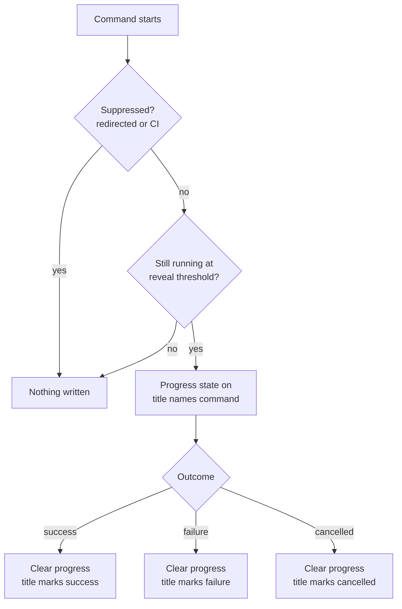
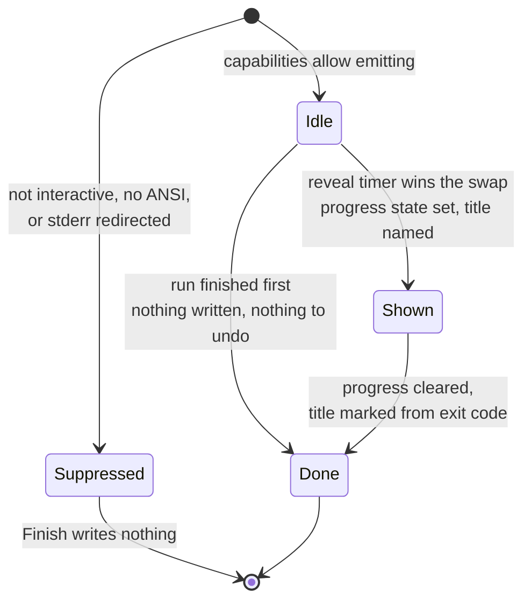

# Terminal Tab Status Indicator - Plan

## Goal Capsule

- **Objective:** A user who walks away from a long Flowline run can tell from the terminal tab alone whether it is still working and how it ended, without switching back to poll it.
- **Means:** The terminal's own indeterminate progress state carries "working"; the tab title carries the outcome (KTD1, KTD6, KTD7).
- **Product authority:** This plan owns the tab-level indicator only. In-terminal rendering (the existing Spectre spinner and status text) is unchanged and out of scope.
- **Stop conditions:** Stop and ask if the work would need a command flag, a `.flowline` key, or an environment variable (R10), or if it would change what any command prints inside the terminal.
- **Open blockers:** None.

**Product Contract preservation:** restructured, no scope change. The four planning-deferred Outstanding Questions were answered during planning and removed from that section rather than left standing (their answers live on KTD1, KTD3, KTD7, KTD8). Two Dependencies entries were replaced with verified facts. No R-ID, KD, F-ID, or AE-ID changed meaning, and none were added or removed.

---

## Product Contract

### Summary

Flowline signals long-running command state in the terminal tab. The terminal's native progress indicator carries "working" while a command runs; the tab title carries the outcome once it stops. Fast commands show nothing.

### Problem Frame

Flowline's existing spinner (`src/Flowline.Core/Console/SpinnerExtensions.cs`) only helps when the user is looking at the Flowline tab. `deploy`, `provision`, and `sync` run for minutes, which is exactly when the user switches to another tab and stops watching. The tab is the only surface visible from outside — right now it says nothing, so the user polls the tab manually to find out whether the run is still going or finished ten minutes ago.

### Key Decisions

- KD1. **Native progress indicator, not animated characters in the tab name.** The terminal animates its own indicator, so Flowline owns no timer thread and no frame loop. (session-settled: user-directed — chosen over writing spinner frames into the tab title: no background timer to own or dispose.) Governs R1.
- KD2. **A time threshold decides who gets the indicator, not a command allowlist.** New commands inherit the behavior; sub-second commands stay silent without anyone maintaining a list. (session-settled: user-directed — chosen over an explicit slow-command allowlist: the list drifts as commands are added.) Governs R6.
- KD3. **Auto-gating only — no user-facing switch.** Terminals that do not understand the sequence ignore it, so there is nothing to turn off in the common case. (session-settled: user-directed — chosen over an env var or a `.flowline` key: add one if a user asks.) Governs R7, R8, R10.
- KD4. **The outcome glyph is best-effort; the running indicator is not.** The tab title is shared with the shell and may be overwritten, so the indicator carries the guarantee and the title carries the nicety. Governs R3, R4.

### Requirements

**Running state**

- R1. While a command runs past the reveal threshold, Flowline sets the terminal's indeterminate progress state, which the terminal renders in the tab and on the taskbar.
- R2. When the indicator is shown, the tab title names the running command and its target.

**Outcome state**

- R3. When a command that showed the indicator finishes, Flowline clears the progress state and rewrites the tab title with an outcome marker distinguishing success from failure.
- R4. The outcome marker is best-effort: Flowline writes it once and does not defend it against a shell or prompt theme that rewrites the title afterwards.
- R5. Cancellation is its own outcome — Ctrl+C clears the progress state and marks the title as cancelled, distinct from both success and failure, matching the distinct `ExitCode.Cancelled` the CLI already returns.

**Suppression**

- R6. A command that finishes before the reveal threshold writes nothing at all: no progress state, no title change.
- R7. Flowline emits nothing when its output is redirected or piped.
- R8. Flowline emits nothing when it detects a CI environment, per the existing detection in `src/Flowline.Core/Services/CiPlatform.cs`.

**Lifecycle safety**

- R9. Every exit path clears the progress state — success, handled `FlowlineException`, unhandled exception, and cancellation. A command that showed the indicator never leaves it running.
- R10. The feature adds no command flag, no `.flowline` key, and no environment variable.

### Key Flows

- F1. Long deploy, user switches away
  - **Trigger:** User runs `flowline deploy prod` and moves to another tab.
  - **Steps:** Threshold elapses; the tab shows the running indicator; the import finishes; the indicator clears and the title reports the outcome.
  - **Outcome:** The user sees the result without switching back to poll.
  - **Covers R1, R2, R3.**

### Acceptance Examples

- AE1. Fast command leaves no trace
  - **Covers R6.**
  - **Given** `flowline --help`, which returns well under the threshold,
  - **Then** the tab title and progress state are exactly as they were before the command ran.
- AE2. Failure is visible from another tab
  - **Covers R3, R9.**
  - **Given** a `flowline deploy` that fails after several minutes,
  - **Then** the progress indicator is cleared and the tab title carries the failure marker.
- AE4. Cancel reads as cancel, not as failure
  - **Covers R5, R9.**
  - **Given** the user presses Ctrl+C during a long `flowline sync`,
  - **Then** the progress indicator is cleared and the tab title carries the cancelled marker, distinct from the failure marker in AE2.
- AE3. Piped output stays clean
  - **Covers R7, R8.**
  - **Given** `flowline sync > out.txt`, or any run inside CI,
  - **Then** no escape sequences appear in the captured output.

### Scope Boundaries

- Percentage progress. The indicator is indeterminate only; wiring real completion counts through `push`, `deploy`, and `sync` is deferred until the indeterminate version proves useful.
- An opt-out switch. Deferred per KD3 — auto-gating covers the cases that matter today.
- Recovering from a hard kill. If the process is terminated without running its exit path, the progress state stays set in that tab until something clears it. This is unfixable from inside the process and is accepted.
- The in-terminal spinner and status text. Unchanged.

#### Deferred to Follow-Up Work

- Restoring the pre-run tab title instead of leaving the outcome marker standing. `System.Console.Title` has no portable getter — the getter throws on Unix — so the original title cannot be read back. R4 already accepts leaving the marker in place.

### Dependencies / Assumptions

- Terminals that do not implement the progress sequence mostly ignore it. Verified for Windows Terminal, ConEmu, Ghostty, Konsole, mintty, WezTerm, and xterm.js. Kitty explicitly discards `OSC 9` payloads beginning `4;`. Modern iTerm2 supports the sequence; older iTerm2 versions treat `OSC 9` as their own desktop-notification protocol and would post a junk notification. KTD9 records how this is handled.
- Child processes Flowline launches never write to the terminal directly. Verified: `pac` and `dotnet` are invoked through CliWrap in `src/Flowline/Utils/PacUtils.cs` and `src/Flowline/Utils/DotNetUtils.cs`, which always pipes both child streams; `npm` runs only as an MSBuild target under `dotnet build`, inside that same pipe. No child output reaches the terminal unparsed, so no competing sequences are possible.
- Prompt themes that rewrite the tab title each prompt (oh-my-posh, starship) will overwrite the outcome marker. Accepted per KD4.

### Sources

- `src/Flowline/Program.cs` — Ctrl+C wiring, the exception handler that swallows `FlowlineException`, and the `CommandApp` run site.
- `src/Flowline.Core/Services/CiPlatform.cs` — existing CI detection, and the remark explaining why Spectre's `Capabilities.Interactive` is the gate to reuse rather than re-detecting.
- `src/Flowline.Core/Console/SpinnerExtensions.cs` — the in-terminal spinner this complements.
- `src/Flowline.Core/Console/FlowlineTheme.cs` — the existing status glyph constants the outcome markers reuse.
- `docs/solutions/runtime-errors/spectre-console-status-prompt-exclusivity.md` — why writes that bypass Spectre's render pipeline avoid its dynamic-display exclusivity rule, and why `TestConsole` does not reproduce that rule.
- [Set the progress bar in the Windows Terminal](https://learn.microsoft.com/en-us/windows/terminal/tutorials/progress-bar-sequences) — sequence format and state values.
- [OSC 9;4 progress bar sequence](https://rockorager.dev/misc/osc-9-4-progress-bars/) — state table and cross-terminal support list.
- [kitty issue 8011](https://github.com/kovidgoyal/kitty/issues/8011) — the `OSC 9` collision between the progress protocol and iTerm2's notification protocol, and how terminals disambiguate.

---

## Planning Contract

### Key Technical Decisions

- KTD1. **Wrap the whole `CommandApp` run in `Program.cs`, not a Spectre command interceptor.** Spectre's `SetExceptionHandler` runs inside `CommandApp.RunAsync`, so a handled `FlowlineException` never reaches an interceptor — it has already become a returned exit code. A `try`/`finally` around the `await app.RunAsync(...)` call observes every path that unwinds: success, handled failure, cancellation, and the unhandled exception that Debug builds propagate through `config.PropagateExceptions()`. Governs R3, R5, R9.
- KTD1a. **A process-exit handler covers the paths that never unwind.** Five `Environment.Exit(1)` call sites live in `src/Flowline/Utils/GitUtils.cs`, `src/Flowline/Utils/PacUtils.cs`, and `src/Flowline/Utils/DotNetUtils.cs`; at least one fires only after a network round-trip, so it is reached well past the reveal threshold. That call terminates the process without unwinding, so KTD1's `finally` never runs and the indicator would be left set. Register an `AppDomain.CurrentDomain.ProcessExit` handler beside the wrapper, routing through the same idempotent finish call KTD5 already makes safe to call twice. Replacing those call sites with thrown exceptions is a larger change and stays out of scope. Governs R9.
- KTD2. **The outcome is derived from the exit code alone.** `0` is success, `130` is cancelled, anything else is failure. No exception-type inspection, so the mapping cannot drift from the published `ExitCode` contract. Known limit: a command that swallows its own cancellation and returns `0` reads as success. Governs R3, R5.
- KTD3. **The existing `CancelKeyPress` handler is not touched.** Ctrl+C cancels the token, the run unwinds, `RunAsync` returns `ExitCode.Cancelled`, and only then does the wrapper's `finally` write. The clear is sequenced after that handler by construction, so nothing has to be coordinated against a handler that writes from its own thread. Governs R5, R9.
- KTD4. **The reveal delay is a one-shot timer created through `TimeProvider`, not a frame loop.** KD1 rules out a frame loop; KD2's threshold still needs one delay. `TimeProvider.CreateTimer` with a due time and no period gives that with nothing to animate, and the injected `TimeProvider` lets tests advance time instead of sleeping. Instantiates KD1 and KD2; governs R1, R6.
- KTD5. **Reveal and finish hand off through one atomic state transition, not a lock.** A command that finishes at the same instant the timer fires can otherwise leave the indicator set forever, breaking R9. The state moves `Idle -> Shown -> Done` by compare-and-swap: the timer callback writes only if it wins the move to `Shown`, and the finish path claims `Done` first, then reads the value it displaced to decide whether a clear and an outcome write are owed. A callback that loses the race writes nothing, so no wait-for-callback is needed. Governs R6, R9.
- KTD6. **Suppression reuses Spectre's console capabilities rather than re-detecting CI.** `Profile.Capabilities.Interactive` and `Profile.Capabilities.Ansi` already fold in the CI profile enrichers, as `CiPlatform`'s own remark records, and every other gate in the codebase reads them (`src/Flowline/Services/UpdateNoticeChecker.cs`, `src/Flowline.Core/Console/FlowlineConsoleExtensions.cs`). Redirected output makes both false. `CiPlatform` stays the named authority for R8 but is not called a second time. Governs R7, R8.
- KTD7. **The tab title is set through `System.Console.Title`, not a hand-written title escape sequence.** On Windows this is a Win32 title call needing no escape-sequence support on any handle; on Unix the runtime emits the terminal's own title sequence. It is the standard-library answer to the same problem, and it makes the title half of the feature work in strictly more places than the progress half. Governs R2, R3, R5.
- KTD8. **One reveal threshold constant of two seconds, not per-command tuning.** Instantiates KD2. Two seconds is long enough that `--help`, `scaffold`, and a cached `status` never reach it, and short enough that a user who walks away during `deploy` sees the indicator before they have switched tabs. Governs R6.
- KTD9. **Terminals that mangle the sequence are an accepted risk, not a suppression list.** Older iTerm2 posts the payload as a desktop notification, and a few terminals print unrecognized sequences raw. A detection list would drift as those terminals are fixed, and a switch is ruled out by KD3. Revisit trigger: a user reports the noise — KD3 already names adding a switch as the response. Constrained by R7, R8, R10.

### High-Level Technical Design

The helper is one object with a three-state lifecycle. Everything above it in `Program.cs` is a `try`/`finally`.

The two arrows out of `Idle` are the race KTD5 exists for. Exactly one can be taken, because both are the same compare-and-swap on the same field.

### Assumptions

- The three commands that motivate this (`deploy`, `provision`, `sync`) reliably exceed two seconds, and the fast commands (`--help`, `scaffold`, `sln add`) reliably do not. Not measured; the threshold is a single constant that is cheap to change if either proves wrong.
- Writing the progress sequence while a Spectre `Status` live region is active does not corrupt that region, because the sequence moves no cursor and the write bypasses Spectre's render pipeline entirely. Accepted on that reasoning and on manual observation only: the console test double does not reproduce Spectre's live-display state, so no automated test can hold this claim.

### Sequencing

U1 settles which stream physically carries the escape sequence, so U2 has a writer to call. U2 owns the lifecycle. U3 wires it and derives the label. U4 documents it. U1 and U4 have no dependency on each other.

---

## Implementation Units

### U1. Terminal signal writer and capability gate

- **Goal:** One small Core type that decides whether Flowline may emit terminal control sequences at all, and physically emits the progress-state sequence and the tab title.
- **Requirements:** R1, R2, R7, R8. Instantiates KTD6, KTD7, KTD9.
- **Dependencies:** none.
- **Files:**
  - `src/Flowline.Core/Console/TerminalSignals.cs` (create)
  - `tests/Flowline.Core.Tests/TerminalSignalsTests.cs` (create)
- **Approach:**
  1. Expose a gate reading `IAnsiConsole.Profile.Capabilities` for `Interactive` and `Ansi`, plus `System.Console.IsErrorRedirected`. All three must allow output before anything is written (KTD6).
  2. Expose a progress-state write and a progress-state clear, using the indeterminate and remove states from the sequence table in Sources.
  3. Expose a title write that delegates to `System.Console.Title` (KTD7). Never read the title back — the getter is not portable.
  4. Route the escape-sequence writes to standard error, so they cannot interleave with the Spectre live region on standard output. This is the whole reason for the choice — keeping them out of a piped capture is already handled by the gate in step 1, which suppresses everything when standard output is redirected.
  5. Keep the write target behind one internal seam so tests observe the emitted text instead of the real console.
- **Execution note:** Before committing to standard error, confirm on Windows that the error handle actually processes escape sequences — Spectre enables virtual-terminal processing on the output handle, and that setting is per-handle. Check both Windows Terminal and a plain `conhost` window. If the error handle is not enabled, either enable it once on that handle or fall back to standard output, and record which was chosen in a comment naming the reason. This is the one runtime fact the plan could not settle on paper.
- **Patterns to follow:** the capability-gate shape in `src/Flowline/Services/UpdateNoticeChecker.cs` and `src/Flowline.Core/Console/FlowlineConsoleExtensions.cs`. Glyphs come from `src/Flowline.Core/Console/FlowlineTheme.cs` — reuse `OkPrefix` for success, `ErrorPrefix` for failure, and `WarningPrefix` for cancelled rather than introducing new constants.
- **Test scenarios:**
  - Covers AE3. A console whose capabilities report non-interactive emits nothing from any of the three write entry points.
  - Covers AE3. A console whose capabilities report no ANSI support emits nothing.
  - A console that allows output emits the indeterminate progress sequence, and the emitted text matches the documented shape for that state.
  - The clear entry point emits the documented remove state, not a second indeterminate state.
  - The title entry point is called with the composed string and does not attempt to read the previous title.
  - The gate is evaluated once and reused, so a capability change mid-run cannot let one half of a pair emit while the other stays silent.
- **Verification:** `dotnet test tests/Flowline.Core.Tests/Flowline.Core.Tests.csproj` passes, and a manual Release run in Windows Terminal shows the tab progress indicator appear when the write entry point is called directly.

### U2. Reveal threshold and outcome lifecycle

- **Goal:** The state machine deciding whether the indicator is ever shown, and what the tab reports when the run ends.
- **Requirements:** R1, R3, R5, R6, R9. Instantiates KTD2, KTD4, KTD5, KTD8.
- **Dependencies:** U1.
- **Files:**
  - `src/Flowline.Core/Console/TerminalTabStatus.cs` (create)
  - `tests/Flowline.Core.Tests/TerminalTabStatusTests.cs` (create)
- **Approach:**
  1. Start takes the console, a `TimeProvider`, and the label to show; it arms a one-shot timer at the threshold constant and returns a handle (KTD4, KTD8).
  2. The timer callback attempts the swap to `Shown`; on success it sets the progress state and the running title through U1's writer.
  3. Finish takes the process exit code, claims `Done`, and acts only on the state it displaced: from `Shown` it clears the progress state and writes the outcome title; from `Idle` it writes nothing at all (R6). The timer is disposed either way (KTD5).
  4. Map the exit code to the outcome marker per KTD2, citing `src/Flowline.Core/ExitCode.cs` for the cancelled value rather than restating that number in a second place.
- **Execution note:** Write the race scenario as a failing test first. It is the one defect this unit exists to prevent, and the one that would not surface in manual use.
- **Patterns to follow:** fake time is new to this repo — use `TimeProvider` from the base library rather than adding a clock abstraction. Console test doubles follow `Spectre.Console.Testing.TestConsole`, as in `tests/Flowline.Core.Tests/FlowlineConsoleExtensionsTests.cs`.
- **Test scenarios:**
  - Covers AE1. A run finishing before the threshold elapses writes nothing — no progress state, no title.
  - A run that passes the threshold sets the indeterminate progress state and a title containing the label.
  - Covers AE2. A run that passed the threshold and finishes with a non-zero, non-cancelled exit code clears the progress state and writes a title carrying the failure marker.
  - A run that passed the threshold and finishes with exit code zero writes a title carrying the success marker.
  - Covers AE4. A run that passed the threshold and finishes with the cancelled exit code writes a title carrying the cancelled marker, and that marker differs from the failure marker.
  - The race: the timer fires and the run finishes at the same simulated instant. Exactly one path writes, and the progress state is never left set. Assert both orderings by advancing the fake time provider before and after the finish call.
  - Finish called twice writes only once, so a second call from a nested handler cannot re-set or double-clear.
  - Finish on a suppressed console writes nothing regardless of exit code.
- **Verification:** `dotnet test tests/Flowline.Core.Tests/Flowline.Core.Tests.csproj` passes, including the race scenario, and no test sleeps on real time.

### U3. Program.cs wiring and command label

- **Goal:** Every real Flowline invocation goes through the lifecycle, and the tab names the command and target the user actually typed.
- **Requirements:** R2, R3, R5, R9, R10. Instantiates KTD1, KTD1a, KTD3.
- **Dependencies:** U2.
- **Files:**
  - `src/Flowline/Program.cs` (modify)
  - `tests/Flowline.Tests/TerminalTabStatusWiringTests.cs` (create)
- **Approach:**
  1. Start the lifecycle immediately before the existing `await app.RunAsync(args, cancellationTokenSource.Token)` call and finish it in a `finally` around that call, with the exit code defaulting to a failure value so a propagated exception still reports failure (KTD1).
  2. Place the wrapper so it also encloses the trailing log-link write, which runs after `RunAsync` returns.
  3. Derive the label from `args`: the first non-option token is the command, the second is its target. Join what is present, prefixed with the application name. Nothing to show falls back to the application name alone.
  4. Register the `ProcessExit` handler beside the wrapper so the direct-exit call sites are covered too (KTD1a).
  5. Leave the `Console.CancelKeyPress` handler exactly as it is (KTD3).
- **Patterns to follow:** `tests/Flowline.Tests/UpdateNoticeWiringTests.cs` is the model for a wiring test proving a top-level concern fires on paths a unit test cannot reach. Label derivation reads `args` and never mutates it, so nothing Spectre later parses is consumed or reordered.
- **Test scenarios:**
  - The label for a command with a target names both, in the order the user typed them.
  - The label for a command with no target names the command alone.
  - The label for an empty argument list falls back to the application name and does not throw.
  - An argument list whose first token is an option (`--version`) does not treat that option as the command name.
  - Covers AE2. A run whose wrapped call returns a failure exit code reports failure to the lifecycle.
  - Covers AE4. A run whose wrapped call returns the cancelled exit code reports cancelled, not failure.
  - Covers AE2. A run whose wrapped call throws reports a failure outcome and rethrows, so the Debug-build propagation path still surfaces the exception.
  - The process-exit handler clears the indicator when the wrapper's exit path is skipped entirely, and calling it after the wrapper has already finished writes nothing a second time.
- **Verification:** `dotnet test tests/Flowline.Tests/Flowline.Tests.csproj` passes. A Release build of `flowline deploy` against an unreachable environment leaves no progress indicator set in the tab after it exits, and the same holds after Ctrl+C during a long `flowline sync` and after a `provision` run that dies on an environment URL the region table does not recognize.

### U4. Document the behavior

- **Goal:** A user who sees their tab change can find out what Flowline is doing and why there is no switch for it.
- **Requirements:** R4, R10.
- **Dependencies:** U2.
- **Files:**
  - `../Flowline.wiki/` — the page covering command output and terminal behavior, chosen from the page list in `Home.md`
  - `CHANGELOG.md` (modify)
- **Approach:**
  1. Read `../Flowline.wiki/AGENTS.md` before writing anything into the wiki; that repo has its own rules for audience, page naming, and shape.
  2. State what appears in the tab, when it does not appear (fast commands, piped output, CI), that the outcome marker is not defended against a prompt theme that rewrites the title, and that there is deliberately nothing to configure.
  3. If the wiki checkout is not present, report that rather than creating a replacement folder.
- **Test expectation: none — documentation only.**
- **Verification:** the wiki page states the suppression cases and the absence of a switch, and CHANGELOG names the behavior under the next release.

---

## Verification Contract

| Gate | Command | Applies to |
|---|---|---|
| Build | `dotnet build Flowline.slnx` | U1, U2, U3 |
| Core tests | `dotnet test tests/Flowline.Core.Tests/Flowline.Core.Tests.csproj` | U1, U2 |
| CLI tests | `dotnet test tests/Flowline.Tests/Flowline.Tests.csproj` | U3 |
| Full suite | `dotnet test Flowline.slnx` | before finishing — `Program.cs` is cross-cutting |

Manual checks run against a **Release** build. A Debug build propagates exceptions instead of running the exception handler, so exit codes and error paths do not behave as shipped.

- Windows Terminal: a slow command shows the tab progress indicator after roughly two seconds and clears it on exit. Repeat in a plain `conhost` window to confirm the U1 handle finding holds there too.
- Piped: `flowline status > out.txt` produces a capture containing no escape bytes, and the tab is untouched.
- Fast: `flowline --help` leaves the tab exactly as it was.
- Cancel: Ctrl+C during a long `flowline sync` clears the indicator and leaves the cancelled marker in the title.

---

## Definition of Done

| Criterion | Signal |
|---|---|
| R1, R2, R6 | U2 threshold scenarios pass and the manual Windows Terminal check shows the indicator |
| R3, R5 | U2 outcome scenarios pass with three distinct markers, and the manual cancel check matches |
| R4 | The wiki page states the marker is not defended against prompt themes |
| R7, R8 | U1 suppression scenarios pass and the piped capture holds no escape bytes |
| R9 | The U2 race scenario, the U3 throw scenario, and the U3 process-exit scenario all pass |
| R10 | The diff adds no `[CommandOption]`, no `.flowline` key, and no environment-variable read |
| Cross-cutting | `dotnet test Flowline.slnx` passes |
| Cleanup | No abandoned handle-experiment code from U1 remains; the chosen stream is the only one written to, with a comment naming why |

---

## Deferred / Open Questions

### From 2026-09-05 review

- **The tab-title write can garble a running spinner on Unix** — KTD7 (tab title set through the platform title API) and U1 (terminal signal writer and capability gate) (P1, feasibility, confidence 75)

  A macOS or Linux user running a command that shows the in-terminal spinner can see corrupted output at the moment the tab title is set. The plan routes its own progress sequence to the error stream specifically so it cannot interleave with that spinner, but the platform title API writes to standard output on Unix and offers no routing control, so the title write lands on the same stream the live display owns. U1's execution note commits to verifying the progress write against an active spinner and does not extend that check to the title write, though both fire at the same two moments.
