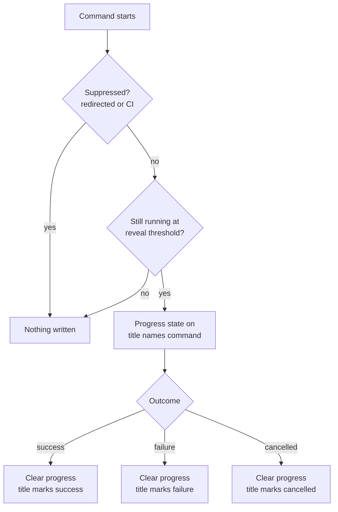

# Terminal Tab Status Indicator - Plan

## Goal Capsule

- **Objective:** Show the state of a long-running Flowline command in the terminal tab itself, so a user working in another tab can see that `deploy` is still running and how it ended.
- **Product authority:** This plan owns the tab-level indicator only. In-terminal rendering (the existing Spectre spinner and status text) is unchanged and out of scope.
- **Open blockers:** None. Every product decision is settled; the remaining questions are implementation choices for planning.

---

## Product Contract

### Summary

Flowline signals long-running command state in the terminal tab. The terminal's native progress indicator carries "working" while a command runs; the tab title carries the outcome once it stops. Fast commands show nothing.

### Problem Frame

Flowline's existing spinner (`src/Flowline.Core/Console/SpinnerExtensions.cs`) only helps when the user is looking at the Flowline tab. `deploy`, `provision`, and `sync` run for minutes, which is exactly when the user switches to another tab and stops watching. The tab is the only surface visible from outside — right now it says nothing, so the user polls the tab manually to find out whether the run is still going or finished ten minutes ago.

### Key Decisions

- KD1. **Native progress indicator, not animated characters in the tab name.** The terminal animates its own indicator, so Flowline owns no timer thread and no frame loop. (session-settled: user-directed — chosen over writing spinner frames into the tab title: no background timer to own or dispose.) Governs R1.
- KD2. **A time threshold decides who gets the indicator, not a command allowlist.** New commands inherit the behavior; sub-second commands stay silent without anyone maintaining a list. (session-settled: user-directed — chosen over an explicit slow-command allowlist: the list drifts as commands are added.) Governs R6.
- KD3. **Auto-gating only — no user-facing switch.** Terminals that do not understand the sequence ignore it, so there is nothing to turn off in the common case. (session-settled: user-directed — chosen over an env var or a `.flowline` key: add one if a user asks.) Governs R7, R8, R10.
- KD4. **The outcome glyph is best-effort; the running indicator is not.** The tab title is shared with the shell and may be overwritten, so the indicator carries the guarantee and the title carries the nicety. Governs R3, R4.

### Requirements

**Running state**

- R1. While a command runs past the reveal threshold, Flowline sets the terminal's indeterminate progress state, which the terminal renders in the tab and on the taskbar.
- R2. When the indicator is shown, the tab title names the running command and its target.

**Outcome state**

- R3. When a command that showed the indicator finishes, Flowline clears the progress state and rewrites the tab title with an outcome marker distinguishing success from failure.
- R4. The outcome marker is best-effort: Flowline writes it once and does not defend it against a shell or prompt theme that rewrites the title afterwards.
- R5. Cancellation is its own outcome — Ctrl+C clears the progress state and marks the title as cancelled, distinct from both success and failure, matching the distinct `ExitCode.Cancelled` the CLI already returns.

**Suppression**

- R6. A command that finishes before the reveal threshold writes nothing at all: no progress state, no title change.
- R7. Flowline emits nothing when its output is redirected or piped.
- R8. Flowline emits nothing when it detects a CI environment, per the existing detection in `src/Flowline.Core/Services/CiPlatform.cs`.

**Lifecycle safety**

- R9. Every exit path clears the progress state — success, handled `FlowlineException`, unhandled exception, and cancellation. A command that showed the indicator never leaves it running.
- R10. The feature adds no command flag, no `.flowline` key, and no environment variable.

### Key Flows

- F1. Long deploy, user switches away
  - **Trigger:** User runs `flowline deploy prod` and moves to another tab.
  - **Steps:** Threshold elapses; the tab shows the running indicator; the import finishes; the indicator clears and the title reports the outcome.
  - **Outcome:** The user sees the result without switching back to poll.
  - **Covers R1, R2, R3.**

### Acceptance Examples

- AE1. Fast command leaves no trace
  - **Covers R6.**
  - **Given** `flowline --help`, which returns well under the threshold,
  - **Then** the tab title and progress state are exactly as they were before the command ran.
- AE2. Failure is visible from another tab
  - **Covers R3, R9.**
  - **Given** a `flowline deploy` that fails after several minutes,
  - **Then** the progress indicator is cleared and the tab title carries the failure marker.
- AE4. Cancel reads as cancel, not as failure
  - **Covers R5, R9.**
  - **Given** the user presses Ctrl+C during a long `flowline sync`,
  - **Then** the progress indicator is cleared and the tab title carries the cancelled marker, distinct from the failure marker in AE2.
- AE3. Piped output stays clean
  - **Covers R7, R8.**
  - **Given** `flowline sync > out.txt`, or any run inside CI,
  - **Then** no escape sequences appear in the captured output.

### Scope Boundaries

- Percentage progress. The indicator is indeterminate only; wiring real completion counts through `push`, `deploy`, and `sync` is deferred until the indeterminate version proves useful.
- An opt-out switch. Deferred per KD3 — auto-gating covers the cases that matter today.
- Recovering from a hard kill. If the process is terminated without running its exit path, the progress state stays set in that tab until something clears it. This is unfixable from inside the process and is accepted.
- The in-terminal spinner and status text. Unchanged.

### Dependencies / Assumptions

- Terminals that do not implement the progress sequence ignore it silently. Verified for Windows Terminal, ConEmu, and Ghostty. Not verified for iTerm2, whose `OSC 9` is a notification sequence — planning should confirm before claiming cross-terminal safety.
- Child processes Flowline launches (`pac`, `dotnet`, `npm`) do not emit competing progress or title sequences. Unverified assumption.
- Prompt themes that rewrite the tab title each prompt (oh-my-posh, starship) will overwrite the outcome marker. Accepted per KD4.

### Outstanding Questions

**Deferred to planning**

- The exact reveal threshold. Roughly two seconds; the precise value and whether it is tuned per command are planning calls.
- The exact title text — whether the outcome marker carries elapsed time, and how the target environment is named.
- Where the helper lives and how it wraps the run. `src/Flowline/Program.cs` runs its exception handler inside `CommandApp`, so a Spectre command interceptor does not observe handled failures; the wrapping point has to cover them.
- Ordering of the cancel clear against the existing `CancelKeyPress` handler in `src/Flowline/Program.cs`, which already writes to the console from its own thread while a Spectre live region may be rendering. The clear has to be sequenced against that handler, not simply added alongside it.

### Sources

- `src/Flowline/Program.cs` — Ctrl+C wiring, the exception handler that swallows `FlowlineException`, and the `CommandApp` run site.
- `src/Flowline.Core/Services/CiPlatform.cs` — existing CI detection, reused for R8.
- `src/Flowline.Core/Console/SpinnerExtensions.cs` — the in-terminal spinner this complements.
- [Set the progress bar in the Windows Terminal](https://learn.microsoft.com/en-us/windows/terminal/tutorials/progress-bar-sequences) — sequence format and state values.
- [OSC 9;4 progress bar sequence](https://rockorager.dev/misc/osc-9-4-progress-bars/) — cross-terminal support notes.
