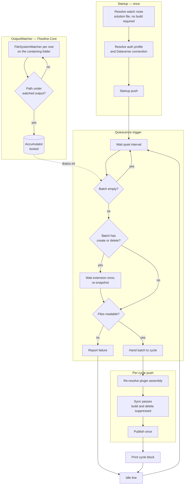

# Push Watch Mode - Plan

## Goal Capsule

- Objective: give `flowline push` a long-running watch mode that observes build output and pushes it to DEV as it appears, so a working session costs one trip to the terminal instead of one per edit.
- Product authority: this plan owns watch-mode behavior for `push` only. It does not change one-shot `push`, `sync`, or `deploy` semantics, and it does not make Flowline responsible for building.
- Open blockers: none.
- Product Contract preservation: unchanged. Planning added the Planning Contract, Implementation Units, Verification Contract, and Definition of Done; no requirement, decision, flow, or acceptance example was altered.

---

## Product Contract

### Summary

Add `flowline push --watch`: run one push, then stay running and watch build output. When output stops changing, push what appeared. Watch never builds and never deletes — the developer's own toolchain owns the build, and Flowline owns getting the result into DEV.

### Problem Frame

During focused web-resource work a developer round-trips the build-and-push loop every one to five minutes — roughly twelve to sixty times an hour. The cost that bites is not runtime. It is leaving the editor, finding the terminal, running the command, and returning to the browser; the interruption outweighs the seconds the command takes.

Nothing in the CLI addresses this. `push` is single-shot, and there is no `--watch` flag or file-watching API anywhere in `src/` (`src/Flowline/Commands/PushCommand.cs:33-74`). The pieces a watcher needs already exist: web-resource content is compared against Dataverse directly rather than by timestamp (`src/Flowline.Core/WebResources/WebResourcePlanner.cs:107`), plugin assemblies are skipped when a stored SHA256 matches the local DLL (`src/Flowline.Core/Services/PluginService.cs:91-96`), plugin projects and their build-output roots are already enumerated from the solution file (`src/Flowline.Core/Plugins/PluginProjectResolver.cs:57-87`), and Ctrl-C already cancels cooperatively (`src/Flowline/Program.cs:44-50`). What is missing is the loop around them.

### Key Decisions

- KD1. Watch never builds. Each cycle runs the push pipeline with build suppressed. (session-settled: user-directed — chosen over Flowline owning the build: the per-edit cost disappears either way, so build ownership only shifts a once-per-session setup cost, and the scaffolded build script is a full clean-and-rebuild that would be the slowest possible per-save action.) Governs R5, R7.
- KD2. A cycle is triggered by quiescence, not by the first change. Changes are buffered, and output generation is treated as finished once no further change is seen for a quiet interval. (session-settled: user-directed — a build writes many files over some span, so the absence of further writes is the only signal available that the output is complete and coherent.) Governs R6.
- KD3. Watch never deletes. Each cycle runs with deletion suppressed. (session-settled: user-directed — deletion stays a deliberate act, and a watcher observes transient output states a one-shot run never sees.) Governs R11.
- KD4. Watch covers everything `push` covers, narrowed by `--scope` rather than by a watch-specific rule. (session-settled: user-directed — consistency with the command it extends.) Governs R8.
- KD5. Startup runs one push before watching. (session-settled: user-directed — the session starts from a known baseline, and running `push` is already a request to write.) Governs R1.
- KD6. Session expiry stops the watcher rather than prompting or retrying. (session-settled: user-directed — a stalled prompt or a silently dead watcher is worse than a clean exit, because the developer is not looking at the terminal.) Governs R13.
- KD7. Output is an appended log with an explicit idle line after each cycle, following the `dotnet watch` convention. (session-settled: user-directed — chosen over a live status panel and over clear-per-cycle: scrollback is the record of what reached a live environment.) Governs R3, R15, R16.
- KD8. The scaffolded WebResources template gains a `watch` script and rollup watch configuration. (session-settled: user-directed — under KD1 the developer's watcher is the default path, so the template must supply one.) Governs R10.
- KD9. Watch refuses to start without an interactive terminal. (session-settled: user-directed — a watcher started in CI holds the pipeline open until it times out, and `init` and `clone` already fail this way when they need a terminal and have none.) Governs R4.

### Requirements

**Lifecycle**

- R1. `flowline push --watch` runs one push with build and deletion suppressed, then remains running and watches build output until stopped.
- R2. Ctrl-C stops watch cleanly, reusing the existing cancellation handler at `src/Flowline/Program.cs:44-50`; an in-flight cycle cancels cooperatively rather than being killed mid-write.
- R3. While idle, watch prints an explicit waiting line after every cycle so an unattended terminal shows the watcher is alive.
- R4. Watch refuses to start without an interactive terminal, exiting with a typed error that names the condition, before the startup push in R1 runs.

**Change handling**

- R5. Watch observes build output only — the web-resource output folder and the plugin publish output that `push` already reads — and never source trees. It does not build.
- R6. Changes are buffered rather than acted on individually. A cycle runs once no further change has been observed for a quiet interval, which is the signal that output generation has finished.
- R7. Each cycle runs the existing push pipeline with build suppressed, so the artifacts on disk at the moment of quiescence are exactly what is pushed.
- R8. `--scope` narrows what watch covers, using the values `push` already accepts (`all`, `webresources`, `plugins`, `assemblyonly`, per `src/Flowline/Commands/PushCommand.cs:24-40`); the default covers everything `push` covers.
- R9. Watch reuses the existing change detection unchanged — content comparison for web resources, stored-hash comparison for plugin assemblies — so output that was rewritten without changing produces no write to Dataverse.
- R10. The scaffolded WebResources template provides a `watch` script and matching rollup watch configuration, so a freshly scaffolded project has a watcher to run alongside.

**Safety**

- R11. Watch never deletes a web resource or a plugin component. Items present in the target but absent locally are reported and left in place.
- R12. The existing empty-output guard still applies to every cycle, so a build that has cleared its output folder cannot cause a push against an empty local set (`src/Flowline/Commands/PushCommand.cs:565-570`).
- R13. When the Dataverse session can no longer be refreshed, watch stops and surfaces the existing re-authentication message rather than prompting or continuing.
- R14. A failed cycle prints the error and returns to waiting; the watcher stays alive and the next quiescence retries.

**Output**

- R15. Each cycle appends a block naming what changed, what was pushed, and what was skipped — it does not rewrite earlier output in place.
- R16. Watch output is distinguishable from any other output sharing the terminal.

### Key Flows

- F1. Web resource output changes
  - **Trigger:** files under the web-resource output folder are written by the developer's bundler.
  - **Steps:** buffer the changes; wait for the quiet interval to elapse with no further writes; run the push passes with build and deletion suppressed; publish once for the resources that actually changed; print the cycle block; return to waiting.
  - **Outcome:** the changed resources are live in DEV; output rewritten without change produces no write.
  - **Covered by:** R3, R5, R6, R7, R9, R15.

- F2. Plugin output changes
  - **Trigger:** the plugin publish output is rewritten by the developer's build.
  - **Steps:** buffer; wait for quiescence; run the push passes with build and deletion suppressed; skip the assembly upload when the stored hash matches; print the cycle block; return to waiting.
  - **Outcome:** the assembly and its registrations are current in DEV.
  - **Covered by:** R3, R5, R6, R7, R9, R15.

- F3. Cycle fails
  - **Trigger:** a push pass errors — a Dataverse rejection, or the empty-output guard refusing.
  - **Steps:** print the error; leave the watcher running; return to waiting.
  - **Outcome:** the watcher survives a bad cycle, and the next quiescence retries.
  - **Covered by:** R12, R14.

- F4. Session ends
  - **Trigger:** token refresh fails, or the developer presses Ctrl-C.
  - **Steps:** cancel any in-flight cycle; on expiry, print the existing re-authentication message; exit.
  - **Outcome:** the developer is never left with a watcher that looks alive but writes nothing.
  - **Covered by:** R2, R13.

### Acceptance Examples

- AE1. Covers R11. Given a web resource exists in the solution and its output file is removed, when a cycle runs, then the resource is reported as not-in-source and remains in Dataverse.
- AE2. Covers R6. Given a build writes forty files over several seconds, when the writes stop, then one cycle runs after the quiet interval and one publish request is issued.
- AE3. Covers R6. Given a build is still writing when the quiet interval is measured from the first write, when further writes arrive, then the interval restarts and no cycle runs until writing stops.
- AE4. Covers R9. Given output is regenerated byte-identically, when a cycle runs, then no write reaches Dataverse and the cycle reports the resources as kept.
- AE5. Covers R12. Given a build has cleared the output folder and not yet repopulated it, when a cycle would run, then the empty-output guard refuses and nothing is deleted in Dataverse.
- AE6. Covers R8. Given `--scope webresources` and a change to plugin output only, when the quiet interval elapses, then no cycle work is performed.
- AE7. Covers R14. Given a cycle fails against Dataverse, when the next quiescence occurs, then a new cycle runs without the watcher having been restarted.
- AE8. Covers R13. Given the refresh token has expired, when the next cycle attempts a Dataverse call, then watch exits naming the `pac auth create` remedy.
- AE9. Covers R4. Given no interactive terminal, when `push --watch` starts, then it exits with a typed error and nothing is pushed.

### Scope Boundaries

- Building is out. Watch consumes build output; the developer's toolchain produces it. `dotnet watch build` and the template's rollup watch are the intended companions.
- Watching source trees is out. Source changes reach watch only through the output their build produces.
- Browser refresh is out. Flowline cannot reach the browser; a cycle ends when Dataverse is current.
- A live status panel is out. That shape belongs to the separate CLI dashboard thread and would break the scrollback record R15 depends on.
- Supervising the developer's bundler as a child process is out for this version. It would give one command and incremental builds together, but adds process lifecycle ownership — restart on crash, interleaved output, exit-code semantics — beyond what this buys.
- Changing one-shot `push` behavior is out. Watch composes with the existing flags rather than altering their meaning.
- Watching solution XML, or triggering `sync`, is out. Watch pushes assets to DEV; getting DEV changes into source stays a deliberate `sync`.

#### Deferred to Follow-Up Work

- Exposing the quiet interval as a CLI flag. It is injected internally from the first commit, so promoting it later is additive (see KTD3).
- `SIGTERM` handling via `PosixSignalRegistration`. Only needed if watch is expected to run under a supervisor, which this version does not target.
- Migrating already-scaffolded projects onto the new `watch` script. Their path is the startup output naming the command to run.

---

## Planning Contract

### Key Technical Decisions

- KTD1. **Watch the containing project folder with a path filter, not the output folder itself.** `IncludeSubdirectories = true` on the project folder, discarding events whose path is not under the output folder — and, for the web-resource project, discarding anything under `node_modules`. The scaffolded `build` script deletes the output folder outright (`clean` runs `rmSync('dist', …)`), and a `FileSystemWatcher` whose root disappears raises `Error` and stops on Windows while failing *silently* on Linux and macOS (dotnet/runtime#126295, #44484). Watching a root that never disappears turns delete-and-recreate into ordinary child events and removes the whole re-arm problem. The cost is a wider event surface: the filter runs in managed code *after* the runtime has already buffered the event, so it bounds CPU but not buffer occupancy, and the subtree carries `obj/`, IDE temp and swap files, and `.git` churn as well as `node_modules`. KTD11 is what absorbs an overflow from any of them. Periodic polling of the output folders was considered as the alternative that would dissolve KTD1, KTD11, and the overflow risk together, and rejected: at an interval short enough to keep the loop feeling immediate it re-stats both trees continuously for a developer's whole working session, which is a worse steady-state cost than an occasional dirty-tree rescan. Governs R5.
- KTD2. **Quiescence is a trailing-edge accumulator loop, not a reactive operator.** Watcher event handlers take a lock, add the path to an accumulator, and return. A single consumer loop tracks the time of the most recent change and reports a batch only once the quiet interval has elapsed *since that last change* — a write arriving mid-window restarts the wait, which is what makes the trigger mean "generation finished" rather than "some time has passed". When a batch is reported, the loop awaits the cycle *inline*. Awaiting inline makes overlapping cycles structurally impossible, so there is no re-entrancy flag and no test for one. Rejected: `System.Reactive` (`Throttle` is semantically right but is a dependency for one operator plus an `IObservable`-to-`Task` bridge to recover cancellation); `System.Threading.Channels` (queues when what is needed is coalescing); and the in-box `PhysicalFileProvider.Watch` / `IChangeToken` pair, which supplies neither debounce nor duplicate suppression, is one-shot so every fire needs re-registration, and carries a latency trap — its polling mode is switched on by an ambient environment variable with a four-second default interval, which would make the loop mysteriously slow on a machine that happens to set it. Governs R6.
- KTD3. **Quiet interval defaults to 500 ms, injected rather than flagged.** Comparable tools sit far lower — rollup's `buildDelay` is `0`, webpack's `aggregateTimeout` is 20 ms, tsc waits 250 ms — but every one of them prices a local rebuild that is cheap and idempotent. This trigger prices a network push to a live org. 500 ms is deliberately above that band. No CLI flag in this version; the value is a constructor parameter so tests can drive it to a few milliseconds. Revisit if a real build's write span is observed to exceed it — which requires that the symptom be visible, so the readability abort in KTD5 prints a line naming a possibly-too-short interval rather than folding into a generic cycle failure. Without that, a systematically wrong interval would surface only as ordinary retries and never trigger the revisit this decision promises. Governs R6.
- KTD4. **A batch containing creations or deletions extends the window once before the cycle runs.** Borrowed from `dotnet watch`, which adds a second delay when its accumulated batch contains an add or delete, precisely to absorb a torn delete-then-rewrite. That is exactly the shape of a bundler clearing and repopulating its output folder. Governs R6, R12.
- KTD5. **Quiescence does not mean the files are readable.** After the window elapses, each target the cycle will push is opened with `FileShare.Read` and retried briefly before the push proceeds; a file still locked by the writer aborts the cycle to the failure path rather than shipping a truncated bundle or a half-written assembly. Governs R7, R14.
- KTD6. **Factor a per-cycle method out of the existing pipeline; resolve identity once.** The auth profile and the Dataverse connection resolve once before the loop; each cycle re-runs only the plugin and web-resource sync passes against the same connection. Wrapping the whole of `ExecuteFlowlineAsync` would re-resolve the environment and re-authenticate on every save. The services the push path actually uses — `PluginService`, `WebResourceService`, `FormEventService` — hold only stateless readers, planners, and executors, with no cross-call accumulator, so repeated re-entry is safe as they stand. (`OrphanCleanupService`, whose mutable deferred state carries the documented single-command-per-process safety argument at `docs/solutions/architecture-patterns/post-deploy-service-di-fanout-protocol.md:66`, is reached by `deploy` and `drift` — not by `push` — so it is not in this path.) The obligation this decision creates is therefore narrow: any per-cycle bookkeeping watch introduces must live in the cycle, not on a singleton. Governs R7.
- KTD7. **No Spectre live display spans the loop.** `Status`, `Progress`, and `Live` are mutually exclusive and throw when a second one — or a prompt — starts while one is active; the repo already orders profile resolution before opening a spinner for this reason (`src/Flowline/Commands/FlowlineCommand.cs:170-172`). Each cycle opens a short-lived status for its own duration and closes it; the idle wait holds nothing open and writes plain lines. Governs R3, R15, R16.
- KTD8. **Cancellation escalates: first signal drains, second exits — and this needs new code in `Program.cs`.** The existing handler at `src/Flowline/Program.cs:44-50` cannot produce escalation on its own: it sets `e.Cancel = true` unconditionally and cancels a single, cancel-once token, so a second press is indistinguishable from the first, and suppressing the default handler removes the OS termination path as a fallback. Escalation therefore requires a press counter owned by the same handler that already subscribes to the event, plus a forced-exit path on the second press. Watch still consumes the existing token for the drain — it does not add a competing subscriber, which would race on `e.Cancel`. The behavior is worth the change: a push abandoned mid-write against Dataverse is worse than a slow shutdown, but a watcher that cannot be stopped twice is worse than both. Governs R2.
- KTD9. **Interactivity is `Console.Profile.Capabilities.Interactive`.** That is what the repo already uses, as a private one-liner duplicated across commands (`src/Flowline/Commands/CloneCommand.cs:259`, `src/Flowline/Commands/InitCommand.cs:238`), and it reduces to "no stream is redirected". `Environment.UserInteractive` is hardcoded `true` on Unix and is useless in containers and CI. Governs R4.
- KTD10. **Flag composition is validated inline, matching the repo's existing shape.** There is no `Settings.Validate()` override anywhere in the codebase; mutually-exclusive options are checked by `internal static` methods that throw `FlowlineException(ExitCode.ValidationFailed, …)` — `ResolveScope` (`src/Flowline/Commands/PushCommand.cs:582-611`) is the model, and the tests call those methods directly. `--force delete-orphans` is rejected alongside `--watch`; `--no-build` and `--no-delete` are accepted as redundant no-ops; `--dry-run` is allowed and makes the loop observable without writing. Governs R4, R8, R11.
- KTD11. **A watcher `Error` marks the tree dirty rather than being swallowed.** The event means either "cannot continue monitoring" or "internal buffer overflowed" with no way to distinguish, and events during the gap are lost. Watch warns and treats the next cycle as if everything changed. No re-arm logic is added, because KTD1 removes the case that needs it. Governs R14.
- KTD12. **Watch roots come from the existing solution-file resolution, using only its build-free half.** Plugin projects and their `bin/Release` roots are already enumerated from the solution file by `PluginProjectResolver.EnumerateCandidates` (`src/Flowline.Core/Plugins/PluginProjectResolver.cs:57-87`), which is source-text-only, needs no build, and is already multi-project aware; the web-resource root is the `dist` folder under the single WebResources project path from `SolutionFileLayout`. Composing those two is the watch-roots list. Watch must **not** call the assembly-identifying half at startup: `FindOutputAssemblies` throws `ExitCode.NotFound` when a project has no Release output (`PluginProjectResolver.cs:260-264`), which would kill a watcher started before the first build. Which DLL is the plugin assembly is re-resolved per cycle after quiescence, never cached from startup. Governs R5.
- KTD13. **Mid-session token-refresh failure needs a typed wrapper that does not exist yet.** R13 assumes an expired session surfaces the existing "Session expired … run `pac auth create`" message, but that typed exception only wraps the *initial* token acquisition (`src/Flowline.Core/Services/DataverseConnector.cs:304-318`). The per-request refresh callback wired into `ServiceClient` (`DataverseConnector.cs:143-147`) has no handler at all, so a refresh failure mid-session propagates raw and lands in the generic unhandled-exception branch with a stack trace. A one-shot push never lives long enough to reach that path; watch is the first caller that does. Satisfying R13 therefore means wrapping the refresh callback's failure in the same typed exception, not merely letting an existing one propagate. Governs R13.
- KTD14. **Watch refuses to start when build output is missing, exactly as one-shot `push` does today.** (session-settled: user-directed — chosen over tolerating missing output and entering the loop anyway: keeping the existing hard failure means the shared per-cycle method needs no caller-supplied tolerance, which preserves U2's one-implementation property outright. The cost is that a freshly scaffolded project must be built once before watch will start, so the failure message should say to build first.) Governs R1.
- KTD15. **The extraction boundary sits after the connect step.** The reusable per-cycle method covers the sync passes only — the work that already runs after connect today. One-shot keeps build → connect → per-cycle method; watch does connect → per-cycle method, repeatedly. (session-settled: user-directed — chosen over unifying on watch's connect-first order: existing `push` users would otherwise start seeing an authentication failure ahead of a build failure when both are present, a visible behavior change for people who never asked for watch. Holding the boundary here reduces U2 from a behavior-affecting refactor to a straight extraction.) Governs R7.
- KTD16. **A cycle that exceeds a fixed time limit is cancelled and routed onto the failure path.** Default two minutes, well past a normal cycle. (session-settled: user-directed — chosen over leaving cycles unbounded and over bounding only the readability retry: a hung Dataverse call is indistinguishable from an idle watcher, which is precisely the "looks alive but writes nothing" outcome the design refuses elsewhere. Routing a timeout onto the existing failed-cycle path means it costs one timer, not a new failure taxonomy.) Governs R14.

### Assumptions

- The developer runs their own watchers alongside — the template's `watch` script for web resources, and an equivalent such as `dotnet watch build` for plugins. Its failure mode is silent: forget to start one and watch waits forever while the developer edits. The startup banner in U4 is only a partial mitigation, because after startup an idle-and-forgotten watcher is indistinguishable from an idle-and-healthy one — both print the same waiting line indefinitely. Whether to reprint the companion command after a long run of empty cycles is a judgment call left to U4.
- Token refresh during a long session is handled by MSAL through the token-provider callback `DataverseConnector` passes to `ServiceClient` (`src/Flowline.Core/Services/DataverseConnector.cs:126-147`). R13 concerns only the case where silent refresh itself fails, which already throws a typed exception naming the remedy.
- One watch process per project and environment at a time. Concurrent watchers against the same DEV are not designed for.
- `node_modules` lives under the web-resource project folder, so the KTD1 filter must exclude it. Its churn during an `npm install` may still overflow the watcher buffer, which KTD11 covers.

### High-Level Technical Design

Four stages sit between a file write and a push, and the boundaries between them are what keep the loop safe: the watcher never decides anything, the trigger never touches Dataverse, and the cycle never overlaps itself.

Two properties the diagram is drawn to make visible. The cycle is awaited *inline* by the trigger loop, so a write arriving mid-push lands in the accumulator and is picked up on the next pass — overlap is structurally impossible rather than guarded against. And startup resolution deliberately stops short of identifying which DLL is the plugin assembly, because that step requires built output and would fail a watcher started before the first build.

---

### Sequencing

U1 and U3 are independent and can proceed in parallel. U2 depends on U1, because forcing no-delete for watch cycles while leaving one-shot's delete path intact requires the settings field U1 introduces. U4 depends on U1, U2, and U3. U5 is independent of all of them. U6 depends on U1, U4, and U5, since it documents shipped rather than planned behavior.

---

## Implementation Units

### U1. Watch flag and its guards

- **Goal:** `--watch` exists, parses, and refuses the combinations it cannot honor — before any Dataverse work begins.
- **Requirements:** R4, R8, R11. Honors KTD9, KTD10.
- **Dependencies:** none.
- **Files:**
  - `src/Flowline/Commands/PushCommand.cs`
  - `tests/Flowline.Tests/PushCommandTests.cs`
- **Approach:**
  1. Add a `--watch` boolean option to `PushCommand.Settings`, following the `--no-build` declaration shape (`[CommandOption]` + `[Description]` + `[DefaultValue(false)]`).
  2. Add an `internal static` validator that throws `FlowlineException(ExitCode.ValidationFailed, …)` when watch is requested without an interactive terminal, and when watch is combined with `--force delete-orphans`. Accept `--no-build` and `--no-delete` silently; accept `--dry-run`.
  3. Take interactivity as a parameter rather than reading the console inside the validator, so it is testable without a terminal.
- **Patterns to follow:** `ResolveScope` in the same file for validator shape and exception style; the private `IsInteractive()` one-liner in `src/Flowline/Commands/CloneCommand.cs:259` for the capability check at the call site.
- **Test scenarios:**
  - Covers AE9. Watch requested with interactivity false throws `FlowlineException`.
  - Watch requested with interactivity true returns without throwing.
  - Watch combined with `--force delete-orphans` throws.
  - Watch combined with `--no-build` and `--no-delete` returns without throwing.
  - Watch with `--scope webresources` returns without throwing, and the resolved scope still excludes plugins.
  - Watch absent leaves existing push validation behavior unchanged.
- **Verification:** the new tests pass and the existing `PushCommandTests` suite is unaffected.

### U2. Per-cycle push unit

- **Goal:** the sync passes can be run repeatedly against one already-established connection, with build and deletion suppressed and no state carried between runs.
- **Requirements:** R7, R9, R11, R12. Honors KTD6.
- **Dependencies:** U1 — the per-cycle method must suppress deletion for watch cycles while leaving one-shot's `--force delete-orphans` path intact, which requires U1's settings field to distinguish the caller.
- **Files:**
  - `src/Flowline/Commands/PushCommand.cs`
  - `tests/Flowline.Tests/PushCommandTests.cs`
- **Approach:**
  1. Split the existing pipeline so environment/solution resolution, build, profile resolution, and the Dataverse connection all stay in an outer step, and only the plugin and web-resource sync passes plus publish move into a per-cycle method taking the established connection. The cut sits after connect (KTD15), so one-shot's build → connect → sync ordering is preserved exactly and missing build output keeps throwing on both paths (KTD14) — no tolerance parameter is needed, and the method stays a single implementation.
  2. Force build suppression and `RunMode.NoDelete` inside the per-cycle path rather than relying on the caller's flags, so watch cannot delete even if flags say otherwise.
  3. Ensure any per-cycle bookkeeping is constructed per call rather than accumulating on the singleton services; assert the orphan-cleanup deferred state is empty at cycle start.
  4. Leave the one-shot path calling the same per-cycle method exactly once, so both paths share one implementation.
- **Execution note:** extract first and confirm one-shot `push` behavior is unchanged before adding any watch caller.
- **Patterns to follow:** the existing `ResolveRunMode` for run-mode selection; `EnsureBuiltWebResources` stays on the per-cycle path so R12 holds for every cycle, not just the first.
- **Test scenarios:**
  - Covers AE5. A cycle with an empty output folder throws the existing empty-output error and performs no deletion.
  - Two consecutive cycles over identical unchanged output produce identical outcomes, with no residue from the first affecting the second.
  - A cycle constructed from watch settings resolves to no-delete mode even when the caller's settings did not request it.
  - One-shot push with no watch flag exercises the same per-cycle method once and behaves as before.
- **Verification:** one-shot `push` against a real DEV environment behaves identically to `master` for a changed and an unchanged web resource.

### U3. Output watcher and quiescence trigger

- **Goal:** a reusable component that reports "output has settled" for a set of watched output folders, and nothing else.
- **Requirements:** R5, R6. Honors KTD1, KTD2, KTD3, KTD4, KTD5, KTD11.
- **Dependencies:** none.
- **Files:**
  - `src/Flowline.Core/Watch/OutputWatcher.cs` (new)
  - `tests/Flowline.Core.Tests/Watch/OutputWatcherTests.cs` (new)
- **Approach:**
  1. Construct with a set of watched roots, each carrying the folder to observe and a predicate for which descendant paths count. Take the quiet interval and the extension delay as constructor parameters.
  2. One `FileSystemWatcher` per root, on the containing folder with `IncludeSubdirectories = true`, leaving `NotifyFilter` at its default. Handlers lock, record the path and change kind, and return.
  3. Expose an async enumerable or callback-driven loop that delays, snapshots-and-clears under the lock, extends once when the batch contains a creation or deletion, then reports the batch. Observe the supplied `CancellationToken` in the delay.
  4. Before reporting, verify each affected file opens with `FileShare.Read`, retrying a small fixed number of times; report a readability failure distinctly from a normal batch.
  5. Subscribe to `Error` and surface it as a dirty-tree signal rather than throwing.
- **Technical design (directional):** the loop is roughly — wait, snapshot, if empty continue, if the batch has adds or deletes wait again and re-snapshot, check readability, hand the batch to the caller, repeat. Handing off by awaiting the caller's work inline is what prevents overlap.
- **Patterns to follow:** no existing precedent in this repo; the shape is modelled on `dotnet watch`'s accumulator loop. Place it in `Flowline.Core` per the project boundary rule — it needs no `CommandContext`.
- **Test scenarios:**
  - Covers AE2. Many writes inside one quiet window produce exactly one reported batch.
  - Covers AE3. A write arriving before the window elapses restarts it, and no batch is reported until writing stops.
  - A batch containing a deletion waits the extension delay before being reported.
  - Deleting and recreating the watched output folder produces a batch rather than killing the watcher.
  - Paths excluded by the predicate — including anything under `node_modules` — never appear in a batch.
  - A file held open by another writer causes a readability failure rather than a reported batch, and a later attempt succeeds once released.
  - Cancelling the token ends the loop without throwing.
- **Verification:** tests drive the watcher with a temp directory and millisecond-scale intervals; the suite completes in seconds, not tens of seconds.

### U4. Watch loop, output, and exit

- **Goal:** `push --watch` runs the startup push, then loops — printing per-cycle blocks and an idle line, surviving failures, and exiting cleanly.
- **Requirements:** R1, R2, R3, R5, R13, R14, R15, R16. Honors KTD7, KTD8, KTD12.
- **Dependencies:** U1, U2, U3.
- **Files:**
  - `src/Flowline/Commands/PushCommand.cs`
  - `src/Flowline/Program.cs` — the Ctrl-C press counter and forced-exit path KTD8 requires; the existing handler already owns the event, so escalation state belongs there rather than in a second competing subscriber
  - `src/Flowline.Core/Services/DataverseConnector.cs` — wrap the per-request token-refresh failure in the typed session-expired exception R13 depends on (KTD13)
  - `tests/Flowline.Tests/PushCommandTests.cs`
- **Approach:**
  1. Resolve the watch roots before anything else: plugin build-output roots from the solution file via the build-free candidate enumeration, plus the web-resource output folder from the solution layout. Do not call the assembly-identifying resolution here — it throws when a project has not been built (KTD12). Narrow the resulting set by `--scope`.
  2. After validation and connection setup, run the startup push through the U2 method, then enter the U3 loop.
  2. Print a startup banner naming the watched folders, the target environment, the quiet interval, and the companion watcher command to run — this is the mitigation for the assumption that the developer started their own watcher. When startup refuses because output is missing (KTD14), the message says to build first rather than reporting a bare not-found.
  3. Per cycle: print a timestamped header naming what changed, open a short-lived status for the push, print the result lines, then the idle line. Use the plain dim prefix for the idle line, not the skip glyph, which already means something else.
  4. On a failed cycle, print the error and return to waiting. Bound each cycle with the KTD16 timeout so a stuck call becomes a failed cycle rather than a silent freeze. Let a session-expiry `FlowlineException` propagate so the process exits with its message intact.
  5. On first cancellation, stop accepting cycles and let the in-flight one finish; on a second, exit immediately. Print a session summary on exit.
- **Execution note:** this unit is where tone-of-voice review applies — every new line is user-facing.
- **Patterns to follow:** `Console.Ok/Info/Skip/Warning` in `src/Flowline.Core/Console/FlowlineConsoleExtensions.cs`; the existing convention that commands do not catch `OperationCanceledException` because `Program.cs` maps it to the cancelled exit code.
- **Test scenarios:**
  - Covers AE7. A cycle that throws a Dataverse error leaves the loop running and a subsequent batch runs a new cycle.
  - Covers AE8. A session-expiry exception ends the loop and propagates its message rather than being swallowed.
  - Covers AE6. With `--scope webresources`, a batch containing only plugin output performs no cycle work.
  - The session summary reports cycle, push, kept, and failure counts consistent with the cycles that ran.
  - The startup banner names every watched folder and the companion command.
  - A solution with two plugin projects yields a watch root for each, and `--scope webresources` yields neither.
  - Root resolution succeeds for a plugin project that has never been built, rather than throwing.
  - A second cancellation signal exits while the first is still draining an in-flight cycle.
  - A cycle that exceeds the time limit is cancelled, reported as a failed cycle, and followed by a normal idle line rather than a stall.
  - Starting watch with no build output refuses with a message naming the build step, and does not enter the loop.
  - A token-refresh failure raised from the per-request callback surfaces the typed session-expired message, not an unhandled exception.
- **Verification:** manual smoke against a real DEV environment — start watch, save a web resource, confirm it lands and the idle line returns; introduce a compile error in the bundler and confirm the watcher survives; press Ctrl-C mid-cycle and confirm a clean exit.

### U5. Template watch script and rollup watch config

- **Goal:** a freshly scaffolded project has a watcher to run alongside `push --watch`.
- **Requirements:** R10. Honors KD8.
- **Dependencies:** none.
- **Files:**
  - `src/Flowline/Templates/WebResources/package.json`
  - `src/Flowline/Templates/WebResources/rollup.config.mjs`
  - `tests/Flowline.Tests/` — extend the existing scaffolding coverage if present
- **Approach:**
  1. Add a `watch` script that copies static assets once and then runs rollup in watch mode. It must not invoke `clean`, or every rebuild would delete the output folder and defeat KTD1's premise.
  2. Add a watch configuration block to the rollup config scoped to the source folder.
  3. No dependency change — rollup is already a devDependency, and both template files are already embedded resources, so no project-file entry is needed.
- **Patterns to follow:** the existing scripts block and the array-export shape of the rollup config; `src/Flowline/Utils/TemplateWriter.cs` shows how templates reach a scaffolded project.
- **Test scenarios:**
  - A scaffolded project's `package.json` contains a `watch` script.
  - The `watch` script does not invoke `clean`.
  - `build` still cleans, so one-shot behavior is unchanged.
- **Verification:** scaffold a project, run the new script, and confirm rollup enters watch mode and rewrites output on a source change without emptying the folder.

### U6. Documentation

- **Goal:** the new flag is documented everywhere the command surface is documented.
- **Requirements:** supports R1, R4, R10.
- **Dependencies:** U1, U4, U5 (document the shipped behavior, not the planned behavior).
- **Files:**
  - `README.md`
  - `CHANGELOG.md`
  - the GitHub wiki checkout, if available: the command reference, the web-resources push page, and the WebResources project page
- **Approach:** document `--watch` and its refusals, the companion-watcher requirement, and the new template script. Note in the changelog that watch never builds and never deletes — both are surprising relative to plain `push`.
- **Patterns to follow:** existing changelog entry style; `docs/tone-of-voice.md` for any user-facing phrasing quoted into docs.
- **Test expectation:** none — documentation only.
- **Verification:** README and changelog updated; if the wiki checkout is not present on this machine, say so explicitly rather than skipping silently.

---

## System-Wide Impact

- **One-shot `push` shares the extracted per-cycle method (U2).** This is the widest blast radius in the plan: every existing `push` user runs the refactored path, for a feature only watch users need. The extraction must be behavior-preserving and verified as such before any watch caller exists — hence U2's execution note and its one-shot verification step.
- **Newly scaffolded projects change shape (U5).** The template gains a script. Existing projects are untouched, so two generations of scaffold coexist; the startup banner is what bridges the gap for the older one.
- **Plugin assembly resolution is exercised far more often.** Today it runs once per `push`; under watch it runs once per cycle, dozens of times an hour, including against output a build is actively rewriting. Its failure mode at startup is a hard throw (KTD12), and its per-cycle failure mode is what R14 must absorb.
- **The single-command-per-process invariant is now load-bearing in a second place.** The documented safety argument for singleton service state assumed a fresh process per invocation. After this work the assumption is "fresh process, or a watch cycle that resets its own state" — anyone adding mutable service state later needs to know that.
- **Documentation surfaces (U6):** README, changelog, and three wiki pages describe the push command surface and its flags.

---

## Risks & Mitigations

- **The U2 extraction regresses one-shot `push`.** Highest-severity risk here, because it hits users who never asked for watch. Mitigation: extract and verify against `master` behavior *before* adding the watch caller; keep the one-shot path calling the same method exactly once so there is one implementation, not two.
- **A watcher started before the first build hard-fails.** Existing plugin resolution throws when no Release output exists. Mitigation: KTD12 restricts startup to the build-free half of resolution — but the startup push itself may still hit the throwing path, which is the open question below.
- **Buffer overflow during `npm install`.** `node_modules` churn under a watched parent can overflow the watcher's internal buffer. Mitigation: KTD11 treats an `Error` as a dirty tree rather than a crash; the filter discards the events cheaply, and the buffer size is deliberately left at its default rather than tuned.
- **A too-short quiet interval pushes a partial bundle.** Mitigation is layered: the extension on create/delete batches (KTD4), the readability re-check (KTD5), and the empty-output guard (R12). Any one of them failing still leaves two.
- **Timing tests turn flaky.** Mitigation: the interval is a constructor parameter (KTD3), so tests drive milliseconds rather than sleeping on the 500 ms default.

---

## Open Questions

**Deferred to implementation**

- Whether the watch roots list dedupes when two plugin projects share a build-output root.
- Whether the readability re-check applies to every file in a batch or only the ones a cycle will actually push.

---

## Verification Contract

| Gate | Command | Applies to |
|---|---|---|
| Focused tests while iterating | `dotnet test tests/Flowline.Tests/Flowline.Tests.csproj --filter FullyQualifiedName~PushCommandTests` | U1, U2, U4 |
| Watcher tests | `dotnet test tests/Flowline.Core.Tests/Flowline.Core.Tests.csproj --filter FullyQualifiedName~OutputWatcher` | U3 |
| Full suite before finishing | `dotnet test Flowline.slnx` | all |
| Build | `dotnet build Flowline.slnx` | all |
| Manual smoke | start `push --watch` against a real DEV environment; save a web resource; break the build; Ctrl-C mid-cycle | U4, U5 |

Timing-sensitive tests must inject millisecond-scale intervals rather than waiting on the 500 ms default.

---

## Definition of Done

- `flowline push --watch` runs a startup push, then pushes on quiescence until stopped, with build and deletion suppressed on every cycle.
- Watch refuses to start without an interactive terminal and refuses to run alongside `--force delete-orphans`.
- Deleting and recreating the output folder does not kill the watcher and does not delete anything in Dataverse.
- A failed cycle leaves the watcher running; a cycle that exceeds its time limit becomes a failed cycle rather than a freeze; a session that cannot refresh ends the watcher with the typed remedy message rather than a stack trace.
- One-shot `push` behaves exactly as it does on `master` — same ordering, same failures, same output.
- Ctrl-C drains an in-flight cycle on the first signal and exits on the second.
- A scaffolded project has a `watch` script that does not clean its output folder.
- All new user-facing lines follow `docs/tone-of-voice.md`.
- `dotnet build Flowline.slnx` and `dotnet test Flowline.slnx` pass.
- README, changelog, and the wiki pages covering the push command surface are updated — or the wiki's unavailability is reported explicitly.

---

## Sources & Research

- `src/Flowline/Commands/PushCommand.cs` — flag declaration shape, `PushScope` values, `ResolveScope` validator pattern, build gating, and the empty-output guard.
- `src/Flowline/Commands/FlowlineCommand.cs` — the `ExecuteFlowlineAsync` hook, and the comment recording that profile resolution must precede any status spinner.
- `src/Flowline/Program.cs` — the existing `CancellationTokenSource` and `Console.CancelKeyPress` wiring.
- `src/Flowline.Core/WebResources/WebResourcePlanner.cs`, `src/Flowline.Core/WebResources/WebResourceExecutor.cs` — content comparison, delete gating, the single publish request.
- `src/Flowline.Core/Services/PluginService.cs` — stored-hash skip for assembly upload.
- `src/Flowline.Core/Plugins/PluginProjectResolver.cs` — build-free candidate enumeration that supplies the watch roots, and the assembly-identifying half that must not run at startup.
- `src/Flowline.Core/Services/SolutionFileLayout.cs` — the single WebResources project path the web-resource watch root derives from.
- `src/Flowline/Templates/WebResources/` — the scaffolded build path U5 extends.
- `src/Flowline/Utils/TemplateWriter.cs`, `src/Flowline/ProjectScaffolder.cs` — how embedded templates reach a scaffolded project.
- `docs/solutions/architecture-patterns/post-deploy-service-di-fanout-protocol.md` — the single-command-per-process safety argument that KTD6 must respect.
- `docs/solutions/architecture-patterns/orphan-cleanup-two-phase-deploy-pipeline.md` — the existing empty-set short-circuit that R12 parallels.
- `docs/solutions/runtime-errors/spectre-console-status-prompt-exclusivity.md` — the live-display exclusivity constraint behind KTD7.
- dotnet/runtime issues #126295 and #44484 — silent watcher failure when the watched root is deleted on Linux and macOS, the evidence for KTD1.
- `dotnet watch`'s accumulator loop — the fixed-window shape and the extra delay on add/delete batches, the evidence for KTD2 and KTD4.
- rollup `watch.buildDelay` (0), webpack `watchOptions.aggregateTimeout` (20 ms), TypeScript's 250 ms watch timer — the comparison band KTD3 deliberately sits above.
- `docs/plans/2026-06-14-001-feat-push-no-build-plan.md` — the prior build-ownership decision, the pinned output paths, and the reasoning behind the empty-output guard.
