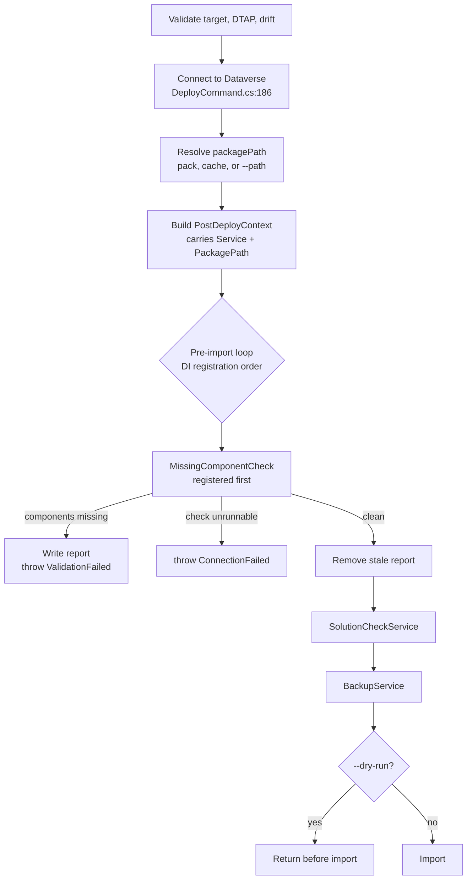

# Deploy Import Preflight - Plan

## Goal Capsule

- Objective: before `deploy` imports anything, ask the target environment which components the packed solution requires and the target does not have, and name all of them at once — so a discover-fix-retry loop that costs one full import per missing component collapses to a single pass.
- Product authority: this plan owns the missing-component gate on `deploy`. It does not change import mechanics, other deploy gates, or any command that does not import.
- Open blockers: none. The mechanism was verified end-to-end against a live environment before this plan was written.
- Product Contract preservation: unchanged by planning. Planning added the Planning Contract, Implementation Units, Verification Contract, and Definition of Done; no requirement, decision, flow, or acceptance example was altered.

---

## Product Contract

### Summary

Add a read-only preflight gate to `deploy` that hands the packed solution to the target's `RetrieveMissingComponents` message and blocks the deploy when the target lacks anything the solution needs. Every missing component is named in one pass — schema name, display name, and the solution that owns it — with the first five in the terminal and the full list in a report file.

### Problem Frame

Missing-component failures are among the most frequent deploy failures in practice, and Microsoft's own support corpus carries five separate articles on them.

They come in two shapes. The platform detects the first itself and presents a categorized list of what is absent, sorted into Applications, Managed Solutions, and Unmanaged Components, with Install and Update buttons beside the ones it can fetch. The second is error code `8004F036` — *"There was an error calculating dependencies for this component. Missing component id [GUID]"*. It arrives mid-import, carries a raw GUID and nothing else, and Microsoft's documented remedy is to download the import log, open its Components tab in Excel, unzip the solution, open `solution.xml`, and search for the GUID by hand.

That first shape is only softer in the maker portal. `deploy` imports through the PAC CLI, where the remediation page and its Install buttons never appear — both shapes reach the developer as a failed import against a target they cannot deploy to. What differs between them is the remedy, not the cost.

The cost is not that one dig. It is that **the import stops at the first unresolvable dependency**, so the dig only ever reveals one component. The developer fixes it in DEV, re-syncs, re-packs, and re-imports — minutes to tens of minutes per attempt — only to be told about the next one. N missing components cost N full imports.

Every gate `deploy` ships today validates Flowline's own preconditions: a clean working tree, a valid target, DTAP order, local drift, solution-checker findings. None asks the target environment what it actually has. `RetrieveMissingComponents` appears nowhere in `src/`.

### Key Decisions

- KD1. **Preflight blocks the deploy, with a skip flag.** (session-settled: user-directed — chosen over warn-and-continue: consistent with how the DTAP and drift gates already behave, and the check is treated as authoritative.) Governs R2, R3.
- KD2. **Prevent the loop rather than speed up one iteration of it.** Translating a failed import's GUID into a name locally would remove the Excel step but still reveal one component per import. Governs R1.
- KD3. **The terminal shows the first five; the report file carries everything.** (session-settled: user-directed — the terminal is not durable and the developer clicks away from it.) Governs R7, R8.
- KD4. **The report file is a failure artifact, and its presence always describes the latest run.** (session-settled: user-directed — chosen over writing one on every run: keeps the artifacts folder quiet.) Governs R8.
- KD5. **Diagnosis only — preflight never installs or repairs what is missing.** Unlike a package manager, Flowline cannot supply a first-party dependency. Governs R11.
- KD6. **The gate blocks on every missing component, whatever its origin.** The platform's categorized remediation page is a maker-portal surface that a CLI deploy never reaches, so a first-party dependency costs a Flowline user exactly what any other missing component costs. (session-settled: user-directed — chosen over excluding the class the portal handles: the end result is the same failed import either way.) Governs R2, R6, R9.
- KD7. **A preflight that cannot run fails the deploy, distinctly from one that finds components missing.** (session-settled: user-directed — chosen over warning and continuing: `BackupService` and `SolutionCheckService` already fail closed on an unavailable check, and the solution checker already separates "failed to run" from "found findings" by message and exit code.) Governs R12.

### Requirements

**Gate behavior**

- R1. `deploy` runs a missing-component preflight against the target before the import begins.
- R2. When the target is missing one or more required components, `deploy` stops with a validation failure and does not import.
- R3. A skip flag suppresses the gate, following the naming and behavior of the existing `--skip-dtap-check` and `--skip-solution-check` flags.
- R4. When nothing is missing, the gate passes without interrupting the deploy.
- R5. `--dry-run` runs the gate and reports its verdict, consistent with `--dry-run` running every other gate before exiting ahead of the import.
- R12. A preflight that returns no verdict — the call errors, times out, or is refused for want of privileges — stops the deploy with a failure stating that the check could not run and why, worded and exit-coded distinctly from the missing-components failure, and naming the skip flag as the way through.
- R13. The gate runs ahead of any pre-import step that takes significant time or writes to the target — the solution checker and the environment backup in particular — so a deploy that cannot succeed is stopped before that time is spent.

**Reporting**

- R6. Each reported component names what is missing, what in the solution requires it, and the solution that owns it, using human-readable identifiers rather than GUIDs — the owning solution is what tells the developer which remedy applies.
- R7. The terminal shows the first five missing components, then points at the report file.
- R8. A report file carrying every missing component is written when — and only when — the gate finds any, so the record survives the terminal being closed. A run that finds nothing missing removes any report left by an earlier run, so the file's presence always describes the most recent outcome.
- R9. The failure names the remedies available rather than assuming one: install the missing solution or application in the target, or remove the component that created the dependency from the solution in DEV and `sync`. Which fits depends on the component, so the failure presents both routes rather than prescribing one.

**Safety**

- R10. The gate writes nothing to the target environment.
- R11. The gate reports what is missing and stops; it never installs, updates, or otherwise repairs a missing dependency.

### Key Flows

- F1. Target is missing components
  - **Trigger:** `deploy` reaches the pre-import gates with a packed solution.
  - **Steps:** hand the packed solution to the target; receive the full set of components the target lacks; print the first five with their owning solutions and write the full report; name the remedy routes; stop before import.
  - **Outcome:** nothing is written to the target, and the developer knows every missing component from one run rather than one per import.
  - **Covered by:** R1, R2, R6, R7, R8, R9, R10.

- F2. Target is complete
  - **Trigger:** as F1, with a target that has everything the solution requires.
  - **Steps:** the gate resolves with nothing missing; any report left by an earlier run is removed; deploy continues into its remaining gates and the import.
  - **Outcome:** a healthy deploy is unchanged apart from the gate's own duration, and no stale report is left claiming otherwise.
  - **Covered by:** R1, R4, R8.

- F3. Developer overrides the gate
  - **Trigger:** `deploy` runs with the skip flag.
  - **Steps:** the gate does not run; deploy proceeds to import as it does today.
  - **Outcome:** the developer retains the escape hatch when the check is wrong or unwanted.
  - **Covered by:** R3.

### Acceptance Examples

- AE1. Covers R2, R7, R8. Given a target missing seven required components, when `deploy` runs, then it stops before import, the terminal names five of them and points at the report file, and the report file lists all seven.
- AE2. Covers R4. Given a target that has every required component, when `deploy` runs, then the gate passes and the deploy continues.
- AE3. Covers R3. Given a target missing a required component and the skip flag set, when `deploy` runs, then the gate does not block and the import proceeds.
- AE4. Covers R5. Given `--dry-run` and a target missing a required component, when `deploy` runs, then the missing component is reported and no import occurs.
- AE5. Covers R6. Given a missing component, when it is reported, then the report names its schema name, its display name, and the solution that owns it wherever the target returns them, and never falls back to a bare GUID.
- AE6. Covers R10. Given any preflight outcome, when the gate has run, then nothing in the target environment has changed.
- AE7. Covers R6, R9. Given a missing component owned by a first-party application, when the gate blocks, then the report names that application as the owner and the failure presents installing it in the target alongside removing the dependency in DEV — it does not prescribe a DEV edit alone.
- AE8. Covers R12. Given an account without the privileges the preflight message requires, when `deploy` runs, then it stops with a failure naming the check as unable to run and pointing at the skip flag — not with the missing-components failure.
- AE9. Covers R8. Given a report file left by an earlier blocked deploy, when a later run finds nothing missing, then the report file is gone and its absence correctly reports the clean run.

### Scope Boundaries

- Fixing what is missing is out. The gate diagnoses; installing a first-party application or importing a prerequisite solution stays the developer's action.
- Non-dependency import failures are out. A deploy can still fail for reasons this gate cannot see, and those failures still send the developer to the import log.
- Translating a failed import's GUID into a component name is out. It was considered as an alternative and as a companion; it optimizes a step that stops being taken once the gate works. Reconsider only if non-dependency failures prove to dominate.
- Other commands are out. Import happens only in `deploy`.

### Dependencies and Assumptions

Verified on 2026-08-09 against live DEV and TEST environments, using packed artifacts from a separate Flowline test workspace. PROD was not touched:

- The required-component list survives Flowline's pack. A real solution's committed `Solution/src/Other/Solution.xml` carries the `MissingDependencies` element, and all 12,786 of its `MissingDependency` blocks appear in the packed artifact.
- The platform genuinely queries the target rather than echoing the file back. Two dependencies were injected into a packed solution — one fabricated, one a real first-party component. Only the fabricated one was returned; the real one was resolved silently because the target has it.
- The response is human-readable. For the missing component itself, `SchemaName`, `DisplayName`, and the owning `Solution` come back populated. The dependent component carries `SchemaName` and `DisplayName` but returned an empty `Solution`, so R6's owning-solution field is reliable for what is missing, not for what needs it.
- The gate costs 7.3–7.5 seconds for a 497 KB solution carrying 12,786 required components, and 1.3 seconds for a 14 KB solution. That is the per-deploy cost R3's skip flag exists to let a developer decline.

Assumptions not yet verified:

- Message richness varies by component type. For entity-type components the parent fields and ids came back empty, so R6's rendering must degrade gracefully when only a schema name and display name are available.
- Whether an unmanaged import leaves a partially-written target on failure is unknown. It does not change this plan — preflight prevents the import either way — but it determines how severe the failure being prevented actually is.

---

## Planning Contract

### Key Technical Decisions

- KTD1. **The gate is an `IPostDeployService`, registered ahead of the others.** The pre-import loop (`src/Flowline/Commands/DeployCommand.cs:243-244`) iterates services in DI registration order, and it sits after the Dataverse connection (`:186`) and after pack (`:212`) — so `PostDeployContext` already carries both a live `IOrganizationServiceAsync2` and the packed zip path. Registering the preflight service before `SolutionCheckService` in `src/Flowline/Program.cs:71-75` satisfies R13 without restructuring the command. Governs R1, R13.
- KTD2. **The request is the typed `RetrieveMissingComponentsRequest` with `CustomizationFile` set to the packed zip bytes.** Not an untyped `OrganizationRequest` with a solution id — the message reads the required-component list out of the file itself. `Microsoft.Crm.Sdk.Messages` ships inside the already-referenced `Microsoft.PowerPlatform.Dataverse.Client` package, so no new `PackageReference` is needed; no file in `src/` imports that namespace today. Governs R1, R6.
- KTD3. **The service lives in `Flowline.Core`, not beside its siblings.** The project boundary rule in `AGENTS.md` places anything needing no `CommandContext` or `CommandSettings` in Core, and `OrphanCleanupService` is the precedent that follows it. `SolutionCheckService` and `BackupService` sit in `src/Flowline/Services/` and are named in `AGENTS.md` as known-misfiled — do not copy that placement.
- KTD4. **Managed and unmanaged targets are treated identically; the gate blocks either way.** (session-settled: user-approved — chosen over making the gate advisory-only for managed deploys: the requirements draw no distinction, and a managed import that fails on a missing component costs the same as an unmanaged one.) Governs R2.
- KTD5. **The report file sits beside the packed artifact.** `SolutionCheckService` composes its output directory from the package path's own directory (`src/Flowline/Services/SolutionCheckService.cs:14-15`) and is the only existing precedent for a report sidecar. (session-settled: user-approved — chosen over a new reports location: an existing precedent beats a new convention.) Governs R8.
- KTD6. **One spinner, one verdict line; the component list belongs to the failure, not to a second console act.** `docs/tone-of-voice.md` requires a spinner to resolve to exactly one line and errors to stop the act immediately. R7's five-component cap is session-settled, so the resolution is that the verdict line is that single line and the components render inside the thrown failure's message rather than as further console output. Governs R7, R9.
- KTD7. **`--dry-run` needs no special handling.** Its early return sits after the pre-import loop (`DeployCommand.cs:249-253`), so a gate inside that loop already runs under dry-run. Governs R5.
- KTD8. **Two failure classifications: `ValidationFailed` when components are missing, `ConnectionFailed` when the check could not run.** The first matches the DTAP and drift gates; the second matches how `PacUtils` already classifies an unrunnable solution check or backup. Governs R2, R12.
- KTD9. **The skip flag is `--skip-component-check`.** Parallel to `--skip-dtap-check` and `--skip-solution-check`, and deliberately not `--skip-dependency-check`, which already means something narrower on `pac solution import`. Governs R3.

### High-Level Technical Design

The gate needs three things that only exist at one point in the pipeline: a live connection, a packed zip, and a position ahead of the slow steps. All three coincide inside the pre-import loop, provided the service is registered first.

Two properties the diagram is drawn to make visible. The gate's position ahead of the checker and the backup is bought purely by registration order, which is implicit and therefore needs a test that asserts it. And a clean run still does work — clearing a stale report is what keeps the artifact's presence meaningful across cycles.

### Sequencing

U1 and U2 are independent. U3 depends on U2 for the result shape it renders. U4 depends on U1, U2, and U3 — it is the unit that makes the feature reachable, and it is where R13's ordering is asserted. U5 documents shipped behavior and comes last.

---

## Implementation Units

### U1. Skip flag

- **Goal:** `--skip-component-check` exists, parses, and reads consistently with the other skip flags.
- **Requirements:** R3. Honors KTD9.
- **Dependencies:** none.
- **Files:**
  - `src/Flowline/Commands/DeployCommand.cs`
  - `tests/Flowline.Tests/DeployCommandTests.cs` (or the closest existing deploy settings test file)
- **Approach:**
  1. Add the option to `DeployCommand.Settings` following the `--skip-solution-check` declaration shape — `[CommandOption]`, `[Description]`, `[DefaultValue(false)]`.
  2. Leave the activation wiring to U4; this unit only introduces the setting.
- **Patterns to follow:** the `--skip-dtap-check` and `--skip-solution-check` declarations in the same `Settings` class.
- **Test scenarios:**
  - The flag defaults to false when not supplied.
  - Supplying the flag sets it true and leaves every other deploy setting at its default.
- **Verification:** the deploy settings tests pass and existing deploy tests are unaffected.

### U2. Missing-component check service

- **Goal:** a service that asks the target what it lacks and returns a structured verdict, blocking on components and failing distinctly when it cannot run.
- **Requirements:** R1, R2, R6, R10, R11, R12. Honors KTD2, KTD3, KTD4, KTD8.
- **Dependencies:** none.
- **Files:**
  - `src/Flowline.Core/Deploy/MissingComponentCheckService.cs` (new)
  - `src/Flowline.Core/Deploy/MissingComponentResult.cs` (new)
  - `tests/Flowline.Core.Tests/Deploy/MissingComponentCheckServiceTests.cs` (new)
- **Approach:**
  1. Implement `IPostDeployService`. `RunPreImportAsync` performs the check; `RunPostImportAsync` returns zero — there is no post-import work.
  2. Read the packed zip from `PostDeployContext.PackagePath` and execute `RetrieveMissingComponentsRequest` against `PostDeployContext.Service`, awaiting via the established `ExecuteAsync(OrganizationRequest)` pattern.
  3. Map each returned `MissingComponent` into a result record carrying the required component's schema name, display name, owning solution, and component type, plus the dependent component's schema and display name. Treat any of these as optionally empty — the target does not populate all of them for every component type.
  4. Throw `FlowlineException(ExitCode.ValidationFailed, …)` when the result set is non-empty, and `FlowlineException(ExitCode.ConnectionFailed, …)` when the request itself errors, times out, or is refused. Do not conflate the two.
  5. Perform no writes of any kind against Dataverse.
- **Patterns to follow:** `src/Flowline.Core/OrphanCleanup/OrphanCleanupService.cs` for `service.ExecuteAsync(...)` shape and for a Core-resident `IPostDeployService`; `src/Flowline/Services/SolutionCheckService.cs` for the throw-on-gate-failure shape.
- **Test scenarios:**
  - Covers AE2. A response with no missing components returns a clean verdict and throws nothing.
  - Covers AE1. A response with seven missing components produces seven result entries and throws `ValidationFailed`.
  - Covers AE5. A component whose owning solution is populated surfaces it; a component with empty parent fields and id still produces schema name and display name and never yields a bare GUID.
  - Covers AE7. A component owned by a first-party application carries that application as the owning solution.
  - Covers AE8. A request that faults surfaces `ConnectionFailed`, not `ValidationFailed`, and the message names the check rather than the components.
  - Covers AE6. No code path in the service issues a create, update, delete, or publish request.
  - A managed-solution context blocks exactly as an unmanaged one does.
- **Verification:** the new Core tests pass; a manual run against a DEV or TEST environment reproduces the verdict observed during planning.

### U3. Reporting and report-file lifecycle

- **Goal:** a blocked deploy tells the developer what is missing, what requires it, and what to do — with the full record surviving the terminal.
- **Requirements:** R6, R7, R8, R9. Honors KTD5, KTD6.
- **Dependencies:** U2 — renders its result shape.
- **Files:**
  - `src/Flowline.Core/Deploy/MissingComponentReport.cs` (new)
  - `src/Flowline.Core/Deploy/MissingComponentCheckService.cs`
  - `tests/Flowline.Core.Tests/Deploy/MissingComponentReportTests.cs` (new)
- **Approach:**
  1. Render the failure message as the verdict line, the first five components beneath it with their owning solutions, a pointer to the report file, and the remedy routes. Degrade the per-component line gracefully when a field is absent.
  2. Component type arrives as a raw integer. Render it as a name where a label is known and omit it otherwise — never print the bare number, which would satisfy the letter of R6 while defeating its purpose.
  3. Write the full list to a file beside the packed artifact, composing the directory from the package path's own directory as `SolutionCheckService` does.
  4. On a clean verdict, remove an existing report at that path so its presence always describes the latest run.
  5. Keep rendering pure and separately testable from the Dataverse call.
- **Patterns to follow:** `src/Flowline.Core/Console/FlowlineConsoleExtensions.cs` for output helpers; `docs/tone-of-voice.md` for the verdict-line rule and remedy phrasing.
- **Execution note:** every line here is user-facing — apply the tone-of-voice guide, and prefer a rendering test that asserts the shape over eyeballing it.
- **Test scenarios:**
  - Covers AE1. Twelve missing components render five in the message and all twelve in the file.
  - Covers AE9. A clean verdict with a pre-existing report file removes it; a clean verdict with no report file is a no-op and does not throw.
  - Covers AE5. A component missing its owning solution renders without an empty field artifact and without a GUID.
  - Covers AE7. The rendered remedy names both routes — installing in the target and removing the dependency in DEV — rather than prescribing one.
  - Fewer than five missing components renders them all with no truncation pointer.
- **Verification:** report tests pass; a manual blocked deploy produces a readable message and a report file beside the artifact.

### U4. Pipeline wiring and ordering

- **Goal:** the gate actually runs, ahead of the solution checker and the backup, and honors its skip flag.
- **Requirements:** R1, R3, R4, R5, R13. Honors KTD1, KTD7.
- **Dependencies:** U1, U2, U3.
- **Files:**
  - `src/Flowline/Program.cs`
  - `src/Flowline/Commands/DeployCommand.cs`
  - `tests/Flowline.Tests/DeployCommandPostDeployTests.cs` (or the closest existing deploy test file)
- **Approach:**
  1. Register the service as an `IPostDeployService` **before** `SolutionCheckService` in the DI registrations, so the pre-import loop reaches it first.
  2. Extract the active-service resolution — today a local `IsSkipped` closure plus a `.Where(...)` filter inside `ExecuteFlowlineAsync` — into an `internal static` method taking the settings flags and the service sequence, mirroring this file's existing `ResolveDtapGate` and `ResolveRunMode` shape. Without this seam the ordering and skip behavior cannot be asserted, and R13's guarantee stays untested.
  3. Extend that method so the new flag suppresses this service, matching how `--skip-solution-check` and `--no-backup` suppress theirs.
  4. Change nothing about the loop itself, the dry-run return, or the import call.
- **Patterns to follow:** `ResolveDtapGate` in the same file for the `internal static` resolver shape and how its tests call it directly; the `AddSingleton<IPostDeployService, …>` registration block.
- **Execution note:** the extraction in step 2 is a behavior-preserving refactor of existing code — land it and confirm deploy behavior is unchanged before adding the new service to the predicate.
- **Test scenarios:** all of these call the step-2 resolver directly, the way the DTAP gate's tests call `ResolveDtapGate`.
  - Covers AE3. With the skip flag set, the resolver omits the missing-component service and retains the others.
  - The resolver preserves registration order, placing the missing-component service before both `SolutionCheckService` and `BackupService`.
  - Skipping the solution check does not omit the component check, and vice versa.
  - With no skip flags set, the resolver returns every registered service in registration order.
  - Covers AE4. `--dry-run` does not affect which services the resolver returns, so the gate still runs before the dry-run return.
- **Verification:** `dotnet test Flowline.slnx` passes; a manual deploy against a target missing a component blocks before any backup is taken.

### U5. Documentation

- **Goal:** the new gate and its flag are documented where the deploy surface is documented.
- **Requirements:** supports R3, R9.
- **Dependencies:** U1, U4.
- **Files:**
  - `README.md`
  - `CHANGELOG.md`
  - the GitHub wiki checkout, if available: the command reference and any deploy page
- **Approach:** document the gate, `--skip-component-check`, the report file, and the two remedy routes. Note in the changelog that the gate runs ahead of the backup and solution checker, since that ordering is what makes it worth its cost.
- **Patterns to follow:** existing changelog entry style; `docs/tone-of-voice.md` for any quoted user-facing phrasing.
- **Test expectation:** none — documentation only.
- **Verification:** README and changelog updated; if the wiki checkout is not present on this machine, say so explicitly rather than skipping silently.

---

## System-Wide Impact

- **Every deploy gains a round trip.** Measured at 7.3–7.5 seconds for a 497 KB solution carrying 12,786 required components and 1.3 seconds for a 14 KB one. `--skip-component-check` is the opt-out.
- **The pre-import service list gains an ordering requirement it did not have.** Today the three registered services are order-independent. After this work, one of them must run first, and nothing in the DI API expresses that — only the U4 test does.
- **Existing deploy code changes for a feature only this gate needs.** U4 extracts the active-service resolution out of `ExecuteFlowlineAsync` into a testable method. Every existing `deploy` user runs the refactored path, so it must be behavior-preserving and verified as such.
- **A fourth `IPostDeployService` joins the fan-out.** The documented single-command-per-process safety argument for singleton service state now covers one more implementation; the new service holds no cross-call state.
- **Documentation surfaces:** README, changelog, and the wiki pages covering the deploy command surface.

---

## Risks & Mitigations

- **A false positive hard-blocks a deploy that would have worked.** The most severe risk, because the gate is authoritative by decision. Verification produced one true positive and one true negative; the false-positive rate is unmeasured. Mitigation is the skip flag, and the failure message naming it.
- **Registration order is an implicit contract.** A future contributor reordering the DI block silently breaks R13 with no compile error. Mitigation: U4 extracts the active-service resolution into a testable seam and asserts the ordering there, plus a comment at the registration site naming why the order matters. Note that the extraction touches existing deploy code for a feature only this gate needs — it must be behavior-preserving.
- **Payload behavior above 497 KB is unmeasured.** The request carries the solution file inline. The likely driver is the number of required components rather than zip size, so the measured 12,786-entry case is the more meaningful bound. Revisit if a real solution exceeds it noticeably.
- **The report file's directory may not be writable.** It is derived from the package path. Mitigation: a write failure must not mask the component verdict — the block still fires and the message says the report could not be written.

---

## Verification Contract

| Gate | Command | Applies to |
|---|---|---|
| Core service and report tests | `dotnet test tests/Flowline.Core.Tests/Flowline.Core.Tests.csproj --filter FullyQualifiedName~MissingComponent` | U2, U3 |
| Deploy command tests | `dotnet test tests/Flowline.Tests/Flowline.Tests.csproj --filter FullyQualifiedName~DeployCommand` | U1, U4 |
| Full suite before finishing | `dotnet test Flowline.slnx` | all |
| Build | `dotnet build Flowline.slnx` | all |
| Manual smoke | deploy to a target missing a component and confirm the block lands before the backup; fix it, redeploy, and confirm the report file is gone | U3, U4 |

---

## Definition of Done

- `deploy` runs a missing-component preflight against the target before the solution checker and the environment backup, and blocks on every missing component regardless of origin.
- A blocked deploy names the first five components with their owning solutions, points at a report file carrying the full list, and presents both remedy routes.
- A clean run leaves no report file behind, including when a previous run wrote one.
- A preflight that cannot run fails with a distinct message and exit code naming the skip flag.
- `--skip-component-check` suppresses the gate; `--dry-run` still runs it.
- Nothing in the gate writes to the target environment.
- All new user-facing lines follow `docs/tone-of-voice.md`.
- `dotnet build Flowline.slnx` and `dotnet test Flowline.slnx` pass.
- README, changelog, and the wiki pages covering the deploy command surface are updated — or the wiki's unavailability is reported explicitly.

---

## Sources and Research

- `src/Flowline/Commands/DeployCommand.cs` — the pre-import gate sequence, the `FlowlineException(ExitCode.ValidationFailed, …)` failure shape shared by the DTAP and drift gates, the existing skip-flag declarations, and the point at which `--dry-run` exits ahead of the import.
- `src/Flowline.Core/Services/IPostDeployService.cs` — the `RunPreImportAsync` hook and the `PostDeployContext` record that already carries a live `IOrganizationServiceAsync2` and the packed `PackagePath`.
- `src/Flowline/Program.cs` — the `IPostDeployService` registration block whose order decides the pre-import sequence.
- `src/Flowline/Services/SolutionCheckService.cs` — the only existing report-sidecar precedent, and the throw-on-gate-failure shape.
- `src/Flowline.Core/ExitCode.cs` — `ValidationFailed` and `ConnectionFailed`, the two codes this gate uses.
- `docs/solutions/architecture-patterns/post-deploy-service-di-fanout-protocol.md` — the two-phase service protocol and the single-command-per-process state argument.
- `docs/solutions/runtime-errors/spectre-console-status-prompt-exclusivity.md` — the live-display constraint behind the one-spinner rule.
- `src/Flowline.Core/OrphanCleanup/OrphanCleanupService.cs` — the established `service.ExecuteAsync(OrganizationRequest)` pattern this gate would follow.
- `src/Flowline.Core/Services/DataverseConnector.cs` — the connection the gate needs, already established before the import runs.
- `docs/tone-of-voice.md` — the preflight act's spinner-to-single-verdict rule, which R7's five-line cap is shaped against.
- [Missing dependencies during solution import](https://learn.microsoft.com/en-us/troubleshoot/power-platform/dataverse/working-with-solutions/missing-dependency-on-solution-import) — the class the platform already handles.
- [Error calculating dependencies (KB 4463283)](https://learn.microsoft.com/en-us/troubleshoot/power-platform/dataverse/working-with-solutions/an-error-calculating-dependencies) — the `8004F036` GUID class this gate targets, and the documented manual remedy it replaces.
- [RetrieveMissingComponentsRequest](https://learn.microsoft.com/en-us/dotnet/api/microsoft.crm.sdk.messages.retrievemissingcomponentsrequest?view=dataverse-sdk-latest) and [ComponentDetail](https://learn.microsoft.com/en-us/power-apps/developer/data-platform/webapi/reference/componentdetail) — the request's single solution-file input and the fields available for rendering a missing component.
- [SolutionRefs](https://github.com/filcole/SolutionRefs) and [Idempotent MissingDependencies](https://philcole.org/post/solutionxml-missingdependencies/) — independent evidence that the element is committed to source control and has been ordered deterministically since 2021.
- `docs/ideation/2026-08-08-flowline-capability-gaps-ideation.html` — idea 1, the origin of this work.
