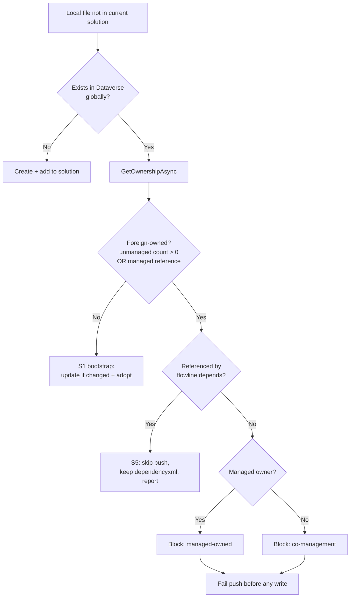

# fix: Guard the web resource adopt path against cross-solution ownership

## Summary

`flowline push` silently overwrites and adopts web resources owned by other solutions. When a local
file's CRM name matches a record that exists in Dataverse but is not in the current solution,
`WebResourcePlanner` updates that record's content and adds it to the current solution — without ever
asking who owns it.

This plan blocks that. Co-management of a web resource across solutions becomes unsupported, and
`// flowline:depends` becomes the supported way to reference a resource another solution owns.

---

## Problem Frame

`WebResourcePlanner.Plan` handles a local file whose name is absent from the current solution by
consulting `snapshot.GlobalOrphans`. On a hit it plans an `Update` (when content differs) followed by
an unconditional `AddToSolution`:

```csharp
if (snapshot.GlobalOrphans.TryGetValue(name, out var existing))
{
    if (TryBuildUpdate(local, existing, ...))
        plan.Updates.Add(...);        // overwrites content
    plan.AddsToSolution.Add(...);     // adopts into this solution
}
```

The ownership data needed to make this safe is never fetched.
`WebResourceReader.GetGlobalWebResourcesByNameAsync` selects only
`name, content, displayname, webresourcetype, dependencyxml` — no `ismanaged`, no `solutionid` — and
then hardcodes `new WebResourceOwnership(0, false)` for every result.

The asymmetry is the tell: the *delete* path (`WebResourcePlanner.cs`, the
`dataverseNames.Except(localNames)` loop) discriminates three ownership cases before touching
anything. The *adopt* path discriminates none.

### Why this is easy to hit

Verbatim mode (`2026-06-13-001-feat-webserource-verbatim-mode-plan.md`, R3/R4) resolves a file whose
top-level folder carries any publisher prefix to that path as its CRM name, dropping the solution
segment. A folder named `dh_/` is an explicitly supported "shared namespace" layout. So a local file
at `WebResources/dist/dh_/lib/validation.js` resolves to the CRM name `dh_/lib/validation.js` — which
is very likely the name another solution already uses. The feature that enables cross-publisher
co-location is exactly what makes the collision likely.

### Concrete failure

Org has `ContosoCore` and `ContosoSales`, both unmanaged, both publisher prefix `dh`. `ContosoCore`
owns `dh_/lib/validation.js`. A developer on `ContosoSales` copies it to
`WebResources/dist/dh_/lib/validation.js` and runs `flowline push`.

1. Verbatim naming resolves the CRM name to `dh_/lib/validation.js`.
2. Not present in `ContosoSales` → treated as a global orphan → found, owned by `ContosoCore`,
   ownership hardcoded empty.
3. Content differs → `Update` planned. `AddToSolution` planned.
4. Executor issues `UpdateRequest`, then `AddSolutionComponent`, then `PublishXml`.

`ContosoCore`'s shared library now serves `ContosoSales`' copy, live immediately. `ContosoCore`'s repo
still holds the original, so its next push reverts it — an indefinite ping-pong in which each team's
CI silently overwrites the other's, and both runs report success.

It also propagates: `ContosoSales` now carries the component, so `flowline deploy uat` ships its copy.
An unmanaged import overwrites the target's web resource whenever that resource is a component of the
solution being imported.

### Scenarios

| # | Situation | Distinguishable in code? | Disposition |
|---|---|---|---|
| S1 | **Bootstrap** — record exists in Dataverse (Default only), not yet in the solution row | Yes — no non-default owner | Allowed, unchanged |
| S2 | **Deliberate co-management** — same file managed from two solutions, last push wins | No — identical to S3 | **Blocked** (KTD1) |
| S3 | **Accidental collision** — the name was already taken and the user didn't know | No — identical to S2 | **Blocked** |
| S4 | **Managed-owned** — an ISV or first-party solution owns it | Yes — `ismanaged` | **Blocked** (KTD2) |
| S5 | **Depend-only** — reference the resource without owning it | Yes — `// flowline:depends` | Skip + declare (KTD4) |
| S6 | **Identical content, foreign-owned** | Yes — content equality | **Blocked** — adoption alone still creates co-management |

S2 and S3 are byte-identical to Flowline: same local file, same name match, same content difference,
same foreign owner. Only intent differs. No amount of detection separates them, which is why the
resolution is a policy decision rather than a heuristic.

---

## Requirements

- **R1.** The adopt path resolves real ownership for a global orphan instead of assuming none.
- **R2.** A local file whose CRM name is owned by any non-default solution other than the current one
  fails the push. Neither the content update nor the solution adoption is performed.
- **R3.** A managed owner fails the push. Flowline never creates an unmanaged layer over a
  managed-owned web resource.
- **R4.** A global orphan with no non-default owner is adopted and updated exactly as today (S1).
- **R5.** The failure occurs during planning, before any Dataverse write for the whole push.
- **R6.** The failure message names the local file path, the CRM name, and the owning solution(s), and
  offers `// flowline:depends` as the alternative when the user only needs a reference.
- **R7.** A global orphan that is foreign-owned **and** referenced by a `// flowline:depends`
  annotation is skipped rather than failing the push: no create, no update, no adoption. The
  dependency is still written to `dependencyxml`.
- **R8.** A skipped-as-referenced resource emits a **warning**, not a neutral report line. The warning
  names the resource and its owning solution, states that the file was not pushed, and advises
  removing it from the web resource folder (`dist/`, or the folder given by `--webresources`) because
  it is not needed there. The push still succeeds.

---

## Key Technical Decisions

**KTD1 — Cross-solution co-management is unsupported.**
*(session-settled: user-directed — chosen over a `--force` gate: co-management creates ownership
problems that surface later at deploy time and in component ordering, so the cheaper fix is to
prevent the topology from forming at all.)*
Governs R2, R6.

A `--force` escape hatch was explicitly rejected. A flag authorizes the hazard invisibly at invocation
time and reintroduces the silent-overwrite path this change exists to remove. Ownership transfer
between solutions remains possible — it is done by removing the component from the other solution
first, outside `push`.

**KTD2 — Managed-owned resources are blocked, not layered.**
*(session-settled: user-directed — updating a customizable managed web resource is legal and would
create an unmanaged layer, but that layer is unwanted.)*
Governs R3.

This is a policy choice, not a platform constraint. Unlike the delete path — where Dataverse rejects
the operation outright — an update here would succeed. Flowline declines it anyway.

**KTD3 — Fail the whole push at plan time.**
*(session-settled: user-directed.)*
Governs R5.

Mirrors verbatim mode's collision check (`2026-06-13-001`, R5), which raises "before any Dataverse
calls, naming both source paths". A push that half-succeeds while reporting an ownership violation
leaves the org in a state nobody chose. One offending file blocks the push; that is the intended
trade.

**KTD4 — `// flowline:depends` is the supported way to reference a foreign-owned resource.**
*(session-settled: user-directed — chosen over requiring the file be removed from `dist/`.)*
Governs R7, R8.

This is not an escape hatch in the sense KTD1 rejects. A `--force` flag authorizes a hazard per-run
and invisibly; the annotation is a declaration in committed source — reviewable, diffable, and
travelling with the repo. It also matches the annotation's existing meaning: it already exempts its
target from orphan deletion and writes `dependencyxml`. "I reference this, I do not own it" is the
same idea rather than a new one.

The skip is conditional on foreign ownership, not on the annotation alone, because depending on a
resource the current solution *does* own is the common case and must still push:

| Referenced by `depends`? | Owner | Action |
|---|---|---|
| No | Another solution | Block (R2) |
| Yes | Another solution | Skip push, write `dependencyxml` only (R7) |
| Yes | Nobody / current solution | Push normally — `depends` is load-order |

**KTD5 — Ownership is resolved with the existing `GetOwnershipAsync`.**
Governs R1.

`WebResourceReader.GetOwnershipAsync` already issues exactly the required `solutioncomponent` query
(componenttype 61, excluding the Default solution, returning `uniquename` + `ismanaged`) and already
runs for every in-solution resource. The adopt path reuses it rather than adding a second ownership
mechanism. Global orphans are only ever local files absent from the current solution, so the added
query cost is zero on a warm push.

Reuse is not quite free, though: the query returns owning-solution names but `WebResourceOwnership`
discards them, keeping only counts and booleans. R6 needs the names, so U1 extends the record before
U2 can compose its message. The *query* is reused as-is; the ownership model is not.

---

## High-Level Technical Design



---

## Implementation Units

### U1. Fetch real ownership for global orphans

**Goal:** Replace the hardcoded `WebResourceOwnership(0, false)` with resolved ownership.

**Requirements:** R1

**Dependencies:** none

**Files:**
- `src/Flowline.Core/WebResources/WebResourceReader.cs`
- `src/Flowline.Core/Models/WebResourceModels.cs`
- `tests/Flowline.Core.Tests/WebResourceReaderTests.cs`

**Approach:**
1. **Extend `WebResourceOwnership` to carry the owning solution names.** It is currently
   `(int NonDefaultUnmanagedSolutionCount, bool IsInCurrentUnmanagedSolution, bool HasManagedSolutionReference)`
   — counts and booleans only. R6 requires the block message to *name* the owner, and
   `GetOwnershipAsync` already builds a per-row list carrying `Name` and `IsManaged` before discarding
   the names. Add a names field and populate it from that existing list. Without this, U2 cannot
   satisfy R6.
2. In `GetGlobalWebResourcesByNameAsync`, stop passing a hardcoded ownership record.
3. Resolve ownership per returned record via `GetOwnershipAsync`, mirroring how `LoadSnapshotAsync`
   already does it for in-solution resources. `GetGlobalWebResourcesByNameAsync` is currently `static`
   with no `solutionName` parameter — it needs one threaded through from `LoadSnapshotAsync`.
4. Keep the call lazy in the sense that already applies — the method is only invoked when
   `orphanNames.Count > 0`.

**Patterns to follow:** `LoadSnapshotAsync`'s `ownershipTasks` projection, which awaits
`GetOwnershipAsync` per entity and feeds `ToDataverseWebResource`.

**Test scenarios:**
- A global orphan owned by one non-default unmanaged solution reports
  `NonDefaultUnmanagedSolutionCount = 1`, `IsInCurrentUnmanagedSolution = false`, and carries that
  solution's name.
- A global orphan owned by a managed solution reports `HasManagedSolutionReference = true` and carries
  the managed solution's name.
- A global orphan owned by two unmanaged solutions carries both names.
- A global orphan with no `solutioncomponent` rows reports an empty ownership record with no names —
  preserving S1.
- No global orphans → `GetOwnershipAsync` is never called.

**Verification:** `WebResourceReaderTests` assert the ownership fields on `GlobalOrphans` entries;
existing reader tests still pass.

---

### U2. Block foreign-owned adopts during planning

**Goal:** Turn a foreign-owned collision into a push-stopping error before any Dataverse write.

**Requirements:** R2, R3, R5, R6

**Dependencies:** U1

**Files:**
- `src/Flowline.Core/WebResources/WebResourcePlanner.cs`
- `tests/Flowline.Core.Tests/WebResourceServiceTests.cs`

**Approach:**
1. In the global-orphan branch, inspect the now-populated ownership before planning any action. The
   violation predicate is explicitly:

   ```
   foreignOwned = ownership.NonDefaultUnmanagedSolutionCount > 0
               || ownership.HasManagedSolutionReference
   ```

   Both disjuncts are load-bearing. `NonDefaultUnmanagedSolutionCount` counts *unmanaged* owners only,
   so a resource owned solely by a managed solution — the common ISV case — is
   `(0, false, true)`. A predicate reading only the count would route it to the S1 bootstrap branch and
   silently adopt and overwrite it, which is exactly what R3 forbids.

   Note that `IsInCurrentUnmanagedSolution` is structurally always `false` here: `orphanNames` is by
   construction the set of local names *absent* from the current solution, so a record found under one
   of those names cannot also be a current-solution component. Do not gate on it.
2. Collect violations rather than throwing on the first, so one push reports every offending file.
3. After the local-only loop completes, if any violations were collected, throw a `FlowlineException`
   with `ExitCode.ValidationFailed` naming each file path, its CRM name, and the owning solution(s).
4. Distinguish the two messages: managed-owned states that Flowline will not create an unmanaged
   layer; unmanaged-owned states that co-management is unsupported. Both name `// flowline:depends`
   as the alternative when only a reference is needed (R6).
5. Leave the no-owner path untouched so S1 behaves exactly as before.

**Execution note:** Add the failing planner test first — the block is the whole behavior change, and
its absence is what the current suite fails to catch.

**Patterns to follow:** `ValidateWebResourceFiles` in the same class already validates and throws
before any Dataverse interaction. The multi-violation collect-then-throw shape mirrors
`WebResourceExecutor`'s failure aggregation.

**Test scenarios:**
- Local file matching a record owned by one other unmanaged solution → throws; message contains the
  file path, the CRM name, and the owning solution name.
- Owned **solely** by a managed solution — fixture pinned at `WebResourceOwnership(0, false, true)`,
  zero unmanaged owners — → throws; message names the managed owner and does not mention
  co-management. Pinning the fixture matters: a mixed-ownership fixture would pass even against a
  predicate that only checks the unmanaged count, hiding the R3 bypass.
- Two offending files → single throw naming both.
- Content identical but foreign-owned (S6) → still throws; adoption alone is co-management.
- Global orphan with no non-default owner (S1) → no throw; `Update` + `AddToSolution` planned as today.
- Throwing path issues no `UpdateAsync`, no `AddSolutionComponent`, and no `PublishXml`.

**Verification:** `Assert.ThrowsAsync<FlowlineException>` with `ExitCode.ValidationFailed`; mock
verifies zero write calls. The two existing `ExistsInOtherSolution…` tests continue to pass unchanged
— they mock no ownership rows, so they exercise S1.

---

### U3. Honor `// flowline:depends` as a reference-only declaration

**Goal:** Let an annotated, foreign-owned resource be skipped instead of failing the push.

**Requirements:** R7, R8

**Dependencies:** U2

**Files:**
- `src/Flowline.Core/WebResources/WebResourcePlanner.cs`
- `src/Flowline.Core/Models/WebResourceModels.cs`
- `tests/Flowline.Core.Tests/WebResourceServiceTests.cs`

**Approach:**
1. Before recording a violation in U2, check whether the offending name is referenced by any local
   resource's `DependsOn` set. The planner already has the full local set in
   `snapshot.LocalResources`; build the referenced-name set once per plan rather than per file.
2. Compare using the same qualification rule dependencies already use, so a bare filename in an
   annotation matches a folder-qualified CRM name — reuse `ResolveQualifiedName` rather than matching
   raw strings. This works without widening the method: `ResolveQualifiedName` suffix-matches against
   `LocalResources.Keys`, and every global-orphan key is by construction a local-resource key
   (`orphanNames` is derived from `LocalResources.Keys`), so a foreign-owned resource is already in the
   candidate pool. `SyncSolutionAsync_BareSiblingNameAnnotation_QualifiesLibraryName` covers the
   mechanism today.
3. **Handle the ambiguous branch.** When a bare name suffix-matches two or more candidates,
   `ResolveQualifiedName` warns and returns the *unqualified* `rawName`. That value will never equal
   the offending CRM name, so the referenced-set check silently misses and the file falls through to
   the R2 block — failing the push despite a correct annotation, the opposite of R7. This is most
   likely in exactly the shared-namespace (`dh_/`) layout this plan names as the primary collision
   trigger. Treat an ambiguous resolution as *unresolved* for the skip check and surface it as its own
   error telling the user to fully qualify the annotation, rather than letting it degrade into the
   co-management block whose message would misdescribe the problem.
3. On a match, add a `Skip` action with a distinct reason (referenced, not owned) instead of a
   violation. Do not plan `Create`, `Update`, or `AddToSolution` for it. Carry the owning solution
   name on the action so U4 can name it in the warning without re-querying.
4. Leave `dependencyxml` generation alone — the referencing file's own update already carries it.

**Test scenarios:**
- Foreign-owned file referenced by a `depends` annotation in another local file → no throw, no write
  for that file, `Skip` recorded with the referenced reason.
- Same, but annotation uses a bare filename while the CRM name is folder-qualified → still matches.
- Bare annotation name that suffix-matches two or more candidates → does **not** silently fall through
  to the R2 co-management block; fails with a message telling the user to fully qualify the annotation.
- Foreign-owned file *not* referenced anywhere → still throws (U2 behavior preserved).
- Referenced file owned by nobody → pushed normally; `depends` is load-order only.
- Referenced file already in the current solution → normal update path, unaffected.
- The referencing file's `dependencyxml` still contains the skipped resource's name.

**Verification:** Planner tests assert the `Skips` collection and the absence of any write action;
existing dependency-registration tests still pass.

---

### U4. Warn on reference-only skips, and land the block message

**Goal:** Make both outcomes visible, and make the skip self-correcting rather than a silent state the
user keeps re-creating on every push.

**Requirements:** R6, R8

**Dependencies:** U2, U3

**Files:**
- `src/Flowline.Core/WebResources/WebResourceExecutor.cs`
- `tests/Flowline.Core.Tests/WebResourceServiceTests.cs`

**Approach:**
1. Emit a reference-only skip as a **warning**, not a neutral skip line. The push still succeeds — the
   warning says the file was deliberately not pushed and tells the user what to do about it.
2. The warning names the resource, the owning solution, and advises removing the file from the web
   resource folder because it is not needed there. The folder is `dist/` by default but
   `--webresources <PATH>` overrides it, so name the resolved folder rather than hardcoding `dist/`.
3. The block message from U2 lands here too — both messages follow `docs/tone-of-voice.md`.

Shape (wording to be settled against the tone guide, not copied verbatim from here):

```
! 'dh_/lib/validation.js' is owned by 'ContosoCore' — not pushed.
  The dependency is declared, so the file isn't needed in WebResources/dist/. Remove it.
```

**Test scenarios:**
- A reference-only skip emits a warning naming the resource and its owning solution.
- The warning advises removing the file and names the resolved web resource folder.
- The warning names a custom folder when `--webresources <PATH>` was used, not `dist/`.
- A reference-only skip does **not** fail the push — the exit code stays success.
- The block message from both the managed-owned and unmanaged-owned cases follows
  `docs/tone-of-voice.md`.
- A push with no global orphans prints nothing new.

**Verification:** Console output assertions in the existing `_console.Output` style. Check user-facing
wording against `docs/tone-of-voice.md`; run the CLI from a Release build when eyeballing the message
(a Debug build propagates the exception instead of rendering it).

---

## Scope Boundaries

### In scope
- The `push` web resource adopt path only.

### Deferred to Follow-Up Work
- **Pre-existing wrongly-adopted components.** This change stops new co-management; it does not undo
  existing cases. A resource already adopted into two solutions stays adopted and keeps being
  overwritten on every unmanaged deploy until removed from one solution. A detection pass — most
  naturally in `flowline drift` — is follow-up work.
- **DTAP ownership divergence.** Under KTD4 the same repo can create the resource in DEV (becoming its
  owner) while skipping it in PROD (where another solution owns it), so ownership topology can differ
  across the chain. Surfacing that is a `drift` concern, not a `push` one.

### Out of scope
- The `deploy` / `pac solution import` path. An unmanaged import overwrites the target's web resource
  whenever that resource is a component of the solution being imported — this is Dataverse import
  semantics, not a Flowline decision, and blocking at push is the leverage point.
- Any file-exclusion mechanism. `dist/` is build output; what lands there is the bundler's decision.

---

## Open Questions

- **A bare `depends` name cannot be qualified when the target is not local.** This is the S5 case KTD4
  actively recommends: the user removes the file from `dist/` and references it by annotation only.
  `ResolveQualifiedName` suffix-matches against `LocalResources.Keys` and `DataverseResources.Keys`; a
  resource that is neither local nor in this solution is in neither pool (and *not* in `GlobalOrphans`
  either, since those keys are drawn from local names), so the name falls through unqualified and is
  written to `dependencyxml` as-is. The Maker Portal stores fully-qualified names in `Library@name`, so
  an unqualified entry is unresolvable in the UI — see
  `docs/solutions/documentation-gaps/webresource-dependencyxml-field-format-2026-06-14.md`. The
  workaround is to always fully qualify annotations pointing at external resources; the fix would need
  a global name lookup that does not exist today. Worth resolving before the wiki tells users KTD4 is
  the supported pattern.
- **Dangling dependencies are silently accepted.** Dataverse validates neither `libraryUniqueId` nor
  the `name` in `dependencyxml` (verified in
  `docs/solutions/documentation-gaps/webresource-dependencyxml-field-format-2026-06-14.md`). A
  reference-only skip against an org where the target does not exist writes a dependency pointing at
  nothing — no error at push or at runtime; the form simply does not load it. Worth a warning when the
  referenced name resolves to no known resource, but that check does not exist today.
- **Non-JS resources.** Annotations are parsed only *from* JS files (`LocalResourceFromFile` gates on
  `type == Js`), though they may *reference* any name. `dependencyxml` models JS libraries via
  `<Library>` elements, so declaring a foreign-owned image or stylesheet this way is semantically off
  even where it works. Binaries may still need removal from `dist/` as the only answer.

---

## Verification Contract

- `dotnet build Flowline.slnx -c Release` clean.
- `dotnet test Flowline.slnx` green, including the two pre-existing `ExistsInOtherSolution…` tests
  unchanged.
- Foreign-owned collision fails the push with `ExitCode.ValidationFailed` and writes nothing.
- Annotated foreign-owned resource is skipped, reported, and still appears in the referencing
  resource's `dependencyxml`.
- S1 bootstrap adopt continues to update and add to solution.

## Definition of Done

- R1–R8 satisfied with the test scenarios above.
- Block and skip messages follow `docs/tone-of-voice.md`, verified from a Release build.
- `Push-WebResources.md` in the wiki documents the ownership rule and the `// flowline:depends`
  reference-only pattern.
- CHANGELOG entry under Unreleased → Fixed.
- Both comparison docs (`docs/others/spkl-comparison.md`, `docs/others/daxif-comparison.md`) have their
  adopt-path gap rows updated to reflect the shipped behavior.

## Sources & Research

- `src/Flowline.Core/WebResources/WebResourcePlanner.cs` — adopt path, delete path ownership rules
- `src/Flowline.Core/WebResources/WebResourceReader.cs` — `GetGlobalWebResourcesByNameAsync`,
  `GetOwnershipAsync`, verbatim naming, annotation parse gating
- `docs/plans/2026-06-13-001-feat-webresource-verbatim-mode-plan.md` — R3/R4 shared-namespace layout;
  R5 fail-before-Dataverse-calls precedent
- `docs/solutions/documentation-gaps/webresource-dependencyxml-field-format-2026-06-14.md` — empirically
  verified: Dataverse accepts fresh GUIDs and does not validate dependency names
- `docs/solutions/design-patterns/webresource-dependency-registration-patterns.md` — annotation
  semantics, orphan-deletion exemption
- `tests/Flowline.Core.Tests/WebResourceServiceTests.cs` — `SetupGlobalOrphans` vs `SetupOwnership`;
  confirms the existing `ExistsInOtherSolution…` tests establish no foreign owner
