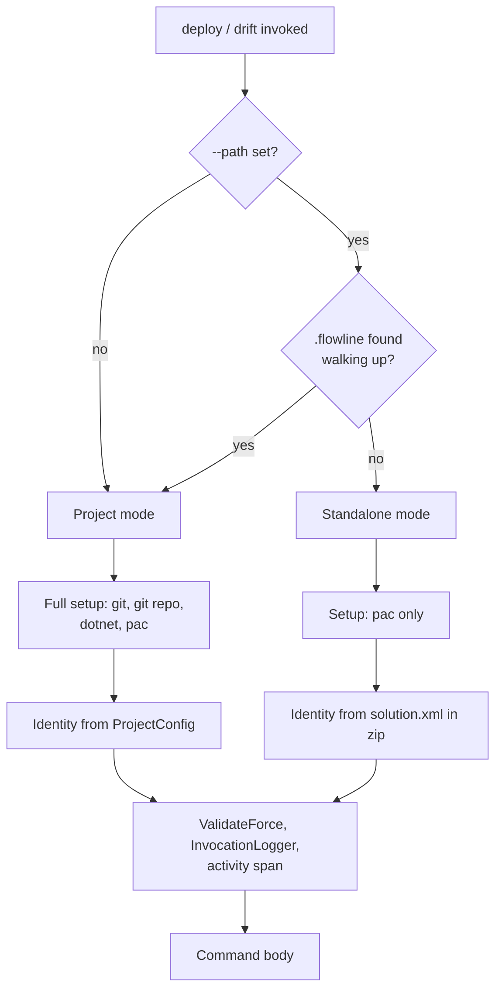

# Deploy and Drift Standalone Mode - Plan

## Goal Capsule

- Objective: let `flowline deploy` and `flowline drift` run against a pre-built solution zip from a folder with no `.flowline` project and no git repository, so a CI job that only downloaded an artifact can deploy or inspect it.
- Product authority: this plan owns standalone behavior for `deploy` and `drift`. It does not change project-mode behavior for either command, does not change `push` or `generate`, and does not change what `--path` does inside a project.
- Stop conditions: stop and ask if implementation shows that a check currently believed project-free actually reads project or git state, or if the base-command branch cannot be added without changing project-mode ordering.
- Open blockers: none.
- Product Contract preservation: changed. R1 replaced (trigger is `--path` plus no project, not a new `--solutionFile` flag), R2 and AE3 deleted (the mutual-exclusion guard contradicts shipped behavior), R9 reframed (managed-ness derives from the artifact; `deploy` has no `--managed` flag). R6 deferred. R3-R5, R7, R8, R10 preserved. Rationale in Superseded Product Decisions below.

---

## Product Contract

### Summary

Give `deploy` and `drift` a standalone mode that activates when `--path <zip>` is set and no `.flowline` is found walking up from the working directory. Solution identity comes from `solution.xml` inside the zip instead of project config. Research showed most of the machinery already works without a project, so the change is concentrated in two base-command gates and one identity source.

### Problem Frame

`deploy --path <zip>` exists and is the documented way to promote one built artifact across DTAP stages, including from a separate CI job. Commit `6a32d25` already removed the solution-file requirement from that route for exactly this reason. But the command still refuses to start without a `.flowline` config (`src/Flowline/Commands/FlowlineCommand.cs:76-79`) and still requires a git repository (`src/Flowline/Commands/FlowlineCommand.cs:114`). A deploy job that downloaded an artifact into a scratch directory has neither. The wiki already publishes a cross-job pattern (`flowline deploy uat --path artifacts/ContosoSales_unmanaged.zip`) that only works if that job also happens to be a full project checkout.

`drift` has the same shape and the same gap: its comparison engine reads an unpacked solution tree, and an unpacked zip is that tree, but the command can only reach it through a project checkout.

### Requirements

**Trigger and detection**

- R1. `deploy <url> --path <zip>` and `drift <url> --path <zip>` activate standalone mode when no `.flowline` is found walking up from the working directory.
- R2. With a `.flowline` present, `--path` behaves exactly as it does today on both commands.
- R3. Standalone mode does not require a git repository, and does not run the git clean-state check.
- R4. The DTAP promotion gate does not run in standalone mode.

**Solution identity**

- R5. In standalone mode the solution unique name and managed flag come from `solution.xml` inside the zip.
- R7. A zip whose manifest has no readable unique name fails with an error naming the file and the missing element.
- R9. Managed and unmanaged artifacts both deploy correctly in standalone; import semantics follow the artifact's own managed flag.

**Behavior preserved from project mode**

- R8. Pre- and post-import orphan cleanup runs in standalone deploy exactly as it does in project mode, including which findings delete and which stay report-only.
- R10. `--no-delete`, `--dry-run`, `--force <specifier>`, and the three skip flags apply in standalone with unchanged meaning.
- R11. `--force` values are validated against the command's own specifier list in standalone, as in project mode.

**Standalone drift**

- R12. `drift <url> --path <zip>` reports what the target holds that the zip does not carry, read-only, without importing.
- R13. Standalone `drift` unpacks the zip to a temporary directory and removes it when the command ends, including on failure.

**Feedback**

- R14. Both commands state which mode they resolved and where solution identity came from.
- R15. A role keyword (`prod`, `uat`, `test`, `dev`) given with no config resolvable fails with a message that fits a folder with no project, rather than pointing at a `.flowline` that does not exist.

### Key Decisions

- Trigger by route plus absence, not by a new flag (session-settled: user-directed — chosen over adding `--solutionFile` with a mutual-exclusion guard: `--path` already does this job, and a second flag for the same input would differ only in where the user is standing). Governs R1, R2.
- Orphan cleanup in standalone is identical to project mode (session-settled: user-directed — chosen over defaulting standalone to report-only: the brainstorm's R8 says identical, and `--no-delete` and `--dry-run` already exist for anyone who wants to hold back). Governs R8.

### Key Flows

- F1. Standalone deploy
  - **Trigger:** `flowline deploy <url> --path <zip>` in a folder with no `.flowline` and no `.git`.
  - **Steps:** resolve standalone mode; check `pac` only; read identity from the zip's manifest; validate the target and the existing solution there; skip DTAP; import; run pre- and post-import services against the unpacked zip.
  - **Skipped:** project discovery, git repo check, git clean-state check, drift check, packing, artifact cache.
  - **Covers:** R1, R3, R4, R5, R8, R9, R10.

- F2. Standalone drift
  - **Trigger:** `flowline drift <url> --path <zip>` in a folder with no `.flowline`.
  - **Steps:** resolve standalone mode; read the solution name from the manifest; unpack the zip to a temp directory; compare against the target read-only; print the report; remove the temp directory.
  - **Covers:** R1, R3, R5, R12, R13.

- F3. `--path` inside a project
  - **Trigger:** either command run with `--path` from a folder where `.flowline` resolves.
  - **Steps:** project mode, unchanged — full setup checks, config-sourced identity and target resolution.
  - **Covers:** R2.

### Acceptance Examples

- AE1. Standalone deploy happy path
  - **Covers:** R1, R3, R4, R5, R8
  - **Given:** a folder holding only `MySolution_1_0_0_0.zip`, no `.flowline`, no `.git`
  - **When:** `flowline deploy https://contoso.crm4.dynamics.com/ --path ./MySolution_1_0_0_0.zip`
  - **Then:** the solution name comes from the zip; no git or DTAP check runs; the import proceeds; orphan cleanup runs against the unpacked zip

- AE2. `--path` inside a project is untouched
  - **Covers:** R2
  - **Given:** a Flowline project with `.flowline` at the root
  - **When:** `flowline deploy prod --path ./artifacts/MySolution_1_0_0_0.zip`
  - **Then:** project mode runs exactly as before — full setup checks, config-resolved target, config-sourced identity

- AE3. Zip with no readable unique name
  - **Covers:** R7
  - **Given:** no `.flowline`; a zip whose `solution.xml` has no `UniqueName`
  - **When:** `flowline deploy <url> --path ./bad.zip`
  - **Then:** exits with a validation error naming the zip and the missing element, before any Dataverse call

- AE4. Role keyword with no project
  - **Covers:** R15
  - **Given:** no `.flowline`
  - **When:** `flowline deploy prod --path ./MySolution.zip`
  - **Then:** exits with an error saying a full environment URL is required outside a project — not "check your .flowline config"

- AE5. Standalone drift is read-only
  - **Covers:** R12, R13
  - **Given:** no `.flowline`; a zip and a reachable target
  - **When:** `flowline drift <url> --path ./MySolution.zip`
  - **Then:** the report lists what the target holds that the zip lacks; nothing is deleted; the temp unpack directory is gone afterwards

### Superseded Product Decisions

The origin document predates `deploy --path`, so three of its requirements describe a design that now conflicts with shipped behavior.

- Origin R1 named a new `--solutionFile` flag. Replaced: `--path` already imports a pre-built zip, and a second flag for the same input would differ only in where the user may stand.
- Origin R2 and AE3 required an error when the standalone flag is used inside a project. Deleted: commit `6a32d25` deliberately made "a repo with a zip and no solution file" work, and `docs/plans/2026-07-13-003-feat-deploy-ci-artifact-publish-plan.md` treats `--path` inside a project as a first-class route. Enforcing the guard would break both.
- Origin R9 said `--managed` applies in standalone. Reframed as R9 above: `deploy` has no `--managed` flag; managed-ness is a property of the artifact, read from its manifest.

### Scope Boundaries

- `push` and `generate` keep their own standalone implementations. This plan adds a base-command branch and routes only the two new call sites through it.
- CI artifact publishing is unchanged. `PublishArtifactForCi` fires on the `--path` route today by deliberate decision (`docs/plans/2026-07-13-003-feat-deploy-ci-artifact-publish-plan.md`, R5 and KTD2). That behavior is route-scoped, not standalone-scoped — project mode has it identically — so revisiting it is a separate decision, not a side effect of this work.
- The pre-import drift check stays skipped on the `--path` route. It compares local build output against packed source (`src/Flowline/Utils/PluginWebResourceDriftChecker.cs:16-17`); standalone has no local build output that relates to the artifact.
- PAC authentication and profile creation are out of scope. Profile resolution already works from a URL alone.

#### Deferred to Follow-Up Work

- Origin R6's `--solution <name>` override. R7's error already names the problem when a manifest has no unique name, and a zip without one is not a valid packed solution. Add the override if a real artifact producer turns up that omits it.
- Migrating `push` and `generate` onto the base-command standalone branch. Both currently bypass `ValidateForce`, `InvocationLogger.Log`, and the activity span in standalone; the branch this plan adds would restore all three. Held out because the migration is larger than this feature and carries its own regression risk.
- Whether `PublishArtifactForCi` should stay on the `--path` route. Worth revisiting against the Azure DevOps duplicate-artifact case; belongs to the CI artifact plan, not here.

---

## Planning Contract

### Key Technical Decisions

- KTD1. **Branch inside the base pipeline, not around it.** Add `protected virtual bool IsStandalone(TSettings settings) => false;` to `FlowlineCommand` and branch on it at project-root resolution and inside `CheckSetupAsync`. `deploy` and `drift` override the predicate only. This is chosen over copying `PushCommand`'s wholesale `ExecuteAsync` override, which skips `ValidateForce`, `InvocationLogger.Log`, the activity span, and the welcome screen — losses that matter for `deploy`, whose `--force` vocabulary gates real hazards. Satisfies R11. Two call sites in this plan is what justifies the seam; a single one would not have.
- KTD2. **Identity comes from the artifact manifest, and only the artifact manifest.** Widen `ParseSolutionManifest` to return the unique name alongside version and managed flag, then build a `ProjectSolution` from it in standalone. `ProjectSolution` carries four fields and `DeployCommand` reads only `UniqueName` and `IncludeManaged`, so a synthesized instance is complete for every downstream read. Governs R5, R9.
- KTD3. **A missing unique name is fatal, matching the version contract.** `ParseSolutionManifest` already throws `ValidationFailed` when `Version` is absent. Apply the same treatment to `UniqueName` rather than falling back to a filename, which would name Dataverse components after whatever the artifact file happened to be called. Governs R7.
- KTD4. **Standalone drift reuses the primitives `CompareAsync` overload.** `OrphanCleanupService.CompareAsync(dataverseSolutionSrcRoot, ...)` (`src/Flowline.Core/OrphanCleanup/OrphanCleanupService.cs:191`) is the shared engine both existing entry points already delegate to, and `pac solution unpack --folder <dir>` writes the `src`-shaped tree directly into that folder. Standalone drift passes the temp unpack directory where project mode passes `Solution/src`. No new comparison logic. Governs R12.
- KTD5. **Do not touch the packed-route reads.** Every project- or git-dependent read in `DeployCommand` already sits inside the `usingExplicitArtifact` false branch — the artifact cache, `hasTestOrUat`, the commit SHA, packing, `SolutionFileLayout`. The standalone work adds no new guards there. Verified at `src/Flowline/Commands/DeployCommand.cs:108-124, 142-151, 218-247`.

### High-Level Technical Design

Mode selection is one predicate consulted at two points in the base pipeline; everything downstream keys off the identity source it produces.

The identity source is the only thing that differs by the time the command body runs. The gates that would otherwise fail — DTAP, target resolution, orphan cleanup, the missing-component report path — already behave correctly against an empty config or a relative artifact path.

### Research That Shaped This Plan

- `ResolveDtapGate` returns `Skip` when every config URL is empty (`src/Flowline/Commands/DeployCommand.cs:732-747`), so R4 needs no code.
- `ResolveTargetUrl` already falls through to a literal URL and validates its scheme (`src/Flowline/Commands/DeployCommand.cs:323-346`). Only its error wording assumes a project.
- Post-deploy services run against an unpack of the imported zip, never local source (`src/Flowline/Commands/DeployCommand.cs:257-266`), so R8 needs no code.
- `MissingComponentReport.GetReportPath` and `SolutionCheckService` write beside the artifact and already resolve a relative `--path` (`src/Flowline.Core/Deploy/MissingComponentReport.cs:9-16`).
- `InvocationLogger.Log` returns early when tool versions are unset (`src/Flowline/Commands/InvocationLogger.cs:16-17`), so a pac-only setup path does not break it.
- `FindProjectRoot` walks up without bound (`src/Flowline/Commands/FlowlineCommand.cs:59-69`). A `.flowline` in a distant parent silently selects project mode, which is why R14 exists.

---

## Implementation Units

### U1. Carry the solution unique name out of the artifact manifest

**Goal:** make the zip a complete identity source.

**Requirements:** R5, R7 (KTD2, KTD3)

**Dependencies:** none

**Files:**
- `src/Flowline/Commands/DeployCommand.cs`
- `tests/Flowline.Tests/DeployCommandSolutionManifestTests.cs`

**Approach:**
1. Widen `ParseSolutionManifest` to return the unique name with version and managed flag.
2. Throw `ValidationFailed` naming the missing element when the unique name is absent or blank, mirroring the existing version check.
3. Update the one destructuring call site on the `--path` route; `ReadLocalSolutionVersion` reads the tuple by name and needs no change.

**Patterns to follow:** the existing version guard in `ParseSolutionManifest`, and its comment convention explaining why a field throws rather than defaults.

**Test scenarios:**
- A manifest with unique name, version, and managed flag returns all three.
- A manifest with no `UniqueName` element throws `ValidationFailed` naming the element.
- A manifest with an empty `UniqueName` throws the same error, not an empty-string identity.
- A zip built through the existing `TempArtifactZip` helper round-trips the unique name out of `ReadArtifactSolutionManifest`.
- The existing version-missing and managed-flag cases still behave as before.

**Verification:** the manifest test file passes, including its pre-existing cases.

---

### U2. Standalone branch in the base command pipeline

**Goal:** let a command declare itself standalone without losing the rest of the base pipeline.

**Requirements:** R3, R11 (KTD1)

**Dependencies:** none

**Files:**
- `src/Flowline/Commands/FlowlineCommand.cs`
- `tests/Flowline.Tests/FlowlineCommandStandaloneTests.cs` (new)

**Approach:**
1. Add a virtual standalone predicate defaulting to false.
2. When it returns true, resolve the root to the working directory instead of throwing on a missing project, and run a `pac`-only setup instead of the git, git-repo, dotnet, and pac sequence.
3. Leave `ValidateForce`, `InvocationLogger.Log`, the activity span, and the welcome-screen decision on the shared path so both modes get them.

**Execution note:** the risk here is reordering project mode by accident. Prove project-mode ordering is unchanged before adding either override in U3 or U4.

**Test scenarios:**
- A command whose predicate is false and has no project still throws `ConfigInvalid` with the existing message.
- A command whose predicate is true and has no project resolves the root to the working directory and does not throw.
- A standalone run still rejects an invalid `--force` value with the command's own specifier list.
- A standalone run's setup does not require a git repository.
- Project mode's setup still checks git, git repo, dotnet, and pac, in that order.

**Verification:** the new test file passes and no existing command test changes behavior.

---

### U3. Deploy standalone

**Goal:** `deploy <url> --path <zip>` runs from a bare folder.

**Requirements:** R1, R2, R4, R8, R9, R10, R14, R15 (KTD2, KTD5)

**Dependencies:** U1, U2

**Files:**
- `src/Flowline/Commands/DeployCommand.cs`
- `tests/Flowline.Tests/DeployCommandTargetResolutionTests.cs`
- `tests/Flowline.Tests/DeployCommandStandaloneTests.cs` (new)

**Approach:**
1. Override the standalone predicate: `--path` set and no project root found.
2. In standalone, build the solution identity from the artifact manifest instead of reading it from config.
3. Print one line naming the resolved mode and the identity source.
4. Reword the target-resolution failure so a role keyword with no resolvable config points at the missing URL, not at a `.flowline` that does not exist.
5. Leave every packed-route read where it is; add no new guards there.

**Patterns to follow:** the existing standalone predicates in `PushCommand` and `GenerateCommand` for naming and placement, and this file's convention of extracting pure decision helpers so they unit-test without a live connection.

**Test scenarios:**
- `--path` set with no project resolves standalone; `--path` set with a project resolves project mode; no `--path` resolves project mode regardless.
- Standalone identity carries the zip's unique name and managed flag into the deploy solution info.
- A role keyword in standalone produces the reworded error and exit code, not the `.flowline` phrasing.
- A full URL target in standalone resolves without touching config.
- DTAP resolves to a skip in standalone, and the deploy proceeds.
- An unmanaged standalone deploy resolves the same run mode as the equivalent project-mode deploy, so orphan handling is unchanged.
- `--no-delete` and `--dry-run` in standalone resolve the same run modes they do in project mode.
- An invalid `--force` value in standalone is rejected with deploy's specifier list.

**Verification:** deploy's test files pass; a Release build run from a temp folder containing only a zip reaches the target-validation step instead of failing on a missing project or git repo.

---

### U4. Drift standalone

**Goal:** `drift <url> --path <zip>` reports zip-versus-target read-only, with no project.

**Requirements:** R1, R2, R3, R12, R13, R14, R15 (KTD4)

**Dependencies:** U1, U2

**Files:**
- `src/Flowline/Commands/DriftCommand.cs`
- `tests/Flowline.Tests/DriftCommandTests.cs`

**Approach:**
1. Add a `--path <zip>` option and the same standalone predicate as deploy.
2. In standalone, take the solution name from the artifact manifest and skip solution-file layout resolution entirely.
3. Unpack the zip into a temp directory, pass that directory to the primitives comparison overload with the read-only run mode, and delete the directory in a `finally` so a failure still cleans up.
4. Keep the existing exit-code mapping — no drift, drift found, and inconclusive keep their current meanings.

**Patterns to follow:** deploy's temp-unpack block, including its swallow-on-cleanup-failure comment, and drift's existing suppression of the deploy-specific `--no-delete` hint.

**Test scenarios:**
- `--path` with no project resolves standalone; `--path` inside a project keeps today's behavior; no `--path` is unchanged.
- Standalone drift takes the solution name from the manifest, not from any folder name.
- The comparison runs in read-only mode: nothing is deleted even when findings are actionable.
- Exit codes still distinguish no drift, drift found, and inconclusive.
- The temp directory is removed after a successful run and after a failing one.
- A role keyword in standalone produces the reworded error.

**Verification:** `DriftCommandTests` passes, including its existing role-resolution and exit-code cases.

---

### U5. Documentation

**Goal:** the standalone route is discoverable where users already look for `--path`.

**Requirements:** R1, R12, R14

**Dependencies:** U3, U4

**Files:**
- `CHANGELOG.md`
- `../Flowline.wiki/07-Deploy.md`
- `../Flowline.wiki/03-Command-Reference.md`

**Approach:**
1. Add a changelog entry naming the new capability and what standalone skips.
2. Extend the deploy page's CI section — it already shows a cross-job `--path` example that assumed a full checkout — and its options table.
3. Add `--path` to the drift entry in the command reference, and note the standalone trigger rule for both commands.

**Test expectation:** none — documentation only.

**Verification:** the wiki checkout at the sibling path is updated; every documented flag matches the shipped option names.

---

## Verification Contract

| Gate | Command | Applies to |
|---|---|---|
| Build | `dotnet build Flowline.slnx` | all units |
| Targeted tests | `dotnet test tests/Flowline.Tests/Flowline.Tests.csproj --filter DeployCommand` | U1, U3 |
| Targeted tests | `dotnet test tests/Flowline.Tests/Flowline.Tests.csproj --filter DriftCommand` | U4 |
| Full suite | `dotnet test Flowline.slnx` | U2 and before finishing |
| Manual, Release only | `dotnet build -c Release`, then run `deploy` and `drift` with `--path` from a temp folder holding only a zip | U3, U4 |

The manual check must run against a Release build. A Debug build propagates exceptions instead of rendering the handled error, so error wording and exit codes cannot be verified there.

---

## Definition of Done

- Standalone `deploy` and `drift` run from a folder with no `.flowline` and no git repository.
- `--path` inside a project behaves exactly as it did before, on both commands.
- Solution identity in standalone comes from the artifact manifest; a manifest with no unique name fails before any Dataverse call.
- `--force` validation, invocation logging, and the activity span are present in standalone.
- Orphan cleanup behavior in standalone deploy matches project mode.
- Standalone drift leaves no temp directory behind, on success or failure.
- Changed behavior has focused test coverage; the full suite passes.
- CHANGELOG and the two wiki pages are updated.
- User-facing messages follow `docs/tone-of-voice.md`.
- No exploratory or dead-end code from abandoned approaches remains in the diff.

---

## Risks

- **Standalone deletes orphans with nothing upstream vouching for the artifact.** The `--path` route already skips git clean-state and the local drift check, and standalone additionally has no DTAP predecessor check. The first-import confirmation only fires when the solution is absent from the target, so a repeat standalone deploy — the main use case — passes through with no gate. A stale or wrong zip can therefore delete live components on an unmanaged target. Accepted deliberately: this matches the origin document's R8 and project-mode behavior, and `--no-delete` and `--dry-run` remain available. Revisit if a real incident shows the CI path needs its own brake.
- **An ancestor `.flowline` silently selects project mode.** `FindProjectRoot` walks up without bound, so a monorepo checkout or a stray parent config routes a standalone-looking invocation into project mode with a different identity source. R14's mode line is the mitigation; there is no error, by design, because project mode is a legitimate outcome.
- **Report and check output is written beside the artifact.** The solution checker and the missing-component report both write next to the zip. A CI job whose artifact directory is read-only would fail those writes. Pre-existing on the `--path` route; standalone makes it the common case rather than an edge case.

---

## Sources

- Origin requirements: `docs/brainstorms/2026-06-27-deploy-standalone-requirements.md`
- `--path` route and its deliberate skips: `src/Flowline/Commands/DeployCommand.cs:103-124`, commit `6a32d25`
- Base pipeline gates: `src/Flowline/Commands/FlowlineCommand.cs:71-131`
- Existing standalone precedents and what they skip: `src/Flowline/Commands/PushCommand.cs:76-100`, `src/Flowline/Commands/GenerateCommand.cs:63-93`
- Shared comparison engine and its two entry points: `src/Flowline.Core/OrphanCleanup/OrphanCleanupService.cs:165-191`
- What the pre-import drift check actually compares: `src/Flowline/Utils/PluginWebResourceDriftChecker.cs:16-48`
- CI artifact publishing decision this plan leaves alone: `docs/plans/2026-07-13-003-feat-deploy-ci-artifact-publish-plan.md`
- Zip fixture helper for tests: `tests/Flowline.Tests/DeployCommandSolutionManifestTests.cs`
