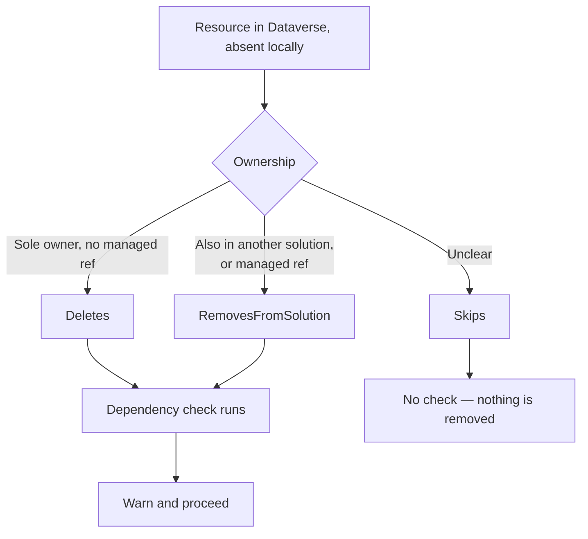
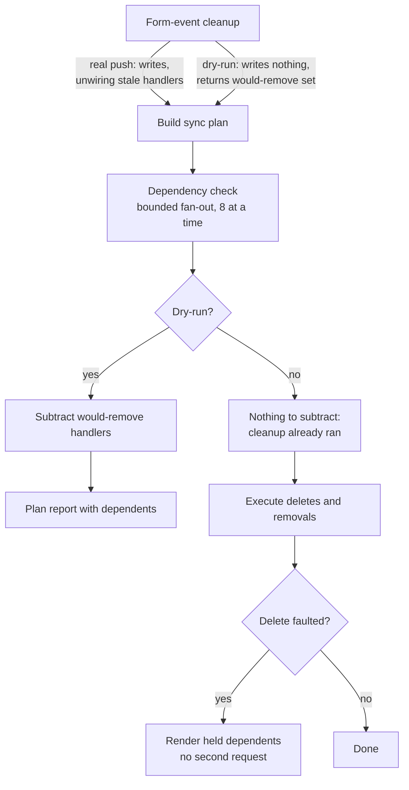

# Web Resource Delete Dependency Check - Plan

## Goal Capsule

- **Objective:** Tell the operator what still depends on a web resource before `push` deletes it or removes it from the solution, so a removal that looks clean in DEV does not surface as a broken form in the next environment.
- **Product authority:** This plan owns the dependency warning for the web resource delete and remove-from-solution paths in `push`, and for the web resource entries in orphan cleanup. `deploy`'s web resource sync phase and plugin-component deletes are not active scope.
- **Authority order:** A requirement wins on product behavior. A Key Technical Decision wins on mechanism within its cited requirements. A unit overrides neither.
- **Execution profile:** One extraction unit that must preserve existing orphan-cleanup output, then additive work. U1 is the only unit that rewrites logic already in production use; U6 widens a signature two commands call without changing what that call does. Every other unit is additive.
- **Stop conditions:** Stop and ask if the extraction in U1 cannot preserve orphan-cleanup output exactly, or if surfacing the form-event removal set (U6) requires changing which handlers cleanup actually removes.
- **Open blockers:** None.

---

## Product Contract

### Summary

Before `push` deletes a web resource or drops it from the solution, Flowline asks Dataverse which components still depend on it and names them in the output. The warning is informational — it never blocks the operation, because whether a dependency is stale or expected is context the operator holds and Flowline does not.

### Problem Frame

A web resource was removed from a solution during a normal `push`. Because the resource also lived in another unmanaged solution, Dataverse did not delete the record and did not raise a fault — the removal succeeded silently. The current environment kept working, since the resource was still there.

The failure surfaced one environment later. The target environment did not carry the other owning solution, so the resource was absent there while a form still referenced it. Nothing in the push output had suggested anything was at risk.

The two removal shapes fail differently and neither is currently covered:

- A true delete, where this solution is the sole owner, does fault in Dataverse. The fault text asks the caller to run `RetrieveDependenciesForDelete` — but Flowline surfaces the raw fault rather than the answer.
- A remove-from-solution, where another solution also owns the record, raises nothing at all. There is no error to hang a message on, which is why this case reached the next environment unnoticed.

Flowline already knows about the form event handlers it wires itself. It knows nothing about ribbons, sitemap entries, cross-resource `depends` links, or anything an author wired by hand in the Maker Portal — and that last category is what caused this.

### Key Decisions

- KD1. **Check every delete-list entry up front, not only when Dataverse complains.** (session-settled: user-directed — chosen over checking lazily on the delete fault: deletions and removals are rare, so paying one request per entry is acceptable, and remove-from-solution never faults, so a lazy check would miss the case that actually broke.) Governs R1, R2, R8.
- KD2. **Ask Dataverse via `RetrieveDependenciesForDelete` rather than inspecting form definitions.** (session-settled: user-directed — chosen over scanning form XML plus Flowline's own handler registry: the SDK request also covers ribbons, sitemap, and cross-resource `depends`, including wiring done outside Flowline.) Governs R1.
- KD3. **Report, never block.** (session-settled: user-directed — chosen over failing the push or gating it behind `--force`: the operator decides whether to clean up the dependency or accept it because the owning solution ships downstream too.) Governs R7, R11.
- KD4. **Resolve names for the component types that actually appear on a web resource; fall back for the rest.** (session-settled: user-directed — chosen over a full component-type map or raw identifiers: the fallback keeps an unrecognized type actionable enough to look up without a map to maintain.) Governs R4.
- KD5. **Hang the resolved dependents off the record each path already carries — the sync plan for `push`, the orphan entry for cleanup — rather than a side-channel map.** (session-settled: user-approved — chosen over returning a separate name-to-dependents map: one source of truth means the preview and the executed run cannot disagree, and the failure path reuses what the record already holds.) Governs R3, R5, R8, R10.
- KD6. **In orphan cleanup, the check hooks the orchestrator, not the web resource handler.** A handler only ever proposes a delete; the cross-solution decision that turns it into a removal is made afterwards. Checking at the handler would ask about an action that may not be the one taken. Governs R10.

### Requirements

**Detection**

- R1. Before a web resource delete or remove-from-solution executes, `push` asks Dataverse which components still depend on that resource, using `RetrieveDependenciesForDelete` against component type 61.
- R2. The check runs once per entry in the plan's `Deletes` bucket and once per entry in its `RemovesFromSolution` bucket. Entries in `Skips` are not checked, because nothing is deleted or removed for them.
- R3. The check runs when the sync plan is built, before any delete or removal executes, so the same result serves both the dry-run report and the real push.

**Reporting**

- R4. Each dependent is rendered by its component-type label plus its record name. A type whose records Flowline cannot name renders as the type label and the object id alone.
- R5. A resource with at least one dependent produces a warning naming the resource and every dependent found. The warning distinguishes a resource kept because a managed solution owns it from one kept because another unmanaged solution holds it.
- R6. A resource with no dependents produces no additional output, and the plan report's existing counts are unchanged.
- R7. Finding dependents never blocks the delete or the removal and never changes the exit code.

**Edge behavior**

- R8. When a delete still fails on Dataverse's dependency fault, the failure message renders the dependents already resolved for that resource, and no second dependency request is issued.
- R9. Under `--dry-run`, reported dependents exclude the forms whose reference to the resource the same run's form-event cleanup would have dropped. The cleanup pass surfaces those drops so the check can subtract them; today it reports only whether anything changed.
- R11. When the dependency lookup itself fails for a resource, the output says the check could not run for that resource rather than reporting it as having no dependents, and the run continues.

**Coverage**

- R10. Orphan cleanup runs the same check against each web resource entry, after the orchestrator has resolved whether the entry is a delete or a removal from solution, and reports the dependents alongside that resolved action. This applies equally to entries the run only reports rather than executes.

Which bucket gets checked:

### Key Flows

- F1. Removing a resource another solution also owns
  - **Trigger:** A file is deleted locally; the resource exists in Dataverse and is owned by more than one unmanaged solution.
  - **Steps:** The planner routes it to `RemovesFromSolution`; the check asks Dataverse what depends on it; a form in the current environment still references it; the push removes it from the solution and warns, naming that form.
  - **Outcome:** The operator — or the agent relaying the warning — decides whether to unwire the reference or accept it because the owning solution ships downstream too.
  - **Covers:** R1, R2, R5, R7
- F2. Deleting a resource this solution solely owns
  - **Trigger:** A file is deleted locally; the resource is owned only by the current unmanaged solution.
  - **Steps:** Form-event cleanup unwires Flowline's own stale handlers first; the planner routes the resource to `Deletes`; the check reports whatever still depends on it; the delete proceeds.
  - **Outcome:** Either the delete succeeds, or Dataverse's dependency fault surfaces with the already-resolved names attached.
  - **Covers:** R3, R8
- F3. Previewing before committing
  - **Trigger:** `flowline push --dry-run` with at least one deletion in the plan.
  - **Steps:** The plan is built and the check runs; dependents that form-event cleanup would have removed are subtracted; the plan report renders what remains.
  - **Outcome:** Nothing is written, and the operator sees what would break before running the push for real.
  - **Covers:** R3, R6, R9

### Acceptance Examples

- AE1. **Covers R5, R7.** Given a web resource still referenced by the Account main form, when `push` removes it from the solution, then the output names that form and the command exits 0.
- AE2. **Covers R4.** Given a dependent that is a ribbon component, when the warning renders, then it shows the ribbon type label and the object id, with no record name.
- AE3. **Covers R6.** Given a delete-list entry with no dependents, when the plan report renders, then no dependency line appears for it and the bucket counts are unchanged.
- AE4. **Covers R9.** Given a form whose reference to a delete-list resource this run's form-event cleanup would drop, when `--dry-run` renders, then that form is not listed as a dependent. Given a form that keeps the reference because another handler still uses it, then the form is still listed.
- AE5. **Covers R8.** Given a delete that Dataverse rejects with a dependency fault, when the failure renders, then it lists the dependents already resolved for that resource and issues no further dependency request.
- AE6. **Covers R2.** Given a resource the planner routed to `Skips` for unclear ownership, when the plan is built, then no dependency request is issued for it.
- AE7. **Covers R10.** Given an orphan web resource the handler proposed for deletion, which the orchestrator then converts to a removal because another solution also holds it, when the orphan report renders, then the dependents appear against the removal, not against a delete that never happens.
- AE8. **Covers R11.** Given a dependency request that faults, when the plan report renders, then that resource is reported as unchecked rather than as having no dependents, and the run continues.
- AE9. **Covers R5.** Given two removals in one plan — one kept by a managed owner, one kept by another unmanaged solution — when the warnings render, then the two carry different wording.

### Scope Boundaries

- **The target environment.** The check runs against the environment being pushed to. It cannot tell whether the next environment holds a reference this one lacks — an unmanaged layer on the same form, for example. Answering that needs a connection `push` does not have. This catches the ordinary case and is not a guarantee.
- **`deploy`'s web resource sync phase.** Same problem shape, not covered here. Note this is narrower than "deploy is out of scope": orphan cleanup is registered as a post-deploy service and also runs from `drift`, so R10 does put the check into those runs. The exclusion is the sync phase, not the command.
- **Plugin assemblies, plugin types, and steps.** `docs/solutions/integration-issues/dataverse-orphan-assembly-delete-blocked-by-step-dependencies.md` documents the same failure for component type 91. Deferred.
- **Cleaning up the dependency.** Flowline reports what depends on the resource; it does not unwire the dependent components on the operator's behalf.
- **A strict mode that fails the push when dependents exist.** Not requested. Add only if the informational form proves insufficient in practice.

#### Deferred to Follow-Up Work

- **Unifying the bounded fan-out helpers.** Three separate `SemaphoreSlim`-gated loops now exist at parallelism 8 (`src/Flowline.Core/WebResources/WebResourceReader.cs:345`, `src/Flowline.Core/WebResources/WebResourceExecutor.cs:217`, `src/Flowline.Core/FormEvents/FormEventExecutor.cs:239`), and U2 mirrors the first rather than extracting a shared one. Worth collapsing, but not inside this change.

### Dependencies / Assumptions

- `RetrieveDependenciesForDelete` appears nowhere under `src/` today — this is its first use in the codebase. The typed `RetrieveDependenciesForDeleteRequest` ships in the `Microsoft.PowerPlatform.Dataverse.Client` package already referenced by `src/Flowline.Core/Flowline.Core.csproj`, in the same namespace as `RetrieveMissingComponentsRequest`, which the repo already uses.
- Form-event cleanup runs before web resource sync in `src/Flowline/Commands/PushCommand.cs:219-226`, and its documented purpose is preventing this exact dependency fault. R9 exists only because `--dry-run` writes nothing, so that cleanup has not happened when the plan is built. The requirement depends on that ordering holding.
- The form-event planner never materializes a "what is being removed" set. It computes the surviving library set per form and writes it, which drops the rest implicitly, and the form plan carries only that surviving set. R9 therefore needs the drop computed and surfaced before `CleanupOrphanedAsync` can return it. This is the largest single piece of work in the plan.
- The planner is pure and synchronous today (`src/Flowline.Core/WebResources/WebResourceService.cs:34-35`). R3 places the check after planning rather than inside it, so the planner keeps that property.
- In orphan cleanup, a handler only ever proposes `OrphanAction.Delete`; the orchestrator converts it to `RemoveFromSolution` when another solution also holds the component (`src/Flowline.Core/OrphanCleanup/OrphanCleanupService.cs:373-393`). R10 depends on that ordering.
- Delete lists are assumed to stay short. One request per entry is acceptable because deletions and removals are rare in practice. **This assumption is push-shaped and does not transfer to R10 unexamined** — orphan cleanup scans a whole solution, so a first run against an environment with a backlog of stale web resources is a structurally bulkier case. U7 sizes it before relying on the same bound.
- The `sitemap` entity's name attribute is unconfirmed. U1 adds a `NameResolvableTypes` entry for component type 62; if the attribute does not resolve, sitemap falls back to the label-and-id form, which R4 already permits.
- The type label is expected to arrive on the response as a formatted value, but that is not verified against a live environment. The extracted `ManualTypeLabels` map already covers the relevant types, so the label falls back to it when the formatted value is absent — the same fallback discipline the sitemap assumption above uses.
- `CleanupOrphanedAsync` and `RegisterAsync` share one internal implementation, so U6's widening reaches both passes even though only cleanup's result is consumed.
- U5 renders dependents resolved at plan time. If Dataverse's dependency state changes between the plan-time check and the execute-time fault, those names are a snapshot rather than a re-verified account of what is blocking the delete at that moment. R8 accepts this — re-querying is exactly the second request KD1 was chosen to avoid.

### Sources / Research

- `src/Flowline.Core/WebResources/WebResourcePlanner.cs:89-114` — the delete vs remove-from-solution vs skip decision.
- `src/Flowline.Core/Models/WebResourceModels.cs:113-126` — `WebResourceSyncPlan` buckets. `WebResourcePlanAction` already carries per-action `Reason` and `OwningSolutions` fields, the same shape KD5 extends.
- `src/Flowline.Core/WebResources/WebResourceExecutor.cs:55-67` — the delete and remove-from-solution phases and the existing failure collector R8 renders through. `ExecuteBoundedParallelAsync` at `:217-239` and `MaxParallelism = 8` at `:14`.
- `src/Flowline.Core/WebResources/WebResourceService.cs:34-64` — plan, report, dry-run return, execute. `WritePlanReport` at `:122-151`, `WriteSection` at `:153-160`.
- `src/Flowline.Core/WebResources/WebResourceReader.cs:341-351` — `ResolveOwnershipBoundedAsync` and `MaxOwnershipParallelism = 8`, the plan-time bounded fan-out KTD2 mirrors, with the service-protection rationale in the comment.
- `src/Flowline/Commands/PushCommand.cs:219-233` — form-event cleanup ordered ahead of web resource sync with the dependency fault named as the reason, and registration ordered after.
- `src/Flowline.Core/OrphanCleanup/OrphanCleanupService.cs:570-582` — `NameResolvableTypes`, the component-type → (entity, id attribute, name attribute) map U1 extracts. `ManualTypeLabels` at `:100-118`; `ResolveGroupNamesAsync` at `:694-701` with its empty-map fallback; the cross-solution override at `:373-393`; `ReportOnlyLabel` at `:969-972`.
- `src/Flowline.Core/OrphanCleanup/EntityNameLookup.cs:13-15` — `GetEntityNamesAsync` bulk name lookup. `src/Flowline.Core/OrphanCleanup/DataverseFaultTolerance.cs:13-15` — `TryQueryAsync`, the degrade-on-fault wrapper R11 builds on.
- `src/Flowline.Core/Console/FlowlineConsoleExtensions.cs:27` — `Warning` renders a yellow non-fatal line; user values need `Markup.Escape`.
- `src/Flowline/Program.cs:271-272` and `src/Flowline/Commands/DriftCommand.cs:48` — orphan cleanup is both a post-deploy service and a `drift` entry point, which is why R10 reaches beyond `push`.
- `docs/solutions/logic-errors/push-overwrites-web-resources-owned-by-other-solutions.md` — a prior bug where an ownership guard covered one lifecycle path but not its sibling. The tell was asymmetry inside one class.
- `docs/solutions/architecture-patterns/orphan-cleanup-two-phase-deploy-pipeline.md` — mandates `RetrieveAllAsync` over `RetrieveMultipleAsync`, which truncates silently at 5000.
- [RetrieveDependenciesForDeleteRequest](https://learn.microsoft.com/dotnet/api/microsoft.crm.sdk.messages.retrievedependenciesfordeleterequest) — `ComponentType` (int) and `ObjectId` (Guid); the response exposes `EntityCollection` of `dependency` records.
- [Dependency table reference](https://learn.microsoft.com/power-apps/developer/data-platform/reference/entities/dependency) — `dependentcomponenttype` is a picklist over the `componenttype` global choice, so its formatted value is the human label. Codes: 60 System Form, 26 Saved Query, 61 Web Resource, 62 Site Map, 29 Workflow; ribbons span 48, 49, 50, 52, 53, 55.

---

## Planning Contract

**Product Contract preservation:** changed. R4 now renders the component-type label rather than a numeric code, because the response is expected to carry the label as a formatted value. R5 gained the managed-versus-unmanaged wording distinction. R9 keeps its intent but changed grain — it subtracts forms whose *reference* the cleanup drops, not forms whose *handlers* it removes, because Dataverse ties a form to a resource through the form's library entry and a form can keep that entry while losing a handler. R11 is new: it separates "no dependents" from "could not check", which KD3's never-block posture requires but no requirement stated. AE2 was rewritten to match R4, AE4 to match R9, and AE8 and AE9 are new. No requirement was weakened or dropped.

### Key Technical Decisions

- KTD1. **Use the typed `RetrieveDependenciesForDeleteRequest` rather than an untyped `OrganizationRequest`.** The repo uses both shapes, but typed is the established pattern where the SDK provides a class, and the response's `EntityCollection` property is easier to consume than a string-keyed lookup. Governs R1.
- KTD2. **Bound the dependency fan-out at 8, mirroring the existing plan-time ownership fan-out.** One unbounded request per delete-list entry risks Dataverse per-user service-protection limits, which the ownership resolver already documents. Reuse its shape rather than a new throttle. Governs R1, R2.
- KTD3. **Extract the component-type maps that already exist instead of writing new ones.** `NameResolvableTypes` and `ManualTypeLabels` already cover system form, saved view, web resource, and workflow; they are private to the orphan orchestrator. Promoting them serves both consumers and keeps one map. (session-settled: user-directed — chosen over a full component-type map or raw identifiers: the fallback keeps an unrecognized type actionable enough to look up without a map to maintain.) Governs R4.
- KTD4. **Take the type label from the response's formatted value, falling back to the extracted label map.** `dependentcomponenttype` is a picklist over the `componenttype` global choice, so the label is expected to arrive with the record and the extracted map supplies only the record's own name. The fallback exists because that expectation is unverified against a live environment, and without it every dependent — not just unmapped types — would render as a bare number. Governs R4.
- KTD5. **Word the two removal reasons differently.** A resource kept because a managed solution owns it almost certainly ships to the next environment; one kept because another unmanaged solution holds it is the case that broke the originating deploy. (session-settled: user-approved — chosen over one shared wording: the two carry genuinely different risk and a single message would flatten that.) Governs R5.
- KTD6. **Carry dependents as a field on `WebResourcePlanAction`.** It already holds per-action explanation fields (`Reason`, `OwningSolutions`), so this is the same shape rather than a new carrier. (session-settled: user-approved — chosen over returning a separate name-to-dependents map: one source of truth means the preview and the executed run cannot disagree, and the failure path reuses what the record already holds.) Governs R3, R5, R8.
- KTD7. **Key the dry-run subtraction on the library leaving the form, not the handler leaving the form.** Dataverse ties a form to a web resource through the form's library entry, and the form keeps that entry as long as any remaining handler references it or the library sits outside Flowline's tracked set. The planner already computes the surviving library set per form; the drop set is the form's current libraries minus that. Subtracting at handler granularity would both exclude forms that still hold the library and fail to exclude forms whose library is genuinely going away. Governs R9.
- KTD8. **A failed dependency lookup degrades to "unchecked", never to "no dependents".** `DataverseFaultTolerance.TryQueryAsync` already warns and returns empty on fault, and empty is indistinguishable from a clean result. The checker must track the difference explicitly. Governs R7, R11.

### High-Level Technical Design

Where the check sits in a `push`, and why dry-run diverges:

The divergence at `D` is the whole reason R9 exists. In a real push the subtraction is a no-op because cleanup already wrote; in dry-run nothing was written, so the plan-time view still shows handlers the run would have removed.

### Sequencing

U1 first and alone — it is the only unit that touches code already in production use, and its contract is that orphan-cleanup output does not change. U2 and U3 build the checker and wire it in. U4 and U5 are the two render surfaces. U6 and U7 are independent of each other and can land in either order once U3 is in.

### System-Wide Impact

Three surfaces outside the web resource push path move, and each is a place the change can break something it did not intend to touch.

- **Orphan cleanup shares the extracted maps (U1).** `OrphanCleanupService` reaches those maps from its own name-resolution loops, and orphan cleanup runs from `deploy` as a post-deploy service and from `drift` (`src/Flowline/Program.cs:271-272`, `src/Flowline/Commands/DriftCommand.cs:48`). A regression in U1 therefore surfaces in three commands, not one. This is why U1 lands alone with characterization coverage.
- **The form-event cleanup and registration passes share one implementation (U6).** `CleanupOrphanedAsync` and `RegisterAsync` both delegate to the same internal sync method, and `src/Flowline/Commands/PushCommand.cs` calls cleanup at `:223` and registration at `:233`. Widening the cleanup return therefore reaches registration too, and must change neither what registration writes nor what cleanup writes.
- **`push` gains Dataverse round-trips it did not make before.** One request per delete-list entry, plus grouped name lookups. The bound at 8 keeps this inside service-protection limits, and the skip-when-both-buckets-empty rule in U3 means the common push — which deletes nothing — makes no extra requests at all.

Not affected: the plugin push path, solution packing, and `deploy`'s import phases. No schema, config, or public CLI surface changes; no new flags, and no exit-code changes (R7).

### Risks & Dependencies

- **U1's extraction silently changes orphan-cleanup output.** The maps feed report text that users read. Mitigation: capture current output in a test before moving anything, and treat any diff as a failure rather than an update-the-expectation moment.
- **A partially-applied plan reads worse than no change.** If U3 lands without U4, dependents are collected and never shown — pure cost. Keep U3 and U4 in the same landing, or land U4 first behind the empty-collection case.
- **Empty and unchecked are easy to conflate.** `DataverseFaultTolerance.TryQueryAsync` returns empty on fault, which is exactly the shape of a clean result. KTD8 exists because of this, and AE8 is the test that holds it — a prior learning in `docs/solutions/` records the same trap in ownership resolution.
- **Ribbon and sitemap dependents may dominate the output.** A resource wired into a ribbon can produce several dependency records across the six ribbon component types, each rendering as label-and-id. If real-world output proves noisy, collapsing same-type dependents into one line is the cheapest fix; do not pre-solve it.
- **The `sitemap` name attribute is unverified.** U1 carries the fallback as the answer if it does not resolve.
- **Orphan cleanup's entry count is unsized.** The bound-8 fan-out was chosen against push's delete list. If a real orphan-cleanup or `drift` run turns out to carry many web resource entries, the documented lever is batching the dependency requests through a multi-request envelope rather than raising the concurrency bound — raising the bound is what service-protection limits punish. Do not pre-solve this; size it in U7 first.
- **External dependency:** `RetrieveDependenciesForDeleteRequest` ships in the already-referenced `Microsoft.PowerPlatform.Dataverse.Client` package. No new package reference, no version pin change.

---

## Implementation Units

### U1. Extract the component-type name and label maps

- **Goal:** Make the existing component-type maps usable outside orphan cleanup, without changing orphan-cleanup behavior.
- **Requirements:** R4. Covers KTD3.
- **Dependencies:** none.
- **Files:**
  - `src/Flowline.Core/OrphanCleanup/OrphanCleanupService.cs` (remove the private members)
  - `src/Flowline.Core/OrphanCleanup/ComponentTypeCatalog.cs` (new — holds `NameResolvableTypes`, `ManualTypeLabels`, and the group-name resolution)
  - `tests/Flowline.Core.Tests/OrphanCleanup/ComponentTypeCatalogTests.cs` (new)
  - `tests/Flowline.Core.Tests/OrphanCleanupServiceTests.cs`
- **Approach:**
  1. Move `NameResolvableTypes`, `ManualTypeLabels`, and `ResolveGroupNamesAsync` out of `OrphanCleanupService` into a shared static type. Both consumers live in `Flowline.Core`, so placement is a namespace-tidiness call, not a dependency constraint.
  2. Add a `NameResolvableTypes` entry for component type 62 (site map). If the name attribute does not resolve against a real environment, drop the entry — R4's label-and-id form already covers it.
  3. Leave `ResolveComponentTypeNamesAsync` where it is; it queries `solutioncomponentdefinition` and is a verbose-preview fallback the new consumer does not need.
- **Patterns to follow:** the existing empty-map-on-unknown-type behavior in `ResolveGroupNamesAsync` — an unmapped type resolves to no names rather than a guess.
- **Execution note:** Characterization first. Capture current orphan-cleanup report output in a test before moving anything, so the extraction is provably behavior-preserving.
- **Test scenarios:**
  - A component type present in the map resolves to its record names.
  - A component type absent from the map resolves to an empty map, not an exception.
  - Orphan-cleanup report output for a mixed set of component types is byte-identical before and after the extraction.
- **Verification:** `dotnet test tests/Flowline.Core.Tests/Flowline.Core.Tests.csproj` passes, including the pre-existing orphan-cleanup tests, with no change to their expectations.

### U2. Dependency lookup with bounded fan-out

- **Goal:** Given a set of web resource ids, return the resolved dependents of each, or an explicit "could not check" for that resource.
- **Requirements:** R1, R2, R4, R11. Enforces AE2, AE8. Covers KTD1, KTD2, KTD4, KTD8.
- **Dependencies:** U1.
- **Files:**
  - `src/Flowline.Core/WebResources/WebResourceDependencyChecker.cs` (new)
  - `tests/Flowline.Core.Tests/WebResources/WebResourceDependencyCheckerTests.cs` (new)
- **Approach:**
  1. Issue one `RetrieveDependenciesForDeleteRequest` per id with `ComponentType = 61`, reading dependents off the response's `EntityCollection`.
  2. Gate concurrency with a `SemaphoreSlim` at 8, mirroring the plan-time ownership fan-out rather than the executor's progress-bar variant — this runs during planning, where there is no progress task.
  3. For each dependency record, take the type label from the formatted value of `dependentcomponenttype` and the record name from the extracted map via the bulk name lookup. Group name lookups by component type so one query serves all dependents of that type.
  4. Wrap each resource's lookup so a fault yields an explicit unchecked marker for that resource, distinct from an empty dependent list. Do not let one resource's fault abort the others.
- **Patterns to follow:** `ResolveOwnershipBoundedAsync` for the gate; `DataverseFaultTolerance.TryQueryAsync` for the degrade-on-fault wrapper; `EntityNameLookup.GetEntityNamesAsync` for the bulk name query.
- **Test scenarios:**
  - A resource with one system-form dependent returns that form's type label and name.
  - A resource with a ribbon dependent returns the ribbon type label and the object id, with no name.
  - A resource with no dependents returns an empty dependent list, and the result is distinguishable from unchecked.
  - A faulting request for one resource yields unchecked for that resource while the others still return their dependents.
  - The request carries `ComponentType = 61` and the resource's id.
  - More than 8 resources in one call never exceed 8 in-flight requests.
- **Verification:** the checker's tests pass against a mocked organization service; the in-flight cap is asserted, not assumed.

### U3. Carry dependents on the plan and run the check after planning

- **Goal:** Populate dependents for both delete buckets between plan construction and plan reporting, so dry-run and real push read the same data.
- **Requirements:** R2, R3. Realizes F1. Enforces AE6. Covers KTD6.
- **Dependencies:** U2.
- **Files:**
  - `src/Flowline.Core/Models/WebResourceModels.cs`
  - `src/Flowline.Core/WebResources/WebResourceService.cs`
  - `tests/Flowline.Core.Tests/WebResourceServiceTests.cs`
- **Approach:**
  1. Add a dependents field to `WebResourcePlanAction`, alongside `Reason` and `OwningSolutions`, able to represent all three states: no dependents, some dependents, unchecked.
  2. In `WebResourceService`, run the checker after `_planner.Plan(...)` and before the plan report, over `Deletes` and `RemovesFromSolution` only. The planner stays pure and synchronous.
  3. Skip the checker entirely when both buckets are empty — no requests on a plan with nothing to remove.
- **Patterns to follow:** the existing phase comments in `WebResourceService` that mark plan construction as pure and synchronous.
- **Test scenarios:**
  - A plan with entries in both delete buckets issues one dependency request per entry across both.
  - A plan whose only non-empty bucket is `Skips` issues no dependency requests.
  - A plan with no deletions and no removals issues no dependency requests.
  - Dry-run and non-dry-run runs over the same snapshot produce the same dependents on the plan.
- **Verification:** `dotnet test tests/Flowline.Core.Tests/Flowline.Core.Tests.csproj` passes; request counts are asserted with the existing NSubstitute argument-matching pattern.

### U4. Render dependents in the plan report and push output

- **Goal:** Show the operator which components still depend on each resource being removed, in both the dry-run report and the real push.
- **Requirements:** R4, R5, R6, R7, R11. Realizes F1. Enforces AE1, AE3, AE8, AE9. Covers KTD5.
- **Dependencies:** U3.
- **Files:**
  - `src/Flowline.Core/WebResources/WebResourceService.cs`
  - `src/Flowline.Core/WebResources/WebResourceExecutor.cs`
  - `tests/Flowline.Core.Tests/WebResourceServiceTests.cs`
- **Approach:**
  1. Attach dependent sub-lines inside the per-item loop of the plan report's section writer, so they sit under the resource they belong to.
  2. Emit a `Warning` per resource that has dependents. Escape every resource, dependent, and solution name with `Markup.Escape`.
  3. Word the two removal reasons differently per KTD5 — the managed-owner case reads as lower urgency than the other-unmanaged-solution case.
  4. Render nothing for a resource with no dependents. Render an explicit unchecked line for a resource whose lookup faulted.
- **Patterns to follow:** the existing ownership warning in `WebResourceExecutor` for message shape and escaping; `docs/tone-of-voice.md` for wording — one thought per line, active voice, no "attempting" or "proceeding".
- **Test scenarios:**
  - A resource with two dependents renders both under that resource.
  - A resource with no dependents adds no line, and the plan report's bucket counts are unchanged.
  - An unchecked resource renders as unchecked, not as clean.
  - A managed-owner removal and an other-unmanaged-solution removal render different text.
  - A resource name containing Spectre markup characters renders escaped rather than as markup.
  - The command exits 0 when dependents are found.
- **Verification:** assertions run against `Spectre.Console.Testing.TestConsole`, matching the existing orphan-cleanup test setup. Confirm wording against `docs/tone-of-voice.md` with a Release build — a Debug build propagates exceptions and misrepresents CLI output.

### U5. Reuse resolved dependents when a delete faults

- **Goal:** Turn Dataverse's "referenced by N other components" fault into the names already held, without a second request.
- **Requirements:** R8. Realizes F2. Enforces AE5.
- **Dependencies:** U4.
- **Files:**
  - `src/Flowline.Core/WebResources/WebResourceExecutor.cs`
  - `tests/Flowline.Core.Tests/WebResourceServiceTests.cs`
- **Approach:** Render the action's held dependents alongside the exception message when the action has any. The failure collector currently carries only the action's name and the exception, so it needs widening to reach the dependents — either by carrying the action itself or by keying back into the plan's buckets by name. Do not match on the fault's error code: the collector already catches every failure, and matching would silently skip faults that do not use the expected code.
- **Patterns to follow:** the existing failure loop in `WebResourceExecutor` that renders each collected failure through `console.Error`.
- **Test scenarios:**
  - A delete that throws renders the resource's held dependents with the failure.
  - A delete that throws for a resource with no held dependents renders the failure alone, unchanged from today.
  - No dependency request is issued during execution — the count observed after planning does not increase.
- **Verification:** the request-count assertion is the load-bearing one; it proves the fault path reuses rather than re-queries.

### U6. Surface the form-event removal set and subtract it in dry-run

- **Goal:** Stop `--dry-run` from naming forms whose reference to the resource the same run would have dropped.
- **Requirements:** R9. Realizes F3. Enforces AE4. Covers KTD7.
- **Dependencies:** U3.
- **Files:**
  - `src/Flowline.Core/Models/FormEventModels.cs`
  - `src/Flowline.Core/FormEvents/FormEventPlanner.cs`
  - `src/Flowline.Core/FormEvents/FormEventService.cs`
  - `src/Flowline/Commands/PushCommand.cs`
  - `src/Flowline.Core/WebResources/WebResourceService.cs`
  - `tests/Flowline.Core.Tests/FormEventPlannerTests.cs`
  - `tests/Flowline.Core.Tests/WebResourceServiceTests.cs`
- **Approach:**
  1. Expose the per-form library drop — the form's current libraries minus the desired library set the planner already computes — on the form plan. The plan carries the desired set today but not the current set to diff against, so this is the piece that does not exist.
  2. Widen the cleanup pass to return those per-form drops instead of a bare changed flag, and thread them from `PushCommand` into the web resource sync.
  3. Subtract a form from a resource's dependents only when that resource's library appears in the form's drop set, and only under `--dry-run`. In a real push the drop is already reflected in Dataverse, so subtracting must be a no-op rather than a second deduction.
- **Patterns to follow:** the form-wide library decision the planner already makes once per form. Do not re-derive it, and do not reintroduce a handler-level diff alongside it. Note that a library outside Flowline's tracked set is never dropped, so the drop set is already scoped to libraries Flowline manages.
- **Execution note:** Land the planner-side computation and its tests before touching the service or the command. Two constraints shape where the drop set is produced: the cleanup and registration passes share one internal implementation, so widening reaches both; and that implementation returns early in the dry-run cleanup case and again when the plan has no forms. The drop set has to be built from the plan and available at every one of those exits — the dry-run exit is the one R9 actually depends on. Carry it keyed by form, so the subtraction can ask "is this resource's library leaving this form" without re-deriving anything.
- **Test scenarios:**
  - The planner reports a library drop for a form whose current libraries exceed its desired set.
  - The planner reports an empty drop set for a form already in its desired state.
  - The planner reports no drop for a library that is still referenced by a remaining handler on another event of the same form.
  - The planner reports no drop for a library outside Flowline's tracked set, even with zero remaining references.
  - A dry run omits a form from a resource's dependents when that resource's library is in the form's drop set.
  - A dry run keeps a form in the dependents when the form references the resource through something other than a dropped library.
  - A real push reports the same dependents whether or not a drop set is passed.
- **Verification:** `dotnet test Flowline.slnx` — this unit crosses the form-event and web resource subsystems, so the full suite is the honest gate.

### U7. Report dependents in orphan cleanup

- **Goal:** Give orphan cleanup the same dependency warning, against the action the orchestrator actually resolved.
- **Requirements:** R10. Enforces AE7. Covers KD5, KD6.
- **Dependencies:** U2.
- **Files:**
  - `src/Flowline.Core/OrphanCleanup/OrphanCleanupService.cs`
  - `tests/Flowline.Core.Tests/OrphanCleanupServiceTests.cs`
- **Approach:**
  1. Run the checker over the web resource entries after the cross-solution override has decided delete versus remove-from-solution, so the warning attaches to the action that will be taken. The projection from findings to entries is synchronous today, so resolve dependents into a lookup before it runs rather than making that projection async.
  2. Carry the dependents on the orphan entry itself, mirroring how U3 puts them on the plan action — per KD5, each path holds them on the record it already has, not in a side map.
  3. Render dependents for report-only entries too — a run that only reports is exactly when the operator is deciding.
  4. Cover only component type 61 here. Other component types are out of scope for this plan.
  5. Before wiring the check in, count the web resource entries a real orphan-cleanup run produces against an environment with a backlog. The bound-8 fan-out was sized against push's delete list, and this surface scans a whole solution.
- **Patterns to follow:** the report-only label pair already used to distinguish "would delete" from "delete".
- **Test scenarios:**
  - An entry the orchestrator converted from delete to removal reports its dependents against the removal.
  - A report-only entry reports its dependents.
  - A non-web-resource orphan entry gets no dependency request.
  - An entry whose lookup faulted reports as unchecked and does not stop the rest of the cleanup.
- **Verification:** `dotnet test tests/Flowline.Core.Tests/Flowline.Core.Tests.csproj` passes, with the existing orphan-cleanup expectations unchanged except for the added dependency lines.

---

## Verification Contract

| Gate | Command | Applies to |
|---|---|---|
| Restore | `dotnet restore Flowline.slnx` | before first build |
| Build | `dotnet build Flowline.slnx` | every unit |
| Core tests | `dotnet test tests/Flowline.Core.Tests/Flowline.Core.Tests.csproj` | U1–U5, U7 |
| Full suite | `dotnet test Flowline.slnx` | U6, and before declaring the plan done |
| CLI wording | `dotnet build Flowline.slnx -c Release`, then run `push --dry-run` against a solution with a deletion | U4, U7 |

The Release build is not optional for the wording gate. `Program.cs` propagates exceptions under `#if DEBUG`, so a Debug build prints a stack trace where correct error handling would print a message.

Behavioral checks that carry the plan:

- No dependency request is issued during execution — only during planning (U5).
- In-flight dependency requests never exceed 8 (U2).
- Orphan-cleanup output is unchanged by the U1 extraction.

---

## Definition of Done

- Every requirement R1–R11 is exercised by at least one test, and every acceptance example AE1–AE9 has a corresponding test scenario.
- `dotnet build Flowline.slnx` and `dotnet test Flowline.slnx` pass.
- `push --dry-run` and a real `push` over the same deletion report the same dependents, except for the dry-run subtraction R9 defines.
- A resource whose dependency lookup faulted reads as unchecked in the output, never as clean.
- Warning text follows `docs/tone-of-voice.md`, verified against a Release build.
- `Push-WebResources.md` in the wiki describes the dependency warning, when it appears, and its stated limit that it says nothing about the target environment.
- No abandoned or experimental code from discarded approaches remains in the diff.

Per unit: the unit's own test scenarios pass, and the units it depends on are already landed.
