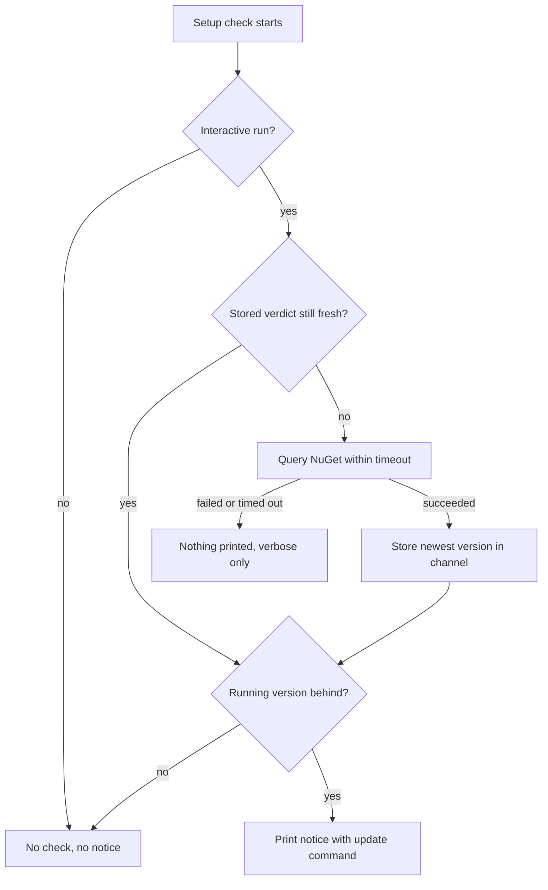
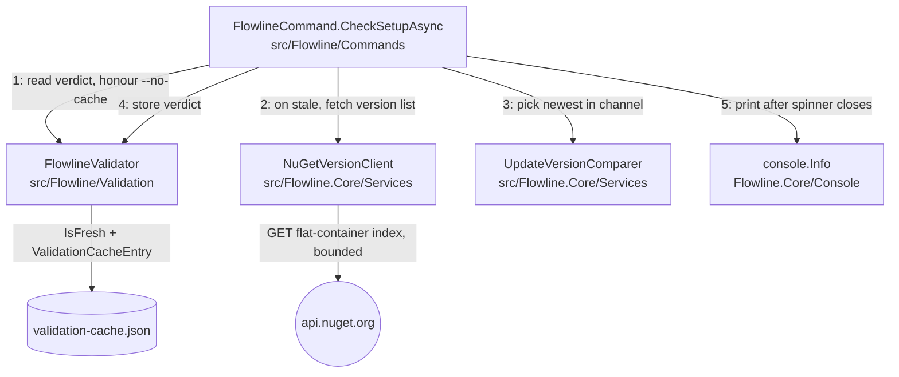

# Update Check on Startup - Plan

## Goal Capsule

- **Objective:** Tell a person running Flowline interactively that a newer version is published on NuGet, and name the command that installs it.
- **Product authority:** This plan owns detection, cadence, audience, and the notice. It does not own updating — Flowline never modifies its own install.
- **Execution profile:** Additive. No existing behaviour changes; every new path is skipped on unattended runs and on any failure.
- **Stop conditions:** Stop and ask if the work would make a command slower on a cache hit, change any exit code, or print anything on a non-interactive run. Those three are the feature's boundaries, not preferences.
- **Tail ownership:** Implementer owns `dotnet build Flowline.slnx` and `dotnet test Flowline.slnx` green, plus the CHANGELOG and wiki updates in U5.
- **Open blockers:** None. Every Outstanding Question is `Deferred to Planning`.

**Product Contract preservation:** changed — R14 and the Acceptance Examples that depended on it. Install-type detection was dropped by user decision after planning research surfaced that .NET exposes no supported install-type API; R14 now names one fixed command, and AE7 and AE8 were deleted as moot (AE1 already covers the command). The AE numbering keeps the resulting gap — IDs are stable and are never renumbered to close gaps. All other Product Contract content is unchanged.

---

## Product Contract

### Summary

Flowline checks NuGet for a newer release of itself during the setup check it already runs, and prints a one-line notice to interactive users naming the version available and the command that installs it. The check is channel-matched, runs at most once a day, and can never slow or fail a command.

### Problem Frame

Flowline ships as a `dotnet` global tool. Nothing in the install path tells a user that a newer release exists — `dotnet tool` has no notification mechanism, and a user who installed once has no reason to run `dotnet tool list -g` again. So users stay on whatever version they first installed, indefinitely, and do not update because they were never told there was anything to update to.

The cost lands where the version matters most. Flowline imports solutions into PROD; a user on a months-old build is running against fixes and guards they don't know shipped, and neither they nor anyone helping them can tell from the output that the version is the reason.

### Key Decisions

- **Interactive humans only** (session-settled: user-directed — chosen over notifying everyone: only a person can act on the notice, and a stray warning line is something an agent may spend a turn resolving). Governs R9.
- **Advise, never update** (session-settled: user-directed — chosen over self-update and over a `flowline update` command: `dotnet tool` owns the install, and swapping the binary of a tool that writes to PROD hides which code ran). Governs R14.
- **Channel-matched comparison** (session-settled: user-directed — chosen over stable-only: a prerelease tester hearing about the next prerelease is the point of shipping one). Governs R2, R4.
- **Notice in the setup step** (session-settled: user-directed — chosen over holding it until after the command's output: one place, one code path, accepting that the line scrolls out of view on long commands). Governs R11.
- **No install-type detection** (session-settled: user-directed — chosen over detecting global vs local-tool vs tool-path installs: .NET exposes no supported way to ask how a tool was installed, and the interactive-only gate already filters out the CI population where local pins concentrate). Governs R14.
- **Reuse the existing validation cache and its 1-day precedent** — the welcome screen already uses that store and cadence, so no second cache file and no new TTL concept. Governs R5, R6, R8.
- **The notice is information, not a warning** — a newer version being available does not mean the current run is degraded. Governs R16.

### Requirements

**Detection and comparison**

- R1. Flowline determines whether a newer version of its own NuGet package is published than the version currently running.
- R2. Comparison is channel-matched: a stable build compares against the newest stable version only, and a prerelease build compares against the newest published version of any kind.
- R3. The running version is the assembly's informational version with build metadata stripped, as `FlowlineVersion.Display` already produces it.
- R4. Version ordering follows semantic versioning, so a prerelease sorts below the stable release it precedes and a locally-built version ahead of everything published produces no notice.

**Cadence and caching**

- R5. Flowline queries NuGet at most once per 24 hours per machine.
- R6. Runs between queries read a stored verdict and make no network call.
- R7. `--no-cache` forces a fresh query, using the flag that already exists rather than adding one.
- R8. The stored verdict carries enough to answer without the network: the newest version found and when it was found.

**Audience and frequency**

- R9. The notice prints only when the run is interactive, using the same interactivity guard Flowline already applies to prompts and the welcome screen.
- R10. While the running version is behind, the notice prints on every interactive run — it is not shown once and then suppressed.
- R11. The notice prints from the shared setup check in `FlowlineCommand.CheckSetupAsync`, before the command's own output. A command that overrides that method does not inherit the notice, including a command that runs its own setup-shaped probe instead.

**The notice**

- R12. The notice names both the version available and the version running, so a user can tell how far behind they are.
- R13. The notice fits on one line and follows `docs/tone-of-voice.md`.
- R14. The notice names `dotnet tool update -g Flowline` in every case, without inspecting how Flowline was installed.
- R15. Version numbers and the update command appear as plain text, never conveyed only by colour or styling, per `.claude/skills/cli-for-agents/SKILL.md` §8.
- R16. The notice does not use warning or error severity and does not suggest the run is degraded.

**Failure behaviour**

- R17. A failed check — offline, DNS failure, timeout, error response, unparsable response — prints nothing on a normal run and surfaces only under `--verbose`.
- R18. A failed or slow check never changes a command's exit code and never prevents it from running.
- R19. The network call is bounded by a timeout short enough that an unreachable network is not perceptible as a delay.

### Key Flows

- F1. First interactive run of the day, newer version published
  - **Trigger:** An interactive user runs any command whose setup check runs, and the stored verdict is older than 24 hours.
  - **Steps:** Setup check queries NuGet within the timeout; the newest version in the user's channel is compared against the running version; the verdict is stored; the notice prints.
  - **Outcome:** User sees the available version, their own version, and the command to run.
  - **Covered by:** R1, R2, R3, R4, R5, R8, R9, R11, R12, R13, R14
- F2. Later run the same day
  - **Trigger:** Any subsequent interactive run while the stored verdict is under 24 hours old.
  - **Steps:** The stored verdict is read; no network call is made; the notice prints again because the running version is still behind.
  - **Outcome:** Same notice, no added latency.
  - **Covered by:** R6, R8, R10
- F3. Network unreachable
  - **Trigger:** The stored verdict is stale and NuGet cannot be reached.
  - **Steps:** The call fails or hits the timeout; nothing is printed; the command continues unaffected.
  - **Outcome:** The user sees the command they asked for, with no indication anything was attempted.
  - **Covered by:** R17, R18, R19

### Acceptance Examples

- AE1. Stable user behind
  - **Covers R2, R12, R14.**
  - **Given** the running version is a stable release and a newer stable release is published,
  - **When** an interactive command runs,
  - **Then** the notice names the newer version, the running version, and `dotnet tool update -g Flowline`.
- AE2. Stable user, newer prerelease only
  - **Covers R2.**
  - **Given** the running version is the newest stable release and the only newer version published is a prerelease,
  - **When** an interactive command runs,
  - **Then** no notice prints.
- AE3. Prerelease tester behind
  - **Covers R2, R4.**
  - **Given** the running version is a prerelease and a newer prerelease is published,
  - **When** an interactive command runs,
  - **Then** the notice names the newer prerelease.
- AE4. Prerelease superseded by its stable release
  - **Covers R4.**
  - **Given** the running version is a prerelease and the stable release it precedes is now published,
  - **When** an interactive command runs,
  - **Then** the notice names the stable release.
- AE5. Local build ahead of everything published
  - **Covers R4.**
  - **Given** the running version sorts above every published version,
  - **When** an interactive command runs,
  - **Then** no notice prints.
- AE6. Unattended run
  - **Covers R9.**
  - **Given** the run is not interactive and a newer version is published,
  - **When** any command runs,
  - **Then** no notice prints and no network call is made.
- AE9. Offline
  - **Covers R17, R18, R19.**
  - **Given** the stored verdict is stale and NuGet is unreachable,
  - **When** an interactive command runs,
  - **Then** nothing about the check prints, the command's exit code is unchanged, and the added delay is bounded by the timeout.
- AE10. Forced refresh
  - **Covers R7.**
  - **Given** a stored verdict less than 24 hours old,
  - **When** an interactive command runs with `--no-cache`,
  - **Then** NuGet is queried again and the stored verdict is replaced.

### Success Criteria

- A user who is behind learns about it within one day of the release landing, on their next interactive run.
- Runs that read a stored verdict have no measurable added latency; runs with no network reachable are delayed only by the timeout.

### Scope Boundaries

- **No self-update.** Flowline never modifies its own install, and no `flowline update` command is added — per the "advise, never update" decision above.
- **No opt-in for unattended runs.** No environment variable or flag turns the notice on for CI or agents — per the "interactive humans only" decision above.
- **No install-type detection.** Accepted gap: someone running Flowline from a locally-pinned `.config/dotnet-tools.json` who runs the printed command installs a second, global copy while their pinned copy stays put. Per the "no install-type detection" decision above.
- **No version gating.** Flowline never refuses to run, warns harder, or changes behaviour because a version is old.
- **No release notes or changelog fetching.** The notice names versions and a command; it does not fetch, link, or render what changed.
- **No new output-suppression surface.** `--quiet` and `--json` remain absent and are not introduced here.
- **No clock abstraction.** `TimeProvider` or an injectable clock is not introduced — per KTD6.
- **No shared NuGet client.** `XrmContextToolProvider` is not refactored — per KTD7.
- **`slnadd` and `generate --standalone` do not notify.** `SlnAddCommand` overrides the setup check to a no-op and `GenerateCommand` skips the base check in standalone mode, so neither reaches the notice. Accepted rather than worked around.

### Dependencies / Assumptions

- Flowline already calls the nuget.org flat-container API — `src/Flowline/Services/XrmContextToolProvider.cs:172-195` uses it to list versions of a different package. This work is a second caller of an existing pattern, not new network capability.
- The package id is `Flowline` (`src/Flowline/Flowline.csproj`), and the release workflow publishes only on stable `X.Y.Z` tags today (`.github/workflows/release.yml:6-7`). Prereleases are expected later, which is why R2 exists now.
- `CiPlatform.Detect()` exists (`src/Flowline.Core/Services/CiPlatform.cs:15`) but is not used here — the interactivity guard is already false under every CI platform it detects, so a second gate would never fire independently.
- The check sends nothing about the user. It is an anonymous GET for a public package index, not telemetry. `STRATEGY.md:115` defers opt-in telemetry as a separate product decision, and this work does not open that door or pre-empt it.

### Outstanding Questions

**Deferred to Planning**

- Confirm against a real existing cache file that a new field deserializes additively rather than tripping the schema gate. KTD3 assumes it from the code path, not from an executed test, and getting it wrong silently wipes every user's cache on first run. U3 owns this check.
- The exact timeout value satisfying R19. KTD4 sets a starting point; U2 confirms it against a real slow-network run.
- Exact notice wording, subject to `docs/tone-of-voice.md` and R13, R16. U4 owns it.

### Sources / Research

- `src/Flowline/Commands/FlowlineCommand.cs:71-131` — `ExecuteAsync` calls `CheckSetupAsync` on every non-overriding command; the setup spinner always runs even when the individual probes are cached; the welcome screen at `:88` is the existing interactive-plus-TTL precedent.
- `src/Flowline/Commands/SlnAddCommand.cs:60` — overrides `CheckSetupAsync` to a completed task.
- `src/Flowline/Commands/GenerateCommand.cs:79-93` — calls the base check except in standalone mode, where it probes only PAC CLI.
- `src/Flowline/Validation/ValidationCache.cs:5-20` — `ValidationCache` shape and the generic `ValidationCacheEntry<T>` with `CheckedAtUtc` and `Value`.
- `src/Flowline/Validation/ValidationCacheStore.cs:26-51` — load/save and the schema-version gate.
- `src/Flowline/Validation/FlowlineValidator.cs:11-15, 170-181, 213` — TTL constants, the `ShouldShowWelcomeScreen` cached-check template this work mirrors, and the `IsFresh` helper.
- `src/Flowline/Services/XrmContextToolProvider.cs:13-14, 172-195` — the flat-container index URL and the existing version-list fetch and parse.
- `src/Flowline/Program.cs:57-78` — service registration, including the singleton `HttpClient` at `:62`.
- `src/Flowline.Core/Console/FlowlineConsoleExtensions.cs:7-31` — `Ok`, `Info`, `Skip`, `Warning`, `Error`, `Verbose` and the other console helpers.
- `tests/Flowline.Tests/ValidationCacheTests.cs:186-195` — how TTL expiry is tested today, against real system time with pre-aged entries.
- `docs/solutions/architecture-patterns/verbose-output-render-hook-routing.md` — verbose output goes through `VerboseRenderable`, never a hand-rolled `if (verbose)` branch.
- `docs/solutions/architecture-patterns/ai-agent-consumable-cli-contract-2026-06-07.md` — startup checks emit notices and never change the exit code.
- `docs/solutions/runtime-errors/spectre-console-status-prompt-exclusivity.md` — Spectre live displays are mutually exclusive with other console interaction; write outside the spinner lambda.
- `docs/tone-of-voice.md` — prefix glyphs and personality pillars governing R13 and R16.
- `.claude/skills/cli-for-agents/SKILL.md` — §8 governs R15; §1's interactivity guard is the mechanism behind R9.

---

## Planning Contract

### Key Technical Decisions

- KTD1. **Add `NuGet.Versioning` for version parsing and ordering** (session-settled: user-approved — chosen over a hand-rolled comparer: nuget.org's own ordering is defined by this library, so "newer" means exactly what the source of truth means, and prerelease identifier rules are ~40 lines that are easy to get subtly wrong). Register in `Directory.Packages.props` under the Production group. Governs R2, R4. Naive string comparison is specifically rejected: `"0.9.0"` sorts above `"0.10.0"` lexically.
- KTD2. **Channel is a property of the running version, not a setting.** `NuGetVersion.IsPrerelease` on the running version selects the candidate set: false → stable published versions only; true → all published versions. No flag, no config key. Governs R2.
- KTD3. **Extend `ValidationCache` with one nullable field rather than a new cache file or a schema bump.** `ValidationCacheStore.Load()` discards the cache only when `SchemaVersion` differs (`ValidationCacheStore.cs:35`), and a property absent from an older file deserializes to its default. U3 verifies this against a real cache file before relying on it. Governs R6, R8.
- KTD4. **The network call is bounded by a `CancellationTokenSource` timeout, starting at 2 seconds**, linked to the command's own token. Every failure — timeout, transport error, non-success status, unparsable body — is caught and treated identically as "no verdict". Governs R17, R18, R19.
- KTD5. **Failure output wraps in `VerboseRenderable` and goes through the render-hook pipeline**, per `docs/solutions/architecture-patterns/verbose-output-render-hook-routing.md`. No `if (settings.Verbose)` branch. Governs R17.
- KTD6. **No clock abstraction.** TTL tests pre-age a cache entry with a hardcoded offset, mirroring `ValidationCacheTests.cs:186-195`. Introducing `TimeProvider` for one TTL would be a repo-wide change this plan does not own.
- KTD7. **A second caller of nuget.org, not a shared client.** `XrmContextToolProvider` keeps its own fetch. The two differ in what they need — that one downloads a package and needs the latest stable; this one needs an ordered version list and no download — so extracting a common client would abstract over one shared line.
- KTD8. **Engine code lives in `src/Flowline.Core/Services/`; cache and orchestration stay in `src/Flowline/`.** The version client and comparer need no terminal, so the project boundary rule in `AGENTS.md` places them in Core. The cached-verdict methods go on `FlowlineValidator` beside `ShouldShowWelcomeScreen`, and orchestration sits in `FlowlineCommand` — which keeps `HttpClient` out of `FlowlineValidator.Default`.
- KTD10. **`NuGetVersionClient` reaches `CheckSetupAsync` through the base constructor**, which means adding a parameter to `FlowlineCommand<TSettings>` and forwarding it from all nine subclasses (session-settled: user-directed — chosen over the static-default-instance pattern at `src/Flowline/Validation/ValidationProbes.cs:14-16`, which `FlowlineValidator.Default` uses to avoid exactly this wiring: the user accepted the nine-file edit now and deferred the wiring refactor). The alternative stays on the table as a later refactor; do not adopt it here.
- KTD11. **Network-derived text is escaped before it reaches Spectre markup.** `Markup.Escape` wraps the version string in the notice, matching every other dynamic-text call site in the repo. Governs R13, R15.
- KTD9. **The cache read, fetch, and store run inside the existing setup spinner; the notice prints after the spinner lambda returns.** Inside the spinner the user sees activity during the network wait instead of a silent pause. The notice goes outside because Spectre live displays own the terminal while active, per `docs/solutions/runtime-errors/spectre-console-status-prompt-exclusivity.md`. Governs R11. This is the sole statement of the placement rule; U4 cites it.

### High-Level Technical Design

`CheckSetupAsync` orchestrates. The validator owns the cache; Core owns the network and the comparison; neither knows about the other.

Steps 1 to 4 run inside the existing status spinner and step 5 runs after it, per KTD9. The notice lands beside the existing `Console.Ok("Prerequisites all good, let's go!")` at `FlowlineCommand.cs:130`.

### Assumptions

- The flat-container index returns every published version of a package, prereleases included, so channel filtering happens client-side. `XrmContextToolProvider.cs:187` filters prereleases out of the same response shape, which is evidence the response carries them.
- The singleton `HttpClient` registered at `Program.cs:62` is reusable here; no separate client or `IHttpClientFactory` is introduced.
- `tests/Flowline.Core.Tests/` can host tests that use a fake `HttpMessageHandler`. If that project cannot reference what the tests need, the tests move to `tests/Flowline.Tests/` and U2's file paths change.

### Sequencing

U1 and U2 are independent and can land in either order. U3 is independent of both. U4 depends on all three. U5 depends on U4.

---

## Implementation Units

### U1. Channel-matched version comparison

- **Goal:** Given the running version and a list of published versions, return the newest version the user should be told about, or nothing.
- **Requirements:** R1, R2, R4. Implements KTD1, KTD2.
- **Dependencies:** none
- **Files:**
  - `Directory.Packages.props` — add `NuGet.Versioning` to the Production group
  - `src/Flowline.Core/Flowline.Core.csproj` — add the `PackageReference`
  - `src/Flowline.Core/Services/UpdateVersionComparer.cs` — new
  - `tests/Flowline.Core.Tests/UpdateVersionComparerTests.cs` — new
- **Approach:**
  1. Parse the running version with `NuGetVersion.TryParse`; on failure return nothing rather than throwing.
  2. Read `IsPrerelease` on the running version to pick the candidate set, per KTD2.
  3. Parse each published version, discard unparsable entries, order with `VersionComparer.VersionRelease`, take the maximum.
  4. Return it only when it sorts strictly above the running version.
- **Patterns to follow:** `src/Flowline.Core/Services/CiPlatform.cs` for the shape of a small static Core service with no dependencies.
- **Test scenarios:**
  - Covers AE1. Running `0.16.0`, published `["0.15.0","0.16.0","0.17.0"]` → returns `0.17.0`.
  - Covers AE2. Running `0.16.0`, published `["0.16.0","0.17.0-beta.1"]` → returns nothing.
  - Covers AE3. Running `0.17.0-beta.1`, published `["0.16.0","0.17.0-beta.1","0.17.0-beta.2"]` → returns `0.17.0-beta.2`.
  - Covers AE4. Running `0.17.0-beta.1`, published `["0.17.0-beta.1","0.17.0"]` → returns `0.17.0`.
  - Covers AE5. Running `0.16.1-alpha.0.46`, published `["0.16.0"]` → returns nothing.
  - Running `0.9.0`, published `["0.10.0"]` → returns `0.10.0`. This is the case naive string comparison gets wrong and the reason KTD1 exists.
  - Published list contains an unparsable entry alongside valid ones → the unparsable entry is ignored, the valid maximum is returned.
  - Published list is empty → returns nothing.
  - Running version is unparsable → returns nothing, no exception.
- **Verification:** `dotnet test tests/Flowline.Core.Tests/Flowline.Core.Tests.csproj --filter UpdateVersionComparer` passes.

### U2. NuGet version-list client

- **Goal:** Fetch the published version list for a package from the flat-container index, bounded by a timeout, returning nothing on any failure.
- **Requirements:** R1, R17, R18, R19. Implements KTD4, KTD7.
- **Dependencies:** none
- **Files:**
  - `src/Flowline.Core/Services/NuGetVersionClient.cs` — new
  - `tests/Flowline.Core.Tests/FakeHttpMessageHandler.cs` — new test helper
  - `tests/Flowline.Core.Tests/NuGetVersionClientTests.cs` — new
- **Approach:**
  1. `GET https://api.nuget.org/v3-flatcontainer/{packageId}/index.json`, parsing the `versions` array with `JsonDocument`, mirroring `XrmContextToolProvider.cs:172-195`.
  2. Return the raw version strings unfiltered — channel selection belongs to U1, not here.
  3. Wrap the call in a `CancellationTokenSource` linked to the caller's token, timing out per KTD4.
  4. Catch every failure and return nothing. Do not throw `FlowlineException`; this is the one NuGet caller whose failure is not an error.
- **Execution note:** The failure paths are the point of this unit and are easy to leave untested. Write the fake handler and its failure cases first, then the success path.
- **Patterns to follow:** `src/Flowline/Services/XrmContextToolProvider.cs:172-195` for request and parse shape. Diverge on error handling — that method throws, this one must not.
- **Test scenarios:**
  - Well-formed index response → returns the version strings in the order the response carried them.
  - Handler returns 404 → returns nothing, no exception.
  - Handler returns 500 → returns nothing, no exception.
  - Handler returns 200 with a body that is not JSON → returns nothing, no exception.
  - Handler returns 200 with JSON lacking a `versions` property → returns nothing, no exception.
  - Handler throws `HttpRequestException` (simulating offline) → returns nothing, no exception.
  - Covers AE9. Handler blocks until its cancellation token is signalled → the client cancels it and returns nothing. Assert the token was signalled, not elapsed wall-clock time; a timing bound is flaky on a loaded runner and there is no clock abstraction (KTD6).
  - Caller's own token is already cancelled → returns nothing without dispatching a request.
- **Verification:** `dotnet test tests/Flowline.Core.Tests/Flowline.Core.Tests.csproj --filter NuGetVersionClient` passes, including the cancellation test.

### U3. Cache the update verdict

- **Goal:** Store and read the newest-known version on a 1-day TTL, honouring `--no-cache`, without wiping existing caches.
- **Requirements:** R5, R6, R7, R8. Implements KTD3, KTD6.
- **Dependencies:** none
- **Files:**
  - `src/Flowline/Validation/ValidationCache.cs` — add the verdict field
  - `src/Flowline/Validation/FlowlineValidator.cs` — add the TTL constant and the read/write methods
  - `tests/Flowline.Tests/ValidationCacheTests.cs` — extend
- **Approach:**
  1. Add one `ValidationCacheEntry<string?>?` field to `ValidationCache` beside `WelcomeShownAtUtc`, holding the newest published version in the running channel — null value meaning "checked, nothing newer".
  2. Add an `UpdateCheckTtl` of one day next to the existing constants at `FlowlineValidator.cs:11-15`.
  3. Add a read method returning whether a fresh verdict exists and what it is, using `IsFresh` and returning stale immediately when `noCache` is set — the shape of `ShouldShowWelcomeScreen` at `:170-181`, split into read and write so the network call sits between them.
  4. Add a write method that stamps `CheckedAtUtc` and saves.
- **Execution note:** Before writing the field, load a cache file produced by the current build and confirm it deserializes with the new property absent. This is the Outstanding Question this unit owns; a schema-gate trip silently wipes every user's cache.
- **Patterns to follow:** `ShouldShowWelcomeScreen` and `IsFresh` in `src/Flowline/Validation/FlowlineValidator.cs`; the temp-directory fixture at `tests/Flowline.Tests/ValidationCacheTests.cs:9-16`.
- **Test scenarios:**
  - A pre-existing cache file written without the new field loads without resetting `SchemaVersion` or discarding `ToolChecks`.
  - No verdict stored → read reports stale.
  - Verdict stored 2 hours ago → read reports fresh and returns the stored version.
  - Verdict stored 25 hours ago → read reports stale.
  - Covers AE10. Verdict stored 2 hours ago with `noCache` set → read reports stale.
  - Verdict stored with a null value ("nothing newer") and a fresh timestamp → read reports fresh and returns null, and does not present as "never checked".
  - Write then read round-trips the version string and a timestamp within seconds of now.
- **Verification:** `dotnet test tests/Flowline.Tests/Flowline.Tests.csproj --filter ValidationCache` passes, including the pre-existing-file case.

### U4. Wire the check into the setup step and print the notice

- **Goal:** Run the check on interactive runs only, and print one line when the running version is behind.
- **Requirements:** R3, R9, R10, R11, R12, R13, R14, R15, R16, R17, R18. Implements KTD5, KTD8.
- **Dependencies:** U1, U2, U3
- **Files:**
  - `src/Flowline/Program.cs` — register `NuGetVersionClient`
  - `src/Flowline/Commands/FlowlineCommand.cs` — new base-constructor parameter, orchestrate in `CheckSetupAsync`
  - The nine subclasses, each taking the new parameter and forwarding it to base — `CloneCommand.cs`, `DeployCommand.cs`, `DriftCommand.cs`, `GenerateCommand.cs`, `InitCommand.cs`, `ProvisionCommand.cs`, `PushCommand.cs`, `SlnAddCommand.cs`, `SyncCommand.cs`, all under `src/Flowline/Commands/`. `StatusCommand.cs` does not inherit `FlowlineCommand<TSettings>` and is untouched.
  - `tests/Flowline.Tests/UpdateNoticeTests.cs` — new
- **Approach:**
  1. Gate the whole check on `Console.Profile.Capabilities.Interactive`, the guard already used at `FlowlineCommand.cs:88`. A non-interactive run does no cache read and no network call.
  2. Read the cached verdict; on stale, fetch and store. Placement relative to the spinner is fixed by KTD9.
  3. Compare via U1 against `FlowlineVersion.Display` and print with `console.Info` beside the existing `Console.Ok` at `:130`. Wrap the network-derived version string in `Markup.Escape` before interpolating, matching `src/Flowline/Services/ProfileResolutionService.cs:126` and `src/Flowline/Services/WebResourceExecutor.cs:134`.
  4. Route any failure detail through `VerboseRenderable` per KTD5.
  5. Wrap the orchestration so no exception escapes into `ExecuteAsync`.
- **Execution note:** Verify wording and glyph against a Release build — a Debug build propagates exceptions and misrepresents error handling, per `AGENTS.md`.
- **Patterns to follow:** the welcome-screen gate at `FlowlineCommand.cs:88`; `console.Info` in `src/Flowline.Core/Console/FlowlineConsoleExtensions.cs`; `docs/tone-of-voice.md` for wording.
- **Test scenarios:**
  - Covers AE6. Non-interactive console with a newer version available → nothing printed, and the version client is never called.
  - Covers AE1. Interactive console, running version behind → one line naming both versions and `dotnet tool update -g Flowline`.
  - Covers AE1, R15. The printed line carries both version numbers and the command as plain text, so a reader with styling stripped loses nothing.
  - Covers R10. Two consecutive interactive runs with a fresh cached verdict → the notice prints both times.
  - Covers R16. The notice does not use the warning or error helper and carries no warning glyph.
  - Covers AE9, R18. Version client returns nothing → no notice, and the command's exit code is unchanged.
  - The version client throws unexpectedly → no notice, no rethrow, and the command still completes.
  - A version string containing Spectre markup control characters → the notice renders as literal text and `MarkupLine` does not throw.
  - Covers R11. A command overriding `CheckSetupAsync` produces no notice.
- **Verification:** `dotnet test tests/Flowline.Tests/Flowline.Tests.csproj --filter UpdateNotice` passes; a Release build run by hand against a doctored cache prints the expected line.

### U5. Document the behaviour

- **Goal:** Record the new user-visible behaviour where users and contributors will find it.
- **Requirements:** none directly — this unit satisfies the documentation clause of `AGENTS.md` "Definition of done".
- **Dependencies:** U4
- **Files:**
  - `CHANGELOG.md`
  - `../Flowline.wiki/Getting-Started.md` — the install and update section. This path deliberately escapes the repo root: the GitHub wiki is a sibling checkout, per `AGENTS.md`. It is the one path in this plan that is not repo-relative, and that is not a mistake.
- **Approach:** Add a CHANGELOG entry under the unreleased heading describing the notice and its interactive-only scope. Add a short wiki paragraph under install covering what the notice looks like, that it appears at most once a day, and that Flowline never updates itself.
- **Test expectation:** none — documentation only.
- **Verification:** Both files updated. If the wiki checkout at `../Flowline.wiki/` is absent, report that rather than skipping silently or creating a replacement folder, per `AGENTS.md`.

---

## Verification Contract

| Gate | Command | Applies to |
|---|---|---|
| Build | `dotnet build Flowline.slnx` | U1–U4 |
| Core tests | `dotnet test tests/Flowline.Core.Tests/Flowline.Core.Tests.csproj` | U1, U2 |
| CLI tests | `dotnet test tests/Flowline.Tests/Flowline.Tests.csproj` | U3, U4 |
| Full suite | `dotnet test Flowline.slnx` | before finishing |
| Release output check | `dotnet build Flowline.slnx -c Release`, then run a command by hand with a doctored cache | U4 |

Quality gates beyond the test run:

- No command is slower on a cache hit. The cached path makes no network call at all — assert it in U4 by leaving the version client unconfigured and confirming it is never invoked.
- No exit code changes. Every new failure path returns normally.
- Notice wording passes `docs/tone-of-voice.md`; run `/tone` over the changed files if the command is available, otherwise review against the guide directly.

---

## Definition of Done

**Global**

- `dotnet build Flowline.slnx` and `dotnet test Flowline.slnx` pass.
- Every requirement R1–R19 is either implemented by a unit or explicitly recorded in Scope Boundaries.
- The notice never prints on a non-interactive run, never changes an exit code, and never adds a network call on a cache hit.
- An existing `validation-cache.json` from the previous build still loads after the change, with its tool checks intact.
- CHANGELOG and the wiki install section are updated, or their absence is reported.
- No abandoned experimental code remains — no unused comparer variant, no dead fake handler, no leftover timeout constant from a discarded approach.

**Per unit**

- U1. Comparison returns the right answer for every listed scenario, including the double-digit-minor case.
- U2. Every failure mode returns nothing without throwing, and the timeout test proves the bound.
- U3. A cache file from the previous build survives the new field; TTL and `--no-cache` behave per the scenarios.
- U4. Interactive and non-interactive runs behave per the scenarios; the printed line reads correctly in a Release build.
- U5. Both documents updated, or the wiki gap reported.
